# 1、Swagger2

​	相信无论是前端还是后端开发，都或多或少地被接口文档折磨过。`前端经常抱怨后端给的接口文档与实际情况不一致。后端又觉得编写及维护接口文档会耗费不少精力，经常来不及更新。其实无论是前端调用后端，还是后端调用后端，热期望有一个好的接口文档`。但是这个接口文档对于程序员来说，就跟注释一样，经常会抱怨别人写的代码没有写注释，然而自己写起代码起来，最讨厌的，也是写注释。所以仅仅只通过强制来规范大家是不够的，随着时间推移，版本迭代，接口文档往往很容易就跟不上代码了。


​	发现了痛点就要去找解决方案。解决方案用的人多了，就成了标准的规范，这就是Swagge的由来。通过这套规范，你只需要按照它的规范去定义接口及接口相关的信息。再通过Swaggerf衍生出来的一系列项目和工具，就可以做到生成各种格式的接口文档，生成多种语言的客户端和服务端的代码，以及在线接口调试页面等等。这样，如果按照新的开发模式，在开发新版本或者迭代版本的时候，只需要更新Swagger描述文件，就可以自动生成接口文档和客户端服务端代码，做到调用端代码、服务端代码以及接口文档的一致性。


​	但即便如此，对于许多开发来说，编写这个yml或json格式的描述文件，本身也是有一定负担的工作，特别是在后面持续迭代开发的时候，往往会忽略更新这个描述文件，直接更改代码。久而久之，这个描述文件也和实际项目渐行渐远，基于该描述文件生成的接口文档也失去了参考意义。**所以作为Java届服务端的大一统框架Spring,迅速将Swagger规范纳入自身的标准，建立了Spring-swaggerI项目，后面改成了现在的Springfox.。通过在项目中引入Springfox,可以扫描相关的代码，生成该描述文件，进而生成与代码一致的接口文档和客户端代码**。这种通过代码生成接口文档的形式，在后面需求持续迭代的项目中，显得尤为重要和高效。


> 总结：Swagger就是一个**用来定义接口标准，接口规范，同时能根据你的代码自动生成接口说明文档的一个工具**

Swagger作用:

- 将项目中所有的接口展现在页面上，这样后端程序员就不需要专门为前端使用者编写专门的接口文档
- 当接口更新之后，只需要修改代码中的 Swagger 描述就可以实时生成新的接口文档了，从而规避了接口文档老旧不能使用的问题
- 通过 Swagger 页面，我们可以直接进行接口调用，降低了项目开发阶段的调试成本

## 1.1、官方工具

- 官网:https://swagger.io/

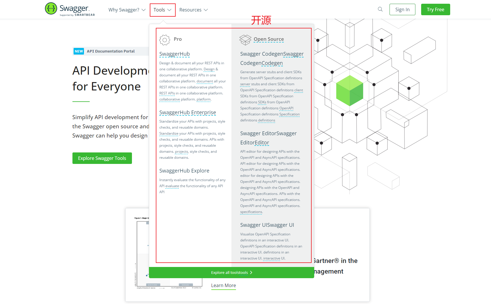

- Swagger Codegen：通过 Codegen 可以将描述文件生成html格式和cwiki形式的接口文档，同时也能生成多钟语言的服务端和客户端的代码。支持通过jar包，docker，node等方式在本地化执行生成。也可以在后面的Swagger Editor中在线生成。
- Swagger UI:提供了一个可视化的UI页面展示描述文件。接口的调用方、测试、项目经理等都可以在该页面中对相关接口进行查阅和做一些简单的接口请求。该项目支持在线导入描述文件和本地部署UI项目。
- Swagger Editor:类似于markendown编辑器的编辑Swagger描述文件的编辑器，该编辑支持实时预览描述文件的更新效果。也提供了在线编辑器和本地部署编辑器两种方式
- Swagger Inspector:感觉和postman差不多，是一个可以对接口进行测试的在线版的postman。比在Swagger UI里面做接口请求，会返回更多的信息，也会保存你请求的实际请求参数等数据
- Swagger Hub:集成了上面所有项目的各个功能，你可以以项目和版本为单位，将你的描述文件上传到Swagger Hub中。在Swagger Hub中可以完成上面项目的所有工作，需要注册账号，分免费版和收费版。


## 1.2、SpringBoot整合Swagger2

1. 创建SpringBoot项目

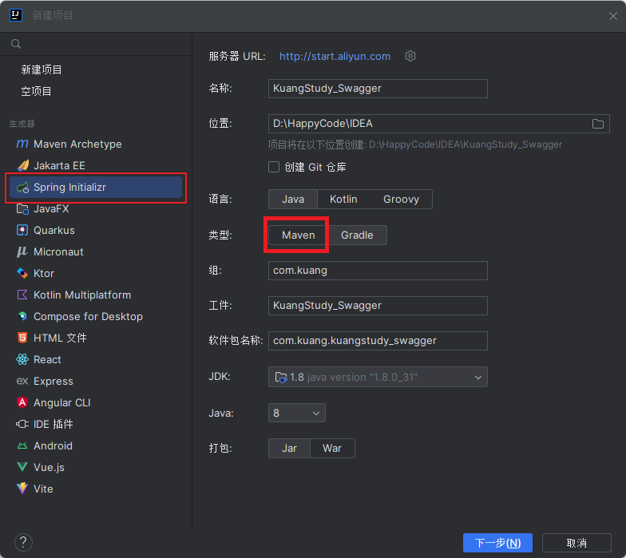

2. 勾选 `Lombok` 和 `Spring Web`

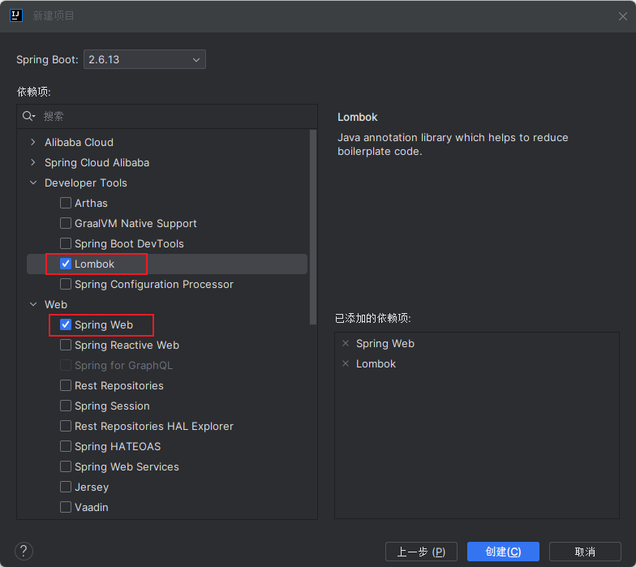


3. 引入Swagger3依赖

```xml
<!-- https://mvnrepository.com/artifact/io.springfox/springfox-swagger2 -->
<dependency>
    <groupId>io.springfox</groupId>
    <artifactId>springfox-swagger2</artifactId>
    <version>2.9.2</version>
</dependency>
<!-- https://mvnrepository.com/artifact/io.springfox/springfox-swagger-ui -->
<dependency>
    <groupId>io.springfox</groupId>
    <artifactId>springfox-swagger-ui</artifactId>
    <version>2.9.2</version>
</dependency>
```

这里用的是 springfox，**Swagger** 可以看作是一个遵循了 OpenAPI 规范的一项技术，而 springfox则是这项技术的具体实现

4. 编写 Swagger 配置类:**这个配置类基本都是不变的**

```java
@Configuration
@EnableSwagger2
public class SwaggerConfig {

    @Bean
    public Docket createRestApi(){
        return new Docket(DocumentationType.SWAGGER_2)
                .pathMapping("/")
                .select()
                // 扫描哪个接口的包
                .apis(RequestHandlerSelectors.basePackage("com.kuang.controller"))
                .paths(PathSelectors.any())
                .build().apiInfo(new ApiInfoBuilder()
                        .title("标题: SpringBoot 整合 Swagger 使用")
                        .description("详细信息: SpringBoot 整合 Swagger,详细信息......")
                        // 版本信息
                        .version("1.1")
                        // 开发文档的联系人
                        .contact(new Contact("Augenestern", "https://blog.csdn.net/Augenstern_QXL","2487422771@qq.com"))
                        // 接口的license规范
                        .license("Augenestern License")
                        .licenseUrl("https://blog.csdn.net/Augenstern_QXL")
                        .build());
    }
}
```


4. 运行项目

5. 访问Swagger的UI界面: http://localhost:8080/swagger-ui.html

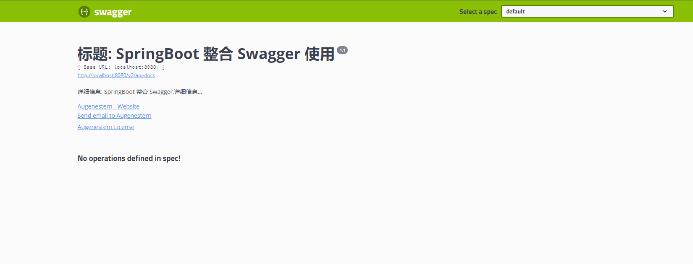


## 1.3、Swagger2简单使用

1. 编写controller接口

```java
@RestController
@RequestMapping("/user")
public class HelloController {

    @GetMapping("/findAll")
    public Map<String,Object> findAll(){
        Map<String, Object> map = new HashMap<>();
        map.put("success", "查询所有数据成功");
        map.put("status", true);
        return map;
    }
}
```

2. 重启项目
3. 访问Swagger的UI界面: http://localhost:8080/swagger-ui.html，点击`Try it out` - `Execute` 执行

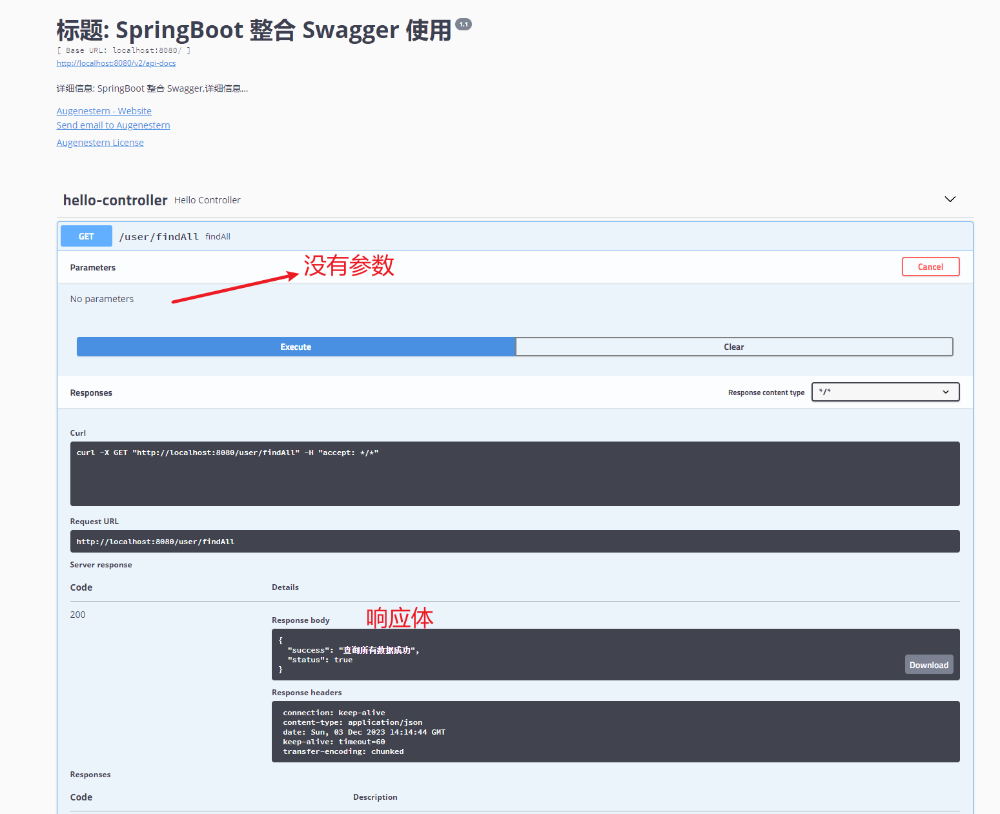


> 踩坑记录:
>
> - 解决 高版本SpringBoot整合Swagger 启动报错:https://blog.csdn.net/weixin_39792935/article/details/122215625
> - swagger显示ui页面但是不显示接口信息相关问题解决:https://zhuanlan.zhihu.com/p/33801151


## 1.4、Swagger2注解

### 1.4.1、@Api

- 作用: 用来指定接口的描述文字
- 修饰范围: 用在类上
- 参数
  - `tags="说明该类的作用，可以在UI界面上看到的注解"`

```java
@RestController
@RequestMapping("/user")
@Api(tags="你好服务的注解")
public class HelloController {
    // ...
}
```


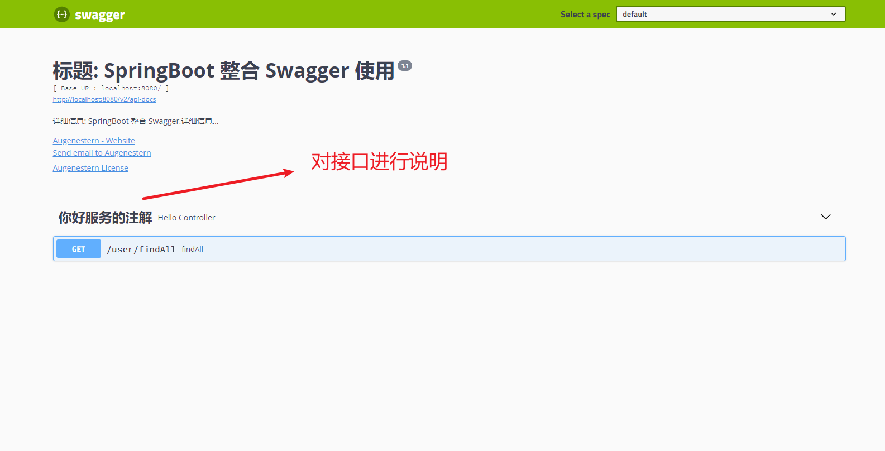

### 1.4.2、@ApiOperation

- 作用: 说明方法的用途、作用
- 修饰范围: 用在请求的方法上
- 参数
  - `value="说明方法的用途、作用"`
  - `notes="方法的备注说明"`

```java
@RestController
@RequestMapping("/user")
@Api(tags="你好服务的注解")
public class HelloController {

    @GetMapping("/findAll")
    @ApiOperation(value="查询所有用户的接口",notes="<span style='color:red;'>描叙:</span>&nbsp;&nbsp;用来查询所有用户信息的接口")
    public Map<String,Object> findAll(){
        Map<String, Object> map = new HashMap<>();
        map.put("success", "查询所有数据成功");
        map.put("status", true);
        return map;
    }
}
```

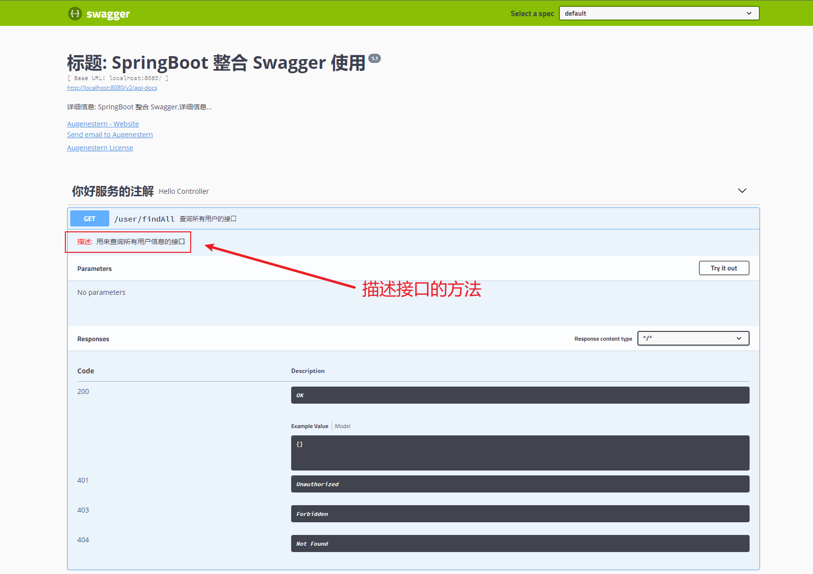


### 1.4.3、@ApiImplicitParams

- 作用: 用来对接口中参数进行说明
- 修饰范围: 用在方法上
- 参数
  - name: 参数名
  - value: 参数的汉字说明、解释
  - required: 参数是否必须传
  - paramType: 参数放在哪个地方
    - header -> 请求参数的获取： `@RequestHeader`
    - query -> 请求参数的获取
  - dataType: 参数类型,默认 String ,其他示例: `dataType="Integer"`
  - defaultValue: 参数的默认值

#### 1、query风格传参

示例:**如果是地址栏传递的参数(也就是query的形式传参),进行的配置如下**

```java
@PostMapping("save")
@ApiOperation(value = "保存用户信息接口",
        notes = "<span style='color:red;'>描述:</span>&nbsp;&nbsp;用来保存用户信息的接口")
@ApiImplicitParams({
        @ApiImplicitParam(name = "id", value = "用户 id", dataType = "String", defaultValue = "1"),
        @ApiImplicitParam(name = "name", value = "用户姓名", dataType = "String", defaultValue = "林小秦")
})
public Map<String, Object> save(String id, String name) {
    System.out.println("id = " + id);
    System.out.println("name = " + name);
    Map<String, Object> map = new HashMap<>();
    map.put("id", id);
    map.put("name", name);
    return map;
}
```

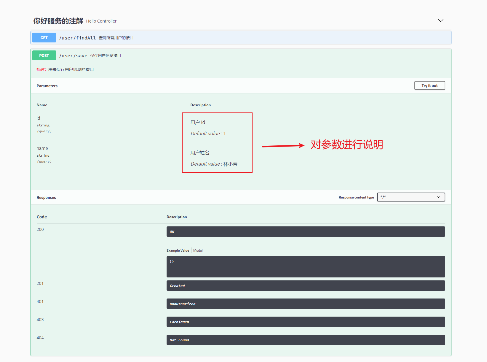

#### 2、RestFul风格传参

如果是 RestFul 风格进行传参,则必须再添加一个 `paramType="path"`

```java
@PostMapping("save/{id}/{name}")
@ApiOperation(value = "保存用户信息接口",
        notes = "<span style='color:red;'>描述:</span>&nbsp;&nbsp;用来保存用户信息的接口")
@ApiImplicitParams({
        @ApiImplicitParam(name = "id", value = "用户 id", dataType = "String", defaultValue = "1",paramType = "path"),
        @ApiImplicitParam(name = "name", value = "用户姓名", dataType = "String", defaultValue = "林小秦",paramType = "path")
})
public Map<String, Object> save(@PathVariable("id") String id, @PathVariable("name") String name) {
    System.out.println("id = " + id);
    System.out.println("name = " + name);
    Map<String, Object> map = new HashMap<>();
    map.put("id", id);
    map.put("name", name);
    return map;
}
```

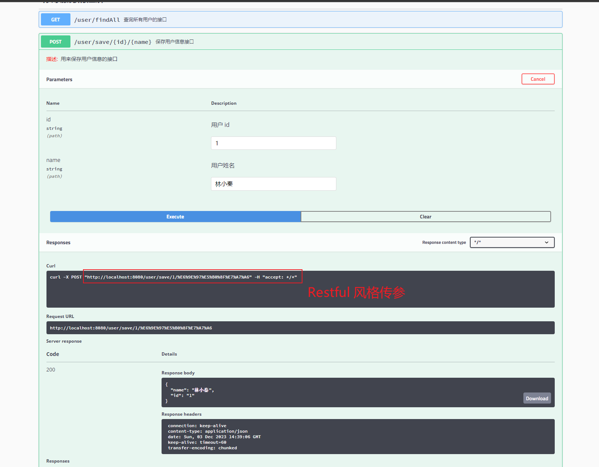

#### 3、RequestBody传参

如果是 RequestBody 的方式传参，需要定义一个对象进行接收

1. 定义一个User对象

```java
@Data
@AllArgsConstructor
@NoArgsConstructor
public class User {
    private String id;
    private String name;
}
```


2. 编写Controller

```java
@PostMapping("save")
@ApiOperation(value = "保存用户信息接口",
        notes = "<span style='color:red;'>描述:</span>&nbsp;&nbsp;用来保存用户信息的接口")
public Map<String, Object> save(@RequestBody User user) {
    System.out.println("id = " + user.getId());
    System.out.println("name = " + user.getName());
    Map<String, Object> map = new HashMap<>();
    map.put("id", user.getId());
    map.put("name", user.getName());
    return map;
}
```

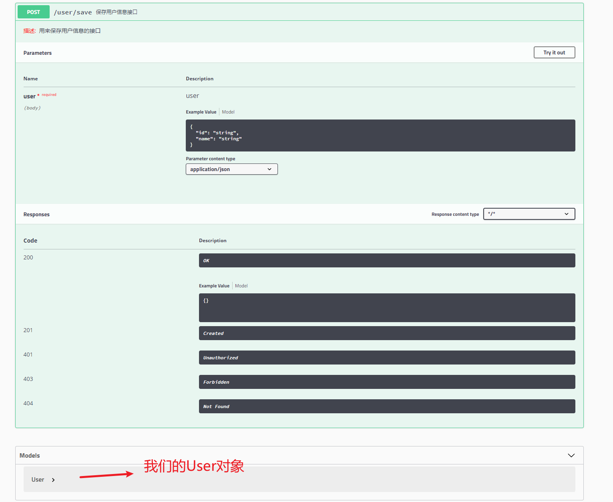


### 1.4.4、@ApiResponses

- 作用:用在请求的方法上，表示一组响应
- 修饰范围:用在方法上
- 参数
  - code : 数字,例如400
  - message : 信息
  - response : 抛出异常的类

```java
@PostMapping("save2")
@ApiResponses({
        @ApiResponse(code = 404, message = "请求路径不对"),
        @ApiResponse(code = 400, message = "程序不对")
})
public Map<String, Object> save2(@RequestBody User user) {
    System.out.println("id = " + user.getId());
    System.out.println("name = " + user.getName());
    Map<String, Object> map = new HashMap<>();
    map.put("id", user.getId());
    map.put("name", user.getName());
    return map;
}
```


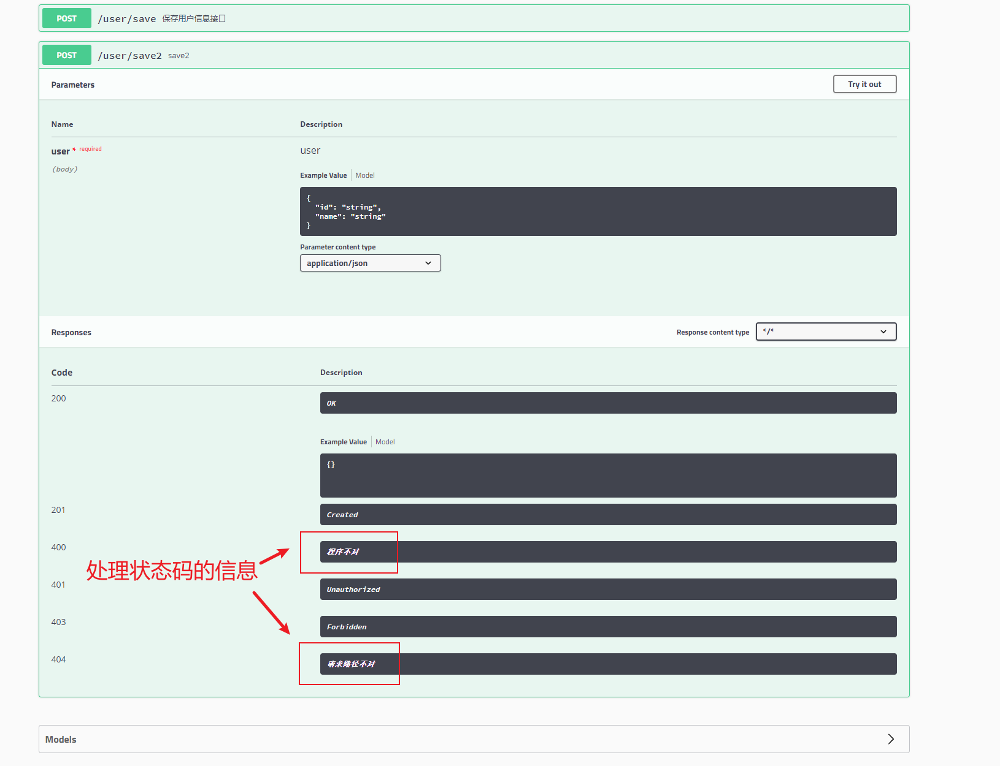


# 2、Swagger3

1. Swagger3的引入很简单:

```xml
<dependency>
    <groupId>io.springfox</groupId>
    <artifactId>springfox-boot-starter</artifactId>
    <version>3.0.0</version>
</dependency>
```

2. 配置

```java
@Configuration
@EnableOpenApi
public class Swagger {
    @Bean
    public Docket docket(){
        return new Docket(DocumentationType.OAS_30)
                .apiInfo(apiInfo())
                .enable(true)
                .groupName("kuang")
                .select()
                .apis(RequestHandlerSelectors.basePackage("com.kuang.controller"))
                .paths(PathSelectors.ant("/controller/**"))
                .build();
    }


    @SuppressWarnings("all")
    public ApiInfo apiInfo(){
        return new ApiInfo(
                "kuang's api",
                "kuang project",
                "v1.0",
                "2487422771@qq.com", //开发者团队的邮箱
                "kuang",
                "Apache 2.0",  //许可证
                "http://www.apache.org/licenses/LICENSE-2.0" //许可证链接
        );
    }
}
```

Swagger2和Swagger3的区别主要在以下方面：

1. **依赖**项的添加不同：新版本只需要添加一项，而老版本需要添加两项
2. 启动 Swagger 的注解不同：新版本使用的是 **@EnableOpenApi**，而老版本是 **@EnableSwagger2**
3. Swagger UI 访问地址不同：新版本访问地址是`http://localhost:8080/swagger-ui/`，而老版本访问地址是`http://localhost:8080/swagger-ui.html`


