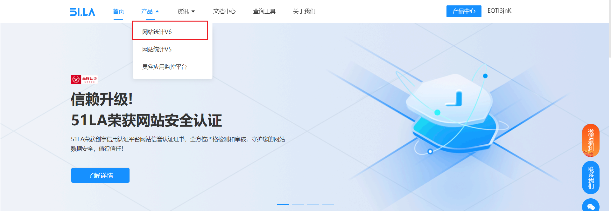
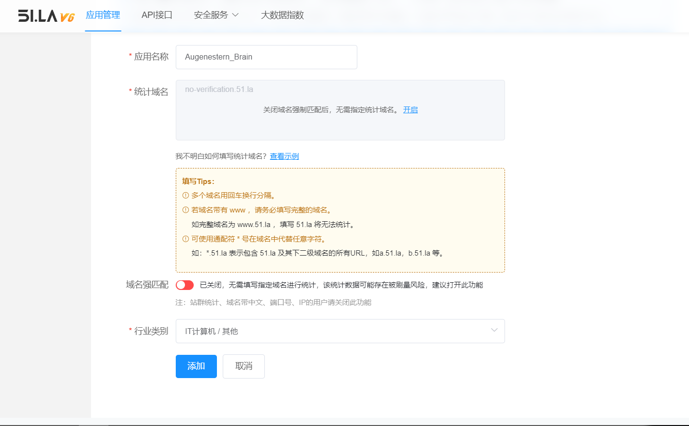
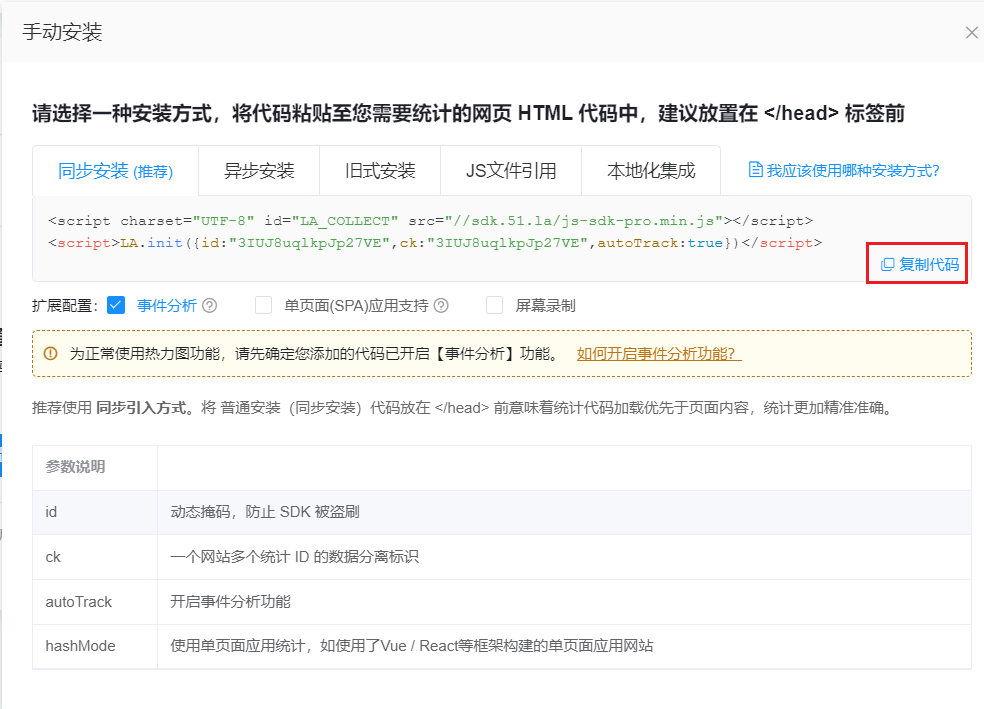
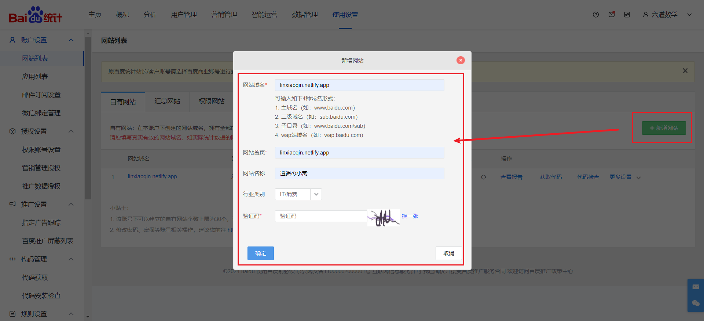
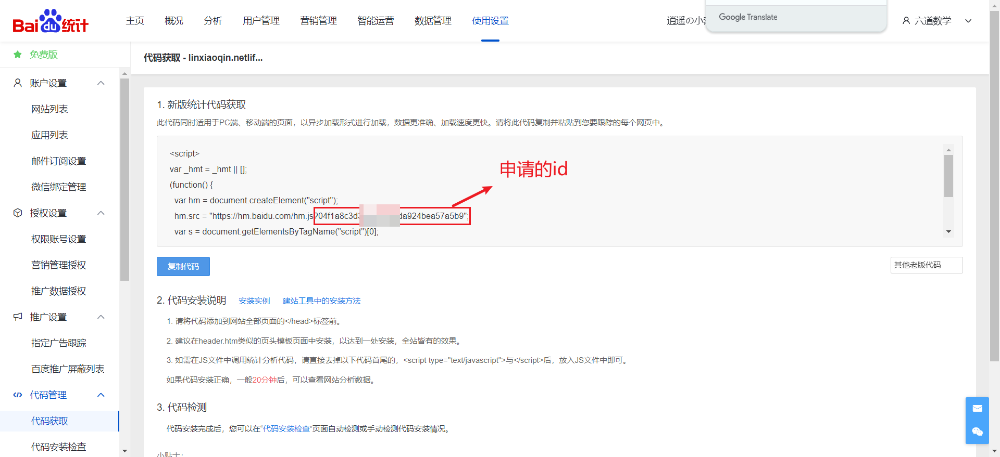

# 1、站点统计

## 1.1、51LA

1. 进入51la：https://www.51.la/
2. 注册登录 
3. 产品 - 网站统计V6 - 应用管理







4. 复制代码到个人站点即可




## 1.2、百度统计

1. 进入百度统计：https://tongji.baidu.com/

2. 注册登录
3. 新建网站




4. 获取到申请的id




5. 在index.html配置

```html
<script>
window.$docsify = {
  // 百度统计ID
  baiduTjId: "xxxxxxx",
}
</script>

<!-- body -->
<script src="https://unpkg.com/docsify-baidu-tj@1.0.2/dist/docsify-baidu-tj.min.js"></script>
```

