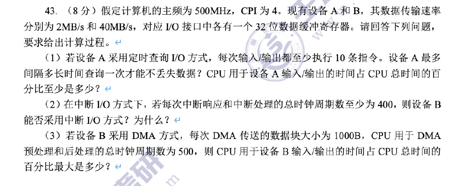
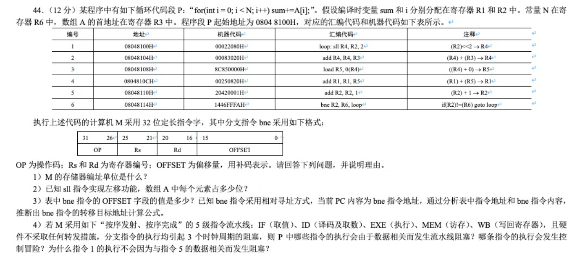
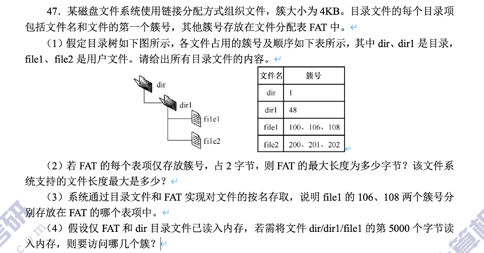

# 1、计组

## 1.1、数据运算类大题

### 1.1.1、2020


<div style="page-break-after:always;"></div>

### 1.1.2、2017


<div style="page-break-after:always;"></div>

### 1.1.3、2011


<div style="page-break-after:always;"></div>

## 1.2、Cache

### 1.2.1、2016


<div style="page-break-after:always;"></div>

### 1.2.2、2020


<div style="page-break-after:always;"></div>

### 1.2.3、2018


<div style="page-break-after:always;"></div>

### 1.2.4、2010


<div style="page-break-after:always;"></div>

### 1.2.5、2011


<div style="page-break-after:always;"></div>

### 1.2.6、2021


<div style="page-break-after:always;"></div>

### 1.2.7、2019


```bash
push ebp #每个函数在执行之前都会把上一个函数的栈底指针保存下来
ptr [ebp+x] # 取出函数传入的参数
ptr [ebp-x] # 取出当前函数的局部变量
```


## 1.3、指令

### 1.3.1、2010


<div style="page-break-after:always;"></div>

### 1.3.2、2017


<div style="page-break-after:always;"></div>


<div style="page-break-after:always;"></div>

### 1.3.3、2015


<div style="page-break-after:always;"></div>

### 1.3.4、2009


<div style="page-break-after:always;"></div>

### 1.3.5、2013


<div style="page-break-after:always;"></div>

### 1.3.6、2021


<div style="page-break-after:always;"></div>

### 1.3.7、2012


<div style="page-break-after:always;"></div>

## 1.4、I/O

### 1.4.1、2018




<div style="page-break-after:always;"></div>

### 1.4.2、2009


<div style="page-break-after:always;"></div>

### 1.4.3、2016


<div style="page-break-after:always;"></div>

### 1.1.7、2014




<div style="page-break-after:always;"></div>

## 🔥知识梳理

某36位系统(虚拟地址为36位)，按字节编址，每个页面大小为4KB，则页内偏移量占12位，虚拟页号占24位，物理地址空间大小为4GB，因此物理地址共32b，前20b表示物理页框号，后12表示页内偏移量。


查快表，用虚拟页号优先查快表(**快表TLB在CPU中**)，若快表中能够查到虚拟页号所对应的页表项，也就是快表命中就可以直接得到物理页框号，物理页框号在拼接上虚拟地址的页内偏移量，就得到了最终要访问的物理地址。

若查快表未命中，用虚拟页号查慢表(**内存中的页表**)，得到物理页框号，物理页框号在拼接上虚拟地址的页内偏移量，就得到了最终要访问的物理地址。

<div style="page-break-after:always;"></div>


如上图：

- 如果系统中只有单级页表：用24位的虚拟页号查单级页表，内存中有这个进程的页表起始地址，==页表项地址 = 页表起始地址F + 页号 × 页表项长度(页表中的行长)==，这样就可以找到这个虚拟页号所对应的页表项。
- 如果系统中引入全相联映射的快表TLB：用24位的虚拟页号查快表TLB，用24位的`虚拟页号`和`TLB标记`进行比较(所有行同时比较)，只有`虚拟页号`和`TLB标记`完全一致并且**有效位为1**，才算TLB命中。**快表命中后直接得到物理页框号**
  - 全相联映射TLB快表：虚拟地址结构==(标记(虚拟页号)，页内偏移量)==

<div style="page-break-after:always;"></div>


如上图：

- 若系统引入两极页表，我们将24位虚拟地址分成 12位的`页目录号(一级页号)`和 12位的`页号(二级页号)`，前12位用于查一级页表,后12位用于查二级页表
- 两级页表：即慢表分为两级，但是在查TLB快表的时候，TLB快表仍然只分一级，查慢表分为一级页号、二级页号，但是在查TLB快表的时候，只查一级。
- 快表TLB里面放的是**当前进程的页表副本**，Cache里面存放的是**内存的副本**。所以当从A进程切换到B进程，快表TLB里面的数据全部作废，而Cache里面的数据不需要全作废。
- TLB 和 Cache 都在CPU中，所以不需要访存。
- 408考试中，**主存块**的大小和Cache块相同，但是**页框大小**和Cache块不同

<div style="page-break-after:always;"></div>


如上图Cache采用**全相联映射方式**，一个Cache块的大小是 2^6^=64B，所以块内地址占6位，我们得到的32位物理地址会被分为 26位的`Cache标记`和 6位的`字块内地址(Cache块内地址)`，

- 全相联映射物理地址结构 ==(标记，块内地址)==

- 我们用物理地址的前26位 和 `Cache标记`比较(也是全部行同时比较)，只有`物理地址的前26位` 和 `Cache标记`完全一致，且`有效位`为1，才算Cache命中。Cache命中后，根据 6位的 `字块内地址(Cache块内地址)` 的指向，在 64B的 Cache块中取出本次要访问的一个字或字节，这样Cache命中，CPU就直接得到了此次要访问的数据。

- 若Cache未命中，则用物理地址访问内存，从内存中得到目标数据。

<div style="page-break-after:always;"></div>


如上图Cache采用**直接映射方式**，一个Cache块的大小是 2^6^=64B，所以**块内地址占6位**，由于Cache共有 0-15 共16行，所以 **Cache行号占4位**，则标记占22位

- 直接映射物理地址结构 ==(标记，Cache行号，块内地址)==
- 根据物理地址的 **Cache行号** 找到 **Cache行**，比较物理地址的`标记`和 `Cache行的标记`，若匹配且有效位为1，说明Cache命中，则根据 **块内地址** 在**已命中的Cache块**中找到此次要访问的字/字节

<div style="page-break-after:always;"></div>


如上图Cache采用**2路组相联映射方式**，每一组有2个Cache块。一个Cache块的大小是 2^6^=64B，所以**块内地址占6位**，分组数为8组，所以**组号占3位**，则标记占23位。

- 组相联映射物理地址结构 ==(标记，组号，块内地址)==
- 根据物理地址的 **组号** 找到 对应的分组，比较物理地址的`标记`和 `Cache行的标记`，若匹配且有效位为1，说明Cache命中，则根据 **块内地址** 在**已命中的Cache块**中找到此次要访问的字/字节

> Cache 总容量/总大小：包括标记位、有效位、脏位、数据部分
>
> Cache 数据区大小：Cache数据部分总和

---

<div style="page-break-after:always;"></div>

指令中的操作数，由形式地址转为有效地址，这个有效地址是个虚拟地址。PC所指向的地址也是虚拟地址，即PC寄存器存放虚拟地址，物理地址存放在MAR地址寄存器中。

---

### I/O方式

一：程序查询方式


键盘使用USB线路连接电脑主机的USB口，在USB后后面是有个芯片，这个芯片就是 **I/O接口**，当键盘输入的信息首先会被放到**缓冲区**里面，这个缓冲区的大小题目中会给出。假设这个缓冲区为一个字节，当我们敲击键盘的A字符，这个缓冲区就会被冲满，如果我们敲击速度非常快，导致缓冲区的数据还未被取走，那么缓冲区的数据就会被后面敲击的字符覆盖掉。

**设备**按照一定的**速率**向**缓冲区**输入数据，CPU需要按照一定的**频率**从**缓冲区**取数据，然后将数据放到主存。假如设备输入的速率是 100Kb/s，缓冲区的大小为4B，则CPU至少需要 4B/100Kb/s 的时间去查询一次。当缓冲区的数据不会被覆盖时，题目会考**CPU查询方式的时间占比**。
$$
CPU查询方式的时间占比 = CPU查缓冲区一次的时间×1s中CPU需要查多少次
$$

<div style="page-break-after:always;"></div>

二：中断I/O方式


当缓冲区被冲满时，I/O接口会给CPU发送**中断信号**，当CPU检测到中断信号后需要对中断进行处理，中断处理分为**中断响应**和**中断的服务**，中断响应对应**中断隐指令**的操作。所以CPU中断处理结束之后**缓冲区**的数据就会被取空。

CPU取数据的时间 = 中断响应时间+中断服务时间。
$$
中断频率 = \frac{设备传输频率}{缓冲区大小} \\

中断时间占比 = 一次中断所需时间 × 中断频率
$$

<div style="page-break-after:always;"></div>

三：DMA方式


CPU要传输一块数据的时候，CPU会进行**预处理**，给DMA接口发送指令，让其将数据传送到主存的某一块区域，DMA设备以及DMA接口和主存之间的传输单位是**字**，一个字一个字将数据传送给主存，等到所有的字冲满主存中的块时，DMA接口会给CPU发送中断信号，CPU然后处理这个DMA中断称为**后处理**。

> DMA接口和主存之间的传输单位是字


# 2、操作系统

## 2.0、知识梳理

### 2.0.1、文件管理


磁盘装了一个WPS软件，从物理上看可能是离散的，也可能是连续的，但从逻辑上看是连续的1GB空间。我们点击运行WPS，那么操作系统会为其创建进程，假如电脑是32位，那么会为这个进程分配连续的2^32^=4GB的虚拟内存，当然其物理内存是将进程分页，以页为单位进行存储。整个物理内存里面有很多进程，自然对应很多进程控制块PCB，这些进程是等待被调度。

假如WPS此时要打开磁盘中的 `宝典.doc` 文件，那么会发出 `open`系统调用，根据文件存放路径找到相应的目录文件，从目录中找到 `宝典.doc`对应的**索引结点编号**，操作系统是知道所有索引结点的起始地址和结束地址，假设  `宝典.doc` 对应的索引结点编号为2，那么操作系统将编号为2的索引结点读入虚拟内存。

索引结点是混合索引，通过直接索引、一级间接索引、二级间接索引来找到数据在磁盘的位置。


<div style="page-break-after:always;"></div>


### 2.0.3、存储管理

#### 1、FAT文件系统

**进程虚拟地址空间**被分成一个个的页，每一个进程的页面都会被放到**内存中的物理页框**当中。下面是==FAT文件系统==中如何查目录的：


如果现在要从根目录开始查找，要将文件 `"/A/Dm"` 读入内存，描述背后发生了什么？

答：

- **根目录常驻内存，并且存在固定位置**。因为开机的时候，需要从根目录出发，找到操作系统初始化相关的各种文件。因此，将根目录存放在固定位置，那么开机的时候取这个固定位置读入根目录的数据即可。
- 

- 首先查**内存中的根目录**，找到目录项A，发现目录A的起始块号为5，文件大小为3个块。再次去**内存中的FAT表**中去查是哪三个块，发现是磁盘的5、6、7号块。

  

  - 目录A下面有n个文件，每个文件对应一个FCB，所以目录A由n个FCB组成。这n个FCB总共存放在磁盘中的5、6、7号块。所以将磁盘的5、6、7号块全部读入**内存**，在这三个块中找到Dm的目录项，发现Dm文件的起始块号为m，大小为2个块。于是再去**内存中的FAT表**中，找到这两个块是m、k号磁盘块。

  


> 打开Dm，需要访问3次磁盘，再读Dm，需要访问2次磁盘。
>
> - FCB确定文件块首地址，FAT确定块间关系。

如果一个FCB占64B，而一个块的大小是1KB，则一个块最多只能有 1KB/64B = 16 个FCB，也就是16行。而目录文件A有3个块，总共存 16×3 = 48个FCB，这就意味着如果FCB足够多的话，我们还需要给目录文件A分配更多的块，这对于查找速率来说是很不好的。

----

1. FAT表中，每个表项的大小对文件系统有什么影响？

   - 对文件系统支持的最大磁盘磁盘块数有影响。如：每个FAT表项占 16b，则最多只能表示 2^16^ 个块号
   - 对FAT表的总大小有影响，每个表项的大小 × 表项的数量 = FAT表的大小

2. 简述操作系统是如何使用FAT表的？

   - 开机时，就会把整个FAT表读入内存，系统运行过程中，该表会一直常驻内存。也就是说，**查FAT表不需要读磁盘**，内存里本来就有这个表。系统运行的过程中，==如果要访问某个文件，则首先要找到这个文件对应的目录项，从目录项中找到文件的起始块号，再根据起始块号查FAT表，从而确认文件的后序块存放在哪里。==

3. 如何确定目录文件A需要占多少个块？

   - (目录项的数量 × 每个目录项的大小) / 块大小

4. 目录文件A必须占用连续的磁盘块吗？

   - 不用

   


#### 2、UNIX文件系统

**UNIX文件系统** 给FCB目录项瘦身，每个FCB只包含(文件名、索引结点inode)。


- 超级块：包含⼀些重要的⽂件系统管理信息，如：魔数、磁盘转速、磁道数、扇区数等
- **位示图**：位示图中每个 bit 对应一个磁盘块，若磁盘块有 n 个，则位示图也要有 n bit。1表示磁盘块不空闲，0表示磁盘块空闲。

如果现在要从根目录开始查找，要将文件 `"/A/Dm"` 读入内存，描述背后发生了什么？

答：

- **根目录常驻内存，并且存在固定位置**。首先查**内存中的根目录**，找到目录项A，发现它的索引结点号是1

  

- 接着将**磁盘**中编号为1的索引结点调入**内存**，从而在内存中查找到目录文件A对应的索引结点，它有两个直接索引，第一个直接索引为6，表示目录文件A的起始磁盘块号为6，第二个磁盘块号为7。于是将6和7号磁盘块调入**内存**


- 接着在**内存**中查找到Dm对应的索引结点号为5，所以需要将5号索引结点调入**内存**，可以发现这个Dm文件有两个直接索引，起始磁盘块号为m，第二个磁盘块号为k。


> 打开Dm，需要访问3次磁盘，再读Dm，需要访问2次磁盘。

1. 每个文件必须对应一个 inode 结点。如果一个磁盘块为4KB，用两个磁盘块 8KB 作为 inode区，假设每个 inode大小为 64B，则该文件系统最多只能存储 8KB/64B=128 个 inode结点，即最多支持128个文件。
2. 如果一个磁盘块用于存储索引表，则通常将其称为索引块，如果一个磁盘块用于存储文件的数据，则通常将其称为数据块。
3. 每一张索引表需要刚好占满一个块，因此，若每个磁盘块大小为4KB，每个索引项4B，则一张索引表包含 1024 个索引项。


### 2.0.4、串讲


假设进程采用两级页表，(一级页表8b，二级页表8b，页内偏移12b)，则将16位的虚拟页号拆成一级页表8bit，二级页表8bit，假设此时虚拟页号为 0003H，先去查**内存**中的**页目录表**， 发现二级页表的页框号为 00DH，接着去查**内存**中页框号为 00DH 的二级页表，找到 0003H 对应的页框号为 012H，于是再查**内存**中的页框号为 012H 的块。

> 上述过程一共访问了3次内存，查页目录表访问1次，查二级页表访问1次，查最终访问页面访问1次


若我们先查了**页目录表**，再查了**二级页表**，在二级页表中发现想访问的页面有效位为1，表示此时这个页不在**内存**中，根据表项在外存中的位置可知其在外存的20号块，于是便将**磁盘**中的20号块调入内存。

---

如果我们再加一个快表TLB，那么图应该就是如下：


---

上面每次读文件都需要 open、read 系统调用，比较麻烦，所以就提出了**内存映射文件**：open系统调用返回一个**文件描述符fd**，然后 mmap 系统调用将刚才的文件**映射到某一片区域**当中，这样我们要读这个文件的任何一个字节，直接就可以访问。


## 2.1、PV


<div style="page-break-after:always;"></div>

### 2.1.1、2014


<div style="page-break-after:always;"></div>

### 2.1.3、112页第10题


<div style="page-break-after:always;"></div>

### 2.1.4、2019


<div style="page-break-after:always;"></div>

### 2.1.5、2020


<div style="page-break-after:always;"></div>

### 2.1.6、2021


<div style="page-break-after:always;"></div>

### 2.1.7、2017


<div style="page-break-after:always;"></div>

### 2.1.8、2016


<div style="page-break-after:always;"></div>

### 2.1.9、2015


<div style="page-break-after:always;"></div>

### 2.1.10、2013


<div style="page-break-after:always;"></div>

### 2.1.11、2011


<div style="page-break-after:always;"></div>

### 2.1.12、2009


## 2.2、存储管理

### 2.2.1、2013


<div style="page-break-after:always;"></div>

### 2.2.2、2018


<div style="page-break-after:always;"></div>

### 2.2.3、2016




<div style="page-break-after:always;"></div>

### 2.2.4、2019


<div style="page-break-after:always;"></div>

### 2.2.5、2018


<div style="page-break-after:always;"></div>

### 2.2.6、2015


<div style="page-break-after:always;"></div>

### 2.2.7、2014


<div style="page-break-after:always;"></div>

### 2.2.8、2012


<div style="page-break-after:always;"></div>

### 2.2.9、2012


<div style="page-break-after:always;"></div>

### 2.2.10、2011


<div style="page-break-after:always;"></div>

### 2.2.11、2010


<div style="page-break-after:always;"></div>

### 2.2.12、2010


<div style="page-break-after:always;"></div>

### 2.2.13、2009


<div style="page-break-after:always;"></div>

# 3、计网

## 3.1、知识梳理🔥

当在电脑浏览器上输入 www.cskaoyan.com  服务器资源时，发生了什么过程？

1. 把域名转化为域名所对应的 ip 地址，**域名到 ip 地址的转换**需要**DNS协议**
   - 先查主机当中的**DNS高速缓存**，然后得到服务器的 ip 地址
   - 若主机当中的 **DNS高速缓存** 没有这条记录，只能通过**迭代** 或者 **递归**的方式先去找**本地域名服务器**，然后再找 `com.` 域名服务器，再找 `cskaoyan.` 域名服务器，在 cskaoyan. 域名服务器当中找到 www.cskaoyan.com 这条表项对应的 ip地址
   - cmd中使用 `nslookup www.cskaoyan.com` 就可以找到域名所对应的ip地址(扩展) 
2. 基于查到的 ip 地址使用 ARP 协议去寻找 MAC 地址
   - 建立连接的前提是知道下一跳发给谁，主机H1要和服务器建立连接，一定要先知道每一步怎么走。每一步怎么走取决于 MAC 地址。
   - 若我们要发一个TCP连接，在**传输层封装 TCP 报文**，在**网络层封装首部**，首部中包含ip源地址和ip目的地址，在**链路层封装MAC帧的首部和尾部**，首部包含MAC源地址和MAC目的地址。
   - 首先查 ARP 缓存，是否有 ip 地址到 MAC 地址的映射，如果没有此条记录，H1会发送**广播ARP分组**告知局域网当中的所有设备，然后收到**默认网关路由器**返回**单播**的响应，这样就获得了MAC地址
3. 主机与服务器建立 TCP 连接
   - 获得了ip地址和MAC地址，就可以将数据进行封装成帧， 作为 **TCP 请求连接的报文**发送到**路由器**，路由器复用 ip 地址，只需更改源MAC地址、目的MAC地址。(**从新的一跳到下一跳MAC地址都需要改变**)，然后发送给交换机，再发送给服务器。
4. 服务器响应 TCP 请求连接的响应，然后主机发送 HTTP 协议请求。 (即第二次和第三次握手过程)


应用层的HTTP报文加上TCP首部形成TCP报文段，TCP报文段再加上IP首部形成IP分组，IP分组加上MAC帧头和帧尾形成MAC帧。


> **MAC帧**的首部和尾部的和是18B，数据部分最短长度是46B，最大长度是1500B
>
> - 所以 MAC 帧的长度最小 64B，最大1518B
> - MAC 帧的首部是14B 、尾部是 4B


1. TCP报文段和IP分组的首部长度固定部分是 **20B**
2. IP地址的长度是 4B
3. TCP报文段**源端口和目的端口**是 2B，IP分组的**源地址和目的地址**是 4B，MAC帧的**源地址和目的地址**是 6B
   - 这几个字段都是**寻址**
4. IP分组中 总长度单位为1B，片偏移单位为8B，首部长度单位为4B   （一种八片首四）


- **UDP数据报**首部为 8B
- **TCP报文段**和**IP分组**的首部固定部分为 20B，最大值为 60B


### 3.1.1、FTP工作原理


## 3.2、三个表

### 3.2.1、转发表

转发表是交换机的表：交换机具有**自学习**功能，A向B发送帧，A从1接口进入交换机，所以交换机会将**MAC地址**和**进入交换机的接口**写入转发表。


### 3.2.2、ARP表


### 3.2.3、路由表


如上图是R1路由器的表，如果要发往给其他网络，就需要借助**网关**去下一个网络。接口是路由器本身物理的接口，网络ID是网络ip地址。第三条记录就需要用到网关了，走2号接口到下一个网络。最后一条记录是默认路由，默认路由的网络地址和子网掩码都是全0，还是走2号接口到下一个网络。

> 只有边界路由才有默认路由，R1、R3有默认路由，可以进行路由合并，R2不是边界路由，所以没有默认路由


## 3.3、IP分组/TCP报文段/MAC帧

递归查询和迭代查询：


### 3.3.1、IP分组首部格式


IP分组中

- ==源IP地址==是从IP分组的第 `13B` 开始的
- 首部固定部分为`20B`，首部最大值为`60B`

- ==一总八片首四==
  - 总长度单位1B，片偏移单位8B，首部长度4B
- 首部校验和：**只检验首部**
- ==源IP地址和目的IP地址==：4B
- ==标志==：只有2位有意义 x __ __
  - 中间位DF：DF=1，禁止分片。DF=0，允许分片
  - 最低位MF：MF=1，后面还有分片。MF=0，最后一片或没分片


### 3.3.2、TCP首部格式


- 首部固定部分为`20B`，首部最大值为`60B`  
- ==源端口==和==目的端口==各占`2B`
- 序号(本报文端第一个字节的序号)和确认号(期望收到下一个的序号) 各占 `4B`


我在**21岁发**现了心仪的女生，**23岁**我们开始**谈**恋爱，**25岁**我们闹矛盾**删**了好友，**53岁**我给她**打**电话，然而她人在异乡，我们相约**80**岁**还**要再见。


### 3.3.3、UDP首部格式


### 3.3.3、MAC帧


- MAC 帧的**数据长度**为 46B ~ 1500B，`IP分组 = MAC帧的数据部分`。MAC 帧的首部是14B 、尾部是 4B
- MAC 帧长为 64B ~ 1518B
- MAC帧的**源地址和目的地址**是 6B
- 前同步码 8B
- IPV6的**源地址和目的地址**是16B


> TCP报文段**源端口和目的端口**是 2B，IP分组的**源地址和目的地址**是 4B，MAC帧的**源地址和目的地址**是 6B


## 3.4、


## 3.4、大题

### 3.4.1、2017


<div style="page-break-after:always;"></div>

### 3.4.2、2010


<div style="page-break-after:always;"></div>

### 3.4.3、2015


<div style="page-break-after:always;"></div>

### 3.4.4、2011


<div style="page-break-after:always;"></div>

### 3.4.5、2009


<div style="page-break-after:always;"></div>

### 3.4.6、2018


<div style="page-break-after:always;"></div>

### 3.4.7、2013


<div style="page-break-after:always;"></div>

### 3.4.8、2014


<div style="page-break-after:always;"></div>

### 3.4.9、2019


<div style="page-break-after:always;"></div>


