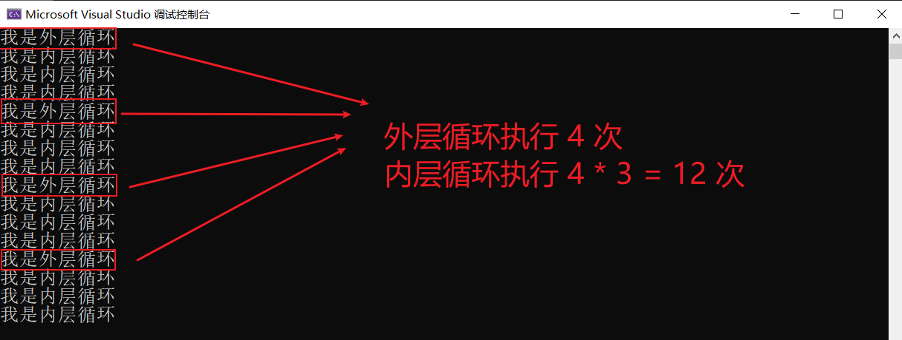
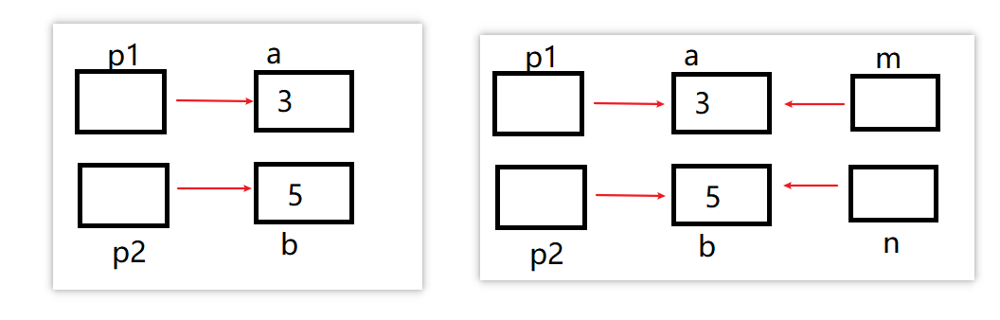
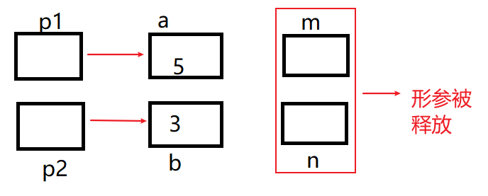

# 1、数据类型

## 1.1、基本数据类型

在标准C语言中，存在着如下六种基本数据类型

| 基本数据类型      | 描述         |
| ----------------- | ------------ |
| char              | 字符型       |
| short = short int | 短整型       |
| int               | 整型         |
| long = long int   | 长整型       |
| float             | 单精度浮点型 |
| double            | 双精度浮点型 |


## 1.2、实型数据

* 分两类，单精度和双精度 float 和 double 

- float 占用 4 个字节，double 占用8个字节

- 单精度精确到小数点后第6位，双精度精确到小数点后15位


## 1.3、字符型数据

- 字符型数据是用单引号括起来的一个字符，例如 'a'、'b' 、'=' 、'+' 、'?' 、 都是合法字符型数据

```c
char m = 'a';
```

- 字符型数据只能用 单引号 括起来，不能用双引号或者其他括号

- c 语言中没有 string 类型，string 是用 char 型数组来构造的

```c
char m[5] = {'h','e','l','l','o'};
// 此时 m 就是字符串 hello 了
```


```c
#include<stdio.h>
int main()
{
	printf("Hello World");
	char name = 'z';
	short a = 3;
	int  age = 222;
	long c = 222222222;
	float money = 22.2;
	double money2 = 22.2222;
	return 0;
}
```


# 2、运算符和表达式

## 2.1、算数运算符

| 运算符 | 功能说明   | 举例     |
| ------ | ---------- | -------- |
| +      | 加         | a + b    |
| -      | 减         | a - b    |
| *      | 乘         | a * b    |
| /      | 除         | a / b    |
| %      | 取模或求余 | a % b    |
| ++     | 增1        | a++，++b |
| --     | 减1        | a--，--b |

注意：

- a --  是先用后减
- -- a 是先减后用


## 2.2、关系运算符

| 运算符 | 功能说明 | 举例      |
| ------ | -------- | --------- |
| >      | 大于     | a > b     |
| >=     | 大于等于 | a >= 5    |
| <      | 小于     | 3 < x     |
| <=     | 小于等于 | x <= y+1  |
| ==     | 等于     | x + 1==0  |
| !=     | 不等于   | c != '\0' |

满足返回1，不满足返回0


```c
int c = 1<2;	//此时 1<2,为假,用0表示,所以c=0
int b = 1>=1;	//此时 返回真,所以 b=1
```

## 2.3、逻辑运算符

| 运算符 | 功能说明 | 举例               |
| ------ | -------- | ------------------ |
| ！     | 逻辑非   | !(x ==0)           |
| &&     | 逻辑与   | x > 0 && x<100     |
| \|\|   | 逻辑或   | y < 10 \|\| x < 10 |

```c
int c = 1;
int b = !c;	//!c代表取反,原来c为1,取反后为0,则 b =0
```


## 2.4、三目运算符

- 条件表达式 `b ? x:y`	

- 先计算条件b，然后进行判断，如果b的值为 true，计算x的值，运算结果为x的值，否则，计算y的值，运算结果为y的值


## 2.5、逗号运算符和表达式

- 逗号表达式的一般形式：(表达式1，表达式2)

- 先求解表达式1，再求解表达式2.整个逗号表达式的值是表达式2的值

```c
int c = (1+2,2+2);
printf("%d",c);		//c 的值为后面的 2+2 = 4,c=4
```


## 2.6、sizeof运算符🔥

- 用法：`sizeof(变量类型)` 或者 `sizeof(变量名称)`
- 作用：查看字节长度

```c
int a = sizeof(double);
printf("%d\n",a);		//会发现 a 为 double 类型的字节长度,8个字节,则 a = 8
```


## 2.7、赋值运算符和赋值表达式

基本赋值：`=`

```c
int a = 3;	// 读作把 3 赋给 a
```


复合赋值：`+=`、`-=`、`*=`、`/=`、`%=`

```c
a -=b; //等价于 a = a-b
```


## 2.8、数据类型转换

- 自动类型转换
  - 较低类型将自动向较高类型转换

整型类型级别从低到高依次为：

```c
signed char -> unsigned char -> short ->unsigned short -> int -> unsigned int -> long -> unsigned long
```

浮点型级别从低到高依次为

```c
float -> double
```

例如：

```c
char c = 'a';
int m=c;	//自动转换,把 'a' 的 ASCII码97 给 m
```


# 3、位运算

| 运算符 | 功能说明    | 举例   |
| ------ | ----------- | ------ |
| ~      | 位逻辑反    | ~a     |
| &      | 位逻辑与    | a & b  |
| \|     | 位逻辑或    | a \| b |
| ^      | 位逻辑 异或 | a ^ b  |
| >>     | 右移位      | a << 1 |
| <<     | 左移位      | b >> 4 |


# 4、宏常量和常变量

## 4.1、宏定义

宏定义分为两种

- 一种是不带参数的宏定义
  - 比如： `#define PI 3.1415926`
- 一种是带参数的宏定义    `#define 宏名称([形参列表]) 替换文本`
  - 比如：`#define MULTIPLY(x,y) x*y`

```c
#include<stdio.h>
#define Sum(x,y) x+y
int main()
{
	int a = Sum(1, 2);
	printf("%d\n", a);
	return 0;
}
```


## 4.2、宏常量

```c
#define PI 3.14159  /* 定义宏常量 PI */
// 宏常量也称为符号常量,是指用一个标识符号来标识常量,切记中间不能加等号
```


## 4.3、常变量

常变量：使用 `const` 定义常变量，定义时需指定数据类型，行末以分号结束

```c
const float PI=3.1415926;
// 注意结尾分号
```

```c
#include<stdio.h>
const float PI = 3.1415926;
int main()
{
	float a = PI;
	printf("%d\n", a);
	return 0;
}
```


# 5、输入和输出

## 5.1、数据的输入

- `scanf("<格式化字符串>",<地址表>);`

```c
int i,j;
scanf("%d,%d",&i,&j);
// 注意字符串的是 %s, str   str 前面不用加 &
```

- `getchar()`
  - getchar() 函数也是从键盘上读入一个字符,并回显。
  - 它与前面函数的区别在于: getchar() 函数等待输入直到按回车才结束，回车前的所有输入字符都会逐个显示在屏幕上，但只有第一个字符作为函数的返回值，可以吃换行符回车

```c
getchar();
```


```c
#include<stdio.h>

int main()
{
	char a = getchar();
	printf("%c", a);
	return 0;
}
```


- `gets();`
  - gets() 函数用来从键盘读取字符串直到回车结束,但回车符不属于这个字符串.其调用格式为

```c
gets(s);	//s为字符串变量、字符串数组名或字符串指针
```

```c
#include<stdio.h>

int main()
{
	char str[10];
	gets(str);	//数组就是地址,不用加&
	printf("%s",str);
	return 0;
}
```


## 5.2、数据的输出

- `printf()`

```c
int i =10;
int j = 3;
printf("%d%d\n",i,j);
```

- `putchar()`

```c
char ch = 'h';
// 函数是向标准输出设备输出一个字符
putchar(ch);	//其中ch为一个字符变量或常量
```

- `puts()`

```c
char a[10] = {'h','e','l','l','o'}
// puts() 函数用来向屏幕 写字符串并换行
puts(s);	// s为字符串变量(字符串数组名或字符串指针)
```


## 5.3、格式化输出

| 格式   | 描述                       |
| ------ | -------------------------- |
| %d🔥    | 十进制有符号整数           |
| %u     | 十进制无符号整数           |
| %f🔥    | 浮点数                     |
| %s🔥    | 字符串                     |
| %c🔥    | 单个字符                   |
| %p     | 指针的值                   |
| %e     | 指数形式的浮点数           |
| %x，%X | 无符号以十六进制表示的整数 |
| %o     | 无符号以八进制表示的整数   |
| %g     | 自动选择合适的表示法       |

- 可以在 "%" 和字母之间插进数字表示最大场宽。
  - 例如： %9.2f 表示输出场宽为9的浮点数，其中小数位为2，整数位为6，小数点占一位，不够9位右对齐（前面补0）
  - %8s 表示输出8个字符的字符串，不够8个字符右对齐
- 可以控制输出左对齐或右对齐，即在 "%" 和字母之间加入一个 "-" 号可说明输出为左对齐，否则默认为右对齐
  - 例如：%-7d 表示输出7位整数左对齐

```c
#include<stdio.h>

int main()
{
	float a = 3.3122;
	printf("%9.2f\n", a);
    //_ _ _ _ _3.31
	return 0;
}
```


# 6、常用计算函数

- 导入 math.h 库

| 函数        | 举例         | 作用                    |
| ----------- | ------------ | ----------------------- |
| 求绝对值    | x = fabs(a)  | 求a的绝对值             |
| 开平方      | x = sqrt(a)  | 求a的平方根(a>=0)       |
| 正弦函数    | x = sin (a)  | 求 sin(a) 的值          |
| e 的幂      | x = exp(a)   | 求 e^a^  的值           |
| a 的 b 次方 | x = pow(a,b) | 求 a^b^ 的值            |
| log~10~ (a) | x = log10(a) | 求以 10 为底 a 的对数   |
| 向上取整    | x = floor(a) | 求不大于 a 的最大的整数 |
| 向下取整    | x = ceil(a)  | 求大于 a 的最小的整数   |

```c
#include<stdio.h>
#include<math.h>
int main()
{
	int a = -3;
	int b = fabs(a);
	printf("%d", b);
	return 0;
}
```


## 6.1、伪随机数

- 导入 stdlib.h 库

```c
#include<stdio.h>
#include<stdlib.h>
int main()
{
	int a = rand();
	printf("%d", a);
	return 0;
}
```

- 发现每次结果都一致(每次启动计算机以后，种子就是定值了)

如何实现每次产生的数不一样呢？

```c
#include<stdio.h>
#include<stdlib.h>
#include<time.h>
int main()
{
	int a;
	/* 将当前时间设置成随机函数的种子，所以每次产生的数都不一样 */
	srand((unsigned)time(NULL));
	a = rand();
	printf("%d", a);
	return 0;
}
```


# 7、条件判断

## 7.1、if else

```c
if(条件表达式1)
{
    //...
}
else if(条件表达式2){
    //...
}
else if(条件表达式3){
    //...
}
else{
    //...
}
```

注意：如果 `{}` 里面的语句为 一个简单的语句(一个分号)，那么{} 可以省略

``` c
#include<stdio.h>

int main()
{
	int score = 99;
	if (score >= 90) {
		printf("A");
	}
	else if (score >= 80) {
		printf("B");
	}
	else if (score >= 70) {
		printf("C");
	}
	else if (score >= 60) {
		printf("D");
	}
	else {
		printf("不及格");
	}

	return 0;
}
```

如果某个表达式的值为真，则执行对应语句，并终止整个多分支结构的执行。但如果为：

```c
#include<stdio.h>

int main()
{
	int score = 99;
	if (score >= 90) {
		printf("A");
	}
	if (score >= 80) {
		printf("B");
	}
	if (score >= 70) {
		printf("C");
	}
	if (score >= 60) {
		printf("D");
	}
	else {
		printf("不及格");
	}

	return 0;
}
```

假设第二个表达式为真，后面的 if 还是一样要执行

## 7.2、switch

- `switch()` 中的参数只能是 **整型，字符型，枚举型**

```c
switch(参数)
{
    case 常量表达式1:
        语句块1;
        break;
    case 常量表达式2:
        语句块2;
        break;
    default:
        语句块n;
        break;		//这个break可以加,可以不加
        
}
```


```c
#include<stdio.h>

int main()
{
	int score = 82;
	switch (score / 10) 
	{
		case 10:
			printf("满分");
			break;
		case 9:
			printf("A");
			break;
		case 8:
			printf("B");
			break;
		case 7:
			printf("C");
			break;
		case 6:
			printf("D");
			break;
		default:
			printf("不及格");
			break;
	}
	
	return 0;
}
```

字符型

```c
#include<stdio.h>

int main()
{
	char m = 'A';
	switch (m) 
	{
		case 'A':
			printf("我是A字符");
			break;
		case 'B':
			printf("我是B字符");
			break;
		case 'C':
			printf("我是C字符");
			break;
		case 'D':
			printf("我是D字符");
			break;
		default:
			printf("没有匹配到");
			break;
	}
	
	return 0;
}
```


# 8、循环

## 8.1、while

```c
while(表达式)
{
    语句;
}
```

当表达式为真，则执行下面的语句；语句执行完之后再判断表达式是否为真，如果为真，再次执行下面的语句；然后再判断表达式是否为真....就这样一致循环下去，直到表达式为假，跳出循环，这个就是 while 的执行顺序


## 8.2、do-while

```c
do
{
    语句;
}
while(表达式)
```

do....while 是先执行依次循环体，然后再判别表达式


## 8.3、for

```c
for(循环变量赋初值;循环条件;循环变量值改变)
{
    语句;
}
for(i=1;i<=100;i++)
{
    sum = sum + i;
}
```


## 8.4、循环嵌套

```c
#include<stdio.h>

int main()
{
    int i, j;
    for (i = 0; i < 4; i++)
    {
        printf("我是外层循环\n");
        for (j = 0; j < 3; j++)
        {
            printf("我是内层循环\n");
        }
    }
	
	return 0;
}
```




## 8.5、break

1. 当 break 语句出现在一个循环内时，循环会立即终止
2. 它可用于终止 switch 语句中的 case


## 8.6、continue 

跳过循环体中下边尚未执行的语句，然后进行下一次是否执行循环的判定


# 9、函数

## 9.1、函数的定义

```c
#include<stdio.h>

// 函数的定义
int add(int a, int b)
{
	return a + b;
}

int main()
{
    // 函数的使用
	int c = add(1, 3);
	printf("%d", c);		//返回4
	
	return 0;
}
```

## 9.2、函数的返回值

函数的返回值是通过函数中 return 语句获得的。return 语句将被调函数中的一个确定的值带回到主调函数中，供主调函数使用。若不需要返回值 void 类型，则可以不要 return 语句。


## 9.3、函数的声明

```c
#include<stdio.h>

// 函数的声明
int add(int a,int b);

int main()
{
    // 函数的使用
	int c = add(1, 3);
	printf("%d", c);		//返回4
	
	return 0;
}

// 函数的定义
int add(int a, int b)
{
	return a + b;
}


```


## 9.4、函数间的参数

- 实参：全称为 "实际参数" 是在调用时 ==传递给函数的参数==，即传递给被调用函数的值
- 形参：全称为 "形式参数" 是在定义==函数名和函数体== 的时候使用的参数，目的是用来接收调用该函数时传递的参数

### 9.4.1、实参与形参的传递方式

```c
#define _CRT_SECURE_NO_DEPRECATE	//vs2019中需要加此句代码,否则 scanf 报错
#include<stdio.h>	// c语言中的输入输出库


void mySwap(int x, int y)
{
	int t;
	t = x;
	x = y;
	y = t;
}

int main()
{
	int a, b;
	printf("请输入代交换的两个整数:");
	scanf("%d %d", &a, &b);
	mySwap(a, b); //作为对比，直接交换两个整数，显然不行
	printf("调用交换函数后的结果是: %d 和 %d\n", a, b);

	
	return 0;
}
```


```c
#define _CRT_SECURE_NO_DEPRECATE
#include<stdio.h>	// c语言中的输入输出库


void mySwap(int *p1, int *p2)
{
	int t;
	t = *p1;
	*p1 = *p2;
	*p2 = t;
}

int main()
{
	int a, b;
	printf("请输入代交换的两个整数:");
	scanf("%d %d", &a, &b);
	mySwap(&a, &b); //交换变量a 和 变量b 的地址中的内容
	printf("调用交换函数后的结果是: %d 和 %d\n", a, b);

	
	return 0;
}
```


```c
#define _CRT_SECURE_NO_DEPRECATE
#include<stdio.h>	// c语言中的输入输出库


void mySwap(int &x, int &y)
{
	int t;
	t = x;
	x = y;
	y = t;
}

int main()
{
	int a, b;
	printf("请输入代交换的两个整数:");
	scanf("%d %d", &a, &b);
	mySwap(a, b); //交换变量a 和 变量b 的地址中的内容
	printf("调用交换函数后的结果是: %d 和 %d\n", a, b);

	
	return 0;
}
```


## 9.5、全局变量和局部变量

### 9.5.1、局部变量

- 定义在函数内部的变量称为局部变量，它的作用域仅限于函数内部，离开函数就是无效的，再使用就会报错

```c
#include<stdio.h>	// c语言中的输入输出库


int f1(int a) {
	int b, c;	// a,b,c仅在函数 f1() 内有效
	return a + b + c;
}

int main()
{
	int m, n;	// m.n仅在函数 main() 内有效
	return 0;
}
```


### 9.5.2、全局变量

- 在==所有函数外部==定义的变量称为全局变量，他的作用域默认是整个程序，也就是所有的源文件，包括 .c 和 .h 文件

```c
#include<stdio.h>	// c语言中的输入输出库


int a, b;		//全局变量
void func1() {

}
float x, y;		//全局变量

int main()
{
	
	return 0;
}
```

## 9.6、函数的嵌套使用


```c
#include<stdio.h>	

void inner() {
	printf("我是内层函数\n");
}
void outer() {
	printf("我是外层函数\n");
	inner();			// 调用内层函数
}

int main()
{
	
	outer();
	return 0;
}
```


## 9.7、函数的递归调用


```c
int sumDg(int i) {
    // 递归的终止条件
	if (i == 0) {
		return 0;
	}
	else {
		return i + sumDg(i - 1);
	}
}


int main()
{
	int c = sumDg(4);
	printf("4!为:%d\n", c);
	return 0;
}
```


# 10、数组

## 10.1、一维数组的定义与引用

定义：类型名 数组名[常量]

引用：数组名[下标]

```c
int a[8];
a[2] = 2;
```


### 10.1.1、一维数组的初始化

声明的同时赋值

```c
int arr[12] = {1,2,4,6,76,8,90,4,3,6,6,8};
char arr[5] = {'a','b','c','d','e'};
```

先声明后赋值

```c
int arr[3];
arr[0] = 5;
arr[1] = 6;
arr[2] = 7;
```


## 10.2、二维数组的定义与引用

语法：`类型 数组名[常量][常量]`

```c
int a[3,4];
```

二维数组定义时，有省略行的定义方法，如：`arr[][10]`


### 10.2.1、二维数组的初始化

```c
int a[5,3] = {{80,75,92},{61,65,71},{59,63,70},{85,87,90},{76,77,85}};

int a[3,3] = {{0,1},{0,0,2},{3}}
```


## 10.3、字符数组的定义与初始化

```c
char str[10]={'I',' ','a','m',',','h','a','p','p','y'};
char [] = {'m','r','h','h','e','l','l','o'}
```

### 10.3.1、字符串

方法一：`char 字符串名称[] = "字符串所包含元素"`

```c
char name[] = "Hello";
```

方法二：`char 字符串名称[] = {字符串所包含元素}`

- 注意：通过这种方式来定义字符串，则需要在 `{}` 中写上 `'\0'`

```c
char name[] = {'C','a','e','s','a','r','a','b','\0'}
```

方式三：`char 字符串名称[字符串长度] = {字符串所含元素}`

- 注意：如果字符串所含元素中我们没有加上`'\0'` ,那么字符串长度应该就为字符串实际长度+1

```c
char name[3] = {'z','x','y'}
```


### 10.3.2、字符数组的输入与输出

```c
#define _CRT_SECURE_NO_WARNINGS
#include<stdio.h>


int main()
{
	char str[5];
	int l;
	for (int i = 0; i < 5; i++) {
		scanf("%c", &str[i]);
	}
	for (int j = 0; j < 5; j++) {
		printf("%c", str[j]);
	}
	
	return 0;
}
```


## 10.4、常用字符串处理函数

### 10.4.1、字符串复制

- 语法：`strcpy(目的字符串数组，源字符串数组名)`

- 功能：把源字符串数组中的字符串复制到目的字符串数组中，字符串结束标志 `\0` 也一同复制

```c
#define _CRT_SECURE_NO_WARNINGS
#include<stdio.h>
#include<string.h>


int main()
{
	char a[20], c[] = "I am a teacher";
	strcpy(a, c);
	printf("c = %s\n", c);
	printf("a = %s\n", a);
	return 0;
}
```


### 10.4.2、字符串连接

- 语法：`strcat(目的字符串数组，源字符串数组名)`

- 功能：把源字符串数组中的字符串连接到目的字符串数组的字符串的后面，并删去目的字符串中原有的结束标志 `\0`


### 10.4.3、字符串比较

- 语法：`strmp(目的字符串数组，源字符串数组名)`

- 功能：按照 ASCII 码 顺序比较两个字符数组中的字符串，并由函数返回值返回比较结果


### 10.4.4、获取字符串长度

- 语法：`strlen(字符串数组名)`

- 功能：计算字符串的实际长度(不含字符串结束标志`\0`，函数返回值为字符串的实际长度)


### 10.4.5、字符串大小写转换

- 语法：`strupr(字符串数组名)`
- 功能：将字符串中的小写字母转换成大写字母

- 语法：`strlwr(字符串数组名)`
- 功能：将字符串中的大写字母转换成小写字母


# 11、指针🔥

数据在内存中的地址也称为指针，如果一个变量存储了一份数据的指针，我们就称它为指针变量

## 11.1、定义

要在变量名前面加星号

```c
int a = 100;
int *p1 = &a;
```

- 在定义指针变量 p1 的同时对它进行初始化，并将变量 a 的地址赋予它
- 此时 p1 就指向了 a。值得注意的是，p1 需要的是一个地址，a前面必须要加取地址符 &，否则是不对的

- p1 是指 a 的值，而且值为100。 ==p1 是 a 的地址，但是 *p1 是 a 的值==

- 如果我们想再给 p1 赋值,就不必再加上 * 星号了，因为已经知道它是一个指针变量

```c
int b = 10;
p1 = &b;
```

- 只有在声明的时候 `*p1` 表示的是指针变量，其他地方的 `*p1` 均表示值


## 11.2、使用指针实现地址传递

```c
void Swap(int *px,int *py)
{
    int tmp;
    tmp = *px;
    *px = *py;
    *py = tmp;
    printf("*px = %d,*py = %d\n",*px,*py);
}

int main(void)
{
    int a = 10;
    int b = 20;
    Swap(&a,&b);
    printf("a = %d,b = %d\n",a,b);
    // a = 20,b = 10
    return 0;
}
```


## 11.3、使用数组元素的指针

```c
// 定义一个 int 类型的数组
int a[4] = {1,2,3,4};
// 定义一个 int 类型的指针,并指向数组的第0个元素
int *p = a;
```

- p 指针访问数组的第0个元素 a[0]，用 *p 就可取出 a[0] 的值1
- p+1 就是 a[1] 的地址。用 *(p+1) 就可以取出 a[1] 的值2
- p+2 就是 a[2] 的地址

## 11.4、指针类型

指针的类型有

- int*
- double*
- float*
- char*

指针变量是一个变量既然是一个变量就是要在内存中占有字节数，那么指针变量在内存中占据多少个字节数呢？

指针变量的类型决定了，通过这个指针找到字节以后，连续操作多少个字节空间

- int*  操作4个字节
- double*  操作8个字节
- float*  操作4个字节
- char* 操作1个字节


## 11.5、指针与指针的加减法

指针与指针之间可以做减法元素，结果是一个 long 类型的数据

绝大多数情况下，我们用来判断数组的两个元素之间相差多少个元素

```c
int arr[] ={10,20,30,40,50,60,70};
int *p1 = &arr[2];
int *p2 = &arr[5];

long result = p2 - p1;		// 60 - 30
printf("result = %d\n",result); // 3 (p1向前走3个元素到达p2)
```


## 11.6、指向字符串的指针

C语言中没有类似 java，python 等面向对象的编程语言 string 那样特定的字符串类型，通常是将字符串放在一个字符数组中。

- 字符数组名 str 就是一个地址，指向数组中第一个元素 h

```c
char str[] = "hello world";		// 定义一个字符数组
for(i = 0;i < len; i++){
    printf("%c",*(str+i));
}


char *p = str;	// 定义一个指针变量,指向字符数组的首地址
for(i = 0; i<len; i++){
    printf("%c",*(p++));
}
// 使用指针的方式变量字符串数组，使用这种方式之后，指针p指向了数组以外的地址
```


# 12、结构体

结构体是一种复合数据类型，它由不同数据类型的存储单元组合。例如，每门学啥的成绩表上有姓名、专业、学号和每门功课的成绩。姓名和专业可以看作是字符串型数据，学号是无符号长整型数据，每门功课是单精度浮点型数据，由这些类型复合组成的学生成绩单数据类型，就是结构体类型

```c
struct Student			//声明结构体
{			
    char name[20];		//姓名
    int num;			//学号
    float score;		//成绩
};
struct Student stu1;	// 定义结构体变量
```


```c
struct Student
{
    char name[20];		//姓名
    int num;			//学号
    float score;		//成绩
}stu1;					//定义结构体变量


struct Student
{
    char name[20];		//姓名
    int num;			//学号
    float score;		//成绩
}s1,s2,s3;				//定义结构体变量
```


## 12.1、结构体变量的引用

```c
struct Student
{
    char name[20];		//姓名
    int num;			//学号
    float score;		//成绩
}s1,s2,s3;				//定义结构体变量

s1.score = 100;
```


## 12.2、结构体类型变量的初始化

```c
struct Student			//声明结构体
{			
    char name[20];		//姓名
    int num;			//学号
    float score;		//成绩
};
// 声明结构体变量并初始化
struct Student stu1 = {"Tom",2009001,87.5};
```

```c
struct Student
{
    char name[20];		//姓名
    int num;			//学号
    float score;		//成绩
}stu1;					//定义结构体变量

stu1.name = "Tom";
stu1.num = 201910010;
stu1.score = 100;
```

## 12.3、typedef自定义类型名🔥

```c
struct Person
{
    int number;
    char sex;
    double money;
}
struct Person p1 = {1002,'m',1000};

typedef struct Person
{
    int number;
    char sex;
    double money;
}P;
// 使用 typedef 为这个新的结构起了一个别名,叫 P
P p1;
```


---

# 13、数据结构前置知识

## 13.1、顺序表类型定义

```c
typedef struct {
    ElemType data[];	// 存放顺序表数据元素的数组
    int length;			// 存放顺序表中数据元素的个数
}SqList; //顺序表类型
```

> 我们平常定义数据类型，基本都是`int`，`double`，`char` 等，这里的`ElemType` 又是什么类型？

- 事实上，ElemType 可以代表任何类型，如果我们感觉生涩，前期我们可以将 ElemType 看作 int ，这样读程序就不会显得那么难受了💪，我们来看下面的 typedef 解释即可。

## 13.2、typedef关键字

- 作用：起别名,方便

- 格式：`typedef 类型 别名`

```c
typedef int Dtype; // 给 int 起别名为 Dtype,事实上可以认为 int = Dtype

int main()
{
    Dtype a; // 就相当于 int a;
}
```

- 我们给`int类型` 起了一个别名叫`Dtype`，此时`int == Dtype` 
- 这样做是十分方便的，假如我们用 `int` 定义了100个整型，后期我们想把这些整型改为浮点型，那岂不是要修改100次，而用了`typedef`关键字，我们只需要在程序头部修改一次即可
- 例如我们要将数据类型改为 float 型，只需要改一行代码即可

```c
typedef float Dtype; // float = Dtype

int main()
{
    Dtype a; // float a;
}
```

- 所以我们就解答了`ElemType` 类型，我们可以用`ElemType`给任何一个数据类型起别名

```c
typedef int ElemType;
typedef char ElemType;
```

> 思考：那我们如果想定义一个复杂数据类型，既包括整型，又包括浮点型，那又该怎么办呢？

我们可以定义一个结构体，里面存放浮点型和整型，然后给结构体起别名 ElemType

```c
typedef struct{
    float p;		// 既包括浮点型
    int e;			// 又包括整型
}ElemType;


// 这样我们再来看顺序表的静态分配定义
typedef struct {
    ElemType data[];	// 存放顺序表数据元素的数组,既相当于 int data[],又相当于 float data[]
    int length;			// 存放顺序表中数据元素的个数
}SqList; //顺序表类型
```

这样我们就不难理解，为什么说 ElemType 可以代表任何类型了吧，可以理解为我们给所有的类型都起了别名叫 ElemType。


## 13.3、数组动态/静态分配

- **数组静态分配**

```c
#define MaxSize 10 			// 定义最大长度
typedef struct{
    ElemType data[MaxSize];	// 用静态的"数组"存放数据元素
    int length;				// 顺序表的当前长度
}SqList; 					// 顺序表的类型定义
```

- **数组动态分配**

```c
#define InitSize 10			//顺序表的初始长度
typedef struct{
    ElemType *data;			//指示动态分配数组的指针
    int MaxSize;			//顺序表的最大容量
    int length;				//顺序表的当前长度
}SeqList;					//顺序表的类型定义 
```

- 这两种写法中第一种我们可以理解，第二种又是什么呢？
- 其实第二种和第一种一样，都是定义了一个数组，那么有什么区别呢？

1. 第一种是数组静态分配，在我们定义数组时，数组的大小和空间事先已经固定，一旦空间占满，再加入新的数据就会产生溢出，进而导致程序崩溃。

2. 第二种是数组动态分配，数组名其实就是数组的首地址，所以其实我们也可以直接定义一个指针类型，来放数组的首地址。所以动态分配时，存储数组的空间是在程序执行过程中通过动态存储分配语句分配的，一旦空间数据占满，就另外开辟一块更大的存储空间，用以替换原来的存储空间，从而达到扩充存储数组空间的目的，而不需要为线性表一次性地划分所有空间。


## 13.4、malloc函数

- `malloc()` 函数会向堆中申请一片连续的可用内存空间，堆中申请的空间不会自动释放，需要我们手动释放，就需要 `free()` 函数来完成
- 若申请成功，返回指向这片内存空间的指针，若失败，则会返回NULL，所以我们在用 malloc() 函数开辟动态内存之后，一定要判断函数返回值是否为NULL
- 用malloc函数需要加头文件 `<stdlib.h>`
- 用法：`malloc(m)`：开辟m字节长度的地址空间，并返回这段空间的首地址

```c
int *p = NULL;
int n = 0;
scanf("%d",&n);
p = (int *)malloc(sizeof(int)* n);
if(p != NULL){
    // ..获取成功需要进行的操作
}
free(p);
```


## 13.5、sizeof运算

- `sizeof(x)`：计算变量X的长度


## 13.6、free函数

- `free(p)`：释放指针p所指变量的存储空间，即彻底删除一个变量


## 13.7、C++的动态存储分配

- `new 类型名T(初值列表)` ： 功能是申请用于存放 T 类型对象的内存空间，并依初值列表赋予初值。

```cpp
// new 出来的是空间是地址,使用指针接收
int *p1 = new int(10);
```

- `delete 指针p` ： 功能是释放指针P所指向的内存。P 必须是 new 操作的返回值。

```cpp
delete p1;
```

## 13.8、C++的参数传递

函数调用时传送给形参表的实参必须与形参三个一致：类型一致、个数一致、顺序一致

参数传递有两种方式：

- 传值方式(参数为整型、实型、字符型等) => ==形参变化不影响实参==
- 传地址 => ==形参变化影响实参==
  - 参数为指针变量
  - 参数为引用类型
  - 参数为数组名

---

1. 例如参数为指针变量

```cpp
#include<iostream.h>
void swap(float *m,float *n){
    float t;
    t = *m;
    *m = *n;
    *n = t;
}

void main(){
    float a,b,*p1,*p2;
    cin>>a>>b;
    p1=&a;
    p2=&b;
    swap(p1,p2);
    cout<<a<<endl<<b<<endl;
}
```



例如上图，a存放的值为3，b存放的值为5，p1指向a的地址， p2指向b的地址。之后执行 swap 交换函数。

swap 函数的形参是两个指针，所以传入的 p1、p2 实参也是指针，由于 p1指向a的地址， p2指向b的地址，所以指针m指向a的地址，指针n指向b的地址。

*m 表示指针m指向的内容， *n表示指针n指向的内容，交换指针m和指针n指向的内容，所以a存放的值变为5，b存放的值变为3，而形参被释放。所以此时输出a,b的值，a就变为了5，b就变为了3。




我们也可以使形参变化不影响实参，如下代码：

```cpp
#include<iostream.h>
void swap(float *m,float *n){
    float *t;
    t = m;
    m = n;
    n = t;
}

void main(){
    float a,b,*p1,*p2;
    cin>>a>>b;
    p1=&a;
    p2=&b;
    swap(p1,p2);
    cout<<a<<endl<<b<<endl;
}
```

上述 swap 交换的是m、n指向的地址，并没有交换指向地址的内容，所以a、b的值不会改变。


2. 数组名作参数

   **传递的是数组的首地址，对形参数组所作的任何改变都将反映到实参数组中。**

```cpp
#include<iostream.h>
// 因为数组名作为参数传递过来，其实传递的是数组的首地址，所以形参可以写为 char b[] 或者 char *b
// void sub(char *b)
void sub(char b[]){
    b[] = "world";
}

void main(){
    char a[10] = "hello";
    sub(a);
    cout<<a<<endl;
}
```

3. **引用类型作参数**

   引用：它用来给一个对象提供一个替代的名字

```cpp
#include<iostream.h>
void main(){
    int i = 5;
    int &j = i;
    i = 7;
    // j是一个引用类型，代表i的一个替代名，i值改变时，j值也跟着改变，所以会输出 i=7 j=7
    cout<< "i="<<i<<"j="<<j;
}
```

- 传递引用给函数与传递指针的效果是一样的，形参变化实参也跟着变化。
- 引用类型作参数，在内存中并没有产生实参的副本，它直接对实参操作；而一般变量作参数，形参与实参就占用不同的存储单元，所以形参变量的值是实参变量的副本。因此，当参数传递的数据量较大时，用引用比用一般变量传递参数的时间和空间效率都好。
- 指针参数虽然也能达到与使用引用的效果，但在被调函数中需要重复使用，用 `*指针变量名` 的形式进行运算，这很容易产生错误且程序阅读性较差


