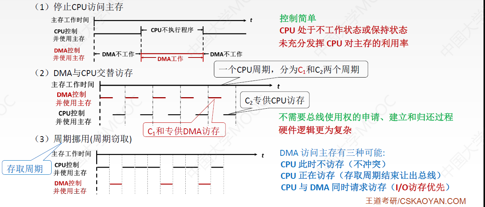

# 1、输入/输出系统

I/O就是输入输出，I/O设备就是可以将数据输入道计算机，或者可以接收计算机输出数据的外部设备。

- 输入设备：鼠标、键盘
- 输出设备：显示器、打印机
- 既可输入又可输出设备（有的教材称为外存设备）：硬盘、光盘

## 1.1、I/O接口

主机如何与I/O设备进行交互：通过**I/O接口**，又称**I/O控制器、设备控制器**，负责协调主机与外部设备之间的数据传输。I/O控制器多种多样，也会制定相应的标准，如：用于控制USB设备的IO接口、用于控制SATA 3.0硬盘的IO接口等。(I/O控制器就是一块芯片，常被集成在主板上)

### 1.1.1、I/O接口的作用

CPU和外设之间的速度差距是很大的，所以我们需要有数据寄存器来作为缓冲，一个慢速的外设可以往数据寄存器里慢慢的写入数据，当这个寄存器被写满，CPU很快的将这个寄存器的数据取走。

- 数据缓冲：通过数据缓冲寄存器（DBR）达到主机和外设工作速度的匹配
- 错误或状态监测：通过状态寄存器反馈设备的各种错误、状态信息，供CPU查用
- 控制和定时：接收从控制总线发来的控制信号、时钟信号
- 数据格式转换：串-并、并-串等格式转换
- 与主机和设备通信：实现主机—I/O接口—I/O设备之间的通信

### 1.1.2、I/O接口

如上图，

- 主机侧(系统总线)这一侧数据的传输方式只能是并行传输。(这句话2000年以前对，2000年以后错)
- 设备侧这一侧数据的传输方式既有可能是串行传输，也有可能是并行传输。

- 这样的一个I/O接口可以连接多个外设，都是通过外设界面控制逻辑连接

### 1.1.3、I/O接口的工作原理

CPU连接在左边主机侧，然后外设(例如打印机)连接在右边设备侧

1.  发命令：发送**命令字（控制字）**到I/O控制寄存器，向设备发送命令（需要驱动程序的协助）
   - CPU若想要打印机打印任务，首先CPU需要将打印机对应的命令放入状态控制寄存器
2. 读状态：从状态寄存器读取**状态字**，获得设备或I/O控制器的状态信息
3. 读/写数据：从数据缓冲寄存器发送或读取数据，完成主机与外设的数据交换

**控制寄存器、状态寄存器**在使用时间上是错开的，因此有的I/O接口中**可将二者合二为一**。 IO控制器的各种寄存器称为**IO端口**。例如数据缓冲寄存器称为数据端口，状态寄存器称为状态接口。

- 地址线的作用：给CPU指明给哪个I/O端口读/写数据
- 控制线的作用：发出读/写IO端口的信号、中断请求信号，用于指名对这个IO端口是要读/写
- 数据线的作用：读写数据、状态字、命令字(控制字)、中断类型号都通过数据总线传输

### 1.1.4、接口与端口

I/O端口就是一个一个的寄存器。由于I/O接口内部有很多端口(寄存器)，为了标明CPU要访问的是哪个寄存器，因此我们就需要给这些端口(寄存器)进行编址。 CPU对于不同端口(寄存器)的操作是不一样的：

- 对于数据端口(寄存器)既可以读也可以写
- 对于控制端口(寄存器)只能写
- 对于状态端口(寄存器)只能读

如何访问I/O端口？I/O端口要想能够被CPU访问，必须要有端口地址，每一个端口都对应着一个端口地址。

### 1.1.5、统一编址和独立编址

- 统一编址：把I/O端口当做存储器的单元进行地址分配，用统一的访存指令就可以访问I/O端口，又称**存储器映射方式**(意思就是I/O端口的地址和内存的地址是一整套)

  - 靠不同的**地址码**区分内存和I/O设备，I/O地址要求相对固定在地址的某部分

    - 访问内存类的指令都可以访问I/O端口，比如`LOAD`指令，只要可以访问内存也可以访问I/O端口

  - 如系统总线中地址线共10根，则可以访问的存储单元个数为2^10^=1024个，假设要给10个I/O端口编址

    1. 0-9 表示I/O地址，10-1023为主存单元地址

    2. 0-1013表示主存单元地址，1014-1023为I/O地址
    3. 10-19表示I/O地址，0-9、20-1023为主存单元地址

  - 优点：不需要专门的输入/输出指令，所有访存指令都可直接访问端口，程序设计灵活性高。端口有较大的编址空间，读写控制逻辑电路简单

  - 缺点：端口占用了储存地址空间使储存地址空间变小，外设寻址时间长(地址位数多，地址译码速度慢)

- 独立编址： I/O端口地址与存储器地址无关，独立编址CPU需要设置**专门的输入/输出指令**访问端口，又称**I/O映射方式**(意思就是I/O端口的地址和内存的地址是相互独立的)
  - 靠不同的**指令**区分内存和I/O设备
  - 如上图。给内存编制和给I/O端口编址，两个地址是有可能重复的，所以需要设置**专门的I/O指令访问I/O端口**。
  - 优点：使用专用I/O指令，程序编址清晰。I/O端口地址位数少，地址译码速度快。I/O端口的地址不占用储存地址空间
  - 缺点：I/O指令类型少，一般只能对指令进行传送操作，程序设计灵活性差。需要CPU提供存储器读/写、I/O设备读/写两组控制信号，增加了控制逻辑电路的复杂性

### 1.1.6、I/O接口的类型

按数据传送方式可分为：

- 并行接口：一个字节或一个字所有位同时传送。
- 串行接口：一位一位地传送。
- 注：这里所说的数据传送方式指的是外设和接口一侧的传送方式，而在主机和接口一侧，数据总是并行传送的(408应该不考这模棱两可的东西)。接口要完成数据格式转换。

按主机访问I/O设备的控制方式可分为：

- 程序查询接口
- 中断接口
- DMA接口

按功能选择的灵活性可分为：

- 可编程接口
- 不可编程接口

### 1.1.7、小结

# 2、I/O控制方式

## 2.1、程序查询方式

- **程序查询方式**：CPU启动I/O操作之后，例如启动一个读操作，当I/O设备在准备数据的时候， CPU会不断的轮巡检查I/O接口当中这个状态是否已完成，当CPU发现I/O设备的数据准备完成之后， CPU才会去I/O接口当中取走数据。在I/O设备准备数据的这个过程当中，CPU不可以干其他事情， CPU需要一直轮巡检查I/O接口状态。

- **程序中断方式**：每一次I/O设备(外设)准备好一个字的数据， CPU就需要运行一次中断服务程序，把这一个字的数据转存到主存当中，所以对于那些速度很快的I/O设备来说，采用这种中断控制方式，会使CPU执行中断服务程序开销很大，效率很低
- DMA方式：DMA控制器也是一种I/O控制器，也就是I/O接口。在数据准备阶段，CPU与外设并行工作， DMA方式在外设与内存之间开辟一条直接数据通路，信息传送不再经过CPU，降低了CPU在传送数据时的开销，因此称为直接存储器存取方式。由于数据传送不经过CPU，也就不需要保护恢复CPU现场等操作

## 2.2、程序查询方式流程图

1. CPU执行初始化程序，并预置传送参数
2. 向I/O接口发出命令字，启动I/O设备
3. 从外设接口读取其状态信息(轮询查询)
4. CPU不断查询I/O设备状态，直到外设准备就绪
5. 传送一次数据，一般为一个字
6. 修改地址和计数器参数
7. 判断传送是否结束，若未结束则转到第3步，直到计数器为零

在这种控制方式下，CPU一旦启动I/O，就必须停止现行程序的运行，并在现行程序中插入一段程序。

- 程序查询方式的主要特点是CPU有踏步等待现象， CPU与I/O串行工作。
- 优点：接口设计简单，设备量少
- 缺点： CPU在信息传送过程中要花费很多时间用于查询和等待，而且在一段时间内只能和一台外设交换信息，效率大大降低

## 2.3、例题

题目告诉我们这个系统采用**程序查询方式**， CPU和I/O接口之间的数据输入输出时间不考虑，只考虑查询时间。

每一个查询操作需要100个时钟周期，CPU的时钟频率是50MHz，则时间：

- 一个时钟周期 = 1/时钟频率 = 1/50Mhz = 20ns
- 一个查询操作耗时 = 100 × 20ns = 2000ns

鼠标：

- 每秒对鼠标进行30次查询，则每秒查询鼠标耗时 = 30 × 2000ns = 60000ns
- 查询鼠标所花费的时间比率 =  60000ns/1s = 0.006%

硬盘：

- 每32(4B)位需要查询一次，每秒传送 2×2^20^B，则每秒需要查询 (2×2^20^B)/4B=2^19^次
- 查询硬盘耗时 2^19^ × 2000ns = 512×1024×2000ns

# 3、程序中断方式

## 3.1、中断的基本概念

程序中断是指在计算机执行现行程序的过程中，出现某些急需处理的异常情况或特殊请求，CPU暂时中止现行程序，而转去对这些异常情况或特殊请求进行处理，在处理完毕后CPU又自动返回到现行程序的断点处，继续执行原程序。

如上图， CPU执行完一条指令在末尾都会检查是否有中断请求，例如键盘敲击产生一个中断请求， CPU会暂时改变自己执行指令的流，转而执行中断服务程序。

CPU处理中断的基本流程：

1. 中断请求
   - 中断源向CPU发送中断请求信号
2. 中断响应
   - 响应中断的条件： CPU如果执行了关中断指令，那么CPU就会暂时不理睬这些中断信号
   - 中断判优：多个中断源同时提出请求时通过中断判优逻辑响应一个中断源。
3. 中断处理
   - 中断隐指令
   - 中断服务程序

## 3.2、中断请求的分类

CPU如何判断自己当前处于关中断的状态呢？这个信息会被记录在PSW状态寄存器里面，当IF=1表示开中断(允许响应中断)，IF=0表示关中断(不允许响应中断)。关中段可以用来辅助原子操作。

- **非屏蔽中断**，在关中断时也会被响应(如电脑关机是必须被响应的)
- 可屏蔽中断：在关中断时不会被响应

## 3.3、中断请求标记

中断请求标记：判断是哪个设备发来的中断信号

每个中断源向CPU发出中断请求的时间是随机的。为了记录中断事件并区分不同的中断源，中断系统需对每个中断源设置**中断请求标记触发器INTR**，当其状态为"1"时表示中断源请求。这些触发器可组成中断请求标志寄存器，该寄存器可集中在CPU中，也可分散在各个中断源中。

通过INTR线发出的是可屏蔽中断，也就是外中断，对于**外中断**，CPU是在统一的时刻即**每条指令执行阶段结束前**向接口**发出中断查询信号**，以获取I/O的中断请求，也就是说，**CPU响应中断的时间**是在每条**指令执行阶段的结束时刻**。

 CPU响应中断必须满足以下三个条件：

1. 中断源有中断请求
2. CPU允许中断即开中断(异常和不可屏蔽中断不受此限制)
3. 一条指令执行完毕(异常不受此限制)，且没有更紧迫的任务

## 3.4、中断判优

中断判优：有多个中断信号同时到来，先处理哪一个中断

中断判优既可以用硬件实现，也可以用软件实现：

- 硬件实现是通过**硬件排队器**实现的，它既可以设置在CPU中，也可以分散在各个中断源中
- 软件实现是通过**查询程序**实现

1. 不可屏蔽中断 > 内部异常 > 可屏蔽中断
2. 内部异常中，硬件故障 > 软件中断
3. DMA中断请求优先于I/O设备传送的中断请求
4. 在I/O传送类中断请求中，高速设备优先于低速设备，输入设备优先于输出设备，实时设备优先于普通设备

## 3.5、中断处理过程

如上图，在K指令执行结束后发现了一个中断信号，此时我们需要让PC指向该中断处理程序的第1条指令的地址，但是由于此时PC指向的是K+1条指令，现在这个中断事件导致程序执行流发生了改变，所以CPU处理完中断之后，又需要将PC的值指向K+1。

- **中断隐指令**：保存原程序的PC值，并让PC指向中断服务程序的第一条指令。**中断隐指令**并不是一条具体的指令，而是CPU在检测到中断请求时自动完成的一系列动作。
- **中断隐指令**的主要任务：
  - **关中断。**在中断服务程序中，为了保护中断现场（即CPU主要寄存器中的内容）期间不被新的中断所打断，必须关中断，从而保证被中断的程序在中断服务程序执行完毕之后能接着正确地执行下去。
  - **保存断点**。为了保证在中断服务程序执行完毕后能正确地返回到原来的程序，必须将原来程序的断点（即程序计数器（PC）的内容）保存起来。可以存入堆栈，也可以存入指定单元。
  - **引出中断服务程序**。识别中断源，将对应的服务程序入口地址送给程序计数器PC。有两种方法识别中断源，**硬件向量法和软件查询法**

### 3.5.1、硬件向量法

我们给每一个中断请求信号进行编号，在主存中与这些中断请求号对应的单元中保存了 JMP 指令，这个指令指明了这个中断请求所对应的中断请求处理程序的入口地址，中断请求处理程序的入口地址就是**中断向量**。把系统中的全部中断向量集中存放到存储器的某个区域内，这个存放中断程序的存储区就称为中断向量表。

我们用硬件排队器进行中断判优，只会有一条线输出1，其他的输出线一律都是0，将硬件排队器输出作为中断向量地址形成部件的输入，将其映射为某一个向量地址（中断类型号）。 CPU响应中断后，通过识别中断源获得**中断类型号**，然后据此计算出对应中断向量的地址，再根据该地址从中断向量表中取出中断服务程序的入口地址并送入程序计数器PC，于是CPU转而执行中断服务程序，这种方法被称为中断向量法，采用中断向量法的中断被称为向量中断。

### 3.5.2、中断服务程序

中断服务程序的主要任务：

1. 保护现场
   - 保存通用寄存器和状态寄存器的内容，以便返回原程序后可以恢复CPU环境，可使用堆栈，也可以使用特定存储单元
2. 中断服务(设备服务)
   - 主体部分，如通过程序控制需打印的字符代码送入打印机的缓存存储器中
3. 恢复现场
   - 通过出栈指令或者取数指令，把之前保存的信息送回寄存器中
4. 中断返回
   - 通过中断返回指令，回到原程序断点处

### 3.5.3、总结

正常情况，CPU取一条指令执行一条指令，取一条指令执行一条指令，顺序执行各条指令。在每条指令的末尾，CPU都会检查是否有中断信号，若没有中断信号需要处理，则继续取下一条指令执行下一条指令。若有中断信号需要处理：

- 假设执行K指令发现了中断信号，此时PC的值指向K+1
-  CPU检测到中断信号之后，会执行中断隐指令
  - 首先将原来程序的PC值放入栈中保存
  - 执行关中断
  - 计算出向量地址，从中断向量表中得到对应的中断向量，让PC指向中断向量，这样PC就指向了中断服务程序1的第一条指令
- 接下来开始执行中断服务程序
  - 中断服务程序1首先要保存现场
  - 然后执行设备服务，也就是对中断请求信号做具体的处理
  - 恢复以前的运行环境
  - 执行开中断、中断返回。中断服务程序的最后一条指令，通常是一条中断返回指令，使其返回到原程序的断点处，以便继续执行原程序

> 单重中断：执行中断服务程序时，不响应新的中断请求
>
> - 因为关中断和开中断保证了中断服务程序一气呵成，即使此时有新的中断请求也不会响应

## 3.6、多重中断

单重中断：在CPU执行中断服务程序的过程中，又出现了新的更高优先级的中断请求，而CPU对新的中断请求不予响应，则这种中断称为单重中断

多重中断：又称中断嵌套，执行中断服务程序时可响应新的中断请求。(也就是执行中断服务程序时又发生了中断， CPU暂停现行的中断服务程序转去处理新的中断请求)

> 保护现场和恢复现场的操作都必须一气呵成

多重中断其实就是又增加了一条关中断和开中断，并且多层中断，在保护现场时也会保护屏蔽字。屏蔽字也叫中断屏蔽字，他可以屏蔽某些中断

### 3.6.1、中断屏蔽技术

中断屏蔽技术主要用于多重中断，CPU要具备多重中断的功能，须满足下列条件：

1. 在中断服务程序中提前设置开中断指令。
2. 优先级别高的中断源有权中断优先级别低的中断源。

每个中断源都有一个屏蔽触发器，1表示屏蔽该中断源的请求，0表示可以正常申请，所有屏蔽触发器组合在一起，便构成一个屏蔽字寄存器，屏蔽字寄存器的内容称为屏蔽字

左边是硬件排队器，右边是增加了中断屏蔽功能的硬件排队器.

- 左边硬件排队器：收到多个中断请求时只响应其中一个中断请求，是固定优先级
- 右边：可以调整多重中断的优先级

屏蔽字设置的规律：

1. 一般用"1"表示屏蔽，"0"表示正常申请
2. 每个中断源对应一个屏蔽字(在处理该中断源的中断服务程序时，屏蔽寄存器中的内容为该中断源对应的屏蔽字)。
3. 屏蔽字中"1"越多，优先级越高。每个屏蔽字中至少有一个"1"(至少要能屏蔽自身的中断)

### 3.6.2、例题

如果ABCD同时发来中断请求，A的中断请求优先级最高，D的中断请求优先级最低。要将中断处理次序进行改造：

- 对于中断源A，它的中断处理程序只能被D给中断，所以当CPU在处理A的中断信号的时候，只有D的中断信号不可以被屏蔽，所在在D处写0
- 对于中断源B，它的处理程序可以被D、A、C给中断，所以当CPU在处理B的中断信号的时候，不可以屏蔽其他所有中断，其他信号源屏蔽字全为0，但自身不可以被屏蔽所以写1
- 对于中断源C，它的处理程序可以被D、A给中断，所以当CPU在处理C的中断信号的时候，D、A屏蔽字为0，其余屏蔽字为1
- 对于中断源D，它的处理程序不可以被中断，所以当CPU在处理D的中断信号的时候，屏蔽字全为1

在时刻5，B发出中断请求， CPU就会运行与B相关的中断服务程序，当运行5us到时刻10，D发出中断请求，此时B虽还未执行完毕，但D的优先级高于B，于是D中断B而获得CPU。D运行20us到时刻30完成，于是继续运行B的中断程序，当再运行5us到时刻35，A发出中断请求抢走CPU，于是A运行20us到时刻55完成，再次继续运行B，运行5us到时刻55，C发出中断请求抢走CPU，于是C运行20us到时刻80完成，再次继续运行B，运行5us结束。

## 3.7、小结

向量地址指向了中断向量的地址，而中断向量指向了中断服务程序的入口地址。

# 4、程序中断方式进阶

如上图， CPU正在运行某一个现行程序，这个程序有可能需要使用到外部设备，那么我们需要将I/O指令发送给外部设备，接下来这个外部设备就可以准备CPU想要的数据和信息，在外部设备准备数据的过程当中，CPU可以继续执行现行程序。当外部设备完成准备数据工作之后，会给CPU发送中断请求信号，假设CPU执行的现行程序是指令K，在指令K末尾检测到中断请求信号，CPU然后对这个中断请求信号进行处理。处理完成后CPU执行K+1指令，继续执行现行程序

- 程序查询方式：CPU会不断的轮巡检查外部设备是否准备好数据的状态，引入中断系统之后，就可以继续执行线性程序

CPI：每一条指令需要多少个时钟周期，时钟周期 = 1/CPU时钟频率。外设准备数据的时间需要0.5ms，设备D采用中断方式进行输入/输出，I/O端口每收到一个字符申请一次中断，中断响应需要10个时钟周期(收到中断请求到作出中断响应这段时间10个时钟周期)，中断服务程序有20条指令，其中第15条指令启动D工作。

问：若CPU需从D读取1000个字符，则完成这一任务所需的时间大约是多少个时钟周期？ CPU用于完成这一任务的时间大约是多少个时钟周期？在中断响应阶段CPU进行了哪些操作？

第一问：

- 主频50Mhz，时钟周期 = 1/50Mhz = 20ns
- 0.5ms对应的时钟周期数 = 0.5ms/20ns = 25000
- 传送1个字符需要的时钟周期数 = 25000 + 10 + 15×4 = 25070
  - 中断服务程序的第15条指令又启动外设工作，说明运行15条指令就可以从D中读出一个字符
- 传送1000个字符需要的时钟周期数 =  25070 × 1000 = 25070000

第二问：第二问其实是在问中断服务程序的时钟周期(这搁这考阅读能力呢？)

- CPU用于该任务的时间大学为 1000 × (10+20×4) = 9 ×10^4^个时钟周期

# 5、DMA方式

## 5.1、DMA控制器

DMA控制器通常用来控制块设备，假设CPU想要读入磁盘的一整块的数据，CPU向DMA控制器指明执行输入操作，从I/O设备(磁盘)输入数据到主存当中，指明要传送多少个数据，指明数据在磁盘的什么地址，在内存的什么地址。假设此次传输的块中有5个字，DMA要进行计数此时已经传了几个字了，磁盘中的数据是一个字一个字丢给DMA控制器的，所以DMA控制器还需要有数据缓冲寄存器。

这一个字传送给主存之前：

1. DMA控制器接受外设发出的DMA请求（外设传送一个字的请求），并向CPU发出总线请求
2. CPU响应此总线请求，发出总线响应信号，接管总线控制权，进入DMA操作周期。

这一个字传送给主存传送时：

3. 确定传送数据的主存单元地址及长度，并能自动修改主存地址计数和传送长度计数。
4. 规定数据在主存和外设间的传送方向，发出读写等控制信号，执行数据传送操作。

这一个字传送给主存传送后：

5. 向CPU报告DMA操作的结束

---

将DMA控制器内部细化：DMA控制器 = DMAC

通过系统总线，DMAC和主存相连，DMAC和设备相连。块设备输入或输出的数据都会先被放到数据缓冲寄存器里面，

- 主存地址计数器：简称AR，存放要交换数据的主存地址
- 传送长度计数器：简称WC，用来记录传送数据的长度，计数溢出时，数据即传送完毕，自动发中断请求信号
- 数据缓冲寄存器：暂存每次传送的数据
- DMA请求触发器：每当I/O设备准备好数据后给出一个控制信号，使DMA请求触发器置位
- 控制/状态逻辑：用于指定传送方向，修改传送参数，并对DMA请求信号和CPU响应信号进行协调和同步
- 中断机构：当一个数据块传送完毕后触发中断机构，向CPU提出中断请求

注：在DMA传送过程中，DMA控制器将接管CPU的地址总线、数据总线和控制总线，CPU的主存控制信号被禁
止使用。而当DMA传送结束后，将恢复CPU的一切权利并开始执行其操作。（DMA控制器通过系统总线向主存传送数据的过程，CPU不能使用系统总线，直到DMA控制器传送完成数据，CPU才能继续使用系统总线）

## 5.2、DMA的传送过程

单总线结构：

DMA的传送过程：

1. 预处理
   - CPU会向DMAC指明要读/写的数据应该存放在主存当中的什么位置，应该存放在I/O设备的什么位置，指明传送数据的个数，然后启动I/O设备
     - 主存起始地址 -> AR
     - I/O设备地址 -> DAR
     - 传送数据个数 -> WC
2. 数据传送：
   - CPU继续执行现行程序
   - 设备将数据写入DR数据缓冲寄存器，写满后向DMAC发送DMA请求，DMAC向总线发送总线请求，DMAC就获得了总线控制权接管总线，就可以通过地址线、数据线、系统总线来给主存发出写命令。当传送长度计数器溢出发出DMA中断请求，说明一个字的数据已经发送结束。
3. 后处理
   - CPU运行相应的中断服务程序，做DMA结束处理
   - CPU继续执行现行程序

> 到底要让谁使用主存，这个操作完全由CPU控制，因为CPU将总线给了DMAC就意味着CPU不能访问主存

我们现在换一种总线的连接方式(三总线结构)，主存和DMA接口之间之间有一条直接数据通路DMA总线。主存和CPU是由主存总线连接，DMA接口使用DMA总线，可以一直持有DMA总线。

由于DMA方式传送数据不需要经过CPU，因此不必中断现行程序，**I/O与主机并行工作，程序和传送并行工作**。

DMA方式具有下列特点：

1. 它使主存与CPU的固定联系脱钩，主存既可被CPU访问，又可被外设访问。
2. 在数据块传送时，主存地址的确定、传送数据的计数等都由硬件电路直接实现。
3. 主存中要开辟专用缓冲区，及时供给和接收外设的数据。
4. DMA传送速度快，CPU和外设并行工作，提高了系统效率。
5. DMA在传送开始前要通过程序进行预处理，结束后要通过中断方式进行后处理。

## 5.3、DMA传送方式

主存和DMA控制器之间有一条数据通路，因此主存和I/O设备之间交换信息时，不通过CPU。但当I/O设备和CPU
同时访问主存时，可能发生冲突，为了有效地使用主存，DMA控制器与CPU通常采用以下3种方法使用主存。

1. 停止CPU访问主存

   - 当DMA工作时CPU不工作
   - CPU处于不工作状态或保持状态，控制简单，但未充分发挥CPU对主存的利用率

2. DMA和CPU交替访存

   - 不需要总线使用权的申请、建立和归还过程
   - 硬件逻辑更为复杂

3. 周期挪用(周期窃取)

   - 当I/O设备有DMA请求时，会遇到3种情况：

     1. 此时CPU不访存，因此I/O的访存请求和CPU未发生冲突

     2. CPU正在访存，此时必须等CPU存取周期结束后，CPU再将总线占有权让出

     3. CPU和DMA同时请求访存，出现访存冲突，此时CPU要暂时放弃总线占有权， I/O访存优先级高于CPU访存，因为I/O不立即访存就可能丢失数据。此时由I/O设备挪用一个或几个存取周期，传送完一个数据后，立即释放总线，是一种单字传送方式

        

## 5.4、DMA方式与中断方式

|          | 中断                                     | DMA                                           |
| -------- | ---------------------------------------- | --------------------------------------------- |
| 数据传送 | 程序控制 程序的切换 -> 保存和恢复现场 | 硬件控制 CPU只需进行预处理和后处理         |
| 中断请求 | 传送数据                                 | 后处理                                        |
| 响应     | 指令执行周期结束后响应中断               | 每个机器周期结束均可，总线空闲即可响应DMA请求 |
| 场景     | CPU控制，低速设备                        | DMA控制器控制，高速设备                       |
| 优先级   | 优先级低于MDA                            | 优先级高于中断                                |
| 异常处理 | 能处理异常事件                           | 仅传送数据                                    |

## 5.5、小结

