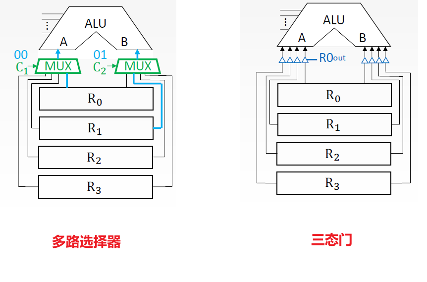
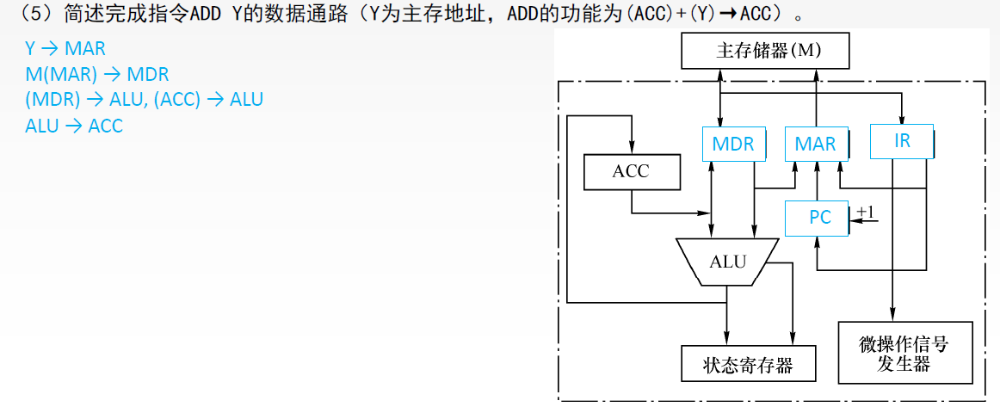
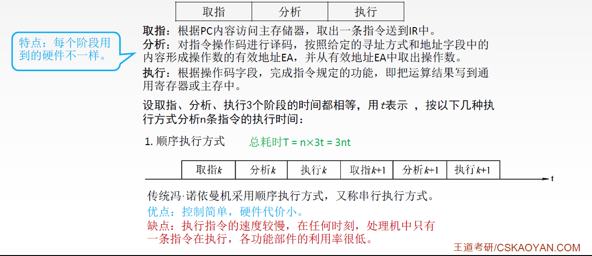
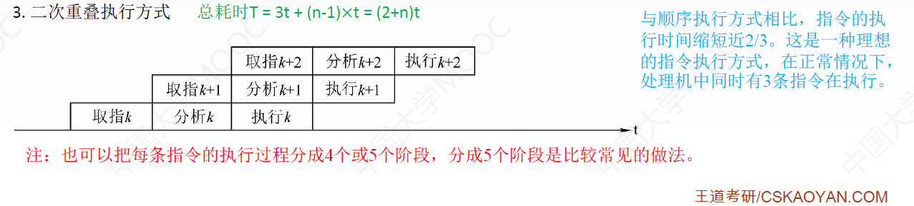

# 1、CPU的功能和基本结构

CPU由运算器和控制器构成，其主要功能有：

1. **指令控制**。完成取指令、分析指令和执行指令的操作，即程序的顺序控制。
2. **操作控制**。一条指令的功能往往是由若干操作信号的组合来实现的。CPU管理并产生由内存取出的每条指令的操作信号，把各种操作信号送往相应的部件，从而控制这些部件按指令的要求进行动作。
3. **时间控制**。对各种操作加以时间上的控制。时间控制要为每条指令按时间顺序提供应有的控制信号。
4. **数据加工**。对数据进行算术和逻辑运算。
5. **中断处理**。对计算机运行过程中出现的异常情况和特殊请求进行处理。

运算器主要是对数据进行加工，控制器协调并控制计算机各部件执行程序的指令序列，基本功能包括取指令、分析指令、执行指令、中断处理

- 取指令：自动形成指令地址；自动发出取指令的命令。
- 分析指令：操作码译码(分析本条指令要完成什么操作)；产生操作数的有效地址。
- 执行指令：根据分析指令得到的"操作命令"和"操作数地址"，形成操作信号控制序列，控制运算器、存储器以及I/O设备完成相应的操作。
- 中断处理：管理总线及输入输出；处理异常情况(如掉电)和特殊请求(如打印机请求打印一行字符)。

 

## 1.1、运算器的基本结构

### 1.1.1、专用数据通路方式

运算器的核心就是ALU算数逻辑单元，算术逻辑单元：主要功能是进行算术/逻辑运算，很多时候我们会把要运算的数据提前存放在某些寄存器当中，所以运算器还会提供通用寄存器组：如AX、BX、CX、DX、SP等，用于存放操作数（包括源操作数、目的操作数及中间结果）和各种地址信息等。SP是堆栈指针，用于指示栈顶的地址。

如上图，共给出了4个通用寄存器编号为R0-R3，AH-AL指的是AX通用寄存器的高位和低位，BH-BL也是类似。寄存器里面的内容既有可能作为输入数据A，也有可能作为输入数据B，所以每个寄存器需要两组线路来完成数据的传输。每个寄存器和ALU之间都有一个专门的数据通路，称为**专用数据通路方式**：根据指令执行过程中的数据和地址的流动方向安排连接线路。(**只要两个部件之间有数据的流动，那么我们就在这两个部件之间建立一个专门的连接线路**)

- 专用数据通路方式的优点：性能较高，基本不存在数据冲突现象，但结构复杂，硬件量大，不易实现。

问题：

1. 部件多的多，连线也会多会变复杂
2. 如果直接用导线连接，相当于多个寄存器同时并且一直向ALU传输数据

解决方法：

1. 使用多路选择器(MUX)，根据控制信号选择一路输出
2. 使用三态门，可以控制每一路是否输出

- 如上左图，若采用多路选择器MUX，MUX会根据控制信号来决定让哪个寄存器的数据通过成为A。
- 如上右图，若采用三态门，每一个三态门可以控制一条路是否通过，每个小三角代表一个三态门，每个三态门有三个接口，第一个就是输入的接口，第二个接口是输出的接口，正常情况下三态门是不连通的，第三个接口就是控制其是否连通。如：R0~out~为1时R~0~中的数据输出到A端，R0out为0时R~0~中的数据无法输出到B端

### 1.1.2、CPU内部单总线方式

CPU内部单总线方式：将所有寄存器的输入端和输出端都连接到一条公共的通路上。

在CPU的内部设置一条总线，所有寄存器都连接到这条总线上，如上图，R0~out~为1的时候R0的数据会被输出到这条数据总线上，若我们想把R~0~的数据复制一份到R~2~上，我们只需要让R2~in~为1，这样R2的输入通路(绿色线)会被连通。out是输出信号，in是输入信号。

CPU内部单总线方式优点：结构简单，容易实现，但数据传输存在较多冲突的现象，性能较低。例如我们要对R0和R1的数据进行加法操作， R0和R1的数据同时送到总线上， ALU无法判断A和B是什么值。所以我们给其中一端加了一个**暂存寄存器**，这样我们将R0的数据先送到数据总线，再送到暂存寄存器当中，接下来在将R1的数据送到数据总线再送到B就不会产生冲突。

暂存寄存器用于暂存从**主存**读来的数据，这个数据不能存放在**通用寄存器(R0、R1、R2、R3)**中，否则会破坏其原有内容。如：两个操作数分别来自主存和R~0~，最后结果存回R~0~，那么从主存中取来的操作数直接放入暂存暂存器，而不放入通用寄存器，这样就不会破坏运算前R~0~的内容。同时在ALU之后也放一个暂存寄存器，这样当R~0~送到总线上的信号稳定之后，ALU会把计算的结果先放到暂存寄存器，等ALU的结果稳定之后再送回数据总线，将结果放回R~0~。

- 当然，为了方便，我们还可以给暂存寄存器增加一些功能使之变成移位寄存器、累加寄存器等。
- 当然我们也可以直接在R~0~寄存器上方再放一个累加寄存器ACC：用于暂时存放ALU运算的结果信息，用于实现加法运算
- 还可以再放一个程序状态寄存器：保留由算术逻辑运算指令或测试指令的结果而建立的各种状态信息，如溢出标志（OP），符号标志（SF）、零标志（ZF）、进位标志（CF）等。PSW中的这些位参与并决定微操作的形成。
- 运算器还要提供移位器：对运算结果进行移位运算。
- 运算器还要提供计数器：控制乘除运算的操作步数。

## 1.2、控制器的基本结构

上图中，左边是运算器，右边是控制器，控制器组成如下：

1. **程序计数器P**C：用于指出下一条指令在主存中的存放地址。CPU就是根据PC的内容去主存中取指令的。因为程序中指令（通常）是顺序执行的，所以PC有自增功能。
2. **指令寄存器IR**：指令取出后，会放入指令寄存器当中，所以指令寄存器用于保存当前正在执行的那条指令。指令的**地址码**会被输送到总线上。
3. **指令译码器ID**：仅对**操作码字段**进行译码，向控制器提供特定的操作信号。控制信号控制不同的微操作。
4. **微操作信号发生器**：根据IR的内容（指令）、PSW的内容（状态信息）及时序信号，产生控制整个计算机系统所需的各种控制信号，其结构有**组合逻辑型**和**存储逻辑型**两种。
5. **时序系统**：用于产生各种时序信号，它们都是由统一时钟（CLOCK）分频得到。
6. **存储器地址寄存器MAR**：用于存放所要访问的主存单元的地址。
7. **存储器数据寄存器MDR**：用于存放向主存写入的信息或从主存中读出的信息。

取出指令之后，会放入指令寄存器IR当中，指令的地址码指明了操作数的存放地址，所以地址码的信息需要输出到内部总线上，而操作码部分会送给指令译码器ID，译码器的某个输出端被选通，这样就可以判断当前指令类型，进而决定接下来执行的是什么微操作，所以译码器的输出信号会作为微操作信号发生器的输入信号，微操作执行要有先后次序，所以控制器还提供时序系统产生时序信号，再根据PSW标志，就可以确定下一个微操作到底是什么。

假如当前的指令地址码直接指明了操作数在内存中的存放地址，那么微操作信号发生器需要给AdIR~out~有效信号，把地址输出到内部总线，同时给MAR~in~有效信号，这样这个地址信息才可以输入到MAR当中，MAR中的地址信息需要通过地址总线传送给主存，然后主存根据地址信号去查找相应的主存单元，找到数据之后主存通过数据总线会将其放到MDR当中，这样就完成了对某个主存地址的读操作。MDR~in~E表示外部总线输入线路是否有效，MDR~in~表示CPU内部总线输入线路是否有效。MDR~out~E和MDR~out~相同。

---

运算器主要由ALU和一系列寄存器组成，控制器主要由一系列寄存器和控制单元CU组成，CPU内部有些寄存器是用户可见的，有些是用户不可见的，用户可见的意思是说程序员可以通过汇编语言来改变某一些寄存器内部的值，如上图，用户可见的寄存器用灰色颜色标注。

总的来说，CPU由ALU、寄存器、CU、中断系统组成。

# 2、指令执行过程

## 2.1、指令周期

**指令周期**：CPU从主存中每取出并执行一条指令所需的全部时间。

一个指令周期可以被划分为取指周期和执行周期两个部分，其中取指周期会根据PC当前所指向的位置取出当前要执行的这一条指令，并且PC+1指向下一条应该执行的指令，另外还会对指令进行译码，也就是对指令进行分析，之后执行指令，当执行完成之后就可以取下一条指令，也就是进入下一个指令周期。所以：==一个指令周期至少要由取指周期和执行周期两个部分组成==。**指令周期**常常用若干**机器周期**来表示，机器周期又叫**CPU周期**。

- 例如上图，取指令会消耗一个机器周期，执行指令会消耗一个机器周期
- 一个**机器周期**又包含若干**时钟周期**（也称为**节拍**、**T周期**或**CPU时钟周期**，它是**CPU操作的最基本单位**）。

CLK指的是时钟脉冲，如上图红色方波就是一个时钟脉冲，例如CPU的主频是3.0GHz，意味着CPU每秒可以发射3.0G次的时钟周期，我们取指令的过程需要分为几个微操作的步骤来执行，如果取指令的过程需要4个微操作，那就意味着取指令需要消耗4个时钟周期，如上图，T~0~到T~3~共4个时钟周期分别执行了4个微操作之后，我们才完成了取指令这个动作。

- 取出指令之后有可能需要对形式地址进行转换，转换成有效地址也需要消耗若干个时钟周期，如上图消耗了4个时钟周期用来取有效地址
- 执行指令又需要若干个微操作，如上图消耗了4个时钟周期用来执行指令。
- 完成某一个完整的子工作所需要的时间就是一个机器周期，**一个机器周期需要由多个时钟周期组成**。如果说每一个子工作所需要消耗的时钟周期数都是相同的，那么每一个子工作所需要消耗的机器周期也是相同的，这种CPU就是**定长的机器周期**。
- 但是对于取指令子工作和执行指令子工作所需要的机器周期可能是不相同的，取指令需要进行访存，可能执行指令不需要进行访存，这种CPU就是**不定长的机器周期**。

> 每个指令周期内机器周期数可以不等，每个机器周期内的节拍(时钟周期)数也可以不等。

1. 假设CPU要执行的是空指令NOP，也就是让CPU什么也不干，所以只需要取指周期，因此空指令的指令周期只做了取指令和分析指令这一件事，也就是空指令的指令周期只包含一个机器周期
2. 假设CPU要执行的是加法指令ADD，所以需要取指周期和执行周期，加法指令的指令周期包含两个机器周期
3. 假设CPU要执行的是乘法指令MUL，所以需要取指周期和执行周期，乘法指令的指令周期包含两个机器周期。乘法本质是多次加法，所以执行指令周期更长
4. 假设CPU要执行的是具有间接寻址的指令，所以需要取指周期、间址周期、执行周期，这条指令的指令周期包含三个机器周期
   - 间址周期的任务是**取操作数的有效地址**。
5. 假设CPU要执行的是具有中断周期的指令，所以需要取指周期、间址周期、执行周期、中断周期，这条指令的指令周期包含四个机器周期
   - 中断周期的任务是处理中断请求

## 2.2、指令周期流程

1. 从主存当中取出指令：这段时间称为取指周期
2. 如果指令的地址码部分采用了间接寻址，那么我们就需要间址周期
3. 如果指令地址码部分没有采用间接寻址，那么直接进入执行周期
4. 指令执行结束之后，会例行检查是否有中断信号需要处理，若有中断信号需要处理那么就进入中断周期；否则这个指令的指令周期就结束，会进入下一条指令的指令周期

思考：取值周期、间址周期、执行周期、中断周期CPU做的事情是不一样的，那么CPU如何区分当前到底处于哪个周期呢？

为了解决上述问题，我们设置4个触发器，一个触发器可以存放一个二进制位0或者1，我们可以设置4个触发器来分别表示当前处于哪个周期：

1. 如果当前处于取值周期，那么FE触发器的值设为1，其余触发器设为0
2. 取值周期结束后进入间址周期，那么IND触发器的值设为1，其余触发器设为0

- 四个工作周期都有可能有CPU访存操作，只是访存的目的不同。
  - **取指周期**是为了取指令
  - **间址周期**是为了取有效地址
  - **执行周期**是为了取操作数
  - **中断周期**是为了保存程序断点

我们来探讨在四个周期分别要做什么事情：

### 2.3.1、取指周期

取指周期的任务是根据PC中的内容从主存储器中取出指令代码并存放在IR中。

1. 当前指令地址送至存储器地址寄存器，记做：(PC) → MAR
   - PC -①- MAR -②- 地址总线 -③-主存储器
2. CU发出控制信号，经控制总线传到主存，这里是读信号，记做：1 → R
   - CU发出读命令 -④- 控制总线 -⑤- 主存储器
   - 主存储器有两个接口：读R和写W接口，给R接口输送高电平1，就表示主存储器需要进行读操作
3. 将MAR所指主存中的内容经数据总线送入MDR，记做：M(MAR) → MDR
   - MAR指明了当前要取出的指令存放在什么地址，这个地址信息通过地址总线送给主存储器，我们读出这个地址相应的数据，意味着我们读出了接下来要执行的这条指令，这条指令会通过数据总线送到MD R
   - M指的是Memory，主存当中MAR所指向的数据放到MDR当中
4. 将MDR中的内容(此时是指令)送入IR，记做：(MDR) → IR
   - 主存储器 -⑥- 数据总线 -⑦- MDR -⑧- IR
5. CU发出控制信号，形成下一条指令地址，记做：(PC)+1 → PC
   - CU发出控制信号 -⑨- PC+1

### 2.3.2、间址周期

间址周期的任务是取操作数的有效地址。

1. 将**指令的地址码**送入MAR，记做：Ad(IR) → MAR或Ad(MDR) → MAR
   - Ad(IR) -①- MAR -②- 地址总线 -③-主存储器
   - 之所以也可以将MDR里的地址放入MAR当中，是因为我们在取指令的时候是先将指令放入MDR，然后复制一份给IR
2. CU发出控制信号，启动主存做读操作，记做：1 → R
   - CU发出读命令 -④- 控制总线 -⑤- 主存储器
3. 将MAR所指主存中的内容经数据总线送入MDR，记做：M(MAR) → MDR
   - 主存 -⑥- 数据总线 -⑦- MDR(存放有效地址) 
4. 将有效地址送至指令的地址码字段，记做：(MDR)→ Ad(IR)

### 2.3.3、执行周期

执行周期的任务是根据IR中的指令字的操作码和操作数通过ALU操作产生执行结果。不同指令的执行周期操作不同，因此没有统一的数据流向。

### 2.3.4、中断周期

假设当前程序由指令1、指令2、指令3、指令4组成，假设我们正在执行指令2，那么PC的值会指向指令3，指令2执行结束之后会进行中断检查，如果此时有中断信号需要处理，那么在执行了指令2之后就需要暂停执行当前程序，转而去执行处理这个中断的中断处理程序，假设这个中断处理程序是由指令x、指令y、指令z组成，这就意味着指令2执行结束之后会去执行中断处理程序的指令x，指令y、指令z，执行完中断处理程序之后，我们又需要回来继续执行指令3，为了保证中断处理程序执行之后我们还能找到指令3的位置，因此我们需要将当前程序的中断点保存，本质上就是要保存PC的值，因为PC指向的就是指令3。(本质就是将PC的值压入栈顶)

中断：暂停当前任务去完成其他任务。为了能够恢复当前任务，需要**保存断点**。一般使用**堆栈**来保存断点，这里用SP表示栈顶地址，假设**SP指向栈顶元素**，进栈操作是**先修改指针，后存入数据**。中断周期的任务是处理中断请求

1. CU控制将SP减1，修改后的地址送入MAR。记做：(SP)-1 → SP，(SP) → MAR。本质上是将断点存入某个存储单元，假设其地址为a，故可记做：a → MAR
   - SP -①- MAR -②- 地址总线 -③- 主存储器
2. CU发出控制信号，启动主存做**写操作**，记做：1 → W
   - CU发出写命令 -④- 控制总线 -⑤- 主存储器
3. 将断点(PC内容) 送入MDR，记做：(PC) → MDR
   - PC -⑥- MDR -⑦- 数据总线 -⑧- 主存储器(程序断点存入主存储器)
4. CU控制将中断服务程序的入口地址(由向量地址形成部件产生)送入PC，记做：向量地址→ PC)
   - CU(中断服务程序的入口地址) -⑨- PC
   - PC开始指向指令3，我们将PC指向指令3的中断点保存至主存储器，然后修改PC的只让其指向中断处理程序的指令x

## 2.3、指令执行方案

一个指令周期通常要包括几个时间段（执行步骤），每个步骤完成指令的一部分功能，几个依次执行的步骤完成这条指令的全部功能。

- **单指令周期**：对所有指令都选用相同的执行时间来完成。指令之间串行执行，指令周期取决于执行时间最长的指令的执行时间。
  - 缺点：对于那些本来可以在更短时间内完成的指令，要使用这个较长的周期来完成，会降低整个系统的运行速度。
- **多指令周期**：对不同类型的指令选用不同的执行步骤来完成。指令之间串行执行，即下一条指令只能在前一指令执行完成后才能启动。可选用不同个数的时钟周期来完成不同指令的执行过程。
  - 缺点：需要更复杂的硬件设计。
- **流水线方案**：在每一个时钟周期启动一条指令，尽量让多条指令同时运行，但各自处在不同的执行步骤中。
  - 指令之间**并行**执行。

# 3、数据通路

数据通路：数据在功能部件之间传送的路径称为数据通路，数据通路描述了信息从哪里开始、中间经过哪些部件、最后传到哪里。控制信号是由控制部件产生的，对于各种类型的寄存器来说，有两种控制信号：1.数据输入 2.数据输出，这些信号都是由控制器发出的，所以ACC~in~、ACC~out~ 、R0~in~、R0~out~ ，所有的控制信号事实上都是和微操作信号发生器有对应的连线，微操作信号发生器发出不一样的信号就可以使得各个寄存器之间有数据的流动。

如上图数据通路采用了CPU**内部单总线方式**

1.  CPU内部单总线方式：将所有寄存器的输入端和输出端都连接到一条公共通路上，这种结构比较简单，但数据传输存在较多的冲突现象，性能较低。连接各部件的总线只有一条时，称为单总线结构。CPU中有两条或更多的总线时，构成双总线结构或多总线结构。
2. CPU内部三总线方式：将所有寄存器的输入端和输出端都连接到多条公共通路上，相比之下单总线中一个时钟内只允许传一个数据，因而指令执行效率很低，因此采用多总线方式，同时在多个总线上传送不同的数据，提高效率。
3. 专用数据通路方式：根据指令执行过程中的数据和地址的流动方向安排连接线路，避免使用共享的总线，性能较高，但硬件量大。

## 3.1、CPU内部单总线方式

数据流动大致上分为三类：

1. 寄存器与寄存器之间的流动
2. 寄存器与主存之间的流动
3. 寄存器与ALU算数逻辑单元之间的流动

- **内部总线**是指同一部件，如CPU内部连接各寄存器及运算部件之间的总线
- **系统总线**是指同一台计算机系统的各部件，如CPU、内存、通道和各类I/O接口间互相连接的总线。

---

1. **寄存器与寄存器之间数据传送**
   - 比如把PC内容0送至MAR，实现传送操作的流程及控制信号为：
     - (PC)→Bus PC~out~有效，PC内容送到总线Bus
     - Bus→MAR MAR~in~有效，总线内容送MAR
   - 也可写为：(PC)→Bus→MAR
   - 也有的教材写为：PC→Bus→MAR

2. **主存与CPU之间的数据传送**
   - 比如CPU从主存读取指令，实现传送操作的流程及控制信号为：
     - (PC)→Bus→MAR PC~out~和MAR~in~有效，指令地址→MAR
     - 1→R CU向主存发读命令(通过控制总线发出，图中红线)
     - MEM(MAR)→MDR MDR~in~E有效，将MAR所指主存中的内容送到MDR
     - MDR→Bus→IR MDR~out~和IR~in~有效，指令→IR

从主存当中读取指令，PC指明了我们要读取的指令存放的地址，所以刚开始将PC的内容放到MAR中，接下来对主存进行读操作，应该读的地址存放在MAR当中，MAR是通过地址总线传送给主存的(事实上应该有一个控制信号控制MAR的内容送到主存，但是图中没画)，接下来主存根据MAR所指示的地址读出相应的数据，然后把这个数据放到MDR当中(图中绿色数据线)，接下来将MDR的数据放入IR当中。

3. **执行算术或逻辑运算**
   - 比如一条加法指令，微操作序列及控制信号为：
     - Ad(IR)→Bus→MAR MDR~out~和MAR~in~有效 或AdIR~out~和MAR~in~有效
     - 1→R CU发读命令
     - MEM(MAR)→数据线→MDR  MDR~in~E有效
     - MDR→Bus→Y   MDR~out~和Y~in~有效，操作数→Y
     - (ACC)+(Y)→Z    ACCout和ALUin有效，CU向ALU发送加命令
     - Z→ACC Zout和ACCin有效，结果→ACC

当我们在执行算数或者逻辑运算时，我们的数据有可能流向ALU的，比如执行一条加法指令，其中一个数已经存放在ACC里面了，而另一个操作数会由加法指令直接指明地址，所以首先根据指令的地址码部分传送到MAR当中，要实现这个操作我们要保证IR~in~和MAR~in~有效，当然也可以让MDR~out~和MAR~in~有效(因为取值令结束之后MDR和IR当中都有地址信息)，接下来主存进行读操作，主存根据MAR所指示的地址读出相应的数据，然后把这个数据放到MDR当中，之后先把这个数放到暂存寄存器Y当中。

## 3.2、例题🔥

- ADD [目的操作数] [源操作数]

- ADD (R0)，R1 

  - R1 没有括号，表示这个操作数就是直接存放在R1这个寄存器当中的
  - (R0) 有括号，表示需要进行一次间接寻址，R0里面存放的是这个操作数在主存当中的存储地址

  - 结果又会放回目的操作数R0所指向的主存单元中

- 分析指令功能和指令周期

  - 指令功能：((R0))+(R1)->(R0)  
    - R0有一个括号，表示先取出R0它里面的地址，再有一个括号，表示取出这个地址的数据
    - R1有一个括号，表示把R1里面的数据直接取出来
    - 结果放回R0所指向的主存单元当中，所以加一个括号
  - 指令周期：取指周期、间址周期、执行周期

- 写出各阶段的指令流程

  - 取指周期

    - 任何一条指令的取指周期所做的事都是相同的，是公共操作，都是将PC的值放入MAR当中，此时控制器只需要要PC~out~和MAR~in~有效即可
    - 第二个操作根据MAR的地址从主存中取出数据，并将数据放入MDR当中。所以控制器只需要让MAR~out~、MemR、、MDR~in~E有效
    - 第三个操作将MDR中的数据放到IR当中，所以控制器只需要让MDR~out~、IR~in~有效
    - 第四个操作将IR中的指令送给译码器
    - (PC)+1 -> PC

  - 间址周期

    

    - 需要读出R0所指向的主存单元的数据，所以第一个操作将R0里面的值送到MAR中，所以控制器只需要让R0~out~、MAR~in~有效
    - 第二个操作根据MAR的地址从主存中取出数据，并将数据放入MDR当中。所以控制器只需要让MAR~out~、MemR、、MDR~in~E有效
    - 第三个操作将MDR中的数据先放到暂存寄存器Y中，所以控制器只需要让MDR~out~、Y~in~有效

  - 执行周期：完成取数操作，被加数在主存中，加数已经放在寄存器R1中。

    

    - 其中一个加法操作数已经被我们放到了Y暂存寄存器当中，而另一个操作数是在R1这个寄存器当中，所以控制器只需要让R1~out~、ALU~in~有效，同时CU控制单元向ALU发送ADD加法控制信号，我们将加法的结果放到Z寄存器当中
    - 我们还要将结果放回R0所指向的主存单元当中，所以我们先将加法的结果先放到MDR当中，所以控制器只需要让Z~out~、MDR~in~有效
    - 第三个操作将MDR的数据写回主存，所以控制器只需要MDR~out~E、MemW、MAR~out~有效
      - 在间址周期阶段，我们已经将R0的内容写到MAR里面了，所以MAR此时就是存放的R0的数据，也就是说MAR已经指向了我们最终想要写入的那个主存单元，所以需要让MAR~out~有效

## 3.3、专用通路结构

如果我们想要取出一条指令，需要发出哪些控制信号？

1. 指令的存放地址在PC当中，我们让PC的值先传到MAR当中，因此控制信号C~0~有效
2. 根据MAR的地址去主存里面找，所以C~1~有效
3. 主存接收到地址信息，还需要给主存发送读控制信号
4. 主存收到了MAR的地址，也收到了读的信号，主存会把读到的数据发给MDR，所以C~2~有效
5. 在指令执行之前要将指令送到指令寄存器IR，所以C~3~有效
6. 每取出一条指令都要让PC+1
7. 将指令的操作码部分送到CU，进行指令译码，所以C~4~有效(灰色字体，因为有的题不会给专门的控制信号，也就是不会给C~4~)

## 3.4、例题🔥

先来看第一题：

- d能自动+1，所以d是PC

- PC的内容是地址，会送给MAR，所以c是MAR
- b与微操作信号发生器相连，需要把数据直接发送给微操作信号发生器的只有指令寄存器IR
- 与主存相连的寄存器是MAR和MDR，c是MAR，则a就是MDR

再来看第二题：

- 首先指令是在PC当中，所以先将PC的值放到MAR     (PC)->MAR
- 接下来主存根据MAR提供的地址读出数据，并将读出的数据放入MDR当中   M(MAR)->MDR
- 将MDR中的指令发送到指令寄存器IR当中 (MDR)->IR
- 将IR中的指令操作码发送给微操作信号发生器  OP(IR)->微操作信号发生器
- (PC)+1->PC

再来看第三题：虽然问的是运算器和主存之间的通路，但是运算器并不具备存数据的能力，运算器想要使用的数据会被放到ACC累加寄存器当中，所以题目其实问的是ACC和主存之间的存取访问的数据通路

取数据：

- 设数据地址已经放入MAR当中，所以主存根据MAR的地址取出数据然后放入MDR    M(MAR)->MDR
- MDR里面的数据流过ALU再送到ACC (MDR)->ALU->ACC

存数据：

- 把ACC里面的数据放到MDR     (ACC)->MDR
- 把MDR数据存回主存         (MDR)->M(MAR)

再来看第四题：

- (X)->ACC 意思是把X里面的数据把它取到ACC里面
- 

再来看第五题：

再来看第六题：

【第5章：05 14：39】

# 4、硬布线控制器

来学控制前之前，我希望大家记住一点：这tm确实够复杂，但是它不是重点，第五章的重点一定是 ==流水线、数据通路==，硬布线、微程序控制器一般出个选择题。

## 4.1、硬布线控制器

在一个机器周期内，我们需要若干个微操作序列来完成这个机器周期内需要完成的一些事，每个机器周期又由若干个时钟周期组成，每个时钟周期又称为一个节拍，控制单元CU会在每个节拍内发出一个或者多个微命令用来完成对应的微操作，如：**微命令1**使得PC~out~、MAR~in~有效，完成对应的**微操作1** (PC)->MAR。

- 如上图，取指周期需要三个节拍，那么我们可以在第一个节拍内就完成两个微操作，也就是让CU同时发出两个微命令，让这两个微操作并行的进行，然后取指周期的第二个节拍和第三个节拍又分别完成另外的微操作
- 执行周期和中断周期T~0~节拍内什么也没做，也就是说执行周期和中断周期我们只需要两个节拍就可以完成操作，但是我们还是分配了三个节拍，这也就说明我们采用的是**定长的机器周期**，以可能出现的最大节拍数为准
- 取指周期和间址周期都使用了微操作2，所以**同一个微操作可能在不同指令的不同阶段被使用**
- 不同指令的执行周期所需节拍数各不相同。为了简化设计，选择**定长的机器周期**，以可能出现的最大节拍数为准（通常以**访存所需节拍数作为参考**）
- 若实际所需节拍数较少，可将微操作安排在机器周期末尾几个节拍上进行

任何一条指令在取指周期、间指周期、中断周期内执行的微操作所有的指令都是一样的，只有执行执行周期内微操作序列可能会出现一些区别，但是我们可以根据指令操作码，目前的机器周期(处于哪一个机器周期)，节拍信号(处于第几个节拍)，机器状态条件，就可以确定现在这个节拍下应该发出哪些微命令。

1. 控制器的核心部件就是控制单元CU，如果控制单元采用硬布线的方式来设计，那么这种控制器就是硬布线控制器，我们要确定当前控制单元CU应该发出什么样的微命令，首先要参考**指令操作码**，将指令寄存器IR的n位操作码送给操作码译码器，n位操作码对应2^n^种状态，也就是有可能会出现2^n^种不一样的指令，如果此时的操作码全为0，那么就会使得0线连通。所以控制单元CU通过哪一个输入信号有效，来判断当前执行的指令是哪一条指令，这样CU就得到了**指令操作码**。
2. 我们还需要将4个触发器的信息发送给CU，CU可以根据触发器来判断当前处于哪一个**机器周期**
3. 通过节拍发生器给CU输入节拍信号，时钟部件会有规律的发出脉冲信号，每个脉冲信号就是一个时钟周期，节拍发送器接收到时钟部件发送的时钟周期之后，会选择让其中的某一根输出线连通，例如让T~0~连通，这样CU就可以得到当前处于**第几个节拍**，如上图节拍数是m+1，也就是一个机器周期会包含m+1个节拍，这个节拍信号是循环的发送的
4. 最后把状态条件发送给CU

这样控制单元CU就可以确定在当前这个节拍下应该发出什么微命令。所以每个输出的控制信号对应一个微命令，也就是对应一个微操作，如上图每一条输出线对应一个微命令。如：要让C1对应微操作(PC)->MAR，则只需要将C~1~这根线接到PC~out~、MAR~in~即可。

## 4.2、分析每个阶段的微操作序列

无论是什么指令，取指周期、间址周期都需有上图微操作命令。

1. 取值周期(所有指令都一样)
   - 先把PC的值放到MAR    **PC->MAR**
   - 对主存发送读信号         **1->R**
   - 把MAR所指向的数据放入MDR      **M(MAR)->MDR**
   - 把MDR当中的指令放入 IR            **MDR->IR**
   - 把指令的操作码部分送给译码器ID           **OP(IR)->ID**
   - 取出当前指令把PC加一                         **(PC)+1->PC**

2. 间址周期(所有指令都一样)
   - 指令里面的地址码是一个间接地址，先把指令的地址码放入MAR         **OP(IR)->MAR**
   - 对主存发送读信号         **1->R**
   - 把MAR所指向的数据放入MDR      **M(MAR)->MDR**
   - 把有效地址EA替换原有的形式地址A     **MDR->Ad(IR)**
3. 执行周期(不同的周期各不相同)
   - CLA         ACC清零指令，把0放入ACC中           0->ACC
   - LDA X      把数据加载到ACC，也就是取数指令
     - 先把指令的地址码放到MAR        **Ad(IR)->MAR**
     - 对主存发送读信号         **1->R**
     - 把MAR所指向的数据放入MDR      **M(MAR)->MDR**
     - 把数据转存到ACC                      **MDR->ACC**
   - JMP X            无条件转移指令
     - 先把指令的地址码放到PC        **Ad(IR)->PC**
     - 因为X指明了接下来那条指令的存放地址
   - BAN X  条件转移指令，当ACC里面的内容为负时转移到X所指明的地址
     - A~0~表示符号位，当ACC里面的值是负的时候 A~0~是1

## 4.3、安排微操作时序的原则

1. 微操作的**先后顺序**不得随意**更改**
   - 例如 (PC)->MAR，一定是在 M(MAR)->MDR之前完成
2. **被控对象不同**的微操作，尽量安排在**一个节拍**内完成
   -  (PC)->MAR            这个被控对象是寄存器
   -  1->R                     这个被控对象是主存
   -  上述两个操作被控对象不同，所以可以放在一个节拍内完成 
3. 占用**时间较短**的微操作，尽量安排在**一个节拍**内完成，并**允许有先后顺序**

### 4.3.1、取指周期

- (1)、(2)微操作可以放在一个节拍
- (3)必须在(1)之后
- (4)必须在(3)之后

- (5)必须在(4)之后
- 只要将PC的值放入MAR，就可以让PC的值+1，所以(6)可以在(1)之后

- (1)、(2)微操作都可以在T~0~节拍内完成
- (3)、(6)微操作也没有前后依赖的关系，所以可以在T~1~节拍内完成
- (4)、(5)微操作执行时间很短，虽然有前后依赖关系，但是根据原则三可以安排在一个节拍T~2~内完成
  - MDR、IR、ID这些都是CPU内部的部件，CPU内部部件的数据流动是很快的，所以CU可以让(4)、(5)微操作同时进行，数据就可以快速的从 MDR->IR->ID

### 4.3.2、间址周期

- (1)、(2)微操作都可以在T~0~节拍内完成
- (3)需要访存，所以需要在T~1~节拍内完成
- (4)安排在节拍T~2~内完成

### 4.3.3、执行周期

- CLA 只需要一个微操作，这个指令的微操作很少，我们可以将其在末尾的节拍内完成，所以放到T~2~节拍

- 访存指令有可能进入间址周期，而非访存指令不需要访问主存，所以肯定没有间址周期。

# 5、微程序控制器

我们用高级语言写的代码会被翻译成与之对等的一系列机器指令，所以我们平常所说的程序，其实就是由一系列指令序列组成的，每一条指令的执行过程中这条指令又会被细分为一个个微操作，就是由一条微操作序列来完成一条指令。

- 微程序：由微指令序列组成，微指令序列由微操作组成，**每一种指令对应一个微程序**。
- **指令**是对**程序**执行步骤的描述，**微指令**是对**指令**执行步骤的描述

- 因此当CPU在执行一条**机器指令**的时候，其实就是要执行这条机器指令所对应的**微程序**

- **微命令**与**微操作**一 一对应(微命令是指执行微操作发出的控制信号，可以理解为微命令=微操作)**，微指令**中可能包含多个**微命令**。**机器指令**和**微程序**也是一一对应的，一种机器指令会对应一个微程序，一个微程序会由多个微指令序列组成。所以可以说机器指令是对微指令的封装。

每一种微指令会对应相应的微操作，因此每一条微指令需要有 **操作控制** 的字段，用来表示这条微指令对应的微操作是哪几个，另外微指令还需要有 **顺序控制** 的字段，用来指明下一条微指令的地址。

## 5.1、微程序控制器的基本结构

在控制单元CU内部有：

- 控制寄存器CM，这个存储器用来存放各指令对应的微程序，控制存储器可用**只读存储器ROM**构成。
- 微地址寄存器CMAR，接收微地址形成部件送来的微地址，为在CM中读取微指令作准备。
- 微指令寄存器CMDR，用于存放从CM中取出的微指令，它的位数同微指令字长相等。
- 微地址形成部件：产生初始微地址和后继微地址，以保证微指令的连续执行

工作流程：

1. 当CPU取到一条指令之后，首先把**指令的操作码**送到**微地址形成部件**，用来确定这条指令**所对应的微指令序列的起始地址**
2. 然后再根据顺序逻辑的标志信息来确定这条**微指令的存放地址**，把**微指令的地址**放到**CMAR**当中
3. 然后经过**地址译码器的译码**之后，就可以在控制存储器CM中**选中CMAR所指向的那一条微指令**
4. 然后取出这条微指令，把它**放到CMDR**当中
5. 微指令包含两个字段，用来指明下一条微指令的地址的字段我们称为**下地址**，把下地址的信息送给顺序逻辑，然后顺序逻辑再来决定下一条微指令的存放地址，从而继续送给CMAR

**所有指令的取指周期、间址周期、中断周期所对应的微指令序列都一样，可以共享使用**。

## 5.2、微程序控制器的工作原理

- 取指周期、间址周期、中断周期的微程序段通常是公用的，故如果某指令系统中有n条机器指令，则CM中微程序的个数至少是n+1个
  - n个机器指令有n个执行周期的微程序段，同时还有公用的一个取指周期的微程序段
  - 一些早期的CPU、物联网设备的CPU可以不提供间接寻址和中断功能，因此这类CPU可以不包含间址周期、中断周期的微程序段。所以是n+1，只算进去了公共的取指周期的微程序段
- 物理上，取指周期、执行周期看起来像是两个微程序，但逻辑上应该把它们看作一个整体。因此，"**一条指令对应一个微程序**"的说法是正确的
  - 把取指周期、间址周期、执行周期、中断周期微程序段从逻辑上看作是一个整体

## 5.3、小结

## 5.4、微指令的设计

### 5.4.1、微指令的格式

有的微命令可以并行执行，因此一条微指令可以包含多个微命令

- **相容性微命令**：可以并行完成的微命令。

- **互斥性微命令**：不允许并行完成的微命令。

微指令分为三种：

1. 水平型微指令：一条微指令能定义**多个**可并行的微命令。
   - 优点：微程序短，执行速度快
   - 缺点：微指令长，编写微程序较麻烦

2. 垂直型微指令：一条微指令只能定义**一个**微命令，由微操作码字段规定具体功能
   - 优点：微指令短、简单、规整，便于编写微程序
   - 缺点：微程序长，执行速度慢，工作效率低

> **水平型微指令执行一条微指令可以并行的完成多个微命令，垂直型微指令执行一条指令只能完成一个微命令。**

3. 混合型微指令：在垂直型的基础上增加一些不太复杂的并行操作。
   - 微指令较短，仍便于编写；微程序也不长，执行速度加 快

### 5.4.2、微指令的编码方式

微指令的编码方式又称为微指令的控制方式，它是指如何对微指令的控制字段进行编码，以形成控制信号。编码的目标是在保证速度的情况下，尽量缩短微指令字长。

1. **直接编码（直接控制）方式**
   - 在微指令的操作控制字段中，**每一位代表一个微操作命令**，例如某位为"1"表示该控制信号有效
   
   - 例如下图中最左边比特为1，表示(PC)->MAR这个微操作有效，最右边比特为1，表示1->R这个微操作有效
   - 优点：简单、直观，执行速度快，操作并行性好
   - 缺点：微指令字长过长，n个微命令就要求微指令的操作字段有n位，造成控制存储器容量极大。

2. **字段直接编码方式**
   - 将微指令的控制字段分成若干"段"，**每段经译码后发出控制信号**
   - 微命令字段分段的原则：
     1. **互斥性**微命令(不能并行执行)分在同一段内，**相容性**微命令(可以并行执行)分在不同段内
     2. **每个小段**中包含的**信息位不能太多**，否则将增加译码线路的复杂性和译码时间
     3. 一般**每个小段还要留出一个状态**，表示本字段不发出任何微命令。因此，当某字段的长度为3位时，最多只能表示7个互斥的微命令，**通常用000表示不操作**。
   - 优点：可以缩短微指令字长。
   - 缺点：要通过译码电路后再发出微命令，因此比直接编码方式慢。

如上图，(PC)->MAR和1->R这两个微操作是可以并行的执行的，所以我们把这两个微操作放到不同的段里面，这两个微操作在段内会有与之相对应的编码，这个编码经过译码器的译码就会发出相应的控制信号，并且这两个的控制信号是并行的发出的。

(PC)->MAR和(PC)+1->PC这两个微操作是互斥的，可以放到同一个段。

3. **字段间接编码方式**
   - 一个字段的某些微命令需由另一个字段中的某些微命令来解释，由于不是靠字段直接译码发出的微命令，故称为字段间接编码，又称隐式编码。
   - 优点：可进一步缩短微指令字长。
   - 缺点：削弱了微指令的并行控制能力，故通常作为字段直接编码方式的一种辅助手段

如图，字段2经过译码器译码之后并不是直接发出这个字段所对应的控制信号，而是会把这个译码器的输出信号输送给下一级的译码器，经过下一级的译码器再次处理后才发出最终的控制信号。

### 5.4.3、例题

- 第1个互斥类有7个微命令，它们不可以并行的发出，那这7个微命令会被分到同一个分段里面，并且我们要保留1个状态表示不操作。所以这个互斥类的字段需要表示8种不同的状态，故需要3个二进制位。

### 5.4.4、微指令的地址形成方式

如何确定下一条微指令的存放地址呢？

1. 直接根据微指令的**下地址字段**指出🔥

   - 微指令格式中设置一个下地址字段，由微指令的下地址字段直接指出后继微指令的地址，这种方式又称为**断定方式**。

2. 根据机器指令的**操作码**形成

   - 当机器指令取至指令寄存器后，微指令的地址由操作码经微地址形成部件形成

3. 增量**计数器法🔥**

   - (CMAR)+1->CMAR

4. 分支转移

   - 转移方式：指明判别条件

   - 转移地址：指明转移成功后的去向

     

5. 通过测试网络(了解)
6. 由硬件产生微程序入口地址
   - **第一条微指令地址**由专门硬件产生（用专门的硬件记录取指周期微程序首地址）
   - 中断周期 由**硬件**产生**中断周期微程序首地址**（用专门的硬件记录）

### 5.4.5、例题

- 题中说公共的取指令微程序包含2条微指令：也就是公共的取指周期微程序序列只有两条，0和1，图中画的是三条
- 各指令对应的微程序平均由4条微指令组成：也就是每一条机器指令所对应的执行周期微指令序列都是4条
- 这个题本质问的就是控制存储器CM总共存储多少条微指令，这样就可以推出下地址总共有多少位
  - 32条指令，每个指令的微指令序列有4条，同时还有公共取指周期微指令序列有2条，所以共需要存32×4+2=130条微指令，也就是下地址字段的位数至少是8位。

### 5.4.6、小结

## 5.5、微程序控制单元的设计

和硬布线控制器的节拍安排相同，但是**硬布线控制器**最后一步是将指令的操作码送给指令译码器ID，但是对于**微程序控制器**来说，最后一步是将指令操作码送给微地址形成部件。

在取指阶段，我们要做的就是先执行微指令a、再执行微指令b、再执行微指令c，但是这三条微指令的存放地址如何确定呢？

- 微指令a：对于取指周期的第一条微指令a来说，地址由硬件自动给出，一般存放在#0地址单元
- 微指令b：微指令a的下地址表示b的地址

## 5.6、微程序设计分类

1. 静态微程序设计和动态微程序设计
   - **静态 **   微程序无需改变，采用**ROM**
   - **动态**    通过**改变微指令**和**微程序**改变机器指令，有利于仿真，采用**EPROM**
2. 毫微程序设计
   - 毫微程序设计的基本概念
   - **微程序设计** 用 **微程序解释机器指令**
   - **毫微程序设计** 用 **毫微程序解释微程序**
   - 毫微指令与微指令的关系好比微指令与机器指令的关系

## 5.7、硬布线与微程序的比较

# 6、指令流水线

## 6.1、指令流水的定义

一条指令的执行过程可以分成多个阶段（或过程）。根据计算机的不同，具体的分法也不同。最简单的划分方法是取指、分析、执行三个阶段。

设取指、分析、执行，三个阶段的时间都相等为t，按以下几种执行方式分析n条指令单执行时间：

1. 顺序执行方式：一条指令执行上述三个阶段后，下一条指令继续执行上述三个阶段
   - 有n条指令，总耗时 = n×3t = 3nt
   - 传统冯诺依曼机采用顺序执行方式，又称为串行执行方式
   - 优点：控制简单，硬件代价小
   - 缺点：执行指令的速度较慢，在任何时刻，处理机中只有一条指令在执行，各功能部件的利用率很低

2. 一次重叠执行方式：第一条指令的第3个阶段和第二条指令的第2个阶段有重叠

   - 总耗时 = 3t+(n-1)×2t = (1+2n)t
     - 第一个指令需要3t，后面(n-1)个指令只需要2t
   - 优点：程序的执行时间缩短了1/3，各功能部件的利用率明显提高
   - 缺点：需要付出硬件上较大开销的代价，控制过程也比顺序执行复杂了

   

3. 二次重叠执行方式：
   - 总耗时 = 3t +(n-1)×t = (2+n)t
     - 第一个指令需要3t，后面(n-1)个指令只需要t
   - 与顺序执行方式相比，指令的执行时间缩短近2/3，这是一种理想的指令执行方式，在正常情况下，处理机中同时有3条指令在执行。

> 注：也可以把每条指令的执行过程分成4个或者5个阶段，分成5个阶段是比较常见的做法

## 6.2、流水线的表示方法

如上图，I~1~指令在t~0~ ~ t~1~ 时间是取指令，在 t~1~ ~ t~2~ 时间是译码...

## 6.3、流水线的性能指标

### 6.3.1、吞吐率

1. 吞吐率：吞吐率是指在单位时间内流水线所完成的任务数量，或是输出结果的数量(单位时间内我们可以完成多少条指令)
   - 设任务数为n，处理完成n个任务所用的时间为T~k~
   - 则计算流水线吞吐率(TP)的最基本的公式为 TP = n/T~k~

如上图，我们先画出这n条指令的时空图，第1个指令耗时为k▲t，在第1个指令完成执行后再过▲t第2个指令完成执行，之后再过▲t第3个指令执行完成，所以后续(n-1)条指令只需要再花 (n-1)▲t。
$$
处理完成n个任务所用的时间为T_k = (k+n-1) \Delta t \\
流水线实际吞吐率 TP = \frac{n}{(k+n-1) \Delta t} \\
当n->∞,得到最大吞吐率 TP_{max} = \frac{1}{\Delta t}
$$
一般取▲t = 一个时钟周期，一条指令的执行被分为多个阶段，每个阶段对应一个机器周期，一个机器周期可能包含多个时钟周期，最理想的情况就是一个机器周期包含一个时钟周期。

- 装入时间：第1条指令从取指到结束所需要的时间
- 排空时间：最后一条指令从取指到结束所需要的时间

### 6.3.2、加速比

2. 加速比：完成同样一批任务，**不使用流水线所用的时间**与**使用流水线所用的时间之比**
   - 设T~0~表示不使用流水线时的执行时间即顺序执行所用的时间，T~k~表示使用流水线式的执行时间
   - 则计算流水线加速比(S)的基本公式为 S =T~0~/T~k~

如果不使用流水线，则完成一条指令需要k▲t，完成n条指令需要 T~0~=nk▲t
$$
T_k = (k+n-1) \Delta t \\
实际加速比 S = \frac{kn \Delta t}{(k+n-1)\Delta t} = \frac{kn}{k+n-1} \\ 
当n->∞,得到最大加速比 S{max} = k
$$

### 6.3.3、效率

3. 效率：流水线的设备利用率称为流水线的效率。在时空图上流水线的效率定义为**完成n个任务占用的时空区有效面积**与**n个任务所用的时间与k个流水线所围成的时空区总面积**之比。
   - 指令在执行的不同阶段会用到不同的硬件设备，如上图红框框出来的就是设备忙碌的时间，而篮色框出来的就是整体时间，效率就等于红色框的面积除以蓝色框的面积。(将右下角的阶梯形拼到左上角)
   - 效率 = (n-1)▲t/k(k+n-1)▲t
   - 当连续输入的任务n->∞,最高效率为E~max~ = 1

# 7、指令流水线的影响因素和分类

## 7.1、机器周期的设置

上图是5段式流水线，一条指令的执行被分成了5个阶段：

- IF：取指令阶段，根据PC所指向的位置， 取Instructior Cache里面找出当前要执行的这条指令，然后把取出的这条指令放到后面的锁存器，之前我们一直在说取指令是去主存里面去指令，但是第三章我们说在Cache中会有一个副本，并且基于局部性原理，Cache的命中率很高，所以大部分情况不进行访存，
- ID：指令译码的阶段，除了进行指令译码，还要进行取数的操作，取数就是指要把这条指令所需要用到的操作数从通用寄存器中取出放到锁存器A、B里面。Imm锁存器用来存放立即数，有的指令当中会直接使用立即寻址，也就是指令的地址码部分直接给了一个立即数，那么我们就可以直接取出立即数将其放到Imm锁存器里面。
- EX：执行指令的阶段，我们需要用ALU算术逻辑单元来处理前一个阶段取出的操作数，例如操作数A和操作数B的运算，将结果放到后面的锁存器中，最后结果有可能还需要写回到通用寄存器中。
- M：访存的阶段，大部分情况下不访存，而是去Cache中寻找数据，由于这里我们要访问的并不是指令，而是指令里面的数据，所以这里是 Data Cache。
- WB：把运算的结果写回到通用寄存器阶段

CPU里面有两种Cache，一种是专门用来存储指令的，另一种是专门用来存储数据的，这两种访问可以并行进行。

每个阶段的耗时都不一样，为了方便流水线的设计，将每个阶段的耗时取成一样，**以最长的耗时为准**，即此处应将机器周期设置为100ns。所以每个阶段的耗时都为100ns，如上图当耗时200ns进入EX阶段，但是ID阶段实际只需要80ns，所以为了使ID阶段的数据刚好在200ns流出，我们要在各个阶段的中间添加一个**缓冲寄存器**(如上图蓝色框，又称为锁存器)，作用是将本阶段的结果先暂存在缓冲寄存器里面，等到时间到达输送给下一个阶段。

## 7.2、影响流水线的因素

### 7.2.1、结构相关(资源冲突)

结构相关(资源冲突)：由于多条指令，在同一时刻征用同一资源而形成的冲突，称为结构冲突。其实就是相当于操作系统中的互斥

结合5段式指令流水线，第一个阶段取指IF阶段，第二个阶段指令译码ID阶段，除了译码之外会对寄存器进行读操作，第三个阶段指令执行EX阶段，主要使用ALU算数逻辑单元，第四个阶段访存M阶段，第五个阶段写回WB阶段。如上图Instr3指令，在第一阶段取指的阶段会需要访问主存，然而Load指令在第四阶段访存M阶段也会需要访问主存，所以这两个指令同时访问就会造成资源的冲突。解决办法如下：

1. Instr3指令暂停一个周期(现在这个周期用不了等一个周期就可以使用)
2. **资源重复配置：数据存储器+指令寄存器**
   - 把指令和数据分别放到不同的Cache当中，那么第1个阶段取指IF阶段和第4个阶段访存M阶段所需要访问的数据不相同，第1个阶段是指令数据，第4个阶段可能是变量之类的其他数据

本质上就是操作系统的互斥问题，两个人共同使用同一资源，我们可以让其中一人等待。或者多增加一个资源，两个资源可以并行使用就可以了。

### 7.2.2、数据相关(数据冲突)🔥

数据相关(数据冲突)：指在一个程序中存在，必须等前一条指令执行完才能执行后一条指令的情况，则这两条指令为数据相关。也就是操作系统中的同步。简单来说，当一个程序中下一条指令会用到当前指令计算出的结果，此时这两条指令就会发生数据冲突。有可能上一条指令的结果还没计算出来，下一条指令就会将原来的结果拿走。

> 对应《2023王道计算机组成原理考研复习指导》252页 —— <流水线的冒险与处理>，这部分结合看书！

解决办法：

1. 把遇到数据相关的指令及其后续指令都暂停一至几个周期，直到数据相关问题消失后再继续执行，可分为硬件阻塞(stall)和软件插入"NOP"两种方法。
2. 数据旁路技术(转发机制)：即不等等前一条指令把计算结果写回寄存器中，下一条指令也不再读寄存器，而直接把前一条指令的ALU的计算结果作为自己的输入数据开始计算过程，使本来需要暂停的操作，变得可继续执行
3. 编译优化：通过编译器调整指令顺序来解决数据相关

### 7.2.3、控制相关(控制冲突)

控制相关(控制冲突)：当流水线遇到转移指令和其他改变PC值的指令而造成断流时，会引起控制相关。

如上图，我们要执行条件转移指令，这个指令被存放在12的位置，下一条指令顺序存储指令是放在16的位置，也就是每个指令占4B，当条件转移指令判断条件满足时，可能会跳转到1000这个位置的指令，也就是让PC的值直接变为1000，那么我们的指令16、指令20、指令24是不应该执行的，这就会造成指令的断流，会引起控制相关

解决办法：

1. 转移指令分支预测：简单预测(永远猜true或false)、动态预测(根据历史情况动态调整)
   - 简单预测(永远猜true或false)：掐指一算，我就猜我就给他算这个条件转移指令到底满不满足，道行太浅，只能猜true或false
   - 动态预测(根据历史情况动态调整)
2. 预取转移成功和不成功两个控制流方向上的目标指令
   - 类比我们的if语句，无论是条件满足或条件不满足，都会使得指令有两个流向，我们把转移成功和转移不成功的两个流向的指令都给它取过来。(做两手准备：秋招与考研？)
3. 加快和提前形成条件码
4. 提高转移方向的猜准率

### 7.2.4、小结

## 7.3、流水线的分类

1. **部件功能级、处理机级和处理机间级流水**
   - 根据流水线使用的级别不同，流水线可分为部件功能级流水线处理机级流水线和处理机间流水线
   - **部件功能级流水**就是将复杂的算术逻辑运算组成流水线工作方式。例如：可将浮点加法操作分成求阶差、对阶，尾数相加，以及结果规格化等4个子过程
   - **处理机级流水**是把一条指令解释过程，分成多个子过程，如前面提到的取指、译码、执行、访存以及写回5个子过程
   - **处理机间流水**是一种宏流水，其中每一个处理机完成某一专门任务，各个处理机所得到的结果需存放在与下一个处理机所共享的存储器中

2. **单功能流水线和多功能流水线**
   - 按**流水线可以完成的功能**，流水线可分为单功能流水线和多功能流水线
   - **单功能流水线**是指只能实现一种固定的专门功能的流水线
   - **多功能流水线**是指通过各段间的不同连接方式，可以同时或不同时的实现多种功能的流水线

3. **动态流水线和静态流水线**
   - 按**同一时间内各段之间的连接方式**，流水线可分为静态流水线和动态流水线
   - **静态流水线**指在同一时间内流水线的各段只能按同一种功能的连接方式工作
   - **动态流水线**是指在同一时间内，当某些段正在实现某种运算时，另一些段却正在进行另一种运算。这样对提高流水线的效率很有好处，将会使流水线控制变得很复杂

4. 线性流水线和非线性流水线
   - 按流水线的**各个功能段之间是否有反馈信号**，流水线可分为线性流水线和非线性流水线
   - **线性流水线**中从输入到输出每个功能段只允许经过一次，不存在反馈回路
   - **非线性流水线**存在反馈回路，从输入到输出的过程中，某些功能段将数次通过流水线，这种流水线适合进行线性递归的运算

## 7.4、流水线的多发技术

### 7.4.1、超标量技术

超标量技术：每个时钟周期内可以**并行的发多条独立指令**

如上图红框，在一个时钟周期内，我们发射了三条独立指令，显然，如果我们要同时运行三条指令，这意味着我们至少要配置三个指令寄存器IR和ALU，因此

- 要配置多个功能部件
- **不能调整**指令的**执行顺序**
- 通过编译优化技术，把可并行执行的指令搭配起来

可以说使用了空分复用技术，我们增加了多个功能部件，所以支持同一时刻多个操作并行来干

### 7.4.2、超流水技术

超流水技术：把一个时钟周期再进行分段(3段)

如上图将一个时钟周期分成了三段（图中蓝线），在一个时钟周期内的不同时间点，会发射出三条指令，这意味着在一个时钟周期内，**一个功能部件可能被使用多次**(3次)【可以说使用了时分复用技术】

- **不能调整**指令的**执行顺序**
- 靠编译程序解决优化问题
- 上述粒子流水线的速度是原来速度的三倍

> 这里其实应该说是机器周期，因为取址执行访存阶段的耗时都是定义为机器周期，但是流水线最理想的情况下，一个机器周期只包含一个时钟周期，所以这里会说时钟周期

### 7.4.3、超长指令字

上图只把指令的执行过程分为了4个阶段，没有写访存M阶段，在执行EX阶段有三个灰色的框。

由**编译程序**挖掘出指令间**潜在**的**并行性**，将**多条能并行操作的指令组合成一条**超长的指令，这就是为什么叫超长指令字。这种超长的指令具有**多个操作码字段**

- 多种执行指令操作想要同时进行，需要**采用多个处理部件**

## 7.5、小结

# 8、五段式指令流水线

考试中常见的5类指令:

- 运算类指令、LOAD指令、STORE指令、条件转移指令、无条件转移指令

## 8.1、运算类指令的执行过程

运算类指令的执行过程如下：

如上图**运算类指令**：

- 加法指令，两个数分别来自Rs和Rd寄存器，功能就是将相加的结果存回Rd寄存器。
- 加法指令，两个数来自立即数和寄存器， `#996`前面加`#`表示立即数
- 算数左移指令：把Rd寄存器里面的内容算术左移两位之后存入Rd寄存器(只包含一个操作数)

对于运算类的指令，我们如何把一条指令的工作分在不同阶段执行呢？

- IF：根据PC从指令Cache取指令至IF段的锁存器
- ID：取出操作数至ID段的锁存器
  - `ADD Rs,Rd` ：将两个操作数放置A和B锁存器中
  - `ADD #996,Rd` ：将立即数放入Imm锁存器
- EX：运算，将结果存入EX段锁存器
- M：空段，什么也不做，但是是需要耗时的
- WB：将运算结果写回指定寄存器

## 8.2、LOAD指令的执行过程

- `LOAD Rd,996(Rs)`：在Rs寄存器的值的基础上+996来取得有效地址，将有效地址对应在主存中的数据取出放到Rd寄存器

LOAD指令的执行过程：

- IF：根据PC从指令Cache取指令至IF段的锁存器
- ID：将基址寄存器的值放到锁存器A，将偏移量的值放到Imm
  - 将Rs里的值放入锁存器A作为基地址
  - 将996放到 Imm 锁存器
- EX：运算，得到有效地址
  - 将偏移量(Imm锁存器里面的数值)和基址(锁存器A的数值)进行相加，将结果放入EX段锁存器
- M：从数据Cache中取数并放入锁存器
  - 根据EX段锁存器里面的有效地址从数据Cache(Data Cache)当中取数，把数取出之后放到M段锁存器
- WB：将取出的数写回寄存器
  - 将上一步取出的数写回到通用寄存器Rd

## 8.3、STORE指令的执行过程

- `STORE Rs,996(Rd)`：把Rs寄存器所指明的内容，将其存到主存当中，存放的目的地址是Rd寄存器的值的基础上+996

STORE指令的执行过程：

- IF：根据PC从指令Cache取指令至IF段的锁存器
- ID：将基址寄存器的值放到锁存器A，将偏移量的值放到Imm，将要存的数放到锁存器B
  - 将Rd里的值放入锁存器A作为基地址
  - 将996放到 Imm 锁存器
  - 将Rs里的值放到锁存器B作为要存的数
- EX：运算，得到有效地址。并将锁存器B的内容放到锁存器Store
  - 将偏移量(Imm锁存器里面的数值)和基址(锁存器A的数值)进行相加得到要存的有效地址，将结果放入EX段锁存器
  - 将要存的数从锁存器B转移到锁存器Store里面
- M：写入数据Cache
  - 根据EX段锁存器里面的有效地址将锁存器Store里的值写入数据Cache(Data Cache)
- WB：空段

## 8.4、条件转移指令的执行过程

转移类的指令无论是条件转移还是无条件转移指令，都是采用相对寻址，也就是相对于PC偏移多少这样的寻址方式：

- `beq Rs,Rt,#偏移量` ：若(Rs) == (Rt)，则 ==(PC)+指令字长+(偏移量×指令字长) ->PC，否则 (PC)+指令字长->PC==
  - 若Rs和Rt寄存器里面的值相等，就满足条件需要进行转移，应该转移到什么位置我们用一个立即数来表示偏移量
  - 例如我们每个指令均为4B，偏移量为996，我们要转移到的地址 = (PC)+4+(996×4)
    - 这里的偏移量指的是，我们要向前或者向后偏移多少条指令
    - 从下一条指令的地址开始偏移，也就是(PC)+4

- `bne Rs,Rt,#偏移量` ：若(Rs) ！= (Rt)，则 ==(PC)+指令字长+(偏移量×指令字长) ->PC，否则 (PC)+指令字长->PC==
  - 若Rs和Rt寄存器里面的值不相等，就满足条件需要进行转移，应该转移到什么位置我们用一个立即数来表示偏移量
  - 例如我们每个指令均为4B，偏移量为996，我们要转移到的地址 = (PC)+4+(996×4)
    - 这里的偏移量指的是，我们要向前或者向后偏移多少条指令
    - 从下一条指令的地址开始偏移，也就是(PC)+4

条件转移指令的执行过程：

- IF：根据PC从指令Cache取指令至IF段的锁存器
- ID：进行比较的两个数放入锁存器A、B，偏移量放入 Imm
  - 将Rs、Rt寄存器里面的值放入锁存器A、B
  - 将立即数996写入锁存器Imm
- EX：运算，比较两个数
  - 通过ALU的计算得到A和B的比较结果，将结果放到EX段锁存器
- M：将目标PC的值写回PC，不进行访存
  - 在条件转移指令的执行过程中不需要进行访存，经过EX阶段之后，我们就知道这个条件到底满不满足，我们就可以知道PC改变为啥值，在条件转移指令的过程当中不需要访存，而是会修改PC的值
- WB：空段

> 很多教材把写回PC的功能段称为"WrPC段"，其耗时比M段短，可安排在M段时间内完成

## 8.5、非条件转移指令的执行过程

无条件转移指令：`jmp #偏移量` ，==(PC)+指令字长+(偏移量×指令字长)->PC==，

- 这里的偏移量指的是，我们要向前或者向后偏移多少条指令
- 从下一条指令的地址开始偏移，也就是(PC)+4

无条件转移指令的执行过程：

- IF：根据PC从指令Cache取指令至IF段的锁存器
- ID：偏移量放入 Imm
- EX：：将目标PC的值写回PC
  - 无条件转移指令，不需要进行运算，所以用不到ALU算术逻辑单元
  - 将写回PC的段"WrPC"放在EX阶段完成
- M：空段
- WB：空段

## 8.6、真题

上图给出了4条用汇编语言描述的指令，这4条指令要完成的操作是：a+b，将结果赋给x，它们的存储单元地址分别为[a]、[b]、[x]

- LOAD指令 ：从主存当中读出a这个变量，[a]指明了a在主存当中的地址，将这个变量放到R1寄存器当中
- LOAD指令 ：从主存当中读出b这个变量，[b]指明了b在主存当中的地址，将这个变量放到R2寄存器当中
- ADD指令：将R1和R2寄存器里面的值相加，然后再放回R2
- STORE存数指令：把R2寄存器里面的值存入x所指向的主存单元当中

问这4条指令执行的过程中，I3的ID段和I4的IF段被阻塞的原因各是什么(如上图黑框)？

理想情况下I3的ID段是应该在I3的IF段之后执行，我们被迫把ID段推迟到7时刻，对于I1、I2 LOAD取数指令，当我们在WB阶段才会将取出的数写回寄存器，也就是将a、b取出放到R1、R2当中。而I3在ID阶段除了译码，还需要从R1、R2当中取出数进行运算，因此I3的ID阶段必须要在I1和I2的WB阶段之后执行，这就是I3的ID段被阻塞的原因。**I3与I1和I2存在数据相关**。

理想情况下，I4的IF段应该在4时刻进行，I3的IF段锁存器会放I3指令，但是由于数据相关的存在，I3无法进入下一个ID阶段，所以I3的指令数据会一直存放在IF段锁存器，所以如果此时开始执行I4的IF阶段，会覆盖IF段锁存器的内容。这就是I4的IF段被阻塞的原因。

# 9、多处理器的基本概念

新考点，咸鱼学长说要考也只会考选择题，上面的指令流水线才是大题重中之重。22年新考纲知识点，这部分看书即可。

