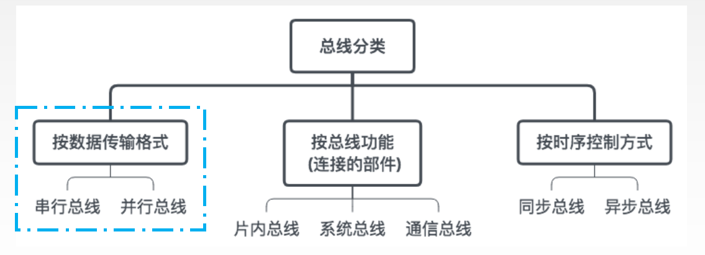
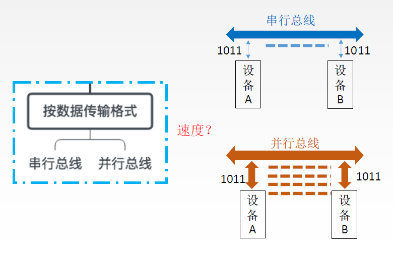
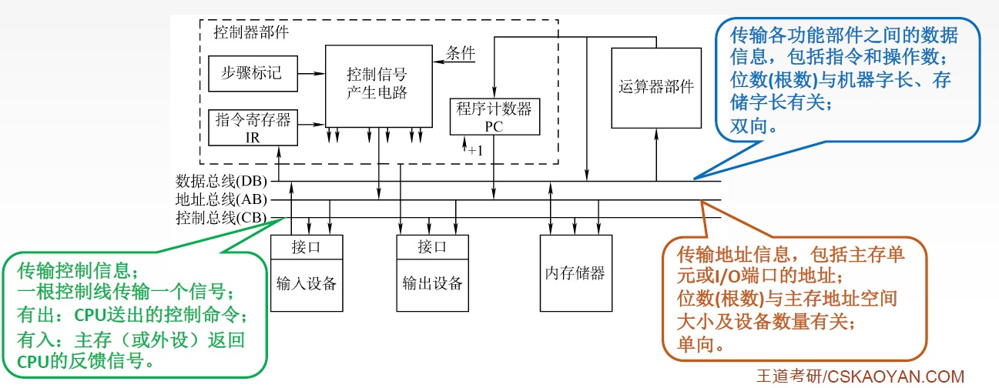
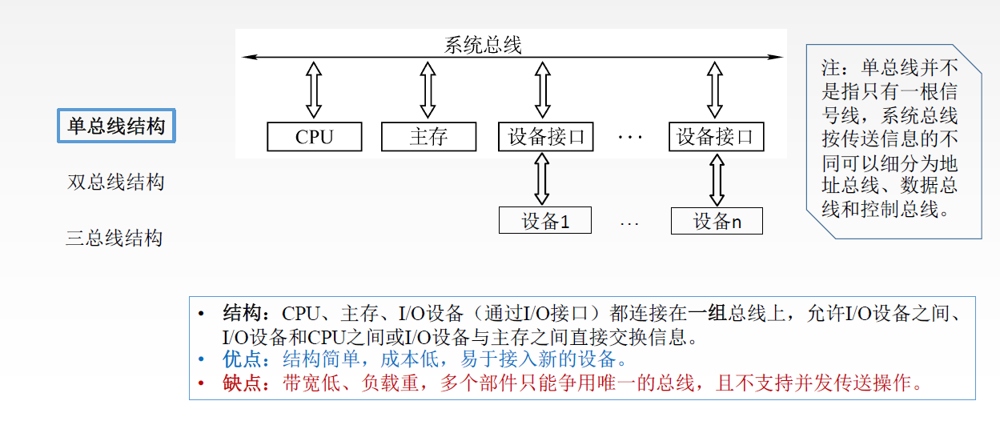
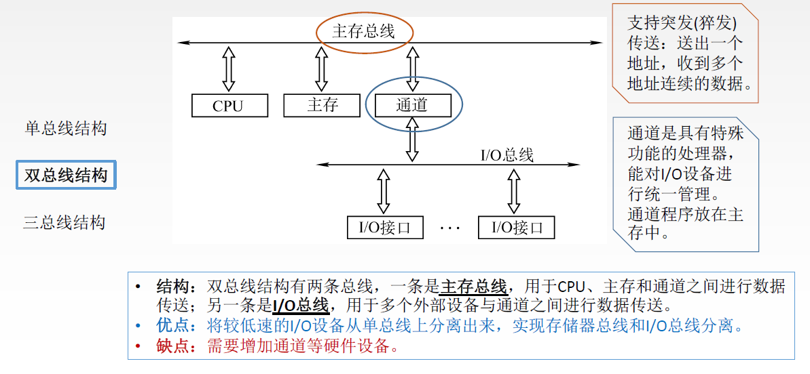
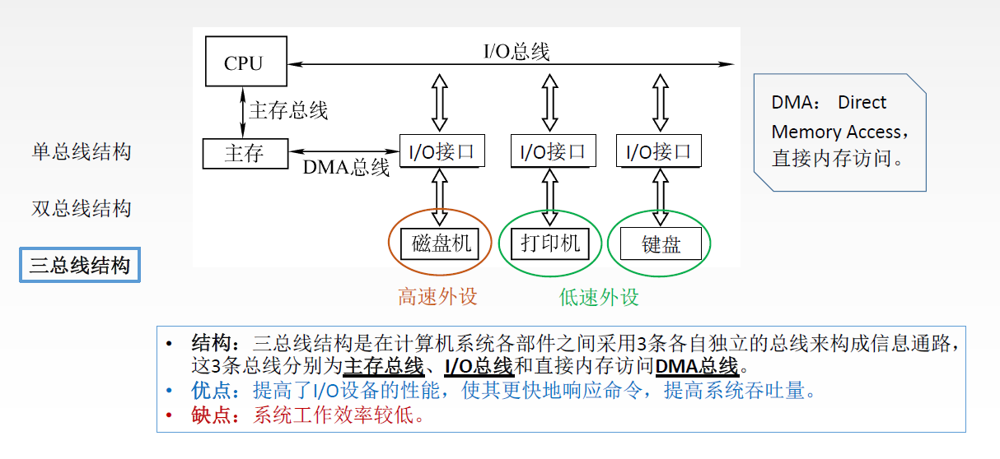
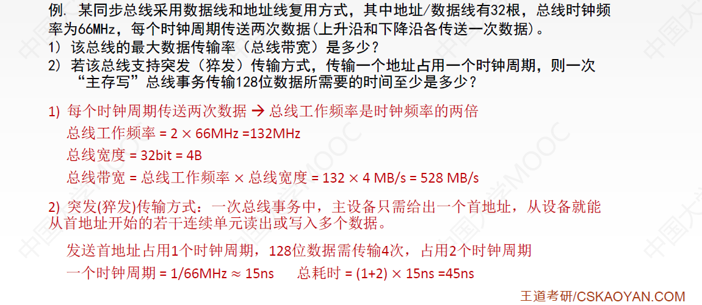
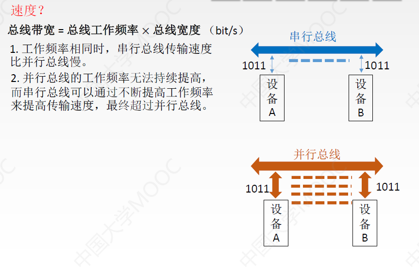
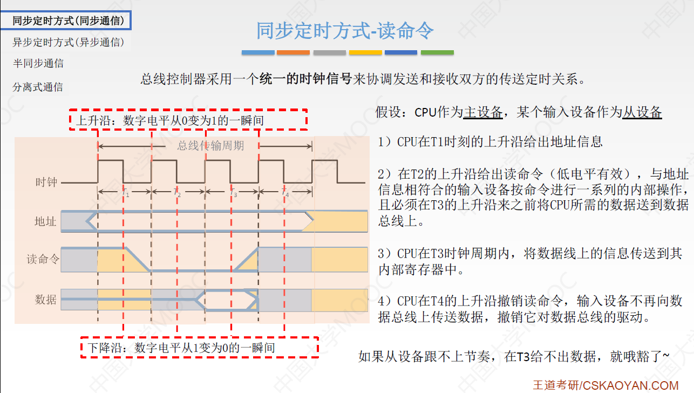
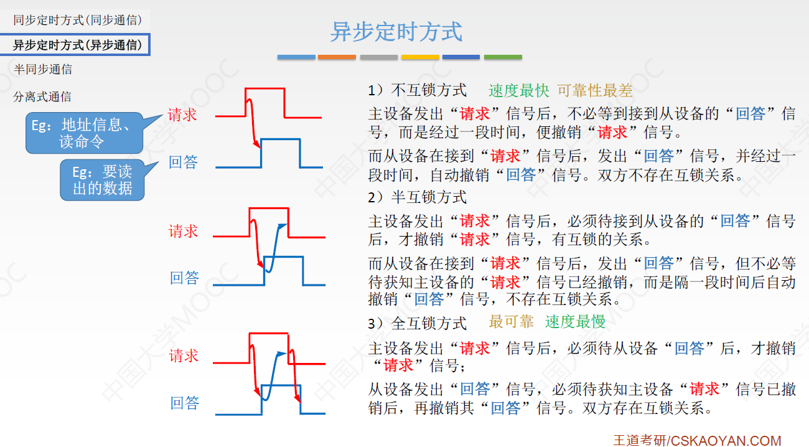

# 1、总线

**总线**是一组能为多个部件**分时共享**的**公共**信息传送**线路**。

- 共享是指总线上可以挂接多个部件，各个部件之间互相交换的信息都可以通过这组线路分时共享。
- 分时是指同一时刻只允许有一个部件向总线发送信息，如果系统中有多个部件，则它们只能分时地向总线发送信息

总线的特性：

1. 机械特性：尺寸、形状、管脚数、排列顺序
2. 电气特性：传输方向和有效的电平范围
3. 功能特性：每根传输线的功能(地址、数据、控制)
4. 时间特性：信号的时序关系

---

## 1.1、总线的分类

按数据传输格式：分为串行总线和并行总线

按总线功能分为：片内总线、系统总线、通信总线

按时序控制方式分为：同步总线、异步总线

- 异步总线要求通信双方：**波特率相同，通信格式相同**

### 1.1.1、串行总线和并行总线

串行总线：假设A要给B发送1011，A只能一个比特一个比特来发送，B接收数据也是一个比特一个比特来接收

- 优点：只需要一条传输线，成本低廉，广泛应用于长距离传输；应用于计算机内部时，可以节省布线空间。
- 缺点：在数据发送和接收的时候要进行拆卸和装配，要考虑串行-并行转换的问题。

并行总线：A可以并行的给B发送多个比特的数据

- 总线的逻辑时序比较简单，电路实现起来比较容易
- 信号线数量多，占用更多的布线空间；远距离传输成本高昂；由于工作频率较高时，并行的信号线之间会产生严重干扰，对每条线等长的要求也越高，所以无法持续提升工作频率。

### 1.1.2、片内总线和系统总线

1. 片内总线
   - 片内总线是芯片内部的总线。它是CPU芯片内部寄存器与寄存器之间、寄存器与ALU之间的公共连接线。
2. 系统总线
   - 系统总线是计算机系统内各功能部件（CPU、主存、I/O接口）之间相互连接的总线。按系统总线传输信息内容的不同，又可分为3类：**数据总线、地址总线和控制总线**。

- **数据总线DB**(Data Bus)：数据总线用来传输各功能部件之间的数据信息，它是**双向**传输总线，其位数**与机器字长、存储字长**有关。

- 地址总线AB(Address Bus)：地址总线用来指出数据总线上的源数据或目的数据所在的主存单元或I/O端口的地址，它是**单向**传输总线，地址总线的位数与**主存地址空间的大小有关**。

- 控制总线CB(Control Data)：控制总线传输的是控制信息，包括**CPU送出的控制命令**和主存（或外设）返回CPU的反馈信号。

  

  

3. 通信总线
   - 通信总线是用于计算机系统之间或计算机系统与其他系统（如远程通信设备、测试设备）之间信息传送的总线，通信总线也称为外部总线。

> - 数据通路表示的是数据流经的路径，数据总线是承载的媒介
> - 片内总线是连接CPU内部各个部件的，系统总线是连接计算机系统各功能部件的，通信总线是用来连接各个计算机系统的。

#### 1、系统总线的结构

- 注：单总线并不是指只有一根信号线，系统总线按传送信息的不同可以细分为地址总线、数据总线和控制总线。
- 优点：结构简单，成本低，易于接入新的设备。
- 缺点：带宽低、负载重，多个部件只能争用唯一的总线，且不支持并发传送操作。

- 双总线结构有两条总线，一条是**主存总线**，用于CPU、主存和通道之间进行数据传送；另一条是**I/O总线**，用于多个外部设备与通道之间进行数据传送。
- 优点：将较低速的I/O设备从单总线上分离出来，实现存储器总线和I/O总线分离。
- 缺点：需要增加通道等硬件设备。

- 三总线结构是在计算机系统各部件之间采用3条各自独立的总线来构成信息通路，这3条总线分别为**主存总线、I/O总线和直接内存访问DMA总线**。
  - 主存总线支持**突发(猝发)传送**：送出一个地址，收到多个地址连续的数据。
  - 主存总线用于连接主存和CPU，主存和某些快速的I/O设备(例如磁盘是快速外设，打印机、键盘是低速的外设)之间用DMA总线连接。这样做的好处是CPU不需要通过慢速的I/O总线和磁盘机进行数据交互。
- 优点：提高了I/O设备的性能，使其更快地响应命令，提高系统吞吐量。
- 缺点：系统工作效率较低。

# 2、总线的性能指标

1. 总线的**传输周期(总线周期)**
   - 一次总线操作所需的时间（包括申请阶段、寻址阶段、传输阶段和结束阶段），通常由若干个**总线时钟周期**构成。
   
2. 总线**时钟周期**
   - 即机器的时钟周期。计算机有一个统一的时钟，以控制整个计算机的各个部件，总线也要受此时钟的控制。
   - 总线周期与总线时钟周期的关系比较魔幻，大多数情况下，一个总线周期包含多个总线时钟周期；有的时候，一个总线周期就是一个总线时钟周期；有的时候，一个总线时钟周期可包含多个总线周期
   
3. 总线的**工作频率**
   - 总线上各种操作的频率，为**总线周期的倒数**。若总线周期=N个时钟周期，则总线的工作频率=时钟频率/N。实际上指**一秒内传送几次数据**
   
   - $$
     总线工作频率 = \frac{1}{总线周期}
     $$
   
     

4. 总线的**时钟频率**
   - 即机器的时钟频率，为**时钟周期的倒数**。若时钟周期为T，则时钟频率为1/T。实际上指一秒内有多少个时钟周期。
     $$
     总线时钟频率 = \frac{1}{总线时钟周期}
     $$
     
   
5. **总线宽度**
   - 又称为**总线位宽**，它是总线上**同时能够传输的数据位数**，通常是指**数据总线的根数**，如32根称为32位（bit）总线。
   
6. **总线带宽**
   - 可理解为总线的**数据传输率**，即**单位时间内总线上可传输数据的位数**，通常用每秒钟传送信息的字节数来衡量，单位可用字节/秒（B/s）表示。

$$
总线带宽=总线工作频率×总线宽度(bit/s)=总线工作频率× (总线宽度/8) (B/s) \\
= \frac{总线宽度}{总线周期}(bit/s) = \frac{总线宽度/8}{总线周期}(B/s)
$$

> 注：总线带宽是指总线本身所能达到的最高传输速率。在计算实际的**有效数据传输率**时，要用实际传输的数据量除以耗时。

1. 每个时钟周期传送两次数据 -> 总线工作频率是时钟频率的两倍，则一个时钟周期包含两个总线周期
   - 总线工作频率 = 2 × 66MHz = 132MHz
   - 总线宽度 = 32bit = 4B
   - 总线带宽 = 总线工作频率 × 总线宽度 = 132×4MB/s = 528MB/s
2. 突发传输方式：传送一次地址，接下来可以读出从这个地址向后很多个字的数据
   - 由于采用了数据线和地址线复用的方式，因此我们先需要用32根线传输地址，传输一个地址占用一个时钟周期，128位数据需要传送4次，占用2个时钟周期，又发送首地址需要1个时钟周期，共占用3个时钟周期
   - 一个时钟周期 = 1/66MHz ≈ 15ns
   - 总耗时 = (1+2) × 15ns = 45ns

---

7. 总线复用
   - 总线复用是指**一种信号线**在不同的时间**传输不同的信息**。可以使用**较少的线**传输更多的信息，从而节省了空间和成本
8. 信号线数
   - 地址总线、数据总线和控制总线3种总线数的总和称为信号线数。

## 2.1、串行总线和并行总线

根据总线带宽的公式：

1. 工作频率相同时，串行总线传输速度比并行总线慢
2. 并行总线的工作频率无法持续提高，而串行总线可以通过不断提高工作频率来提高传输速度，最终超过并行总线

# 3、总线操作和定时

## 3.1、总线传输的四个阶段

总线周期的4个阶段：

1. **申请分配阶段**：由需要使用总线的主模块提出申请，经中心仲裁机构决定，将下一传输周期的总线使用权授予某一申请者。也可将此阶段细分为传输请求和总线仲裁两个阶段
2. **寻址阶段**：获得使用权的主模块通过总线发出本次要访问的从模块的地址以及有关命令，启动参与本次传输的从模块
3. 传输阶段：主模块和从模块进行数据交换，可单向或双向进行数据传送
4. 结束阶段：主模块的有关信息均从系统总线上撤除，让出总线使用权

**总线定时**是指总线在双方交换数据的过程中需要时间上配合关系的控制，这种控制称为总线定时，它的实
质是一种协议或规则

总线定时的方案：

1. 同步通信(同步定时方式)：由**统一时钟**控制数据传输
2. 异步通信(异步定时方式)：采用**应答方式**，没有公共时钟标准
3. 半同步通信：**同步、异步结合**
4. 分离式通信：充分**挖掘**系统**总线每瞬间**的**潜力**

## 3.2、同步定时方式

总线控制器采用**一个统一的时钟信号**来协调发送和接收双方的传送定时关系。如上图：

假设CPU作为主设备获得了总线的控制权，某个输入设备作为从设备， CPU要从从设备中读入数据。我们可以这么来安排总线的传输周期：假设一个总线周期里面包含了4个时钟周期，T~1~、T~2~、T~3~、T~4~

1.  CPU在T1时刻的上升沿给出地址信息，用来指明他想要读的从设备的地址
2.  CPU在T2的上升沿给出读命令,与地址信息相符合的输入设备按命令进行一系列的内部操作，且必须在T3的上升沿来之前将CPU所需的数据送到数据总线上
3.  CPU在T3时钟周期内，将数据线上的信息传送到高内部寄存器中
4.  CPU在T4的上升沿撤销读命令，输入设备不再向数据总线上传送数据，撤销它对数据总线的驱动。

**同步定时方式**是指系统采用一个统一的时钟信号来协调发送和接收双方的传送定时关系。

- 若干个时钟产生相等的时间间隔，每个间隔构成一个总线周期。
- 在一个总线周期中，发送方和接收方可进行一次数据传送。
- 因为采用统一的时钟，每个部件或设备发送或接收信息都在固定的总线传送周期中，一个总线的传送周期结束，下一个总线传送周期开始。

- 优点：传送速度快，具有较高的传输速率；总线控制逻辑简单。
- 缺点：主从设备属于强制性同步；不能及时进行数据通信的有效性检验，可靠性较差。

同步通信适用于**总线长度较短**及**总线所接部件的存取时间比较接近**的系统。

## 3.3、异步定时方式

在异步定时方式中，没有统一的时钟，也没有固定的时间间隔，完全依靠传送双方相互制约的“握手”信号来实现定时控制。主设备提出交换信息的“请求”信号，经接口传送到从设备；从设备接到主设备的请求后，通过接口向主设备发出“回答”信号。

根据"请求"和"回答"信号的撤销是否互锁，分为以下3种类型：

1. 不互锁方式
2. 半互锁方式
3. 全互锁方式

优点：总线周期长度可变，能保证两个工作速度相差很大的部件或设备之间可靠地进行信息交换，自动适应时间的配合。

缺点：比同步控制方式稍复杂一些，速度比同步定时方式慢。

