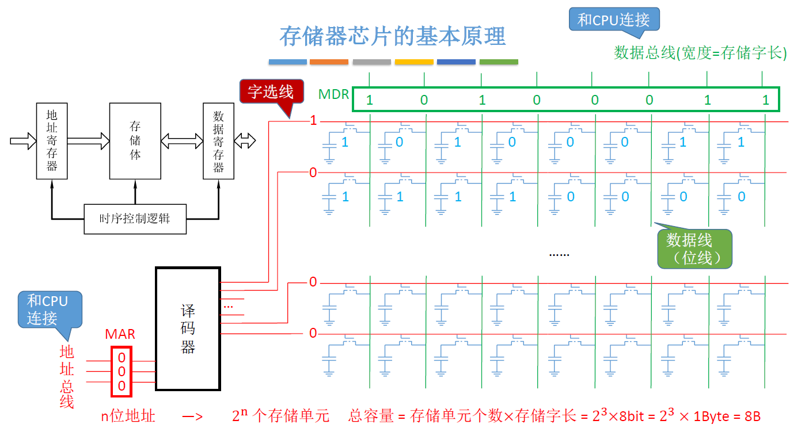
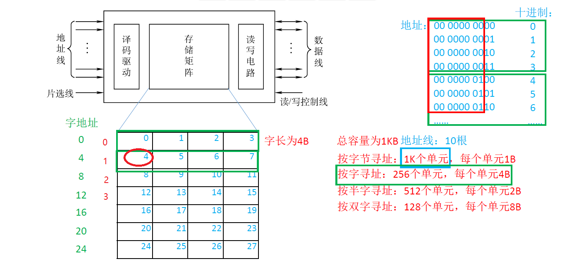
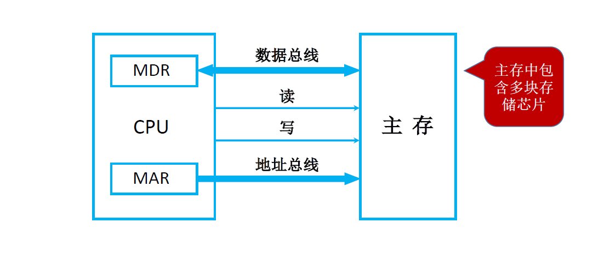
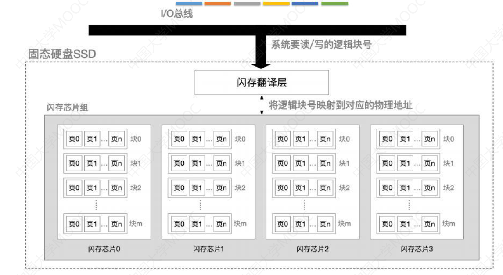

# 1、存储系统

## 1.1、存储器的层次化结构

- 在上述金字塔中，越上层的速度越快、容量越小、价格越高。
- 当我们用手机打开微信，出现微信的地球页面加载时，其实就是把微信从辅存放入主存中，然后CPU就会开始运行微信相关的代码。==辅存中的数据要调入主存后才能被CPU访问==
- 主存之上还有Cach**e高速缓存存储器**，上述箭头表示 **读/写数据**，之所以要在CPU和主存之间加Cache，是因为虽然主存的读写速度已经很快了，但是还是远远跟不上CPU的处理速度。

- 主存和辅存之间的交换是由**硬件+操作系统**来实现的，操作系统需要实现页面置换算法来决定把哪些数据从主存换出到辅存。主存和Cache由**硬件自动完成**。

  

## 1.2、存储器的分类

### 1.2.1、按层次分类

第一种分类的方式就是按照层次结构来分类，我们需要重点关注的是中间三层高速缓存、主存、辅存。高速缓存和主存可以直接被CPU读写，而辅存里的数据只有调入到主存之后才可以被CPU访问。

### 1.2.2、按存储介质分类

无论是什么存储器，终归都是用来存储二进制数据的。根据存储二进制位的存储介质不同，我们分为：

1. 半导体存储器
   - 以半导体器件存储二进制数据，主存、Cache一般都是用半导体实现的存储器。
2. 磁表面存储器
   - 磁带、磁盘(机械硬盘)，以磁性材料存储二进制数据
3. 光存储器
   - 以光介质存储信息，光盘、DVD等

### 1.2.3、按存取方式

1. 随机存取存储器(RAM Random Access Memory)
   - 读写任何一个存储单元所需时间都相同，与存储单元所在的物理位置无关。例如内存条。
   - 我们知道存储器都是分为一个个的存储单元，每个存储单元都有各自的地址编号，随机存取存储器就是指我们读写任何一个地址的存储单元，所需要的时间都是相同的。读写速度并不会因为存储单元的物理位置而改变。

2. 顺序存取存储器(SAM Sequential Access Memory)
   - 读写一个存储单元所需时间取决于存储单元所在的物理位置。例如磁带，我们要等磁带一直转转转。
3. 直接存取存储器(DAM Direct Access Memory)
   - **既有随机存取特性，也有顺序存取特性**。先直接选取信息所在区域，然后按顺序方式存取。例如机械硬盘
   - 读写速度：随机存取存储器 > 直接存取存储器 > 顺序存取存储器

> 我们将顺序存取存储器和直接存取存储器也称为串行访问存储器
>
> - 串行访问存储器：读写某个存储单元所需时间与存储单元的物理位置有关

上述三种存储器都是**指定数据的存储地址**，然后直接去那个地址当中进行读写。而下面的相联存储器是指明**数据内容**，根据数据内容来查找位置。==前者是根据地址访问，后者是根据内容访问==。

4. 相联存储器
   - 即可以按内容访问的存储器。可以按照内容检索到存储位置进行读写，"快表"就是一种相联存储器

### 1.2.4、按信息的可更改性

- 读写存储器(Read/Write Memory)——即可读、也可写（如：磁盘、内存、Cache）
- 只读存储器(ROM Read Only Memory)——只能读，不能写（如：实体音乐专辑通常采用CD-ROM，实体电影采用蓝光光碟，BIOS通常写在ROM中，都是用来存储不太能被更改的数据)

### 1.2.5、按信息的可保存性

- 断电后，存储信息消失的存储器——易失性存储器（主存、Cache）
  - 电脑正在play game呢，突然断电了，就 game over了。因为游戏在主存存着呢，重启也才开始把操作系统向主存调入运行呢，然后重启游戏。
- 断电后，存储信息依然保持的存储器——非易失性存储器（磁盘、光盘）
- 信息读出后，原存储信息被破坏——破坏性读出（如DRAM芯片，读出数据后要进行重写）
  - 我们读出DRAM芯片里面的二进制信息，里面存储的信息会被破坏掉，我们需要对数据进行重写。
- 信息读出后，原存储信息不被破坏——非破坏性读出（如SRAM芯片、磁盘、光盘）
  - 我们读出DRAM芯片里面的二进制信息，里面存储的信息不会被破坏掉。

## 1.3、存储器的性能指标

- 存储器的数据寄存器MDR位数反映了存储器**存储字长**是多少，MAR位数反映了存储器**存储字数**为多少，存储字长×存储字数 = 存储容量。
- 单位成本：每一个比特位需要付出的金钱成本。
  - 例如一个8G内存条，共256块大洋。256/8GB=256/64Gbit，就是单位成本。
- 存储速度：也称为 **数据传输率**=数据的宽度(存储字长)/存储周期。
  - 每一个存储周期我们可以读或者写一个存储字的数据。存储周期又分为存取时间和恢复时间两部分。
  - 每一次读写我们都需要存储时间，然后需要恢复一段时间才能进行下一次读写。所以虽然理论上我们一次读写只需要Ta时间，但是我们若要进行连续的多次读写，多次读写之间至少需要Tm时间间隔。**所以存取时间并不等于存储周期**。
- **主存带宽**就是我们的**数据传输率**。

## 1.4、小结

# 2、主存储器的基本组成

这一节主要学习半导体元件存储二进制数据的原理，通过半导体元件的组合构成存储芯片，由于存储芯片里面存储了很多个字的数据，因此存储芯片必须提供一个寻址的功能。

## 2.1、基本的半导体元件及原理

一个存储器可以分为存储体、MAR、MDR三大部分。**MAR是地址寄存器，MDR是数据寄存器**，这三部分会在时序控制逻辑电路的控制下工作。存储体是用来存储二进制数据0和1的，而**存储体又是由一个个存储单元构成，存储单元又是由一个个存储元构成**，用一个存储元就可以存储一位二进制0或1。一个存储元又包含两个半导体元件，分别为电容和MOS管。

我们可以将MOS管看成是用电控制的开关，当电压足够时MOS就可以连通导电，若不加电压或者电压不足，那么就断开不导电。这就是叫做半导体的原因，既不是导体也不是绝缘体，在一定条件下既可以转换为导体，也可以转换为绝缘体。

电容由两个金属板和中间的绝缘体构成，如图下方的金属板接地，所以下方金属板的电压是0V，如果我们给上方金属板加一个大于0V的电压，由于两块金属板产生了电压差，因此电容里面的电荷会移动，也就是所谓的给电容充电，这个电容里面就可以保存一定的电荷。若给上方金属板加的是0V或者1V的电压，两块金属板不产生电压差或者产生的电压差很小，也就不会给电容充电，也就不会保存电荷。==所以我们可以根据电容是否保存了电荷来对应二进制的0和1==。

我们来看如何**读出一个二进制**：

- 如上图，假设此时电容保存了电荷，规定保存了电荷表示二进制1，不保存电荷表示二进制0
- 我们只需要给MOS管加高电压，也可以理解为输入一个二进制的1，则MOS接通可以导电，则电容保存的电荷可以通过MOS管向外流，当在右端监测到有电流通过，则说明存储元输出的是1
- 若电容没有保存电荷，相当于表示二进制的0，当MOS管接通时我们在右端并不能检测到有电荷的流出，因此说明存储元输出的是0

我们来看如何**写入一个二进制**：

- 假设我们想让电容保存电荷，我们可以在右端加高电压，同时给MOS管也加高电压，这样MOS管可以接通，接通之后电容的上方金属板就有高电压，而下方金属板接地所以是0V，则产生电压差，电容充电会产生电荷，并且我们让MOS管断开，电荷就跑不出去了。

我们把多个存储元进行科学合理的连接，那么我们就可以一次性读出或者写入多个二进制数据，图中红线代表连接了每一个MOS管，我们只需给红线通电，那么所有的MOS管都可以连通，电容存储的电荷就可以顺着绿色的线流出，我们只需要看每条绿色的线有没有电流，就可以读出二进制是0还是1。

这样的一整行**存储元**就是我们的**一个存储单元**，也就是**一个存储字**，而多个存储单元则构成了**存储体**，也称为 **存储矩阵**，上图中存储体只包含了两个存储单元。我们一次可以读出一行的二进制就是**存储字**，如上图例子当中的**存储字长**为8bit，因为一行共有8个**存储元**。这样我们就理解了为什么每次存储器每一次读或者每一次写都是**一个存储字**。

1个字节B一定等于8比特bit，而一个存储字等于多少比特是看存储单元中一行是几个存储元。

## 2.2、存储器芯片的基本原理

如何根据地址来决定读写哪个存储字呢？这就涉及到译码器的使用，**译码器**的作用：n位二进制地址会对应2^n^个存储单元，所以译码器会根据地址寄存器MAR里面的地址，把它转变为某一条选通线的高电平信号。

例如图中CPU给MAR送来的地址是3个0，对应十进制的0，所以译码器会把第0根**字选线**给一个高电平的输出，这样第一个存储字所对应的存储元都会被选通，每个地址会对应译码器的一条输出线，总共有2^3^=8个地址，因此译码器的输出端总共会有8条线。所以经过译码器的处理，一个地址信号会被转换为译码器的某一条输出线的高电平信号。

当图中第0条**字选线**被接通之后，我们就可以通过图中数据线(绿色的线)把每一位二进制信息传送到MDR当中，CPU会通过**数据总线**从MDR当中取走这一整个字的数据。**数据总线的宽度=存储字长**。

例子中的**总容量 = 存储单元个数×存储字长**，存储单元个数=2^3^(即多少行)，因为只有3位的地址。存储字长是8bit，所以总容量为2^3^×8bit=8B

我们继续完善存储器芯片的构成，我们需要增加一个控制电路，用于控制译码器MDR和MAR，当CPU通过地址总线把地址送到MAR当中，但是由于我们使用的是电信号来传送这些二进制数据，而电信号难免会有不稳定的情况，因此在MAR里面的电信号稳定之前，这个地址信息是不能送到译码器当中的。这就是控制电路的作用，只有MAR稳定之后控制电路才会打开译码器的开关，让译码器来翻译这个地址，然后给出相应的输出信号。同样，在数据线输出时，只有当电信号稳定，电路才会认为此时的输出是正确的，所以控制电路也会控制MDR在稳定后给数据总线送出数据。

同时存储器芯片还需要向外提供**片选线**，通常表示为CS或者CE(上方加一条横线)来表示片选线的电信号，**头上划线表示该信号低电平有效**。CS表示Chip-select**芯片选择信号**，如果给出的芯片选择信号是一个低电平则说明这个芯片的总开关是被接通的。有些书也会命名为CE表示Chip-enable**芯片使能信号**。

另外，控制电路还要提供**读控制线和写控制线**。**若分成两条线**，WE表示允许写，上方划横线表示当写控制线的信号是低电平的时候表示此时这个芯片正在进行写操作，也就是把MDR里面的数据输入到各个存储元当中。OE表示允许读，上方划横线表示当读控制线的信号是低电平的时候表示此时这个芯片正在进行读操作，也就是读出存储元里面的数据。**若分成一条线**，则低电平表示芯片正在执行写操作，高电平表示芯片正在执行读操作。**采用两种方案芯片对外暴露的金属引脚是不一样的。**

整体来看，我们的存储芯片由**存储矩阵(存储元)**，**译码驱动包含译码器和驱动器**，通常会在译码器后面接上一个驱动器，这个驱动器的作用保证译码器输出的电信号是稳定可靠的，驱动器其实就是将电信号进行放大的一个部件，**读写电路包括控制电路和字选线等**。另外一块存储芯片需要接收来自外界的地址信息，地址信息通常是由CPU通过**地址总线**传过来的，另外还需要**数据线**进行数据的传输。除此之外，还需要通过**片选线**的电信号来确定这块存储芯片此时是否可用，另外还需要提供**读/写控制线**，可能有两条，也可能有一条。

一个内存条可能包含多块存储芯片，每一块存储芯片都是1GB，8块就能存储8GB的数据。若我们要读取的数据是其中的某一块存储芯片，那么我们提供了读写地址之后，我们只能让这块存储芯片工作，其他存储芯片不能工作。这就是片选线的作用，若我们只想读取这块芯片指定地址的数据，那么我们就需要让这块地址的片选线信号有效，也就是给CS(上方划线)信号一个低电平，而其他芯片的CS信号都给高电平。

每一个存储芯片都会向外暴露一个个**金属引脚**，这些引脚是用来接收地址信号、片选信号、数据信号、读写信号用的，所以通常题目会给芯片的参数信息，让你判断这块芯片引脚的数目至少是多少，其实就是**判断地址线有多少根、数据线有多少根，片选线1根，读/写控制线1根或2根，然后加和就是对应的引脚。**另外，还会有供电引脚、接地引脚。

---

若一块存储芯片有**n位地址**，那意味着**地址线需要有n条**，这n位地址又会对应2^n^个存储单元。知道了存储单元的数量，就可以乘以存储字长来得到总容量。

还会碰到 `8×8位的存储芯片`：

- 第一个8表示8个存储单元，第二个8表示8位存储字长。
- 第一个表示存储单元的数量，第二个表示存储单元的字长。
- 存储单元的数量对应地址线的根数，存储字长对应数据线的根数。
  - 2^n^个存储单元对应n条地址线，MDR的位数对应数据线的根数

## 2.3、寻址

在上图中一个小方格表示1B，也就是8bit。一整行表示的是一个**存储字(存储单元)**，也就是这块存储体的存储字长是4B，假设总容量是1KB，也就是256个存储字，也就是共256行。现代计算机都是按字节编址的，也就是说**每个字节会对应一个地址**，这个存储体当中共有1K个字节，就会对应1K个地址。我们的地址线就应该有10根，因为2^10^=1K，整个地址信号是从10个全0到10个全1，0~1023。

我们按字寻址，由于一个字占4个字节，因此会将4个连续的字节地址合并，看成一整个字(也就是一行为一个字)。当我们指明了要读的是第几个字的时候，我们只需要把字地址进行算术左移两位(相当于×4)，这样就可以把字地址转换成与之对应的字节地址。

如上图(红字部分分别为0号字1号字2号字3号字)，假如我们要访问1号字，我们将1算术左移两位变成100，这个二进制对应的十进制是4，这样我们就得到这个字的起始字节地址为4(如上图红圈)。

## 2.4、小结

# 3、SRAM和DRAM

- DRAM：动态RAM，Dynamic Random Access Memory
- SRAM：静态RAM，Static Random Access Memory

==动态RAM用于主存，SRAM用于Cache==。高频考点是DRAM和SRAM的对比。

## 3.1、DRAM芯片

我们在上方介绍的其实就是DRAM芯片，**DRAM芯片被用于主存**。

- DRAM芯片：使用**栅极电容**存储信息
- SRAM芯片：使用**双稳态触发器**存储信息
- 核心区别：存储元不一样

### 3.1.1、栅极电容和双稳态触发器

如上图，我们之前说过，我们给字选择线加高电压，就会使得MOS管接通，若同时我们给数据线也加高电压，那么电容的上金属板就会是高电压，而下金属板由于接地所以是0V电压，这样会产生电压差，电容会存储电荷，这样我们就完成了二进制1的写入。若我们给数据线一个低电压，那么电容两块金属板没有电压差，电容不会存储电荷，这样就完成了二进制0的写入。**因此电容内存储了电荷表示二进制1，电容内未存储电荷表示二进制0。**

如上图，左边是栅极电容，右边是双稳态触发器，双稳态触发器中包含6个MOS管，分别用M1、M2、M3、M4、M5、M6标注，因为这个触发器可以呈现出两种稳定的状态

1. 第一种状态：A点是高电平、B点是低电平，我们规定这种状态对应二进制的1
2. 第二种状态：A点是低电平、B点是高电平，我们规定这种状态对应二进制的0

对于栅极电容组成的存储元，**数据线只有一根**，而双稳态触发器需要**两根数据线**来读出0或者1。对于双稳态触发器来说，如果它里面存储的是二进制的1，那么我们给字选择线高电压，右边数据线BLX会输出一个低电平信号，而若里面存储的是二进制的0，那么左边数据线BL会输出一个低电平信号。所以我们根据左右两边哪条线输出了低电平信号，我们就可以判断这个触发器里面存储的是0还是1了。**这就是读出触发器里面数据的原理**。

若我们要写入触发器数据0，我们给左边数据线BL低电平、给右边数据线BLX高电平，这样就可以使得触发器A点低B点高，这个状态对应的就是二进制的0。

那么栅极电容和双稳态触发器有什么区别呢？

1. 读写数据

   1. 栅极电容在读出数据的时候，电荷会通过MOS管使得数据线上产生电流，也就是电容放电，电容放电了之后就会使得电容由1变为0，因此当我们读出栅极电容的信息之后，这个电容里面的信息被我们破坏掉了，是**破坏性读出**。若要解决这个问题，我们读出后应该有 **重写**操作，也称为 **再生**。也就是需要给电容重新充电，让其又变为1

   2. 双稳态触发器在读出数据的时候，触发器的状态保持稳定。是 **非破坏性读出，无需重写**

2. 成本

   1. 栅极电容需要1个MOS管，双稳态触发器需要6个MOS管。栅极电容每个存储元制造成本更低，双稳态触发器每个存储元制造成本更高。
   2. 若存储芯片大小是固定的，那么栅极电容存储元由于体积小所以集成度高(更密集的集成在芯片上)，而双稳态触发器存储元由于体积大所以集成度低
   3. 栅极电容存储元电路简单，功耗低。双稳态触发器存储元电路复杂，功耗高

> 因为栅极电容需要重写，所以读写速度更慢；而双稳态触发器不需要重写，所以读写速度更快。

### 3.1.2、高频考点🔥

### 3.1.3、DRAM的刷新🔥

电容里面虽然可以存储电荷，但是这个电荷会慢慢流失，电容电荷只能维持2ms，2ms后即使不断电电容里面的电荷也会消失。所以我们2ms之内必须 **刷新** 一次，也就是**给电容充电**。

双稳态触发器只要不断电，触发器的状态就不会改变。要不怎么叫双稳态呢？就问你服不服？

1. 多久需要刷新一次？**刷新周期：一般都是2ms**
2. 每次刷新多少存储单元？**以行为单位，每次刷新一行存储单元，存储单元又是由一个个存储元组成的**
3. 为什么刷新要用行列地址？**减少选通线的数量**

如上图，我们先看左边存储器简单模型，当我们给了一位地址给译码器之后，译码器会将其转换成其中某一条选通线的高电平信号，若我们有n位地址给译码器，那么就意味着译码器会有2^n^根选通线。若有20位地址，那么选通线就有2^20^，这么多线根本难以实现。

所以看右边，我们将存储单元从一维列排列改成二维行列排列，这样n位地址会被拆分成行地址和列地址，行地址译码器处理一半2^10^根选通线，列地址译码器处理一半2^10^根选通线，这才1024根线，好实现！

若我们给的地址是 00000000，8位的0。若按照左边的简单模型，8位地址译码器会有2^8^根选通线，8位0转换为十进制0，那么译码器就选通0号线，也就是选中0号存储单元。若按照右边的模型，8位0会被分割为前4位0和后4位0，转换为十进制是0和0，也就是0行0列，行译码器有2^4^根选通线，列译码器有2^4^根选通线，这样就选中了(0，0)存储单元。

---

4. 如何刷新？**有硬件支持，读出一行的信息后重新写入，占用1个读/写周期(相当于进行一次写操作呗)**

5. 在什么时刻刷新？

假设DRAM内部有128行×128列的存储单元，并且每个读写周期是0.5us，那么电容可以坚持的最长的时间是 2ms/0.5us=4000个读写周期，**读写周期**也称为**存取周期**

1. 思路一：每次读写完都刷新一行【**分散刷新**】
   - 我们有128行，每刷新一行都需要0.5us，若每次读写完都刷新一行，则系统的存取周期就会变成1us，前0.5us时间用于正常读写，后0.5us时间用于刷新某行。也就是2ms的时间内总共会有2000次刷新操作。这2000次刷新操作足够在2ms内给128行的存储单元每一行都刷新很多次。

2. 思路二：2ms内集中安排时间全部刷新【**集中刷新**】
   - 我们可以在2ms快到的时候给全部的128行存储单元进行刷新，2ms可以分为4000个读写周期，如果采用这种策略，我们会采用前面的3872个周期进行正常的读写，最后会留下128个读写周期来刷新这128行。
   - 此时系统的存取周期还是0.5us，因为连续的读或者写中间只需要间隔0.5us即可
   - 最后一段时间是专门用于刷新的，这短时间CPU无法对存储器进行读写操作，所以集中刷新的时间也称为 **死区(死时间)**
3. 思路三：2ms内每行刷新1次即可【**异步刷新**】
   - 2ms内需要产生128次刷新请求，所以每隔 2ms/128 = 15.6us 一次，则每隔15.6us我们进行一次刷新刷新一行，每15.6us内有0.5us的 **(死区)死时间**
   - 在实际过程中，我们可以利用CPU不需要访问存储器的时间进行刷新，比如CPU取得一条指令，在对这条指令译码的阶段内刷新

### 3.1.4、小结

这里看一下最后一行送行列地址：

同时送的意思是行地址和列地址会同时丢给行地址译码器和列地址译码器，如果采用这种策略，我们地址有多少位我们就需要设置多少根的地址线。

- SRAM因为集成度低存储量更小，所以对应的行列地址的地址位数更少，所以我们可以同时送行列地址
- DRAM存储量更大，所以对应的行列地址的地址位数更多，假设我们有n位地址线来同时传送行和列地址，如果采用地址线复用技术，我们可以把行地址和列地址通过前后两次分别进行传输，也就是只需要 n/2 条地址线就可以实现地址传输。第一次传输把行地址送到行地址缓冲器里面，第二次传输把列地址送到列地址缓冲器里面，接下来在控制电路的控制之下再分别传送给行地址译码器和列地址译码器。

> 行、列地址分两次送，可使地址线更少，从而芯片引脚也更少。原本需要n个引脚来接收n个地址，现在只需要n/2个引脚就可以接收n个地址，先接收行地址，再接收列地址。

# 4、只读存储器ROM芯片

## 4.1、了解各种ROM

- MROM(Mask Read-Only Memory)——掩模式只读存储器
  - 厂家按照客户需求，在芯片生产过程中直接写入信息，之后**任何人不可重写**(只能读出数据，不能写入数据)
  - 可靠性高、灵活性差、生产周期长、只适合批量定制
- PROM(Programmable Read-Only Memory)——可编程只读存储器
  - 用户可用专门的PROM写入器写入信息，写**一次之后就不可更改**
- EPROM(Erasable Programmable Read-Only Memory)——可擦除可编程只读存储器
  - 允许用户写入信息，之后用某种方法擦除数据，**可进行多次重写**
  - UVEPROM(ultraviolet rays)——用紫外线照射8~20分钟，擦除**所有**信息
  - EEPROM(也常记为E^2^PROM，第一个E是Electrically)——可用电擦除的方式，擦除**特定的字**

- Flash Memory ——闪速存储器（注：U盘、SD卡就是闪存）
  - 在EEPROM基础上发展而来，断电后也能保存信息，且**可进行多次快速擦除重写**
  - 闪速存储器的每个存储元只需单个MOS管，每个存储元的体积比RAM的体积要更小，所以**闪存位密度比RAM高**(因为对于体积都相同的芯片来说，闪存芯片上存储元的数量更多，也就是可以保存更多的二进制比特位)
  - 注意：由于闪存需要在写入数据的时候需要先把数据电擦除然后在写入，而在读数据的时候直接读就可以，因此**闪存的写速度要比读速度更慢**

- SSD(Solid State Drives)——固态硬盘
  - 由控制单元+存储单元(Flash芯片)构成，与闪速存储器的核心区别在于控制单元不一样，但存储介质都类似，**可进行多次快速擦除重写**。SSD速度快、功耗低、价格高。
  - 拓：手机辅存也使用Flash芯片，但相比SSD使用的芯片集成度更高、功耗更低、价格更贵。

## 4.2、计算机内的重要ROM

计算机的主存是用来存放一系列的指令和数据的，CPU要做的事就是从主存中取一条条指令并执行指令，然而RAM是易失性的芯片，断电后RAM内数据全部丢失，也就是关机后主存的数据全部没了。当开机后，就需要将辅存内的操作系统重新调入到主存，但是由于此时的主存是空的，并没有指令，所以CPU会去主板上的ROM芯片来读取开机的指令，这个ROM芯片就是BIOS芯片，其中BIOS芯片存储了 **自举装入程序**，负责引导装入操作系统(开机)。ROM是非易失性的，即使计算机没有供电，ROM芯片里面的指令也不会丢失。

注意：虽然这块ROM芯片是集成在主板上，但是在逻辑上，我们将其看成是主存的一部分。**逻辑上，主存由RAM+ROM组成，且二者常统一编址**。也就是在计组这门课，我们说的主存，除了内存条外，还应该加上BIOS芯片。

## 4.3、小结

RAM支持随机存取，很多ROM也支持随机存取，我们给一个地址，访问速度并不会因为地址而改变。

# 5、主存储器与CPU的连接

## 5.1、单块存储芯片与CPU的连接

单块存储芯片需要对外暴露这样的接口：

1. 右上方绿色的线用于传送数据，通常会通过**数据总线和CPU**进行连接
2. 左下角红色的线用于传送地址，通常会通过**地址总线和CPU**进行连接
3. 还需要暴露左上方的**片选线接口、读写控制线接口**，CPU通过控制总线来发送控制信号
4. 上图是8×8位的存储芯片，因为共有8个存储单元(字)，每个字的字长是8位。
5. 上图我们把MAR和MDR都划在了存储芯片里面，但是现在的计算机MAR、MDR通常集成在CPU内部，所以现在生活中存储芯片内的寄存器并不是MAR和MDR，只是一个普通的寄存器(暂存输入、输出数据)

思考：

1. 我们只使用了单块存储芯片来存储数据，并且只能存储8B数据，若想要扩展主存字数怎么办？【**字扩展**】，我们可以连接多块芯片来扩展主存的字数
2. 上图中存储芯片字长只有8位，CPU一次只能存或者取8bit数据，如今的CPU大多可以存或者取64bit，也就是数据总线的宽度有64bit。数据总线宽度>存储芯片字长，怎么办？【**位扩展**】通过多块存储芯片的合理连接，我们可以让整个主存的存储字长扩展为和数据总线宽度一致。

现在的计算机CPU里面集成了MAR和MDR，MDR里面存储的数据也就是要读或者要写的数据是通过数据总线和主存进行交换，MAR里面存储的地址数据是通过地址总线送给主存。CPU通过控制总线向主存发送读写控制信息。**现在的主存一般会包含很多块的存储芯片**。如下图，用红框圈出来的黑黑的部分就是存储芯片，各有4块。

## 5.2、存储芯片的输入输出信号

多块存储芯片如何与CPU进行交互呢？为了方便，我们给存储器芯片的输入信号和输出信号进行命名

- 我们有可能要输入多位的地址，地址通常用A(Address)来表示，A~0~表示地址的低位，A~7~表示地址的高位。
- 输出的数据我们用D(Data)来表示，D~0~表示数据的低位，D~7~表示地址的高位。
- 片选信号使用CS或者CE来表示，若上面划横线，表示这个信号低电平有效。若上面没划横线，表示这个信号高电平有效。
- 读写信号我们使用WE(Write)或者WR(Read)来表示，上面划横线，表示当这个信号是低电平时是在进行写操作，在高电平时是读操作。
  - 也有可能分为写为WE和OE，上面划横线表示低电平有效。写操作用WE表示，读操作用OE表示。

> 上面有横线说明低电平有效，没有横线说明高电平有效。

## 5.3、增加主存的存储字长-位扩展

如果我们有8K×1位的存储芯片，这个单块存储芯片如何和我们的CPU进行连接呢？首先8K也就是有8K=2^13^的存储单元，所以我们需要用13根地址线来表示这8K个地址，因此这块芯片对外暴露的地址应该是A~0~ -> A~12~共13条地址线，CPU会把它想访问的地址通过地址总线(红色)送过来，这样就完成了地址线的连接。

WE信号表示Write Enable写使能信号，头上未划线表示高电平有效，也就是当信号是高电平信号时，CPU要向存储器里面写数据，而当信号是低电平信号时，表示CPU要从中读数据。CPU也会有一个引脚来发送读写控制信号，这个信号通过控制总线(褐色)传给芯片。

CPU可以通过数据总线(绿色)来读或者写8bit数据，然而由于存储芯片存储字长的限制，我们每次只能通过数据总线来传送一个bit，数据总线的利用率很不充分。

存储芯片还有一个CS片选信号，由于只有这一块芯片工作，所以我们可以简单粗暴的接上高电平信号。因为CS头上没有划横线，意味着片选信号高电平有效。

此时整个主存只有一个存储芯片，每次只能读或者写一位数据，因为主存的存储字长是1bit。

我们可以给主存再加上一块相同信号的存储芯片，CPU将想要访问的地址信息传给这个芯片，两个芯片都有8K的存储单元，所以如果把13位的地址信息同时送给这两个芯片，这个地址信息可以选中两个芯片相同位置的存储单元。当然我们也可以把CPU发送的读写控制信号WE同时送给两个芯片，使得两个芯片要么同时读，要么同时写。右边芯片读出的数据我们可以作为CPU读入的D~1~这一位的数据。接下来只需要个CS片选信号加一个高电平。这样这两块芯片就可以同时工作。

进行了这个改造之后，我们整个主存储器总共有两个存储芯片，存储字长扩展成了2位，现在我们就可以同时读或者同时写两位的信息。

同理继续增加芯片，每个芯片都有8K个存储单元，CPU发出的A~0~到A~12~这13位的地址信息会同时送给8片存储芯片。

我们把8片8K×1位的存储芯片通过**位扩展扩展**成1个8K×8位的存储器，总容量为8KB

## 5.4、增加主存的存储字数-字扩展🔥

### 5.4.1、线选法

我们有一片8K×8位的存储芯片，CPU可以同时读或者写8位的信息，由于我们的存储芯片存储字长已经有8位了，CPU的处理数据的宽度和存储字长是可以对应的，对于这样的场景，我们不需要进行位扩展，因为数据总线的利用率已经达到100%。

8K也就是有8K=2^13^的存储单元，所以我们需要用13根地址线来表示这8K个地址，因此这块芯片对外暴露的地址应该是A~0~ -> A~12~共13条地址线，CPU会把它想访问的地址通过地址总线(红色)送过来，这样就完成了地址线的连接。

存储芯片还有一个CS片选信号，由于只有这一块芯片工作，所以我们可以简单粗暴的接上高电平信号。因为CS头上没有划横线，意味着片选信号高电平有效。

**注意**：CPU还有三个地址A~13~->A~15~没有被用到，也就是CPU的MAR有16位，我们现在只利用了13位，我们如何解决这个问题呢？

我们会买一个同型号的芯片，按照位扩展，将低位的13根地址线(红线)也连接在第二块芯片上，同时8位数据通过地址总线(绿线)传给CPU，读写控制线(褐线)也连接。当CPU给出一个全0的地址之后，地址会通过地址总线同时传给左右两个芯片，两个芯片的8位数据都会通过数据总线传给CPU，这样就会发生数据冲突。

所以我们进行改造，我们将A~13~地址信息连到左边芯片，将A~14~地址信息连到右边芯片，由于片选信号高位有效，因此当A~13~和A~14~分别为0的时候，意味着左边芯片片选信号有效开始工作，而右边芯片片选信号无效不工作。这样虽然不会发生数据冲突，然而当A~13~和A~14~都为1时，还是会发生数据冲突。

> 上述连线方法称为**线选法**：我们会用专门的地址线作为片选信号来选中其中的某一块芯片，如果CPU有n条地址线，采用这种方法我们就只能有n个片选信号。

### 5.4.2、译码器片选法

如上图，我们对线选法进行改进，将地址A~13~连接的地址总线分成两条线接出去，上方线接了非门取反电路，当A~13~地址线的信号是1，那么下方线直接连接到左边芯片，左边芯片进行工作。而上方线经过非门取反的改造信号就会变成0，这样右边芯片不会工作。

> 非门取反电路我们可称为 `1-2译码器`：输入一位的地址信息，可能呈现2^1^=2中不同的状态，这两种状态会被译码器翻译为高电平、低电平。
>
> **译码器片选法**：我们可以译码器来处理CPU的高位地址部分，如果CPU给出n位高位地址，也就是n条线，那么会有2^n^个片选信号。

如上图，我们给3位地址线，经过译码器翻译会产生2^3^共8个片选信号，所以也称为`3-8译码器`。

- 地址为000，对应十进制的0，那么译码器的0号片选线就会被选通。0号线会发出高电平信号，其余线会发出低电平信号。
- 地址为001，对应十进制的1，那么译码器的1号片选线就会被选通。1号线会发出高电平信号，其余线会发出低电平信号。
- 地址为010，对应十进制的2，那么译码器的2号片选线就会被选通。2号线会发出高电平信号，其余线会发出低电平信号。
- 注：我们给译码器输出线既可以由上至下编号，也可以逆过来由下至上编号。

---

有了译码器之后，我们再来看如何更好的进行 **字扩展**

如上图，`2-4译码器`，输入两个信号输出四个信号。4个芯片，每个芯片都是接收由CPU发送的低地址13位的地址信息(为了画图好看，不要理解为第二块芯片的地址信息是由第一块传来的)，图中片选线CS上方加了横线，表示低电平有效，**我们通过表示低电平有效时会在译码器输出线末尾画一个小圆，同时译码器的输出端也会画一个小圆圈**(非门的图示最重要的就是小圆圈)，==译码器输出端小圆圈我们可以理解为进行了一次取反==

- 当A~13~=0，A~14~=0，那么0号片选线会被选中，只有第一个芯片工作
  - 若第一块芯片要工作，那么A~14~A~13~两个高位地址必须为00，第一个芯片的存储地址范围是`00....0` -> `001....1` 也就是00后面跟上13位，总共8K个地址
- 当A~13~=1，A~14~=0，那么1号片选线会被选中，只有第二个芯片工作
  - 若第二块芯片要工作，那么A~14~A~13~两个高位地址必须为01，第一个芯片的存储地址范围是`01....0` -> `011....1` 也就是01后面跟上13位，总共8K个地址

考试为了折磨人，可能会给A~13~和A~15~作为译码器的输入信号，这样无论A~14~是取0还是1都影响不到选片操作。

- 当A~13~=0，A~15~=0，那么0号片选线会被选中，只有第一个芯片工作，中间A~14~无所谓
  - 当A~14~为0，就会有8K个地址
  - 当A~14~为1，还会有8K个地址
  - 实际设计是不可能这么采用的，也就考试中遇到了。。

### 5.4.3、小结

线选法：将n条多余的地址线将它们作为n个片选信号，电路简单，**地址空间不连续**

译码器片选法：将n条多余的地址线将它们作为2^n^个片选信号，电路复杂，**地址空间连续**

- **位扩展可以使存储器的字长变得更长，从而更好发挥数据总线的数据传输能力。**
- **字扩展可以增加存储器的存储字数，可以更好利用CPU的寻址能力。**

## 5.5、主存容量扩展-字位同时扩展

8块芯片，其中每两块芯片为一组，实现了位扩展，因为每块芯片是16K×4位，而CPU可以同时读写8位数据，所以我们可以让两块芯片为一组。每块芯片的字数是16K=2^14^，所以将CPU的A~0~到A~13~这14位的地址信息作为片内地址，而高位地址A~14~和A~15~我们可以接上`2-4译码器`。总共有4个片选信号，所以我们我们可以接上4组，而每一组的存储芯片总共有16K个存储单元，每个存储单元可以存8位的数据。4组结合我们就得到64K×8位的存储器。

## 5.6、小结

## 5.7、译码器补充知识

如上图，`3-8译码器`，输入3个地址信号，会输出8个片选信号，其中只有一条输出高电平，其余均输出低电平。这个译码器就可以和高电平有效的存储芯片配合使用，

译码器输出端画了小圆圈，表示输出的有效信号是0，其他的无效信号都是1，这个译码器就可以和低电平有效的存储芯片配合使用。

译码器还可能有**使能**(使译码器能够工作)接口，没有画小圆意味着这个译码器高电平有效，也就是译码器在高电平就可以工作。

还有可能有**多个使能**接口，下方两个使能接口画了小圆，表示下方两个使能信号必须是低电平，上方的使能信号必须是高电平，只有这样译码器才能开始工作。

如上图左边译码器可以工作，地址信号101转换成十进制是5，那么编号为5的输出端会输出0，其余输出端会输出1。右边译码器若使能信号是000，那么译码器无效，此时所有输出端都会输出1。同样若使能信号是非法状态，那么译码器均无效，输出端都输出1。利用这个特性：**CPU可以使用译码器的使能端控制片选信号的生效时间**。

CPU中还会有一个MREQ主存储器请求的一个信号，当CPU想要访问主存的时候，就会使得MREQ有效。当CPU没有发出主存请求信号的时候，这个G~2B~输出的就是一个1，也就是译码器不工作，所有的译码器输出端都输出1。只有译码器接收到0信号之后，译码器开始工作，才会将地址信号映射为选通信号。

CPU首先通过地址线送出地址信号，包括低地址13位A~0~-A~12~，还有高地址3位A~13~-A~15~。等信号发出稳定后，CPU再发出主存请求信号，也就是让译码器某一个选通线有效，这样就可以保证当一块存储芯片被选通时，这块存储芯片所接收到的地址信号一定是稳定的。这就是译码器使能端的作用。

# 6、提升主存速度

回顾一下**存取周期**：从主存中可以连续读/写的最短时间间隔，我们之前说过，DRAM芯片的恢复时间比较长，有可能是存取时间的几倍，SRAM的恢复时间比较短，即使存取时间很快， CPU又必须等这么一段恢复时间才可以读/写下一个存储字。

这tm的就引出来了好多问题：我们通常都是双核、四核CPU，是不是意味着第一个CPU经历存取时间，第二个CPU必须等待恢复时间才可以进行下一次读写？即使你的电脑太拉是单核CPU，要知道CPU的读写速度可是比主存快很多，主存要是恢复时间太长咋办？提升主存速度呗！

## 6.1、双端口RAM

双端口RAM作用：**优化多核CPU访问一根内存条的速度**

例如上图，双核CPU，只有一根内存条(中间)，内存条采用双端口RAM技术，这样两个CPU就可以通过两个端口对内存条进行并行的访问，若要支持双端口RAM技术：**需要有两组完全独立的数据线、地址线、控制线。CPU、RAM中也要有更复杂的控制电路**。

两个端口对同一主存操作有以下4种情况：

- 两个端口同时对不同的地址单元存取数据   (😊)
- 两个端口同时对同一地址单元读出数据     (😊)
- 两个端口同时对同一地址单元写入数据     **(不支持，写入错误)**
- 两个端口同时对同一地址单元，一个写入数据，另一个读出数据     **(不支持，读出错误)**

解决办法：置"忙"信号为0，由判断逻辑决定暂时关闭一个端口(即被延时)，例如让CPU2连接的端口关闭，未被关闭的端口正常访问，被关闭的端口延长一个很短的时间段后再访问。

## 6.2、多体并行存储器

多体并行存储器可以解决单核CPU等待主存恢复时间过长的问题。

- 高位交叉编址的多体存储器
- 低位交叉编址的多体存储器🔥

CPU在对内存进行访问时会提供内存地址，采用高位交叉编址的意思是我们会**采用内存地址更高的比特位来区分我们想要访问的是哪一个存储体**(下图可以理解为内存条)，采用低位交叉编址的意思是我们会**采用内存地址更低的比特位来区分我们想要访问的是哪一个存储体。**

如上图，每个存储体有8个存储单元，左图共有 4×8 = 32 = 2^5^ 个存储单元，我们可以用 5bit 来作为我们想要访问的主存地址，如果我们采用高位交叉编址的话，第一个存储体的第一个存储单元我们给的地址是00，高位的两个00表示这是M~0~这个存储体，后面的三个0表示在这个存储体内部的第几个存储单元。我们将高位两个0称为**体号**，后面的三个0称为 **体内地址**。下一个地址是00001，依次类推。低位交叉编址也类似，对于同一个存储体的存储单元来说体号都是相同的，只是体内地址不同。我们将地址信息翻译成十进制，对于高位交叉编址如上图分别是0、1、2、3、4...**竖向递增**，而对于低位交叉编址是**横向递增**。

我们假设每个存储体的存取周期为T，存取时间为r，假设T=4r，也就是存取时间为r，恢复时间为3r。

- 对于**高位交叉编址**我们若要连续访问内存地址(如上图)，访问M0存储体需要T(存取时间r+恢复时间3r)，因为接下来的地址同属于M0存储体，所以必须等恢复时间3r后才可以继续访问下一个地址。由于连续访问的地址都属于M0存储体，所以每次访问时间都是T。**连续取n个存储字，耗时nT**
- 对于**低位交叉编址**我们若要连续访问内存地址(如上图)，访问M0存储体需要T(存取时间r)，因为接下来的地址不属于M0存储体，所以不需要等M0的恢复时间3r。由于连续访问的地址都不属于同一个存储体，所以每次访问时间都是r。**连续取n个存储字，耗时T+(n-1)r**(这里考虑了访问最后一个存储体的恢复时间3r)

> 连续访问主存地址，低位交叉编址方案比高位交叉编址方案效率高

那对于低交叉编址方案，我们每次取多少个体呢？

对于上述采用"流水线"的方式并行存取(宏观上并行，微观上串行)，当存取周期为T，**存取时间为r**，为了使得流水线不间断，应保证存储体数 m ≥ T/r ，对于上述例子 4 = 4r/r。还有一种描述方式，当存取周期为T，**总线传输周期为r**，为了使得流水线不间断，应保证存储体数 m ≥ T/r。 ==存取时间 = 总线传输周期==可以看作相同☺

思考：当给一个地址x，如何确定它属于第几个存储体呢？

- 根据体号来确定
- 可以用给定地址x的十进制对m取余，x%m

---

多体并行存储器：

- 每个模块(存储体)都有相同的容量和存取速度
- 各模块(存储体)都有独立的读写控制电路、地址寄存器和数据寄存器。它们既能并行工作，又能交叉工作

## 6.3、单体多字存储器

单体多字存储器：相当于对多体并行存储器进行了合并，如上图，每一列方格对应一个多体并行存储器，单体多字存储器共用一套读写控制电路、地址寄存器和数据寄存器。

这样每个存储单元存储m(多体并行存储器的个数)个字，总线宽度也是m个字，一次并行读出m个字。每次只能同时取m个字，不能单独取其中某个字。所以适合用来读取**指令和数据在主存内是连续存放的**

## 6.4、小结

# 7、外部存储器

## 7.1、磁盘存储器

计算机的外存储器又称为**辅助存储器(辅存)**，目前主要使用磁表面存储器。所谓"磁表面存储器"，是指把某些磁性材料薄薄地涂在金属铝或塑料表面上作为载磁体来存储信息。磁盘存储器、磁带存储器和磁鼓存储器均属于磁表面存储器。

磁表面存储器的优点：

1. 存储容量大，价格低
2. 记录介质可以重复使用
3. 记录信息可以长期保存而不丢失，甚至可以脱机存档
4. 非破坏性读出，读出时不需要再生

磁表面存储器的缺点：

1. 存取速度慢
2. 机械结构复杂
3. 对工作环境要求较高

如上图是硬盘拆开后的样子，驱动轴会使得磁盘旋转，在驱动轴上有很多盘片，每个盘片的表层会涂上磁性材质，磁性材质是一圈一圈的涂在上面，当我们想要读取某一圈磁性材质里面的数据时，磁头移动臂就会移动到对应的那一圈，磁头臂上有读/写磁头，可以用来读/写二进制。

原理：当磁头和磁性记录介质有相对运动时，通过电磁转换完成读/写操作。

编码方法：按某种规律，把一连串的二进制信息变换成存储介质磁层中一个磁化翻转状态的序列，并使读/写控制电路容易、可靠地实现转换。

磁记录方式：通常采用调频制(FM)和改进型调频制(MFM)的记录方式。

外存储器既可以作为输入设备，也可以作为输出设备。(既可以存数据，也可以读数据)

---

### 7.1.1、磁盘设备的组成

磁盘设备的组成：

1. 存储区域

   一块硬盘含有若干个记录面(盘片，上图有4个盘片)，每个记录面划分为若干条磁道(上图一圈磁性材料我们称为一条磁道)，而每条磁道又划分为若干个扇区，扇区(也称块)是磁盘读写的最小单位，也就是说磁盘按块存取。

   - 磁头数 = 记录面数，表示硬盘总共有多少个磁头，磁头用于读取/写入盘片上记录面的信息，一个记录面对应一个磁头。
   - 柱面数：表示硬盘每一面盘片上有多少条磁道。对于不同的盘面上相对位置相同的磁道我们称为柱面。
   - 扇区数：表示每一条磁道上有多少个扇区。

2. 硬盘存储器

   硬盘存储器包括磁盘驱动器、磁盘控制器和盘片组成。

### 7.1.2、磁盘的性能指标

1. 磁盘的容量：一个磁盘所能存储的字节总数称为磁盘容量。磁盘容量有非格式化容量和格式化容量之分。
   - 非格式化容量：磁盘在物理上来看总共可以存储的二进制比特位的上限
   - 格式化容量：磁盘某些扇区可能会损坏，会留下一些备用扇区作为顶替使用
   - **格式化后的容量比非格式化容量要小**

2. 记录密度：记录密度是指盘片单位面积上记录的二进制的信息量，通常以道密度、位密度和面密度表示
   - 道密度：沿磁盘半径方向单位长度上的磁道数。比如某个磁盘道密度为 60道/cm，这就意味着在这个磁盘上，从圆心向外沿半径方向1cm总共有60条磁道(圈)。所以磁盘总体磁道 = 道密度 × 半径长
   - 位密度：在一条磁道上(一圈)，单位长度上可以记录的二进制代码位数。如最外圈磁道位密度为 600bit/cm，这就意味着最外圈这个磁道上每1cm就可以存储600bit信息。这一条磁道存放数据 = 位密度 × 这一圈周长
     - 注意：磁盘所有磁道记录的信息量一定是相等的，并不是圆越大信息越多，所以每个磁道的位密度都不同。越内侧的磁道位密度越大(磁道记录的信息量 = 位密度 × 圆周长)
   - 面密度：面密度 = 位密度 × 道密度

3. 平均存取时间
   - 平均存取时间 = 寻道时间(磁头移动到目的磁道) + 旋转延迟时间(磁头定位到所在扇区) + 传输时间(传输数据所花费的时间)
   - 磁头首先移动到目的磁道，然后让磁头沿着圈转入到所在的扇区，直到转出扇区。
   - 有时还需加上磁盘控制器延迟时间(有些题目)

4. 数据传输率：磁盘存储器在单位时间内向主机传送数据的字节数，称为数据传输率
   - 假设磁盘转速为r(转/秒)，每条磁道容量为N个字节，则数据传输率D~r~ = rN
   - 每一次旋转都可以读入一条磁道的数据

### 7.1.3、磁盘地址

主机向磁盘控制器发送寻址信息，磁盘的地址一般如图所示：

- 驱动器号：要读的是哪个硬盘
- 磁道号(柱面号)：要读的是哪个磁道，使得磁头臂移动到什么位置(就是寻道过程)
- 盘面号：要读的是哪个盘面，从而激活对应的磁头
- 扇区号：要读的是哪个扇区

> 哪个硬盘的哪个盘面的哪个磁道的哪个扇区

### 7.1.4、磁盘的工作过程

磁盘的主要操作时寻址、读盘、写盘。每个操作都对应一个控制字，硬盘工作时，第一步是取控制字，第二步是执行控制字。硬盘属于机械式部件，其读写操作时串行的，不可能在同一时刻既读又写，也不可能在同一时刻读两组数据或写两组数据。

### 7.1.5、磁盘阵列

RAID廉价冗余磁盘阵列是将多个独立的物理磁盘组成一个独立的逻辑盘，数据在多个物理盘上分割交叉存储、并行访问，具有更好的存储性能、可靠性和安全性。

- RAID0方案的思想如上图，有两个磁盘，A1、A2、A3、A4是在逻辑上相邻的数据，逻辑上相邻的数据存放在不同磁盘的扇区中，几个磁盘交叉并行读写，不仅扩大了存储容量，而且提高了磁盘数据存取速度，但RAID0**没有容错能力**。
- RAID1方案的思想如上图，镜像磁盘阵列，使得两个磁盘同时存一份数据，两个磁盘互为备份。如果一个磁盘出现故障，我们还可以从另一个磁盘中读出数据。**但是这意味着容量减少一半**。

- 越向后的方案可靠性越高

### 7.1.6、小结

## 7.2、固态硬盘SSD

- 原理：基于闪存技术 Flash Memory，属于电可擦除ROM，即EEPROM
- 组成：
  - 闪存翻译层：负责翻译逻辑块号，找到对应页
  - 存储介质：多个闪存芯片，每个芯片包含多个块，每个块包含多个页

如上图，系统通过I/O总线向SSD发送要读或写的逻辑块号，也就是指明了一个逻辑地址，然后这个逻辑地址经由闪存翻译层的翻译之后，将逻辑块号映射到对应的物理地址。所以闪存翻译层做的就是一个地址变换的工作，一个固态硬盘里面可能会包含多个闪存芯片，这些闪存芯片里面都可以存储数据。每一块闪存芯片，它里面会有若干个数据块组成，比如说每个块的大小是16KB ~ 512KB，而每一个块又可以进一步被拆解为一个一个的页，每个页的大小可能为512B ~ 4KB。

需要注意的是系统对固态硬盘的读写是以页为单位的，每次读或者写一个页，系统通过I/O总线指明要读/写的逻辑块号是多少，如果数据是存放在磁盘(机械硬盘)里面，那么一个逻辑块对应的就是磁盘的块，或者是磁盘的一个扇区，磁盘的读写单位就是以块为单位。但是如果系统此次要读的逻辑块是存放在固态硬盘里面，那么这里的逻辑块就对应固态硬盘的一个页，而不是对应固态硬盘的一个块。==固态硬盘的读写单位是以页为单位的==，因此固态硬盘的一个页相当于磁盘的一个扇区，固态硬盘的一个块相当于磁盘的一个磁道，一个磁道里面会包含多个扇区。

- 读写性能特性：
  - 以页为单位读/写，相当于磁盘的扇区
  - 以块为单位擦除，擦出干净的块，其中的每页都可以写一次，读无限次
  - 支持**随机访问**，系统给定一个逻辑地址，闪存翻译成可通过电路迅速定位到对应的物理地址
  - 读写、快慢。要写的页，如果有数据，则不允许写入，需要将块内其他页全部复制到一个新的(擦除过的)块中，再写入新的页。
- 与机械硬盘相比的特点
  - SSD读写速度快，**随机访问**性能高，用电路控制访问位置，机械硬盘通过移动磁臂旋转复盘控制访问位置有寻道时间和旋转延迟。
  - SSD安静无噪音、耐摔抗震能耗低，造价更贵。
  - **SSD的一个块被擦除次数过多(重复写同一个块)可能会坏掉，而机械硬盘的扇区不会因为扇区不会因为写的次数太多而坏掉。**
- 磨损均衡技术
  - 思想：将"擦除"平均分布在各个块上，以提升使用寿命。
  - 动态磨损均衡——写入数据时优先选择累积擦除次数少的新闪存块。
  - 静态磨损均衡——SSD监测并自动进行数据分配、迁移，让老旧的闪存块承担以读为主的储存任务，让较新的闪存块承担更多的写任务。

# 8、Cache(重点)

## 8.1、局部性原理

- 空间局部性：在最近的未来要用到的信息(指令和数据)，很可能与现在正在使用的信息在存储空间上是邻近的
  - 例如数组元素、顺序执行的指令代码
- 时间局部性：在最近的未来要用到的信息，很可能是现在正在使用的信息
  - 例如循环结构的指令代码
- 基于局部性原理，不难想到，可以把CPU目前访问的地址“周围”的部分数据放到Cache中

如上图，整个微信在内存中占1GB的运行内存，我们把微信当中的一小部分代码放到Cache当中，假设CPU对Cache的一次访问所需时间为t~c~， CPU对内存的一次访问所需时间为t~m~，如果CPU想要执行的是视频聊天相关的代码，那么这部分代码可以在Cache里面找到，如果CPU想要访问的数据在Cache里面可以直接找到，我们称这种现象为Cache命中，与之对应的指标是

- **命中率H**：==CPU欲访问的信息已在Cache中的比率==
- **缺失(未命中)率** M=1-H

只要知道访问Cache所需要的时间和访问主存所需要的时间以及Cache的命中率，我们就可以算出 **Cache-主存** 系统的**平均访问时间**：

1. 先访问Cache，若Cache未命中再访问内存

$$
t = Ht_c+(1-H)(t_c+t_m) \\
平均访问时间 = Cache命中率×访问一次Cache时间+未命中率×(访问一次主存时间+访问一次Cache时间) \\
t_c < t <t_m
$$

上述公式的含义是CPU是先去Cache里面找，无论找得到找不到都需要花t~c~的时间，若没有命中，则CPU会去主存里面找数据，共花费t~c~+t~m~的时间，这种情况发生的概率为1-H。

2. 同时访问Cache和内存若Cache命中则立即停止访问内存

当CPU同时去Cache和主存里面找数据，当经过t~c~时间，在Cache里面命中，则立即停止在内存中的查找，所以在命中的情况下CPU的访问时间同样只需要t~c~的时间，这种情况发生的概率为H。若在Cache里面没有命中，啧经过t~m~CPU就可以在内存当中找到数据，而这种情况发生的概率为1-H。
$$
t=Ht_c+(1-H)t_m 
$$

## 8.2、性能分析

假设Cache的速度是主存的5倍，且Cache的命中率为95%，则采用Cache后存储器性能提高多少(设Cache和主存同时被访问，且Cache命中则中断访问主存)？

设Cache的存取周期为t，则主存的存取周期为5t

1. **若Cache和主存同时访问**，命中时访问时间为t，未命中时访问时间为5t
   $$
   平均访问时间为0.95×t + 0.05×5t = 1.2t \\
   性能为原来的 \frac{5t}{1.2t} = 4.17倍
   $$

2. **若先访问Cache再访问主存**，命中时访问时间为t，未命中时访问时间为t+5t
   $$
   平均访问时间为T_a=0.95×t + 0.05×6t = 1.25t \\
   性能为原来的 \frac{5t}{1.25t} = 4倍
   $$
   

## 8.3、界定周围

基于局部性原理，不难想到，可以把CPU目前访问的地址“**周围**”的部分数据放到Cache中。如何界定“周围”？

将主存的**存储空间“分块”**，如：每1KB为一块。主存与Cache之间以“块”为单位进行数据交换

如上图假设整个主存总共是4MB，4M = 2^22^，它以1KB均分，1K = 2^10^，所以整个主存被分为了 2^22^/2^10^=2^12^=4096块，我们可以给主存的各个块进行编号，从0 ~ 4095。如果这个主存是按字节编址，那么就意味着这个主存它的地址包含22个比特位(因为2^22^=4M)，我们可以将它表示为两个部分，前面的12位表示块号，因为12位刚好可以表示0~4095，后面的10位我们可以用来表示块内地址，因为每个块有1K个存储单元，刚好可以用10个比特为来表示。

假设Cache的存储空间只有8KB，只能被分为8个块，块号分别为0~7。这样我们对Cache和主存之间的数据交换就可以用一块一块来交换。

> 注意：操作系统中，通常将主存中的“一个块”也称为“一个页/页面/页框”，Cache中的“块”也称为“行”

 CPU优先从Cache里面找数据，如果在Cache里面找不到CPU就会去主存里面找数据，**当CPU访问了主存的某一个存储块之后，一定会把这个主存块调入cache**(复制一份)。

## 8.4、小结

- 如何区分Cache与主存的数据块对应关系？ ——Cache和主存的映射方式
- Cache很小，主存很大。如果Cache满了怎么办？ ——替换算法
- CPU修改了Cache中的数据副本，如何确保主存中数据母本的一致性？ ——Cache写策略

# 9、Cache-主存映射方式

如何区分Cache中存放的是哪个主存块？给每个Cache块增加一个“标记”，记录对应的主存块号。如上图0号Ca che块对应的是9号主存的副本，1号Cache块对应的是8号主存的副本，2号Cache块对应的是5号主存的副本，我们没有记录后续Cache块的标记，我们让它保持为空，但是对于计算机硬件来说，所有的二进制位只会出现0/1的状态，不可能为空，刚开始标记都会被置为全0，那么后面的几个Cache块难道就是0号主存的副本吗，显然不对。所以我们还需要增加一个有效位，有效位为1表示这个标记是有效的，有效位为0表示这个标记是无效的

## 9.1、全相联映射(随意放)

全相联映射：主存块可以放在Cache的任意位置

假设某个计算机的主存地址空间为256MB，按字节编址，其数据Cache有8个Cache行(即Cache块,与主存块的大小相等)，行长为64B

如上图有8个Cache块，每个块有64B，总共512b。再来看主存主存也是被分为一个一个的块，256M = 2^28^，所以主存地址共28位，2^28^/64=2^22^，这意味着整个主存会被划分为2^22^个主存块，我们用前22位作为主存块号，用后6位作为块内地址，主存块号是0~2^22^-1。每个主存块是64B，也就是每个主存块有64个存储单元，对应64个地址，我们可以标注每个主存块的地址范围。

开始所有的有效位全部置为0，我们假设要把主存的第0块放入Cache 当中，由于采用的是全相联映射，这就意味着这个主存块可以放在Cache的任何一个位置，我们挑选3这个位置，为了区分3这个地址存放的是哪个主存块，因此我们需要做一个标记，标记的就是主存块的块号(22个0)。假设我们将图中主存中的紫色部分放入Cache中的1号位置，同样我们需要将有效位改为1并且标记。

---

采用这种方式CPU如何访问主存的地址呢？假设CPU要访问的主存地址为==1...1101==(图中紫色块的块号)001110

1. 首先取出主存地址的**前22位**，对比Cache中所有块的**标记**
2. 做标记匹配且有效位=1，则Cache命中，访问块内地址为 001110 的单元
3. 若未命中或有效位=0，则正常访问主存

## 9.2、直接映射方式(只能放固定位置)

直接映射方式：每个主存块只能放到一个特定的位置：**Cache块号=主存块号% Cache总块数**

如上图将0号主存块放到Cache中，0%8=0，这就意味着0号主存块只能放到0号Cache块当中，我们将有效位改为1并且进行标记，接着将8号主存块放入Cache中，8%8=0，这就意味着8号主存块只能放到0号Cache块当中，所以我们只能把之前存放的数据给覆盖掉，并且将标记也改为8号主存块的主存块号。

- **缺点**：其他地方有空闲Cache块，但是8号主存块不能使用

我们看能否优化标记，看直接映射的规则，主存块号%2^3^，相当于留下最后三位二进制数，这意味着计算机硬件并不需要进行取余操作，还是将主存块号末尾三位(上图中橙色部分)截取掉，这三个二进制位就指明了主存块应该存放在Cache块的什么位置。所以说只要能存放在0号Cache块，那么它的主存块号的最后三位一定都是0。

**当Cache的总块数=2^n^，则主存块号末尾的n位直接反映它在Cache中的位置，因此我们的标记就不需要存主存块号的最后三位，如上图标记位只需存储19位。**

---

采用这种方式CPU如何访问主存的地址呢？假设CPU要访问的主存地址为==0.....01000==(图中橙色块的块号)001110

1. 根据主存块号的**后3位**确定Cache行
2. 若主存块号的前19位与Cache标记匹配且有效位=1，则Cache命中，访问块内地址为001110的单元
3. 若未命中或有效位=0，则正常访问主存

## 9.3、组相联映射(可放到特定分组)

组相联映射：Cache块分为若干组，每个主存块可放到特定分组中的任意一个位置，**所属分组=主存块号%分组数**

如上图将1号主存块放到Cache中，1%4=1，这就意味着1号主存块只能放到第1组Cache块当中，我们将有效位改为1并且进行标记，接着将图中2^22^-3号主存块放入Cache中，2^22^-3%4=1，这就意味着这个主存块只能放到1号Cache块当中，将有效位改为1并且进行标记。

我们看能否优化标记，看组相连映射的规则，主存块号%2^2^，相当于留下最后两位二进制数，这意味着计算机硬件并不需要进行取余操作，还是将主存块号末尾两位(上图中橙色部分)截取掉，这两个二进制位就指明了主存块应该存放在Cache块的什么位置。所以说只要能存放在1号Cache块，那么它的主存块号的最后两位一定是01。

当Cache的总块数=2^n^，则主存块号末尾的n位直接反映它在Cache中的位置，因此我们的标记就不需要存主存块号的最后三位，如上图标记位只需存储20位。

---

采用这种方式CPU如何访问主存的地址呢？假设CPU要访问的主存地址为==1.....1101==(图中橙色块的块号)001110

1. 根据主存块号的**后2位**确定所属分组号
2. 若主存块号的前20位与分组内的某个标记匹配且有效位=1，则Cache命中，访问块内地址为001110的单元。
3. 若未命中或有效位=0，则正常访问主存

## 9.4、小结

# 10、Cache替换算法

Cache很小，主存很大。如果Cache满了怎么办？ ——替换算法

- 对于全相联映射：主存块可以被放到Cache的任一个位置，**只有Cache完全满了**才需要替换，**在全局**选择替换哪一块
- 对于直接映射：主存块需要被放置到Cache特定的位置，如果特定的位置有数据，我们直接覆盖
- 对于组相联映射：主存块需要被放置到指定分组当中的任何一个位置，如果**分组内满了**才需要替换，在**分组内**选择替换哪一块

所以直接映射是不需要考虑替换算法的

## 10.1、随机算法(RAND)

随机算法(RAND)：若Cache已满，则随机选择一块替换。

设总共有4个Cache块，初始整个Cache为空。采用全相联映射，依次访问主存块{1, 2, 3, 4, 1, 2, 5, 1, 2, 3, 4, 5}

- 初始整个Cache为空，所以我们刚开始访问主存块1、2、3、4(上图红竖线之前)，都需要将他们调入Cache中，如上图1号主存块被放置在0号Cache当中，2号主存块被放置在1号Cache当中，3号主存块被放置在2号Cache当中，4号主存块被放置在3号Cache当中。(**刚开始访问这几个主存块都是未命中，由于这4次操作Cache都没有装满，所以并不需要Cache替换**)
- 接下来访问1号主存块，由于1号主存块已经被放在Cache当中，所以这一次的访问是可以命中的。接下来访问2号主存块，由于2号主存块已经被放在Cache当中，所以这一次的访问是可以命中的。
- 接下来访问5号主存块，由于此时的Cache当中存在1234号主存块，5号主存块没有被调入Cache，而我们之前说过，每访问一次主存块，就需要立即把主存块调入Cache，所以我们采用随机算法来替换，我们随便选择一个Cache块进行替换，如上图，我们替换3号Cache块

随机算法——实现简单，但完全没考虑局部性原理，命中率低，实际效果很不稳定

## 10.2、先进先出算法(FIFO)

先进先出算法(FIFO)：若Cache已满，则替换最先被调入Cache的块

- 初始整个Cache为空，所以我们刚开始访问主存块1、2、3、4，都需要将他们调入Cache中，如上图1号主存块被放置在0号Cache当中，2号主存块被放置在1号Cache当中，3号主存块被放置在2号Cache当中，4号主存块被放置在3号Cache当中。(**刚开始访问这几个主存块都是未命中，由于这4次操作Cache都没有装满，所以并不需要Cache替换**)
- 接下来访问1号主存块，由于1号主存块已经被放在Cache当中，所以这一次的访问是可以命中的。接下来访问2号主存块，由于2号主存块已经被放在Cache当中，所以这一次的访问是可以命中的。
- 接下来访问5号主存块，由于此时的Cache当中存在1234号主存块，5号主存块没有被调入Cache，而我们之前说过，每访问一次主存块，就需要立即把主存块调入Cache，所以我们采用**先进先出算法**来替换，最先被调入的是1号主存块，所以我们优先替换1号主存块。
- 接下来我们继续访问1号主存块，由于1号主存块刚被替换掉，所以我们现在又要进行调入。此时Cache中是有5234号主存块，所以我们会替换掉2号主存块

**抖动**现象：频繁的换入换出现象（刚被替换的块很快又被调入），先进先出算法——**实现简单，FIFO依然没考虑局部性原理，最先被调入Cache的块也有可能是被频繁访问的**

## 10.3、近期最少使用算法(LRU)

近期最少使用算法(LRU)：为每一个Cache块设置一个“计数器”，用于记录每个Cache块已经有多久没被访问了。当Cache满后替换“计数器”最大的

- 初始整个Cache为空，所以我们刚开始访问主存块1、2、3、4，都需要将他们调入Cache中，如上图1号主存块被放置在0号Cache当中，2号主存块被放置在1号Cache当中，3号主存块被放置在2号Cache当中，4号主存块被放置在3号Cache当中。(**刚开始访问这几个主存块都是未命中，由于这4次操作Cache都没有装满，所以并不需要Cache替换**)
- 接下来访问1号主存块，由于1号主存块已经被放在Cache当中，所以这一次的访问是可以命中的。接下来访问2号主存块，由于2号主存块已经被放在Cache当中，所以这一次的访问是可以命中的。
- 接下来访问5号主存块，由于此时的Cache当中存在1234号主存块，5号主存块没有被调入Cache，而我们之前说过，每访问一次主存块，就需要立即把主存块调入Cache，所以我们采用**近期最少使用算法(LRU)**来替换，我们从5号主存块向左看(看4个格)，会发现3号主存块是最久没有被访问，所以我们替换3号主存块
- 我们继续向后访问1号2号主存块都命中，访问3号主存块没有在Cache当中，我们从3号主存块向左看(看4个格)，会发现号5主存块是最久没有被访问，所以我们替换5号主存块

我们接下来来看硬件是如何实现这个算法的：我们除了要给Cache块增加标记、有效位，还要增加计数器

- 初始时Cache块为空，所以计数器置0
- 命中时，所命中的行的计数器清零，**计数器的值比其低的计数器加1，其余不变**
- **未命中且还有空闲行时，新装入的行的计数器置0，其余非空闲行全加1**
  - 刚开始访问1号主存块没有命中并且还依然有空闲Cache行，我们将1号主存块放到Cache0位置，然后将Cache0所对应的计数器设为0，其余的非空闲行才需要计数器加1，所以其他三个Cache块计数器都是0
  - 接下来访问2号主存块没有命中并且还依然有空闲Cache行，我们将2号主存块放到Cache1位置，然后将Cache1所对应的计数器设为0，其余的非空闲行才需要计数器加1，所以Cache0的计数器+1=1，其余两个Cache块计数器依旧为0
- **未命中且无空闲行时，计数值最大的行的信息块被淘汰，新装行的块的计数器置0，其余全加1**

LRU算法——基于“局部性原理”，近期被访问过的主存块，在不久的将来也很有可能被再次访问，因此淘汰最久没被访问过的块是合理的。LRU算法的实际运行效果优秀，Cache命中率高。若被频繁访问的**主存块数量> Cache行**的数量，则有可能发生“抖动”

## 10.4、最不经常使用算法(LFU)

最不经常使用算法(LFU)：为每一个Cache块设置一个“计数器”，用于记录每个Cache块被访问过几次。当Cache满后替换“计数器”最小的

- 初始时置计数器为0，当我们调入一个新的Cache块，新调入的块计数器=0，之后这个块每被访问一次计数器+1。需要替换时，选择计数器最小的Cache块
- 初始整个Cache为空，所以我们刚开始访问主存块1、2、3、4，都需要将他们调入Cache中，如上图1号主存块被放置在0号Cache当中，2号主存块被放置在1号Cache当中，3号主存块被放置在2号Cache当中，4号主存块被放置在3号Cache当中。(**刚开始访问这几个主存块都是未命中，由于这4次操作Cache都没有装满，所以并不需要Cache替换**)
- 接下来访问1号主存块，由于1号主存块已经被放在Cache当中，所以这一次的访问是可以命中的，则Cache0计数器+1=1。接下来访问2号主存块，由于2号主存块已经被放在Cache当中，所以这一次的访问是可以命中的，则Cache1计数器+1=1。
- 接下来访问5号主存块，由于此时的Cache当中存在1234号主存块，5号主存块没有被调入Cache，而我们之前说过，每访问一次主存块，就需要立即把主存块调入Cache，所以我们采用**最不经常使用算法(LFU)**来替换，Cache2、Cache3此时计数器都是最小的0，若有多个计数器最小的行，可按行号递增、或FIFO策略进行选择，比如优先替换Cache行号更小的Cache2块，也可以按照Cache2存入的主存块先被调入，则也先被替换。所以我们替换Cache2中的主存块3。
- 我们继续向后访问1号2号主存块都命中，则对应计数器都+1

LFU算法——曾经被经常访问的主存块在未来不一定会用到（如：微信视频聊天相关的块），并没有很好地遵循局部性原理，因此实际运行效果不如LRU

## 10.5、小结

# 11、Cache写策略

CPU修改了Cache中的数据副本，如何确保主存中数据母本的一致性？ ——Cache写策略

## 11.1、写命中

写命中：当CPU对Cache写命中时，只修改Cache的内容，而不立即写入主存，只有当此块被换出时才写回主存

 CPU要对某一个地址进行写，并且这个地址所对应的主存块已经被调入Cache中，发生了命中的情况。在这种情况下，我们有两种处理的策略：第1种策略叫做**写回法**，第2种策略叫**全写法**

如上图，假设0号主存块已经被调入Cache3当中，紫色的主存块也被调入Cache中，假设此时CPU要写的地址恰好处于绿色的主存块的地址范围，如果采用**写回法**意味着CPU只会往Cache中的绿色副本中写入相应的数据，==这个时候主存的数据母本和Cache中的数据副本就不一致==，我们只有在Cache3块被替换的时候，我们才会把Cache3块的所有数据写回主存当中，而对于绿色的Cache1块，如果整个过程都没有被修改过的话，那么当Cache1块被替换的时候不需要写回主存块。

为了区分哪一个Cache块被修改过，我们还要增加一个字段**脏位**，当这个Cache块被修改后，我们需要将对应的脏位修改为1。

写回法**减少了访存次数，但存在数据不一致的隐患。**

---

我们来看第2种策略**全写法**：当CPU对Cache写命中时，必须把数据同时写入Cache和主存，一般使用写缓冲

如上图，假设0号主存块已经被调入Cache3当中，紫色的主存块也被调入Cache中，假设此时CPU要写的地址恰好处于绿色的主存块的地址范围，如果采用**全写法**意味着CPU会往Cache中的绿色副本和主存中的绿色母本中都写入相应的数据，这个时候主存的数据母本和Cache中的数据副本就一致，当Cache3块被替换的时候，我们不需要把Cache3块的所有数据写回主存当中，因为Cache中和主存中的数据是一致的

**全写法**：==访存次数增加，速度变慢，但更能保证数据一致性==。访存次数增加会导致写操作的速度变慢，为了减小CPU访存的次数，我们可以增加一个写缓冲

写缓冲是用SRAM实现的速度比较快，我们可以将其看成是一个先进先出的队列，当CPU对某一个地址进行写操作，并且这个操作命中的时候(即CPU在Cache找到了数据)，我们首先会向Cache中写入数据，同时CPU也会向写缓冲里写入数据，接下来CPU又向紫色Cache块中写入数据，同样CPU也会将写的内容写入写缓冲里， CPU对写缓冲的写操作要比直接对主存写操作快得多。在CPU干其他事情的期间，会有专门的控制电路控制写缓冲的数据逐一写回主存。同样当我们使用这种方式，当Cahce块被替换的时候，我们也不需要写回主存。

使用写缓冲，CPU写的速度很快，若写操作不频繁，则效果很好。若写操作很频繁，可能会因为写缓冲饱和而发生阻塞

## 11.2、写不命中

写分配法(write-allocate)——当CPU对Cache写**不命中**时，把主存中的块调入Cache，在Cache中修改。通常搭配写回法使用

写回法(write-back) —— 当CPU对Cache写命中时，只修改Cache的内容，而不立即写入主存，只有当此块被换出时才写回主存

例如：当没有命中的时候，CPU将主存中的块掉入Cache中，然后CPU对Cache中的副本进行修改，当这个Cache块被替换的时候才写回主存。

---

非写分配法——当CPU对Cache写不命中时只写入主存，不调入Cache，搭配全写法使用。

例如：当CPU对Cache中写不命中时， CPU会直接在主存中写而不调入Cache，只有CPU对地址进行**读操作未命中时**才调入Cache中，如果是写操作未命中则直接在主存中写而不调入Cache。

## 11.3、多级Cache

现代计算机常采用多级Cache，离CPU越近的速度越快，容量越小；离CPU越远的速度越慢，容量越大。各级Cache之间常采用“全写法+非写分配法”

