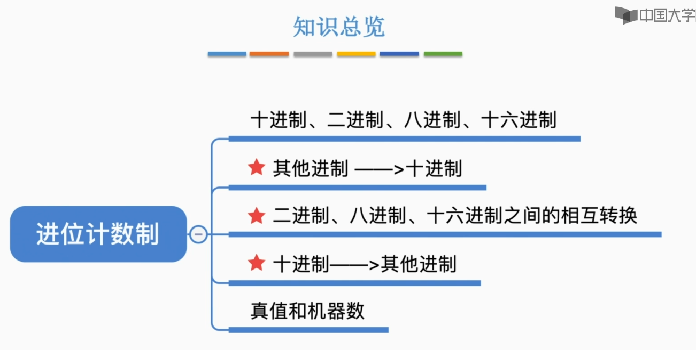
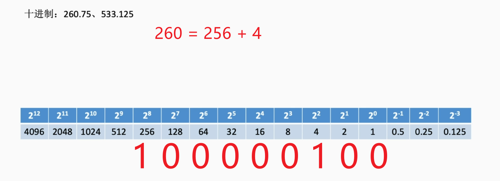
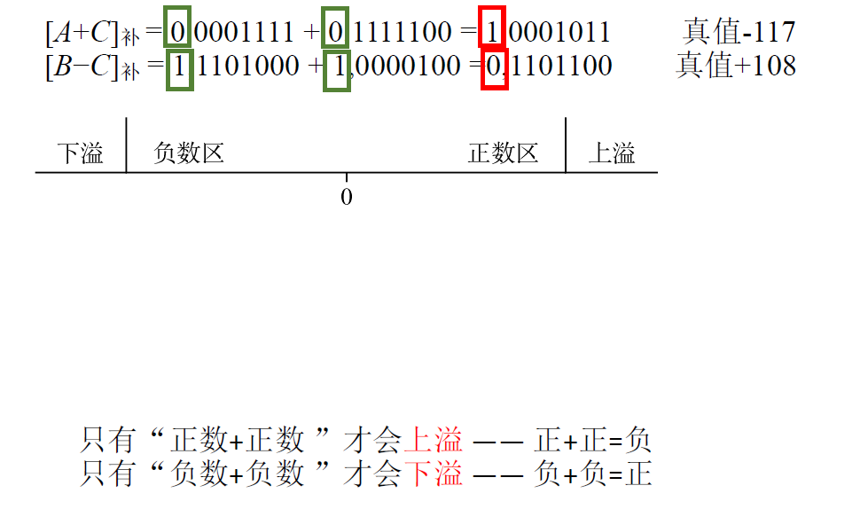
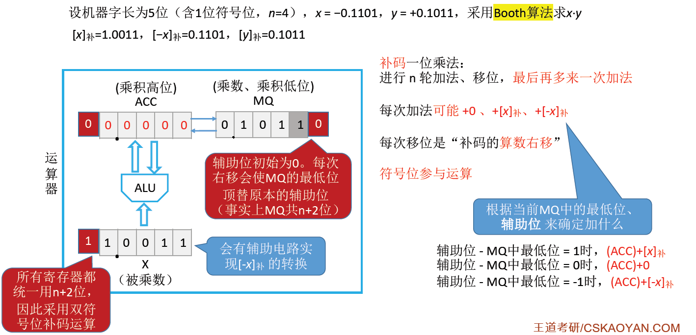

# 1、进位计数制




我们平常使用的都是十进制数，计算机能够识别的都是二进制数。

## 1.1、十进制计数法

宗旨：逢十进一
$$
975.36 = 9×10^2+7×10^1+5×10^0+3×10^{-1}+6×10^{-2}
$$


## 1.2、r进制计数法

基数：**每个数码位所用到的不同符号的个数**。例如十进制会用到 0、1、2、3.....9总共10个符号，所以十进制的基数是10。则r进制的基数为r

| 进制     | 基数                                                         |
| -------- | ------------------------------------------------------------ |
| 二进制   | 0、1                                                         |
| 八进制   | 0、1、2、3、4、5、6、7                                       |
| 十进制   | 0、1、2、3、4、5、6、7、8、9                                 |
| 十六进制 | 0、1、2、3、4、5、6、7、8、9、A(10)、B(11)、C(12)、D(13)、E(14)、F(15) |

### 1.2.1、任意进制转十进制

下面是不同进制转十进制的方式：
$$
二进制:101.1 \quad -> 1×2^2+0×2^1+1×2^0+1×2^{-1} = 5.5 \\
八进制:5.4 \quad -> 5×8^0+4×8^{-1} = 5.5 \\
十进制: 5.5 \quad -> 5×10^0+5×10^{-1} = 5.5 \\
十六进制: 5.8 \quad -> 5×16^0+8×16^{-1} = 5.5
$$
来看一下八进制相加：==逢八进一== ，同理：十六进制相加：==逢十六进一==
$$
八进制:5.4+0.4 = 6.0 \\
八进制:5.4+1.4 = 7.0 \\
\\
十六进制: 5.8+0.9 =  6.1 \\
二进制: 101.1+11.1 =  1001.0 \\
$$
二进制是最适合计算机计算和存储的一种方式：

1. 可以使用两个稳定状态的物理器件表示0、1。例如高低电平、电荷正负来表示0和1。
2. 二进制0、1正好对应逻辑值的假、真，可以很方便实现逻辑运算。
3. 可很方便地使用逻辑门电路实现算术运算(数电)

---

来再做一些练习：
$$
二进制: 10010010.110 \quad=> 十进制: 1×2^7+1×2^4+1×2^1+1×2^{-1}+1×2^{-2} = 146.75
$$

| 2^0  | 1    |
| ---- | ---- |
| 2^1  | 2    |
| 2^2  | 4    |
| 2^3  | 8    |
| 2^4  | 16   |
| 2^5  | 32   |
| 2^6  | 64   |
| 2^7  | 128  |
| 2^8  | 256  |
| 2^9  | 512  |
| 2^10 | 1024 |
| 2^11 | 2048 |
| 2^12 | 4096 |


$$
八进制:251.5 \quad => 2×8^2+5×8^1+1×8^0+5×8^{-1} = 168.625 \\
$$


### 1.2.2、二进制<=>八进制

二进制 => 八进制

- 3位一组，每组转换成对应的八进制符号。不足3位的补0即可

$$
二进制: 1111000010.01101   \quad => 八进制:1702.32
$$


$$
001 = 1×2^0 = 1 \\
111 = 1×2^2+1×2^1+1×2^0 = 7	\\
000 = 0	\\
010 = 1×2^1 = 2	\\
\\
也可以这么算:	\\
001 = 1×1 = 1	\\
111 = 1×1+1×2+1×4 = 7	\\
010 = 1×2 = 2
$$

---

八进制 => 二进制

- 每位八进制对应3位二进制

$$
八进制: (251.5)_8  \quad => 二进制: 010 101 001.101 \\
2 => 010 \\
5 => 101 \\
1 => 001 \\
$$


### 1.2.3、二进制<=>十六进制

二进制=>十六进制

- 4位一组，每组转换成对应的十六进制符号

$$
二进制: 001111000010.01101000 \quad => 十六进制:3C2.68
$$


$$
0011 = 1×1+1×2 = 3	\\
1100 = 1×8+1×4 = 12 = C\\
$$

---

十六进制=>二进制

- 每位十六进制对应4位二进制

$$
(AE86.1)_{16} => (1010 1110 1000 0110.0001)_2 \\
A(10) => 1010 \\
E(14) => 1110 \\
8 => 1000 \\
6 => 0110 \\
1 => 0001
$$


### 1.2.4、各种进制的常见书写方式

| 进制     | 书写方式          |               |            |
| -------- | ----------------- | ------------- | ---------- |
| 二进制   | (10010010.110)~2~ | 10010010.110B |            |
| 八进制   | (1652)~8~         |               |            |
| 十六进制 | (1652)~16~        | 1652**H**     | **0x**1652 |
| 十进制   | (1652)~10~        | 1652**D**     |            |

- 二进制 -> Binary
- 十六进制 -> hexadecimal
- 十进制 ——> decimalism


### 1.2.5、十进制->任意进制

#### 1、整数部分除基取余法

如：将十进制 75.3 转化为二进制，我们要分整数部分 75 和小数不分 0.3 分别转换：

==除基取余法==：也成为除k取余法，主要用于把十进制的整数化为k进制的数。


利用短除法，除以k=2，将得到的余数由下向上排序，这样就把75转化成二进制了
$$
(75)_{10} = (1001011)_2 = 1001011B
$$

$$

$$


#### 2、小数部分乘基取整法

我们将小数部分 0.3 转化为二进制：

==乘基取整法==：也称为乘k取整法，主要用于把十进制的小数化为k进制的数。小数乘基数k，第一次相乘结果的整数部分为目的数的最高位，将其小数部分再乘基数k依次记下整数部分，反复进行下去，直到小数部分为0。


$$
0.3D = 0.01001...B
$$


上图中虽然小数部分并不是0，但是由于取整后的小数部分又再次出现，这就说明0.3D不能用二进制精确的表示，所以我们只需要取到上图即可。


#### 3、方法二拼凑法🔥

当然我们也可以使用拼凑法，我们提前在稿纸上写上每个二进制位对应的位权，然后使用拼凑的方式将十进制转发为二进制。



例如上图中的十进制整数部分为260，260 = 256+4，则在 2^8^和 2^4^处写上1，其余部分均写0，则整数部分转化完成，小数部分同理，0.75 = 0.5+0.25。
$$
260.75D = 100000100110B \\

533.125D = 1000010101.001B \\
\\
533 = 512+16+4+1\\
(0.125)_{10} = (001)_2
$$


这种方法就是速度较快，如果题目要让十进制转八进制，我们可以先将十进制转换为二进制，然后将二进制转换为八进制。如将上图中的十进制转换为八进制：

$$
(1000010101.001)_2 = (1025.1)_8 \\
001 = 1 \\
101 = 5 \\
010 = 2 \\
000 = 0 \\
001 = 1 
$$
这种方法适用于给的十进制数不是特别大，使用这种方法速度会更快。


## 1.3、真值和机器数

- 真值：符合人类习惯的数字

- 机器数：数字实际存到机器里的形式，正负号需要被 "数字化"

例如我们的十进制数如果还带正负号要怎么办呢？通常的解决方法是我们会增加一个==标志位(符号位)==，用一个二进制的0或1表示正或者负。
$$
15 = 1111 \\
8 = 1000 \\
\\
+15 = 01111 \\
-8 = 1 1000
$$


# 2、字符和字符串

## 2.1、英文字符在计算机内的表示

### 2.1.1、ASCII码

英文在计算机里就是用ASCII码来表示的，因为计算机只能识别二进制数，所以我们制定了规则将数字、字母、符号共128个字符映射为二进制数，只需要7个二进制编码就可以达到要求。但是计算机处理数据的时候通常都是以一个字节B(也就是8bit)为单位，所以虽然理论上我们只需要7位二进制编码就已经可以表示128个字符，但是我们为了计算机方便，通常会在最高位补0，凑足一个字节B。


ASCII码中的32~126叫做可印刷字符，也就是我们平常可以在计算机屏幕上看到的字符，其余为控制、通信字符。


> - 48 -> 57 表示数字 0 -> 9，前四位比特都是0011，后面四位分别对应数字的二进制
> - 所有的大写字母的前三个比特都是 010，后面的五个比特转化为十进制刚好是 1->26
> - 所有的小写字母的前三个比特都是 010，后面的五个比特转化为十进制刚好是 1->26
> - 记住大写英文字母和小写英文字母是连续的，但是大写字母和小写字母是不连续的即可。

例如如下题：


由于每个字母的ASCII码都是8bit位，所以用0来补足。


## 2.2、中文字符在计算机内的表示

### 2.2.1、汉字的表示和编码


GB 2312-80：1980年推出的汉字+各种符号共 7445 个。因为是1980年，所以只囊括了常用的汉字和符号。这么多的汉字总共被分为94个区，每个区94个位置。通俗的讲就是94行×94列的矩阵，每个格子对应一个汉字，这样我们就可以用行号和列号来表示每个汉字的位置，也就是使用==区位码==来表示汉字位置。

这样会造成什么问题呢？在网络通信中，例如A主机发送B主机区位码(6,7)，B主机收到第一个6按照ASCII码去查找去了，这样就会出事故。可是区位码范围是 0~93 ，而 ASCII 码 0~31表示的就是控制、通信字符。所以为了防止错乱，我们将发送的区位码加上32，这样区位码的范围就算是 32 ~ 125，这就得到了 ==国标码==

但是要想把汉字存入计算机里面，还要给国标码加上 128，从而得到==汉字机内码==。之所以加128是因为国标码范围(32 ~ 125,32 ~125)和ASCII码的英文字符范围重合了(观察上述ASCII码图表)，这样汉字机内码的范围就(>128,>128)都大于128了。

我们知道一个汉字使用2个字节B来表示，如果A给B通信，B收到一个字节B的范围大于128，则收到的肯定是汉字，计算机就自然会去读第二个字节B，将2B组合成一个汉字，若小于128，则收到的肯定是英文字符。


$$
区位码: (0\sim93,0\sim93) \\   
国标码:(32\sim125,32\sim125) \\
汉字机内码:(>128,>128)
$$

> 这只是汉字的其中一种编码方式，现在还有UTF-8等等编码方式。

### 2.2.2、输入编码和字形码

**输入**：汉字输入码：就是为了输入汉字的，比如拼音输入、五笔输入法，输入法软件会把拼音自动转换为汉字机内码。

**输出**：汉字字形码。汉字输出时需要用到汉字字形码，将汉字机内码转换为汉字字形码。


## 2.3、字符串的存储

### 2.3.1、英文字符串的存储

假设某个计算机==按字节编址(也就是每个内存地址会对应1B的内容)==，假设从地址为2的单元开始存储字符串 `abc` 。很多语言中，会在字符串最后存储 `\0`作为字符串结尾标志。


### 2.3.2、中文字符串的存储

假设某个计算机==按字节编址(也就是每个内存地址会对应1B的内容)==，假设从地址为2的单元开始存储字符串 `abc啊` ,中文字符`啊`的汉字机内码是 ：`B0 A1H`


每个汉字要使用两个字节B来存储，这里有两种存储模式：

1. 大端模式：**将汉字的最高有效字节存放在低地址单元**
2. 小端模式：**将汉字的最高有效字节存放在高地址单元**


## 2.4、知识小结


# 3、定点数的表示

- 定点数：小数点的位置固定     => 996.007 常规计数
- 浮点数：小数点的位置不固定  => 9.96007×10^2^ 科学计数法


## 3.1、无符号数

无符号数：整个机器字长的全部二进制位均为数值位，没有符号位，**相当于数的绝对值**。

表示范围：

- 8位二进制数可以表示 2^8^种不同的状态：0000 0000 ~ 1111 1111
- 这里记录一下二进制 `1111 1111` 对应的真值怎么计算
  1. 第一种方法就是最简单但麻烦的 1×2^7^+0×2^6^ +....... = 156D
  2. 第二种方法，我们给 `1111 1111 + 1` 这样就得到了 2^8^ ，所以 `1111 1111`对应的真值为 2^8^-1  

- 推广：==n位无符号数能表示的范围为：0 ~ 2^n^ -1==

我们通常只会谈论无符号的整数，而不会谈论无符号的小数。

```c
// 例如 unsigned 只能用来修饰 int、long,而不能用来修饰 float、double
unsigned long a;
```


## 3.2、有符号数的定点表示


对于有符号数，我们就既需要考虑整数如何表示，也要考虑小数如何表示。

对于定点的方式表示整数，我们会规定小数点是固定的，隐含在最低位的后面。最高位的二进制位表示的是符号位，通常0表示的是正，1表示的是负。对于定点的方式表示小数，我们会规定最高位为==符号位==，小数点位置固定在符号位的后面。我们用来表示整数或者小数的数值部分称为==尾数==。

**注**：我们可以用 ==原码、反码、补码==三种方式来表示定点整数和定点小数。还可用==移码==表示定点整数。若真值为x，则用[x]~原~、[x]~反~、[x]~补~、[x]~移~分别表示真值所对应的原码、反码、补码、移码


### 3.2.1、原码

原码：用尾数表示真值的绝对值。符号位0/1对应正负。

若机器字长为n+1位，则尾数占n位，因为要有1位占符号位。通常机器字长为8位，我们来看下如何使用原码来表示整数和小数。


首先看左边图片，使用原码来表示整数 19D：

- 表示整数的第一位是符号位，0代表正，1代表负
- 由于小数点固定在尾数后面，所以我们才知道尾数的位权的。
- 真值19转换为二进制：19 = 16+2+1，其余各项用0补齐即可
- 用原码表示真值也可写为：[x]~原~ = 1,0010011 。图中的逗号是为了方便阅读，逗号前代表符号位，逗号后代表尾数(数值部分)。
- 这里我们指明机器字长是8位，如果没有指明机器字长，我们就可以如图中那样写

之后再看右边图片，使用原码来表示小数 0.75D：

- 由于小数点固定在符号位后面，所以我们就知道尾数的位权。
- 真值 0.75 转换为二进制即可


### 3.2.2、原码的表示范围

#### 1、用原码表示定点整数范围

若机器字长n+1位，其中尾数有n位，那么n位的尾数可以表示真值的绝对值的范围是 0 ~ 2^n^ -1 ，我们再加上符号位表示正负的话，原码整数的表示范围：==-(2^n^-1) ≤ x ≤ 2^n^-1 (关于原点对称)==

**注意**：用原码表示定点整数，我们在表示真值 0 的时候有 +0 和 -0 两种形式，+0就是符号位为0，尾数全为0。-0就是符号位为1，尾数全为0。因此虽然 n+1 个二进制位可以表示 2^n+1^ 种状态，理论上我们也可以表示    2^n+1^ 个数。但实际上由于其中的两个二进制状态对应了同一个真值0，所以其实只表示了 2^n+1^-1 个数。


#### 2、用原码表示定点小数范围

若机器字长n+1位，其中尾数有n位，这n个二进制位所能表示的真值绝对值的范围是： 0 ~ 1-2^-n^ ，我们在加上符号位表示正负的话，原码小数的表示范围：==-(1-2^-n^) ≤ x ≤ 1-2^-n^ (关于原点对称)==

解释：最小是0，所有位都是0，最大是1，所有位都是1。 2^-1^+2^-2^+2^-3^.......+2^-n^ = 1-2^-n^

**注意**：用原码表示定点小数，我们在表示真值 0 的时候也有 +0 和 -0 两种形式，


### 3.3.3、反码

反码：

- 若符号位为0，则反码与原码相同(正数的反码 = 原码)
- 若符号位为1，则数值位全部取反


要得到反码，先得到原码，根据符号位决定对原码是否需要修改。若符号位为0，则反码与原码相同，若符号位为1，则数值位全部取反。


### 3.3.4、补码

补码：

- 正数的补码 = 原码
- 负数的补码 = 反码末位+1(要考虑进位)


我们规定机器字长只有8位，所以向更高位进的1会被丢弃，所以补码的真值0只有一种表示形式。原码中会有两种二进制状态对应真值0，而在补码中只有其中一种状态表示0，那另一种状态呢？

- 我们规定定点整数的补码 [x]~补~ = 1,0000000 如果符号位为1，而尾数都为0的话，我们规定这个补码所对应的真值为 x = -2^7^
- 由于+0和-0只有一种表示形式，因此多出来的二进制状态是 1.0000000，我们规定定点小数的补码 [x]~补~ = 1.0000000 表示真值 x= -1


对于8位的原码和反码来说，8位所能表示的最小数值是 -(2^7^-1) ，但是对于补码来说它可以多表示一个负数，所以补码所能表示的最小数值是 -2^7^，

- 因此如果机器字长是 n+1 位，那么**补码整数**的表示范围：==-2^n^ ≤ x ≤ 2^n^-1(比原码多表示一个 -2^n^)==
- 若机器字长为 n+1 位，**补码小数**的表示范围：==-1 ≤ x ≤ 1-2^n^(比原码多表示一个 -1)==


如果给你一个正数的补码，我们很容易就求出原码，因为正数的原码和补码是相同的。但是如果给你一个负数的补码，如何转换为原码呢？

- 负数补码转换为原码：尾数取反，末位+1

$$
例如将 -19D 的补码转换为原码 \\
[x]_补 = 1,1101101  \\
首先将尾数全部取反:1,0010010 \\
在末位+1:[x]_原=1,0010011
$$


### 3.3.5、移码

移码：移码就是在补码的基础上将**符号位取反**。==注意：移码只能用于表示整数==。

移码就是靠补码转换过来的，并且移码和补码的+0和-0只有一种表示形式，所以若机器字长为n+1位，移码整数的表示范围：==-2^n^ ≤ x ≤ 2^n^-1(与补码相同)==


---

移码的作用：

补码符号位取反就得到了移码，如果把移码的所有二进制位看作是无符号数，那么当真值增大的时候，移码所对应的无符号数也是在逐一递增的，所以==移码表示的整数可以很方便对比大小==。如果要对比两个移码的大小，我们可以让计算机硬件从最高位的比特依次向后对比，谁先出现1那么就谁更大，两个都同时出现1，那么继续向后比较即可。


## 3.3、用几种码表示定点整数


## 3.4、练习

将真值转化为各种码：

1. 定点整数x=50，用8位的原码、反码、补码、移码表示

    - 50 = 32+16+2，所以50的二进制数表示为 `110010` ，因为要凑足8位，并且50是正数，符号位是0，所以原码为 [x]~原~= `00110010`

    - 符号位为0，则反码与原码相同， [x]~反~= `00110010`

    - 正数的补码 = 原码，[x]~补~= `00110010`

    - 在补码的基础上将符号位取反。[x]~移~= `10110010`
2. 定点整数 x=-100，用8位的原码、反码、补码、移码表示
   - 100 = 64+32+4，所以 100 的二进制数表示为 `1100100`，因为要凑足8位，并且100是正数，符号位是1，所以原码为 [x]~原~= `11100100`
   - 符号位为1，则数值位全部取反， [x]~反~= `10011011`
   - 负数的补码 = 反码末位+1，[x]~补~= `10011100`
   - 在补码的基础上将符号位取反。[x]~移~= `00011100`

将各种码转换成真值：

3. 求下列各种码对应的真值：
   - [x]~原~ = 10001101
   - [x]~反~ = 10001101
   - [x]~补~ = 10001101
   - [x]~移~ = 10001101

将所有码转化为原码，首先看原码：

1. 原码的符号位为1，则真值为负数，真值 x= -(1+4+8)=-13
2. 将反码转换为原码，符号位为1，则数值位全部取反，[x]~原~ = 1110010 ，符号位为1，则真值为负数，真值x = (2+16+32+64) = -114
3. 负数将**补码转换成原码**和**原码转换成补码**的方式是一样的，都是把尾数取反，然后末位+1 。[x]~原~ = 11110011，符号位为1，则真值为负数，真值x = -115
4. 将移码转换为补码，再将补码转换为原码。[x]~补~ = 00001101，[x]~原~ =  00001101 = +13

> 负数将补码转换成原码和原码转换成补码的方式相同，正数的补码 = 原码


4. 求下列各种码对应的真值：
   - [x]~原~ = 00001101
   - [x]~反~ = 00001101
   - [x]~补~ = 00001101
   - [x]~移~ = 00001101

由于符号位为0，所以原码、反码、补码都是同一个真值， x = 13。将最后一个移码转换为补码 [x]~补~ = 10001101，再将补码转换为原码 [x]~原~ = 10001111，则真值x = -115

> 技巧：由[x]~补~快速求[-x]~补~的方法：符号位、数值位全部取反，末位+1


## 3.5、总结


## 3.6、各种码的作用

- 补码的作用：使用补码可以将减法操作转变为等价的加法，这样ALU中无需集成减法器，执行加法操作时，符号位一起参与运算。
- 移码的作用：移码表示的整数可以很方便对比大小


# 4、定点数的运算

## 4.1、移位运算


### 4.1.1、算数移位

算数移位：通过改变各个数码位和小数点的相对位置，从而改变各数码位的位权。**可以用移位运算实现乘法、除法。**

#### 1、原码的算数移位

原码的算数移位：符号位保持不变，仅对数值位进行移位。例如对 -20D 进行算数移位


**算数右移**：高位补0，低位舍弃。若舍弃的位=0，则相当于÷2，若舍弃的位≠0，则会丢失精度。

说白话就是因为机器字长是8bit，超出的部分会丢弃，例如上图我们右移后，小数点后面的会直接舍弃，前面不够的高位就补0。


**算数左移**：只让数值位移动，符号位保持不变。低位补0，高位舍弃。若舍弃的位=0，则相当于×2，若舍弃的位≠0，则会出现严重误差。

> 上述是针对用原码表示的定点整数，用原码表示的定点小数同理。


#### 2、反码的算数移位


因为正数的反码和原码都是相同的，所以正数的反码的算数移位和原码的算数移位相同。

但是负数的反码和原码是相反的，所以负数的反码算数移位和原码的算数移位相反。

- 算数右移：高位补1，低位舍弃
- 算数左移：低位补1，高位舍弃

> 这里为什么补1而不是0呢？因为反码中的0其实就是原码中的1，反码中的1就是原码中的0。所以反码中补1相当于在原码中补0

#### 3、补码的算数移位


正数的补码和原码相同，因此正数的补码移位运算和原码相同

负数的补码 = 反码末位+1，导致反码最后边几个连续的1都因进位而变为0，直到进位碰到第一个0为止。**规律**：负数补码中，==最右边的1及其右边同原码，最右边的1的左边同反码(如图)==：

- 算数右移(同反码)：高位补1，低位舍弃
- 算数左移(同原码)：低位补0，高位舍弃


#### 4、总结


#### 5、算数移位的应用


例如我们要让计算机计算 -20D × 7D，都是十进制，我们都先转化为二进制，如图整个乘法瞬间就演变为了算数移位操作，牛逼！


### 4.1.2、逻辑移位


逻辑右移：高位补0，低位舍弃

逻辑左移：高位舍弃，低位补0

> 可以把逻辑移位看作是对"无符号数"的算数移位


#### 1、逻辑左移的应用


我们计算机会使用RGB来表示颜色，R、G、B分别用不同的十进制表示，显示颜色时我们需要将RGB连接起来可以这么做：

1. 首先用3B存储无符号数102的二进制，并逻辑左移16位
2. 之后用3B存储无符号数139，并逻辑左移8位
3. 最后用3B存储无符号数139
4. 三者相加得到3B的RGB值

牛逼！


### 4.1.3、循环移位

循环移位分为两种：简单循环移位和带 进位位的循环移位

#### 1、简单循环移位

简单循环移位是我自己起的名字。无论左移还是右移，都会将移出的数补到缺位的位置。


#### 2、带进位位的循环移位

进位位：当我们运算到最高位需要进位的时候，由于计算机机器字长的限制，进位的数值会被舍弃掉，进位位就是保存这些舍弃掉的数值，这样保证我们进行更高位的运算不会出错。进位位里面要么存一个1，要么存一个0


**带进位位的循环左移**：把原来最高位的数值放在CF进位位处，而进位位的数值则补到缺的位置(如上图)。

**带进位位的循环右移**：把原来最低位的数值放在CF进位位处，而进位位的数值则补到缺的位置


### 4.1.4、总结


## 4.2、加减运算


定点数的加减运算，我们通常只会探讨**原码和补码**的加减运算，因为反码一般不会直接参与这种运算的。


### 4.2.1、原码的加减部分

原码的加法运算：

- 正数+正数 => 绝对值做加法，结果为正
- 负数+负数 => 绝对值做加法，结果为负
- 正数+负数 => 绝对值大的减绝对值小的，符号同绝对值大的数
- 负数+正数 => 绝对值大的减绝对值小的，符号同绝对值大的数

简单解释：加数和被加数为正，我们只需要让二者的绝对值做加法操作，符号位依然为正。

---

原码的减法运算：减数符号取反，转变为加法

- 正 - 负 -> 正 + 正
- 负 - 正 -> 负 + 负
- 正 - 正 -> 正 + 负
- 负 + 正 -> 负 - 负


> 原码这法子对计算机来说复杂了，所以通常都是使用补码进行加减运算


### 4.2.2、补码的加减运算

对于补码来说，无论加法还是减法，最后都会转变成加法，由加法器实现运算，符号位也参与运算

1. 设机器字长为8位(含1位符号位)，A=15，B=-24，求[A+B]~补~ 和 [A-B]~补~

|          | 原码      | 反码      | 补码      |
| -------- | --------- | --------- | --------- |
| A=+1111  | 0,0001111 | 0,0001111 | 0,0001111 |
| B=-11000 | 1,0011000 | 1,1100111 | 1,1101000 |

$$
[A+B]_补 = [A]_补 + [B]_补 =0,0001111+1,1101000 = 1,1110111
$$

验证：将补码 `1,1110111` 转变为原码是 `1,0001001` ，对应的真值是 -9 ，正确。

 负数的补码转换为原码有两种方式：

1. 数值位取反 + 1
2. 负数补码中，最右边的1及其右边同原码，最右边的1的左边同反码

这两种方法都可以，自己选择。
$$
[A-B]_补 = [A]_补 + [-B]_补 =0,0001111+0,0011000 = 0,0100111
$$

> 技巧：由[x]~补~快速求[-x]~补~的方法：符号位、数值位全部取反，末位+1


2. 设机器字长为8位(含1位符号位)，A=15，B=-24，C = 124，求[A+C]~补~ 和 [B-C]~补~

|            | 原码      | 反码      | 补码      |
| ---------- | --------- | --------- | --------- |
| A=+111     | 0,0001111 | 0,0001111 | 0,0001111 |
| B=-11000   | 1,0011000 | 1,1100111 | 1,1101000 |
| C=+1111100 | 0,1111100 | 0,1111100 | 0,1111100 |

$$
[A+C]_补 =0,0001111+0,1111100 = 1,0001011 \quad (真值-117)\\
[B-C]_补 =1,0011000+1,0000100 = 0,1101100 \quad (真值108)
$$

这里A+C的补码转化为原码对应的真值是-177，这与我们A+C=139明显不符合。这是因为发生了 **溢出** 的情况。

这是因为8位的补码能表示的范围只有 -128 ~ 127，139已经超出8位补码可以表示的范围。


### 4.2.3、溢出判断

我们只需要考虑**补码**的加法运算如何判断溢出即可。



例如两个正数相加，超过了127的范围，那么就会发生 **上溢** 。上溢得到的结果由符号位看起来是一个负数。

如果两个负数相加，超出了 -128 的范围，那么就会发生 **下溢**。下溢得到的结果由符号位看起来是一个正数。


基于上述规律,我们来进行溢出判断：

1. **方法一：采用一位符号位**

设A的符号为 A~S~，B的符号为B~S~，运算结果的符号为S~S~，则溢出逻辑表达式为：
$$
V = A_SB_S \overline {S_s}+ \overline {A_S}  \overline {B_S} S_S \\
若 V = 0,表示无溢出
若 V = 1,表示有溢出
$$
这上面的A~S~、B~S~ 表示逻辑值的0和1，例如[A+C]~补~运算中A~S~ =0、B~S~ = 0(通过看符号位)，表示逻辑值的假，S~S~ = 1，表示逻辑值的真。三个写在一起，表示执行 **与** 运算，也就是C语言里面的且运算。**加号**表示或运算。逻辑值上面画横线表示 **非**运算。

这里解释下[A+C]~补~运算中的溢出逻辑表达式：
$$
A_S =0、B_S = 0、S_S=1、\overline {S_s} = 0、则A_SB_S\overline {S_s} = 000与运算=0  \\
\overline {A_s} = 1、\overline {B_s} = 1、S_s = 1,则\overline {A_S}  \overline {B_S} S_S = 111与运算 = 1 \\

V = A_SB_S \overline {S_s}+ \overline {A_S}  \overline {B_S} S_S  = 0和1执行或运算 = 1 \\
则V=1表示有溢出
$$


> - A~S~为1且B~S~为1且S~S~为0    =>   表示负+负=正
> - A~S~为0且B~S~为0且S~S~为1    =>   表示正+正=负 
> - 很符合我们之前的溢出判断

逻辑既然这么简单为啥还特么要上述那些麻烦的计算，都是因为 **与或非** 在硬件里面好实现😔~~


2. **方法二：采用一位符号位，根据数据位进位情况判断溢出**

|      | 符号位的进位C~S~ | 最高数值位的进位C~1~ |
| ---- | ---------------- | -------------------- |
| 上溢 | 0                | 1                    |
| 下溢 | 1                | 0                    |

> 总结：C~S~和C~1~不同的时候会发生溢出

符号位的进位：符号位向更高位产生的进位数

最高数值位的进位：尾数最高位向符号位产生的进位数

| 进位位 | 符号位 |      |      |      |      |      |      |      |
| ------ | ------ | ---- | ---- | ---- | ---- | ---- | ---- | ---- |
|        | 0      | 0    | 0    | 0    | 1    | 1    | 1    | 1    |
|        | 0      | 1    | 1    | 1    | 1    | 1    | 0    | 0    |
| `0`    | `1`    | 0    | 0    | 0    | 1    | 0    | 1    | 1    |

例如上述计算，最高数值位的进位是C~1~=1，符号位的进位是C~S~=0

计算机处理==不同==的逻辑符号是 `异或⊕`，溢出逻辑判断表达式为 V=C~S~⊕C~1~ 。若 V=0，表示无溢出，若V=1，表示有溢出。

解释一下异或逻辑：==不同为1，相同为0==

- 0 ⊕ 0 = 0
- 0 ⊕ 1 = 1
- 1 ⊕ 0 = 1
- 1 ⊕ 1 = 0


3. **方法三：采用双符号位：正数符号为00，负数符号为11**🔥


最终得到的结果中的两个符号位，第一个符号位表示应该得到的正负性，第二个符号位表示实际得到的正负性。所以本应得到正的0，实际确得到了负的1，则说明发生了上溢。

所以计算机要想判断是否溢出，只需要一个异或运算就搞定了。


### 4.2.4、符号位边角知识

- 双符号位补码又称为==模4补码==，单符号位补码又称为==模2补码==

- 如果把双符号位补码的逗号看作是小数点的话，那么小数点前的第一位权值为2^0^，第二位权值为2^1^，第三位权值是2^2^=4，模4指的是==把位值小于4的部分保留，大于4的部分舍弃==。
- 双符号位在内存中存储并不会增加空间，因为实际存储时只存储1个符号位，只是运算的时候会复制一个符号位。


### 4.2.5、符号扩展

溢出了咋办，扩展吧！把int改为long，那么多出来的那些位怎么填补呢？

例如下图，将8位扩展为16位：


**整数部分**：

- 由于正整数的原码、反码、补码的表示都一样，所以在补位的时候补0凑足16位即可。==在符号位和数值位之间补0==
- 负整数的原码在符号位和数值位之间补0
  - 负整数的反码和原码数值位相反，所以补的和原码相反，原码补0，反码补1
  - 补码和反码一样，都是补1
  - 因为补码原码反码之间有这样的规律，找到最右边的1，补码这个1的左边的数值部分和反码一致，1的右边数值部分和原码保持一致。

**小数部分**：

- 正小数的原码、反码、补码的表示都一样，==所在在数值位后面补0==
- 负小数也用上面的规律，找到最右边的1，补码这个1的左边的数值部分和反码一致，1的右边数值部分和原码保持一致。


### 4.2.6、小结


## 4.3、乘法运算


### 4.3.1、原码的一位乘法


1. 符号位单独处理：符号位 = x~S~⊕y~S~

2. 数值位==取绝对值==进行乘法计算


**ACC里面放乘积高位，MQ里面放乘数、乘积低位，X里面放被乘数。如下图**：在开始计算之前将ACC置零，乘数在MQ里面，如果乘数的最低位=1，则让ACC加上被乘数；如果当前位=0，则ACC加上0。


如下图，相当于我们把第一个位积算出来了并放在ACC里面，接下来再算第二个位积的时候，由于第二个位积和第一个位积进行相加的时候需要有一个错位，所以计算机会让ACC和MQ里面的数值统一进行逻辑右移，ACC的最低位会移到MQ的最高位，高位补0。


接下来计算次低位和被乘数的位积，同样利用MQ的最低位进行位积的运算，此时最低位=1，所以ACC加上被乘数。


之后继续逻辑右移，高位补0。==ACC和MQ中的红色部分可以称为部分积==。


此时MQ最低位为0，则ACC加0然后继续右移。


此时MQ最低位为1，所以ACC加上被乘数。然后继续右移：


此时MQ最低位为0，但是由于这个0是乘数的符号位，所以不参与运算。==数值位有n位，我们只需要重复n次加法和移位==就可以得到最终的结果，定点小数的符号位隐含在符号位后面，结果如下图：0.10001111


最后一步对符号位进行异或操作来修改符号位，这样我们再来看乘积高位，乘积低位就很好理解了，因为每次参与运算的只有被乘数的一个位，所以叫做 **原码一位乘法**。


> 额的娘嘞，上面那就是计算机咋个实行的，下面再看看做题时候如何手算模拟：

**王道书上写的是双符号位，这是因为补码一位乘法就是采用双符号位，实际上原码中单/双符号位都可以算，但是补码一位乘法中必须采用双符号位，所以为了记忆方便，干脆统一写成双符号位。**

---

来吧，如下图：乘数只有数值位会参与运算，所以手算时乘数只写数值位即可。被乘数存在通用寄存器|x|当中，乘数存放在MQ乘商寄存器里面，高位部分积用ACC来记录，刚开始初始化为0。图中的C4就是要参与运算的数值，当为1的时候，则让ACC加上被乘数|x|，每次加法运算得到一个结果之后，先进行逻辑右移，然后再进行加法。


### 4.3.2、补码的一位乘法(Booth算法)


辅助位和MQ的最低位值只能为0/1，所以==辅助位-MQ的最低位=1/0/-1== 三种情况

- 当值为1的时候，使用 ACC + [x]~补~
- 当值为0的时候，使用 ACC+ 0
- 当值为-1的时候，使用 ACC + [-x]~补~ 




辅助位：辅助位其实就是将MQ多扩展了一位，**初始时辅助位为0**，每次右移都会使得MQ的最低位顶替原本的辅助位。MQ有n位数值位，1位符号位，1位辅助位，所以实际上MQ共有n+2位。

CPU里面寄存器的长度一般都是统一的，所以MQ扩展了一位，ACC、X寄存器所有的寄存器也都会统一用 n+2 位，因此==采用双符号位补码运算==。

**原码的乘法中是向 X 和 MQ 里面存了乘数和被乘数的绝对值，而补码的乘法中是将完整的带符号位的补码存入。**被乘数采用双符号数的补码，而乘数采用单符号位的补码(因为MQ的最后一位存了辅助位)，所以乘数就只能是单符号位的补码。由于 ACC 会加 [x]~补~和[-x]~补~，所以会有辅助电路实现两者之间的转换，不用我们操心。


1. 如上图，乘数符号位参与运算，所以乘数的补码写全部，在最后一位前划线，划线前面一位是MQ的最低位，划线后面一位是辅助位。
2. 第一轮辅助位-MQ中最低位 = 0-1 = -1，所以给ACC+[-x]~补~
3. 经过加法之后得到加和的值，这个值存在ACC里面，之后ACC和MQ会统一进行**算数右移**
4. 第二轮辅助位-MQ最低位 = 1-1= 0，所以给ACC+0
5. 经过加法之后得到加和的值，这个值存在ACC里面，之后ACC和MQ会统一进行**算数右移**
6. 第三轮辅助位-MQ最低位 = 1-0 = 1，所以给ACC+[x]~补~
7. 经过加法之后得到加和的值，这个值存在ACC里面，之后ACC和MQ会统一进行**算数右移**
8. 第四轮辅助位-MQ最低位 = 1-0 = 1，所以给ACC+[x]~补~
9. 经过加法之后得到加和的值，这个值存在ACC里面，之后ACC和MQ会统一进行**算数右移**
10. **总共有4个数值位，所以需要进行4轮的加法和算数右移，但是补码最后要多加一轮的加法，只有加法没有右移。**
11. 第五轮辅助位-MQ最低位 = 1-0 = 1，所以给ACC+[x]~补~ 。==这里发现0其实就是乘数的原符号位，所以我们就明白了为什么说补码乘法中符号位参与运算了吧，参与的是加法运算罢了~==
12. 经过加法之后得到加和的值，再后拼接上MQ的前n个位，就得到了[x·y]~补~ =  11.01110001
13. 双符号位相乘1×1=1，得到的是负值，所以最后的结果为 x·y = -0.01110001


## 4.4、除法运算


### 4.4.1、原码除法：恢复余数法


- **原码的符号单独处理，使用异或进行运算。数值位取绝对值进行除法计算**。(这是因为原码既有可能是正的也有可能是负的)
- 如上题，x/y。先写出|x|、|y| 绝对值，再算除数绝对值的补码 [|y|]~补~ 、 [-|y|]~补~
- ACC里面存被除数、余数的值，通用寄存器里面存除数的值，MQ存储商。**初始将MQ置为0**
- 手算时，会比较ACC里面的余数和通用寄存器里面的除数大小，余数大于除数，则商1；余数小于除数，则商0。**计算机比较傻，会默认先商1，如果错了再改为0**


> 带括号的目的其实表示的是 ACC 里面的值，个人习惯不带，但是发现不好表示，前面也有一些没带，后面有时间再补吧

商1其实就是让余数-除数，即 (ACC)- (除数) ，然后将得到的值放回ACC中。余数-除数 = (ACC) + [-|y|]~补~ -> ACC，相减的结果是个负数，说明应该商0，计算机就会改0。但是ACC里面的值已经减了一个除数，所以为了恢复原样，我们又要加上除数。(ACC)+(除数) -> ACC 。之后进行==逻辑左移==，ACC高位丢弃，低位补0


**之后继续，先默认商1，(ACC)+[-|y|]~补~ ->ACC，值为正商1正确，值为负商1错误改为商0，然后逻辑左移。**由于机器字长只有5位，所以商也只能求5位。


上面算的是定点小数的计算，所以符号位隐藏在符号位后面，商的值是0.1101和我们的手算结果相同，余数的值需要乘 2^-n^ 。最后还要对符号位进行异或操作，修改商的符号位即可


#### 1、手算原码除法


1. 首先写出被除数和除数绝对值的原码表示，并且写出原码绝对值的补码，原码绝对值取负的补码
2. 使用被除数减去除数，也就是加上除数绝对值的负值的补码，得到一个余数，符号位为1，所以这一位的商商0。并且在这个余数的基础上再加上除数，恢复成原来样子。
3. 之后将余数逻辑左移，低位补0
4. 之后继续减去除数，也就是加上绝对值的负值的补码，得到一个余数，符号位为0，所以这一位的商商1。

> 余数为正，商取1。余数为负，商取0

右边的流程图中，我们可以将最开始的被除数看为老余数。数值位为n，逻辑左移只需要进行n次，但是上商我们需要n+1次，最后一位上商余数不左移。


### 4.4.2、原码除法：加减交替法(不恢复余数法)

如果不恢复余数法，我们将第一步得到的余数记为a，a是负值，所以商0，加上除数绝对值的补码(记为b)，得到的结果自然就是a+b，之后进行逻辑左移，实际上就是(a+b)×2 = 2a+2b。

第二步继续加上除数绝对值的负值的补码，也就是 2a+2b-b = 2a+b。

> 总结：如果余数为负，则可直接商0，并让余数左移1位再加上除数绝对值的补码


---


文字可能略绕，结合图片理解：

1. 如上图，开始被除数是0.1011，ACC中存放01011，MQ初始化为0
2. 第一步使用被除数加上==除数绝对值的负值的补码==，得到一个余数是负值，则商0
3. 我们这个时候不用恢复余数，而是直接让得到的余数逻辑左移，逻辑左移之后再加上==除数绝对值的补码==，再得到一个余数。
4. 由于这个余数是正的，所以商1。
5. 之后继续逻辑左移，左移得到的余数再按照恢复余数法那样加上==除数绝对值的负值的补码==，得到一个余数。
6. 最终的符号位依然需要进行异或操作

---


上述是原码加减交替法的流程。加减交替法需要加减n+1次，左移n次。如果最后一步得到的余数是负值，则需商0并且需要再进行一次加法得到正确的余数。所以加减交替法中加减的次数可能是n+1次，也可能是n+2次，但逻辑左移只需要n次


---

🔥总结：

- 在原码的加减交替法中，若余数为负，则直接商0，让余数左移一位再加上==除数的绝对值的补码==，得到下一个余数
- 若余数为正，则商1，让余数左移一位再减去==除数的绝对值的补码==，得到下一个余数

恢复余数法和加减交替法：

- 恢复余数法：当余数为负时商0并加上==除数的绝对值的补码==，再左移，再加上==除数绝对值的负值的补码==
- 加减交替法：当余数为负时商0并左移，再加上==除数的绝对值的补码==


### 4.4.2、补码除法运算


1. 写出补码，**注意写的并不是绝对值的补码**

2. 根据被除数和除数同号还是异号来判断被除数和除数的运算
   - 若被除数和除数**同号**，则**被除数减去除数**
   - 若被除数和除数**异号**，则**被除数加上除数**
3. 根据第二步得到的余数来判断商
   - 若余数和除数**同号**，则**商1**，**余数左移一位减去除数**
   - 若余数和除数**异号**，则**商0**，**余数左移一位加上除数**
   - 重复n次

4. 最后一步得到的余数和除数不管同号还是异号，我们都**恒让商的末位置为1**

上述操作可以得到 [x/y]~补~ = 1.0101，余数是0.0111×2^-4^


### 4.4.3、除法运算总结


# 5、强制类型转换

我们来看看C语言中的定点整数是如何进行强制转换的，C语言中的定点整数是用 "补码" 存储的。例如 int、short、long，在C语言中都是以补码的形式存储的。


来看上图，short型占用2个字节，也就是16个bit，16个比特表示的补码对应的真值是 -4321，则补码x = 1110 1111 0001 1111 ，第二句代码将 short 型强制转换成无符号的短整型，然后赋值给y，所以y的补码和x的补码相同。只是由于y是一个无符号的短整型，所以计算机在解析y的真值的时候会按照无符号整数来进行解析，解析的真值是61215。

> 即
>
> - 无符号数和有符号数之前的转换规则为：不改变数据内容，改变解释方式
> - 长整数变短整数：高位截断，保留低位
> - 短整数变长整数：符号扩展


# 6、数据的存储和排列

## 6.1、大小端模式


如上图：用16进制把4个字节的数据描述出来，最左边的01我们称为**最高有效字节MSB**，最右边67我们称为**最低有效字节LSB**，将图中的16进制转换为10进制和二进制如图所示。

我们知道多字节数据在内存里一定是占连续的几个字节，我们可以分为两种存储多字节数据的方式：

- 大端方式：**把最高有效字节存到更低地址的部分，把最低有效字节存到更高地址的部分**(高存低，低存高)
- 小端方式：**把最高有效字节存到更高地址的部分，把最低有效字节存到更低地址的部分**(低存低，高存高)

大端模式便于人类阅读，小端模式便于机器处理，因为机器在处理多字节数据的时候，通常也是按照内存地址递增的次序来读取多字节数据的每一个字节。例如处理两个int相加，由于每次只能读取一个字节，所以最好的方式就是从最低位开始相加。


## 6.2、边界对齐


1个字节8bit，2个字节16bit = 一个半字。4个字节32bit = 一个字。当我们给出半字、字地址，如何将其转换为字节地址呢？答案：**只需要将字地址逻辑左移两位**。逻辑左移两位意味着×4。由于每次访/存只能读/写1个字，也就是图中的一行，不能跨行读取，这样有些计算机就会采取边界对齐的方式，也有些计算机会采取边界不对齐的方式。

举个例子：例如我们要存储一个结构体，这个结构体有3个char型，1个short型。

- 如果采取边界对齐方式存储，3个char型占第一行的3个字节，最后只留下一个字节，所以short型会存入下一行的2个字节中，这样只需一次访存
- 如果采取边界不对齐方式存储，3个char型占第一行的3个字节，最后一个字节存short型的前一半，之后第二个存short型的后一半，这样需要两次访存，然后将其拼接才会得到此short型数据。

> 边界对齐方式就是用空间换时间，虽然浪费了一些空间，但是访存更快。


# 7、浮点数的表示


定点数可表示的范围有限，我们不能无限制地增加数据的长度，如何在位数不变的情况下增加数据表示范围呢？这就是浮点数要解决的问题！

## 7.1、从科学计数法理解浮点数


科学计数法后面的10的多少次方，10这个数是不会变的，所以我们我们记录这个数据不记录10也是可以的。如上图，`+11+3.026` 前三位表示10的次方，后面5位表示尾数。

- `+11`我们称为阶码，阶码由阶符和数值部分组成，阶码为正的话表示我们要将小数点后移，如果阶符为负表示我们要将小数点前移，阶码的数值部分表示小数点移动多少位
- `+3.026`表示尾数，尾数的正负号表示数值的正负性，后面的数字称为尾数的数值部分，尾数越短，科学计数法表示的数值精度就越低

> 阶码反映数值大小，尾数反映数值精度


## 7.2、浮点数的表示

定点小数和定点整数的小数点是固定的，所以我们称为定点数，定的点就是小数点。而浮点数的小数点是会浮动的，也就是看我们的阶码到底是多少。

- 阶码是常用**补码或者移码**表示的**定点整数**
- 尾数是常用**原码或者补码**表示的**定点小数**


浮点数真值的确定：
$$
N = r^E ×M  \quad 阶码的真值是E,尾数的真值是M,r表示几进制表示的阶码,二进制表示的阶码r=2
$$
这里的r也可以取2^i^，例如i取2、4、8、16等等。阶码E反映浮点数的表示范围怎么理解呢？例如我们设定阶码的阶符为＋，阶码的数值部分最多有2位，那么阶码的数值部分范围就是 +0 ~ +99，那么表示的数值范围就被限定了。

来看两道例题：


首先来看a的阶码，a的阶码尾数都是用补码表示，用冒号分割阶码与尾数，用逗号分割阶符与阶码的数值部分

- a的阶码 0,01对应真值+1
- a的尾数 1.1001对应真值 -0.0111 = -(2^-2^+2^-3^+2^-4^)
- 根据浮点数真值公式a的真值 = 2^1^ × (-0.0111) = -0.111
- 如果我们用1B=8bit的存储空间来存储浮点数a的阶码和尾数是刚好可以存储下的

之后来看b的阶码

- b的阶码 0.10对应真值+2
- b的尾数0.01001对应真值+0.01001 = +(2^-2^+2^-5^)
- 根据浮点数真值公式b的真值 = 2^2^ × (+0.01001) = +1.001
- 如果我们用1B=8bit的存储空间来存储浮点数b的阶码和尾数，最后一位1存不下，我们只能抛弃，这就意味着b的精度就降低了

## 7.3、浮点数尾数的规格化


科学计数法其实是必须要求尾数的最高位是有效值，不能是无效值0，因为会丧失精度，所以我们再回头来看b的尾数，我们可以让尾数算数左移一位，阶码减1，直到尾数最高位是有效值即可。通过**算数左移**把浮点数进行规则化我们也称为**左规**。

如果我们运算后的科学计数法是 10^9^ ×302.6，科学计数法会要求我们小数点必须在第一位有效值的后面，所以我们需要算数右移两位(也可以说小数点左移两位)，让阶码+2，通过**算数右移**把浮点数进行规范化我们称为**右规**。


来看上面的例题：a、b两个浮点数的阶码和尾数都是用补码的形式来表示的，a、b的阶码都是2，对应真值分别如上图，a+b则让二者真值相加，得到的最终结果为 2^2^×01.0100，这样发生了溢出，此时双符号位的最高位表示正确的正负性，而第二位表示的是计算得到的正负性。

当遇到上面的问题时，我们就可以通过右规的方式来把浮点数规格化，也就是将b的尾数算数右移，让尾数整体右移一位，阶码+1。这样得到的就是一个规格化的尾数。


## 7.4、规格化浮点数的特点

尾数可以用原码和补码表示，尾数数值的最高位到底取多少才能算是有效值，这个原码和补码是有区别的。


- **用原码表示尾数最高数值位是1即可**
- **用补码表示尾数的符号位和最高数值位(即符号位的后一位)一定相反**

例如上面的题，阶码的补码对应的真值是+6，尾数的补码表示尾数是负数，则必须保证规格化的符号位和最高数值位一定相反。所以尾数算数左移三位，低位补0，阶码-3

规格化后的浮点数并不是无穷无尽的，也是有极限的，超出正数所能表示的范围，我们称为正上溢，超出负数所能表示的范围，我们称为负上溢


## 7.5、小结


# 8、IEEE754浮点数标准

艾吹破E754标准当中阶码是用移码表示的


移码的定义其实是这样的：我们写出真值的对应的二进制，然后加上一个**偏置值**。偏置值 = 2^n-1^。


但有时候我们也会把偏置值设为不一样的值，例如IEEE754标准中，将偏置值设为 2^n-1^-1。


二进制减法中减数比被减数小，给减数加上2^n^，例如上述 -1000 0000+0111 1111  = -1000 0000 + 1111 1111 。

在IEEE754标准中，移码的全0和全1用无符号数规则解析，对应的是255。


## 8.1、IEEE754标准


**IEEE754标准中尾数用原码表示**，对于浮点数来说，如果尾数是用原码表示，我们希望它的第一个有效位是1，所以干脆默认在尾数数值位我们隐藏表示最高位1，这样就免去了必须要规格化的步骤，所以对于float短浮点数来说，虽然尾数数值只有23位，但事实上有24位，1被隐藏了

**IEEE754标准中阶码用移码表示**，移码的偏置值是 2^n-1^-1，8位阶码表示的移码，可以表示的范围是-128~+127，当偏置值为2^n-1^-1=127的时候，-128和-127这两个的移码表示表示全1和全0，在这个标准中全1和全0会被用作特殊用途，所以8位阶码的真值正常范围只能取到 -126 ~ 127。

> 上面那个表格各个浮点数的数符、阶码、尾数数值总共占多少位要记住


来看float短浮点数例子：

- (-1)^s^ 就是上面的红色字，表示正负

- 1.M，M就是上面的绿色字，就是后面的23位尾数，二者进行拼接

- 2^E-127^ ，E-127=阶码的真值，就是移码-偏置值，E就是阶码
  
  - 移码的定义：移码 = 真值+偏置值，所以阶码的真值 = 移码-偏置值
  - 移码-偏置值我们可以转为无符号数十进制再相减，结果再转换为二进制无符号数，没有必要非得用两个二进制数相减，这样能简单些
  
  

例题：


单精度浮点数：1位数符、8位阶码、23位尾数数值

1. 首先将十进制转换为二进制，由于尾数部分最高位必须为1，所以进行规格化
2. 负数数符取1
3. 尾数部分是 .100000，因为高位已经隐含了一个1
4. 阶码真值 = -1
5. 单精度浮点型偏置量 = 127D
6. 移码 = 阶码真值+偏置量 = -1 + 111 1111 = 0111 1110 (凑8位)
   - 这一步也可以 127-1 = 126D，将其转换为二进制无符号数
7. 数符、移码、尾数拼接成32位


1. 先将十六进制转换为二进制
2. 第一位是数符1 
3. 接下来的8位是阶码
4. 最后23位是尾数


# 9、浮点数的运算

## 9.1、加减运算

以十进制科学计数法为例：


步骤：

1. 对阶：将阶数变成一样的，阶数更小的向阶数更大的对齐，所以将上图中10^10^转换为10^12^
2. 尾数加减：对尾数进行相加和相减
3. 规格化：如果尾数加减出现类似 0.0099517×10^12^时，需要左规(算数左移,阶码-1)，如果尾数加减出现类似99.517107×10^12^时，需要右规(算数右移,阶码+1)。上图中尾数的第一个数值位是有效位9，所以不需要规格化
4. 舍入：若规定只能保留6位有效尾数，则
   - 可以将超出6位的直接砍掉：9.9517107×10^12^ -> 9.95171×10^12^
   - 若砍掉部分并非全0，则进1：9.9517107×10^12^ -> 9.95172×10^12^
   - 也可以采取四舍五入，当舍弃位≥5时，高位进1
5. 判断溢出：若规定阶码不能超过两位，则运算后阶码超出范围，则溢出
   - 9.85211×10^99^ + 9.96007×10^99^ = 19.81218×10^99^
   - 对结果规格化并用四舍五入的原则保留6位尾数，得 1.98122×10^100^ ，阶码超过两位，发生溢出(注意：**尾数溢出未必导致整体溢出**)

---

来看例题：

已知十进制数X=-5/256、Y=+59/1024，按机器补码浮点运算规则计算X-Y，结果用二进制表示，浮点数格式如下：阶符(阶码的符号位)取2位，阶码取3位，数符(数值的符号位)取2位，尾数取9位

1. 将十进制真值转换为二进制数
   - X = (-101)×2^-8^ = -0.101×2^5^ = -0.101×2^-101^   (尾数 = -0.101，阶码 = -101)
   - Y = +111011×2^-10^ = +0.111011 × 2^-4^ = +0.111011 × 2^-100^ (尾数 = +0.111011，阶码 = -100)
   - 再将X、Y的二进制尾数和阶码都转换为补码
   - 阶码 = -101，转换为补码 = 1011，由于阶符是2位，所以双符号位补码 = 11011。尾数 = -0.101，转换为补码 = 1.011，由于数符取2位，所以双符号补码 = 11.011。又由于尾数是9位，所以进行扩展，将尾数的双符号补码扩展 = 11.011000000
   - 则X：11011,11.011000000   ，Y = 11100,00.111011000

2. 对阶：小阶向大阶看齐

   - 求阶差： 11011-11100 = 11011+00100 = 11111， 11111是补码，11是符号位，111是数值位，转换为原码 = 11,001，对应的真值 = -1，即X的阶码比Y的阶码小1
   - 对阶：将阶数更小的X的尾数右移一位，阶码+1。 X：11011,11.011000000 -> 11100,11.101100000 。 (相当于 X：-0.101×2^-101^ -> -0.101×2^-100^

3. 尾数加减：

   - -Y的补码 = 11100,11.000101000
   - 尾数部分：X-Y = X+(-Y) = 10.110001000(发生溢出,需要规格化右规)

4. 规格化：尾数右移，阶码+1(高位补多少看双符号位的更高位，更高位表示正确的符号，所以本题右移补1)

   - X-Y = X+(-Y) = 11100,10.110001000 -> 11101,11.011000100
   - 相当于X-Y = (-0.0101×2^-100^) - (+0.111011×2^-100^) = -1.001111×2^-100^ -> (-0.1001111)× 2^-011^

5. 舍入：

   - 在算数右移时，我们已经抛弃了一个最低位0，而抛弃0之后并不影响精度，所以这里不需要考虑舍入

6. 判断溢出：

   - 判断阶码是否越界，运算结果的阶码是 11101，两个符号位相同，则无溢出(或者题中已经说了阶码阶符位数，看超过没)
   - 则 X-Y的真值 = 11101,11.011000100 =  2^-3^ × (-0.1001111)

   

---

需要舍入的例子：

- 0舍1入法：类似于十进制数运算中的“四舍五入”法，即在尾数右移时，被移去的最高数值位为0，则舍去；被移去的最高数值位为1，则在尾数的末位加1。这样做可能会使尾数又溢出，此时需再做一次右规
- 恒置1法：尾数右移时，不论丢掉的最高数值位是“1”还是“0”，都使右移后的尾数末位恒置“1”。这种方法同样有使尾数变大和变小的两种可能。


## 9.2、强制类型转换


## 9.3、小结


