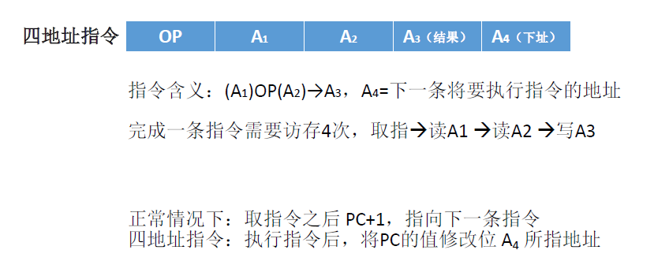
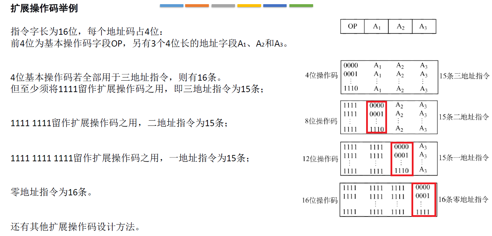
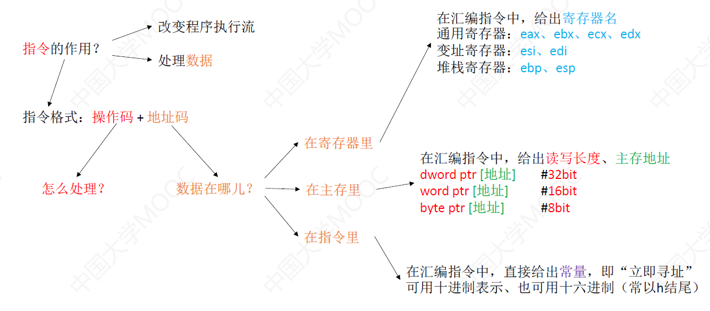

# 1、指令格式


## 1.0、指令的定义

指令：又称为机器指令，是指示计算机执行某种操作的命令，是计算机运行的最小功能单位。一台计算机的所有指令的集合构成该机的**指令系统**，也称为**指令集**。注：一台计算机只能执行自己指令系统中的指令，不能执行其他系统的指令。例如电脑上运行的有些软件不能直接在手机上运行。

一条指令就是机器语言的一个语句，它是一组有意义的二进制代码，一条指令通常要包括**操作码字段**和**地址码字段**两部分：


操作码指明了用户想要让CPU干什么，地址码指 明了这个操作要对谁进行。

- 像停机中断指令是不需要地址码的
- 加减乘除指令是需要两个地址码的

一条指令可能包含0个、1个、2个、3个、4个地址码，根据地址码数目不同，可以将指令分为零地址指令、一地址指令、二地址指令…


## 1.1、指令根据地址码数目分类

### 1.1.1、零地址指令

零地址指令：只需要操作码，不需要地址码。使用情况有以下两种：

1. 不需要操作数的操作，如空操作、停机、关中断等指令
2. 堆栈计算机，两个操作数隐含存放在栈顶和次栈顶，计算结果压回栈顶


### 1.1.2、一地址指令

一地址指令：需要一个地址码。使用情况有以下两种：


1. 要进行的操作只需要单操作数，如加1、减1、取反、求补码等操作
   - 指令含义：OP(A~1~)->A~1~，将A~1~地址的内容读取，执行OP操作，然后将结果放入原地址A~1~
   - 执行上述指令需要3次访存：1. 取一地址指令 2. 读A~1~地址的内容 3.将结果写回地址A~1~

2. 要进行的操作需要两个操作数，其中一个地址码显式的显示，另一个操作数隐含在某个寄存器(如隐含在ACC)
   - 指令含义：(ACC)OP(A~1~)->ACC，把ACC累加寄存器存放的数据和A~1~地址的数据执行OP操作，然后将结果放入ACC累加寄存器当中
   - 执行上述指令需要2次访存：1. 取一地址指令 2. 读A~1~地址的内容 
   - 因为ACC本来就在内存中


### 1.1.3、二地址指令


常用于需要两个操作数的算术运算、逻辑运算相关指令

指令含义：(A~1~)OP(A~2~)->A~1~ ，将A~1~地址和A~2~地址的内容读出，执行OP操作后，将结果放入A~1~地址。【结果放入目的操作数】

完成上述指令需要访存4次：1. 取二地址指令 2. 读A~1~地址 3. 读A~2~地址 4. 将结果写入A~1~地址


### 1.1.4、三地址指令


常用于需要两个操作数的算术运算、逻辑运算相关指令

指令含义：(A~1~)OP(A~2~)->A~3~ ，将A~1~地址和A~2~地址的内容读出，执行OP操作后，将结果放入A~3~地址。

完成上述指令需要访存4次：1. 取三地址指令 2. 读A~1~地址 3. 读A~2~地址 4. 将结果写入A~3~地址


### 1.1.5、四地址指令



完成四地址指令需要访存4次：1. 取四地址指令 2. 读A~1~地址 3. 读A~2~地址 4. 将结果写入A~3~地址

我们之前说过，CPU在每一次取一条指令之后都会让程序计数器PC+1，让它不断的指向下一条指令，而对于四地址指令来说，执行完这一条指令之后，我们会把程序计数器PC的值修改为A~4~所指向的地址，A~4~指明的就是下一条要执行指令的地址。


### 1.1.6、地址码的位数

地址码是指明了某一个主存单元的地址，如果地址码有n位，那么就可以指明2^n^个主存单元，所以**地址码的位数越长，对应地址码的寻址能力也会越强**。

若我们规定指令的总长度规定不变，则地址码数量越多(也就是每一个地址码的位数越短)，因此寻址能力就会越差。

> n位地址码的直接寻址范围 = 2^n^


### 1.1.7、总结


## 1.2、指令根据指令长度分类

我们之前学过机器字长和存储字长：

- 机器字长：CPU进行一次整数运算所能处理的二进制数据的位数（通常和ALU直接相关）
- 存储字长：一个存储单元中二进制代码位数(通常和MDR位数相同)

- 指令字长：一条指令的总长度(可能会变)

机器字长和CPU有关，一般是固定不变的，而存储字长和主存有关，一般也是固定不变的，但是指令字长是有可能发生改变的，

我们会见到==半字长指令、单字长指令、双字长指令==，这个意思指的是==指令长度是机器字长的多少倍==，指令字长会直接影响我们取指令所需要的时间，例如一台计算机的机器字长和存储字长都是16bit，这也就意味着我们每次从主存中读或者写的字节数是16bit，在这种条件下，若我们要取一条双字节指令(也就是16×2=32bit)需要进行两次访存。

有的计算机指令系统中的指令长度有差异，可分为如下两种：

- **定长指令字结构**：指令系统中所有指令的长度都相等
- **变长指令字结构**：指令系统中各种指令的长度不等


## 1.3、指令根据操作码长度分类

指令由操作码和若干个地址码组成，而操作码有可能是不同的，可分为：

1. 定长操作码：指令系统中所有指令的操作码长度都相同
   - n位操作码，可以支持 2^n^ 条指令
   - 控制器的译码电路设计简单，但是灵活性较低
2. 可变长操作码：指令系统中各指令的操作码长度可变
   - 控制器的译码电路设计更复杂，但是灵活性较高

操作码的位数可以反映这个系统当中最多可以支持多少条指令，对于定长操作码来说，如果它的操作码固定是n位，那么就意味着这个系统最多只能支持2^n^条指令。


## 1.4、指令根据操作类型分类

操作类型如下：

1. 数据传送【**数据传送类：进行主存与CPU之间的数据传送**】
   - LOAD  作用：把存储器中的数据放到寄存器中
   - STORE 作用：把寄存器中的数据放到存储器中

2. 算术逻辑操作【**运算类**】
   - 算术运算：加、减、乘、除、增1、减1、求补、浮点运算、十进制运算
   - 逻辑运算：与、或、非、异或、位操作、位测试、位清除、位求反
3. 移位操作【**运算类**】
   - 算术移位、逻辑移位、循环移位(带进位和不带进位)
4. 转移操作【**程序控制类：改变程序执行的顺序**】
   - 无条件转移指令 JMP 【涉及到汇编了】
   - 条件转移指令  JZ：结果为0；JO：结果溢出；JC：结果有进位
   - 函数调用CALL 和 函数返回RETURN
   - 陷阱(Trap)与陷阱指令
5. 输入输出操作【**输入输出类（I/O）：进行CPU和I/O设备之间的数据传送**】
   - CPU寄存器与IO端口之间的数据传送(端口即IO接口中的寄存器)


# 2、扩展操作码

指令由操作码和若干个地址码组成。

- **定长指令字结构**：指令系统中所有指令的长度都相等
- **变长指令字结构**：指令系统中各种指令的长度不等
- **定长操作码**：指令系统中所有指令的操作码长度都相同
- **可变长操作码**：指令系统中各指令的操作码长度可变

定长指令字结构+可变长操作码 -> 扩展操作码指令格式：指令的总长度固定不变，但是操作码的位数可以改变的扩展操作码指令格式，不同地址数的指令使用不同长度的操作码。

---

扩展操作码举例：



指令字长为16位，每个地址码占4位，也就是如果我们要设计三地址指令，就意味着三个地址码总共占12位，因此只会剩余4位用来表示三地址指令的操作码。4位操作码最多可以表示2^4^=16种状态，也就是三地址指令我们最多可以设置16条。但是若我们还想设置零地址、一地址、二地址指令，那么我们必须保留4位操作码全为1留作扩展操作码之用，即最多有15条三地址指令。4位操作码的范围是0000~1110，如上图。

二地址指令8位操作码是1111开头，同样后四位我们也会保留全为1留作扩展操作码之用，所以后四位的范围也是0000~1110。同样的道理，一地址指令最多也只能设置15条。由于零地址指令我们不需要再保留4位全为1留作扩展操作码之用，所以零地址指令可以设置16条。

---

在设计扩展操作码指令格式时，必须注意以下两点：

1. **不允许短码是长码的前缀**，即短操作码不能与长操作码的前面部分的代码相同
2. 各指令的操作码一定不能重复

通常情况下，对使用频率较高的指令，分配较短的操作码；对使用频率较低的指令，分配较长的操作码，从而尽可能减少指令译码和分析的时间。

---

我们基于上述条件，再次设计扩展操作码：设指令字长固定为16位，每个地址码占4位，试设计一套指令系统满足：有15条三地址指令、12条二地址指令、62条一地址指令、32条零地址指令


- 对于三地址指令，我们的地址码为12位，这样仅剩开头4位是操作码，我们要有15条三地址指令，那么操作码的范围是0000-1110(即十进制0-14)，共15种状态，会留下4个全1作为扩展操作码。
- 对于二地址指令，我们的地址码为8位，这样开头8位是操作码，前4位是1111，我们要有12条二地址指令，那么操作码的范围是0000-1011(即十进制0-11)，共12种状态，1011+1=1100，所以剩余的状态前两位都是全1作为扩展操作码。
- 对于一地址指令，我们的地址码为4位，这样开头12位是操作码，前6位是111111，我们要有62条二地址指令，那么操作码的范围是000000-111101(即十进制0-60)，共61种状态。111101+1=111110，所以剩余状态前5位全1作为扩展操作码。
- 对于零地址指令，我们的地址码为0位，这样开头16位是操作码，前11位是11111111111，我们要有32条二地址指令，那么操作码的范围是0000-1111(即十进制0-31)，共32种状态。

---

看一下计算问题，设地址长度为n，上一层留出m种状态，下一层可扩展出m×2^n^种状态。例如上题中地址的长度为4位，n=4

- 对于三地址指令，开头4位是操作码，4位可以表示2^4^=16种状态，但是我们会留出16-15=1种状态作为下一层的扩展。m=1，则下一层可以扩展出 1×2^4^=16种状态。
- 对于二地址指令，上一层给其扩展出16种状态，但是我们会留出16-12=4种状态作为下一层的扩展。m=4，则下一层可扩展出 4×2^4^=64种状态。
- 对于一地址指令，上一层给其扩展出64种状态，但是我们会留出64-62=2种状态作为下一层的扩展。m=2，则下一层可扩展出 2×2^4^=32种状态。
- 对于零地址指令，上一层给其扩展出32种状态，零地址不会扩展。


## 2.1、优缺点

操作码指出指令中该指令应该执行什么性质的操作和具有何种功能。操作码是识别指令、了解指令功能与区分操作数地址内容的组成和使用方法等的关键信息。例如，指出是算术加运算，还是减运算；是程序转移，还是返回操作。

- 定长操作码： 在指令字的最高位部分分配固定的若干位（定长）表示操作码。
  - 一般n位操作码字段的指令系统最大能够表示2^n^条指令。
  - 优点：定长操作码对于简化计算机硬件设计，提高指令译码和识别速度很有利
  - 缺点：指令数量增加时会占用更多固定位，留给表示操作数地址的位数受限。

- 扩展操作码(不定长操作码) ：全部指令的操作码字段的位数不固定，且分散地放在指令字的不同位置上。
  - 最常见的变长操作码方法是扩展操作码，使操作码的长度随地址码的减少而增加，不同地址数的指令可以具有不同长度的操作码，从而在满足需要的前提下，有效地缩短指令字长。
  - 优点：在指令字长有限的前提下仍保持比较丰富的指令种类
  - 缺点：增加了指令译码和分析的难度，使控制器的设计复杂化。


# 3、指令寻址

CPU可以通过**顺序寻址**和**跳跃寻址**的方式的方式来确定下一条指令在主存当中的存放位置。

## 3.1、顺序寻址


指令寻址并不是简单的让程序计数器PC+1，**不过程序计数器PC始终都是指向下一条欲执行指令的地址**，如上图，该系统采用**定长指令字结构**，指令字长=存储字长=16bit=2B(也就是每一行都是一个指令)，主存是按照字编址(每2B占一个地址，注意字长位2B，也就是说一个字占2B)，这样的话两条指令地址相差就是1。这是最简单的情况，这种情况CPU每取走一条指令之后，只需要让程序计数器PC+1即可指向下一条指令。

---


如上图，该系统采用**定长指令字结构**，指令字长=存储字长=16bit=2B，主存是按照字节编址(意味着每一条指令会占两个地址，第一条指令的前8个比特对应字节地址是0，后8个比特对应字节地址是1)，这样的话两条指令地址相差就是2。这种情况CPU每取走一条指令之后，只需要让程序计数器PC+2即可指向下一条指令。

---


如上图，该系统采用**变长指令字结构**，我们会给相邻的存储字涂上相同的颜色，具有相同颜色的存储字表示这几个存储字共同组成了一条指令，这种情况下不同的指令的指令字长是不一样的，就不再固定为2B两个字节。主存是按照**字节**编址，由于CPU无法确定当前指向的这条指令到底占几个存储字，这种情况CPU可以首先读入第一个字(操作码被包含在了第一个字里面)，CPU可以根据操作码判断这条指令是几地址指令，这样就可以确定这条指令总共占多少个字节，对于黄色指令来说，CPU可以确定总共占4个字节，也就是两个存储字，因此CPU在读入第一个存储字之后还会取出第二个存储字，这样就得到了完整的一条指令。

取指令结束之后，CPU会把 PC+n(n指的是上一条取出指令的总字节数)，这样就导致了PC指向4这个地址，也就是绿色部分的指令。


## 3.2、跳跃寻址

上面的指令寻址方式都是顺序寻址，也就是通过程序寄存器PC加1(这里的1是指1个指令字长，实际加的值会因指令长度、编址方式而不同)，自动形成下一条指令的地址。

跳跃寻址是通过转移类指令实现。执行转移类指令(jmp)导致PC值改变。


## 3.3、小结


# 4、数据寻址

指令寻址：CPU确定下一条欲执行的指令的指令地址，CPU要执行的下一条指令永远都是通过程序计数器PC给出。

数据寻址：确定这条指令的的**地址码指明的真实地址**。


如上最左图，当CPU执行到JMP指令的时候，会将PC的值改为7，这样接下来要执行的指令存放在主存地址为7的地方。对于这个例子，JMP指令的地址码所指向的就是真实的地址，因为这个程序就是从主存地址为0开始的，刚好JMP指令想要跳转到的下一条指令的主存地址就是7，所以将PC的值直接改为7并不会导致程序运行错误。

如上中间图，我们不能保证当前程序一定是从地址为0的地方开始存储，我们要执行的程序是存储在地址为100的地方开始，对于JMP指令来说，它的地址码的含义就不同了，并不是直接指向7，而是基于起始地址的偏移量是7，也就是100+7=107

如上右边图，JMP指令的地址码是3，若我们期待下一条指令仍然执行的是107地址的指令，那么这里的3需要如何解读呢？我们知道CPU每取出一条指令之后都会让PC的值+1，这也就意味着当CPU执行103JMP指令的时候，PC的值是104，所以地址码3所指的就是PC当前地址向后的偏移量，104+3=107

---


我们知道指令由操作码和若干个地址码组成，但是地址码的解读方式有很多种，那么我们如何区分一条指令的地址码应该用什么方式来解读呢？上图是10种地址码的解释方式，为了区分我们是用哪种方式解释地址码的，我们会在地址码的前面加上4位比特位(放在寻址特征)用来标识地址码应该采用什么样的寻址方式。

根据寻址地址中存放的比特位，我们可以知道该用什么方式来解读地址码，从而得到最终的真实地址，我们也称为有效地址，使用EA表示。而对于指令里面的形式地址，我们用A表示。


对于二地址指令，由于指令中会包含多个形式地址，那我们对各个形式地址的解读方式也可能会不一样，因此每一个形式地址的前面我们都会放寻址特征。


好了，下面要来看10种数据寻址的方式，也可以称为地址码的解读方式，我们假设指令字长=机器字长=存储字长，假设操作数是3

## 4.1、直接寻址


直接寻址：指令中的形式地址A就是操作数的真实地址EA，即EA=A。如上图LDA是一条取数指令，我们要取的操作数3就直接在形式地址A那里。所以我们去主存中读取数据，然后将数据放入ACC累加寄存器中。

- 直接寻址访存次数：取一地址指令访存1次，执行指令访存1次(根据形式地址A去主存读取)，共2次访问
- 优点：简单，指令执行阶段仅访问1次主存，不需专门计算操作数的地址。
- 缺点：形式地址A的位数决定了该指令操作数的寻址范围。操作数的地址不易修改(若主存中的A地址修改，那么操作数的地址也要修改)。


## 4.2、间接寻址


间接寻址：指令的地址字段给出的形式地址不是操作数的真正地址，而是操作数有效地址所在的存储单元的地址，也就是操作数地址的地址，即EA=(A)。

如上图，形式地址A指向了某一个主存单元，在这个主存单元存储了我们最终要取得的操作数的真正地址，因此我们在执行这条指令的时候就需要总共3次访存。

- 取一地址指令访存1次，执行指令访存1次(根据形式地址A去主存读取)，根据EA地址再进行1次访问，共3次访存

- EA=(A)，有效地址EA等于形式地址A所指向的主存单元的地址

- 上图左边是一次间接寻址，右边是两次间接寻址
- 优点：
  - 可扩大寻址范围(有效地址EA的位数大于形式地址A的位数)。
  - 便于编制程序(用间接寻址可以方便地完成子程序返回)。
- 缺点：
  - 指令在执行阶段要多次访存(一次间址需两次访存，多次寻址需根据存储字的最高位确定几次访存)。


## 4.3、寄存器寻址


寄存器寻址：指令给出的地址码并不是指向了主存单元，而是指向了某一个寄存器的编号，CPU内部会有很多通用寄存器，每个寄存器会有自己的编号，1001对应十进制的9，也就是我们的有效地址在编号为9的寄存器当中。

- 取一地址指令访存1次，执行指令访存0次，共访存1次

- 优点：指令在执行阶段不访问主存，只访问寄存器，指令字短且执行速度快，支持向量/矩阵运算。
- 缺点：寄存器价格昂贵，计算机中寄存器个数有限。


## 4.4、寄存器间接寻址


寄存器间接寻址：指令给出的地址码并不是指向了主存单元，而是指向了某一个寄存器的编号，这个寄存器里面存放的内容才是我们最终要找的操作数在主存中的地址，即EA=R(i)，有效地址是第i个寄存器中的内容 

- 取一地址指令访存1次，执行指令访存1次，共访存2次

- 特点：与一般间接寻址相比速度更快，但指令的执行阶段需要访问主存(因为操作数在主存中)。


## 4.5、隐含寻址


隐含寻址：不是明显地给出操作数的地址，而是在指令中隐含着操作数的地址。有的指令它显式的给出这个地址，只是指明了其中一个操作数的存放位置，另一个操作数会默认隐含在ACC累加寄存器当中。

- 优点：有利于缩短指令字长。
- 缺点：需增加存储操作数或隐含地址的硬件。


## 4.6、立即寻址

立即寻址：指令的形式地址A就是我们想要的操作数，形式地址A就是操作数本身，又称为立即数，一般采用补码形式。#表示立即寻址特征。


- 取一地址指令访存1次，执行指令访存0次，共访存1次
- 优点：指令执行阶段不访问主存，指令执行时间最短
- 缺点：A的位数限制了立即数的范围。如A的位数为n，且立即数采用补码时，可表示的数据范围为 2^n-1^ - 2^n-1^-1


## 4.7、小结


# 5、偏移寻址

偏移寻址包括：相对寻址、基址寻址、变址寻址。偏移寻址就是以某一个地址作为起始地址，然后偏移量为形式地址A


BR——base address register，EA——effective address


## 5.1、基址寻址

基址寻址：将CPU中**基址寄存器（BR）**的内容加上指令格式中的形式地址A，而形成操作数的**有效地址**，即==EA=(BR)+A==。


- 如上图a：基址寄存器会指向当前这个程序**起始**的一个存放地址，最终的**有效地址EA只需要用基址寄存器存放的地址加上形式地址A**，如上图，将BR和A送给ALU算数单元进行加法运算就可以得到结果EA，EA又指向了指令想要访问的操作数在主存的位置。这里的BR是一个专门的基址寄存器。【操作系统第三章的重定位寄存器就是基址寄存器，只是中文翻译不一样】

- 如上图b：有时会用通用寄存器来作为基址寄存器，代替基址寄存器的功能。如上图有n个通用寄存器，编号为0-n-1，指令特征指明采用基址寻址，还需要存储R0基址寄存器编号，指明基地址存放在哪个寄存器。所以有效地址EA=R0通用寄存器地址+形式地址A

注意：使用通用寄存器作为基址寄存器，需要增加一个字段来存储通用寄存器的编号，那么要用几个bit来存储呢？我们要根据通用寄存器的总数来确定，假如通用寄存器有8个，那么只需要3bit来存储寄存器的编号。

- 基址寄存器是**面向操作系统**的，其**内容由操作系统或管理程序确定**。在程序执行过程中，基址寄存器的内容不变（作为基地址），形式地址可变（作为偏移量），当采用通用寄存器作为基址寄存器时，可由**用户决定哪个寄存器作为基址寄存器，**但其**内容仍由操作系统确定**。

- 基址寻址优点：

  - 便于程序“浮动”，方便实现多道程序并发运行

  - 可扩大寻址范围（基址寄存器的位数大于形式地址A的位数）

  - 用户不必考虑自己的程序存于主存的哪一空间区域，故**有利于多道程序设计**，以及可用于**编制浮动程序（整个程序在内存里边的浮动）**

    


## 5.2、变址寻址

变址寻址：有效地址EA等于指令字中的形式地址A与变址寄存器IX的内容相加之和，即EA= (IX)+A，其中**IX可为变址寄存器（专用）**，也**可用通用寄存器作为变址寄存器**。


变址寻址和基址寻址基本一模一样，除了一个是IX变址寄存器，另一个是BR基址寄存器。

- 注：变址寄存器是**面向用户的**，在程序执行过程中，**变址寄存器的内容可由用户改变**(IX作为偏移量)，形式地址A不变（作为基地址）。而在基址寻址中，BR保持不变作为基地址，A作为偏移量
- 优点：在数组处理过程中，可设定A为数组的首地址，不断改变变址寄存器IX的内容，便可很容易形成数组中任一数据的地址，**特别适合编制循环程序**。


## 5.3、相对寻址

相对寻址：把程序计数器PC的内容加上指令格式中的形式地址A而形成操作数的有效地址，即EA=(PC)+A，其中A是相对于PC所指地址的**位移量**，可正可负，**补码表示**


如上图，我们从地址为1000的地方取出这条指令，这条指令采用相对寻址方式，我们之前说过，当取出当前指令后，需要让PC+一条指令字长，若当前指令字长为2B，则PC+2；若当前指令字长为4B，则PC+4。所以取出指令后PC的值可能是1002，也可能是1004。

- 优点：操作数的地址不是固定的，它随着PC值的变化而变化，并且与指令地址之间总是相差一个固定值，因此**便于程序浮动**（一段代码在程序内部的浮动）。相对寻址**广泛应用于转移指令**。

- 基址寻址的方便浮动指的是**整段程序在内存里的浮动**，相对寻址的浮动指的是**一段代码在程序内部的浮动**。


## 5.4、小结


> 注意：取出当前指令后，PC会指向下一条指令，相对寻址是相对于下一条指令的偏移


# 6、堆栈寻址

堆栈寻址：操作数存放在堆栈中，隐含使用堆栈指针(SP)作为操作数地址。

堆栈是存储器（或专用寄存器组）中一块特定的按"后进先出（LIFO）"原则管理的存储区，该存储区中被读/写单元的地址是用一个特定的寄存器给出的，该寄存器称为堆栈指针（SP）。


如上图，用四个寄存器来实现堆栈，最上面R0是栈顶，最下面R3是栈底，寄存器SP是堆栈指针，指向R0。由于只有4个寄存器，所以SP只需要2比特就可以表示4个寄存器的编号。

我们完成一次加法操作，加数和被加数在ACC和X当中，通过ALU算数单元，把结果输出到另一个寄存器里面。我们记SP所指向的存储器单元是M~SP~，首先弹出栈顶元素0001，这个元素会被放入ACC中，之后SP+1指向R1寄存器，之后把1001放入X当中，之后SP+1指向R2寄存器。将ACC里面的值和X里面的值相加，结果放入Y寄存器，并且压回栈中，在入栈时SP-1又指向R1寄存器。

上面是栈顶在小的地址方向，有些题是栈顶在地址更大的方向。


**寄存器堆栈又称为硬堆栈**，而从主存中划出一段区域来做堆栈是最合算且最常用的方法，这种堆栈称为**软堆栈**。

软堆栈无论弹出还是压入栈顶元素，都需要进行一次访存，而硬堆栈无论是弹出还是压入栈顶元素都不需要访存，所以硬堆栈速度快但是成本高，软堆栈速度相对较慢但是成本低。


## 6.1、小结


> 注意，上面的访存次数都是指令在执行期间访存，而取指令没有算进去，取指令无论如何都是1次访存。


# 7、CISC和RISC

## 7.1、CISC

CISC：Complex Instruction Set Computer，类比：有很多库函数的C语言

- 设计思路：一条指令完成一个复杂的基本功能

- 代表：x86架构，主要用于笔记本、台式机


## 7.2、RISC

RISC：Reduced Instruction Set Computer，类比：没有库函数的C语言

- 设计思路：一条指令完成一个基本动作，多条指令组合完成一个复杂的基本功能。
- 代表：ARM架构，主要用于手机、平板等

---

比如设计一套能实现整数、矩阵加/减/乘运算的指令集：

- CISC的思路：除了提供整数的加减乘指令除之外，还提供矩阵的加法指令、矩阵的减法指令、矩阵的乘法指令，一条指令可以由一个专门的电路完成，有的复杂指令用纯硬件实现很困难，采用“存储程序”的设计思想，由一个比较通用的电路配合存储部件完成一条指令
- RISC的思路：只提供整数的加减乘指令，一条指令一个电路，电路设计相对简单，功耗更低，更容易实现"并行"和"流水线"


## 7.3、对比


# 8、高级语言与机器代码

## 8.1、x86汇编语言指令基础


指令是由操作码和地址码组成，操作码说明了要对数据怎么处理，地址码说明了数据在什么地方，当数据在寄存器中的时候，我们只需要在指令中给出寄存器的名字就可以找到数据；当数据在主存里，我们只需要在指令中给出主存的地址就可以找到数据；当数据在指令里，我们直接在指令中给出要操作的数(也就是立即寻址)


### 8.1.1、以mov指令为例

$$
mov目的操作数d(destination),源操作数s(source) \\
mov指令功能:将源操作数s复制到目的操作数d所指的位置
$$

```bash
mov eax,ebx      # 将寄存器ebx的值复制到寄存器eax(寄存器->寄存器)
mov eax,5       # 将立即数5复制到寄存器eax(主存->寄存器)
mov eax,dword ptr [af996h]   # 将内存地址 af996h 所指的32bit值复制到寄存器eax(立即数->寄存器)
mov byte ptr [af996h],5     # 将立即数5复制内存地址 af996h 所指的一字节中
```

指明内存的读写长度：

- `dword ptr` : 双字，32bit
- `word ptr` ：单字，16bit
- `byte ptr` ：字节，8bit


### 8.1.2、x86架构的寄存器


在x86的架构当中，如果某个寄存器的名字是以E开头的，那么这个寄存器就是32bit，如上图，我们将8个寄存器分为了三组

- 第一组：EAX、EBX、ECX、EDX
  - X=未知，我们将这4个寄存器称为通用寄存器，什么都可以存
- 第二组：ESI、EDI
  - I=Index，我们将这两个寄存器称为变址寄存器，变址寄存器可用于线性表字符串的处理
- 第三组：EBP、ESP
  - 堆栈基指针：Base Pointer 
  - 堆栈顶指针：Stack Pointer
  - 堆栈寄存器用于实现函数调用

> 只需要知道上面这8个是寄存器即可

对于通用寄存器，我们的使用可以更灵活一些：比如我们只想要使用更低的16bit，我们可以将E去掉，只用AX、BX、CX、DX表示。我们还可以更灵活，只使用8bit如下图。下面的变址寄存器和堆栈寄存器只能固定使用32bit


---

```bash
mov eax,ebx      # 将寄存器ebx的值复制到寄存器eax(寄存器->寄存器)
```

直接指明两个寄存器的名字，对这两个寄存器里面的值进行操作，这就是寄存器寻址，在指令当中直接给出寄存器的名字去处理寄存器里的数据

```bash
mov eax,5       # 将立即数5复制到寄存器eax(主存->寄存器)
```

右边的操作数使用的是立即寻址，左边的操作数采用了寄存器寻址，指明了寄存器的名字

```bash
mov eax,dword ptr [af996h]   # 将内存地址 af996h 所指的32bit值复制到寄存器eax(立即数->寄存器)
```

右边的操作数是直接寻址，直接给出了主存的地址，左边的操作数采用了寄存器寻址，指明了寄存器的名字


```bash
mov eax,dword ptr [ebx]         # 把ebx所指内存的32bit复制到eax寄存器中
```

ebx寄存器里面存储了主存地址，而我们最终要处理的数据是存放在这个主存地址当中，所以右边的操作数是寄存器间接寻址。

```bash
mov dword ptr[ebx],eax    # 将eax的内容复制到ebx所指主存地址的32bit

mov eax,byte ptr [ebx]    # 将ebx所指的主存地址的8bit复制到eax

mov eax.[ebx]          # 若未指明主存读写长度，默认32bit

mov[af996h],eax         # 将eax的内容复制到af996h所指的地址(未指明长度默认32bit)

mov eax,dword ptr[ebx+8]   # 将ebx+8所指主存地址的32bit复制到eax寄存器中


mov eax,dword ptr[af996h-12h]   # 将af996h-12h所指主存地址的32bit复制到eax寄存器中
```




当数据在寄存器中的时候，我们只需要在指令中**给出寄存器的名字**就可以找到数据；当数据在主存里，我们只需要在指令中给出**主存的地址**就可以找到数据(主存地址的给出一定要有一个中括号，中括号的里面给出地址的值)，除了地址之外还需要指明此次读写的长度，在x86中一个字是16bit；当数据在指令里，我们直接在指令中给出**常量**(也就是立即寻址)


### 8.1.3、常用的x86汇编指令

注意：目的操作数d不可以是**常量**(因为最后要将结果存入d)，且两个操作数不允许同时来自于主存

| 功能    | 英文     | 汇编指令             | 注释                                                         |
| ------- | -------- | -------------------- | ------------------------------------------------------------ |
| 加      | add      | add d,s              | 计算d+s，结果存入d                                           |
| 减      | subtract | subtract d,s         | 计算d-s，结果存入d                                           |
| 乘      | multiply | mul d,s<br>imul d,s  | 无符号数d * s,乘积存入d<br>有符号数d * s,乘积存入d           |
| 除      | divide   | div s <br>idiv s<br> | 无符号数除法 edx:eax/s,商存入eax，余数存入edx<br/>有符号数除法 edx:eax/s,商存入eax，余数存入edx |
| 取负数  | negative | neg d                | 将d取负数，结果存入d                                         |
| 自增++  | increase | inc d                | 将d++，结果存入d                                             |
| 自减- - | decrease | dec d                | 将d- -，结果存入d                                            |

注意：

对于汇编指令除：s是除数，被除数会被提前放入edx和eax寄存器当中，采用了隐含寻址。而在进行除法运算之前，需要把被除数进行位扩展，比如 32b的被除数/32b的除数，需要将32b的被除数扩展为64b，所以需要两个通用寄存器，每一个以e开头的寄存器都是32b。


常用的逻辑运算指令：

| 功能 | 英文         | 汇编指令 | 注释                                   |
| ---- | ------------ | -------- | -------------------------------------- |
| 与   | and          | and d,s  | 将d、s逐位相与，结果放回d              |
| 或   | or           | or d,s   | 将d、s逐位相或，结果放回d              |
| 非   | not          | not d    | 将 d 逐位取反，结果放回d               |
| 亦或 | exclusive or | xor d,s  | 将d、s逐位亦或，结果放回d              |
| 左移 | shift left   | shl d,s  | 将d逻辑左移s位，结果放回d(通常s是常量) |
| 右移 | shift right  | shr d,s  | 将d逻辑右移s位，结果放回d(通常s是常量) |

- 用于实现分支结构、循环结构的指令：cmp、test、jmp、jxxx
- 函数调用的指令：push、pop、call、ret
- 数据转移的指令：mov


### 8.1.4、AT&T格式和Intel格式

我们上面的x86汇编格式都是Intel格式，这也是408考试中的格式，防止出题老师换，所以需要学一下AT&T格式


## 8.2、选择语句的机器级表示

x86处理器中，程序计数器PC通常被称为IP


### 8.2.1、jmp指令


如上图假设当前执行的指令是无条件转移jmp指令， PC计数器的值会直接跳转到128地址，所以这条指令的效果会让PC原先指向112地址，转而指向128地址，样CPU就会执行指令八

- 无条件转移指令

```bash
jmp<地址>         # PC无条件转移至<地址>

jmp 128          # <地址>可以用常数给出
jmp eax          # <地址>可以来自寄存器,例如eax寄存器里面值刚好是128，则PC跳转到eax所指向的地址，等同于 jmp 128
jmp [999]         # <地址>可以来自于主存，例如主存地址999里面的内容是128，则等同于 jmp 128
```

- `jmp NEXT <地址>可以用标号锚定`

```bash
jmp NEXT
...
NEXT:       # 用标号锚定位置,特征：有冒号，名字可以自己取
```


### 8.2.2、jxxx指令

```bash
cmp a,b  # 比较a和b两个数,a,b两个数可能来自寄存器/主存/常量


# 条件转移指令
je <地址>   # jump when equal,若a==b则跳转
jne <地址>  # jump when not equal, 若a!=b则跳转
jg <地址>   # jump when greater than,若a>b啧跳转
jge <地址>  # jump when greater than or equal to,若 a>=b 则跳转
jl <地址>   # jump when less than,若a<b则跳转
jle <地址>  # jump when less than or equal to,若a<=b则跳转
```

条件转移指令一般要和cmp指令一起使用

```bash
# 示例
cmp eax,ebx # 比较寄存器eax和ebx里的值
jg NEXT   # 若eax>ebx，则跳转到NEXT:
```


在写汇编语言代码时，一般会以**函数名作为标号**，标注该函数指令的起始地址。如上图：

```bash
cmp  dword ptr [ebp+8],1      # 比较主存地址ebp+8的数值和常量1
jle f1+35h     # 若a<=b，则PC跳转到f1+35h地址，这里的f1是函数名，因此指令的意思是要从f1函数的第一条指令所对应的地址(00401000)偏移35h，这就是跳转到地址(00401035)
```


## 8.3、循环语句的机器级表示

用条件转移指令实现循环：


用loop指令实现循环：


