# 1、计算机系统概述

1. 冯诺依曼计算机中CPU区分指令和数据的依据是？
   - 从时间的角度区分：**指令周期的不同阶段**
   - 从空间的角度区分：**指令处于不同的寄存器**(IR指令寄存器里面的就是指令，ACC累加器里面的就是数据)
2. 冯诺伊曼计算机的特点
   - 计算机由**五大部件**组成：运算器、存储器、控制器、I/O设备
   - 指令和数据以同等地位存储在存储器中，并**按地址**询问
   - **指令和数据**均以**二进制**代码表示
   - **指令由操作码和地址码组成**，操作码用来表示操作的性质，地址码用来表示操作数在存储器中的位置
   - 指令在存储器内**按顺序**存放，通常指定是顺序执行的(**顺序寻址**)，在特定条件下可根据运算结果或根据设定的条件改变执行顺序(**跳跃寻址**)
   - 早期的冯诺伊曼计算机以**运算器**为中心
   - **单处理机**，基本工作方式是**控制流驱动**方式，以**存储程序**为思想
3. 软件和硬件的功能是**等效**的，软件和硬件在**逻辑功能**上是**等价**的

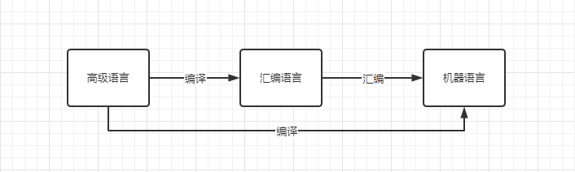

4. 解释程序：逐句翻译、生成中间代码、不生成目标代码(**边翻译边执行**)

   编译程序：生成中间代码、生成目标代码

   解释和编译统称为**翻译**

5. MAR存放欲访问的存储单元地址、PC存放下一条指令的地址、MDR存放从存储单元取来的数据、IR存放当前执行的指令
   - MAR存放存储单元地址，因此位数与**地址码长度**相同
   - MDR存放从存储单元取来的数据，因此位数与**存储字长**相同

6. CPU存取速度：寄存器 > Cache > 内存

   - 寄存器在CPU内部速度最快

   - Cache采用高速的SRAM制作，而内存采用DRAM制作

     

7.  CPU由**运算器**和**控制器**两个部件组成，而运算器和控制器中都含有**寄存器**

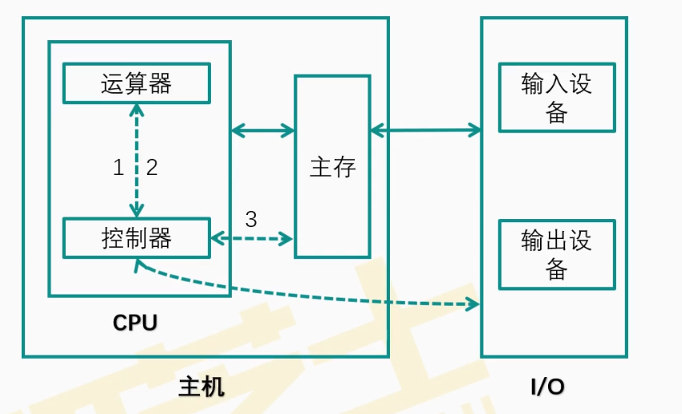

8. **相联存储器**既可以**按地址寻址**，又可以**按内容寻址**，为了与传统存储器区分，又称为**按内容寻址的存储器**

9. 在计算机多层次结构中，上下层是**可以分割**的，且上层是下层的**功能实现**，此外上层在下层的基础上实现了更加丰富的功能，**仅有下层而没有上层也是可以的**

10. **机器字长**：CPU进行一次整数运算所能处理的**二进制数据的位数**（通常和ALU直接相关），也叫**计算机的位数**，等于**寄存器的位数**，

    **存储字长**：一个存储单元中二进制代码位数(通常和MDR位数相同)

    **指令字长**：一条指令的总长度(可能会变)

    **数据字长**：数据总线一次能并行传送信息的位数

11. **用户可见的寄存器(也就是用户可以设置值)**：通用寄存器组、程序状态字寄存器PSW、程序计数器PC

    **用户不可见的寄存器**：MAR、MDR、IR、暂存寄存器

12. 如果计算机 **按字节编址**，则 **每个存储单元大小为1字节**，即1B，也就是8个二进制位。

    如果计算机 **按字编址**，则 **每个存储单元大小为一个字**，**字的长度取决于计算机字长是多少位**，若题目条件说字长是16位，则一个字就是16个二进制位。也有的计算机字长是32位、64位等等。

13. **小端方式**：最低有效地址存放在更低地址(**低存低**)
14. **边界对齐存储**：**总空间是最大类型所占空间的整数倍**。

# 2、数据的表示和运算

## 2.1、进位计数制

1. 任意进制 <=> 十进制：

   - **任意进制 => 十进制**：乘对应基数，小数点左边从基数的0次方开始
     $$
     二进制:101.1 \quad -> 1×2^2+0×2^1+1×2^0+1×2^{-1} = 5.5 \\
     八进制:5.4 \quad -> 5×8^0+4×8^{-1} = 5.5 \\
     十进制: 5.5 \quad -> 5×10^0+5×10^{-1} = 5.5 \\
     十六进制: 5.8 \quad -> 5×16^0+8×16^{-1} = 5.5
     $$
     
   - **十进制 => 任意进制**：
   
     - 整数部分**除基取余法**(余数从低到高)，小数部分**乘基取整法**(整由高到低)
     - 拼凑法：最快将十进制转二进制的方法🔥
   
2. 二进制 <=> 八进制
   - **二进制 => 八进制**：3位二进制一组，每组转换成对应的八进制符号。不足3位的补0即可
   - **八进制 => 二进制**：每位八进制对应3位二进制

3. 二进制 <=>十六进制
   - **二进制 =>十六进制**：4位二进制一组，每组转换成对应的十六进制符号。不足4位的补0即可
   - **十六进制 =>二进制**：每位十六进制对应4位二进制

## 2.3、定点数的表示

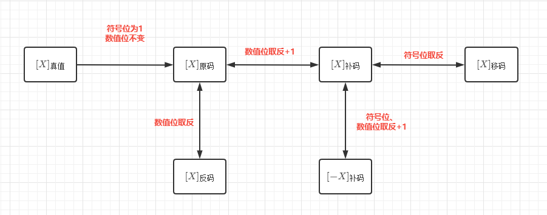

正数：

- 原码 = 反码 = 补码 
- 移码：在补码的基础上将符号位取反
- 由[x]~补~快速求[-x]~补~的方法：符号位、数值位全部取反，末位+1

负数：(如上图)

- 负数的反码：将原码的数值位全部取反
- 负数的补码：反码末位+1
- 移码：在补码的基础上将符号位取反
- 负数将反码转换成原码和原码转换成反码的 方式相同，都是把数值位(尾数)取反
  - **快速方法**🔥：==符号位不动，数值位倒数第一个1及其后不变，之前全部取反==

- 负数将补码转换成原码和原码转换成补码的方式相同，都是把数值位(尾数)取反，然后末位+1
- 由[x]~补~快速求[-x]~补~的方法：符号位、数值位全部取反，末位+1

### 2.3.1、表示范围

**原码和反码的真值0有两种表示，补码和移码的真值0只有一种表示**。若机器字长为n+1位，则：

|            | 整数表示范围           | 小数表示范围                     |
| ---------- | ---------------------- | -------------------------------- |
| 原码和反码 | -(2^n^-1) ≤ x ≤ 2^n^-1 | -(1-2^-n^) ≤ x ≤ 1-2^-n^         |
| 补码       | -2^n^ ≤ x ≤ 2^n^-1     | -1 ≤ x ≤ 1-2^-n^                 |
| 移码       | -2^n^ ≤ x ≤ 2^n^-1     | 移码全0真值最小，移码全1真值最大 |

补码正数比原码多表示一个 -2^n^，补码小数比原码多表示一个 -1

## 2.4、定点数的计算

### 2.4.1、算数移位

1. 原码的算数移位：符号位保持不变，仅对**数值位**进行移位。

   - 算数左移：低位补0，高位舍弃。

   - 算数右移：高位补0，低位舍弃。
   - 只对数值位移动，左移相当于×2，右移相当于÷2

2. 反码的算数移位：
   - 正数反码的算数移位和原码的算数移位相同
   - 负数反码的算数移位和原码相反：
     - 算数左移：低位补1，高位舍弃。
     - 算数右移：高位补1，低位舍弃。
   
3. 补码的算数移位：
   - 正数补码的算数移位和原码的算数移位相同
   
   - 负数补码中，==最右边的1及其右边同原码的算数移位，最右边的1的左边同反码的算数移位==：
     - 算数左移(同原码)：低位补0，高位舍弃
     - 算数右移(同反码)：高位补1，低位舍弃
     
   - > 不区分正数的另一种记忆规律：🔥
     >
     > - 补码的算数右移：符号位不动，数值位右移，符号位是啥就补啥
     > - 补码的算数左移：符号位不动，数值位左移，通通补0

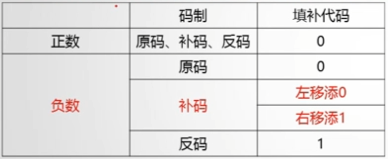

### 2.4.2、逻辑移位

可以把逻辑移位看作是对"无符号数"的算数移位

- 逻辑右移：高位补0，低位舍弃
- 逻辑左移：高位舍弃，低位补0 

### 2.4.3、循环移位

不带进位位的循环移位：无论左移还是右移，都会将移出的数补到缺位的位置

带进位位的循环移位：

- 带进位位的循环左移：数据位连同进位位一起左移，数据的最高位进入进位位CF，而进位位则补到空缺的位置

  

### 2.4.4、加减运算

1. 补码的加减运算：无论加法还是减法，最后都会转变成加法，由加法器实现运算，**符号位也参与运算**

### 2.4.5、溢出判断

仅当**两个符号相同的数相加**或**两个符号相异的数相减**才可能产生溢出，只需学习补码的溢出判断：

1. **采用一位符号位**

设A的符号为 A~S~，B的符号为B~S~，运算结果的符号为S~S~，则溢出逻辑表达式为：
$$
V = A_SB_S \overline {S_s}+ \overline {A_S}  \overline {B_S} S_S \\
若 V = 0,表示无溢出 \\
若 V = 1,表示有溢出 
$$
写在一起执行与运算(也就是**且**)，加号表示**或**运算，上方画横线表示**非**运算。

2. **方法二：采用一位符号位，根据数据位进位情况判断溢出**
   - 符号位的进位C~S~：符号位向更高位产生的进位数
   - 最高数值位的进位C~1~：尾数最高位向符号位产生的进位数
   - V=C~S~⊕C~1~ 。若 V=0，表示无溢出，若V=1，表示有溢出(符号位的进位和最高数值位的进位相同则无溢出)
   - 异或逻辑：==不同为1，相同为0==

3. **方法三：采用双符号位：正数符号为00，负数符号为11**🔥
   - 运算结果的两个符号位S~s1~S~S2~相同，表示未溢出，两个符号位不同，表示溢出，此时最高位符号位代表真正的符号
   - S~s1~⊕S~S2~ = 00，表示运算结果为正数，无溢出
   - S~s1~⊕S~S2~ = 01，表示运算结果为正溢出
   - S~s1~⊕S~S2~ = 10，表示运算结果为负溢出
   - S~s1~⊕S~S2~ = 11，表示运算结果为负数，无溢出

### 2.4.6、符号扩展🔥

- 定点整数的符号扩展：在原符号位和数值位**中间**添加新位，正数都添0，负数原码添0，反码、补码添1

- 定点小数的符号扩展：在原符号位和数值位**后面**添加新位，正数都添0，负数原码、补码添0，反码添1

> 找到最右边的1，补码这个1的左边的数值部分和反码一致，1的右边数值部分和原码保持一致

### 2.4.7、乘法运算

1. **原码一位乘法**：符号位单独处理——符号位 = x~S~⊕y~S~，数值位==取绝对值==进行乘法计算

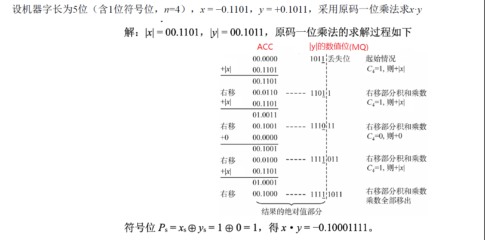

1. 写出[|x|]~原~ 、[|y|]~原~ 
   - 直接在x、y的原码数值位小数点前面加两个0，就是[|x|]~原~ 、[|y|]~原~ 
2. 按如上图那样写，其中第二列只需写 [|y|]~原~  的数值位即可，然后在末尾划条竖线，首先看竖线前的数字(运算位)
   - 若运算位=1，则(ACC)+[|x|]~原~
   - 若运算位=0，则(ACC)+0
3. 每轮加法之后，ACC、MQ的内容统一**逻辑右移(无符号数的算数右移)**
4. |y|~原~的数值部分占n位，则(加法、移位)看成一个操作执行n次
5. 最终将竖线前的所有数抄下来，即为结果的绝对值，**替换**上符号位**正负号**(正正得正，负负得正，正负得负)，得到xy=-0.10001111，这是真值，可以将其转换为原码 [xy]~原~ = 1.10001111
   - 真值->原码：只变符号位，数值位不变

---

2. 补码的一位乘法(Booth算法)

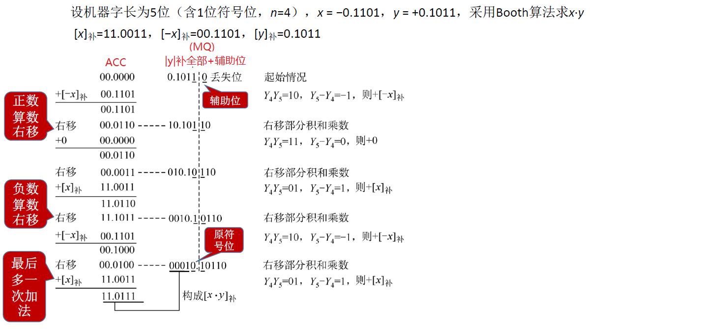

1. 写出[|x|]~补~ 、[|-x|]~补~ 、[|y|]~补~ 
2. 按如上图那样写，其中第二列需写 [|y|]~补~全部+辅助位 ，然后在辅助位前面划条竖线，用辅助位-运算位(竖线后减竖线前)
   - 竖线后 - 竖线前 = 1，(ACC)+[|x|]~补~
   - 竖线后 - 竖线前 = 0，(ACC)+0
   - 竖线后 - 竖线前 = -1，(ACC)+[|-x|]~补~

3. 每轮加法之后，ACC、MQ的内容统一**算数右移(补码的算数右移)**
4. |y|~补~的数值部分占n位，则(加法、移位)看成一个操作执行n次，但是补码乘法运算最后要多加一轮加法(也是看竖线后-竖线前的数字来决定加什么)
5. **将ACC的全部+MQ的前n个位拼接**，得到的即为[xy]~补~ = 11.01110001，前面的11即为符号位负，则xy=-0.01110001(真值)

---

3. 原码乘法和补码乘法的对比

|                | 原码一位乘法                         | 补码一位乘法                       |
| -------------- | ------------------------------------ | ---------------------------------- |
| 加法、移位次数 | n轮加法、n轮移位                     | n+1轮加法、n轮移位                 |
| 移位           | 逻辑右移                             | 算数右移                           |
| 符号位是否参与 | 符号位不参与运算                     | 符号位参与运算                     |
| 加什么         | 根据MQ的最低位(即运算位)来确定加什么 | 根据MQ的辅助位、最低位来确定加什么 |

### 2.4.8、除法运算

1. **原码除法：恢复余数法**：符号位单独处理——符号位 = x~S~⊕y~S~，数值位==取绝对值==进行除法计算

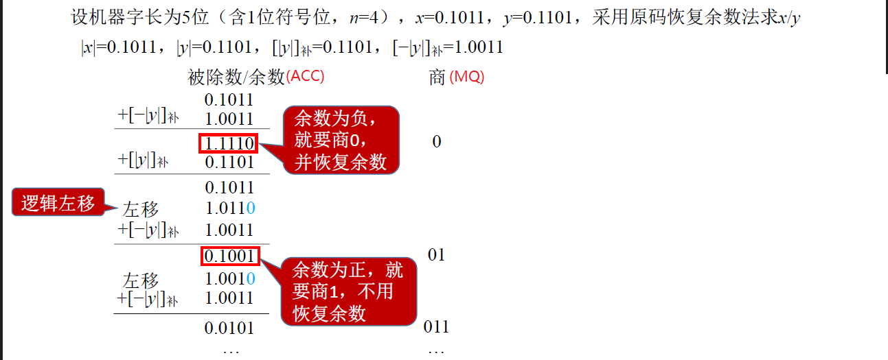

1. 写出[|x|]~原~ 、[|y|]~原~、[|y|]~补~ 、[-|y|]~补~
2. 按如上图那样写，[|x|]~原~+[-|y|]~补~ ，得到新余数
   - 若符号位为1，则商0，并且 新余数+[|y|]~补~ 恢复原余数，并将余数逻辑左移
   - 若符号位为0，则商1，并将余数逻辑左移
3. 数值位有n位，则逻辑左移n次，但是最后需要多商一次，所以商n+1次

---

2. **原码除法：加减交替法(不恢复余数法)**

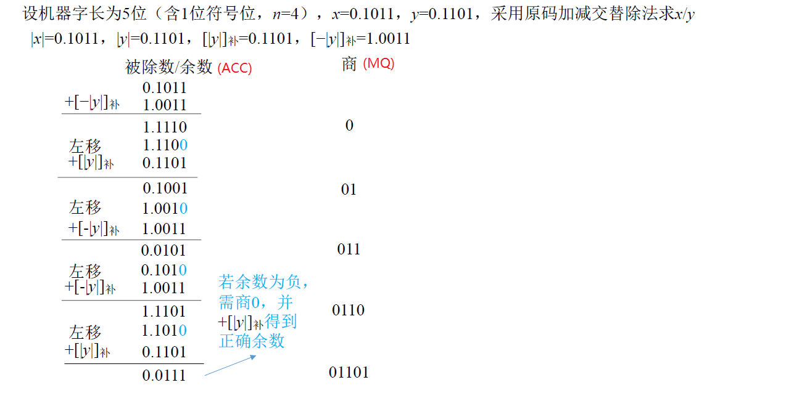

1. 写出[|x|]~原~ 、[|y|]~原~、[|y|]~补~ 、[-|y|]~补~
2. 按如上图那样写，[|x|]~原~+[-|y|]~补~ ，得到新余数
   - 若符号位=1，即若新余数为负，直接商0，并将 (ACC和MQ**[即新余数和商]**逻辑左移)+[|y|]~补~ = 余数
   - 若符号位=0，即若新余数为正，直接商1，并将 (ACC和MQ**[即新余数和商]**逻辑左移)+[|-y|]~补~ = 余数
3. 如果最后一步得到的余数是负值，则需商0并且需要再进行一次加法得到正确的余数。所以加减交替法中加减的次数可能是n+1次，也可能是n+2次，但逻辑左移只需要n次

---

总结：

- 在原码的加减交替法中，若余数为负，则直接商0，让余数左移一位再加上==除数的绝对值的补码==，得到下一个余数
- 若余数为正，则商1，让余数左移一位再减去==除数的绝对值的补码==，得到下一个余数

恢复余数法和加减交替法：

- 恢复余数法：当余数为负时商0并加上==除数的绝对值的补码==，再左移，再加上==除数绝对值的负值的补码==
- 加减交替法：当余数为负时商0并左移，再加上==除数的绝对值的补码==

---

3. 补码的除法运算：符号位参与运算，被除数/余数、除数采用**双符号位**

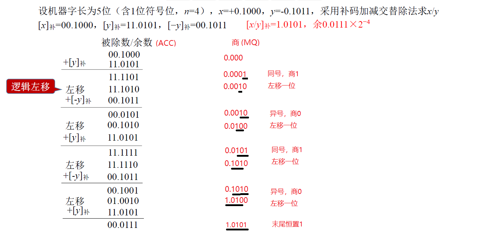

1. 写出[x]~补~ 、[y]~补~ 、[-y]~补~  **注意写的并不是绝对值的补码**
2. 按如上图那样写，根据 x 和 y 是同号还是异号来判断：
   - 若x 和 y 同号，则 [x]~补~ + [-y]~补~ = 新余数
   - 若x 和 y 异号，则 [x]~补~ + [y]~补~  = 新余数

3. 根据第二步得到的新余数来判断商
   - 若新余数和 y 同号，则商1，并 (ACC和MQ**[即新余数和商]**逻辑左移) + [-y]~补~ = 新余数
   - 若新余数和 y 异号，则商0，并 (ACC和MQ**[即新余数和商]**逻辑左移) + [y]~补~  = 新余数
   - 重复n次
4. 最后一步得到的新余数和y不管同号还是异号，我们都**恒让商的末位置为1**
5. 则[x/y]~补~ = 商 = 1.0101

---

除法运算总结：

| 除法类型       | 符号位是否参与运算 | 加减次数   | 移位        | 商、加减原则           | 说明                       |
| -------------- | ------------------ | ---------- | ----------- | ---------------------- | -------------------------- |
| 原码加减交替法 | 否                 | n+1或者n+2 | 逻辑左移n次 | 根据余数的正负         | 若最终余数为负，需恢复余数 |
| 补码加减交替法 | 是                 | n+1        | 逻辑左移n次 | 根据余数和除数是否同号 | 商末尾恒置1                |

## 2.5、浮点数的表示

浮点数由**阶码**和**尾数**两部分构成：+3.026×10^11^

`+11+3.026` 前三位表示10的次方，后面5位表示尾数。

- `+11`我们称为阶码，阶码由阶符和数值部分组成，阶码为正的话表示我们要将小数点后移，如果阶符为负表示我们要将小数点前移，阶码的数值部分表示小数点移动多少位
- `+3.026`表示尾数，尾数的正负号表示数值的正负性，后面的数字称为尾数的数值部分，尾数越短，科学计数法表示的数值精度就越低

浮点数真值的确定：
$$
N = r^E ×M  \quad 阶码的真值是E,尾数的真值是M,r表示几进制表示的阶码,二进制表示的阶码r=2
$$

### 2.5.1、规格化

规范：**小数点必须在第一位有效值的后面，尾数的最高位是有效值**

- 左归：尾数算数左移一位，阶码减1

- 右归：尾数算数右移一位，阶码加1

- **用原码表示尾数最高数值位是1即可**
- **用补码表示尾数的符号位和最高数值位(即符号位的后一位)一定相反**

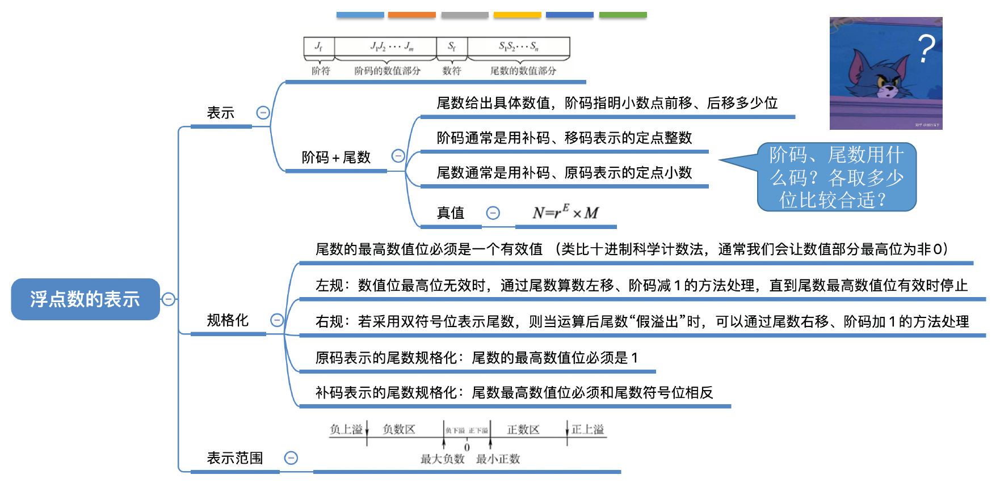

### 2.5.2、IEEE754浮点数标准

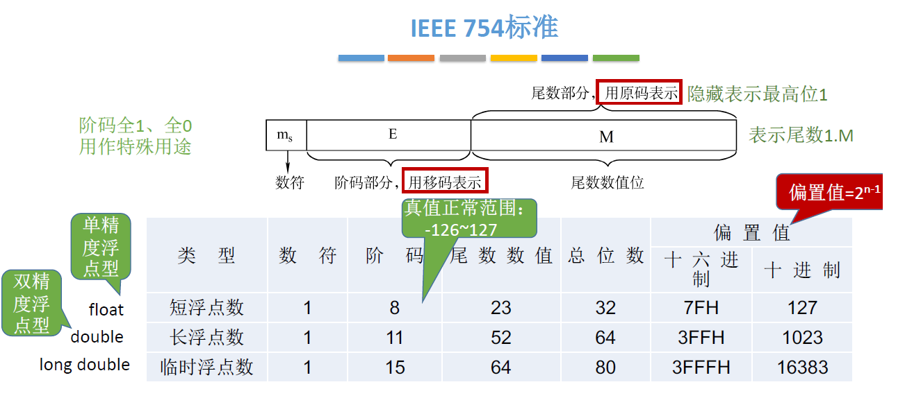

**IEEE754标准中阶码用移码表示，尾数用原码表示。**

# 3、存储系统

- MDR位数 = 存储字长(数据的宽度) = 数据线的宽度， MAR位数 = 存储字数，总容量 = **存储字长 × 存储字数**

- 存储周期 = 存取时间+恢复时间
- 数据传输率(主存宽带) = 存储字长(数据的宽度)/存储周期

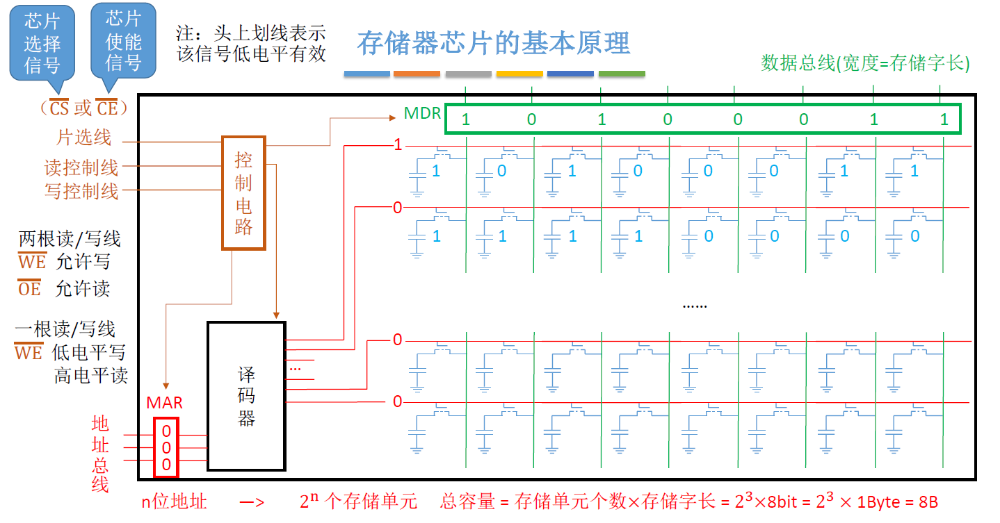

- 一个个存储元构成存储单元(存储字)，一个个存储单元构成存储体(存储矩阵) ，每一个存储元可以存储一位二进制0或1
  - **一行**存储元 = 一个存储单元 = 一个存储字
  - 多个存储单元 = 一个存储体(存储矩阵) 

- 字选线(译码器连接的**地址线**)的条数 = 存储单元个数 = 2^MAR地址位数^  ，数据线的条数 = MDR的位数，片选信1根，读写控制线1根或两根，**地址线+数据线+片选线1+读写控制线1/2 = 金属引脚数**
  - `8×8位的存储芯片`：第一个8表示存储单元的数量，第二个8表示存储字长
  - 2^n^个存储单元对应n条**地址线**，MDR的位数(存储字长)对应**数据线**的根数

## 3.0、ROM和RAM

随机存取存储器RAM：

- 只要是RAM，都是**易失性存储器**(断电后信息消失)

只读存取存储器ROM：

- 只要是ROM，都是**非易失性存储器**(断电后信息不消失)，但ROM若长期不通电，则信息也会丢失
- 光盘CDROM称为只读光盘，只能读不能写

> 🔥RAM和ROM都可以**随机存取**：存取时间与存储单元的物理位置无关

- 顺序存取存储器：磁带，顺序存储存储器的内容只能按某种**顺序存取**，存取时间的长短与信息在存储体上的物理位置有关，存取速度慢
- 直接存取存储器：**磁盘、机械硬盘**，==先随机存取，再顺序存取==，**既有随机存取特性，也有顺序存取特性**。先直接选取信息所在区域，然后按顺序方式存取。
- 读写速度：随机存取存储器 > 直接存取存储器 > 顺序存取存储器
- 上述三种存储器都是**指定数据的存储地址**，然后直接去那个地址当中进行读写。而下面的相联存储器是指明**数据内容**，根据数据内容来查找位置。==前者是根据地址访问，后者是根据内容访问==。
  - 相联存储器：按内容指定方式和地址指定方式相结合进行寻址的存储器，一般用来制作**快表TLB、相联Cache(全相联映射中用)**

---

只读存储器ROM的分类：

- 掩膜式只读存储器**MROM**：存储内容由半导体制造厂按用户提出的要求在芯片的生产过程中直接写入，无法修改，灵活性差
- 一次可编程只读存储器**PROM**：存储内容一次性写入，无法修改，灵活性差
- 可擦除可编程只读存储器**EPROM**：**既可读又可写**，读写次数有限
- **闪存**Flash存储器：U盘、固态硬盘，**可读可写**，但写速度比读速度慢，因为写入前要先擦除
- 固态硬盘SSD：**可读可写**，但写速度比读速度慢

## 3.1、SRAM和DRAM

==动态SRAM用于主存，静态DRAM用于Cache==

- DRAM芯片：使用**栅极电容**存储信息
- SRAM芯片：使用**双稳态触发器**存储信息
- 核心区别：存储元不一样

| 类型特点             | SRAM(静态RAM)                  | DRAM(动态RAM)                  |
| -------------------- | ------------------------------ | ------------------------------ |
| 存储信息             | 触发器                         | 电容                           |
| 破坏性读出           | **非破坏性读出**               | **破坏性读出**                 |
| 读出后需要重写(再生) | 读出后**不需要重写**           | 读出后**需要重写**             |
| 运行速度             | 快                             | 慢                             |
| 集成度               | 低                             | 高                             |
| 发热量               | 大                             | 小                             |
| 存储成本             | 高                             | 低                             |
| 易失/非易失存储器    | **易失**存储器(断电后信息消失) | **易失**存储器(断电后信息消失) |
| 刷新(给电容充电)     | **不需要**刷新                 | **需要**刷新                   |
| 送行列地址           | **同时**送行列地址             | **分两次**送行列地址           |
| 用途                 | **常用作高速缓存Cache**        | **常用作主存**                 |

- 刷新也就是给电容充电，刷新由CPU独立完成，不需要CPU控制，**一次完整的刷新过程需要占用一个存储周期**，==DRAM刷新是各个芯片同时刷新，刷新以行为单位进行==，`在访存期间不允许刷新`

---

1. 集中刷新：在一个刷新周期内，**利用一段固定的时间依次对存储器的所有行进行逐一再生，在此期间停止对存储器的读写操作**，称为**死时间**，又称**访存死区**
   - 优点：读写操作时不受刷新工作的影响
   - 缺点：存在死区，在死区期间不能访问存储器
2. 分散刷新：存储器的系统工作周期分为两部分：**前半部分用于正常读，写操作，后半部分用于刷新**
   - 优点：没有死区
   - 缺点：增加了系统的存取周期，降低了整机的速度
3. 异步刷新：将**刷新周期除以行数**得到两次刷新操作之间的时间间隔t，利用逻辑电路每隔时间T产生一次刷新请求
   - 优点：缩短死时间，减少了刷新次数，提高了整机的工作效率

DRAM刷新注意的问题：

- 刷新对CPU是透明的，即刷新不依赖于外部的访问
- DRAM刷新单位是行
- 刷新时整个存储器中的所有芯片同时被刷新

---

假设DRAM内部有128行×128列的存储单元，并且每个读写周期是0.5us，那么电容可以坚持的最长的时间是 2ms/0.5us=4000个读写周期，**读写周期**也称为**存取周期**

1. 思路一：每次读写完都刷新一行【**分散刷新**】
   - 我们有128行，每刷新一行都需要0.5us，若每次读写完都刷新一行，则系统的存取周期就会变成1us，前0.5us时间用于正常读写，后0.5us时间用于刷新某行。也就是2ms的时间内总共会有2000次刷新操作。这2000次刷新操作足够在2ms内给128行的存储单元每一行都刷新很多次。

2. 思路二：2ms内集中安排时间全部刷新【**集中刷新**】
   - 我们可以在2ms快到的时候给全部的128行存储单元进行刷新，2ms可以分为4000个读写周期，如果采用这种策略，我们会采用前面的3872个周期进行正常的读写，最后会留下128个读写周期来刷新这128行。
   - 此时系统的存取周期还是0.5us，因为连续的读或者写中间只需要间隔0.5us即可
   - 最后一段时间是专门用于刷新的，这短时间CPU无法对存储器进行读写操作，所以集中刷新的时间也称为 **死区(死时间)**
3. 思路三：2ms内每行刷新1次即可【**异步刷新**】
   - 2ms内需要产生128次刷新请求，所以每隔 2ms/128 = 15.6us 一次，则每隔15.6us我们进行一次刷新刷新一行，每15.6us内有0.5us的 **(死区)死时间**
   - 在实际过程中，我们可以利用CPU不需要访问存储器的时间进行刷新，比如CPU取得一条指令，在对这条指令译码的阶段内刷新

---

- 分两次送行列地址会导致地址线、地址线引脚减半

- 若某个存储单元所存储的信息被读出时原存储信息被破坏，则称为**破坏性读出**，若读出时被读单元原存储信息不被破坏，则称为**非破坏性突出**
- 具有破坏性读出性能的存储器，每次读出操作后，必须紧接一个再生的操作，以便恢复被破坏的信息

> 需要刷新的只有DRAM，其他的都不需要(ROM等等)🔥

- DRAM在某些题目中也叫做动态半导体存储器。

## 3.2、存储器的性能指标

1. 存储器的数据寄存器MDR位数反映了存储器**存储字长**是多少，MAR位数反映了存储器**存储字数**为多少，==存储字长×存储字数 = 存储容量==。
2. 单位成本：每位价格 = 总成本 / 总容量
3. **存储速度(数据传输率) = 数据的宽度 / 存储周期**
   - **存取时间**：进行一次读操作或一次写操作的时间都叫存取时间
   - **存取周期**：红曲周期又称读写周期或访问周期，它是指存储器进行一次完整的读/写操作所需的全部时间。指连续两次读操作或者写操作之间所需的**最小时间间隔**
     - 存取周期 = 存取时间 + 恢复时间
   - 主存带宽(数据传输率)：表示每秒从主存进出信息的最大数量
   - **存取时间不等于存储周期，通常存储周期大于存取时间，这是因为对任何一种存储器在读写操作之后，需要有一段恢复时间**

> 存取时间 == 总线传输周期 (第六章做题要用到)

## 3.3、位扩展和字扩展

- **位扩展可以使存储器的字长变得更长，从而更好发挥数据总线的数据传输能力。**
- **字扩展可以增加存储器的存储字数，可以更好利用CPU的寻址能力。**

- 我们把8片8K×1位的存储芯片通过**位扩展扩展**成1个8K×8位的存储器，总容量为8KB

**字扩展**有两种方法：

| 线选法                     | 译码片选法                    |
| -------------------------- | ----------------------------- |
| n条地址线，产生n条片选信号 | n条地址线，产生2^n^条片选信号 |
| 电路简单                   | 电路复杂                      |
| 地址空间不连续             | 地址空间可连续                |

- **线选法**：将n条多余的地址线将它们作为n个片选信号，电路简单，**地址空间不连续**

- **译码器片选法**：将n条多余的地址线将它们作为2^n^个片选信号，电路复杂，**地址空间连续**

## 3.4、译码器

`2-4译码器`，输入2个地址信号，会输出4个片选信号

`3-8译码器`，输入3个地址信号，会输出8个片选信号

## 3.5、提升主存速度

- **单体多字系统**的特点是存储器中只有一个存储体，==每个存储单元存储m个字，总线宽度也为m个字，一次并行读出m个字==，**地址必须顺序排列**并处于同一存储单元
  - 缺点：指令和数据在主存内**必须是连续存放**的，一旦遇到转移指令或操作数不能连续存放，这种方法的效果就不明显

- **高位交叉编址**：高位地址表示体号，低位地址为体内地址。访问一个连续主存块时总是先在一个模块内访问，等到该模块访问完才转到下一个模块访问，CPU总是按**顺序访问**存储模块，==各模块不能并行访问，因而不能提高存储器的吞吐率==。
  - 注意：模块内的地址是**连续**的，存取方式仍是**串行存取**，因此这种存储器仍是**顺序存储器**

- **低位交叉编址**🔥：低位地址为体号，高位地址为体内地址。采用这种编址方式的存储器称为**交叉存储器**，采用低位交叉编址后，可在**不改变每个模块存取周期的前提下，采用流水线的方式并行存取，提高存储器的带宽**

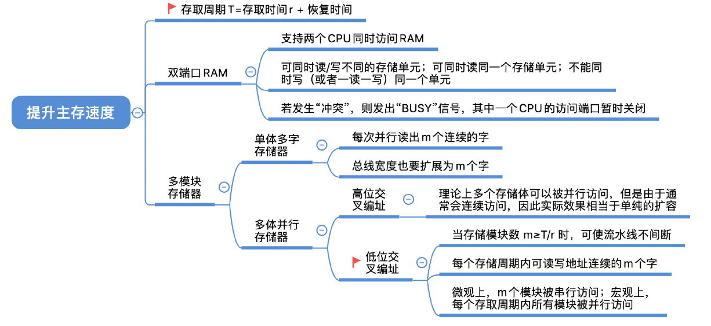

> 存取周期为T，存取时间(总线传输周期)为r。为了使得流水线不间断，应保证存储体数 m ≥ T/r 。

高位交叉编址：**连续取n个存储字，耗时nT**

低位交叉编址：**连续取n个存储字，耗时T+(n-1)r**

多体并行存储器：

- 每个模块(存储体)都有相同的容量和存取速度
- 各模块(存储体)都有独立的读写控制电路、地址寄存器和数据寄存器。它们既能并行工作，又能交叉工作

单体多字存储器适合用来读取**指令和数据在主存内是连续存放的**。

## 3.6、磁盘存储器

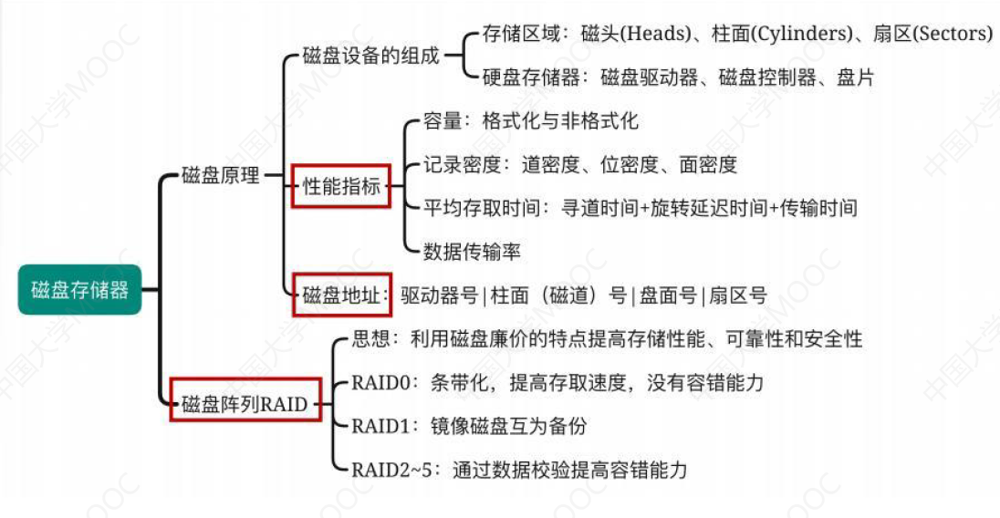

> 哪个硬盘的哪个盘面的哪个磁道的哪个扇区

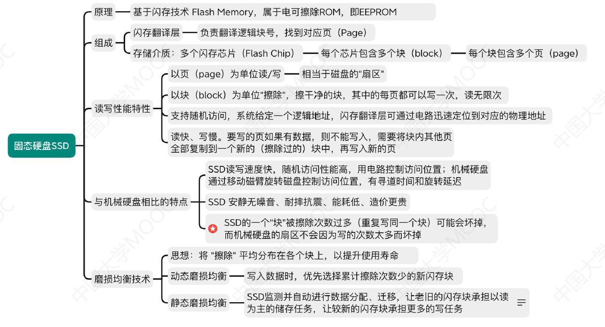

## 3.7、Cache

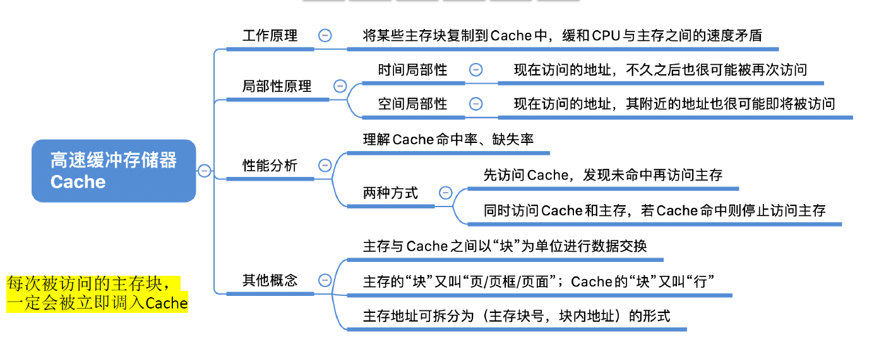

**当CPU访问了主存的某一个存储块之后，一定会把这个主存块调入cache**(复制一份)。

只要知道访问Cache所需要的时间和访问主存所需要的时间以及Cache的命中率，我们就可以算出 **Cache-主存** 系统的**平均访问时间**：

1. 先访问Cache，若Cache未命中再访问内存

$$
t = Ht_c+(1-H)(t_c+t_m) \\
平均访问时间 = Cache命中率×访问一次Cache时间+未命中率×(访问一次主存时间+访问一次Cache时间) \\
t_c < t <t_m
$$

上述公式的含义是CPU是先去Cache里面找，无论找得到找不到都需要花t~c~的时间，若没有命中，则CPU会去主存里面找数据，共花费t~c~+t~m~的时间，这种情况发生的概率为1-H。

2. **同时访问Cache和内存若Cache命中则立即停止访问内存**

当CPU同时去Cache和主存里面找数据，当经过t~c~时间，在Cache里面命中，则立即停止在内存中的查找，所以在命中的情况下CPU的访问时间同样只需要t~c~的时间，这种情况发生的概率为H。若在Cache里面没有命中，啧经过t~m~CPU就可以在内存当中找到数据，而这种情况发生的概率为1-H。
$$
t=Ht_c+(1-H)t_m 
$$

---

1. Cache的作用是**提速**，虚拟存储器的作用是**扩容**
2. 分页虚拟存储器的页面大小和**程序的大小**无关，是由操作系统确定的，且将程序从**页面的起始位置**开始放置。
3. 快表TLB**不存储于主存**中，快表由于采用**相联存储器**，因此查找速度快，快表是慢表的副本。
4. 虚拟存储器的实现需要建立在 **离散分配** 的内存管理方式的基础上。虚拟存储器的容量不受内存、外存容量限制，而是由CPU的寻址范围决定的
5. 虚拟存储器可以使得逻辑地址变大，但是物理地址并没有变

## 3.8、Cache主存映射方式

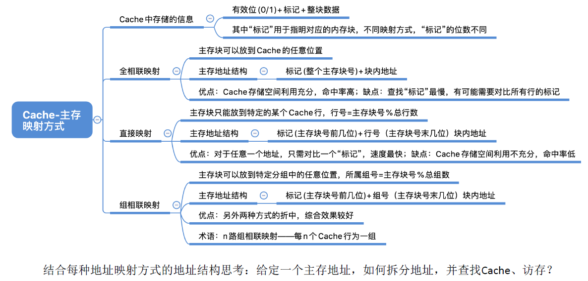

## 3.9、Cache替换方式

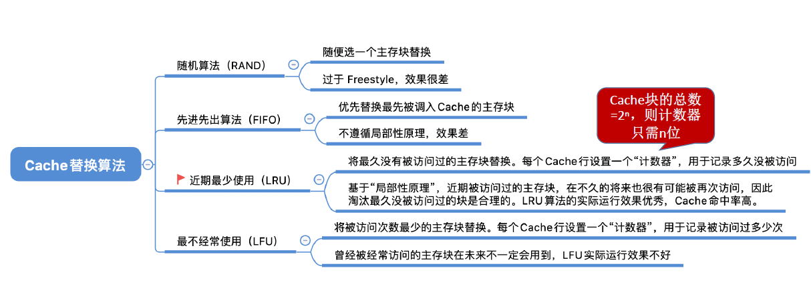

**先进先出算法**和**近期最少使用**算法都有可能发生抖动现象：频繁的换入换出现象（刚被替换的块很快又被调入）

## 3.10、Cache写策略

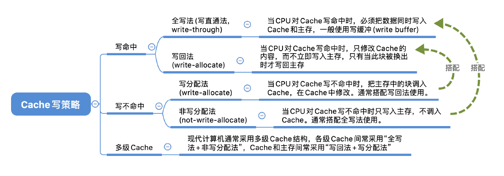

# 4、指令系统

我们之前学过机器字长和存储字长：

- 机器字长：CPU进行一次整数运算所能处理的二进制数据的位数（通常和ALU直接相关） ==与寄存器位数有关==
- 存储字长：一个存储单元中二进制代码位数(通常和MDR位数相同) ==一个存储单元的位数==

- 指令字长：一条指令的总长度(可能会变)

机器字长和CPU有关，一般是固定不变的，而存储字长和主存有关，一般也是固定不变的，但是指令字长是有可能发生改变的，

## 4.0、指令格式

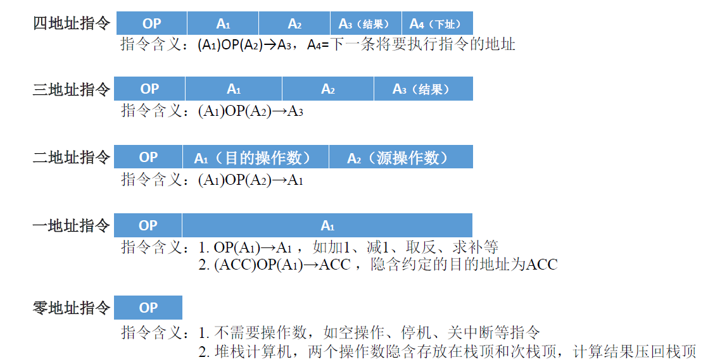

**零地址指令**：只需要操作码，不需要地址码。使用情况有以下两种：

1. 不需要操作数的操作，如空操作、停机、关中断等指令
2. 堆栈计算机，两个操作数隐含存放在栈顶和次栈顶，计算结果压回栈顶

**一地址指令**：需要一个地址码。使用情况有以下两种：

1. 要进行的操作只需要单操作数，如加1、减1、取反、求补码等操作
   - 指令含义：OP(A~1~)->A~1~，将A~1~地址的内容读取，执行OP操作，然后将结果放入原地址A~1~
   - 执行上述指令需要3次访存：1. 取一地址指令 2. 读A~1~地址的内容 3.将结果写回地址A~1~

2. 要进行的操作需要两个操作数，其中一个地址码显式的显示，另一个操作数隐含在某个寄存器(如隐含在ACC)
   - 指令含义：(ACC)OP(A~1~)->ACC，把ACC累加寄存器存放的数据和A~1~地址的数据执行OP操作，然后将结果放入ACC累加寄存器当中
   - 执行上述指令需要2次访存：1. 取一地址指令 2. 读A~1~地址的内容 
   - 因为ACC本来就在内存中

**二地址指令**：需要一个目的操作数A1和源操作数A2

- 指令含义：(A~1~)OP(A~2~)->A~1~ ，将A~1~地址和A~2~地址的内容读出，执行OP操作后，将结果放入A~1~地址。【结果放入目的操作数】

- 完成上述指令需要访存4次：1. 取二地址指令 2. 读A~1~地址 3. 读A~2~地址 4. 将结果写入A~1~地址
- 常用于需要两个操作数的算术运算、逻辑运算相关指令

**三地址指令**：需要一个目的操作数A1、源操作数A2和结果操作数 A3

- 指令含义：(A~1~)OP(A~2~)->A~3~ ，将A~1~地址和A~2~地址的内容读出，执行OP操作后，将结果放入A~3~地址
- 完成上述指令需要访存4次：1. 取三地址指令 2. 读A~1~地址 3. 读A~2~地址 4. 将结果写入A~3~地址

四地址指令：需要一个目的操作数A1、源操作数A2、结果操作数 A3 和下一条将要执行指令的地址A4

- 完成四地址指令需要访存4次：1. 取四地址指令 2. 读A~1~地址 3. 读A~2~地址 4. 将结果写入A~3~地址
- 对于四地址指令来说，执行完这一条指令之后，我们会把程序计数器PC的值修改为A~4~所指向的地址，A~4~指明的就是下一条要执行指令的地址。

> n位地址码的直接寻址范围 = 2^n^

---

1. 指令的地址个数与指令的长度是否固定没有必然联系。例如单地址指令是固定长度的指令是错误的，地址位数固定，操作码位数可以更改

2. 单字长指令由于每个指令字长都相同，因此单字长指令可加快取指令的速度

3. 指令的地址码字段存放的可以是操作数(立即数)、操作数的地址、寄存器的编号

4. 加法指令的执行周期不一定要访存：取指令去指令Cache里面去取，两个地址码均采用寄存器寻址，最后将结果写回，可以在Cache中写，这样一套下来均不用访存

5. 指令操作所需的操作不会来自**控制存储器**，控制器是ROM，里面只有微指令

   

## 4.1、扩展操作码

指令由操作码和若干个地址码组成。

- **定长指令字结构**：指令系统中所有指令的长度都相等
- **变长指令字结构**：指令系统中各种指令的长度不等
- **定长操作码**：指令系统中所有指令的操作码长度都相同
- **可变长操作码**：指令系统中各指令的操作码长度可变

定长指令字结构+可变长操作码 -> 扩展操作码指令格式：**指令的总长度固定不变，但是操作码的位数可以改变的**扩展操作码指令格式，不同地址数的指令使用不同长度的操作码。

> 设地址长度为n，上一层留出m种状态，下一层可扩展出m×2^n^种状态

- 定长操作码： 在指令字的最高位部分分配固定的若干位（定长）表示操作码。
  - 一般n位操作码字段的指令系统最大能够表示2^n^条指令。
  - 优点：定长操作码对于简化计算机硬件设计，提高指令译码和识别速度很有利
  - 缺点：指令数量增加时会占用更多固定位，留给表示操作数地址的位数受限。

- 扩展操作码(不定长操作码) ：全部指令的操作码字段的位数不固定，且分散地放在指令字的不同位置上。
  - 最常见的变长操作码方法是扩展操作码，使操作码的长度随地址码的减少而增加，不同地址数的指令可以具有不同长度的操作码，从而在满足需要的前提下，有效地缩短指令字长。
  - 优点：在指令字长有限的前提下仍保持比较丰富的指令种类
  - 缺点：增加了指令译码和分析的难度，使控制器的设计复杂化。

---

1. 采用扩展操作码涉及方案的目的是：保持指令字长长度不变而增加指令的数量

   

## 4.2、指令寻址

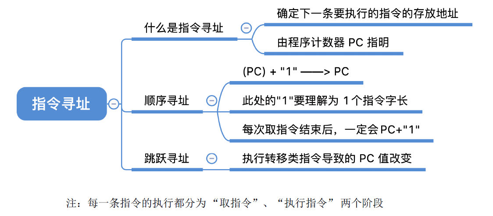

## 4.3、数据寻址

**有效地址(真实地址)**：使用**EA**表示，指令里面的**形式地址**：用**A**表示

| 寻址方式           | 有效地址     | 访存次数(指令执行期间) |
| ------------------ | ------------ | ---------------------- |
| 隐含寻址           | 程序指定     | 0                      |
| 立即寻址🔥          | A即是 操作数 | 0                      |
| 直接寻址🔥          | EA=A         | 1                      |
| 一次间接寻址🔥      | EA=(A)       | 2                      |
| 寄存器寻址         | EA=R~i~      | 0                      |
| 寄存器间接一次寻址 | EA=(R~i~)    | 1                      |

1. 隐含寻址：在指令中隐含着操作数的地址
   - 优点：有利于缩短指令字长。
   - 缺点：需增加存储操作数或隐含地址的硬件
2. **立即寻址**：指令的形式地址A就是我们想要的操作数，形式地址A就是操作数本身，又称为立即数，一般采用补码形式
   - 优点：指令执行阶段不访问主存，指令执行时间最短
   - 缺点：A的位数限制了立即数的范围

3. **直接寻址**：指令中的形式地址A就是操作数的有效地址EA，即EA=A
   - 直接寻址访存次数：取一地址指令访存1次，执行指令访存1次(根据形式地址A去主存读取)，共2次访问
   
   - 优点：简单，指令执行阶段仅访问1次主存，不需专门计算操作数的地址。
   
   - 缺点：形式地址A的位数决定了该指令操作数的寻址范围。操作数的地址不易修改(若主存中的A地址修改，那么操作数的地址也要修改)
   
4. **间接寻址**：指令的地址字段给出的形式地址不是操作数的真正地址，而是操作数有效地址所在的存储单元的地址，也就是操作数地址的地址，即EA=(A)

   - 取一地址指令访存1次，执行指令访存1次(根据形式地址A去主存读取)，根据EA地址再进行1次访存，共3次访存

   - EA=(A)，有效地址EA等于形式地址A所指向的主存单元的地址

   - 优点：
     - 可扩大寻址范围(有效地址EA的位数大于形式地址A的位数)。
     - 便于编制程序(用间接寻址可以方便地完成子程序返回)。

   - 缺点：
     - 指令在执行阶段要多次访存(一次间址需两次访存，多次寻址需根据存储字的最高位确定几次访存)。

5. **寄存器寻址**：指令给出的地址码并不是指向了主存单元，而是指向了某一个寄存器的编号

   - 取一地址指令访存1次，执行指令访存0次，共访存1次

   - 优点：指令在执行阶段不访问主存，只访问寄存器，指令字短且执行速度快，支持向量/矩阵运算。

   - 缺点：寄存器价格昂贵，计算机中寄存器个数有限。

6. **寄存器间接寻址**：指令给出的地址码并不是指向了主存单元，而是指向了某一个寄存器的编号，这个寄存器里面存放的内容才是我们最终要找的操作数在主存中的地址，即EA=R(i)，有效地址是第i个寄存器中的内容 

   - 取一地址指令访存1次，执行指令访存1次，共访存2次

   - 特点：与一般间接寻址相比速度更快，但指令的执行阶段需要访问主存(因为操作数在主存中)。

---

偏移寻址：偏移寻址包括：相对寻址、基址寻址、变址寻址。**偏移寻址就是以某一个地址作为起始地址，然后偏移量为形式地址A**

| 寻址方式                      | 有效地址  | 访存次数(指令执行期间) |
| ----------------------------- | --------- | ---------------------- |
| 相对寻址(转移指令)🔥           | EA=(PC)+A | 1                      |
| 基址寻址(多道程序)🔥           | EA=(BR)+A | 1                      |
| 变址寻址(循环程序、数组问题)🔥 | EA=(IX)+A | 1                      |

1. **相对寻址(转移指令)**：程序计数器PC的内容加上指令格式中的形式地址A而形成操作数的有效地址，即EA=(PC)+A，其中A是相对于PC所指地址的**位移量**，可正可负，**补码表示**
   - 优点：操作数的地址不是固定的，它随着PC值的变化而变化，并且与指令地址之间总是相差一个固定值，因此**便于程序浮动**（一段代码在程序内部的浮动）。相对寻址**广泛应用于转移指令**。
   - 基址寻址的方便浮动指的是**整段程序在内存里的浮动**，相对寻址的浮动指的是**一段代码在程序内部的浮动**。
2. **基址寻址**：将CPU中**基址寄存器（BR）**的内容加上指令格式中的形式地址A，而形成操作数的**有效地址**，即==EA=(BR)+A==。
   - 便于程序浮动，方便实现多道程序并发运行
   - 可扩大寻址范围
   - **有利于多道程序设计**，以及可用于**编制浮动程序（整个程序在内存里边的浮动）**
3. 变址寻址：有效地址EA等于指令字中的形式地址A与变址寄存器IX的内容相加之和，即EA= (IX)+A，其中**IX可为变址寄存器（专用）**，也**可用通用寄存器作为变址寄存器**
   - 注：变址寄存器是**面向用户的**，在程序执行过程中，**变址寄存器的内容可由用户改变**(IX作为偏移量)，形式地址A不变（作为基地址）。而在基址寻址中，BR保持不变作为基地址，A作为偏移量，基址寄存器是**面向操作系统**的，其**内容由操作系统或管理程序确定**。
   - 优点：在数组处理过程中，可设定A为数组的首地址，不断改变变址寄存器IX的内容，便可很容易形成数组中任一数据的地址，**特别适合编制循环程序**。

---

堆栈寻址：操作数存放在堆栈中，隐含使用堆栈指针(SP)作为操作数地址。**寄存器堆栈又称为硬堆栈**，而从主存中划出一段区域来做堆栈是最合算且最常用的方法，这种堆栈称为**软堆栈**。

| 寻址方式 | 有效地址                    | 访存次数(指令执行期间)      |
| -------- | --------------------------- | --------------------------- |
| 堆栈寻址 | 入栈/出栈时EA的确定方式不同 | 硬堆栈不访存，软堆栈访存1次 |

> 注意，上面的访存次数都是指令在执行期间访存，而取指令没有算进去，取指令无论如何都是1次访存。

---

1. (A)，一般表示寄存器里面的内容，或者地址里面的内容

## 4.4、CISC和RISC

- CISC：类比：有很多库函数的C语言
  - 设计思路：一条指令完成一个复杂的基本功能
  - 代表：x86架构，主要用于笔记本、台式机
- RISC：类比：没有库函数的C语言
  - 设计思路：一条指令完成一个基本动作，多条指令组合完成一个复杂的基本功能。
  - 代表：ARM架构，主要用于手机、平板等

| 对比项目         | CISC                                 | RISC                                   |
| ---------------- | ------------------------------------ | -------------------------------------- |
| 指令系统         | 复杂，庞大                           | 简单，精简                             |
| 指令数目         | 一般大于200条                        | 一般小于100条                          |
| 指令字长         | 不固定                               | 定长                                   |
| 可访存指令       | 不加限制                             | 只有Load/Store指令                     |
| 各种指令执行时间 | 相差较大                             | 绝大多数在一个周期内完成               |
| 各种指令使用频度 | 相差很大                             | 都比较常用                             |
| 通用寄存器数量   | 较少                                 | 多                                     |
| 目标代码         | 难以用优化编译生成高效的目标代码程序 | 采用优化的编译程序，生成的代码较为高效 |
| 控制方式         | 绝大多数为微程序控制                 | 绝大多数为组合逻辑(硬布线方式)控制     |
| 指令流水线       | 可以通过一定方式实现                 | 必须实现                               |

# 5、中央处理器

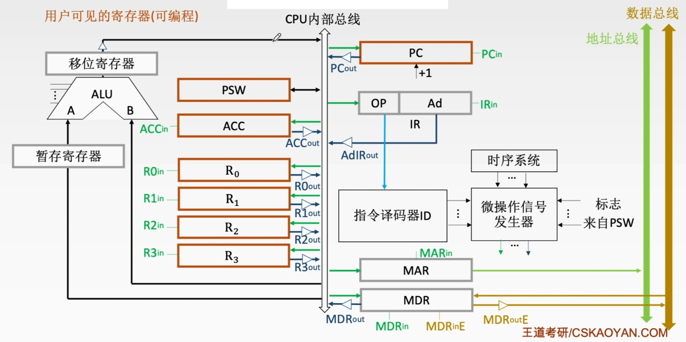

上图中，左边是运算器，右边是控制器，控制器组成如下：

1. **程序计数器P**C：用于指出下一条指令在主存中的存放地址。CPU就是根据PC的内容去主存中取指令的。因为程序中指令（通常）是顺序执行的，所以PC有自增功能。
   - 在取指令阶段，PC记录当前执行的指令地址
   - 在执行指令阶段，PC记录下一条指令地址
2. **指令寄存器IR**：指令取出后，会放入指令寄存器当中，所以指令寄存器用于保存当前正在执行的那条指令。指令的**地址码**会被输送到总线上。
3. **指令译码器ID**：仅对**操作码字段**进行译码，向控制器提供特定的操作信号。控制信号控制不同的微操作。
4. **微操作信号发生器**：根据IR的内容（指令）、PSW的内容（状态信息）及时序信号，产生控制整个计算机系统所需的各种控制信号，其结构有**组合逻辑型**和**存储逻辑型**两种。
5. **时序系统**：用于产生各种时序信号，它们都是由统一时钟（CLOCK）分频得到。
6. **存储器地址寄存器MAR**：用于存放所要访问的主存单元的地址。
7. **存储器数据寄存器MDR**：用于存放向主存写入的信息或从主存中读出的信息。

---

1. **专用数据通路方式**：根据指令执行过程中的数据和地址的流动方向安排连接线路。(**只要两个部件之间有数据的流动，那么我们就在这两个部件之间建立一个专门的连接线路**)
   - 优点：性能较高，基本不存在数据冲突现象，但结构复杂，硬件量大，不易实现。

2. **CPU内部单总线方式**：将所有寄存器的输入端和输出端都连接到一条公共的通路上

3. 用户可见的寄存器：通用寄存器组、程序状态寄存器PSW、程序计数器PC
   - 用户不可见的寄存器：MAR、MDR、IR、暂存寄存器

## 5.1、指令执行过程

一个指令周期至少要由取指周期和执行周期两个部分组成。

- **指令周期**常常用若干**机器周期**来表示，机器周期又叫**CPU周期**。
- 一个**机器周期**又包含若干**时钟周期**（也称为**节拍**、**T周期**或**CPU时钟周期**，它是**CPU操作的最基本单位**）。

如果说每一个子工作所需要消耗的时钟周期数都是相同的，那么每一个子工作所需要消耗的机器周期也是相同的，这种CPU就是**定长的机器周期**。取指令子工作和执行指令子工作所需要的机器周期可能是不相同的，这种CPU就是**不定长的机器周期**。

> 指令周期流程参考计组第五章2.2笔记

---

1. 标志位IF=1，表示开中断(允许CPU响应中断)，IF=0，表示关中断(不允许CPU响应中断)。
2. 一条指令的执行被分为多个阶段，每个阶段对应一个机器周期，一个机器周期可能包含多个时钟周期，最理想的情况就是一个机器周期包含一个时钟周期
3. 我们将指令的执行分为各个段，最后的中断段是外中断， CPU没处理完，一条指令检查是否有外中断请求。
   - 若是内中断，则CPU处理内中断是在任意时间，因为内中断不可被屏蔽，必须立即处理
4. 更新PC的值发生的时机是：取指令完成后，或者把PC的值发送MAR之后即可
5. 指令译码时间可以忽略不计，也可以分配一个时钟周期。
6. 

## 5.2、数据通路

CPU内部单总线方式数据流动大致上分为三类：

1. 寄存器与寄存器之间的流动
2. 寄存器与主存之间的流动
3. 寄存器与ALU算数逻辑单元之间的流动

---

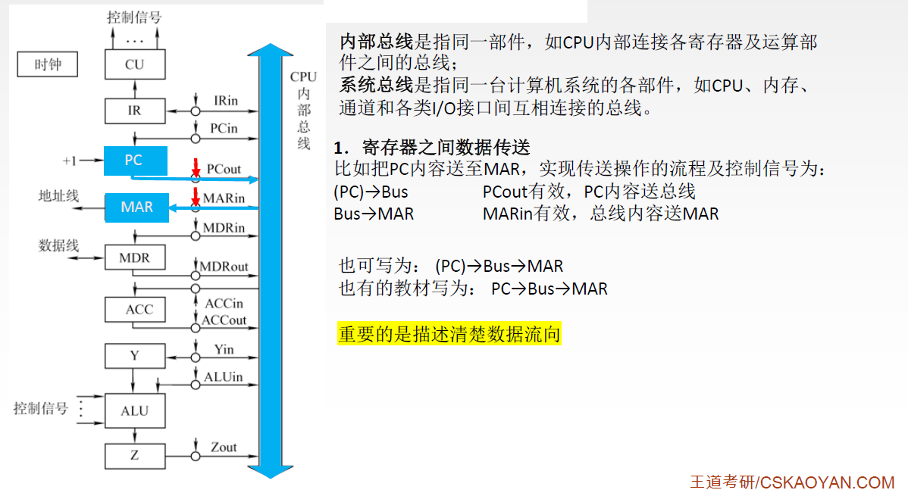

1. **寄存器与寄存器之间数据传送**
   - 比如把PC内容0送至MAR，实现传送操作的流程及控制信号为：
     - (PC)→Bus PC~out~有效，PC内容送到总线Bus
     - Bus→MAR MAR~in~有效，总线内容送MAR
   - 也可写为：(PC)→Bus→MAR
   - 也有的教材写为：PC→Bus→MAR

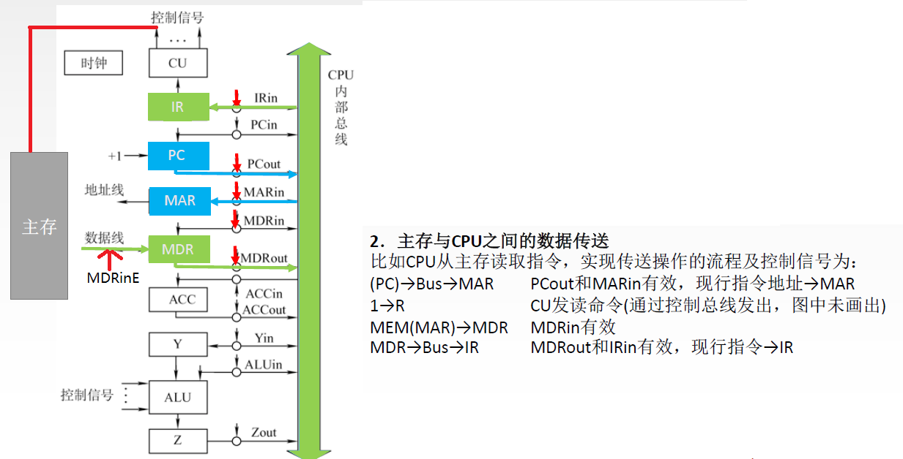

2. **主存与CPU之间的数据传送**
   - 比如CPU从主存读取指令，实现传送操作的流程及控制信号为：
     - (PC)→Bus→MAR PC~out~和MAR~in~有效，指令地址→MAR
     - 1→R CU向主存发读命令(通过控制总线发出，图中红线)
     - MEM(MAR)→MDR MDR~in~E有效，将MAR所指主存中的内容送到MDR
     - MDR→Bus→IR MDR~out~和IR~in~有效，指令→IR

从主存当中读取指令，PC指明了我们要读取的指令存放的地址，所以刚开始将PC的内容放到MAR中，接下来对主存进行读操作，应该读的地址存放在MAR当中，MAR是通过地址总线传送给主存的(事实上应该有一个控制信号控制MAR的内容送到主存，但是图中没画)，接下来主存根据MAR所指示的地址读出相应的数据，然后把这个数据放到MDR当中(图中绿色数据线)，接下来将MDR的数据放入IR当中。

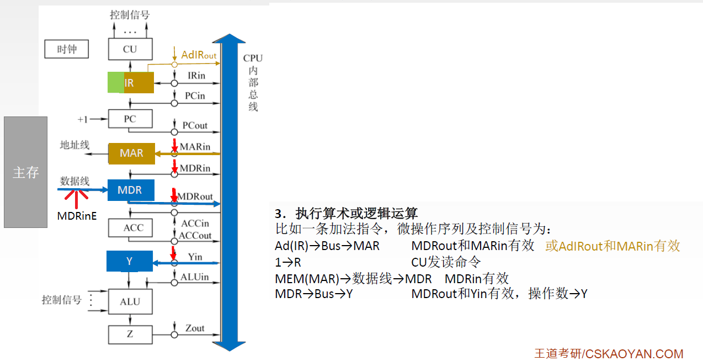

3. **执行算术或逻辑运算**
   - 比如一条加法指令，微操作序列及控制信号为：
     - Ad(IR)→Bus→MAR MDR~out~和MAR~in~有效 或AdIR~out~和MAR~in~有效
     - 1→R CU发读命令
     - MEM(MAR)→数据线→MDR  MDR~in~E有效
     - MDR→Bus→Y   MDR~out~和Y~in~有效，操作数→Y
     - (ACC)+(Y)→Z    ACCout和ALUin有效，CU向ALU发送加命令
     - Z→ACC Zout和ACCin有效，结果→ACC

当我们在执行算数或者逻辑运算时，我们的数据有可能流向ALU的，比如执行一条加法指令，其中一个数已经存放在ACC里面了，而另一个操作数会由加法指令直接指明地址，所以首先根据指令的地址码部分传送到MAR当中，要实现这个操作我们要保证IR~in~和MAR~in~有效，当然也可以让MDR~out~和MAR~in~有效(因为取值令结束之后MDR和IR当中都有地址信息)，接下来主存进行读操作，主存根据MAR所指示的地址读出相应的数据，然后把这个数据放到MDR当中，之后先把这个数放到暂存寄存器Y当中。

---

1. 数据总线可以传输**数据(包括指令)和地址信息**，**控制信息**必须通过**控制总线**传输
2. 数据总线上，理论上可以允许多个器件在同一时间段发送和接收信息，但是为了方便控制，最好还是在一个时间段只有一个器件发送和接收信息
3. 数据通路包括ALU、寄存器、取指部件，但**不包括控制部件**
3. 

## 5.3、硬布线与微程序

微程序控制器如下图：

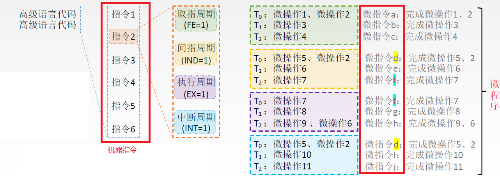

- 微程序：由微指令序列组成，微指令序列由微操作组成，**每一种指令对应一个微程序**。
- **指令**是对**程序**执行步骤的描述，**微指令**是对**指令**执行步骤的描述

- 因此当CPU在执行一条**机器指令**的时候，其实就是要执行这条机器指令所对应的**微程序**

- **微命令**与**微操作**一 一对应(微命令是指执行微操作发出的控制信号，可以理解为微命令=微操作)**，微指令**中可能包含多个**微命令**。**机器指令**和**微程序**也是一一对应的，一种机器指令会对应一个微程序，一个微程序会由多个微指令序列组成。所以可以说机器指令是对微指令的封装。

| 对比项目 | 微程序控制器                                                 | 硬布线控制器                                                 |
| -------- | ------------------------------------------------------------ | ------------------------------------------------------------ |
| 工作原理 | 微操作控制信号以微程序的形式存放，在控制存储器中执行指令时读出即可 | 微操作控制信号由组合逻辑电路根据当前的指令码、状态和时序，即时产生 |
| 执行速度 | 慢                                                           | 快                                                           |
| 规整性   | 较规整                                                       | 繁琐、不规整                                                 |
| 应用场合 | CISC CPU                                                     | RISC CPU                                                     |
| 易扩充性 | 易扩充修改                                                   | 不易扩充                                                     |

---

1.  CPU完成一个微操作(微命令)需要一个时钟周期，时钟周期是CPU工作的基本时间单位
2.  一般将微操作**最长的操作时间**作为CPU时钟周期，时钟周期应以各功能段的最长时间为准
3.  每一条指令对应一个或多个微程序，一个微程序由若干微指令构成，一个微指令由若干微操作(微命令)构成
4.  微指令存储在控制器CM里面，控制器是ROM，控制器存储在指令寄存器IR里面
5.  微程序的入口地址是由**指令的操作码**决定
6.  微指令中地址部分的作用是作为下一条微指令的地址
7.  微程序使用**存储组合**电路产生信号，硬布线使用**逻辑组合**电路产生信号。微程序方式下**处理一条指令需要运行一个微程序**，这就是为什么微程序比硬件慢。
8.  在微程序控制方式下，若有n条机器指令，则控制存储器CM中微程序个数至少为n+1个
    - 是因为把1个取指微程序作为公共微程序，执行微程序为20个

## 5.4、微指令的设计

有的微命令可以并行执行，因此一条微指令可以包含多个微命令

- **相容性微命令**：可以并行完成的微命令。

- **互斥性微命令**：不允许并行完成的微命令。

微指令分为三种：

1. 水平型微指令：一条微指令能定义**多个**可并行的微命令。
   - 优点：微程序短，执行速度快
   - 缺点：微指令长，编写微程序较麻烦

2. 垂直型微指令：一条微指令只能定义**一个**微命令，由微操作码字段规定具体功能

   - 优点：微指令短、简单、规整，便于编写微程序

   - 缺点：微程序长，执行速度慢，工作效率低

3. 混合型微指令：在垂直型的基础上增加一些不太复杂的并行操作。

   - 微指令较短，仍便于编写；微程序也不长，执行速度加快

> **水平型微指令执行一条微指令可以并行的完成多个微命令，垂直型微指令执行一条指令只能完成一个微命令。**

微指令的编码方式：

1. **直接编码（直接控制）方式**
   - 在微指令的操作控制字段中，**每一位代表一个微操作命令**，例如某位为"1"表示该控制信号有效
   - 优点：简单、直观，执行速度快，操作并行性好
   - 缺点：微指令字长过长，n个微命令就要求微指令的操作字段有n位，造成控制存储器容量极大。
2. **字段直接编码方式**
   - 将微指令的控制字段分成若干"段"，**每段经译码后发出控制信号**
   - 微命令字段分段的原则：
     1. **互斥性**微命令(不能并行执行)分在同一段内，**相容性**微命令(可以并行执行)分在不同段内
     2. **每个小段**中包含的**信息位不能太多**，否则将增加译码线路的复杂性和译码时间
     3. 一般**每个小段还要留出一个状态**，表示本字段不发出任何微命令。因此，当某字段的长度为3位时，最多只能表示7个互斥的微命令，**通常用000表示不操作**。
   - 优点：可以缩短微指令字长。
   - 缺点：要通过译码电路后再发出微命令，因此比直接编码方式慢。
3. **字段间接编码方式**
   - 一个字段的某些微命令需由另一个字段中的某些微命令来解释，由于不是靠字段直接译码发出的微命令，故称为字段间接编码，又称隐式编码。
   - 优点：可进一步缩短微指令字长。
   - 缺点：削弱了微指令的并行控制能力，故通常作为字段直接编码方式的一种辅助手段

微指令的地址形成方式：如何确定下一条微指令的存放地址呢？

1. 直接根据微指令的**下地址字段**指出🔥
   - 微指令格式中设置一个下地址字段，由微指令的下地址字段直接指出后继微指令的地址，这种方式又称为**断定方式**。
2. 根据机器指令的**操作码**形成
   - 当机器指令取至指令寄存器后，微指令的地址由操作码经微地址形成部件形成
3. 增量**计数器法🔥**
   - (CMAR)+1->CMAR
4. 分支转移
   - 转移方式：指明判别条件
   - 转移地址：指明转移成功后的去向
5. 由硬件产生微程序入口地址
   - **第一条微指令地址**由专门硬件产生（用专门的硬件记录取指周期微程序首地址）
   - 中断周期 由**硬件**产生**中断周期微程序首地址**（用专门的硬件记录）

微程序设计分类：

1. 静态微程序设计和动态微程序设计
   - **静态 **   微程序无需改变，采用**ROM**
   - **动态**    通过**改变微指令**和**微程序**改变机器指令，有利于仿真，采用**EPROM**
2. 毫微程序设计
   - 毫微程序设计的基本概念
   - **微程序设计** 用 **微程序解释机器指令**
   - **毫微程序设计** 用 **毫微程序解释微程序**
   - 毫微指令与微指令的关系好比微指令与机器指令的关系

---

1. 直接编码，字段直接编码，字段间接编码和混合编码都属于水平型微指令，直接编码不需要译码器，字段编码需要译码器

## 5.5、指令流水线

> 注：参考计组第五章原笔记目录6

一条指令的执行过程可以分成多个阶段：最简单的划分方法是取指、分析、执行三个阶段(注：也可以把每条指令的执行过程分成4个或者5个阶段，分成5个阶段是比较常见的做法)。设取指、分析、执行，三个阶段的时间都相等为t，按以下几种执行方式分析n条指令单执行时间：

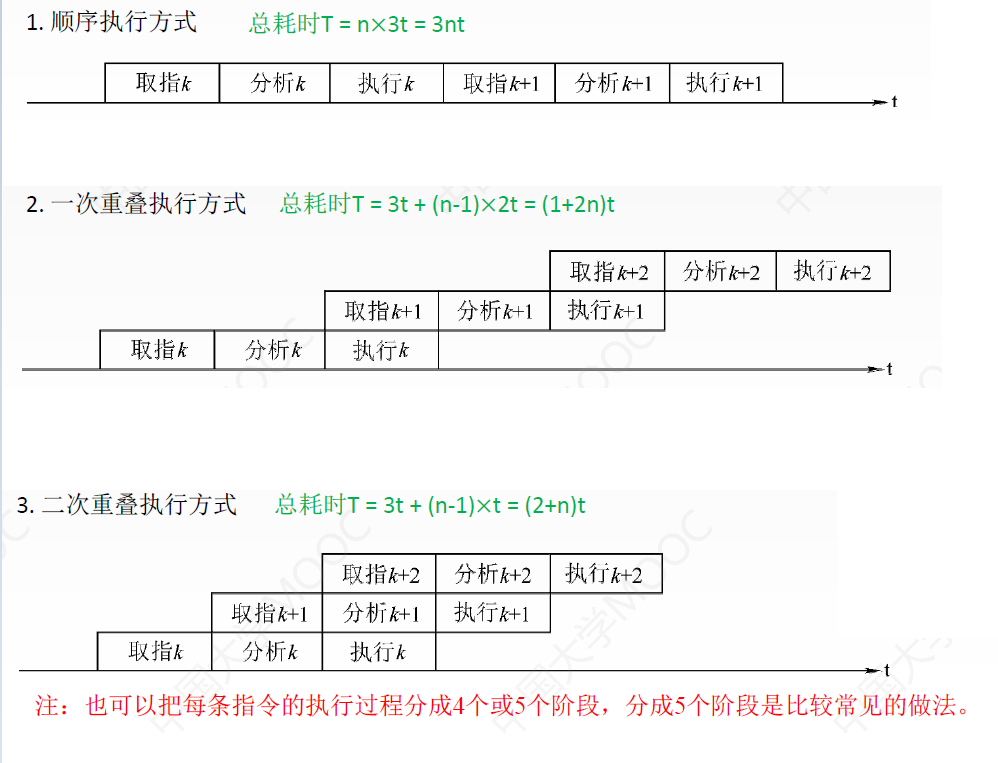

1. 顺序执行方式：一条指令执行上述三个阶段后，下一条指令继续执行上述三个阶段

   - 有n条指令，总耗时 = n×3t = 3nt

   - 传统冯诺依曼机采用顺序执行方式，又称为串行执行方式

   - 优点：控制简单，硬件代价小

   - 缺点：执行指令的速度较慢，在任何时刻，处理机中只有一条指令在执行，各功能部件的利用率很低

2. 一次重叠执行方式：第一条指令的第3个阶段和第二条指令的第2个阶段有重叠

   - 总耗时 = 3t+(n-1)×2t = (1+2n)t
     - 第一个指令需要3t，后面(n-1)个指令只需要2t
   - 优点：程序的执行时间缩短了1/3，各功能部件的利用率明显提高
   - 缺点：需要付出硬件上较大开销的代价，控制过程也比顺序执行复杂了

3. 二次重叠执行方式：

   - 总耗时 = 3t +(n-1)×t = (2+n)t
     - 第一个指令需要3t，后面(n-1)个指令只需要t
   - 与顺序执行方式相比，指令的执行时间缩短近2/3，这是一种理想的指令执行方式，在正常情况下，处理机中同时有3条指令在执行。

---

1. 采用流水线工作方式后，指令的取址段、析指段、执行段，都是在一个时钟周期内完成的。即CPI=1
2. 

## 5.6、流水线的性能指标

### 5.6.1、吞吐率

1. 吞吐率：吞吐率是指在单位时间内流水线所完成的任务数量，或是输出结果的数量(单位时间内我们可以完成多少条指令)
   - 设任务数为n，处理完成n个任务所用的时间为T~k~
   - 则计算流水线吞吐率(TP)的最基本的公式为 TP = n/T~k~

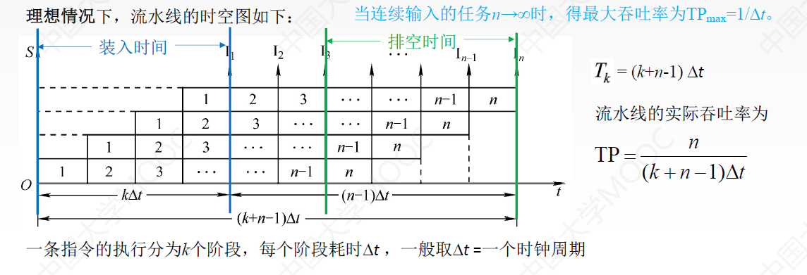

如上图，我们先画出这n条指令的时空图，第1个指令耗时为k▲t，在第1个指令完成执行后再过▲t第2个指令完成执行，之后再过▲t第3个指令执行完成，所以后续(n-1)条指令只需要再花 (n-1)▲t。
$$
处理完成n个任务所用的时间为T_k = (k+n-1) \Delta t \\
流水线实际吞吐率 TP = \frac{n}{(k+n-1) \Delta t} \\
当n->∞,得到最大吞吐率 TP_{max} = \frac{1}{\Delta t}
$$
一般取▲t = 一个时钟周期，一条指令的执行被分为多个阶段，每个阶段对应一个机器周期，一个机器周期可能包含多个时钟周期，最理想的情况就是一个机器周期包含一个时钟周期。

- 装入时间：第1条指令从取指到结束所需要的时间
- 排空时间：最后一条指令从取指到结束所需要的时间

### 5.6.2、加速比

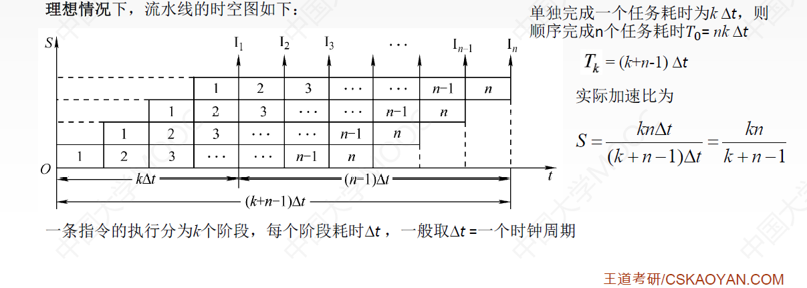

2. 加速比：完成同样一批任务，**不使用流水线所用的时间**与**使用流水线所用的时间之比**
   - 设T~0~表示不使用流水线时的执行时间即顺序执行所用的时间，T~k~表示使用流水线式的执行时间
   - 则计算流水线加速比(S)的基本公式为 S =T~0~/T~k~

如果不使用流水线，则完成一条指令需要k▲t，完成n条指令需要 T~0~=nk▲t
$$
T_k = (k+n-1) \Delta t \\
实际加速比 S = \frac{kn \Delta t}{(k+n-1)\Delta t} = \frac{kn}{k+n-1} \\ 
当n->∞,得到最大加速比 S{max} = k
$$

### 5.6.3、效率

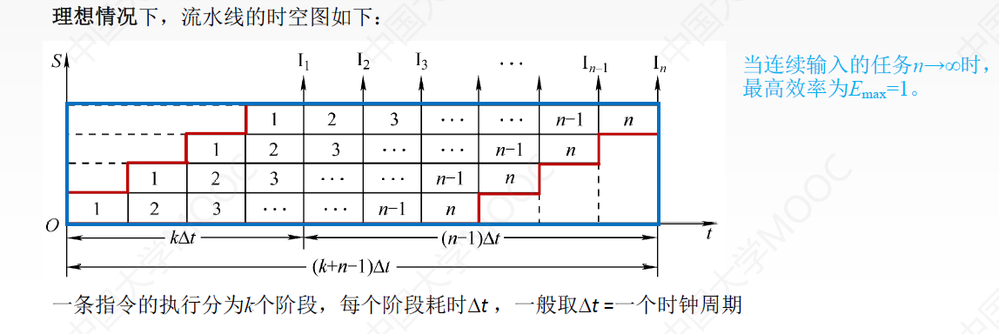

3. 效率：流水线的设备利用率称为流水线的效率。在时空图上流水线的效率定义为**完成n个任务占用的时空区有效面积**与**n个任务所用的时间与k个流水线所围成的时空区总面积**之比。
   - 指令在执行的不同阶段会用到不同的硬件设备，如上图红框框出来的就是设备忙碌的时间，而篮色框出来的就是整体时间，效率就等于红色框的面积除以蓝色框的面积。(将右下角的阶梯形拼到左上角)
   - 效率 = (n-1)▲t/k(k+n-1)▲t
   - 当连续输入的任务n->∞,最高效率为E~max~ = 1

## 5.7、流水线的影响因素

1. 结构相关(资源冲突)：由于多条指令，在同一时刻征用同一资源而形成的冲突，称为结构冲突。其实就是相当于操作系统中的互斥
   - 
2. 数据相关(数据冲突)：简单来说，当一个程序中下一条指令会用到当前指令计算出的结果，此时这两条指令就会发生数据冲突。有可能上一条指令的结果还没计算出来，下一条指令就会将原来的结果拿走。
   - 把遇到数据相关的指令及其后续指令都暂停一至几个周期，直到数据相关问题消失后再继续执行，可分为硬件阻塞(stall)和软件插入"NOP"两种方法。
   - 数据旁路技术(转发机制)：即不等前一条指令把计算结果写回寄存器中，下一条指令也不再读寄存器，而直接把前一条指令的ALU的计算结果作为自己的输入数据开始计算过程，使本来需要暂停的操作，变得可继续执行
   - 编译优化：通过编译器调整指令顺序来解决数据相关
3. 控制相关(控制冲突)：当流水线遇到转移指令和其他改变PC值的指令而造成断流时，会引起控制相关。
   - 转移指令分支预测：简单预测(永远猜true或false)、动态预测(根据历史情况动态调整)
     - 简单预测(永远猜true或false)：掐指一算，我就猜我就给他算这个条件转移指令到底满不满足，道行太浅，只能猜true或false
     - 动态预测(根据历史情况动态调整)
   - 预取转移成功和不成功两个控制流方向上的目标指令
     - 类比我们的if语句，无论是条件满足或条件不满足，都会使得指令有两个流向，我们把转移成功和转移不成功的两个流向的指令都给它取过来
   - 加快和提前形成条件码
   - 提高转移方向的猜准率

## 5.8、流水线的分类

1. **部件功能级、处理机级和处理机间级流水**
   - 根据流水线使用的级别不同，流水线可分为部件功能级流水线处理机级流水线和处理机间流水线
   - **部件功能级流水**就是将复杂的算术逻辑运算组成流水线工作方式。例如：可将浮点加法操作分成求阶差、对阶，尾数相加，以及结果规格化等4个子过程
   - **处理机级流水**是把一条指令解释过程，分成多个子过程，如前面提到的取指、译码、执行、访存以及写回5个子过程
   - **处理机间流水**是一种宏流水，其中每一个处理机完成某一专门任务，各个处理机所得到的结果需存放在与下一个处理机所共享的存储器中

2. **单功能流水线和多功能流水线**
   - 按**流水线可以完成的功能**，流水线可分为单功能流水线和多功能流水线
   - **单功能流水线**是指只能实现一种固定的专门功能的流水线
   - **多功能流水线**是指通过各段间的不同连接方式，可以同时或不同时的实现多种功能的流水线

3. **动态流水线和静态流水线**
   - 按**同一时间内各段之间的连接方式**，流水线可分为静态流水线和动态流水线
   - **静态流水线**指在同一时间内流水线的各段只能按同一种功能的连接方式工作
   - **动态流水线**是指在同一时间内，当某些段正在实现某种运算时，另一些段却正在进行另一种运算。这样对提高流水线的效率很有好处，将会使流水线控制变得很复杂

4. 线性流水线和非线性流水线
   - 按流水线的**各个功能段之间是否有反馈信号**，流水线可分为线性流水线和非线性流水线
   - **线性流水线**中从输入到输出每个功能段只允许经过一次，不存在反馈回路
   - **非线性流水线**存在反馈回路，从输入到输出的过程中，某些功能段将数次通过流水线，这种流水线适合进行线性递归的运算

## 5.9、流水线的多发技术

### 5.9.1、超标量技术

超标量技术：每个时钟周期内可以**并行的发多条独立指令**

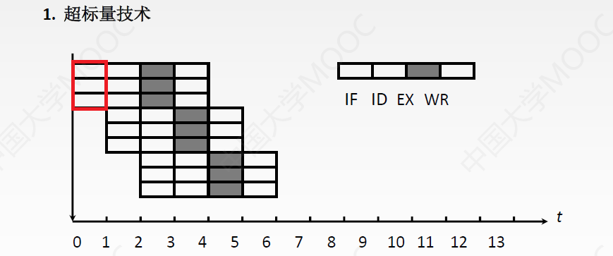

如上图红框，在一个时钟周期内，我们发射了三条独立指令，显然，如果我们要同时运行三条指令，这意味着我们至少要配置三个指令寄存器IR和ALU，因此

- 要配置多个功能部件
- **不能调整**指令的**执行顺序**
- 通过编译优化技术，把可并行执行的指令搭配起来

可以说使用了空分复用技术，我们增加了多个功能部件，所以支持同一时刻多个操作并行来干

> 超标量相当于多个流水同时进行

### 5.9.2、超流水技术

超流水技术：把一个时钟周期再进行分段(3段)

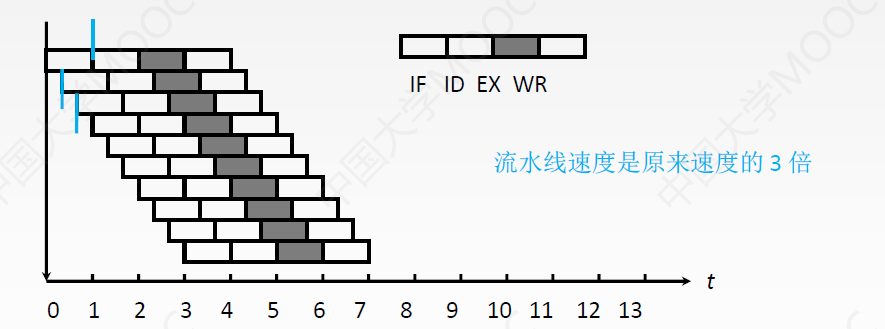

如上图将一个时钟周期分成了三段（图中蓝线），在一个时钟周期内的不同时间点，会发射出三条指令，这意味着在一个时钟周期内，**一个功能部件可能被使用多次**(3次)【可以说使用了时分复用技术】

- **不能调整**指令的**执行顺序**
- 靠编译程序解决优化问题
- 上述粒子流水线的速度是原来速度的三倍

> 这里其实应该说是机器周期，因为取址执行访存阶段的耗时都是定义为机器周期，但是流水线最理想的情况下，一个机器周期只包含一个时钟周期，所以这里会说时钟周期

### 5.8.3、超长指令字

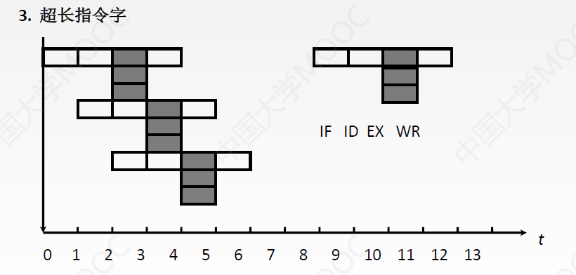

上图只把指令的执行过程分为了4个阶段，没有写访存M阶段，在执行EX阶段有三个灰色的框。

由**编译程序**挖掘出指令间**潜在**的**并行性**，将**多条能并行操作的指令组合成一条**超长的指令，这就是为什么叫超长指令字。这种超长的指令具有**多个操作码字段**

- 多种执行指令操作想要同时进行，需要**采用多个处理部件**

# 6、总线

**总线**是一组能为多个部件**分时共享**的**公共**信息传送**线路**。

- 共享是指总线上可以挂接多个部件，各个部件之间互相交换的信息都可以通过这组线路分时共享。
- 分时是指同一时刻只允许有一个部件向总线发送信息，如果系统中有多个部件，则它们只能分时地向总线发送信息
- 总线添加设备、删除设备方便

总线按数据传输格式：分为串行总线和并行总线

- 串行总线：假设A要给B发送1011，A只能一个比特一个比特来发送，B接收数据也是一个比特一个比特来接收
  - 优点：只需要一条传输线，成本低廉，广泛应用于长距离传输；应用于计算机内部时，可以节省布线空间。
  - 缺点：在数据发送和接收的时候要进行拆卸和装配，要考虑串行-并行转换的问题。
- 并行总线：A可以并行的给B发送多个比特的数据
  - 优点：总线的逻辑时序比较简单，电路实现起来比较容易
  - 缺点：信号线数量多，占用更多的布线空间；远距离传输成本高昂；由于工作频率较高时，并行的信号线之间会产生严重干扰，对每条线等长的要求也越高，所以无法持续提升工作频率。

按总线功能分为：片内总线、系统总线、通信总线

- 片内总线是芯片内部的总线。它是CPU芯片内部寄存器与寄存器之间、寄存器与ALU之间的公共连接线
- 系统总线是计算机系统内各功能部件（CPU、主存、I/O接口）之间相互连接的总线。按系统总线传输信息内容的不同，又可分为3类：**数据总线、地址总线和控制总线**。
  - **数据总线DB**(Data Bus)：数据总线用来传输各功能部件之间的数据信息，它是**双向**传输总线，其位数**与机器字长、存储字长**有关。
  - 地址总线AB(Address Bus)：地址总线用来指出数据总线上的源数据或目的数据所在的主存单元或I/O端口的地址，它是**单向**传输总线，地址总线的位数与**主存地址空间的大小有关**。
  - 控制总线CB(Control Data)：控制总线传输的是控制信息，包括**CPU送出的控制命令**和主存（或外设）返回CPU的反馈信号。
- 通信总线是用于计算机系统之间或计算机系统与其他系统（如远程通信设备、测试设备）之间信息传送的总线，通信总线也称为外部总线。

按时序控制方式分为：同步总线、异步总线

- 异步总线要求通信双方：**波特率相同，通信格式相同**

> 片内总线是连接CPU内部各个部件的，系统总线是连接计算机系统各功能部件的，通信总线是用来连接各个计算机系统的。
>
> - 工作频率相同时，串行总线传输速度比并行总线慢
> - 并行总线的工作频率无法持续提高，而串行总线可以通过不断提高工作频率来提高传输速度，最终超过并行总线

## 6.1、系统总线的结构

1. 单总线结构：单总线并不是指只有一根信号线，系统总线按传送信息的不同可以细分为地址总线、数据总线和控制总线。
   - 优点：结构简单，成本低，易于接入新的设备。
   - 缺点：带宽低、负载重，多个部件只能争用唯一的总线，且不支持并发传送操作。
2. 双总线结构：双总线结构有两条总线，一条是**主存总线**，用于CPU、主存和通道之间进行数据传送；另一条是**I/O总线**，用于多个外部设备与通道之间进行数据传送。
   - 优点：将较低速的I/O设备从单总线上分离出来，实现存储器总线和I/O总线分离
   - 缺点：需要增加通道等硬件设备
3. 三总线结构：三总线结构是在计算机系统各部件之间采用3条各自独立的总线来构成信息通路，这3条总线分别为**主存总线、I/O总线和直接内存访问DMA总线**。
   - 主存总线支持**突发(猝发)传送**：送出一个地址，收到多个地址连续的数据。
   - 主存总线用于连接主存和CPU，主存和某些快速的I/O设备(例如磁盘是快速外设，打印机、键盘是低速的外设)之间用DMA总线连接。这样做的好处是CPU不需要通过慢速的I/O总线和磁盘机进行数据交互。
   - 优点：提高了I/O设备的性能，使其更快地响应命令，提高系统吞吐量。
   - 缺点：系统工作效率较低。

## 6.2、总线的性能指标

1. 总线的**传输周期(总线周期)**

   - 一次总线操作所需的时间（包括申请阶段、寻址阶段、传输阶段和结束阶段），通常由若干个**总线时钟周期**构成。

2. 总线**时钟周期**

   - 即机器的时钟周期。计算机有一个统一的时钟，以控制整个计算机的各个部件，总线也要受此时钟的控制。
   - 总线周期与总线时钟周期的关系比较魔幻，大多数情况下，一个总线周期包含多个总线时钟周期；有的时候，一个总线周期就是一个总线时钟周期；有的时候，一个总线时钟周期可包含多个总线周期

3. 总线的**工作频率**

   - 总线上各种操作的频率，为**总线周期的倒数**。若总线周期=N个时钟周期，则总线的工作频率=时钟频率/N。实际上指**一秒内传送几次数据**

   - $$
     总线工作频率 = \frac{1}{总线周期}
     $$

     

4. 总线的**时钟频率**

   - 即机器的时钟频率，为**时钟周期的倒数**。若时钟周期为T，则时钟频率为1/T。实际上指一秒内有多少个时钟周期。
     $$
     总线时钟频率 = \frac{1}{总线时钟周期}
     $$

5. **总线宽度**

   - 又称为**总线位宽**，它是总线上**同时能够传输的数据位数**，通常是指**数据总线的根数**，如32根称为32位（bit）总线。

6. **总线带宽**

   - 可理解为总线的**数据传输率**，即**单位时间内总线上可传输数据的位数**，通常用每秒钟传送信息的字节数来衡量，单位可用字节/秒（B/s）表示。

$$
总线带宽=总线工作频率×总线宽度(bit/s)=总线工作频率× (总线宽度/8) (B/s) \\
= \frac{总线宽度}{总线周期}(bit/s) = \frac{总线宽度/8}{总线周期}(B/s)
$$

> 注：总线带宽是指总线本身所能达到的最高传输速率。在计算实际的**有效数据传输率**时，要用实际传输的数据量除以耗时。

7. 总线复用
   - 总线复用是指**一种信号线**在不同的时间**传输不同的信息**。可以使用**较少的线**传输更多的信息，从而节省了空间和成本
   - 总线复用的主要目的是 ==减少线数，节省成本==，会导致传输时间增大，传输速率下降，
8. 信号线数
   - 地址总线、数据总线和控制总线3种总线数的总和称为信号线数。

## 6.3、总线操作和定时

总线周期的4个阶段：

1. **申请分配阶段**：由需要使用总线的主模块提出申请，经中心仲裁机构决定，将下一传输周期的总线使用权授予某一申请者。也可将此阶段细分为传输请求和总线仲裁两个阶段
2. **寻址阶段**：获得使用权的主模块通过总线发出本次要访问的从模块的地址以及有关命令，启动参与本次传输的从模块
   1. 占用总线后，主设备最先发送的信号是**地址信号**

3. 传输阶段：主模块和从模块进行数据交换，可单向或双向进行数据传送
4. 结束阶段：主模块的有关信息均从系统总线上撤除，让出总线使用权

**总线定时**是指总线在双方交换数据的过程中需要时间上配合关系的控制，这种控制称为总线定时，它的实
质是一种协议或规则

总线定时的方案：

1. 同步通信(同步定时方式)：由**统一时钟**控制数据传输
2. 异步通信(异步定时方式)：采用**应答方式**，没有公共时钟标准
3. 半同步通信：**同步、异步结合**
4. 分离式通信：充分**挖掘**系统**总线每瞬间**的**潜力**

### 6.3.1、同步定时方式

**同步定时方式**是指系统采用一个**统一的时钟信号**来协调发送和接收双方的传送定时关系。

- 若干个时钟产生相等的时间间隔，每个间隔构成一个总线周期。
- 在一个总线周期中，发送方和接收方可进行一次数据传送。
- 因为采用统一的时钟，每个部件或设备发送或接收信息都在固定的总线传送周期中，一个总线的传送周期结束，下一个总线传送周期开始。

- 优点：传送速度快，具有较高的传输速率；总线控制逻辑简单。
- 缺点：主从设备属于强制性同步；不能及时进行数据通信的有效性检验，可靠性较差。

同步通信适用于**总线长度较短**及**总线所接部件的存取时间比较接近**的系统。

### 6.3.2、异步定时方式

根据"请求"和"回答"信号的撤销是否互锁，分为以下3种类型：

1. 不互锁方式：主设备发送请求信号，不必等待从设备信号回答，一段时间便撤销请求信号
2. 半互锁方式：主设备发送请求信号，必须接到从设备应答信号才能撤销请求信号
3. 全互锁方式：主设备发送请求信号，从设备应答，主设备撤销请求信号，从设备知晓主设备获得应答信号后便撤销应答信号

# 7、I/O系统

主机如何与I/O设备进行交互：通过**I/O接口**，又称**I/O控制器、设备控制器**

CPU和外设之间的速度差距是很大的，所以我们需要有数据寄存器来作为缓冲，一个慢速的外设可以往数据寄存器里慢慢的写入数据，当这个寄存器被写满，CPU很快的将这个寄存器的数据取走。

- 数据缓冲：通过数据缓冲寄存器（DBR）达到主机和外设工作速度的匹配
- 错误或状态监测：通过状态寄存器反馈设备的各种错误、状态信息，供CPU查用
- 控制和定时：接收从控制总线发来的控制信号、时钟信号
- 数据格式转换：串-并、并-串等格式转换
- 与主机和设备通信：实现主机—I/O接口—I/O设备之间的通信

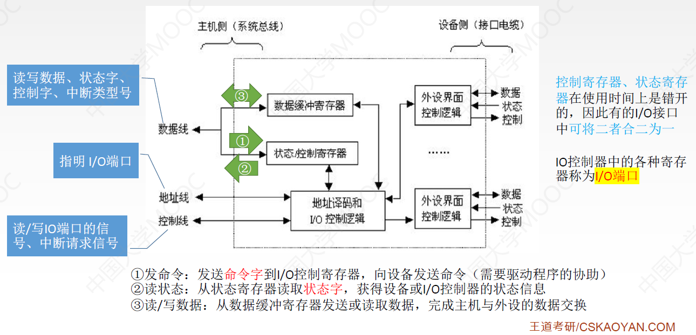

I/O接口的工作原理：CPU连接在左边主机侧，然后外设(例如打印机)连接在右边设备侧

1.  发命令：发送**命令字（控制字）**到I/O控制寄存器，向设备发送命令（需要驱动程序的协助）
    - CPU若想要打印机打印任务，首先CPU需要将打印机对应的命令放入状态控制寄存器
2.  读状态：从状态寄存器读取**状态字**，获得设备或I/O控制器的状态信息
3.  读/写数据：从数据缓冲寄存器发送或读取数据，完成主机与外设的数据交换

**控制寄存器、状态寄存器**在使用时间上是错开的，因此有的I/O接口中**可将二者合二为一**。 IO控制器的各种寄存器称为**IO端口**。例如数据缓冲寄存器称为数据端口，状态寄存器称为状态接口。

- 地址线的作用：给CPU指明给哪个I/O端口读/写数据
- 控制线的作用：发出读/写IO端口的信号、中断请求信号，用于指明对这个IO端口是要读/写
- 数据线的作用：读写数据、状态字、命令字(控制字)、**中断类型号**都通过数据总线传输

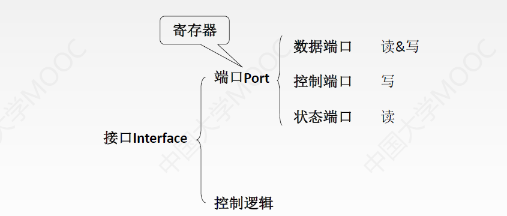

**I/O端口就是一个一个的寄存器**。由于I/O接口内部有很多端口(寄存器)，为了标明CPU要访问的是哪个寄存器，因此我们就需要给这些端口(寄存器)进行编址。 CPU对于不同端口(寄存器)的操作是不一样的：

- 对于数据端口(寄存器)既可以读也可以写
- 对于控制端口(寄存器)只能写
- 对于状态端口(寄存器)只能读

- 统一编址：把I/O端口当做存储器的单元进行地址分配，用统一的访存指令就可以访问I/O端口，又称**存储器映射方式**(意思就是I/O端口的地址和内存的地址是一整套)

  - 靠不同的**地址码**区分内存和I/O设备，I/O地址要求相对固定在地址的某部分

    - 访问内存类的指令都可以访问I/O端口，比如`LOAD`指令，只要可以访问内存也可以访问I/O端口
    - 优点：不需要专门的输入/输出指令，所有访存指令都可直接访问端口，程序设计灵活性高。端口有较大的编址空间，读写控制逻辑电路简单
    - 缺点：端口占用了储存地址空间使储存地址空间变小，外设寻址时间长(地址位数多，地址译码速度慢)
- 独立编址： I/O端口地址与存储器地址无关，独立编址CPU需要设置**专门的输入/输出指令**访问端口，又称**I/O映射方式**(意思就是I/O端口的地址和内存的地址是相互独立的)
  - 靠不同的**指令**区分内存和I/O设备
    - 优点：使用专用I/O指令，程序编址清晰。I/O端口地址位数少，地址译码速度快。I/O端口的地址不占用储存地址空间
    - 缺点：I/O指令类型少，一般只能对指令进行传送操作，程序设计灵活性差。需要CPU提供存储器读/写、I/O设备读/写两组控制信号，增加了控制逻辑电路的复杂性

## 7.1、I/O控制方式

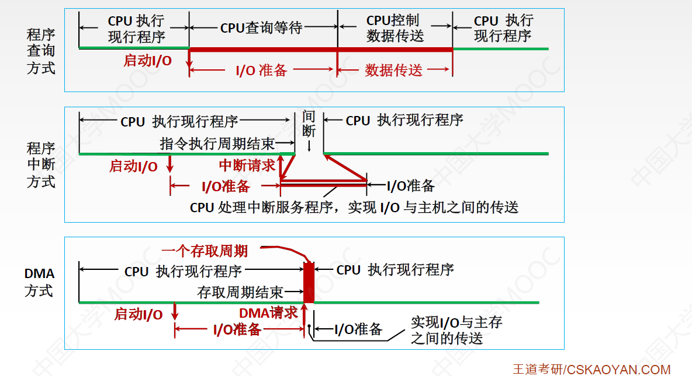

- **程序查询方式**：CPU启动I/O操作之后，例如启动一个读操作，当I/O设备在准备数据的时候， CPU会不断的轮巡检查I/O接口当中这个状态是否已完成，当CPU发现I/O设备的数据准备完成之后， CPU才会去I/O接口当中取走数据。在I/O设备准备数据的这个过程当中，CPU不可以干其他事情， CPU需要一直轮巡检查I/O接口状态。

- **程序中断方式**：每一次I/O设备(外设)准备好一个字的数据， CPU就需要运行一次中断服务程序，把这一个字的数据转存到主存当中，所以对于那些速度很快的I/O设备来说，采用这种中断控制方式，会使CPU执行中断服务程序开销很大，效率很低
- DMA方式：DMA控制器也是一种I/O控制器，也就是I/O接口。在数据准备阶段，CPU与外设并行工作， DMA方式在外设与内存之间开辟一条直接数据通路，信息传送不再经过CPU，降低了CPU在传送数据时的开销，因此称为直接存储器存取方式。由于数据传送不经过CPU，也就不需要保护恢复CPU现场等操作

## 7.2、程序查询方式流程图

1. CPU执行初始化程序，并预置传送参数
2. 向I/O接口发出命令字，启动I/O设备
3. 从外设接口读取其状态信息(轮询查询)
4. CPU不断查询I/O设备状态，直到外设准备就绪
5. 传送一次数据，一般为一个字
6. 修改地址和计数器参数
7. 判断传送是否结束，若未结束则转到第3步，直到计数器为零

在这种控制方式下，**CPU一旦启动I/O，就必须停止现行程序的运行，并在现行程序中插入一段程序**。

- 程序查询方式的主要特点是CPU有踏步等待现象， CPU与I/O串行工作。
- 优点：接口设计简单，设备量少
- 缺点： CPU在信息传送过程中要花费很多时间用于查询和等待，而且在一段时间内只能和一台外设交换信息，效率大大降低

## 7.3、程序中断方式

CPU处理中断的基本流程：

1. 中断请求
   - 中断源向CPU发送中断请求信号
2. 中断响应
   - 响应中断的条件： CPU如果执行了关中断指令，那么CPU就会暂时不理睬这些中断信号
   - 中断判优：多个中断源同时提出请求时通过中断判优逻辑响应一个中断源。
3. 中断处理
   - 中断隐指令
   - 中断服务程序

### 7.3.1、中断请求标记

CPU如何判断自己当前处于关中断的状态呢？这个信息会被记录在PSW状态寄存器里面，当IF=1表示开中断(允许响应中断)，IF=0表示关中断(不允许响应中断)。关中段可以用来辅助原子操作。

- **非屏蔽中断**，在关中断时也会被响应(如电脑关机是必须被响应的)
- 可屏蔽中断：在关中断时不会被响应

中断请求标记：判断是哪个设备发来的中断信号。每个中断源向CPU发出中断请求的时间是随机的。为了记录中断事件并区分不同的中断源，中断系统需对每个中断源设置**中断请求标记触发器INTR**，当其状态为"1"时表示中断源请求。这些触发器可组成中断请求标志寄存器，该寄存器可集中在CPU中，也可分散在各个中断源中。

通过INTR线发出的是可屏蔽中断，也就是外中断，对于**外中断**，CPU是在统一的时刻即**每条指令执行阶段结束前**向接口**发出中断查询信号**，以获取I/O的中断请求，也就是说，**CPU响应中断的时间**是在每条**指令执行阶段的结束时刻**。

 CPU响应中断必须满足以下三个条件：

1. 中断源有中断请求
2. CPU允许中断即开中断(异常和不可屏蔽中断不受此限制)
3. 一条指令执行完毕(异常不受此限制)，且没有更紧迫的任务

### 7.3.2、中断判优

中断判优：有多个中断信号同时到来，先处理哪一个中断

中断判优既可以用硬件实现，也可以用软件实现：

- 硬件实现是通过**硬件排队器**实现的，它既可以设置在CPU中，也可以分散在各个中断源中
- 软件实现是通过**查询程序**实现

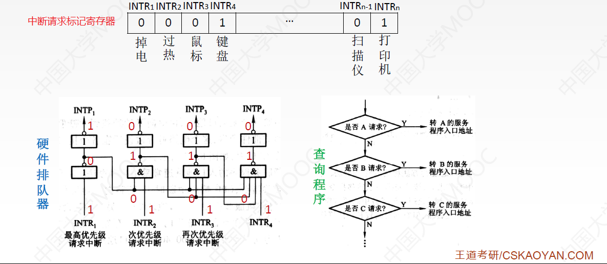

1. 不可屏蔽中断 > 内部异常 > 可屏蔽中断
2. 内部异常中，硬件故障 > 软件中断
3. DMA中断请求优先于I/O设备传送的中断请求
4. 在I/O传送类中断请求中，高速设备优先于低速设备，输入设备优先于输出设备，实时设备优先于普通设备

### 7.3.3、中断处理过程

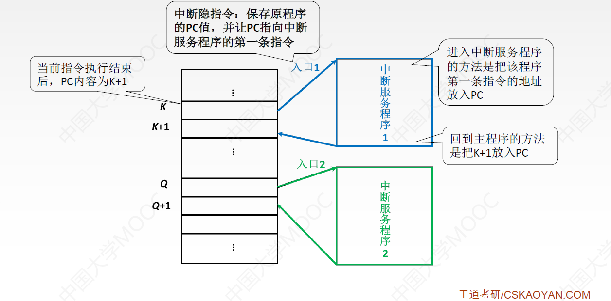

如上图，在K指令执行结束后发现了一个中断信号，此时我们需要让PC指向该中断处理程序的第1条指令的地址，但是由于此时PC指向的是K+1条指令，现在这个中断事件导致程序执行流发生了改变，所以CPU处理完中断之后，又需要将PC的值指向K+1。

- **中断隐指令**：保存原程序的PC值，并让PC指向中断服务程序的第一条指令。**中断隐指令**并不是一条具体的指令，而是CPU在检测到中断请求时自动完成的一系列动作。
- **中断隐指令**的主要任务：
  - **关中断。**在中断服务程序中，为了保护中断现场（即CPU主要寄存器中的内容）期间不被新的中断所打断，必须关中断，从而保证被中断的程序在中断服务程序执行完毕之后能接着正确地执行下去。
  - **保存断点**。为了保证在中断服务程序执行完毕后能正确地返回到原来的程序，必须将原来程序的断点（即程序计数器（PC）的内容）保存起来。可以存入堆栈，也可以存入指定单元。
  - **引出中断服务程序**。识别中断源，将对应的服务程序入口地址送给程序计数器PC。有两种方法识别中断源，**硬件向量法和软件查询法**

中断服务程序的主要任务：

1. 保护现场
   - 保存通用寄存器和状态寄存器的内容，以便返回原程序后可以恢复CPU环境，可使用堆栈，也可以使用特定存储单元
2. 中断服务(设备服务)
   - 主体部分，如通过程序控制需打印的字符代码送入打印机的缓存存储器中
3. 恢复现场
   - 通过出栈指令或者取数指令，把之前保存的信息送回寄存器中
4. 中断返回
   - 通过中断返回指令，回到原程序断点处

### 7.3.4、总结

正常情况，CPU取一条指令执行一条指令，取一条指令执行一条指令，顺序执行各条指令。在每条指令的末尾，CPU都会检查是否有中断信号，若没有中断信号需要处理，则继续取下一条指令执行下一条指令。若有中断信号需要处理：

- 假设执行K指令发现了中断信号，此时PC的值指向K+1
- CPU检测到中断信号之后，会执行中断隐指令
  - 首先将原来程序的PC值放入栈中保存
  - 执行关中断
  - 计算出向量地址，从中断向量表中得到对应的中断向量，让PC指向中断向量，这样PC就指向了中断服务程序1的第一条指令
- 接下来开始执行中断服务程序
  - 中断服务程序1首先要保存现场
  - 然后执行设备服务，也就是对中断请求信号做具体的处理
  - 恢复以前的运行环境
  - 执行开中断、中断返回。中断服务程序的最后一条指令，通常是一条中断返回指令，使其返回到原程序的断点处，以便继续执行原程序

> 单重中断：执行中断服务程序时，不响应新的中断请求
>
> - 因为关中断和开中断保证了中断服务程序一气呵成，即使此时有新的中断请求也不会响应

### 7.3.5、多重中断

单重中断：在CPU执行中断服务程序的过程中，又出现了新的更高优先级的中断请求，而CPU对新的中断请求不予响应，则这种中断称为单重中断

多重中断：又称中断嵌套，执行中断服务程序时可响应新的中断请求。(也就是执行中断服务程序时又发生了中断， CPU暂停现行的中断服务程序转去处理新的中断请求)

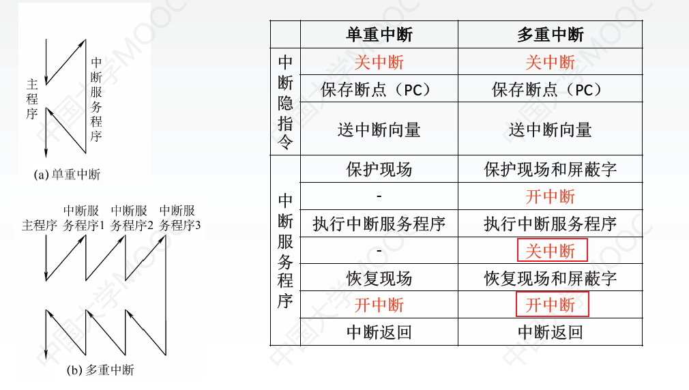

> 保护现场和恢复现场的操作都必须一气呵成

多重中断其实就是又增加了一条关中断和开中断，并且多层中断，在保护现场时也会保护屏蔽字。屏蔽字也叫中断屏蔽字，他可以屏蔽某些中断

### 3.6.1、中断屏蔽技术

中断屏蔽技术主要用于多重中断，CPU要具备多重中断的功能，须满足下列条件：

1. 在中断服务程序中提前设置开中断指令。
2. 优先级别高的中断源有权中断优先级别低的中断源。

每个中断源都有一个屏蔽触发器，1表示屏蔽该中断源的请求，0表示可以正常申请，所有屏蔽触发器组合在一起，便构成一个屏蔽字寄存器，屏蔽字寄存器的内容称为屏蔽字

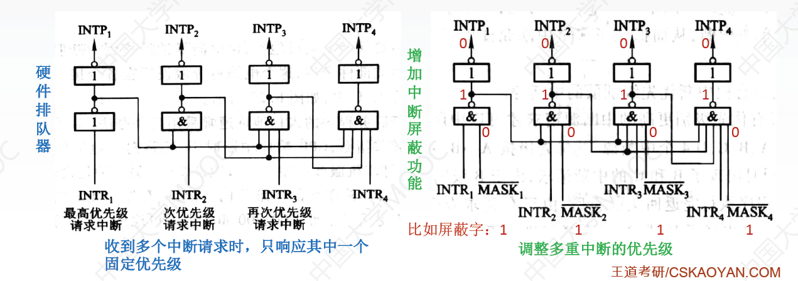

左边是硬件排队器，右边是增加了中断屏蔽功能的硬件排队器.

- 左边硬件排队器：收到多个中断请求时只响应其中一个中断请求，是固定优先级
- 右边：可以调整多重中断的优先级

屏蔽字设置的规律：

1. 一般用"1"表示屏蔽，"0"表示正常申请
2. 每个中断源对应一个屏蔽字(在处理该中断源的中断服务程序时，屏蔽寄存器中的内容为该中断源对应的屏蔽字)。
3. 屏蔽字中"1"越多，优先级越高。每个屏蔽字中至少有一个"1"(至少要能屏蔽自身的中断)

## 7.4、DMA方式

DMA的传送过程：

1. 预处理
   - CPU会向DMAC指明要读/写的数据应该存放在主存当中的什么位置，应该存放在I/O设备的什么位置，指明传送数据的个数，然后启动I/O设备
2. 数据传送：
   - CPU继续执行现行程序
   - 设备将数据写入DR数据缓冲寄存器，写满后向DMAC发送DMA请求，DMAC向总线发送总线请求，DMAC就获得了总线控制权接管总线，就可以通过地址线、数据线、系统总线来给主存发出写命令。当传送长度计数器溢出发出DMA中断请求，说明一个字的数据已经发送结束。
3. 后处理
   - CPU运行相应的中断服务程序，做DMA结束处理
   - CPU继续执行现行程序

> 到底要让谁使用主存，这个操作完全由CPU控制，因为CPU将总线给了DMAC就意味着CPU不能访问主存

由于DMA方式传送数据不需要经过CPU，因此不必中断现行程序，**I/O与主机并行工作，程序和传送并行工作**。

DMA方式具有下列特点：

1. 它使主存与CPU的固定联系脱钩，主存既可被CPU访问，又可被外设访问。
2. 在数据块传送时，主存地址的确定、传送数据的计数等都由硬件电路直接实现。
3. 主存中要开辟专用缓冲区，及时供给和接收外设的数据。
4. DMA传送速度快，CPU和外设并行工作，提高了系统效率。
5. DMA在传送开始前要通过程序进行预处理，结束后要通过中断方式进行后处理。

## 7.5、DMA方式与中断方式

|          | 中断                                     | DMA                                           |
| -------- | ---------------------------------------- | --------------------------------------------- |
| 数据传送 | 程序控制 程序的切换 -> 保存和恢复现场 | 硬件控制 CPU只需进行预处理和后处理         |
| 中断请求 | 传送数据                                 | 后处理                                        |
| 响应     | 指令执行周期结束后响应中断               | 每个机器周期结束均可，总线空闲即可响应DMA请求 |
| 场景     | CPU控制，低速设备                        | DMA控制器控制，高速设备                       |
| 优先级   | 优先级低于MDA                            | 优先级高于中断                                |
| 异常处理 | 能处理异常事件                           | 仅传送数据                                    |

