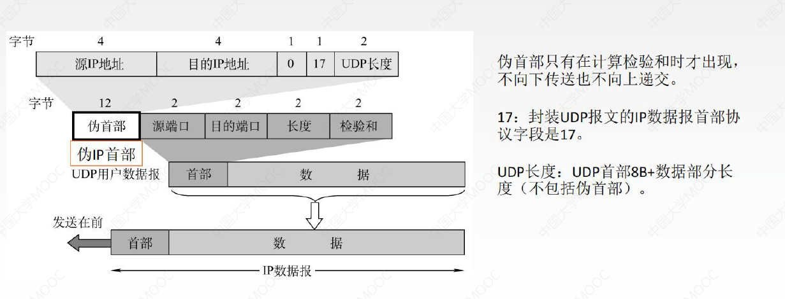

# 1、传输层

传输层：是只有主机才有的层次

传输层为上层应用层提供通信服务，同时使用下层网络层提供的服务。

传输层的功能：

1. **传输层提供进程和进程之间的逻辑通信**
   - 网络层提供主机和主机之间的逻辑通信，传输层提供进程和进程之间的逻辑通信
2. **复用和分用**
   - 复用指的是发送方不同的应用进程，都可以使用同一个传输层的协议来传送数据
   - 分用指的是接收方的传输层在去掉报文首部之后能够把数据送交给正确的进程
     - QQ给A发送数据，微信给B发送数据，这两部分数据就作为传输层的传送单元报文段，这些报文段就可以交付给网络层，然后这两个报文段就在链路上进行传输。这就是将两个进程的数据进行了复用。
     - 接收方主机收到两部分数据，经历传输层的分用过程，也就是把收来的报文段送交给某一个进程
3. **传输层对收到的报文进行差错检测(首部和数据部分)**
   - 网络层只检查IP数据报的首部，不检验数据部分是否出错
4. **传输层的两种协议**
   - 即面向连接的TCP和无连接的UDP

## 1.1、传输层的两个协议

### 1.1.1、面向连接的传输控制协议TCP

面向连接的传输控制协议TCP：传送数据之前必须建立连接，数据传送结束之后要释放链接，不提供广播或多播服务。由于TCP要提供可靠的面向连接的传输服务，因此不可避免增加了许多开销：确认、流量控制、计时器及连接管理等

> 可靠，面向连接，时延大，适用于大文件

### 1.1.2、无连接的用户数据报协议UDP

无连接的用户数据报协议UDP：传送数据之前不需要建立连接，收到UDP报文后也不需要给出任何确认。

> 不可靠，无连接，时延小，适用于小文件。

## 1.2、传输层的寻址与端口

复用：应用层所有的应用进程都可以通过传输层再传输到网络层

分用：传输层从网络层收到数据后，交付指明的应用进程

两个主机通信，根据网络层的IP地址寻找到两个主机所在的网络，进入网络之后就要依靠链路层的MAC地址定位到主机，然后再依靠传输层的端口定位到主机中的进程。

- **端口是传输层的SAP，标识主机中的进程**。这个端口叫做逻辑端口/软件端口，这和硬件端口(比如路由器交换机直接可以插上去的端口)不一样，传输层的端口是透明的(看不见摸不着的)，所以我们叫它逻辑端口。
- 每个端口都有一个**端口号**来标识，端口号只有本地意义，在因特网中不同计算机的相同端口是没有联系的
  - `localhost:8080` 很熟悉吧，Tomcat默认端口号8080，两台主机的相同Tomcat端口号是没有关系滴
- 端口号长度为16bit，能表示2^16^ = 65536个不同的端口

- 端口号按范围分类如下：

服务端指的是服务器端所使用的端口号，客户端指的是主机所使用的端口号。客户端端口号仅在客户进程运行时才动态的选择，通讯结束后，刚用过的客户端口号就不复存在，因此这个端口号就可供其他客户进程以后使用。

一些常用的**熟知端口号**如下：

我在**21岁发**现了心仪的女生，**23岁**我们开始**谈**恋爱，**25岁**我们闹矛盾**删**了好友，**53岁**我给她**打**电话，然而她人在异乡，我们相约**80**岁**还**要再见。(这什么鬼故事😅)

- 在网络中采用发送方和接收方的套接字组合来识别端点，**套接字**唯一标识了网络中的一个主机和它上面的一个进程

- ==套接字Socket = (主机IP地址，端口号)==
  - 根据IP地址可以找到主机，根据端口号可以找到主机中的具体进程。因此我们说，**套接字**唯一标识了网络中的一个主机和它上面的一个进程

## 1.3、UDP协议

UDP只在IP数据报服务之上，增加了很少功能：**复用分用**和**差错检测**功能

UDP的主要特点：

1.  UDP是**无连接**的，减少开销和发送数据之间的时延

2. UDP使用最大努力交付，即**不保证可靠交付**

   - 可靠交付由应用层保证

3. UDP是**面向报文**的，适合一次性传输少量数据的网络应用

4. UDP**无拥塞控制**，适合很多实时应用

   

5. UDP首部开销小8B，TCP的首部20B

如上图，应用层的应用程序会产生应用层报文，这个应用层报文作为应用层的传输单元向下传递，传递到传输层进行封装，封装成**UDP首部**和**UDP用户数据报数据部分**(如果使用TCP协议会封装成TCP的首部)，接下来传输层继续向下传递，传输到网络层进行封装，封装成**IP首部**和**IP数据报数据部分**。我们说UDP是面向报文的，其实就是在说UDP对于应用层向下传递的报文是既不合并也不拆分的，对这个报文的长度大小是不做任何改变的， 而是保留这些报文的边界，也就是整个应用层的报文都会放到传输层的一个报文段当中，或者说放到UDP的一个数据报当中。

> 应用层给UDP多长的报文，UDP就照样发送，即一次发一个完整报文
>
> 接收端如果检测到收到的UDP数据报有差错，一律丢弃不管

### 1.3.1、UDP首部格式

UDP首部格式由**8B的首部字段**和**数据字段**组成。

- 数据字段是可以为0的，所以一个UDP的数据报最短为8B
- 首部字段包括4个字段：源端口号、目的端口号、UDP长度、UDP检验和。4个字段的长度均为2B
  - 源端口号是可有可无的( A进程给B进程发送数据，若需要B进程回复则需要添加源端口号，如果不需要毕竟成回复，则源端口号可以不添加)
  - 目的端口号是必须要有的
  - UDP长度指的是**UDP用户数据报的整个长度**，也就是首部+数据字段，如果数据字段是7B，那UDP长度对应的就是8+7=15B。
  - UDP检验和是检测**整个**UDP数据报是否有错，有错就丢弃
    - 还有一种出错的情况，就是分用时(也就是网络层交付给传输层的数据报)找不到对应的目的端口号就丢弃报文，并给发送方发送ICMP"端口不可达"差错报告报文。

### 1.3.2、UDP校验

我们看UDP校验的过程，UDP的首部数据前面又加了12B伪首部，伪首部包括字段如上图，伪首部只有在计算检验核实才出现，不向下传送也不向上递交。

- UDP长度：UDP首部8B+数据部分长度(不包括伪首部)

如上图左左边是发送方准备发送的**UDP用户数据报+伪首部**进行校验。为首部和UDP数据报结合的整体，我们要将其看成由许多16位的字串连接起来的，也就是一行占4B.

- 4B的原IP地址，4B的目的IP地址，1B的全0，1B的协议字段17，2B的UDP长度
- 2B源端口号，2B目的端口号，2B的UDP长度，2B的UDP检验和全0
- 数据部分有时并不全是4B，所以我们需要填充全0，才能把最后一行也补成4B

我们来看UDP字段在发送端的过程：

1. 添上伪首部
2. 全0填充校验和字段
3. 全0填充数据部分（ UDP数据报要看成许多4B的字串接起来）
   - 上图的数据部分是7B，所以需要填充全0。使得数据部分是4B的整数倍
4. 伪首部+首部+数据部分采用二进制反码求和
5. 把和再求反码填入校验和字段替换全0
6. 去掉伪首部，发送！

接收端收到UDP字段如何进行UDP校验和校验呢：

1. 添上伪首部
2. 伪首部+首部+数据部分采用二进制反码求和
3. 结果全为1则无差错，否则丢弃数据报或者交给应用层并附上出差错的警告

## 1.4、TCP协议

1. TCP是面向连接(虚连接)的传输层协议
   - TCP协议在使用之前必须要先建立好一个连接，用完然后释放这个连接。这并不是实际的物理连接。实际的物理连接是把这个数据报加上各个层次的首部之后放到链路上面传输

2. 每一条TCP连接只能有两个端点，每一条TCP连接只能是点对点的
3.  TCP提供可靠交付的服务，无差错，不丢失，不重复，按序到达。（**可靠有序，不丢不重**）
4.  TCP提供全双工通信：一端既可以作为发送方，也可以作为接收方。所以两端都会设置发送缓存和接收缓存
   - **发送缓存**：主要包括准备发送的数据和已发送但尚未收到确认的数据
   - **接收缓存**：主要包括按序到达但尚未被接收的应用程序读取的数据和不按序到达的数据

5. TCP面向字节流
   - 流：流入到进程或从进程流出的字节序列
   -  TCP把应用程序交付下来的数据看成仅仅是一连串的**无结构的字节流**

如上图，假如发送方要发送这样一个文件，它会将这个文件按照字节进行排序并编号，在发送的时候就会将这些字节放入TCP的缓存当中，如上图是将前10个字节放入缓存当中等待发送。可能先取123字节组成TCP报文段，在报文段上加上TCP的头部形成完整报文段，再放到链路上面进行传输。

- TCP首部有序号字段，表示报文段所发送数据的**第1个字节的序号**，上图中发送数据的第1个字节是1，所以序号字段处填1
- 接收端收到123报文段回返回一个确认报文段，这个报文段有一个字段是**确认号**，这个确认号此时为4，表示希望收到4字节，123字节已正确接收

### 1.4.1、TCP报文段首部格式

 TCP报文段包括两个部分：**TCP首部**和**TCP数据部分**

- TCP首部除了有20B的固定首部之外，还有**选项**(长度可变的字段)和**填充**字段。
  - 之所以要有填充字段，是因为TCP首部必须要是4B的整数倍
  - TCP首部一行32位，也就是4B。固定首部占20B
  - 2B源端口、2B目的端口、4B的序号、4B确认号、4B数据偏移
    - 序号seq：在一个TCP连接中传送的字节流中的每一个字节都按顺序编号，本字段表示本报文段所发送数据的**第1个字节的序号**
    - 确认号ack：**期望**收到对方下一个报文段的第1个数据字节的序号，若确认号为N，则证明到序号N-1为止的所有数据都已正确收到
    - 数据偏移(首部长度)： TCP报文段的**数据起始处**距离**TCP报文段的起始处**有多远，其实就是在表示首部的长度。以4B为单位，即1个数值是4B
      - 假如数据偏移是1111，也就是15，15×4B=60B，说明TCP首部长度是60B
  - **紧急位URG**：URG=1时，标明此报文段中有紧急数据是高优先级的数据，应尽快传送，不用在缓存里排队配合紧急指针字段使用
  - **确认位ACK**：ACK=1时确认号有效，在连接建立后所有传送的报文段都必须把ACK置为1
  - **推送位PSH**：PSH=1时，接收方尽快交付接收应用进程，不再等到缓存填满再向上交付
  - **复位RST**：RST=1时，表明TCP连接中出现严重差错，必须释放连接，然后再重新建立传输链接
  - **同步位SYN**：SYN=1时，表明是一个连接请求/连接接受报文
  - **终止位FIN**：FIN=1时，表明此报文段发送方数据已发完，要求释放连接
  - 窗口：指的是发送本报文段的一方接收窗口，即现在允许对方发送的数据量
  - 检验和：检验首部+数据，检验时要加上12B伪首部，第四个字段为6
    - UDP协议当中第四个字段为17
    - TCP协议当中第四个字段为6
  - 紧急指针：URG=1时才有意义，指出本报文段中紧急数据的字节数
  - 选项：最大报文段长度MSS、窗口扩大、时间戳、选择确认

## 1.5、TCP连接管理

TCP连接传输要经过三个阶段：建立连接->数据传送->连接释放

TCP连接的建立采用**客户服务器方式**，主动发起连接建立的应用进程叫做客户，而被动等待连接建立的应用进程叫服务器。 TCP连接的建立就是三次握手。

假设运行在一台主机(客户)上的进程，想与另一台主机(服务器)上的一个进程建立一条连接，客户应用进程首先通知客户TCP，他想建立一个与服务器上某个进程之间的连接，客户中的TCP会用以下步骤与服务器中的TCP建立一条TCP连接：

1. 客户端发送**连接请求报文段**，无应用层数据（无数据部分）
   - **同步位SYN**=1，序号 seq=x(随机)
   - 连接请求需要将同步位SYN置为1，序号随机产生
2. 服务器端为该TCP连接**分配缓存和变量**，并向客户端返回确认报文段，允许连接，无应用层数据。
   - **同步位SYN**=1，确认位ACK=1，序号 seq=y(随机)，确认号 ack=x+1
   - 连接请求的确认将同步位SYN置为1，确认位ACK置为1表示确认号ack有效，确认号是期待对方发送的第一个字节，同样对于确认报文段也有序号字段 ，也是随机的

3. 客户端为TCP连接**分配缓存和变量**，并向服务器端返回确认的确认，可以携带数据。
   - **同步位SYN**=0，确认位ACK=1，序号 seq=x+1(随机)，确认号 ack=y+1
   - 第三次握手可以将数据发送
     - SYN只有在**发送连接**和**发送连接的确认时**需要置为1，在真正开始发送数据时置为0
     - 连接建立后ACK必须置1，表示确认号有效，确认号ack期望收到的第一个字节是 y+1，确认的确认报文段的序号是x+1，因为之前第一步已经发送了序号为x，接下来就是x+1

### 1.5.1、SYN洪泛攻击

SYN洪泛攻击发生在OSI第四层，这种方式利用TCP协议的特性就是三次握手。攻击者发送TCP SYN，SYN是TCP三次握手中的**第一个数据包**， 而当服务器返回ACK后，该攻击者就不对其进行再确认，那这个TCP连接就处于挂起状态，也就是所谓的半连接状态，服务器收不到再确认的话，还会重复发送ACK给攻击者。这样更加会浪费服务器的资源，攻击者就对服务器发送大量的这种TCP连接，由于每一个都没法完成三次握手，所以在服务器上这些TCP连接会因为挂起状态来消耗CPU和内存，最后服务器可能死机就无法为正常用户提供服务。

## 1.6、TCP的连接释放

四次握手：男生说完话之后说一句"我说完了"，女生开始说"好的，我想说的是巴拉巴拉"，说完话后再说一句"我说完了"，男生说"好吧"。(好尴尬哈哈)

参与一条TCP连接的两个进程中的任何一个都能终止该连接，连接结束后，主机中的资源(缓存和变量)将被释放

TCP释放连接的过程：

1. 客户端发送**连接释放报文段**，停止发送数据，主动关闭TCP连接
   - 释放连接时终止位FIN=1，序号seq=u
   - 由于这个报文段没有数据，所以这个序号也可以标识这个报文段
2. 服务器端**回送一个确认报文段**，客户到服务器这个方向的连接就释放了 - 半关闭状态。
   - 确认位ACK=1表示确认号ack有效，ack=u+1，序号seq取决于之前发送到哪里，比如这个服务器之前发送到v-1，则接下来seq=v
   - 客户到服务器端连接释放，但是服务器端到客户端没有关闭连接，仍旧可以发送数据——半关闭
3. 服务器端发完数据，就发出**连接释放报文段**，主动关闭TCP连接
   - 释放连接时终止位FIN=1，确认位置为1表示确认号ack有效，ack=u+1，由于客户端并没有发送数据，所以第二次握手和第三次握手期待客户端发送的报文段的下一位都是相同的，都是u+1
   - 序号seq取决于第二次握手服务器端所发送的数据量的多少，seq=w
4. 客户端**回送一个确认报文段**，再等到时间等待计时器设置的2MSL(最长报文段寿命)后，连接彻底关闭
   - 确认位ACK置为1表示确认号ack有效，ack=w+1，确认号是期望收到对方下一个报文段第1个数据字节的序号，即w+1
   - 序号seq是发送报文段字节数据的第1个序号，之前客户端已经发送到u，所以这次发送u+1

## 1.7、TCP可靠传输

网络层是提供尽最大努力交付，不可靠传输。传输层使用TCP实现可靠传输。

- 可靠：保证接收方进程从缓存区读出的字节流与发送方发出的字节流是完全一样的

 TCP实现可靠传输的机制：

1. 校验
2. 序号
3. 确认
4. 重传

### 1.7.1、校验

校验：与UDP协议校验一样，都是**增加伪首部**，通过计算二进制反码求和的方法来校验

### 1.7.2、序号

将数据按照字节进行排序并编号，一个字节占一个序号，**序号字段指的是一个报文段第一个字节的序号**。(上方有记录序号字段)

### 1.7.3、确认

如上图发送方的TCP缓存中有10个字节的报文段，发送方首先发送123字节所构成的报文段，发送成功后，接收方就将其存储在TCP缓存当中，并找合适的时间将TCP缓存中的报文段提交给应用层。但是发送方的TCP缓存中仍然存有123字节所构成的报文段，因为有可能网络不畅，接收方需要发送方重新再传一次数据，所以发送方需要一直存有这个报文端，直到接收端告诉发送端"OK，I get it"，然后发送端才可以把这个报文段丢失。

发送方如何知道接收方接收了这个报文段呢？就是要靠确认机制，接收方收到报文段之后会返回一个确认报文段，这个报文段是在合适的时候发生了确认，TCP默认使用累计确认，这个确认报文段首部确认号字段就是4。当然接收端也可以在发送数据的时候把这个确认报文段捎带上，叫做捎带确认。

如果发送方发送456、78组成的报文段，由于网络原因只发送了78报文段，456报文段扔在了链路上，虽然接收方收到了78字节的报文段，但是由于456字节的报文段还没有到，所以接收方返回的确认报文段的首部确认号字段仍然为4，告诉发送方我需要的是以4开头的报文段。这样接收方收到确认报文段之后，就会知道456字段还没有到达，所以重新发送456。

### 1.7.4、重传

确认和重传不分家，TCP的发送方在**规定的时间**内没有收到确认，就要重传已发送的报文(**超时重传**)

有两种事件会导致TCP对报文段进行重传：**超时和冗余ACK**

1. **超时**

 TCP采用自适应算法，动态改变重传时间RTTs(加权平均往返时间)

-  TCP每发送一个报文段，就对这个报文段设置一次计时器，计时器设置的重传时间到期，但还未收到确认时就要重传这一报文段

2. **冗余ACK（冗余确认）**

超时触发重传存在的一个问题是超时周期往往太长，有没有一种办法可以在超时时间之前就能知道这个报文段没有发送成功呢？

- 每当比期望序号大的失序报文段到达时，发送一个冗余ACK，指明下一个期待字节的序号
- 发送方已经发送12345报文段
- 接收方收到1返回给1的确认(确认号为2的第1个字节)
  - 确认报文段的首部的确认号字段为第2个确认报文段首部的第1个字节
- 接收方收到3仍返回给1的确认(确认号为2的第1个字节)
- 接收方收到4仍返回给1的确认(确认号为2的第1个字节)
- 接收方收到5仍返回给1的确认(确认号为2的第1个字节)

发送方收到3个对于报文1的冗余ACK -> 认为二报文段丢失，重传2号报文段(**快速重传**)

## 1.8、TCP流量控制🔥

流量控制：让发送方慢点，要让接收方来得及接收

TCP利用**滑动窗口**机制实现流量控制。在通信过程中，接收方根据自己**接收缓存的大小**动态的调整发送方的发送窗口大小，即有一个接收窗口rwnd(接收方通过设置确认报文段的**窗口字段**来自rwnd通知给发送方，相当于告诉发送方我现在可以接收的最大字段是多少），发送方根据接收到的消息就会调整发送窗口的大小：**发送方的发送窗口取接收窗口rwnd和拥塞窗口cwnd的最小值**

- 接收窗口 rwnd
- 拥塞窗口 cwnd

假如A主机向B主机发送数据，TCP连接建立时， B主机告诉A主机：接收方的接收窗口rwnd=400B，设每个报文段100B，报文段序号初始值为1，如上图：

- 首先A给B发送一个报文段，序号从1开始，长度为100B，这样A还能再发送300B

  

- 接着A给B再发送一个报文段，序号从101开始，长度为100B，这样A还能再发送200B

- 接着A给B再发送一个报文段，序号从201开始，长度为100B，但是发送过程中丢失了

- 接着B返回给A一个确认报文段：确认位ACK=1表示确认号有效，确认号ack=201，表示期望收到发送方发送的字节序号是201，同时将接收窗口rwnd设置为300B

- 接着A给B再发送一个报文段，序号从301开始，长度为100B，这样A还能再发送100B(由于接受端 还没有收到201-300的报文段，所以滑动窗口依然保留201-300报文段)

  

- 接着A给B再发送一个报文段，序号从401开始，长度为100B，这样滑动窗口就已经发送完，不能再发送新数据了，因为没有收到接收方的确认，所以等待接收方的确认

- 201-300的报文段超时重传，所以发送方A接着发送201-300的报文段，因为发送窗口并没有扩大，所以其他数据依然不能发送

- 接收方返回给A一个确认报文段：允许A发送501-600的报文段(确认号为501，表示501号之前的全部报文段已经收到)

  

  

TCP为每一个连接设有一个持续计时器，只要TCP连接的一方收到对方的rwnd零窗口通知，就启动持续计时器。若持续计时器设置的时间到期，就发送一个零窗口**探测报文段**，接收方收到探测报文段时给出现在的窗口值。如果窗口仍然是0，那么发送方就重新设置持续计时器。

## 1.9、TCP拥塞控制

出现拥塞的条件，对资源需求的总和大于可用资源：网络中有许多资源同时呈现供应不足就会使得网络的性能变坏，网络的吞吐量将随输入负荷增大而下降。

拥塞控制：防止过多的数据注入到网络中。**全局性**(网络拥塞了，肯定是多个主机同时访问网络上的资源了，所以网络才会拥塞)

> 拥塞控制和流量控制区别：
>
> - 如下边的左图是拥塞控制，多个发送方给接收方发送数据，同时使用这个网络资源就会拥塞，接收方并不知道是哪一台主机或哪几台主机发送数据过快或过多造成的
> - 如下边右图是流量控制：接收方发送过快导致接收方来不及接收

## 1.10、拥塞控制四种算法

慢开始+拥塞避免，快重传+快恢复

我们假定：

1. 数据单方向传送，而另一个方向只传送确认
2. 接收方总是有足够大的缓存空间，因而发送窗口的大小取决于拥塞的程度
   - 发送窗口 = Min{接收窗口rwnd，拥塞窗口cwnd}

- 接收窗口：**接收方**根据接受缓存设置的值，并告知给发送方，反映接收方的容量
- 拥塞窗口：**发送方**根据自己估算的网络拥塞程度而设置的窗口值，反映网络当前容量
  - 接收窗口是接收方设置的，拥塞窗口是发送方设置的
  - 接收窗口反映接收方的接收能力，拥塞窗口反映网络的拥塞程度(全局性的)

### 1.10.1、慢开始和拥塞避免

如上图，横坐标是**传输轮次**，纵坐标是拥塞窗口cwnd：

- 初始拥塞窗口cwnd=1，1表示一个最大报文段的长度MSS

- 随着传输轮次的增加，**我们的拥塞窗口会发生变化，变到几就代表发送窗口是几**

- 一个传输轮次：指的是发送了一批报文段并收到它们的确认的时间

- 一个往返时延RTT：开始发送一批拥塞窗口内的报文段到开始发送下一批拥塞窗口内的报文段的时间。

  > 传输轮次 = 往返时延

在最开始拥塞窗口是指数规律增长，我们之所以说它是慢开始，是因为起始的发送报文段是一个报文段，相较于一开始注入很多个报文段来说它就是慢开始，其实就是对这个网络进行探查，先放一个报文段进去，看这个网络情况怎么样，网络情况比较好，那我就再多放几个报文段。

在第4个传输轮次，ssthresh的初始值为16，ssthresh代表**慢开始沦陷**，就是到了这个初始值，注入报文段速度就要减小，由慢开始进入到拥塞避免，每个传输轮次只增加1个报文段，当拥塞窗口为24时发生了网络拥塞，所以拥塞窗口瞬间直接从24减少到1同时建立新的慢开始沦陷值24/2=12，又进入到慢开始阶段，然后继续指数规律增长，不同的是慢开始沦陷ssthresh的值变为24的一半为12

### 1.10.2、快重传和快恢复

快重传：收到三个重复的确认(冗余ACK)就执行**快重传**算法

如上图，快重传之后立马进行快恢复，刚才是只要发生了拥塞立马将拥塞窗口变为1，快恢复是只要发生了拥塞就将拥塞窗口下调为新的沦陷值ssthresh = 12。之后进行加法增大(拥塞避免)

