# 1、应用层

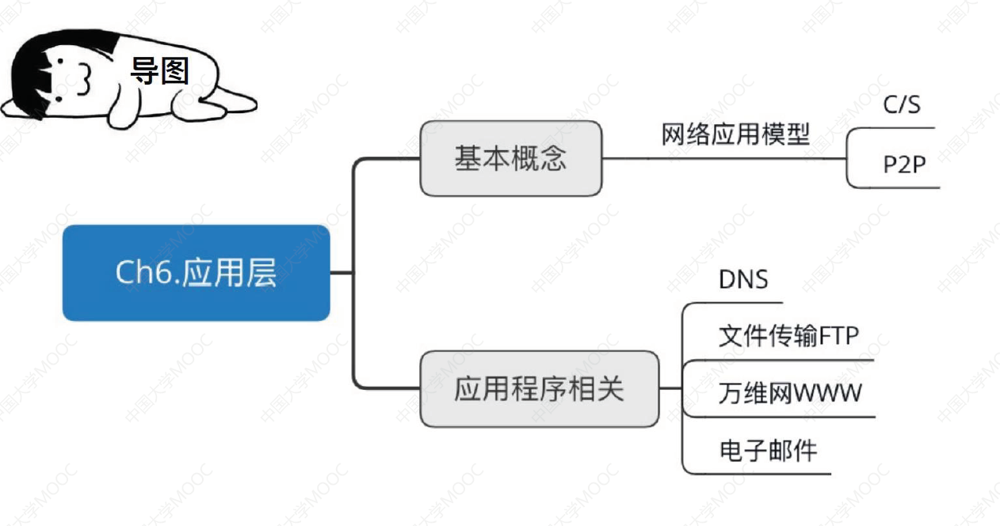

> 本章参考《2023王道·计算机网络考研复习指导》，二者结合，这一章看了笔记直接看书，可以不看视频

## 1.1、网络应用模型

网络应用模型包括客户/服务器模型(CS)，P2P模型(Peer-to-peer)

### 1.1.1、应用层概述

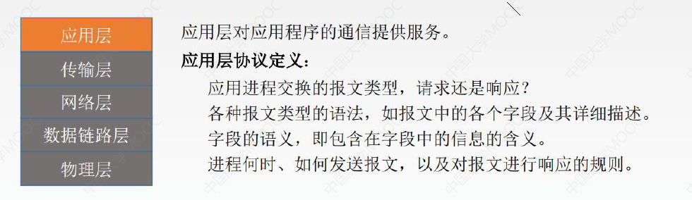

| 应用层的功能           | 应用层的重要协议 |
| ---------------------- | ---------------- |
| 文件传输、访问和管理   | FTP              |
| 电子邮件               | SMTP、POP3       |
| 虚拟终端               | HTTP             |
| 查询服务和远程作业登录 | DNS              |

### 1.1.2、客户/服务器模型(C/S模型)

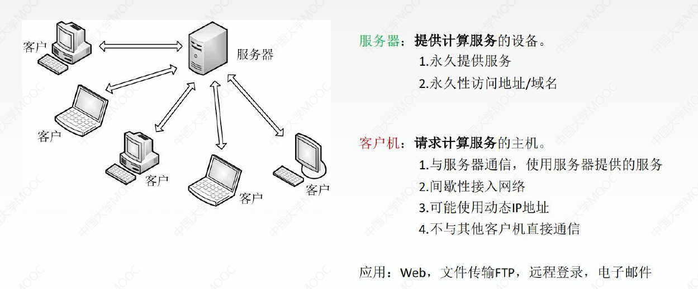

服务器可以理解为另一台永久开机的电脑。服务器一般比较贵.....

### 1.1.3、P2P模型

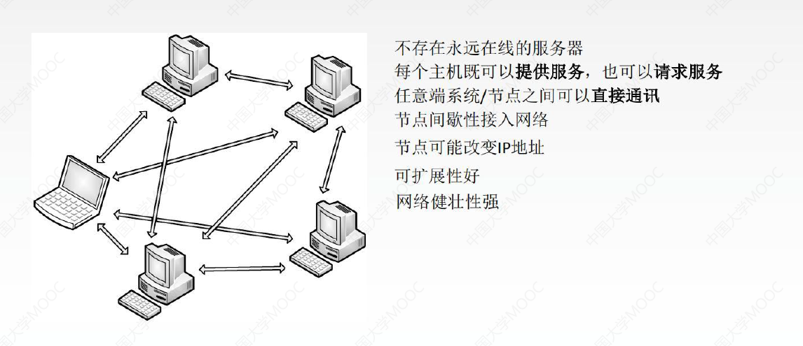

## 1.2、域名解析系统DNS

### 1.2.1、DNS系统

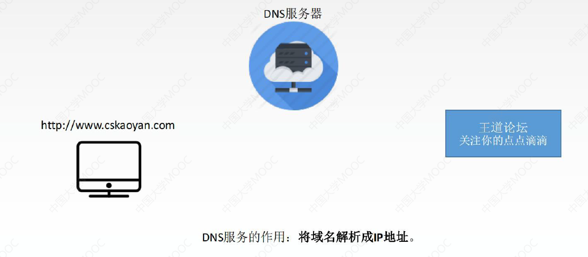

扩展阿里四面：请你谈谈网站是如何进行访问的？

1. 输入一个域名；回车
2. 检查本机的 C:\Windows\System32\drivers\etc\hosts配置文件下有没有这个域名映射；
   - 有：直接返回对应的ip地址，这个地址中，有我们需要访问的web程序，可以直接访问
   - 没有：去DNS服务器找，找到的话就返回，找不到就返回找不到

DNS：全世界的域名都在这里管理

### 1.2.2、域名

域名自左向右：由低到高，其实域名的完整写法在最后有一个点，即：`www.cskaoyan.com.`，这个点就是**根**

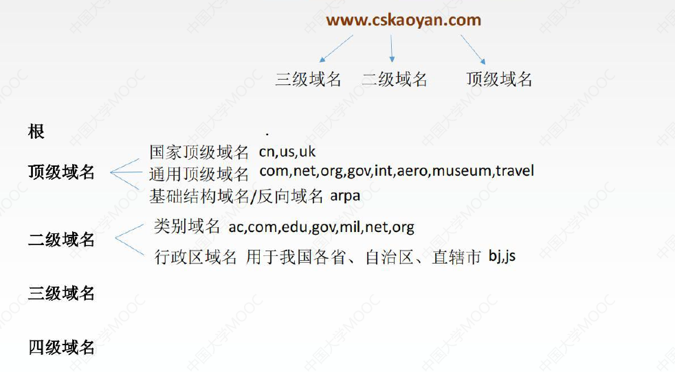

根左边就是顶级域名：

- 国家顶级域名：`.cn`表示中国，`.us`表示美国，`.uk`表示英国
- 通用顶级域名：`.com`表示公司，`.net`表示网络服务机构，`.org`表示非营利性组织，(`.com`比较贵，我上当了😓...)
- 基础结构域名/反向域名：`.arpa` ，用于反向域名解析：即IP地址解析为域名

### 1.2.3、域名服务器

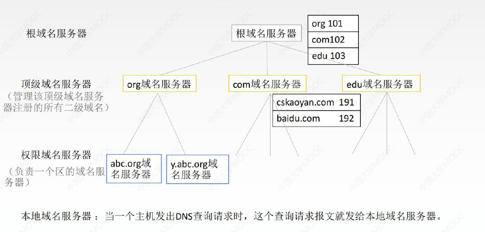

> 只要找到`com`域名服务器，就可以找到 `xxxx.com`的IP地址

### 1.2.4、域名解析过程

域名解析有两种方法：递归查询和迭代查询，两种方法最开始都是要由主机查询本地域名服务器，这样的查询都是使用递归查询

- 递归查询(靠别人)：**主机先寻本地域名服务器**，若没有，**本地域名服务器**再寻根域名服务器，若没有，**根域名服务器**再寻**顶级域名服务器**，若没有，**顶级域名服务器**再寻**权限域名服务器**的帮助
- 迭代查询(靠自己)：**主机先寻本地域名服务器**，若没有，**本地域名服务器**再寻根域名服务器，若没有，**本地域名服务器**再寻**顶级域名服务器**，若没有，**本地域名服务器**再寻**权限域名服务器**的帮助

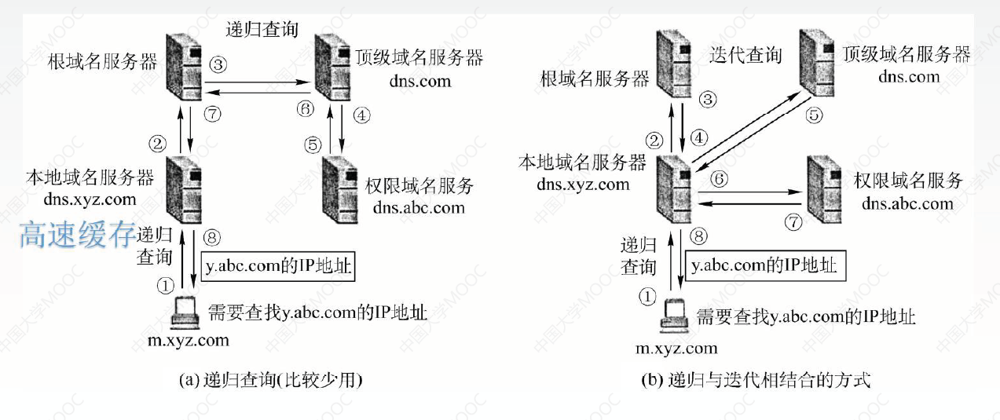

我们普遍使用**高速缓存**，高速缓存可以用来存放最近查过的域名以及从哪里获得这个域名映射信息的记录。因为主机名和IP地址之间的映射不是永久的，所以DNS服务器将在一段时间后丢弃高速缓存中的信息(平常去访问Github速度慢甚至进不去，网上有一种方法修改DNS)

## 1.3、文件传输协议FTP

文件传输协议FTP：上传文件到服务器和从服务器下载文件

### 1.3.1、FTP服务器和用户端

FTP是基于客户/服务器(C/S)的协议。

用户通过一个客户机程序连接至在远程计算机上运行的服务器程序。

- 按照FTP协议提供服务，进行文件传送的计算机就是**FTP服务器**。
- 连接FTP服务器，遵循FTP协议与服务器传送文件的电脑就是**FTP客户端**。

### 1.3.2、FTP工作原理

1. 登录（既可以使用用户名和密码登录，也可以匿名登录）
   - **FTP使用TCP实现可靠传输**。

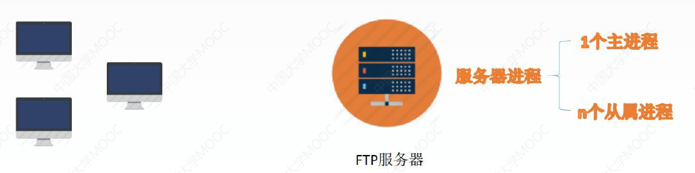

左边是主机，右边是FTP服务器， FTP服务器由一个主进程和n个从属进程组成，主进程负责接收新的请求，从属进程负责处理单个请求。   工作步骤如下：

1. 打开21控制端口，使客户进程能够连接
2. 等待客户进程发连接请求
3. 启动从属进程来处理客户进程发来的请求，主进程与从属进程并发执行，从属进程对客户进程的请求处理完毕后即终止
4. 回到等待状态，继续接收其他客户进程的请求

> 理发店的迎宾就是主进程，里面的托尼老师就是从属进程

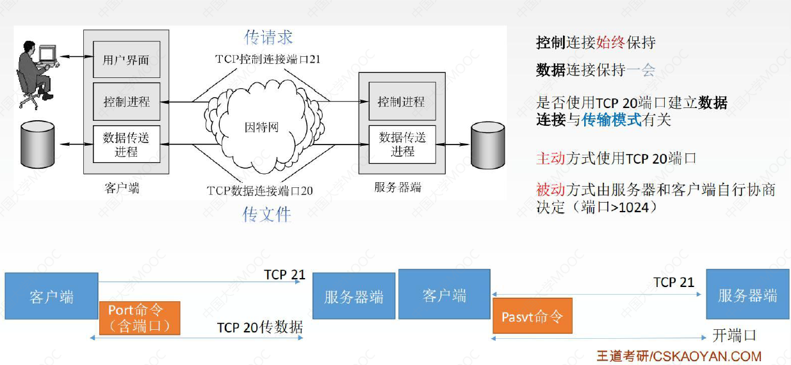

从属进程：控制进程和数据传送进程

- 控制连接端口21，控制连接用来传输控制信息(如：连接请求、传送请求)，FTP客户发出的传送请求，通过控制连接发送给服务器端的控制进程，但控制连接并不用来传送文件。在传输文件时还可以使用控制连接(如客户在传输途中发送一个中止传输的命令)，因此控制连接在整个会话期间**一直保持打开状态。**
-  服务器端的控制进程在接收到FTP客户发来的文件传输请求后，就创建"数据传送进程"和"数据连接"。数据连接用来连接客户端和服务器端的数据传送进程，数据传送进程实际完成文件的传送，在传送完毕后关闭"数据传送连接"并结束允许。

数据连接有两种传输模式：

- 主动模式PORT：客户端连接到服务器的21端口，登录成功后要读取数据时，客户端随机开放一个端口，并发送命令告知服务器，服务器收到PORT命令和端口号后，通过20端口和客户端开放的端口连接，发送数据
- 被动模式PASV：客户端要读取数据时，发送PASV命令道服务器，服务器在本地随机开放一个端口并告知客户端，客户端再连接道服务器开放的端口进行数据传输。
- 无论是主动还是被动模式，选择权在"客户端"，简单概括：**主动模式传送数据是"服务器"连接到"客户端"的端口，被动模式传送数据是"客户端"连接到"服务器"的端口。**

> 数据连接端口不一定永远是20，主动模式使用TCP20端口，被动模式由服务器和客户端自行协商决定，通常端口号>1024

FTP传输模式：

- 文本模式：ASCII模式，以文本序列传输数据
- 二进制模式：Binary模式，以二进制序列传输数据

## 1.4、电子邮件

### 1.4.1、电子邮件的信息格式

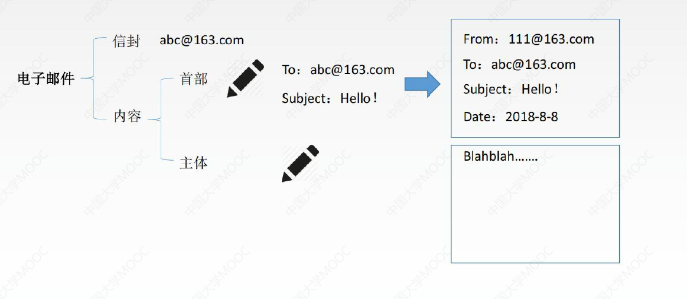

### 1.4.2、电子邮件系统概述

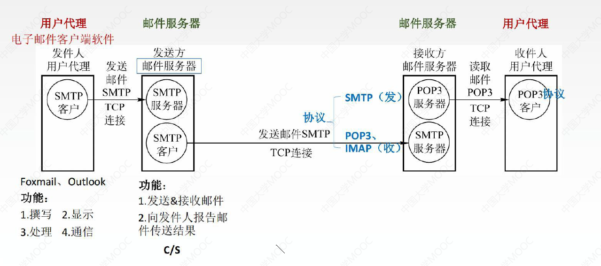

一个电子邮件系统应该具有三个最主要的组成结构：用户代理邮件，邮件服务器和电子邮件使用的协议(如SMTP、POP3等)。发件人有一个用户代理收件人也有一个用户代理，还有发送方邮件服务器和接收方邮件服务器。

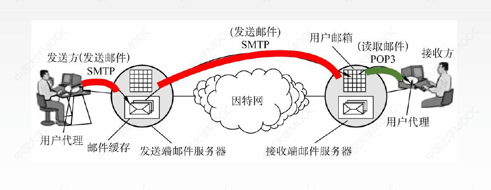

电子邮件的收发过程：

1. 发信人调用用户代理，来撰写和编辑要发送的邮件，用户代理用SMTP把邮件传送给发送端邮件服务器
2. 发送端邮件服务器将邮件放入邮件，缓存队列中等待发送
3. 运行在发送端邮件服务器的SMTP客户进程，发现邮件缓存中有待发送的邮件，就像运行在接收端邮件服务器的SMTP服务器进程发起TCP连接
4. TCP连接建立后，SMTP客户进程开始向远程SMTP服务器进程发送邮件，当所有邮件发完后，SMTP就关闭所建立的TCP连接
5. 运行在接收端邮件服务器中的SMTP服务器进程收到邮件后，将邮件放入收信人的用户邮箱，等待收信人在方便时进行读取
6. 收信人打算收信时调用用户进程使用POP3协议，将自己的邮件从接收端邮件服务器的用户邮箱中取回

## 1.5、电子邮件协议🔥

### 1.5.1、简单邮件传送协议SMTP

SMTP规定了在两个相互通信的**SMTP进程**之间应如何交换信息。负责发送邮件的SMTP进程就是**SMTP客户**，负责接收邮件的进程就是SMTP服务器。

SMTP规定了14条命令(几个字母)和21种应答信息(三位数字代码+简单文字说明)

- SMTP协议是建立在TCP连接之上的，它所使用的端口号是25，使用的是C/S方式
- SMTP通信的三个阶段：连接建立、邮件传送、连接释放

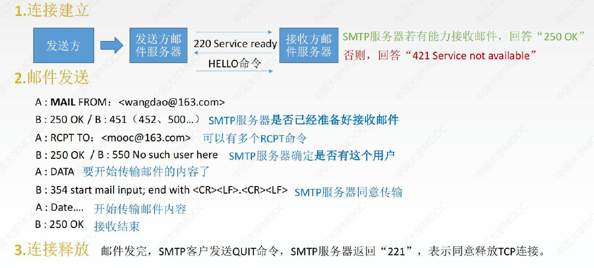

1. 连接建立
   - 发件人的邮件发送到发送方邮件服务器的邮件缓存后，SMTP客户就每隔一定时间对邮件缓存扫描一次。如发现有邮件就使用SMTP熟知的端口号25与接收方的邮件服务器的SMTP服务器建立TCP连接。连接建立后接收方SMTP服务器发出220 Service ready(服务就绪)，然后SMTP客户向SMTP服务器发送HELLO命令，附上发送方的主机名。
   - SMTP不使用中间的邮件服务器， TCP连接总是在发送方和接收方这两个邮件服务器之间直接建立，而不管他们相隔多远，不管在传送过程中要经过多少个路由器，当接收方邮件服务器因故障暂时不能建立连接时，发送方的邮件服务器只能等待一段时间后再次尝试连接
2. 邮件传送
   - 连接建立后，就可以开始传送邮件。邮件的传送从MAIL命令开始，MAIL命令后面有发件人的地址，如 `MAIL FROM：<www.qindalin.com`>
   - 若SMTP服务器已准备好接收邮件，则回答250OK.
   - 接着SMTP客户端发送一个或多个 RCPT （收件人recipient的缩写）命令，格式为 `RCPT TO: <收件人地址>`
   - 每发送一个RCPT命令，都应该有相应的信息从SMTP服务器返回，如 `250 OK` 或者`550 No such user her(无此用户)`
   - RCPT命令的作用是：先弄清接收方系统是否已经做好接收邮件的准备，然后才发送邮件，以便不至于发送了很长的邮件后才知道地址错误，进而避免浪费通信资源
   - 获得OK的回答后，客户端就使用DATA命令，表示要开始传输邮件的内容。

3. 连接释放
   - 邮件发送完毕后，SMTP客户应发送QUIT命令。

> 考试不需要掌握细节，但是复试可能有些老师会问...

### 1.5.2、MIME

SMTP的缺点：

1. SMTP不能传送可执行文件或者其他二进制对象
2. SMTP仅限于传送七位ASCIII码，不能传送其他非英语国家的文字
3. SMTP服务器会拒绝超过一定长度的邮件

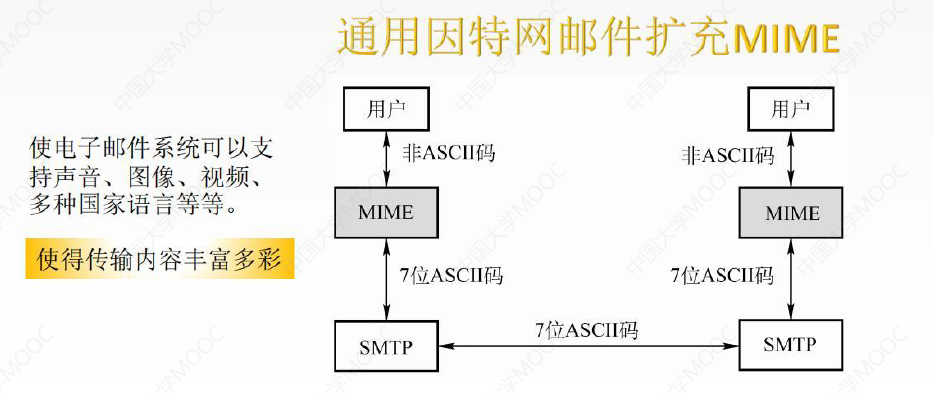

所以提出了**多用途网络邮件扩充MIME**，MIME未改动SMTP或取代它， MIME的意图是继续使用目前的格式，但增加了邮件主体的结构。其实就是将其他国家的文字转化成了7位的ASCII码，再通过SMTP的协议进行邮件的传送。

### 1.5.3、邮局协议POP3

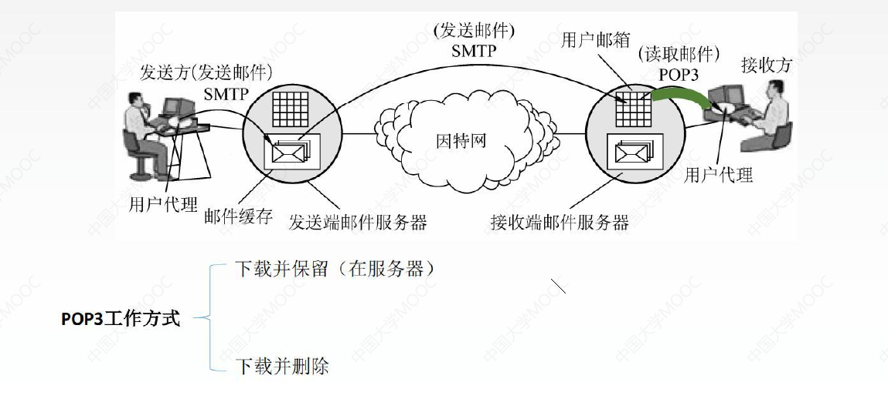

POP3协议是在最后一步采用"拉"的通信方式，当用户读取邮件时，用户代理向邮件服务器发出请求，"拉"取用户邮箱中的邮件。POP3也使用C/S的工作方式，在传输层使用TCP，端口号为110

POP3有两种工作方式：

- 下载并保留(服务器)：用户从邮件服务器上读取邮件后，邮件依然会保留在邮件服务器上，用户可再次从服务器读取该邮件
- 下载并删除：邮件一旦被读取，就从邮件服务器上删除

### 1.5.4、网际报文存取协议IMAP

当用户电脑上的IMAP客户程序打开IMAP服务器的邮箱时，用户可以看到邮箱的首部，若用户需要打开某个邮件，该邮件才上传到用户的计算机上。

IMAP可以让用户在不同的地方使用不同的计算机随时上网阅读处理邮件，还允许只读取邮件中的某一部分（先看正文，有WiFi的时候再下载附件）

### 1.5.5、基于万维网的电子邮件

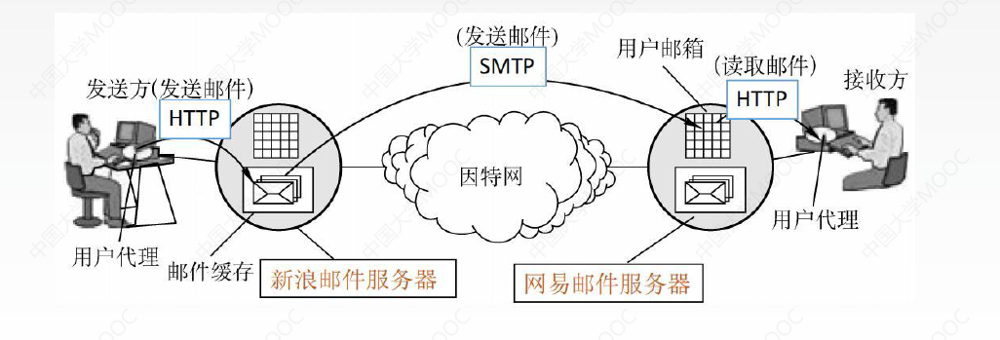

用户浏览器与新浪邮件服务器和网易邮件服务器发送或接收使用的是HTTP而仅在不同邮件服务器之间的传送邮件时才使用SMTP

## 1.6、万维网和HTTP协议

万维网WWW是一个大规模的、联机式的信息存储空间。是无数个网络站点和网页的集合。

万维网的内核部分是由三个标准构成的：

1. **统一资源定位符URL**。负责标识万维网上的各种文档，并使每个文档在整个万维网的范围内具有唯一的标识符URL。（URL不区分大小写）
   - ==<协议>://<主机>:<端口>/<路径>==
   - https://www.qindalin.com，点击这个超链接获取资源，这些资源通过超文本传输协议HTTP传送给使用者
2. **超文本传输协议HTTP**：一个应用层协议，它使用TCP连接进行可靠的传输，HTTP是万维网客户程序和服务器程序之间交互所必须严格遵守的协议。
3. **超文本标记语言HTML**：一种文档结构的标记语言，它使用一些约定的标记，对页面上的各种信息(包括文字，声音，图像，视频等)格式进行描述

> 万维网以客户/服务器方式工作，用户使用的浏览器就是万维网客户程序，万维网文档所驻留的主机运行服务器程序。万维网使用超文本标记语言HTML，使得万维网页面设计者可以很方便的从一个界面的链接转到另一个界面，并能够在自己的屏幕上显示出来

### 1.6.1、超文本传输协议HTTP

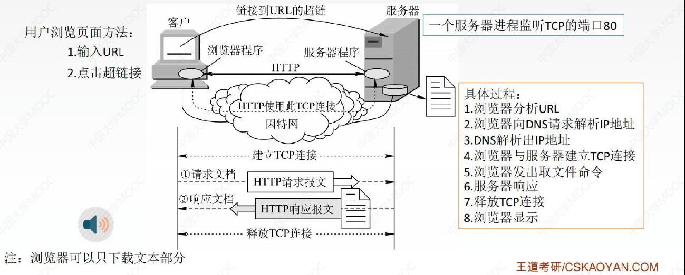

HTTP协议定义了浏览器怎样向万维网服务器请求，万维网文档以及服务器怎样把文档传送给浏览器。

用户点击https://www.qindalin.com 所发生的事件按顺序如下：

1. 浏览器分析链接指向页面的URL
2. 浏览器向DNS请求解析https://www.qindalin.com的IP地址
3. 域名系统DNS解析出此链接服务器的IP地址
4. 浏览器与该服务器建立TCP连接（默认端口号为80）
5. 浏览器发出HTTP请求：get请求或post请求以及其他请求
6. 服务器通过HTTP响应响应浏览器
7. 释放TCP连接
8. 浏览器显示web页面

### 1.6.2、HTTP协议的特点

1. HTTP协议是无状态的。也就是说，同一个客户第2次访问同一个服务器上的页面是服务器的响应与第1次被访问时的相同，因为服务器并不记得曾经访问过这个客户，也不记得为该客户曾经服务过多少次。
2. 但是在实际工作中，一些万维网站点常常希望能够被用户识别，这个时候就需要一个东西叫做cookie。cookie是存储在用户主机中的文本文件(就是在磁盘中)，记录一段时间内某用户的访问记录。
3. HTTP采用TCP作为运输层协议，但**HTTP协议本身是无连接的**（通信双方在交换HTTP报文之前，不需要先建立HTTP连接）
4.  HTTP有两种连接方式
   - 持久连接：万维网服务器在发送响应后，仍然保持这条连接，使同一个浏览器和该服务器可以继续在这条连接上传送后续的HTTP请求和响应报文
     - 非流水线：客户在收到前一个响应后才能发出下一个请求，服务器发送完一个对象后，其TCP连接就处于空闲状态，浪费了服务器资源。
     - 流水线：客户每遇到一个对象，引用就立即发出一个请求，因而客户可以逐个的连续发出对各个引用对象的请求。HTTP/1.1的默认方式是使用流水线的持久连接
   - 非持久连接：对于每个网页元素对象(图像、文字)的传输，都需要单独建立一个TCP请求

### 1.6.3、HTTP协议的连接方式

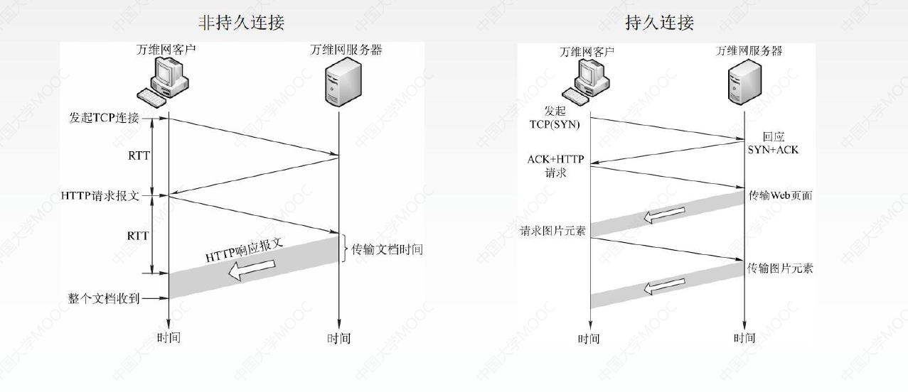

如上左图：发起TCP连接需要进行三次握手，三次握手的前两部分经过之后，也就是经过了一个RTT事件，第3次握手的报文段中捎带了客户对万维网文档的请求，万维网服务器返回一个HTTP响应报文，这个报文是有长度的，需要经过一定的时间才能将整个文档收到完整的报文。所以非持久时间 = 2RTT+该文档的传输时间。

如上右图：发起TCP连接仍然需要三次握手，但是如果再发起请求新的图片元素或者发起新的报文，就不需要再建立TCP连接，在之前建立好的连接基础上继续发送。

### 1.6.4、HTTP的报文结构

HTTP的报文，包括响应报文和请求报文， HTTP报文是面向文本的，因此在报文中的每一个字段都是一些ASCII码串。

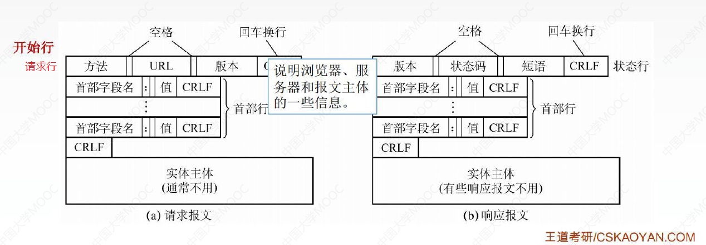

请求报文：请求行、首部行、实体主体

响应报文：状态行、首部行、实体主体

- 请求报文和响应报文的第一行都可以叫做开始行。**开始行用于区分是请求报文还是响应报文**，在请求报文的开始行称为**请求行**，在响应报文的开始行称为**状态行**
- 请求报文的请求行有三个内容：方法、请求资源的URL、HTTP的版本
- 首部行：用来说明浏览器、服务器和报文主体的一些信息，首部行都有首部字段名，每一行都有回车换行，结束也有回车换行

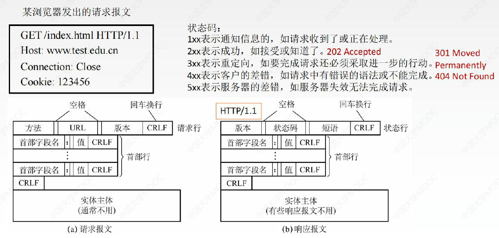

