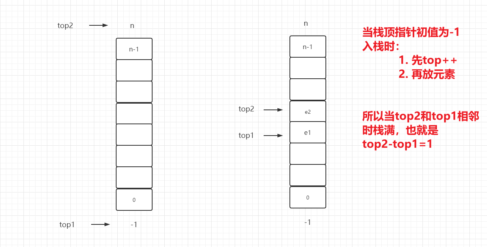
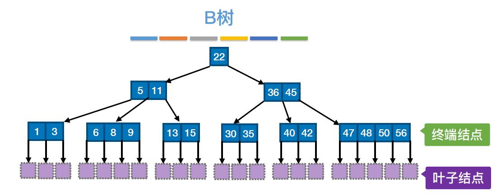

# 1、线性表

1. 算法原地工作的含义是：==算法需要的辅助空间是常量，即O(1)==
2. (在相同规模n下)，复杂度为O(n)的算法在时间上总是优于复杂度为O(n^2^)的算法。

$$
O(1)<O(log_2n)<O(n)<O(nlog_2n)<O(n^2)<O(n^3)<O(2^n)<O(n!)<O(n^n)
$$

3. 时间复杂度：O(F(n))意味着算法在最坏情况下，**问题规模为n的前提下**，所花费的时间≤C×F(n)，其中C是常数。
   - 某算法的时间复杂度为O(n^2^)，**问题规模也是n**，因为问题规模是在描述时间复杂度之前就已经规定好了。
   - 某算法的时间复杂度为O(n^2^)，**其实就是说算法的执行时间≤Cn^2^，也就是执行时间与n^2^成正比**。
4. **编译**和**解释**可统称为**翻译**
   - 编译：将高级语言编写的源程序全部语句一次全部翻译成机器语言程序，而后再执行机器语言程序（只需翻译一次，会产生中间文件）
   - 解释：将源程序的一条语句翻译成对应于机器语言的语句，并立即执行。紧接着再翻译下一句（每次执行都要翻译，不会产生中间文件）
   - 语言级别**越高**，执行效率**越低**。


5. 算法的时间复杂度取决于：**问题的规模**和**数据的状态**(例如正序、逆序的数据元素)
   - **加法规则：多项相加，只保留最高阶的项，且系数变为1**   `O(m)+O(n)=O(max{m,n})`
   - **乘法规则：多项相乘，都保留**                                    `O(m)×O(n)=O(mn)`


6. 线性表：==相同数据类型、有限数据元素、序列==
   - 线性表**可以为空**
   - 线性表中的元素可以是**无序**的
7. **顺序表**三大操作

| 操作               | 平均比较次数（平均移动元素） | 时间复杂度 |
| ------------------ | ---------------------------- | ---------- |
| 插入操作           | n/2                          | O(n)       |
| 删除操作           | (n-1)/2                      | O(n)       |
| 查找操作(按值查找) | (n+1)/2                      | O(n)       |

8. 顺序表的**元素地址必须是连续**的，==单链表的结点内存储单元地址==必须是连续的。
   - 单链表**各个不同结点的存储空间可以不连续**，但是**结点内的存储单元地址必须连续**(也就是data和next指针占有的空间必须是连续的)。
   - ==顺序表既可以顺序存取，也可以随机存取。链表只能进行顺序存取。==
     - 随机存取：想取哪个就取哪个，通过数组下标进行访问
     - 顺序存取：从第一个开始访问，依次向后访问
   - **链表插入和删除操作，只需要修改链表中结点指针的值，不需要移动元素就可以高效地实现插入和删除操作。链表采用链接方式存储线性表，适用于存储空间需求不确定的情形，不必事先估计存储空间。**
   - ==顺序表就是数组==，实现随机存取，==并且在最后位置插入、删除方便==。
     - n个元素的顺序表中，第i个结点是a[i-1]，最后一个结点是a[n-1]，之所以说在最后位置插入、删除方便，是因为最后一个结点的后面我们仍然可以直接访问到。
     - a【0】是首地址Loc(L)，则第n个元素地址 = 首地址Loc(L) + (n-1)×数据元素大小
   
   
   
   - 链表和顺序表**所需要的空间**都与**线性表长度成正比**。
   - 若要交换元素的值，例如交换第3个和第4个元素的值。在顺序表中，直接对3、4号元素的值进行更改，但是在链表中需要顺序访问1、2号元素的指针，才能找到3号数据的位置，进而再对3、4号元素的值进行修改。
   - 若要**顺序输出**线性表的中的值，那么顺序表和链表都是顺序读取，时间复杂度都是O(n)
   - 链式存储用指针表示逻辑结构，所以**链式存储结构比顺序存储结构能更方便地表示各种逻辑结构**，而顺序存储只能用物理上的邻接关系来表示逻辑结构。

```cpp
// 双循环链表p后面跟一个就是指针，p后面跟两个就是结点的指针

// s的右指针指向p
s->rlink = p;
// s的左指针指向p的左指针指向(也就是两个指针指向相同)
s->llink = p->llink;
// s的左结点的右指针指向s
p->llink->rlink = s;


// p的下一个结点的前向指针指向p的前向指针的指向(也就是两个指针指向相同)
p->next->prev = p->prev;
```

---

> 做题画图必背🔥

顺序表：注意下标和位置的关系，例如有些题说在第i个位置插入元素，则i的范围为： `1≤i≤n+1`，从第一个位置到第n+1个位置，n+1也就相当于在表尾追加。


不带头结点的单链表：


带头结点的单链表：


仅有尾指针的单链表：


带头结点的循环单链表：


带尾指针的循环单链表：


带头结点的双链表：


带头结点的循环双链表：


---


9. 链表插入、删除的本质就是找**前驱、后继**，==插入到哪个位置就找那个位置的前驱和后继，删除哪个位置就找那个位置的前驱和后继。==

   - 对于双向循环链表：前驱`p->prev`，后继`p->next` 都好找，所以必然插入、删除的时间复杂度为`O(1)`

   - 在顺序表中删除第i个元素，或者在第i个元素之后插入新元素，时间复杂度都是O(n)

   - 在链表中**插入删除元素时间复杂度都是O(1)**：❗注意❗，我们有时候在题中看到使用链表插入删除的时间复杂度为`O(n)`，这其实包含两个操作：查找这个结点：O(n)，删除这个结点：O(1)。所以我们常说链式存储方式能更快的实现插入和删除操作。

   - 例如：在已知头指针的单链表中，要在尾部插入一个新结点和删除第一个元素，其时间复杂度为`O(1)+O(n)`

     删除第一个元素，就找第一个元素的前驱和后继。插入一个新结点，就找新结点位置的前驱和后继。

     

   - 例如：在已知头指针的双链表中，要在尾部插入一个新结点和删除第一个元素，其时间复杂度为`O(1)+O(n)`

     

   - 例如：在已知头指针的循环单链表中，要在尾部插入一个新结点和删除第一个元素，时间复杂度为`O(1)+O(n)`

     

   - 例如：在已知尾指针的循环单链表中，要在尾部插入一个新结点和删除第一个元素，时间复杂度为`O(1)`

     

10. 顺序表按值查找`O(n)`，按位查找`O(1)`，链表无论是按值还是按位查找都是`O(n)`

    - 按值查找二者都是顺序查找，此时顺序表没有优势，二者查找效率相同。
    - 按位查找顺序表是随机访问，效率更快，而链表只能顺序访问。


11. 可以用 **抽象数据类型ADT** 来定义一个完整的数据结构。
    - 抽象数据类型ADT包括 **数据对象(数据)、数据关系、基本操作集**
12. 线性结构(一对一)：**线性表、栈、队列、双队列、数组、串**，非线性结构(非一对一)：**二维数组、多维数组、广义表、树、图**，顺序存储结构不仅可以存储线性结构，也可以存储非线性结构，例如树、图等。
14. 有序表：关键字有序的线性表，仅描述元素间的逻辑关系，不在乎存储结构，因为只需要描述有顺序的逻辑即可。
    - 所以属于逻辑结构的就是：**有序表**
    - 有的题问哪个属于逻辑结构，也就是仅指定逻辑结构而不指定存储结构，只需要看题中是不是指定了存储结构。例如顺序表指定顺序存储，则描述了存储结构；哈希表指定散列存储，则描述了存储结构；单链表指定链式存储，则描述了存储结构；有序表顺序存储和链式存储均可，则未指定存储结构，属于逻辑结构
    - 有的题问哪个属于存储结构，也就是仅指定存储结构而不指定逻辑结构，只需要题中是不是指定了存储结构。例如链表指定链式存储，则属于存储结构，哈希表指定散列存储，则属于存储结构。
14. 存储数据时，不仅要存储各数据元素的值，而且要存储**数据元素之间的关系**。
15. 计算时间复杂度问题：**若内层外层没有关系**，可以先算外层再算内层，然后相乘。**若内层外层有关系**，则通过外层来计算内层执行次数，最终将执行次数相加。
16. 头指针为L，带头结点的单链表为空：`L->next=null` ，不带头结点的单链表为空：`L=null`
    - 带头结点的双循环链表为空：`L->prior ==L && L->next ==L` ，头指针的前驱和后继都指向自身
    - 


17. 在插入、删除操作中，双链表可以更容易找到前驱和后继，虽然花费的时间少了，但是因为修改了更多的指针指向，所以相比起单链表，操作更复杂了。**相当于用更多的操作换取更少的时间**。

18. 静态链表

    - 静态链表需要分配比较大的连续空间

    - 静态链表在插入、删除元素时不需要移动元素，只需要修改指针


19. 若题目中说"链表不带头结点，但是却有表头指针"，这个时候表头指针指向的是就是第一个数据元素。也就是：
    1. 链表带头结点，同时有表头指针，此时表头指针指向的就是头结点。插入删除只能在头结点右边进行。
    1. 链表不带头结点，但是有表头指针，此时表头指针指向的是第一个数据元素，插入删除在第一个数据元素左右两边均可执行。

> 头指针必有，有头结点就指向头结点；没头结点就指向第一个数据元素


42页第8题

49页15题


# 2、栈和队列

1. 栈只能在栈顶进行插入删除，具有==先进后出==
2. 队列只能在队尾插入，在队头删除，具有 ==先进先出==
3. 综合1和2，所以说==栈和队列都是限制存取点的线性结构==。
4. 栈和队列**都具有相同的逻辑结构**，逻辑结构就是线性和非线性结构，**二者都是线性结构**。存储结构分为顺序存储和链式存储结构，二者均可实现顺序存储和链式存储。
5. 顺序栈在插入、删除操作上比**链栈复杂度更低**，因为栈只能在栈顶进行插入、删除，而顺序表在表尾插入、删除的时间复杂度都是O(1)。==栈的存取时间复杂度都是O(1)==。链栈有一个比较明显的优势，那就是**通常不会出现栈满的情况**。

> 分析题画图必备🔥

栈顶指针分为两种：一种是栈顶指针指向栈顶元素，另一种是栈顶指针指向栈顶元素的下一个位置

1. **栈顶指针指向栈顶元素(也就是初值指向-1)**。
   - 这种情况下**初始化**：`top=-1`
   - 这种情况下**判断是否为空栈**：判断top指针是否是-1
   
   - 这钟情况下**入栈**：先让`top++`，然后将元素放入top所指向的 a1 处
   - 这种情况下**出栈**：先让元素出栈，然后`top- -`
   - 这种情况下**栈满**：`top=MaxSize-1`


2. **栈顶指针指向栈顶元素的下一个位置**
   - 这种情况下**初始化**：`top=0`
   - 这种情况下**判断是否为空栈**：判断top指针是否是0
   
   - 这钟情况下**入栈**：先将元素a1放入top所指向的位置，然后 `top++`
   - 这种情况下**出栈**：先让`top- -`，然后将元素出栈
   - 这种情况下**栈满**：`top=MaxSize`


上述情况也适合不带头结点的链栈，对于带头结点的链栈：==top指针指向的就是头结点==


> **不带头结点的链栈，top指针指向第一个数据元素，带头结点的链栈，top指针指向头结点**


3. 共享栈的好处是：节省存储空间，降低发生上溢的可能

   - 栈的空间是 0~预设空间上限，所以只可能发生**上溢**。

   - 当第一个栈顶指针top1初值是-1，第二个栈顶指针top2初值为n。栈满的条件为`top2-top1=1`

     

   - 当第一个栈顶指针top1初值是0，第二个栈顶指针top2初值为n-1。栈满的条件为`top1-top2=1`

     

---

4. 队列有两种：一种是队尾指针 rear 指向队尾元素的下一个位置(**循环队列**)，一种是队尾指针指向队尾元素

   1. **队头指针 front 指向队头元素，队尾指针 rear 指向队尾元素的后一个位置(下图红色单元不存储元素)**

      - **初始化队列**：队头、队尾指针指向0  `rear = = front = = 0`
   
      - **判断队列是否为空**：队头、队尾指针是否指向0
   
      - **入队**：将元素放入队尾指针所指向的位置，然后再将队尾指针rear向后移动一位(入队队尾指针`rear++`)，入队操作：==(rear+1) % MaxSize== 。【这里的MaxSize就是队列的最大容量，例如队列是数组A[0，n]，那么容量就为n+1】。==所以队尾指针 rear 其实是从队头指向队尾，再从队尾指向队头，这样循环移动==
   
      - **出队**：front指针依次向后移动，当front指针和rear指针指向相同，则队列为空(出队队头指针`front++`)，出队操作：==(front+1) ％ MaxSize==
   
      - **队满的条件**：队尾指针+1=队头指针     `(Q.rear+1) % MAXSIZE == Q.front`
   
      - **队空的条件**：队尾指针和队头指针指向相同均指向0    `Q.rear == Q.front ==0`
   
      - **队列元素的个数**：(队尾指针+最大队元素-队头指针)对最大队元素取余     `(rear+MaxSize-front) % MaxSize`
   
        
   
   
   2. **队尾指针指向队尾元素**
   
      - **初始化队列**：队头指针指向0，队尾指针指向n-1的位置  `rear = n-1，  front =  0`
   
      - **判断队列是否为空**：队尾指针的下一个位置是不是队头指针 `(rear+1) % MaxSize = front`
   
      - **入队**：队尾指针`rear++`，然后放入元素。入队操作：==(rear+1) % MaxSize== 。
   
      - **出队**：front指针依次向后移动，当front指针和rear指针指向相同，则队列为空(出队队头指针`front++`)，出队操作：==(front+1) ％ MaxSize==
   
      - **队满的条件**：队尾指针+2=队头指针     `(Q.rear+2) % MAXSIZE == Q.front`
   
      - **队空的条件**：队尾指针的下一个位置指向队头    `(rear+1) % MaxSize = front`
   
        
   
   > 上述两种情况都是牺牲一个存储单元，牺牲的都是队尾的最后一个单元。
   >
   > 也有些题牺牲队头的第一个单元，例如循环队列，front指向队头元素的前一个位置1，rear指向队尾元素，这种情况下牺牲的就是第一个单元。【王道队列选择第6题】

5. 当然对于上述循环队列判断队满，有三种方式可以判断
   1. 方案一：浪费一个存储单元
      - 队满的条件：队尾指针+1=队头指针     `(Q.rear+1) % MAXSIZE == Q.front`
      - 队空的条件：对尾指针和队头指针指向相同    `Q.rear == Q.front`
      - 队列元素的个数：(队尾指针+最大队元素-队头指针)对最大队元素取余     `(rear+MaxSize-front) % MaxSize`
   2. 方案二：不浪费一个存储单元，用一个 size 
      - 队空的条件：size值为0，因为size表示队内元素个数  `Q.size == 0`
      - 队满的条件：size值等于最大队元素   `Q.size == MaxSize`
   3. 方案三：不浪费存储单元，用一个 tag 标记
      - tag=0时，若因删除导致`Q.rear==Q.front`,则为队空
      - tag=1时，若因插入导致`Q.rear==Q.front`,则为队满

---


6. 栈的应用

   - **中缀转后缀手算**：根据==左优先==确定中缀表达式的运算符的先后顺序，按照 [左操作数 右操作数 运算符] 的方式组合成一个新的操作数

     

   - **中缀转后缀机算**：从左到右扫描🔥

     1. 遇到**操作数**。直接加入后缀表达式
     2. 遇到**界限符**。遇到左括号 `(` 直接入栈；遇到右括号 `)` 则依次弹出栈内运算符并加入后缀表达式，直到弹出左括号`(` 为止。注意：左括号`(` 不加入后缀表达式。
     3. 遇到**运算符**。依次弹出栈p中**优先级(乘除优先级高于加减)**高于或等于当前运算符的所有运算符，并加入后缀表达式，若碰到 `(` 或栈空则停止。之后再把当前运算符入栈。

     

   - 中缀转前缀手算：根据==右优先==确定中缀表达式的运算符的先后顺序，按照 [左操作数 右操作数 运算符] 的方式组合成一个新的操作数

   - 后缀转中缀：从左往右扫描，每遇到一个运算符，就让==运算符插入前面最近的两个操作数之间，然后操作数两边带上括号==

     

   - 后缀表达式手算：给你一个后缀表达式，计算它的值。从左往右扫描，每遇到一个运算符，就让==运算符前面最近的两个操作数执行对应运算==，==合体为一个操作数==。

   - 后缀表达式机算

     1. 从左往右扫描下一个元素
     2. 若扫描到操作数则压入栈
     3. 若扫描到运算符，则弹出两个栈顶元素，执行运算符运算，运算结果压回栈顶。

   - 中缀表达式机算：初始化两个栈，==操作数栈==和==运算符栈==。🔥

     1. 若扫描到操作数，则压入操作数栈
     2. 若扫描到运算符或界限符，则按照 "中缀转后缀" 相同的逻辑压入运算符栈(==期间也会弹出运算符，每当弹出一个运算符时，就需要再弹出两个操作数栈的栈顶元素并执行相应运算，运算结果再压回操作数栈==)

     

     

---

栈的应用：

- 递归
  - 函数执行顺序为 main()函数->A函数->B函数，则从栈底到栈顶依次为 main()->A->B
  - 函数调用时，将**调用返回地址、实参、局部变量**都会存在栈中
- 进制转换
- 迷宫求解
- 括号匹配

队列的应用：

- 缓冲区：打印机缓冲区等
  - 但是有一个缓冲区不是队列：输入缓冲区。(输入账号密码那个框，是后进先出)

- 页面置换算法


# 3、串

- 串的存储方式有两种，顺序存储和链式存储，顺序存储由分为定长存储和堆分配存储(可以改变大小)。

- 串的模式匹配：在主串中找到与模式串相同的子串，并返回其所在位置。
- 朴素模式匹配算法(简单模式匹配算法)思想：将主串中的模式串长度相同的子串搞出来，挨个与模式串对比，当子串与模式串某个对应字符不匹配时，就立即放弃当前子串，转而检索下一个子串
- 若模式串长度为 m，主串长度为 n，则直到匹配成功/匹配失败最多需要 ==(n-m+1)*m== 次比较
  - **最坏时间复杂度**：==O(nm)==
  - 最坏情况：每个子串的前 m-1 个字符都和模式串匹配，只有第 m 个字符不匹配
  - 比较好的情况：每个字符的第一个字符就与模式串不匹配，长度为 n 的主串中有 ==n-m+1== 个长度为 m 的子串，每个子串只需要对比一个字符，所以匹配失败的最好时间复杂度为：O(n-m+1)= O(n-m) ≈ O(n) 


朴素模式匹配算法的缺点：当某些子串与模式串能部分匹配时，==主串的扫描指针i经常回溯==，导致时间开销增加。最坏的时间复杂度`O(nm)`

KMP算法：当子串和模式串不匹配时，主串指针i不回溯，模式串指针 j=next[j] ，算法的平均时间复杂度：`O(n+m)`


KMP算法：

- 对于串`'abaabc'` ，若 next数组第一位是-1，则序号从0开始，next数组 = 最长前后缀相等长度

| 序号     | 0    | 1    | 2    | 3    | 4    | 5    |
| -------- | ---- | ---- | ---- | ---- | ---- | ---- |
| 模式串   | a    | b    | a    | a    | b    | c    |
| next数组 | -1   |      |      |      |      |      |

- 对于串`'abaabc'` ，若 next数组第一位是0，则序号从1开始，next数组 = 最长前后缀相等长度 + 1

| 序号     | 1    | 2    | 3    | 4    | 5    | 6    |
| -------- | ---- | ---- | ---- | ---- | ---- | ---- |
| 模式串   | a    | b    | a    | a    | b    | c    |
| next数组 | 0    |      |      |      |      |      |

搞懂next数组存在的意义，**当匹配失败时，模式串的指针指向next数组处**。

例如主串T=`'abaabaabcabaabc'`，模式串为 `'abaabc'` ，采用KMP算法进行模式匹配

| 序号     | 0    | 1    | 2    | 3    | 4    | 5    |
| -------- | ---- | ---- | ---- | ---- | ---- | ---- |
| 模式串   | a    | b    | a    | a    | b    | c    |
| next数组 | -1   | 0    | 0    | 1    | 1    | 2    |

- 设序号从0开始，指针i指向主串，指针j指向模式串，当第一次匹配失败时，i=j=5，下一次匹配时主串的指针i不动，j跳转指向next[j]=next[5]=2处，也就是j=2。说明接下来模式串从ab`aabc` 从第3个a开始和主串匹配
- 第一次匹配比较6次，第二次匹配只需比较4次，总共比较10次就可以匹配成功


# 4、树


度为2的树和二叉树的区别：

1. 度为2的树和二叉树的每个结点都最多只能有两个孩子。
2. 度为2的树至少有一个结点的度是2，但是二叉树允许所有结点的度都小于2。
3. 度为2的树一定是非空树，至少有2+1=3个结点。**二叉树可以为空树**。

> 二叉树是有序树，即使树中结点只有一棵子树，也要区分它是左子树还是右子树。

度为2的有序树就是二叉树。（×）在二叉树中，若某个结点只有一个孩子，则这个孩子的左右次序是确定的，而在度为2的有序树中，若某个结点只有一个孩子，则这个孩子就无序区分左右次序。


---

- 树的结点数为n，边数是n-1，再添一条边一定会形成一个环。
- n 个结点的二叉树，有 n + 1 个空链域。我们可以利用这些空链域来记录前驱、后继的信息。
  - 理解一：n个结点，共有2n个指针，有n-1条边(用掉n-1条指针)，则还剩空指针 2n-(n-1)=n+1 
  - 理解二：线索只能由 n~0~、n~1~构成，n~0~提供两条线索，n~1~提供一条线索，2n~0~+n~1~ = n~0~+(n~2~+1)+n~1~=n+1
- 对于任何一棵二叉树，高度可能为  ⌈ log~2~ (n+1)⌉ ~ n 或  ⌊log~2~ n⌋ + 1 ~ n
  - 完全二叉树的高度最小为  ⌈ log~2~ (n+1)⌉  或  ⌊log~2~ n⌋ + 1 
  - 高度最高就是每层一个结点，共n层
- 若二叉树采用二叉链表结构，则链表中只有孩子结点的地址，而无双亲结点的地址，而遍历过程中又需要结点的双亲结点的地址，为此，遍历操作设置一个栈来达到这个目的。**如果不设置栈，则需要采用三叉链表结构**，因此三叉链表中除了孩子结点的地址以外，还保存了结点的双亲结点的地址。

- 前序序列和后序序列不能唯一的确定一棵二叉树，但是可以确定二叉树中结点的祖先关系。当两个结点的前序序列为XY，后续序列为YX时，则X为Y的祖先。
  - 例如前序序列为 a e b d c，后序序列为 b c d e a ，可知 a 为根结点，e 为 a 的孩子结点。
  - 此外，由 a 的孩子结点的前序序列 e b d c，后序序列 b c d e，可知 e 是 b c d 的祖先


---

## 4.1、树的性质

**树的性质：**

1. 结点数 = 总度数(总边数)+1

2. 度为 m 的树第 i 层至多有 m^i-1^ 个结点
   $$
   假设每层都是满的 \\
   第一层m^0 \\
   第二层m^1 \\
   第三层m^2 \\
   .... \\
   第i层m^{i-1} 
   $$

3. 高度为 h 的 m 叉树至多有 (m^h^ -1)/(m-1) 个结点
   $$
   假设每层都是满的 \\
   m^0+m^1+m^2+...+m^{h-1} = \frac{m^h-1}{m-1}
   $$

4. 具有n个结点的m叉树的最小高度为
   $$
   最小高度也就是每层都是满的 \\
   \frac{m^h-1}{m-1} = n \\
    h=[log_m(n(m-1)+1)]   \\
    之所以向上取整的原因是即使最后一层有一个结点也得算一个高度
   $$

5. 高度为 h 的 m 叉树至少有 h 个结点

   高度为 h、度为 m 的树至少有 h+m-1 个结点

---

## 4.2、二叉树的性质

**二叉树的性质**：

1. n~0~ = n~2~ + 1，(叶子结点比二分支结点多一个)
2. 二叉树第 i 层至多有 2^i-1^ 个结点(对应树的性质)
3. 高度为 h 的二叉树至多有 2^h^ -1 个结点(也就是满二叉树)

---

## 4.3、完全二叉树的性质

**完全二叉树的性质**：


1. 只有最后两层可能有叶子结点。对于最大层次中的叶子结点，都依次排列在该层最左边的位置上。

2. 同时只能有一个度为1的结点，且该结点只有左孩子而无右孩子。

3. 按层序编号后，某结点 i 为叶子结点或只有左孩子，则编号大于 i 的结点均为叶子结点。

   - 例如结点6只有左孩子，则编号大于6的均为叶子结点

4. 若n为奇数，则每个分支结点都有左孩子和右孩子，若n为偶数，则编号最大的分支结点(编号为n/2)只有左孩子，没有右孩子，其他分支结点左、右孩子都有。

5. 若结点 i ≤ ⌊n/2⌋ ，则结点为分支结点，否则为叶子结点
   $$
   i ≤ ⌊\frac{n}{2}⌋ 为分支节点 \\
   例如结点6 ≤ \frac{12}{2} ，则结点6为分支结点
   $$

6. 第一层有2^0^个结点，第二层有2^1^个结点，第三层有2^2^个结点....

6. 按层序从 1 开始编号，结点 i 的左孩子为 2i，右孩子为 2i+1，结点 i 的父结点为  ⌊i/2⌋

   - 例如结点5的左孩子为 2i=2×5=10，右孩子为 2i+1=11，父结点为 2

7. 结点 i 所在所在层次(高度/深度)为  ⌊log~2~ i⌋ +1 

   - 例如结点8所在高度为 4

8. n个结点的完全二叉树的高度为 ⌈ log~2~ (n+1)⌉ 或  ⌊log~2~ n⌋ + 1

9. 完全二叉树中n~1~=0或1
   $$
   \begin{cases} n_0+n_1+n_2=总结点数 \\n_0=n_2+1  \end{cases} 
   $$
   
   $$
   (2n_2+1)+n_1=总结点数 \\
   若总结点数为偶数,因为(2n_2+1)为奇数,则n_1=1,n_0=k,n_2=k-1 \\
   若总结点数为奇数,因为(2n_2+1)为奇数,则n_1=0,n_0=k,n_2=k-1 
   $$
   
   


---

## 4.4、满二叉树的性质

**满二叉树的性质**：一棵高度为 h，且含有 2^h^ -1 个结点的二叉树


1. 前h-1层结点总数 = 第h层结点数 - 1
1. 只有最后一层有叶子结点，且不存在度为 1 的结点

---

## 4.5、线索二叉树的性质

**线索二叉树**：

- 中序线索二叉树 ➡ 线索指向中序前驱、中序后继
- 先序线索二叉树 ➡ 线索指向先序前驱、先序后继
- 后序线索二叉树 ➡ 线索指向后序前驱、后序后继

所以对二叉树进行中序线索化，我们就先对二叉树进行中序遍历，然后对结点进行线索：**结点若无左右孩子，则左指针指向中序序列的前驱，右指针指向中序序列的后继**。

- 线索二叉树有n个结点，n+1个线索。

---

## 4.6、二叉排序树的性质

**二叉排序树**：左子树<根节点<右子树

- **二叉排序树的插入**：若原二叉排序树为空，则直接插入结点；否则，若关键字k小于根节点值，则插入到左子树，若关键字k大于根节点值，则插入到右子树。注意：**新插入的结点一定是叶子结点**

- **二叉排序树的构造**：不同的关键字序列可能得到同款二叉排序树，也可能得到不同款二叉排序树

- **二叉排序树的删除**：

  - 若被删除结点z是叶子结点，则直接删除，不会破坏二叉排序树的性质
  - 若结点z只有一棵左子树或右子树，则让z的子树替代z的位置
  - 若结点z有左、右两棵子树，
    - 第一种我们让被删除结点的**右子树中最小的值**替换被删除的结点值，接着再删除那个**右子树中最小的值**。
    - 第二种我们让被删除结点的**左子树中最大的值**替换被删除的结点值，接着再删除那个**左子树中最大的值**。

  - 若被删除结点是叶子结点，则直接删除，即使再插入该结点，插入结点后的二叉排序树与删除之前相同
  - 若删除的不是叶子结点，则再插入该删除的结点的二叉排序树会发生变化


---

## 4.7、平衡二叉树的性质

**平衡二叉树的构建**：按照二叉排序树进行构建，边构建边平衡。平衡二叉树的本质上也是一种二叉排序树。

**平衡二叉树的调整**：失衡结点我称为第一个结点

- LL型：第二个结点带左子树一起上升
- RR型：第二个结点带右子树一起上升
- LR型：第三个结点穿过第一、第二个结点上升
- RL型：第三个结点穿过第一、第二个结点上升

解释：`LL` ： 在失衡结点的左子树的左子树上面插入导致不平衡

---

## 4.8、哈夫曼树的性质

哈夫曼树：

1. 包含n个叶子结点的哈夫曼树中共有 2n-1 个结点。(n个结点，两两合并，总共合并n-1次，产生n-1个新结点)
2. 哈夫曼树的结点的度为0或2，没有度为1的结点。
3. 度为0的结点是n个，度为2的结点是 n-1 个
3. 每个初始结点最终都成为叶节点，且**权值越小的结点到根结点的路径长度越大**
3. 哈夫曼树并不唯一，但带权路径长度(WPL)必然相同且为最优


---

## 4.9、树与森林的转换

**树与二叉树之间的转换**：

- 把树转换成二叉树：左孩子右兄弟，根节点没有兄弟，所以**根节点没有右孩子**，且转换的二叉树形态**唯一**。
- 把森林转换成二叉树：左孩子右兄弟

| 树       | 二叉树   | 森林     |
| -------- | -------- | -------- |
| 先根遍历 | 先序遍历 | 先序遍历 |
| 后根遍历 | 中序遍历 | 后序遍历 |

- 树的先根遍历等价于对应二叉树的先序遍历，树的后根遍历等价于对应二叉树的中序遍历
- 二叉树的先序遍历等价于森林的先序遍历，二叉树的中序遍历等价于森林的后序遍历
- 树和森林没有直接的对应关系

---

1. 森林有 n 个结点，m条边，则森林中有 n-m 棵树。
   - 一棵树的结点个数比边数多1，而森林是若干棵树的集合。
   - 森林中某结点的左子树是它的第一个孩子，右子树是兄弟结点。森林中的叶子结点因为没有孩子，转换为二叉树时，该结点就没有左结点。
2. 树的存储包括**双亲表示法、孩子表示法、孩子兄弟表示法(二叉链表表示法)**


# 5、图

## 5.1、顶点的度

线性表可以是空表，树可以是空树，但图不可以是空，即图中至少要有一个顶点。

1. 顶点的度：顶点v的度是指==连接到该顶点的边数==

   - 无向图的全部顶点n的度的和等于边数e的2倍

   - 有向图的全部顶点的度等于该顶点的入度和出度之和
     - 注意：==有向图中入度之和和出度之和相等，都等于边数e==


---

## 5.2、连通与强连通

2. 连通与强连通

   - 无向图中任意两个顶点之间都有路径存在，则称无向图为连通图

   - 有向图中任意两个顶点之间都有弧存在，则称有向图为强连通图。

     - 注意：路径没有方向，弧有方向，简记为路径只有一条，弧有两条

   - ---

     对于n个顶点的**无向图**G：

     - 所有顶点的度之和=边数的2倍 = 2e
     - 若G是**连通图**，则最少有**n-1**条边（树），若边数e>n-1，则一定有回路
     - 若G是**非连通图**，则最多可能有**C~n-1~2**条边
     - 无向完全图共有**C~n~2**条边
       - 无向完全图：无向图中任意两个顶点之间都存在边
     
   
     对于n个顶点的**有向图**G：
     
     - 所有顶点的出度之和 = 入度之和 = e
     - 所有顶点的度之和 = 2e
     - 若G是**强连通图**，则最少有 n 条边(形成回路)
     - 有向完全图共有 **2C~n~2** 条边
       - 有向完全图：有向图中任意两个顶点之间都存在方向相反的两条弧


## 5.3、图的存储


|                  | 邻接矩阵                               | 邻接表                                      | 十字链表     | 邻接多重表   |
| ---------------- | -------------------------------------- | ------------------------------------------- | ------------ | ------------ |
| 空间复杂度       | O(n^2^)                                | 无向图O(n+2e);有向图O(n+e)                  | O(n+e)       | O(n+e)       |
| 适合用于         | 存储稠密图                             | 存储稀疏图                                  | 只能存有向图 | 只能存无向图 |
| 表示方式         | 唯一                                   | 不唯一                                      | 不唯一       | 不唯一       |
| 找相邻的边       | 必须遍历对应行或列，时间复杂度为O(n)   | 找有向图的入边必须遍历整个邻接表,其余很方便 | 很方便       | 很方便       |
| 删除边或顶点     | 删除边很方便，删除顶点需要大量移动数据 | 无向图中删除边或顶点都不方便                | 很方便       | 很方便       |
| 计算度/出度/入度 | 必须遍历对应行或列                     | 计算有向图的度、入度不方便，其余很方便      |              |              |

邻接矩阵：

- 对于无向图：第i个结点的度=第i行(或第i列)的非零元素个数。
- 对于有向图：
  - 第i个结点的出度=第i行的非零元素个数
  - 第i个结点的入度=第i列的非零元素个数
  - 第i个结点的度=第i行、第i列的非零元素个数之和
- 无向图的邻接矩阵是**对称矩阵(所以可以采用压缩存储,只存储上/下三角区)**，有向图的邻接矩阵可能不是对称矩阵

- 邻接矩阵法求顶点的度/出度/入度的时间复杂度是O(n)
- 邻接矩阵为A，则A^n^ 的元素A^n^[i] [j] 等于由顶点 i 到顶点 j 的长度为n的路径的数目
- 邻接矩阵唯一

邻接表：

- 只要确定了顶点编号，图的邻接矩阵表示方式唯一，但邻接表不唯一
- 无向图中顶点V~i~的度为第 i 个单链表中的结点数
- 有向图中顶点V~i~的**出度**为第i个单链表中的结点个数，顶点V~i~的**入度**则需要遍历所有的单链表


---

## 5.4、图的遍历

|            | 广度优先遍历                        | 深度优先遍历                         |
| ---------- | ----------------------------------- | ------------------------------------ |
| 空间复杂度 | O(n)                                | O(1)-O(n)                            |
| 时间复杂度 | 邻接矩阵：O(n^2^)<br>邻接表：O(n+e) | 邻接矩阵：O(n^2^)<br/>邻接表：O(n+e) |
| 树         | 层次遍历                            | 先根遍历                             |

采用邻接矩阵和邻接表存储会影响广度/深度遍历序列的唯一性：

- 同⼀个图的邻接矩阵表示方式唯一，因此⼴度/深度优先遍历序列唯⼀
- 同⼀个图邻接表表示方式不唯一，因此⼴度/深度优先遍历序列不唯⼀


## 5.5、最小生成树的构造

给定一个无向网，在该网中的所有生成树中，使得各边权值之和最小的那棵生成树称为该网的最小生成树，也叫最小代价生成树。

- 最小生成树可能有多个，但边的权值之和总是唯一且最小的
- 最小生成树的边数 = 顶点数-1，砍掉一条则不连通，增加一条边则会出现回路
- 如果一个连通图本身就是一棵树，则其最小生成树就是它本身
- 只有连通图才有生成树，非连通图只有生成森林

| 算法名     | 普里姆算法 | 克鲁斯卡尔算法       |
| ---------- | ---------- | -------------------- |
| 算法思想   | 选择点     | 选择边               |
| 时间复杂度 | O(N^2^)    | O(elog~2~e)(e为边数) |
| 适应范围   | 稠密图     | 稀疏图               |

连通图的**生成树**是==包含图中全部顶点的一个极小连通子图==(边尽可能的少，但是要保持连通)。

**若图中顶点数为n，则它的生成树含有n-1条边。对生成树而言，若砍去它的一条边，则会变成非连通图，若加上一条边则会形成一个回路。**

> 生成树不唯一，可能有多个


## 5.6、最短路径

|                | BFS算法                | Dijkstra算法           | Floyd算法                    |
| -------------- | ---------------------- | ---------------------- | ---------------------------- |
| 无权图         | √                      | √                      | √                            |
| 带权图         | ×                      | √                      | √                            |
| 带负权值的图   | ×                      | ×                      | √                            |
| 带负权回路的图 | ×                      | ×                      | ×                            |
| 时间复杂度     | O(n^2^)或O(n+e)        | O(n^2^)                | O(n^3^)                      |
| 通常用于       | 求无权图的单源最短路径 | 求带权图的单源最短路径 | 求带权图中各顶点间的最短路径 |

> 注：也可用 Dijkstra 算法求所有顶点间的最短路径，重复 n 次即可，总的时间复杂度也是 O(n^3^)


# 6、查找

## 6.1、折半查找

- ==折半查找判定树是平衡二叉排序树==

- **折半查找的判定树中，只有最下面一层是不满的，因此元素个数为 n 时树高 h**

$$
树高 h = ⌈ log_2(n +1)⌉   \\
\\
和计算完全二叉树高度计算方法相同(这里折半查找判定树不包括失败结点,若包含失败结点，则树高 = h+1
$$

- **折半查找的平均查找长度ASL ≤ 树高h(不包含失败结点的树高)** 

- **折半查找的时间复杂度 = O(log~2~n)**

**对于有n个成功结点的判定树，失败结点个数为n+1**

- 其实在连接失败结点时，是连在了成功结点的空链域，对于有n个结点的二叉树，总共会有n+1个空链域
- 失败结点的数量 = 空链域的数量 = n+1


## 6.2、分块查找


## 6.3、红黑树

|      | BST二叉排序树 | AVL平衡二叉树 | RBT红黑树  |
| ---- | ------------- | ------------- | ---------- |
| 查找 | O(n)          | O(log~2~n)    | O(log~2~n) |
| 插入 | O(n)          | O(log~2~n)    | O(log~2~n) |
| 删除 | O(n)          | O(log~2~n)    | O(log~2~n) |

- 平衡二叉树AVL：插入删除很容易破坏平衡特性，需要频繁调整树的形态。
  - 如：插入操作导致不平衡，则需要先计算平衡因子，找到最小不平衡子树（时间开销大），再进行LL/RR/LR/RL调整
- 红黑树RBT：插入删除很多时候不会破坏红黑特性，无需频繁调整数的形态，即便需要调整，一般都可以在**常数级时间内完成**
- **平衡二叉树：适用于以查为主、很少插入/删除的场景**
- **红黑树：适用于频繁插入、删除的场景，实用性更强**

> 左根右，根叶黑，不红红，黑路同
>
> - 左根右：左子树结点值 ≤ 根结点值 ≤ 右子树结点值
> - 根叶黑：根结点和叶节点必须是黑色的
> - 不红红：两个红结点不能连接
> - 黑路同：从任一非叶结点到任一叶结点的路径上黑结点数目相同


## 6.4、B树与B+树



**m阶B树中**：

1. 树中每个结点至多有m棵子树
2. 结点中的n个关键字对应n+1棵子树
3. 若根节点不是终端结点，则至少有两棵子树。除根之外的所有非终端结点至少有 ⌈m/2⌉棵子树
4. 根节点的关键字数 n ∈ [1,m-1] ，其他结点的关键字数 n ∈ [ ⌈ m/2 ⌉-1，m-1]
5. 各结点中包含的关键字是不重复的
6. B树的结点多包含了关键字对应的记录的存储地址
7. 所有的**叶结点都出现在同⼀层次**上，并且不带信息(可以视为外部结点或类似于折半查找判定树的查找失败结点，实际上这些结点不存在，指向这些结点的指针为空)
8. 对任一结点，其所有子树的高度都相同。任 一 结点都要绝对平衡。(平衡因子必然为0)


**m阶B+树中**：

1. 树中每个结点至多有m棵子树
2. 结点中的n个关键字对应n棵子树，**结点的子树个数与关键字个数相等**
3. 若根节点不是终端结点，则至少有两棵子树。除根之外的所有非终端结点至少有 ⌈m/2⌉棵子树
4. 根节点的关键字数 n ∈ [1,m] ，其他结点(非根、非叶结点)的关键字数 n ∈ [ ⌈ m/2 ⌉，m]
5. **叶结点包含全部关键字及指向相应记录的指针**，非叶结点中出现过的关键字也会出现在叶结点中，叶结点中将关键字按大小顺序排列，并且**相邻叶结点按大小顺序相互链接起来**。所有分支结点中仅包含它的各个子结点中**关键字的最大值**及指向其子结点的指针。
6. 叶结点包含信息，所有非叶结点仅起索引作用，非叶结点中的每个索引项只含有对应子树的最大关键字和指向该子树的指针，不含有该关键字对应记录的存储地址

|              | m阶B树                       | m阶B+树                            |
| ------------ | ---------------------------- | ---------------------------------- |
| 关键字与分叉 | n个关键字对应n+1个分叉(子树) | n个关键字对应n个分叉               |
| 结点包含信息 | 所有结点中都包含记录的信息   | 只有最下层叶子结点才包含记录的信息 |
| 查找方式     | 随机查找，不支持顺序查找     | 顺序查找、随机查找均可             |

相同点：任何一个结点的子树都要一样高(**保证绝对平衡**)


# 7、排序

## 7.1、插入排序

### 7.1.1、直接插入排序

直接插入排序：每次将一个待排序的记录按其关键字大小插入到前面已经排好序的子序列中

- 空间复杂度：O(1)
- 时间复杂度：主要来自对比关键字、移动元素。若有n个元素，则需要 n-1 趟处理
  - 最好情况：共n-1趟处理，每一趟只需要对比关键字1次，不用移动元素(也就是数据原本就有序)
    - 时间复杂度 = O(n)
  - 最坏情况：原本为逆序，第n-1躺，对比关键字n次，移动元素n+1次
    - 时间复杂度 = O(n^2^)
- 平均时间复杂度 = O(n^2^)，算法稳定性：**稳定**

- 适用于顺序表、链表

> 第一趟排序使得前2个元素有序，第二趟排序使得前3个元素有序

### 7.1.2、折半插入排序

折半插入排序：先用折半查找找到应该插入的位置，再移动元素

- 时间复杂度：O(n^2^)
- 稳定性：稳定
- 只适用于顺序表


### 7.1.3、希尔排序

- 空间复杂度：O(1)
- 时间复杂度：和增量序列d~1~、d~2~、d~3~的选择有关，目前无法用数学手段证明确切的时间复杂度。**优于直接插入排序**
- 最坏时间复杂度为：O(n^2^)
- 稳定性：不稳定！
- 适用性：仅适用于顺序表


## 7.2、交换排序

### 7.2.1、冒泡排序

- 空间复杂度：O(1)
- 时间复杂度：
  - 最好情况(有序)：比较次数 = n-1，交换次数 = 0，所以最好时间复杂度 = O(n)
  - 最坏情况(逆序)：比较次数 = (n-1)+(n-2)+......+1 = n(n-1)/2 = 交换次数，所以最坏时间复杂度  = O(n^2^)
- 平均时间复杂度 = O(n^2^)
- 每次交换都需要移动元素3次
- 稳定性：稳定！
- 适用性：顺序表、链表都可以

> 第一趟冒泡排序使关键字值最小的一个元素在最前面，第二趟冒泡排序使关键字最小的两个元素在最前面

### 7.2.2、快速排序

**空间复杂度 = O(递归层数)**

- 最好空间复杂度 = O(log~2~n)
  - 每次选的枢轴元素都能将序列划分为均匀的两部分
- 最坏时间复杂度 = O(n)
  - 若序列原本就有序或逆序，则时间、空间复杂度最高(可优化，尽量选择可以把数据中分的枢轴元素)

**时间复杂度 = O(n×递归层数)**

- 最好时间复杂度 = O(nlog~2~n)
- 最坏时间复杂度 = O(n^2^)
- 平均时间复杂度 = O(nlog~2~n)

**稳定性：不稳定！**

> 若初始序列**有序或逆序**，则快速排序的**性能最差**(每次选择的都是最靠边的元素)，若每一次选中的枢轴将带排序序列划分为**很不均匀**的两个部分，则会导致**递归深度增加算法效率变低**。若每一次选中的枢轴将带排序序列划分为**均匀**的两个部分，则**递归深度最小，算法效率最高**。

> **一次划分**可以确定一个元素的最终位置，一趟排序可以确定多个元素的最终位置


## 7.3、选择排序

### 7.3.1、简单选择排序

- n个元素的简单选择排序需要 n-1 趟处理，无论有序、逆序还是乱序，一定需要 n-1 趟处理.
  - 总共需要对比关键字(n-1)+(n-2)+......+1 = n(n-1)/2 次
  - 元素交换次数 < n-1 

- 空间复杂度： O(1)
- 时间复杂度：O(n^2^)
- 稳定性：不稳定！
- 适用性：顺序表、链表


> 第一趟选最小/大的元素加入有序队列，第二趟选剩余元素的最小/大的元素加入有序队列

### 7.3.2、堆排序

结论：

- 一个结点，每下坠一层，最多只需对比关键字2次
- 若树高为h，某结点在第 i 层，则将这个结点向下调整最多只需要下坠 h-i 层，关键字对比次数不超过 2(h-i)
- 建堆的过程中，关键字对比次数不超过4n，**建堆的时间复杂度 = O(n)**
- 根结点最多下坠 h-1 层，每下坠一层，最多只需对比关键字2次，因此每一趟排序复杂度不超过 O(h)=O(log~2~n)，共 n-1 趟，总的时间复杂度 =  O(nlog~2~n)

---

- **堆排序的时间复杂度** = 建堆的时间复杂度O(n) +  排序复杂度O(nlog~2~n) = O(nlog~2~n)
- **堆排序的空间复杂度** = O(1)

- 稳定性：不稳定！


## 7.4、归并排序

- "2路"归并：就是每次只需对比关键字1次就可以选出一个小元素
  - ==m路归并，每次选出一个元素需要对比关键字 m-1 次==

- n个元素进行2路归并排序，归并趟数 = ⌈log~2~n⌉
- 每趟规定时间复杂度为O(n)，则算法时间复杂度为O(nlog~2~n)
- 空间复杂度为 O(n)

- 稳定性：稳定！

> 2路归并排序：第一趟每两个元素有序，第二趟每四个元素有序


## 7.5、基数排序

- 空间复杂度：O(r)，需要 r 个辅助队列
- 时间复杂度 = O(d(n+r))
  - 一趟分配 O(n)，一趟收集 O(r)，总共 d 趟分配、收集，总的时间复杂度 = O(d(n+r))
  - d：把关键字拆成d个部分，每个部分可能取 r 个值
  - 收集一个队列只需 O(1)

- 稳定性：稳定！


