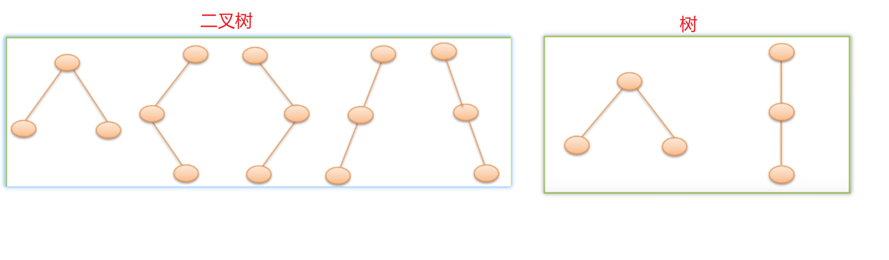

# 1、二叉树

二叉树是有n(n≥0)个结点的有限集，它或者是空集(n=0)，或者由一个根结点及两棵互不相交的分别称作这个根的左子树和右子树的二叉树组成。

特点：

1. 每个结点最多有两个孩子(二叉树中不存在度大于2的结点)
2. 子树有左右之分，其次序不能颠倒
3. 二叉树可以是空集合，根可以有空的左子树和空的右子树。

> 注：二叉树不是树的特殊情况，他们是两个概念

- 二叉树结点的子树要区分左子树和右子树，即使只有一棵子树也要进行区分，说明它是左子树还是右子树。

- 树当结点只有一个孩子时，就无需区分它是左还是右的次序，因此二者是不同的。这是二叉树与树的最主要的差别。

- 也就是说二叉树每个结点位置或者说次序都是固定的，可以是空，但是不可以说它没有位置，而树的结点位置是相对于别的结点来说的，没有别的节点时，它就无所谓左右了。

思考：具有3个结点的二叉树可能有几种不同形态？普通树呢？

二叉树有5中形态，树有2种形态，如下图：



虽然二叉树与树的概念不同，但是有关树的基本术语对二叉树都适用。


## 1.1、二叉树的性质

1. 在二叉树的第i层上至多有 2^i-1^ 个结点(i≥1)

   第i层上至少有 1 个结点


2. 深度为k的二叉树至多有 (2^k^ -1) 个结点(k≥1)

3. 对任何一棵二叉树T，如果其叶子数为n0，度为2的结点数为n2，则n0 = n2 + 1


## 1.2、满二叉树

一棵深度为k且有 (2^k^ -1) 个结点的二叉树称为满二叉树。


满二叉树特点：

1. 每一层的结点数都是最大结点数(即每层都满)
2. 叶子结点全部在最底层

对满二叉树结点位置进行编号：

- 编号规则：从根结点开始，自上而下，自左而右
- 每一结点位置都有元素


满二叉树在同样深度的二叉树中**结点**个数最多。

满二叉树在同样深度的二叉树中**叶子结点**个数最多。


## 1.3、完全二叉树

深度为k的具有n个结点的二叉树，当且仅当其每一个结点都与深度为k的满二叉树中编号为1~n的结点一 一对应时，称之为完全二叉树。


在满二叉树中，从最后一个结点开始，连续的去掉任意个结点，即是一棵完全二叉树，一定是连续的去掉。

满二叉树特点：

1. 叶子只可能分布在层次最大的两层上
2. 对任一结点，如果其右子树的最大层次为i，则其左子树的最大层次必为i或i+1

> 满二叉树一定是完全二叉树，完全二叉树不一定是满二叉树


### 1.3.1、完全二叉树的性质

1. 具有n个结点的完全二叉树的深度为 ⌊log~2~n⌋(向下取整)+ 1

   ⌊x⌋:称作x的底，表示不大于x的最大整数。


2. 如果对一棵有n个结点的完全二叉树，则对任一结点i有：
   1. 如果i=1，则结点i是二叉树的根，无双亲，如果i>1，则其双亲结点⌊i/2⌋
   2. 如果2i>n，则结点i为叶子结点，无左孩子，否则其左孩子是结点2i
   3. 如果2i+1 > n，则结点i无右孩子，否则其右孩子是结点 2i+1

性质2表明了完全二叉树中双亲结点编号与孩子结点编号之间的关系：如果一个结点编号是i的话，其双亲结点是⌊i/2⌋,其左孩子编号为2i，右孩子编号为2i+1


# 2、二叉树的存储

## 2.1、顺序存储

二叉树的顺序存储：按满二叉树的结点层次编号，依次存放二叉树中的数据元素。


顺序存储缺点：

最坏情况：深度为k的且只有k个结点的单支树需要长度为 2^k^-1的一维数组

浪费空间，适用于存满二叉树和完全二叉树


## 2.2、链式存储

### 2.2.1、二叉链表


二叉树的链式存储结构


---

在n个结点的二叉链表中，有` n+1 `个空指针域。

分析：必有**2n**个链域。除根结点外，每个结点有且仅有一个双亲，所以只会有 `n-1` 个结点的链域存放指针，指向非空子女结点。

空指针数组 = 2n-(n-1) = n+1


# 3、遍历二叉树

| 先序遍历二叉树                                          | 中序遍历二叉树                                            | 后序遍历二叉树                                            |
| ------------------------------------------------------- | --------------------------------------------------------- | --------------------------------------------------------- |
| (1)访问根结点<br>(2)先序遍历左子树<br>(3)先序遍历右子树 | (1)中序遍历左子树<br/>(2)访问根结点<br/>(3)中序遍历右子树 | (1)后序遍历左子树<br/>(2)后序遍历右子树<br/>(3)访问根结点 |


## 3.1、先(根)序遍历


## 3.2、中(根)遍历


## 3.3、后(根)遍历


## 3.4、例题


## 3.5、由遍历序列确定二叉树

若二叉树中各结点的值均不相同，则二叉树结点的先序序列、中序序列和后序序列都是唯一的

由二叉树的**先序序列和中序序列**，或由二叉树的**后序序列和中序序列**则可以确定唯一一棵二叉树。

例如：


分析：由先序序列确定根，由中序序列确定左右子树。

1. 由先序知根为A，则由中序知左子树为CDBFE，右子树为IHGJ


# 4、线索二叉树

当用二叉链表作为二叉树的存储结构时，可以很方便地找到某个结点的左右孩子，但一般情况下，**无法直接找到该结点在某种遍历序列中的前驱和后继结点。**如何寻找特定遍历序列中的二叉树结点的前驱和后继？


利用二叉链表中的空指针域：

如果某个结点的左孩子为空，则将空的左孩子指针域改为**指向其前驱**，如果某结点的右孩子为空，则将空的右孩子指针域改为**指向其后继**。 这种改变指向的指针称为"线索"。加上了线索的二叉树称为线索二叉树。


A结点的右孩子为空，所以将右孩子指向其直接后继，但是中序遍历序列A无后继，所以为空。

B结点的左右孩子不为空，不需要线索化。

C结点的左右孩子为空，所以将左孩子指向其直接前驱，右孩子指向其直接后继。但是中序遍历序列C无前驱，所以为空，C直接后继为B，所以将C的右孩子指向B。

D结点的左右孩子不为空，不需要线索化。

E结点的左孩子为空，所以将左孩子指向其直接前驱，中序遍历序列中E结点的直接前驱为B，所以左孩子指向B。

F结点的左右孩子为空，所以将左孩子指向其直接前驱，右孩子指向其直接后继。在中序遍历序列中，F的直接前驱是D，直接后继是A，所以左孩子指向D，右孩子指向A。

G结点的左右孩子为空，所以将左孩子指向其直接前驱，右孩子指向其直接后继。在中序遍历序列中，G的直接前驱是E，直接后继是D，所以左孩子指向E，右孩子指向F。


为了区分lrchild和rchild指针到底是指向孩子的指针，还是指向前驱或者后继的指针，对二叉链表中的每个结点增设两个标志域 ltag和rtag，并约定：

- ltag=0 lchild指向该结点的左孩子
- ltag=1 lchild指向该结点的前驱
- rtag=0 rchild指向该节点的右孩子
- rtag=1 rchild指向该结点的后继


## 4.1、先序线索二叉树


## 4.2、中序线索二叉树


## 4.3、后序线索二叉树


## 4.4、练习

画出以下二叉树对应的中序线索二叉树：


先对这棵树进行中序遍历：H、D、I、B、E、A、F、C、G


对于两侧悬空的空指针，我们可以增设一个头结点

ltag=0，lchild指向根节点

rtag=1，rchild指向遍历序列中最后一个结点

遍历序列中第一个结点的lc域和最后一个结点的rc域都指向头结点.这样会更方便


# 5、树的存储👌

## 5.1、双亲表示法

实现：定义结构数组，存放树的结点，每个结点含两个域

- 数据域：存放结点本身信息
- 双亲域：指示本结点的双亲结点在数组中的位置

如下图：R为根节点，双亲域表示了其双亲结点，例如A、B、C双亲域为0，则其双亲为R结点


**特点：找双亲容易，找孩子难。**


```c
// 结点类型
typedef struct PTNode{
    TElemType data;
    int parent; 	// 双亲位置域
}PTNode;

// 树结构
#define MAX_TREE_SIZE 100 
typedef struct{
    PTNode nodes[MAX_TREE_SIZE];
    int r,n; // r代表根节点的位置,n代表结点个数
}PTree;
```


## 5.2、孩子链表

把每个结点的孩子结点排列起来，看成是一个线性表，用单链表存储。则n个结点有n个孩子链表(叶子的孩子链表为空表)。而n个头指针又组成一个线性表，用顺序表(含n个元素的结构数组)存储。


---

孩子结点结构：


```c
//孩子结点结构
typedef struct CTNode{
    int child;
    struct CTNode *next;
}*ChildPtr;
```


```c
//双亲结点结构
typedef struct{
    TElemType data;
    ChildPtr firstchild;	//孩子链表头指针
}CTBox;

// 树结构
typedef struct{
    CTBox nodes[MAX_TREE_SIZE];
    int n,r; //结点数和根节点的位置
}CTree;
```

**孩子链表特点：找孩子容易，找双亲难**

我们可以多一个域，存储双亲结点的数组下标：这叫做带双亲的孩子链表。


## 5.3、孩子兄弟表示法

实现：用二叉链表作树的存储结构，链表中的每个结点的两个指针域分别指向其**第一个孩子结点**和**下一个兄弟结点**。

```c
typedef struct CSNode{
    ElemType data;
    struct CSNode *firstchild,*nextsibling;
}CSNode,*CSTree;
```


R结点是根节点，左孩子指向其第一个孩子结点A，右孩子指向兄弟结点为空。

A结点左孩子指向其第一个孩子D，右孩子指向兄弟结点为B。

B结点左孩子指向其第一个孩子为空，右孩子指向其兄弟结点C

D结点左孩子指向其第一个孩子为空，右孩子指向其兄弟结点E

E结点左孩子指向其第一个孩子为空，右孩子指向其下一个兄弟结点为空。

...

在这个二叉链表中，如果我们要找孩子结点：

例如我们要找根节点的孩子，从根节点出发，左孩子为其第一个孩子，左孩子的右指针为其第二个孩子，第二个孩子的右指针为其第三个孩子。例如，R的左孩子A为其第一个孩子,A的右指针B为其兄弟结点是R的第二个孩子，B的右指针C为其兄弟结点是R的第三个孩子。


# 6、树和森林👌


## 6.1、树和二叉树的转换

- 将树转化为二叉树进行处理，利用二叉树的算法来实现对树的操作
- 由于树和二叉树都可以用二叉链表作存储结构，则以二叉链表作媒介可以导出树与二叉树之间的一个对应关系。

### 6.1.1、将树转换成二叉树

1. 加线：在兄弟之间加一条线
2. 抹线：对每个结点，除了其左孩子外，去除其与其余孩子之间的关系。
3. 旋转：以树的根节点为轴心，将整树顺时针转45°

> 树变二叉树：兄弟相连留长子

我们来看一个例子：


### 6.1.2、将二叉树转换成树

1. 加线：若p结点是双亲结点的左孩子，则将p的右孩子，右孩子的右孩子....沿分支找到所有右孩子，都与p的双亲用线连起来
2. 抹线：抹掉原二叉树中双亲与右孩子之间的连线
3. 调整：将结点按层序排列，形成树结构

> 二叉树变树：左孩右右连双亲，去掉原来右孩线


## 6.2、森林和二叉树的转换

### 6.2.1、森林转换成二叉树

森林转换成二叉树(二叉树与多棵树之间的关系)

1. 将各棵树分别转换成二叉树
2. 将每棵树的根结点用线相连
3. 以第一课树根结点为二叉树的根，再以根结点为轴心，顺时针旋转，构成二叉树型结构

> 森林变二叉树，树变二叉根相连


### 6.2.2、二叉树转换成森林

1. 抹线：将二叉树中**根节点**与其右孩子连线，及沿右分支搜索到的所有右孩子间连线全部抹掉，使之变成孤立的二叉树
2. 还原：将孤立的二叉树还原成树

> 去掉全部右孩线，孤立二叉再还原


## 6.3、树和森林的遍历

### 6.3.1、树的遍历(三种方式)

1. 先序遍历：若树不空，则先访问根结点，然后依次先序遍历各棵子树
2. 后序遍历：若树不空，则先依次后根遍历各棵子树，然后访问根结点
3. 层次遍历：若树不空，则自上而下自左向右访问树中每个结点。


### 6.3.2、森林的遍历

将森林看作由三部分构成：


1. 森林中第一棵树的根结点
2. 森林中第一棵树的子树森林
3. 森林中其他树构成的森林

---

- 先序遍历

若森林不空，则：

1. 访问森林中第一棵树的根结点
2. 先序遍历森林中第一棵树的子树森林
3. 先序遍历森林外(除第一棵树之外)，其余树构成的森林

> **即依次从左至右对森林中的每一棵树进行先根遍历。**


- 中序遍历

若森林不空，则：

1. 中序遍历森林中第一棵树的子树森林
2. 访问森林中第一棵树的根结点
3. 中序遍历森林中(除第一棵树之外)其余树构成的森林

> **即依次从左至右对森林中的每一棵树进行后根遍历。**

例题：


先序遍历：A B C D E F G H I J 

中序遍历：B C D A F E H J I G


