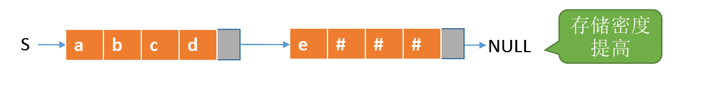
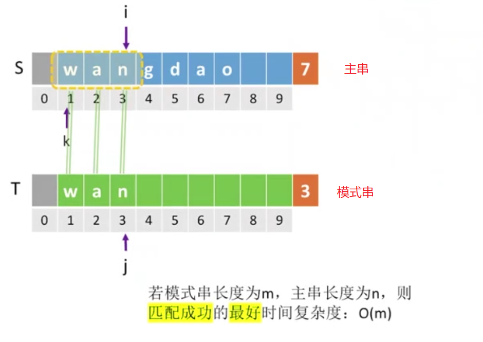
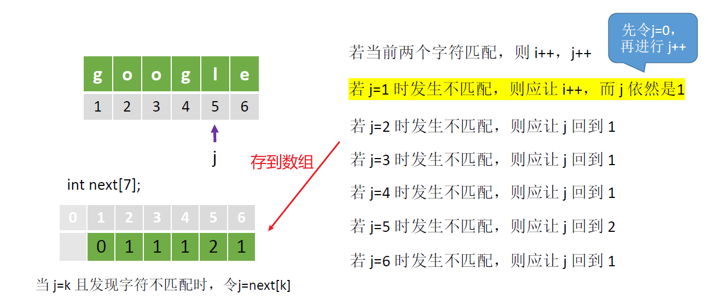
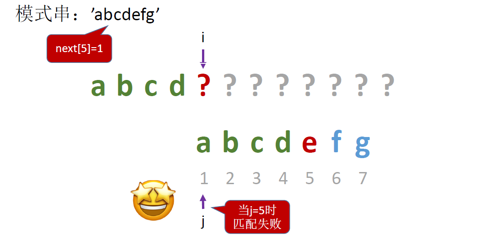

# 1、串

定义：串，即字符串，是由零个或多个字符组成的有限序列。一般记为 S = 'a~1~a~2~......a~n~'(n≥0)

其中，S 是串名，单引号括起来的字符序列是串的值，a~i~ 可以是字母、数字或其他字符；串中字符的个数 n 称为==串的长度==。n = 0 时的串称为==空串==。


- 子串：串中任意个==连续的==字符组成的子序列。
- 主串：包含子串的串。

- 字符在主串中的位置：字符在串中的序号。
- 子串在主串中的位置：子串的第一个字符在主串中的位置。


## 1.1、串和线性表

- 串是一种特殊的线性表，数据元素之间呈线性关系
- 普通的线性表里面可以存放各种各样的数据类型，是不做限制的。串的数据对象限定为字符集(如中文字符、英文字符、数字字符、标点字符等)

- 串的基本操作，如增删改查等==通常以子串为操作对象==


## 1.2、串的基本操作


## 1.3、串的存储结构

### 1.3.1、串的顺序存储

1. **静态数组实现：定长顺序存储**

```c
#define MAXLEN 255			// 预定义最大串长为255
typedef struct{
    char ch[MAXLEN];		// 每个分量存储一个字符
    int lenght;				// 串的实际长度
}SString;					
```

顺序存储在内存中有如下四种方案：


- 方案一：会在串的末尾增添一个存储单元，用来存储串的长度变量 Length

- 方案二：让 ch[0] 的位置来存储串的长度变量 Length，这样做的优点是字符的位序就和数组下标相同。但缺点是 ch[0] 相当于一个存储单元 1B，这样也只能存储 0~255 的数字范围。

- 方案三：去掉 Length 变量，在串末尾插入 `\0` 表示结尾。缺点是如果经常需要访问串的长度，那么每次都需要对串进行遍历。

- 方案四：是王道书上的，ch[0] 位置不存储元素，并在串的末尾增添一个存储单元，用来存储串的长度变量 Length。这样既保证了字符的位序就和数组下标相同，也可以记录串的长度


2. **动态数组实现：堆分配存储**

```c
typedef struct{
    char *ch;				// 按串长分配存储区,ch指向串的基地址
    int lenght;				// 串的长度
}HString;

S.ch = (char *)malloc(MAXLEN * sizeof(char));			// 用完需要手动 free
S.lenght = 0;
```


### 1.3.2、串的链式存储

用一个结点存字符，再用一个指针指向下一个结点。

- char 的大小只有 1B，指针大小 4B
- 这就意味着我们使用 1 个字节的大小来存储信息，还要使用 4 个字节的大小来存储辅助信息。

```c
typedef struct StringNode{
    char ch;				// 每个结点存1个字符
    struct StringNode *next;
}StringNode,*String;
```


如何解决存储密度低的问题呢？我们可以让每个结点存多个字符

```c
typedef struct StringNode{
    char ch[4];				// 每个结点存多个字符
    struct StringNode *next;
}StringNode,*String;
```




## 1.4、串的基本操作的实现

### 1.4.1、求子串

- `SubString(&Sub,S,pos,len)` 求子串。用 Sub 返回串 S 的第 pos 个字符起长度为 len 的子串。


```c
#define MAXLEN 255			// 预定义最大串长为255
typedef struct{
    char ch[MAXLEN];		// 每个分量存储一个字符
    int length;				// 串的实际长度
}SString;		

// 求子串
bool SubString(SString &Sub,SString S,int pos,int len){
    // 子串范围越界
    if(pos+len-1 > S.length){
        return false;
    }
    for(int i=pos; i<pos+len; i++){
        Sub.ch[i-pos+1] = S.ch[i];
    }
    Sub.length = len;
    return true;
}
```


### 1.4.2、比较操作


- 从第一个字符开始往后依次对比，先出现更大字符的串就更大。
- 长串的前缀与短串相同时，长串更大。
- 只有两个串完全相同时，才相等。

- `StrCompare(S,T)` 比较两个串操作。若 S > T，则返回值 > 0；若 S = T，则返回值 = 0；若 S < T，则返回值 < 0


```c
// 比较两个串操作。若 S > T，则返回值 > 0；若 S = T，则返回值 = 0；若 S < T，则返回值 < 0
int StrCompare(SString S,SString T){
    for(int i=1; i<=S.length && i<= T.length; i++){
        if(S.ch[i] != T.ch[i]){
            return S.ch[i] - T.ch[i];
        }
    }
    // 扫描过的所有字符都相同,则长度更长的串更大
    return S.lenth - T.length;
}
```


### 1.4.3、定位操作

- `Index(S,T)`： 定位操作。若主串 S 中存在与串 T 值相同的子串，则返回它在主串 S 中第一次出现的位置，否则函数值为 0


1. 我们可以在主串 S 中从第一个元素开始取下长度为 3 的子串，
2. 然后对比这个子串与串 T 看是否相等，
3. 如果不相等，可以再在主串 S 中从第二个元素开始取下长度为 3 的子串
4. 然后对比这个子串与串 T 看是否相等
5. 如果相等，那么我们只需要返回这个子串的第一个字符的位序


```c
int Index(SString S,SString T){
    int i=1; 
    int n=StrLength(S);				// 求S串长,返回串中元素的个数
    int m=StrLength(T);				// 求T串长,返回串中元素的个数
    SString sub;					// 用于暂存子串
    while(i <= n-m+1){
        SubString(sub,S,i,m);		// 取子串,用 Sub 返回串 S 的第 i 个字符起长度为 m 的子串。
        if(StrCompare(sub,T) != 0){ // 对比
            i++;
        }else{
            return i;				// 返回子串在主串中的位置
        }
    }
    return 0;						// S中不存在与Tx
}
```


## 1.5、串的朴素模式匹配算法


- 串的模式匹配：在主串中找到与模式串相同的子串，并返回其所在位置
  - 子串：一定是主串中存在的才叫 "子串"
  - 模式串：想尝试在主串中找到的串，未必存在。(其实就是串的定位操作)

之所以叫做朴素模式匹配算法，是因为我们这里不会用其他串的基本操作，而是通过访问数组元素的方式来实现这个过程。


1. 我们会使用 k 来记录当前检查的子串的起始位置，然后比对这个子串与模式串，如果不能匹配，就让 k++（这里在比对时，只要有一个字符不同，就可以停止检查当前子串）


2. 如果对比的子串和模式串不相等，让 k 的值 ++，也就是对比下一个子串，然后让 i 和 j 分别指向子串和模式串的第一个字符
   - 例如上述`wan`和`gda`第一个字母都不相同，则 k++ 对比 `ang` 和 `gda`


3. 循环执行操作 2，当被比对的子串和模式串的第一个值相同，这个时候让 i 和 j 的值同时向后移，对比第二个字符，第二个字符也相等，那继续让 i 和 j 的值向后移，对比第三个字符


```c
int Index(SString S,SString T){
    int k=1;
    int i=k,j=1;
    while(i<=S.length && j <= T.length){
        if(S.ch[i] == T.ch[j]){				// 当对比的子串和模式串的第一个字符相等
            ++i;							// 让 i 和 j 向后移
            ++j;							// 继续比较后继字符
        }else{
            k++;							// 检查下一个子串
            i=k;							// i 指向被对比子串的第一个字符
            j=1;							// j 指向模式串的第一个字符
        }
    }
    if(j>T.length){
        return k;
    }else{
        return 0;
    }
}
```

王道的课本代码实现如下：

```c
int Index(SString S,SString T){
    int i=1;j=1;
    while(i<=S.length && j<=T.length){
        if(S.ch[i] == T.ch[i]){
            ++i;
            ++j;							// 继续比较后继字符
        }else{
            i = i-j+2;
            j = 1;
        }
    }
    if(j>T.length){
        return i-T.length;
    }else{
        return 0;
    }
}
```

### 1.5.1、算法性能分析

- 若模式串长度为 m，主串长度为 n，则匹配成功的最好时间复杂度为： O(m)
  - 主串当中的第一个字串就和模式串匹配，那么只需要匹配模式串的长度




- 若模式串长度为 m，主串长度为 n，则匹配失败的最好时间复杂度为：O(n-m+1) = O(n-m) ≈ O(n) 
  - 匹配失败就是模式串的第一个字符和主串的前面所有字符都不匹配，每个模式串只需要对比一个字符，一直到最后一个子串的第一个字符和模式串的第一个字符也不匹配，那么算法就结束。
  - 长度为 n 的主串中有 ==n-m+1== 个长度为 m 的子串，每个子串只需要对比一个字符，所以匹配失败的最好时间复杂度为：O(n-m+1)
  - 很多应用场景中，主串比模式串长很多，即 n 》m，所以O(n-m+1) = O(n-m) ≈ O(n) 


最坏情况：每个子串的前 m-1 个字符都和模式串匹配，只有第 m 个字符不匹配

- 例如模式串长度为4，子串的前三个字符都和模式串相匹配，第四个字符不匹配，则每个子串都要和模式串对比4次


### 1.5.2、知识回顾与考点

- 串的模式匹配：在主串中找到与模式串相同的子串，并返回其所在位置。

- 朴素模式匹配算法(简单模式匹配算法)思想：将主串中的模式串长度相同的子串搞出来，挨个与模式串对比，当子串与模式串某个对应字符不匹配时，就立即放弃当前子串，转而检索下一个子串

- 若模式串长度为 m，主串长度为 n，则直到匹配成功/匹配失败最多需要 ==(n-m+1)*m== 次比较
  - **最坏时间复杂度**：==O(nm)==
  - 最坏情况：每个子串的前 m-1 个字符都和模式串匹配，只有第 m 个字符不匹配
  - 比较好的情况：每个字符的第一个字符就与模式串不匹配


## 1.6、KMP算法🔥

==这一章唯一的重点。==

KMP 算法：朴素模式匹配算法的优化

KMP 算法之所以叫做 KMP 算法，是因为发明它的三个人的名字第一个开头字母组成的。:v:


朴素模式匹配算法的缺点：**当某些子串与模式串能部分匹配时，主串的扫描指针 i 经常回溯，导致时间开销增加**

> 改进思路：主串指针不回溯，只有模式串指针回溯

1. 我们来看一个例子，例如指向模式串的指针 j = 6 时发生了不匹配


2. 那么也就是说，前 5 个字符都与模式串匹配上了，这个时候我们让模式串回溯到起始位置，只需要比较子串的最后一个字符与模式串的起始字符是否相同


3. 如果子串的最后一个字符与模式串的起始字符相同，我们让指向子串和模式串的指针 i++，j++，从而比较第二个字符是否相同


4. 如果子串的最后一个字符与模式串的起始字符不相同，我们让指向子串的 i 后移，检查后继元素是否与模式串的起始元素相同，而指向模式串的指针 j 依然是 1


---

1. 那如果指向模式串的指针 j = 5 时发生了不匹配，如图：


2. 那么说明我们前4个字符都匹配上了，并且此时子串有第二个 g 开头，我们只需要比对模式串的第二个字符是否与子串的 ？号处的字符是否与 o 相同，所以我们让指向模式串的指针 j 回到 2


---

1. 如果说指向模式串的指针 j = 3 时不匹配


2. 让指向模式串的指针 j 回到1


> 总结：当我们的指针 j 扫描到某一个字符时，如果发生了不匹配，那么说明前面的字符和我们的主串是能够完全匹配上的，那我们就可以利用模式串前缀的信息，就可以分析出指针 j 接下来应该指向什么位置。

我们将 j 应该指向什么位置的信息放在一个数组里，数组名字叫 next



这个数组的意思是**当指针 j 指向的位置发生不匹配，那么它应该回到某一个位置**。这里我们发现当 j = 1时发生不匹配，应该让 j 仍然是1，但是 next 数组里面让 j 回到 0，这是为了写代码的时候考虑。


```c
int Index_KMP(SString S,SString T,int next[]){
    int i=1;j=1;
    while(i<=S.length && j<= T.length){
        if(j==0 | S.ch[i] == T.ch[j]){
            ++i;
            ++j;								// 继续比较后继字符
        }else{
            j=next[j];							// j指回相应位置,模式串向右移动
        }
    }
    if(j>T.length){
        return i-T.length;						// 匹配成功
    }else{
        return 0;
    }
}
```


### 1.6.1、求next数组🔥

**所以其实 KMP 算法的关键在于我们需要先搞出一个和模式串相对应的数组 next。**

我们先来观察几个例子：

1. 当 j = 6 时，匹配失败，我们要让模式串向右移动到 j = 3


2. 当 j = 7 时，匹配失败，我们要让模式串向右移动到 j = 5


3. 当 j = 5时匹配失败，我们要让模式串向右移动到 j = 4


4. 当 j = 5 时匹配失败，我们要让模式串向右移动到 j = 1




5. 当 j = 1 时就发生匹配失败，我们让 j = 0


****

串的前缀：包含第一个字符，且不包含最后一个字符的子串

- 前缀从左向右看

串的后缀：包含最后一个字符，且不包含第一个字符的子串

- 后缀从右向左看

例如`'abab'` ,前缀为{a,ab,aba}，后缀为{b,ab,bab},

> 当第 j 个字符匹配失败，由前 1 ~ j-1 个字符组成的串记为 S，则： next[j]  = S的最长相等前后缀长度 +1


### 1.6.2、练习1


如题：

1. next[1] == 0
2. next[2] 的意思是当我们匹配到第二个字符的时候发现匹配失败，那么前 1~(2-1) 个字符组成的串记为S，也就是串S此时只有一个字符为a，`'a'` 的前缀是空集，后缀也是空集，所以最长相等前后缀长度+1 =0 + 1，所以 next[2] = 1
3. next[3] 的意思是当我们匹配到第三个字符的时候发现匹配失败，那么前 1~(3-1) 个字符组成的串记为S，也就是串S此时为 `'ab'` ,前缀为{a}，后缀为{b},所以最长相等前后缀长度+1 = 0 + 1,所以 next[3] = 1
4. next[4] 的意思是当我们匹配到第四个字符的时候发现匹配失败，那么前 1~(4-1) 个字符组成的串记为S，也就是串S此时为 `'aba'` ,前缀为{a,ab}，后缀为{a,ba},所以最长相等前后缀长度+1 = 2,所以 next[4] = 2
5. next[5] 的意思是当我们匹配到第五个字符的时候发现匹配失败，那么前 1~(5-1) 个字符组成的串记为S，也就是串S此时为 `'abab'` ,前缀为{a,ab,aba}，后缀为{b,ab,bab},所以最长相等前后缀长度+1 = 3,所以 next[3] = 3
6. next[6] 的意思是当我们匹配到第六个字符的时候发现匹配失败，那么前 1~(6-1) 个字符组成的串记为S，也就是串S此时为 `'ababa'` ,前缀为{a,ab,aba,abab}，后缀为{a,ba,aba,baba},所以最长相等前后缀长度+1 = 4,所以 next[6] = 4

所以答案为：


### 1.6.3、练习2


如题：

1. next[1] == 0
2. next[2] 的意思是当我们匹配到第二个字符的时候发现匹配失败，那么前 1~(2-1) 个字符组成的串记为S，也就是串S此时只有一个字符为a，`'a'` 的前缀是空集，后缀也是空集，所以最长相等前后缀长度+1 = 1，所以 next[2] = 1
3. next[3] 的意思是当我们匹配到第三个字符的时候发现匹配失败，那么前 1~(3-1) 个字符组成的串记为S，也就是串S此时为 `'aa'` ,前缀为{a}，后缀为{a},所以最长相等前后缀长度+1 = 1,所以 next[3] = 2
4. next[4] 的意思是当我们匹配到第四个字符的时候发现匹配失败，那么前 1~(4-1) 个字符组成的串记为S，也就是串S此时为 `'aaa'` ,前缀为{a,aa}，后缀为{a,aa},所以最长相等前后缀长度+1 = 3,所以 next[4] = 3
5. next[5] 的意思是当我们匹配到第五个字符的时候发现匹配失败，那么前 1~(5-1) 个字符组成的串记为S，也就是串S此时为 `'aaaa'` ,前缀为{a,aa,aaa}，后缀为{a,aa,aaa},所以最长相等前后缀长度+1 = 4,所以 next[3] = 4


### 1.6.4、小结

朴素模式匹配算法的缺点：当某些子串与模式串能部分匹配时，==主串的扫描指针i经常回溯==，导致时间开销增加。最坏的时间复杂度`O(nm)`

KMP算法：当子串和模式串不匹配时，主串指针i不回溯，模式串指针 j=next[j] ，算法的平均时间复杂度：`O(n+m)`

next数组手算方法：当第j个字符匹配失败，由前 `1~j-1` 个字符组成的串记为S，则：`next[j]=S的最长相等前后缀长度+1`


不过如此？大熊猫你还厉害太！


## 1.7、KMP算法优化-nextval数组


> 拿当前元素值与对应位置上的next值作比较，若相同则保留对应位置上的nextval数组的值，若不同则保留当前位置上的next数组值。

例如，对于上述模式串`"aaaab"`,它的next数组如图，其nextval数组分析如下：

1. nextval[1] == 0

2. nextval[2] ,第二个字符的next[2] == 1，但是由于第二个字符与第一个字符是相同的，所以将第一个字符的 nextval[1] 赋值给第二个字符的nextval[2] == 0

3. nextval[3] ,第三个字符的next[3] == 2，但是由于第三个字符与第二个字符是相同的，所以将第二个字符的 nextval[2] 赋值给第三个字符的 nextval[3] == 0

4. nextval[4] ,第四个字符的next[4] == 3，但是由于第四个字符与第三个字符是相同的，所以将第三个字符的 nextval[3] 赋值给第四个字符的 nextval[4] == 0

5. nextval[5] ,第五个字符的next[5] == 4，第五个字符b与第四个字符不相同，所以让其保持以前的 next 值不变，则nextval[5] = next[5] =4 

   


## 1.8、KMP算法考点总结


若题目中需要求 nextval 数组，那我们需要先手算出 next 数组，然后令 nextval[1] = 0,之后从左向右算出 nextval 值


