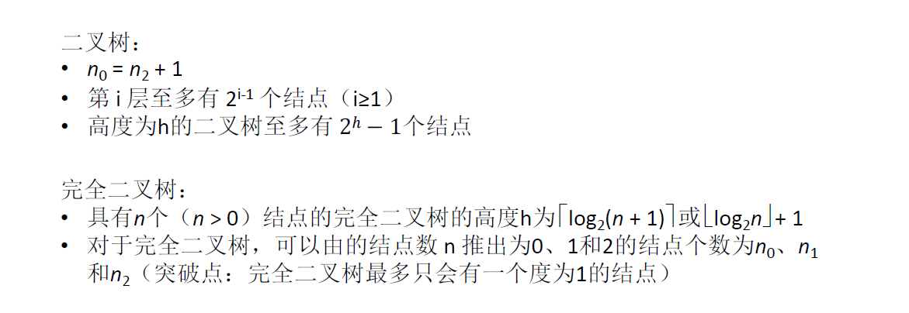
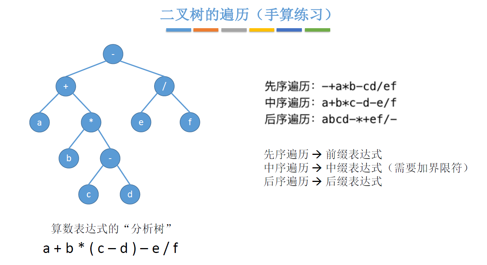
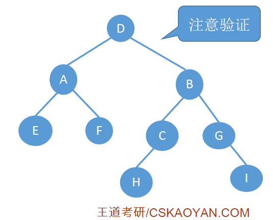

#  1、树

## 1.1、树的基本概念


空树：结点数为 0 的树

非空树的特性：

- 有且仅有一个==根结点==
- 没有后继的结点称为==叶子结点==(或者终端结点)
- 有后继的结点称为==分支结点==(或者非终端结点)
- 除了根节点外，任何一个结点==都有且仅有一个前驱==
- 每个结点可以有 0 个或多个后继结点。

**除了根结点外，任何一个结点都有且仅有一个前驱**


---

树是 n(n≥0) 个结点的有限集合，n = 0 时，称为空树，这是一种特殊情况。在任意一棵非空树中应满足：

1. 有且仅有一个特定的结点称为根的结点。
2. 当 n > 1 时，其余结点可分为 m(m>0) 个==互不相交的有限集合==T~1~,T~2~,.....T~m~，其中每个集合本身又是一棵树，并且称为根结点的==子树==。


## 1.2、结点之间的关系描述

如图就是一棵树的结构：


- 结点：树的结点包含**一个数据元素和若干指向其子树的分支。**

- 祖先结点：从根结点到该结点**所经过分支上的所有结点**。例如图中 K 的祖先结点有 E、B、A
- 子孙结点：以某结点为根的子树中的任一结点都称为该结点的子孙。例如图中 A 的子孙结点是下面所有结点。
- 双亲结点：一个结点的直接前驱就是它的双亲节点。例如图中 B、C、D 的双亲结点是 A
- 孩子结点：一个结点的直接后继就是孩子结点。例如图中 A 的孩子结点是 B、C、D
- 兄弟结点：具有相同**双亲结点** (即同一个前驱)的结点称为兄弟结点。例如图中 B、C、D 为兄弟结点

- 两个结点之间的路径：只能**从上往下** 。例如结点  A 和结点 E 之间有路径，结点 E 与 结点 G 之间没有路径。
- 两个结点之间的路径长度：一个结点到另一个结点之间经过了几条边。例如 A 到 E 的路径长度为 2


属性

- 结点的层次(深度) ： 从上往下数，默认从 1 开始(有的教材默认从 0 开始，也不要奇怪，见题拆题)
  - 深度为 1 是 A 结点
  - 深度为 2 是 B、C、D结点
  - 深度为 3 是 E、F、F、H、I、J 结点
  - 深度为 4 是 K、L、M 结点
- 结点的高度：从下往上数，默认从 1 开始
  - 高度为 1 是 K、L、M 结点
  - 高度为 2 是 E、F、F、H、I、J 结点
  - 高度为 3 是 B、C、D结点
  - 高度为 4 是 A 结点
- 结点的度：有几个孩子(分支) 就有几个度
  - 结点 B 有两个分支，结点 B 的度为 2
  - 结点 C 有一个分支，结点 C 的度为 1
  - 结点 D 有三个分支，结点 D 的度为 3
  - 结点 M 是叶子结点，结点 M 的度为 0
- 树的度：**各结点的度的最大值**。也就是树中分支数最多
  - 结点 A 、D 的分支最多为 3 ，所以树的度为 3

> 注意：叶子结点的度 = 0，非叶子结点的度 > 0

### 1.3、有序树、无序树、森林


- 有序树：树中各子树从左到右是有次序的，不能互换
- 无序树：树中各子树从左到右是无次序的，可以更换

- 森林：森林是 m(m≥0) 棵互不相交的树的集合


## 1.3、树的常考性质

1. **结点数 = 总度数 + 1**

   结点的度 = 结点有几个孩子(分支)


2. **度为 m 的树和 m 叉树**
   - 度为 m 的树：各结点的度的最大值为 m
   - m 叉树：每个结点最多只能有 m 个孩子的树

| 度为 m 的树                      | m 叉树                          |
| -------------------------------- | ------------------------------- |
| 任意结点的度 ≤ m(最多m个孩子)    | 任意结点的度 ≤ m(最多 m 个孩子) |
| 至少有一个结点度 = m (有m个孩子) | 允许所有结点的度都 < m          |
| 一定是非空树，至少有 m+1 个结点  | 可以是空树                      |


3. **度为 m 的树第 i 层至多有 m^i-1^ 个结点( i ≥ 1)**

   **m 叉树第 i 层至多有 m^i-1^ 个结点( i≥1)**


4. **高度为 h 的 m 叉树至多有 (m^h^ -1)/(m-1) 个结点**


5. **高度为 h 的 m 叉树至少有 h 个结点**

   **高度为 h、度为 m 的树至少有 h+m-1 个结点**


6. 


7. 总结


# 2、二叉树

二叉树是 n (n≥0) 个结点的有限集合。

1.  或者为==空二叉树==，即 n = 0
2. 或者由一个==根节点==和两个互不相交的被称为根的==左子树==和==右子树==组成。左子树和右子树又分别是一棵二叉树。


> 特点：
>
> 1. 每个结点至多只有两棵子树
> 2. 左右子树不能颠倒(二叉树是有序树)


## 2.1、满二叉树

- 满二叉树：**一棵高度为 h，且含有 2^h^ -1 个结点的二叉树**


特点：

1. 只有最后一层有叶子结点
2. 不存在度为 1 的结点
3. 按层序从 1 开始编号，结点 i 的左孩子为 2i，右孩子为 2i+1，结点 i 的父节点为 [ i / 2] (如果有的话) **[ i / 2 ]向下取整**


## 2.2、完全二叉树

完全二叉树：当且仅当其每个结点都与高度为 h 的满二叉树中编号为 1~n 的结点一一对应时，称为完全二叉树。


特点：

1. 只有最后两层可能有叶子结点。

2. 同时只有一个度为 1 的结点

3. 按层序从 1 开始编号，结点 i 的左孩子为 2i，右孩子为 2i+1，结点 i 的父节点为 [ i / 2] (如果有的话) **[ i / 2 ]向下取整**

4. i ≤ [ n / 2] 为分支结点, i > [n / 2] 为叶子结点

   **[n / 2 ] 向下取整**

5. 在完全二叉树中,如果某结点只有一个孩子,那么一定是左孩子


## 2.3、二叉排序树

**二叉排序树**：一棵二叉树或者空二叉树，或者具有如下性质的二叉树：

- ==左子树==上所有结点的关键字均**小于根结点**的关键字
- ==右子树==上所有结点的关键字均**大于根节点**的关键字
- 左子树和右子树又各是一棵二叉排序树


- 二叉排序树用于元素的排序、搜索


## 2.4、平衡二叉树

平衡二叉树：树上任一结点的**左子树**和**右子树**的**深度之差不超过 1**


## 2.5、总结


# 3、二叉树的常考性质

1. 设非空二叉树中度为 0、1 和 2 的结点个数分别为 n~0~ 、n~1~ 、n~2~ ，则 ==n~0~ = n~2~ + 1==

   (叶子结点比二分支结点多一个)


2. 二叉树第 i 层至多有 2^i-1^ 个结点(i≥1)

   m 叉树 第 i 层至多有 m^i-1^ 个结点(i≥1)


3. 高度为 h 的二叉树至多有 2^h^ -1 个结点(满二叉树)

   高度为 h 的 m 叉树至多有 (m^h^ -1) / (m-1) 个结点


## 3.1、完全二叉树的常考性质


2. 对于完全二叉树，可以由结点数 n 推出度为 0、1和2的结点个数为 n~0~、n~1~和n~2~


## 3.2、总结




# 4、二叉树的存储结构

## 4.1、顺序存储

```c
#define MaxSize
struct TreeNode {
    ElemType value;			// 结点中的数据元素
    bool isEmpty;			// 结点是否为空
}
TreeNode t[MaxSize];
for(int i=0; i<MaxSize;i++){
    t[i].isEmpty = true;		// 初始化时所有结点标记为空
}
```


**几个重要常考的基本操作**：


上述是完全二叉树的存储，那么对于一棵不是完全二叉树而言又如何存储呢？**如果不是完全二叉树，依然按层序将各结点顺序存储，那么无法从结点编号反映出结点间的逻辑关系。**


所以对于二叉树的顺序存储中，**一定要把树的结点编号与完全二叉树对应起来。**这样我们就可以通过结点编号来算出左孩子、右孩子、父节点，但是无法通过结点编号 i 与结点总数 n 作比较，来进行判断。


我们可以看到，这样存储的话会浪费很多存储单元，**所以对于二叉树的顺序存储结构，只适合存储完全二叉树。**


## 4.2、链式存储

```c
// 二叉树的结点(链式存储)
typedef struct BiTNode{
    ElemType data;					// 数据域
    struct BiTNode *lchild,*rchild; // 左、右孩子指针
}BiTNode,*BiTree;
```


- 如果一个结点没有左孩子，我们可以将对应的指针设为 null。
- n 个结点，会有 2n 个指针，除了根结点之外，其他结点头上都会连一个指针，也就是说有 n-1 结点的头上也会连接有一个指针，所以这 2n 个指针中会有 (2n-(n-1)) = n +1 个指向 null。
  - **所以 n 个结点的二叉链表共有 n + 1 个空链域**（可以用于构造线索二叉树）

> 初始化二叉树


```c
struct ElemType{
    int value;
};

// 二叉树的结点(链式存储)
typedef struct BiTNode{
    ElemType data;					// 数据域
    struct BiTNode *lchild,*rchild; // 左、右孩子指针
}BiTNode,*BiTree;

// 定义一棵空树
BiTree root = NULL;

// 插入根节点
root = (BiTree) malloc(sizeof(BiTNode));
root->data = {1};							// 根节点数据域为 1
root->lchild = NULL;						// 根节点左孩子指向NULL
root->rchild = NULL;						// 根节点右孩子指向NULL

// 插入新结点
BiTNode *p = (BiTNode *)malloc(sizeof(BiTNode));
p->data = {2};								// 新节点数据域为 2
p->lchild = NULL;							// 新节点左孩子为NULL
p->rchild = NULL;							// 新节点右孩子为NULL
root->lchild = p;				//新节点作为根结点的左孩子
```

- 根据链式存储我们要找到指定结点 p 的左/右孩子，只需要查看结点 p 的左右孩子指针指向的结点即可。
- 可是如何找到指定结点 p 的父结点呢，这样就只能从根开始遍历寻找。或者我们在定义二叉树结点时可以加一个父结点指针（考研一般不喜欢这么考）

```c
// 二叉树的结点(链式存储)
typedef struct BiTNode{
    ElemType data;					// 数据域
    struct BiTNode *lchild,*rchild; // 左、右孩子指针
    struct BiTNode *parent;			// 父结点指针
}BiTNode,*BiTree;
```


# 5、二叉树的遍历算法

- 遍历：按照某种次序把所有结点都访问一遍

- 层次遍历：基于树的层次特性确定的次序规则
- 先/中/后序遍历：基于树的递归特性确定的次序规则


二叉树的递归特性：

1. 要么是个空二叉树
2. 要么就是由 "根节点 + 左子树 + 右子树" 组成的二叉树

3. **先序遍历：根左右**
4. **中序遍历：左根右**
5. **后序遍历：左右根**

我们先来看一个简单的例子：


上述是最简单的二叉树遍历，我们再来看一个：


## 5.1、先序遍历

先序遍历的操作过程如下：

1. 若二叉树为空，则什么也不做
2. 若二叉树非空
   1. 访问根节点
   2. 先序遍历左子树
   3. 先序遍历后子树

```c
// 先序遍历
void PreOrder(BiTree T){
    if(T != NULL){
        visit(T);				// 访问根结点
        PreOrder(T->lchild);	// 递归遍历左子树
        PreOrder(T->rchild);	// 递归遍历右子树
    }
}
```


## 5.2、中序遍历

中序遍历的操作过程如下：

1. 若二叉树为空，则什么也不做
2. 若二叉树非空
   1. 先序遍历左子树
   2. 访问根节点
   3. 先序遍历右子树

```c
// 中序遍历
void InOrder(BiTree T){
    if(T != NULL){
        InOrder(T -> lchild);		// 递归遍历左子树
        visit(T);					// 访问根节点
        InOrder(T -> rchild);		// 递归遍历右子树
    }
}
```


## 5.3、后序遍历

后序遍历的操作过程如下：

1. 若二叉树为空，则什么也不做
2. 若二叉树非空:
   1. 先序遍历左子树
   2. 先序遍历右子树
   3. 访问根节点

```c
// 后序遍历
Void PostOrder(BiTree T){
    if(T != NULL){
        PostOrder(T->lchild);			// 递归遍历左子树
        PostOrder(T->rchild);			// 递归遍历右子树
        visit(T);						// 访问根节点
    }
}
```


## 5.4、手算练习

```c
// 访问一个结点:打印字符
Void visit(BiTNode *p){
    printf("%c",p->data);
}
```





这里的遍历和我们学习栈的表达式时很有关联，我们将这里的先序遍历的表达式转换为中缀表达式和后缀表达式，分别对应的就是中序遍历和后序遍历，只是中序遍历没有添加界限符


## 5.5、求树的深度(应用)

对于求树的深度，我们只需要选择左子树和右子树中深度最大的子树 + 1 就是树的深度


```c
// 求树的深度
int treeDepth(BiTree T){
    if(T == NULL){								// 树是空树
        return 0;								// 深度为0
    }else{
        int l = treeDepth(T->lchild);			// 求左子树的深度
        int r = treeDepth(T->rchild);			// 求右子树的深度
        // 树的深度 = Max(左子树深度,右子树深度)+1
        return l>r ? l+1 : r+1;
    }
}
```


## 5.6、层序遍历


算法思想：

1. 初始化一个辅助队列
2. 让根结点入队
3. 若队列非空，则队头结点出队，访问该结点，并将其左、右孩子插入队尾(如果有的话)
   - 例如 A 结点在队头，让 A 出队，并将其左、右孩子 B、C 插入队尾


4. 重复 3 直至队列为空
   - B 此时为队头元素，B 出队，将 B 的左右孩子 D、E 插入队尾
   - C 此时为队头元素，C 出队，将 C 的左右孩子 F、G 插入队尾


```c
// 层序遍历
void LevelOrder(BiTree T){
    LinkQueue Q;				// 链队列
    InitQueue(Q);				// 初始化辅助队列
    BiTree p;					
    EnQueue(Q,T);				// 将根结点入队
    while(!IsEmpty(Q)){			// 队列不为空则循环
        DeQueue(Q,p);			// 队头结点出队
        visit(p);				// 访问出队结点
        if(p->lchild != NULL){
            EnQueue(Q,p->lchild);// 左孩子入队
        }
        if(p->rchild != NULL){
            EnQueue(Q,p->rchild);// 右孩子入队
        }
    }
    
}
```


# 6、构造二叉树


> 结论：一个中序/前序/后序/层次遍历序列可能对应多种二叉树形态，若只给出一棵二叉树的 前/中/后/层 序遍历序列中的一种，不能唯一确定一棵二叉树

若要由二叉树的遍历序列构造二叉树，则

- 前序 + 中序 遍历序列
- 后序 + 中序 遍历序列
- 层序 + 中序 遍历序列


## 6.1、前序+中序遍历序列


我们来看一个例子：

- 已知前序遍历序列为：A D B C E
- 已知中序遍历序列为：B D C A E

1. 前序遍历得根节点为A，由中序遍历序列推出 ，(B D C) 均为左子树，E 为右子树。如下图


2. 由前序遍历序列推出左子树的根节点为 D，则由中序序列推出结点 D 的左子树为 B，右子树为 C 


---

再来看一个复杂一点的例子

- 已知前序遍历序列为：D A E F B C H G I       (根左右)
- 已知中序遍历序列为：E A F D H C B G I       (左根右)

1. 由前序遍历序列推出 D 为根结点，则由中序遍历序列可知 D 的左子树为 (D A F)，右子树为(H C B G I)


2. 根据前序遍历序列 A 为左子树的根节点，根据中序遍历序列 A 的左子树为 E，右子树则为 F
3. 根据前序遍历序列 B 为右子树的根节点，根据中序遍历序列 B 的左子树为(H C)，右子树为(GI)


4. 根据前序遍历序列 C 为 根，根据中序遍历序列 C 的左子树为 H
5. 根据前序遍历序列 G 为根，根据中序遍历序列 G 的右子树为 I


## 6.2、后序+中序遍历序列


我们来看一个例子：

- 已知后序遍历序列：E F A H C I G B D (左 右 根)
- 已知中序遍历序列：E A F D H C B G I (左 根 右)

1. 根据后序遍历序列 D 为根节点，根据中序遍历序列 ，(E A F) 为左子树，(H C B G I) 为右子树


2. 根据后序遍历序列 A 为左子树的根节点，根据中序遍历序列 E 为 A 结点的左子树，F为右子树
3. 根据后序遍历序列 B 为右子树的根节点，根据中序遍历序列 (H C) 为左子树，(G I)为右子树


4. 根据后序遍历序列 C 为根，G 为根。根据中序遍历序列 H 为左子树，I 为右子树


## 6.3、层序+中序遍历序列


我们来看一个简单的例子：

- 已知层序遍历序列：A B C D E (根 左子树的根 右子树的根)
- 已知中序遍历序列：A C B E D (左 根 右)

1. 根据层序遍历序列，首先访问第一层，根为 A。格局中序遍历序列，A 的左边没有元素，则 A 的左子树为空1


2. 根据层序遍历序列，访问第二层，首先出现的是 B，则 B 是右子树的根节点。根据中序遍历序列，C 为 B 的左子树，(E D) 为 B 的右子树


3. 根据层序遍历，访问第三层，首先出现的是 C、D，则 D 为根，根据中序遍历，E 为 D 的左子树


---

我们来看一个例子：

- 已知层序遍历序列：D A B  E F C G H I (根 左子树的根 右子树的根)
- 已知中序遍历序列：E A F D H C B G I (左 根 右)

1. 根据层序遍历序列，访问第一层，D 为根结点，根据中序遍历序列，(E A F)为左子树，(H C B G I)为右子树


2. 根据层序遍历序列，访问第二层，首先出现的是A、B，则A 为左子树的根节点，B 为右子树的根节点。根据中序遍历，E 为 A 的左子树，F为 A 的右子树。 (H C )为 B 的左子树，(G I) 为 B 的右子树


3. 根据层序遍历序列，访问第三层，首先出现的是 E、F、C、G，则 根节点分别为 C、G
4. 根据中序遍历，C 的左子树为 H，G 的右子树为 I



> 注意：前序、后序、层序序列的两两组合无法唯一确定一棵二叉树


