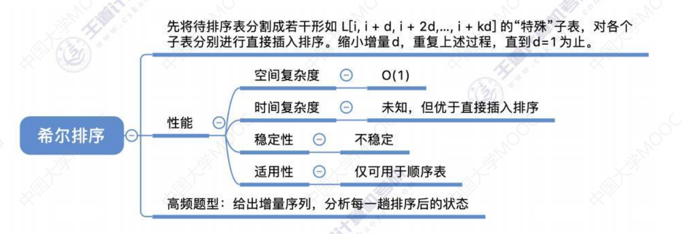
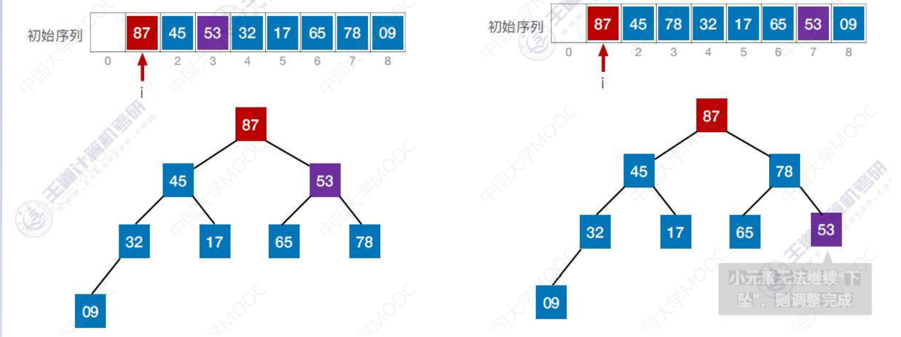
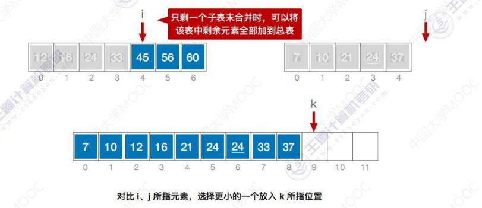
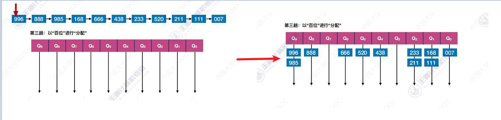

# 1、排序

## 1.1、排序算法的稳定性

- 排序算法稳定性：关键字相同的元素在排序之后相对位置不变，则说明算法是稳定的。

## 1.2、排序算法的分类

内部排序：数据量不大、数据在内存、无需内外存交换数据 

外部排序：数据量较大、数据在外存(文件排序)

外部排序时，要将数据分批调入内存来排序，中间结果还要即时放入外存，显然外部排序要复杂的多。

# 2、插入排序

算法思想：每次将一个待排序的记录按其关键字大小插入到前面已经排好序的子序列中

- 从第2个元素开始，我们认为第2个元素之前已经排好序，所以我们需要将第2个元素与第1个元素进行对比， 比第2个元素更大的我们将其依次后移

- 从38开始，我们认为38之前已经排好序，38<49，将38插入到49之前
- 之后处理65，我们认为65之前已经排好序，65大于前面排好序的子序列，所以65不动
- ...

## 2.1、算法效率

- 空间复杂度：O(1)
- 时间复杂度：主要来自对比关键字、移动元素。若有n个元素，则需要 n-1 趟处理
  - 最好情况：共n-1趟处理，每一趟只需要对比关键字1次，不用移动元素(也就是数据原本就有序)
    - 时间复杂度 = O(n)
  - 最坏情况：原本为逆序，第n-1躺，对比关键字n次，移动元素n+1次
    - 时间复杂度 = O(n^2^)
- 平均时间复杂度 = O(n^2^)，算法稳定性：**稳定**

## 2.2、优化-折半插入排序

思路：先用折半查找找到应该插入的位置，再移动元素

- 首先在0位置将要插入的元素保存下来
- low指向1位置，high指向子序列最后一个位置(low、high指向的是子序列的范围)
- 比较 mid 指向和当前插入的元素大小关系，55>50，所以应该插入到50右边区间
- 比较 mid 指向和当前插入的元素大小关系，55<70，所以应该插入到70左边区间
- 比较 mid 指向和当前插入的元素大小关系，55<60，所以应该插入到60左边区间
- 当 low > high 时折半查找停止，应将 [low，i-1]内的元素全部右移，并将A[0]复制到low所指位置
  - 将 60、70、80全部右移，将55插入

- 当A[mid]==A[0]时，为了保证算法的稳定性，应继续在mid所指位置右边寻找插入位置

## 2.3、算法效率分析

折半插入排序比起直接插入排序比较关键字的次数减少了，但是移动元素的次数没变，整体来看，时间复杂度依然是 = O(n^2^)

## 2.4、小结

# 3、希尔排序

如果我们的元素原本就有序，或者能够保持基本有序的话，那么直接插入排序的效率也会很好。希尔排序：先追求表中元素**部分有序**，再逐渐逼近**全局有序**。

---

来看一个例子：

- 先将待排序表分割成若干形如 `L[i，i+d，i+2d，........，i+kd]` 的特殊子表，对各个子表分别进行直接插入排序。缩小增量d，重复上述过程，直到 d =1 为止

1. 第一趟：d~1~=n/2 = 8/2 = 4
   - 也就是说所有相距为4的元素，我们都将其看成是属于一个子表。
   - 49和76是一个子表，38和13是一个子表，65和27是一个子表，97和49是一个子表

2. 对各个子表分别进行直接插入排序
   - 子表1本身就是有序的，所以不会改变位置
   - 子表2要将13放在前，38放在后
   - 子表3要将27放在前，65放在后
   - 子表4要将49放在前，97放在后
   - 则第一趟排序完成，如上图

3. 第二趟排序，缩小d的值：d~2~=d~1~/2=2
   - 则会将相距距离为2的元素化为同一子表
   - 49、27、76、65是一个子表，13、49、38、97是一个子表

4. 对各个子表分别进行直接插入排序
   - 子表1直接插入排序
   - 子表2直接插入排序

5. 第三趟排序，缩小d的值：d~3~=d~2~/2=1
   - 则会将相距距离为1的元素化为同一子表
   - 相当于第3躺排序是直接将排序表进行直接插入排序
   - 因为前两趟排序整个表已呈现出**基本有序**，所以最后对整体再进行一次直接插入排序

> 考试中可能会遇到各种增量

## 3.1、算法性能分析

- 空间复杂度：O(1)
- 时间复杂度：和增量序列d~1~、d~2~、d~3~的选择有关，目前无法用数学手段证明确切的时间复杂度
- 最坏时间复杂度为：O(n^2^)，当n在某个范围内时，可达O(n^1.3^)
- 稳定性：不稳定！
- 适用性：仅适用于顺序表，不适用于链表

## 3.2、小结

# 4、冒泡排序

冒泡排序：是交换排序的一种，交换排序包括冒泡排序和快速排序

- 基于交换的排序：根据序列中两个元素关键字的比较结果来兑换这两个记录在序列中的位置

从后往前(或从前往后)两两比较相邻元素的值，若为逆序(即`A[i-1] > A[i]`)，则交换它们，直到序列比较完。称这样的过程为**一趟冒泡排序**。

如果我们想要一个递增的序列：

1. 先对比最后两个元素，27<49，则不改变位置
2. 再对比倒数第一个和倒数第二个元素，13<27，则不改变位置
3. ...
4. **第一趟冒泡排序使关键字值最小的一个元素在最前面**

5. 接下来进行第二趟冒泡排序
   - 先对比最后两个元素，27<49，则不改变位置
   - 再对比倒数第一个和倒数第二个元素，76>27，则改变位置
   - ....
   - 需要注意的是：**由于第一趟排序已经使得第1个位置的元素确定，所以不需要再与第1个元素进行对比。第二趟冒泡排序可以使得最小的两个元素会放在最前面**

6. 继续循环之前操作，**若某一趟排序没有发生交换，则说明此时已经整体有序**

## 4.1、算法性能分析

- 空间复杂度：O(1)
- 时间复杂度：
  - 最好情况(有序)：比较次数 = n-1，交换次数 = 0，所以最好时间复杂度 = O(n)
  - 最坏情况(逆序)：比较次数 = (n-1)+(n-2)+......+1 = n(n-1)/2 = 交换次数，所以最坏时间复杂度 = O(n^2^)
- 平均时间复杂度 = O(n^2^)
- 每次交换都需要移动元素3次
- 稳定性：稳定！
- 适用性：顺序表、链表都可以

# 5、快速排序

算法思想：在待排序表 `L[1,2,3,.....n]` 中任取一个元素 pivot 作为枢轴(或基准，通常取首元素)，通过一趟排序将待排序表划分为独立的两部分 `L[1,2,3.....,k-1]` 和 `L[k+1,........,n]` ，使得 `L[1,2,3.....,k-1]` 中的所有元素小于 pivot，  `L[k+1,........,n]`  中的所有元素大于等于 pivot，则pivot放在了其最终位置 L[k] 处，这个过程称为一次 "划分"。然后分别递归的对两个子表重复上述过程，直至每部分内只有一个元素或空为止，即所有元素都放在了其最终位置上

1. 用 low 和 high 分别指向这个序列的头和尾
2. 选择 low 所指的元素，让它作为基准元素。比 low 所指的元素小的都交换到左边，比 low 所指元素大的都交换到右边
   - 也就是将小于49的元素交换到左边，将大于等于49的元素交换到右边
   - 下标为7的元素是49，不需要移动
   - 让`high- -`左移，此时下标为6的元素 27<49，所以将 27 放到 low 所指的位置，high 指针指向的位置空出
   - 让 `low++`右移，此时 low 指向的是下标为1的元素38，38<49，所以不需要移动。
   - 让 `low++`右移，此时 low 指向的是下标为2的元素65，65>49，所以将65放到 high 所指的位置，此时 low 指向的位置空出
   - 让`high- -`左移，此时下标为5的元素 13<49，所以将 13 放到 low 所指的位置，high 指针指向的位置空出
   - 让 `low++`右移，此时 low 指向的是下标为3的元素97，97>49，所以将97放到 high 所指的位置，此时low 指向的位置空出
   - 让`high- -`左移，此时下标为4的元素 76>49，所以不需要移动
   - 让`high- -`左移，此时下标为3的元素为空，也就是 low == high，将49放入下标为3处
     - 此时49左边都是比49小的，右边都是比49大的

3. 接下来对左子表和右子表再次执行上述操作，先来看左子表
   - 让 low 和 high 指向左子表的头和尾
   - 选中 low 所指元素作为基准元素，检查 high 指向的元素。
     - 13<27，所以将13放到 low 所指位置，此时 high 指向为空
     - 让 `low++`右移，此时 low 指向的是下标为1的元素38，38>27，所以将39放到high所指位置，此时 low 所指位置为空
     - 让`high- -`左移，此时 low == high，将27放入下标为1处

4. 对右子表执行相同操作，最终得到最终排序结果

## 5.1、算法效率分析

若初始序列**有序或逆序**，则快速排序的**性能最差**(每次选择的都是最靠边的元素)，若每一次选中的枢轴将带排序序列划分为**很不均匀**的两个部分，则会导致**递归深度增加算法效率变低**。若每一次选中的枢轴将带排序序列划分为**均匀**的两个部分，则**递归深度最小，算法效率最高**。

---

**空间复杂度 = O(递归层数)**

- 最好空间复杂度 = O(log~2~n)
  - 每次选的枢轴元素都能将序列划分为均匀的两部分
- 最坏时间复杂度 = O(n)
  - 若序列原本就有序或逆序，则时间、空间复杂度最高(可优化，尽量选择可以把数据中分的枢轴元素)

**时间复杂度 = O(n×递归层数)**

- 最好时间复杂度 = O(nlog~2~n)
- 最坏时间复杂度 = O(n^2^)
- 平均时间复杂度 = O(nlog~2~n)

**稳定性：不稳定！**

> 快速排序是所有内部排序算法中平均性能最优的排序算法。

> 快速排序代码没有记录，但是这个代码很重要！自己一定要能手写出来

- **一次划分**可以确定一个元素的最终位置，一趟排序可以确定多个元素的最终

# 6、简单快速排序

选择排序包括简单快速排序和堆排序。**选择排序**：每一趟在待排序的元素中选取关键字最小(或最大的元素)加入有序子序列。

1. 初始待排序元素都是无序的，从左到右扫描，找到最小的元素和首位元素进行交换。
2. 之后其他元素就是待排序元素，不需要再管第一个元素了。
3. 接着进行第二趟排序

4. 循环上述步骤
   - 注意：**若带排序元素中有最小关键字相同的元素，则选择最先扫描到的将其交换。**
   - 注意：**待排序元素剩最后一个，则不用再进行处理**

## 6.1、算法效率分析

- n个元素的简单选择排序需要 n-1 趟处理，无论有序、逆序还是乱序，一定需要 n-1 趟处理.
  - 总共需要对比关键字(n-1)+(n-2)+......+1 = n(n-1)/2 次
  - 元素交换次数 < n-1 

- 空间复杂度： O(1)
- 时间复杂度：O(n^2^)
- 稳定性：不稳定！
- 适用性：顺序表、链表

## 6.2、小结

# 7、堆排序

## 7.1、什么是堆

若N个关键字序列 `L[1，2，3，.........，n]`满足下面某一条性质，则称为堆：

1. 若满足：L[i] ≥ L[2i]  且 L[i] ≥ L[2i+1] ，则称为**大根堆(大顶堆)**
2. 若满足：L[i] ≤ L[2i]  且 L[i] ≥ L[2i+1] ，则称为**小根堆(大顶堆)**

- 如上图，87>45，87>78，如果所有的元素都满足大于 2i 处的元素和 2i+1 处的元素，则称为**大根堆**
- 9<45，9< 17，如果所有的元素都满足小于 2i 处的元素和 2i+1 处的元素，则称为**小根堆**

大根堆看似是一个连续存放的数组，从逻辑视角看应该是一个顺序存储的完全二叉树。下标为1的结点就是根结点，数组下标为 i 的结点，它的左孩子是 2i，右孩子是 2i+1，当 i ≤ n/2 的时候，这个结点一定是一个分支结点。

- **简化大根堆**：在完全二叉树中，所有子树的**根结点 ≥ 左、右孩子**
- **简化小根堆**：在完全二叉树中，所有子树的**根结点 ≤ 左、右孩子**

## 7.2、建立大根堆

堆排序是选择排序的一种，选择排序就是每一趟排序选取关键字最小(或最大)的元素加入**有序队列**，其余元素为**待排序序列**。我们将待排序序列转化成堆，则进行快速排序会方便很多。

那么对于一个初始序列，我们怎么建立成大根堆呢？

- 思路：把所有非终端节点(分支结点)都检查一遍，是否满足大根堆的要求，如果不满足则进行调整
  - 大根堆：根 ≥ 左、右孩子
  - 在顺序存储的完全二叉树中，**非终端节点编号 i ≤ ⌊n/2⌋** ，只要满足这个不等式的都是分支结点

如上图，总共有8个结点，那么我们需要检查 i ≤ 4 的结点，也就是 1、2、3、4结点，我们从后向前依次处理这些结点：

1. 第一个被处理的是4号结点，对应的元素是9，检查以9为根是否满足 **根 ≥ 左、右**

   - 如何找它的左右孩子呢：i 的左孩子编号 2i，右孩子编号 2i+1，父节点编号 ⌊i/2⌋

   - 左孩子编号8对应的元素是32，9 < 32，不满足要求，则将当前结点与更大的一个孩子互换：
     - 将 9 和 32 进行互换

2. 第二个被处理的是3号结点，对应的元素是78，检查以78为根是否满足 **根 ≥ 左、右**
   - 左孩子编号6对应的元素是65，右孩子编号7对应87，87 > 78，不满足要求，则将当前结点与更大的一个孩子互换

3. 第三个被处理的是2号结点，对应的元素是17，检查以17为根是否满足 **根 ≥ 左、右**
   - 左孩子编号4对应的元素是32，右孩子编号5对应45，45 > 43，不满足要求，则将当前结点与更大的一个孩子互换

4. 第四个被处理的是1号结点，对应对应的元素是53，检查以53为根是否满足 **根 ≥ 左、右**
   - 左孩子编号2对应的元素是17，右孩子编号3对应87，87 > 53，不满足要求，则将当前结点与更大的一个孩子互换
   - 注意：**此时将53下坠，更小的元素下坠，可能导致下一层的子树不符合大根堆的要求**。若元素护患破坏了下一级的堆，则采用相同的方法继续向下调整(小元素不断下坠)
     - 将53与78互换，如下图，直到小元素无法继续下坠，则调整完成

## 7.3、基于大根堆进行排序

堆排序：每一趟将堆顶元素加入有序子序列(与待排序序列中的最后一个元素交换)

- 例如将堆顶元素87和最后一个元素9交换，这样87这个元素就不需要再移动了

- 接下来将其余元素再修改为大根堆，如下图将待排序元素序列再次调整为大根堆(小元素不断下坠)

> 这样就完成了第一趟处理，我们将最大的元素移到末尾，同时把剩余的元素恢复成大根堆，接下来进行第二趟的处理

- 将堆顶元素78和最后一个元素53进行交换，这样78这个元素就不需要再移动了

- 接下来将其余元素再修改为大根堆，如下图将待排序元素序列再次调整为大根堆(小元素不断下坠)
  - 如上图，53只需下坠一次，因为右孩子78不参与排序了

---

n-1趟处理之后，**基于大根堆的堆排序得到一个递增序列**

## 7.4、算法效率分析

结论：

- 一个结点，每下坠一层，最多只需对比关键字2次
- 若树高为h，某结点在第 i 层，则将这个结点向下调整最多只需要下坠 h-i 层，关键字对比次数不超过 2(h-i)
- n 个结点的完全二叉树树高 h = ⌊log~2~n⌋+1 

- 第 i 层最多有 2^i-1^ 个结点，而只有第 1 ~ (h-1) 层的结点才有可能需要下坠调整
- 建堆的过程中，关键字对比次数不超过4n，**建堆的时间复杂度 = O(n)**
  - 其实前面的结论都是分析，目的就是为了推出时间复杂度
- 根结点最多下坠 h-1 层，每下坠一层，最多只需对比关键字2次，因此每一趟排序复杂度不超过 O(h)=O(log~2~n)，共 n-1 趟，总的时间复杂度 =  O(nlog~2~n)

---

- **堆排序的时间复杂度** = 建堆的时间复杂度O(n) +  排序复杂度O(nlog~2~n) = O(nlog~2~n)
- **堆排序的空间复杂度** = O(1)

- 稳定性：不稳定！

## 7.5、小结

# 8、堆的插入删除

## 8.1、在堆中插入新元素

对于**小根堆**，新元素放到表尾与父节点对比，若新元素比父节点**更小**，则将二者互换，新元素就这样一路**上升**，直到无法继续上升为止。

例如在小根堆中插入13：小根堆，**根 ≤ 左、右**

1. 将13放到表尾，然后与父节点对比，32 >13，则将 13与32 交换

   - 父结点编号 ⌊i/2⌋ = ⌊9/2⌋ = 4，对应的元素是32  

   - 13 < 17，则将13与17交换
   - 对比了3次关键字，13和32对比1次，13和17对比1次，13和09对比1次

2. 接下来继续插入46，将46放到表尾，然后与父节点对比，46 >45，则不交换
   - 对比了1次关键字，46和45对比

## 8.2、在堆中删除新元素

假设此时要删除的是13这个元素：

1. **被删除的元素用堆底元素替代，然后让该元素不端下坠，直到无法下坠为主**
   - 删除13之后，用堆底元素46放入删除的位置，然后让46不断下坠
   - 对比关键字次数 4 次
     - 17和45先对比，选中更小的17和46对比。53和32对比，选中更小的32和46对比

> 在下坠过程中：
>
> - 一个结点下方有两个孩子，则下坠一层需对比关键字2次
> - 一个节点下方只有一个孩子，则下坠一层只需对比关键字1次

## 8.3、小结

# 9、归并排序

## 9.1、什么是归并

归并：把两个或多个已经**有序**的序列合并成一个

如下图，将两个有序的序列合并成一个：对比i、j所指元素，选择更小的一个放入k所指的位置

- i 指向12，j指向7，显然7更小，将7放入 k 所指的位置，同时让j、k向后移
- i 指向12，j指向10，显然10更小，将10放入 k 所指的位置，同时让j、k向后移
- i 指向12，j指向21，显然12更小，将12放入 k 所指的位置，同时让i、k向后移

- 注意：
  - **只剩一个子表未合并时，可以将该表中剩余元素全部加到总表**
  - 当 i 和 j 指向的元素值相同时，我们可以规定将 i 先放进k，再将 j 放进 k+1 处

> 上述过程是"2路"归并：就是每次只需对比关键字1次就可以选出一个小元素

- ==m路归并，每次选出一个元素需要对比关键字 m-1 次==。

## 9.2、归并排序

归并排序一般采用2路归并，我们刚开始会把初始序列中的**每一个元素都当做一个有序序列**

- 第一趟归并排序，我们会将相邻的两个元素进行2路归并
  - 比如49和38归并，得到 38、49 有序序列
  - 65和97归并，得到 65、97 有序序列
  - 76和13归并，得到 13、76 有序序列
  - 最后单出来的元素放置末尾
- 第二趟归并排序，会在第一趟的结果再次进行归并排序
  - 38、49有序序列和 65、97有序序列进行归并，得到 38、49、65、97 有序序列
  - 13、76有序序列和 27有序序列进行归并，得到 13、27、76 有序序列
- 第三趟归并排序，会在第二趟的结果再次进行归并排序
  - 如上图，得到最终结果

## 9.3、算法效率分析

- n个元素进行2路归并排序，归并趟数 = ⌈log~2~n⌉
- 每趟规定时间复杂度为O(n)，则算法时间复杂度为O(nlog~2~n)
- 空间复杂度为 O(n)

- 稳定性：稳定！

### 9.4、小结

# 10、基数排序

如下图。我们要得到按关键字递减的有序序列：

- 观察发现我们的所有关键字都可以被拆为个位、十位、百位，能取到的数都是0~9，所以我们设置10个辅助队列，分别对应0 ~ 9

1. 第一趟：我们以个位进行分配
   - 520的个位是0，所以将520放到 Q~0~ 队列作为队头
   - 211的个位是1，所以将211放到 Q~1~ 队列作为队头
   - ...
   - 得到如上图第一趟分配结果

2. 分配完成之后进行收集，就这样把各个队列的元素组织成一个统一的列表
   - 由于我们最终要得到一个递减的序列，所以我们要从个位最大的队列开始收集
   - Q~9~队列为空，Q~8~队列从队头开始收集：438、888、168
   - Q~7~队列的元素连接到Q~8~的队尾
   - ...
   - **这样就得到了按个位递减排序的序列**

3. 第2趟以10位进行分配
   - 注意：由于是在第一趟排序的基础上进行分配，所以**个位越大的越先入队**

4. 第2趟结束进行收集
   - 第2趟收集结束，得到按**十位递减，十位相同的则按个为递减**的序列

5. 第3趟：以百位进行分配

6. 第3趟收集：得到一个按**百位递减，若百位相同则按十位递减，若十位相同，则按个位递减**的序列

## 10.1、算法效率分析

- 空间复杂度：O(r)，需要 r 个辅助队列
- 时间复杂度 = O(d(n+r))
  - 一趟分配 O(n)，一趟收集 O(r)，总共 d 趟分配、收集，总的时间复杂度 = O(d(n+r))
  - d：把关键字拆成d个部分，每个部分可能取 r 个值
  - 收集一个队列只需 O(1)

- 稳定性：稳定！

## 10.2、基数排序的应用

d=3，我们将生日分成了年、月、日三组关键字，n=10000，r每一轮都不一样：

- 第一轮 r =31
- 第二轮 r =12
- 第三轮 r = 15

我们按最坏的情况，r=31来计算，时间复杂度 = O(d(n+r)) = O(3×(10000+31))

---

基数排序擅长解决的问题：

1. 数据元素的关键字可以方便的拆分为d组，且d较小
2. 每组关键字的取值范围不大，即 r 较小
3. 数据元素个数 n 较大

## 10.3、小结

# 11、外部排序

外部排序：数据存放在磁盘当中，数据元素太多，无法一次全部读入内存进行排序。使用**归并排序**在内存中申请3块缓冲区即可对任意一个大文件进行排序。这三块缓冲区的大小和磁盘块的容量一致

- 从外存中读入两个块的内容进行**内部排序**后放到输出缓冲区，然后写回磁盘。这样第1个磁盘块和第2个磁盘块就是一个递增的序列，我们称为一个有序的**归并段**。

- 循环上述操作，我们可以得到8个归并段。由于整个文件有16块的内容，构造归并段需要16次的读和16次的写操作(16块都需要分别被读一次和写一次)

- 接下来使用这8个归并段进行排序，首先将前两个归并段的数值较小的块放入内存进行归并排序，然后输出到外存。
  - 注意：**输出缓冲区一次只能输出一个块。**
  - **当缓冲区为空，就要立即用归并段补上**(如下图)

- 循环上述操作，这样就将**前两个归并段归并为一个更长的有序序列**

- 循环上述操作，可以将8个归并段归并成4个更长的有序序列，然后我们把这4个有序序列再两两归并

- 将4个有序序列规定为两个有序序列，然后再将这两个有序序列归并，最终得到一个整体有序的有序序列

## 11.1、算法效率分析

- 文件总块数：每个阶段都需要将文件读入、写出一遍，读写次数加起来 = 32

## 11.2、优化：多路归并

采用多路归并，可以减少归并趟数，从而减少磁盘I/O读写次数。

- 对r个初始归并段，做k路归并，则归并树可用 k 叉树表示，若树高为h，则归并趟数 = h-1 = ⌈ log~k~ r ⌉
  - k越大，r越小，归并趟数越小，读写磁盘次数越少

多路归并带来的负面影响：

1. k路归并时，需要开辟k个输入缓冲区，内存开销增加
2. 每挑选一个关键字需要对比关键字，（k-1）次，内部归并所需时间增加

### 11.3、优化：减少初始归并段数量

生成初始归并段的内存工作区越大，初始归并段越长

- 结论：若能增加初始归并段的长度，则可减少初始归并段的数量 r

## 11.3、小结

## 11.4、多路平衡归并

k路平衡归并：

1. 最多只能有k个段归并为一个
2. 每一趟归并中，若有 m 个归并段参与归并，则经过这一趟处理得到 ⌈m/k⌉ 个新的归并段。

# 12、败者树

## 12.1、多路平衡归并带来的问题

使用k路平衡归并策略，选出一个最小元素需要对比关键字（k-1）次，导致内部归并所需时间增加(也就是在内存中进行归并排序)

为了使内部归并不受 k 的增大的影响，引入了 **败者树**。

败者树：可以视为一颗完全二叉树(多了一个头)。k个叶节点分别是当前参加比较的元素，非叶子结点用来记忆左右子树中的失败者，而让胜者继续向上进行比较，一直到根节点。

- 如果冠军放弃冠军，反而让新成员派大星顶上，那么难道我们还要继续再两两对打决胜出冠军吗？不需要，因为之前已经对打过记录了胜负，我们只需让左边子树进行对打即可。
  - 基于已经构建好的败者树，选出新的胜者，只需要进行三场比赛

## 12.2、败者树在多路平衡归并中的应用

- 12 < 27，因此27是失败者，将 27 填入1旁，12填入2旁
- 1 < 17，因此17是失败者，将17填入4旁，1填入2旁
  - 12 > 1 ，因此12是失败者，将12填入2处，1填入5旁 
- 2 < 9，因此9是失败者，将9填入6旁，2填入8旁
- 11 < 4，因此11是失败者，将11填入7旁，4填入8旁
  - 2 < 4，因此4是失败者，将4填入8处，2填入5旁
- 1 < 2，因此2是失败者，将2填入5处，1是冠军

- 第一轮通过7次关键字对比之后，找到了最小的元素1，属于归并段3
- 接下来还需要按照归并的规则，从归并段1~8中找到最小的元素，我们将规定段3的下一个元素替代1原来的位置
- 这样我们只需对比：
  - 6<17，17是失败者，将17填入4旁，6填入2旁
  - 6<12，12是失败者，将12填入2处，6填入3旁
  - 6>2，6是失败者，将6填入3处，2填入5处，则冠军是5
- 第2轮通过3次关键字对比之后选出最小元素2，来自归并段5

> 对于k路归并，有了败者树，选出最小元素，只需对比关键字 ⌈log~2~k⌉ 次（也就是灰色结点的层数）

# 13、置换选择排序

假设初始带排序文件有24 个记录，假设用于内部排序的内存工作区只能容纳3个记录，用之前的办法会只能生成 24/3 =8 个归并段。我们来看置换选择排序是怎么解决这个问题的：

- 刚开始我们会从文件中读入3个记录到内存工作区，我们要构造递增的序列，所以把最小的元素4置换出去， 把4放到归并段1当中，并且用一个变量 MINIMAX 记录刚才的值。
- 从待排序文件中读入下一个记录，将最小的元素6置换出去

- 如下图，当我们发现内存工作区最小的元素是10，但是MINIMAX =13，则说明10不能放到归并段1的末尾(因为归并段1递增)，所以我们将14放入归并段1的末尾

- 同理：2也不能放到归并段1的末尾，直到内存工作区的关键字都比 MINIMAX 更小，则该归并段在此截至，进行下一个归并段

使用置换选择排序，可以让每个初始归并段的长度超越内存工作区大小的限制。

# 14、最佳归并树

- 归并过程的磁盘I/O次数 = 归并树的带权路径长度WPL×2
  - 所以我们想要让磁盘I/O次数最小，就是要使归并树的带权路径长度最小，即要让归并树是哈夫曼树

3路归并的最佳归并树：

- 选出权值最小的三个结点，让他们成为兄弟，2、3、6归并
- 接下来权值最小的三个结点：9、11、12
- .....
- 如下图

- 如果减少一个归并段，减少30这个归并段
  - 最后一次是2路归并，而不是3路归并，所以这个树不是最佳归并树

- 正确的做法：**对于k叉归并，若初始归并段的数量无法构成严格的 k 叉归并树，则需要补充几个长度为 0 的虚段，再进行 k 叉哈夫曼树的构造**

## 14.1、添加虚段的数量

k 叉树的最佳归并树一定是一棵严格的 k 叉树，**即树中只包含度为 k、度为0的结点**。设度为 k 的结点有 n~k~ 个，度为0的结点有 n~0~个，归并树总结点树 = n，则：

1. **若(初始归并段数量-1) % （k-1） = 0，说明刚好可以构成严格 k 叉树，此时不需要添加虚段**
2. **若(初始归并段数量-1) % （k-1） = u ≠ 0，则需要补充 （k-1）-u 个虚段**

## 14.2、小结

