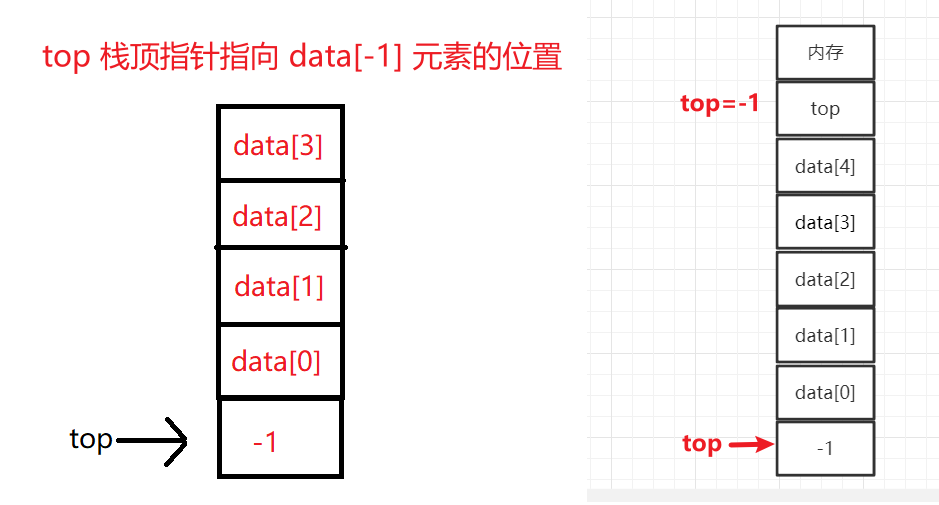

# 1、栈Stack

线性表是具有相同数据类型的 n(n≥0) 个数据元素的有限序列，其中 n 为表长，当 n = 0时线性表是一个空表。

栈：栈是==只允许在一端进行插入(进栈)或删除操作(出栈)==的线性表

## 1.1、栈的重要术语

栈的记忆：拿盘子，只能从一端拿

- **空栈**：栈里面没有存任何数据元素（其实就是对应线性表的空表）

- **栈顶**：允许插入和删除的一端

- **栈底**：不允许插入和删除的一端


如图：

进栈顺序为：

- a1 -> a2  -> a3  -> a4  -> a5

出栈顺序为：

- a5  -> a4  -> a3  -> a2  -> a1

特点：

- ==后进先出==
- Last In First Out  (==LIFO==)

## 1.2、顺序栈的定义

顺序栈：是==只允许在一端进行插入或删除操作==的==顺序表==

```c
#define MaxSize 10					// 定义栈中元素的最大个数
typedef struct {					
    ElemType data[MaxSize];			// 静态数组存放栈中元素
    int top;						// 栈顶指针,指向的是栈顶元素,记录的是数组的下标
}SqStack;							// Sq sequence 顺序的意思
```

当声明一个栈时：会开辟一块连续大小的空间，这个空间存放栈中元素和top指针。如下是初始化栈时让top指针指向-1。


例如一个栈如下：


## 1.3、链栈的定义

链栈：是==只允许在一端进行插入或删除操作==的==单链表==

- 头插法(对头结点的后插操作)建立单链表  对应  进栈
- 头删法(对头结点的后删操作)删除单链表  对应  出栈


所以链栈的定义和单链表差不多

```c
typedef struct Linknode {
    ElemType data;						// 数据域
    struct Linknode *next;				// 指针域
}*LiStack;								// 栈类型定义
```


# 2、顺序栈的基本操作

我们有两种设计栈的方式

1. 让栈顶指针 top 指向栈顶元素的位置（栈满的条件为 ： `top = MaxSize -1`）
2. 让栈顶指针 top 指向栈顶元素 +1 的位置（栈满的条件为 ： `top = MaxSize`）

## 2.1、让栈顶指针 top 指向栈顶元素的位置

### 2.1.1、初始化栈top=-1

- `InitStack(&S)` ： 初始化栈，构造一个空栈S，分配内存空间

初始化栈就是让栈顶指针 top 指向 -1，因为栈顶指针指向的是栈顶元素，开始的时候没有元素，所以栈顶指针指向 0 这个位置是不合适的（因为data[0]开始是没有元素的）



```c
#define MaxSize 10					// 定义栈中元素的最大个数
typedef struct {					
    ElemType data[MaxSize];			// 静态数组存放栈中元素
    int top;						// 栈顶指针
}SqStack;							// Sq sequence 顺序的意思

// 初始化栈
void InitStack(SqStack &S){
    S.top = -1;						// 初始化栈顶指针
}

void testStack(){
    SqStack S;						// 声明一个顺序栈(分配空间)
    InitStack(S);					// 初始化栈
}
```

### 2.1.2、判断栈是否为空栈

- `StackEmpty(S)` 判断一个栈 S 是否为空。若 S 为空，则返回 true，否则返回 false

判断栈是否为空只需要==判断栈顶指针是否是 -1==

```c
// 判断空栈
bool StackEmpty(SqStack S){
    if(S.top == -1){
        return true;				// 栈空
    }else{	
        return false;				// 栈不空
    }
}
```

### 2.1.3、进栈(增)

- `Push(&S,x)` 进栈，若栈S未满，则将 x 加入使之成为新栈顶

进栈时先让栈顶指针 top 加一，之后将新元素放在 top 指针所指向的位置


```c
#define MaxSize 10					// 定义栈中元素的最大个数
typedef struct {					
    ElemType data[MaxSize];			// 静态数组存放栈中元素
    int top;						// 栈顶指针
}SqStack;							

// 新元素入栈
bool Push(SqStack &S,ElemType x){
    if(S.top == MaxSize - 1){
        return false;				// 当top值 = 元素最大个数-1,栈满,报错
    }
    S.top = S.top + 1;				// top指针先加1
    S.data[S.top] = x;				// 新元素入栈
    // 上两行代码等价于 S.data[++S.top] = x  先给top+1再使用top
    return true;
}
```

==top指针的值和数组下标的值相同==，当栈满时如下：


### 2.1.4、出栈(删)

- `Pop(&S,&x)` 出栈，若栈S非空，则弹出栈顶元素，并用x返回

```c
#define MaxSize 10					// 定义栈中元素的最大个数
typedef struct {					
    ElemType data[MaxSize];			// 静态数组存放栈中元素
    int top;						// 栈顶指针
}SqStack;	


// 出栈操作
bool Pop(SqStack &S,ElemType &x){
    if(S.top == -1){
        return false;				// 栈空,报错
    }
    x = S.data[S.top];				// 栈顶元素先出栈
    S.top = S.top -1;				// 指针再减1
    // 上两行代码等价于 x = S.data[S.top--] 先使用top的值,在让top的值减1
    return true;
}
```


### 2.1.5、读取栈顶元素

- `GetTop(S,&x)` ：读取栈顶元素，若栈 S 非空，则用 x 返回栈顶元素
- 读取栈顶元素和出栈操作类似，但是读取栈顶元素只需要将此时top指向的元素用x给返回，并不需要让top指针下移

```c
#define MaxSize 10					// 定义栈中元素的最大个数
typedef struct {					
    ElemType data[MaxSize];			// 静态数组存放栈中元素
    int top;						// 栈顶指针
}SqStack;	

// 读取栈顶元素
bool GetTop(SqStack S,ElemType &x){
    if(S.top == -1){
        return false;				// 栈空,报错
    }
    x = S.data[S.top];				// x记录栈顶元素
    return true;
}
```


## 2.2、让栈顶指针 top 指向栈顶元素 +1 的位置

我们还可以让top指针刚开始指向data[0]位置，==top的值等于栈内元素个数==


### 2.2.1、初始化栈top=0

初始化栈让栈顶指针 top 为 0 


```c
#define MaxSize 10					// 定义栈中元素的最大个数
typedef struct {					
    ElemType data[MaxSize];			// 静态数组存放栈中元素
    int top;						// 栈顶指针
}SqStack;	

// 初始化栈
void InitStack(SqStack &S){
    S.top = 0;						// 初始化指向0
}
```


### 2.2.2、判断栈是否为空栈

判断栈是否为空只需要判断栈顶指针是否是 0

```c
// 判断空栈
bool StackEmpty(SqStack S){
    if(S.top == 0){
        return true;				// 栈空
    }else{	
        return false;				// 栈不空
    }
}
```

### 2.2.3、进栈(增)

这样的方式下==先让新元素进栈，再让 top 指针指向下一个位置==


```c
#define MaxSize 10					// 定义栈中元素的最大个数
typedef struct {					
    ElemType data[MaxSize];			// 静态数组存放栈中元素
    int top;						// 栈顶指针
}SqStack;							

// 新元素入栈
bool Push(SqStack &S,ElemType x){
    if(S.top == MaxSize - 1){
        return false;				// 当top值 = 元素最大个数-1,栈满,报错
    }
    S.data[S.top] = x;				// 先让新元素x进栈
    S.top = S.top + 1;				// 之后再让 top 指针指向下一个位置
    // 上两行代码等价于 S.data[S.top++] = x
    return true;
}
```


### 2.2.4、出栈(删)

这样的方式下出栈： 先让栈顶指针向下移一位，再让栈顶指针指向的元素出栈

```c
#define MaxSize 10					// 定义栈中元素的最大个数
typedef struct {					
    ElemType data[MaxSize];			// 静态数组存放栈中元素
    int top;						// 栈顶指针
}SqStack;	


// 出栈操作
bool Pop(SqStack &S,ElemType &x){
    if(S.top == -1){
        return false;				// 栈空,报错
    }
    S.top = S.top - 1;				// 先让栈顶指针向下移一位
    x = S.data[S.top];				// 再让栈顶指针指向的元素出栈
    // 上两行代码等价于 x = S.data[--S.top] 
    return true;
}
```


### 2.2.5、读取栈顶元素

```c
#define MaxSize 10					// 定义栈中元素的最大个数
typedef struct {					
    ElemType data[MaxSize];			// 静态数组存放栈中元素
    int top;						// 栈顶指针
}SqStack;	

// 读取栈顶元素
bool GetTop(SqStack S,ElemType &x){
    if(S.top == 0){
        return false;				// 栈空,报错
    }
    x = S.data[S.top -1];				// x记录栈顶元素
    return true;
}
```

## 2.3、共享栈

共享栈：两个栈共享同一片空间，0号栈顶指针指向-1，1号栈的栈顶指针指向MaxSize。若想向0号栈放入元素，那么0号栈顶指针向上移动，若想向1号栈放入元素，1号栈的栈顶指针向下移动


让两个栈共享同一片空间， 0 号栈栈顶指针指向

```c
#define MaxSize 10 // 定义栈中元素的最大个数
typedef struct{
    ElemType data[MaxSize];		// 静态数组存放栈中元素
    int top0;					// 0 号栈栈顶指针
    int top1;					// 1 号栈栈顶指针
}
// 初始化栈
void InitStack(ShStack &S){
    S.top0 = -1;				// 初始化栈顶指针
    S.top1 = MaxSize;
}
```


## 2.4、链栈

采用链式存储的栈称为链栈，是运算受限的单链表，==只能在链表头部进行操作==。

链栈的特点：

1. **不存在栈满(上溢)的情况**
2. **栈顶指针就是链表头指针L**
3. 头插法建立单链表相当于进栈
4. 单链表的删除相当于出栈


# 3、队列Queue

线性表是具有相同数据类型的 n(n≥0) 个数据元素的有限序列，其中 n 为表长，当 n = 0时线性表是一个空表。

- 栈：栈是==只允许在一端进行插入(进栈)或删除操作(出栈)==的线性表

- 队列：队列是==只允许在一端进行插入(入队)，在另一端删除(出队)==的线性表

## 3.1、队列的重要术语

- 空队列：队列中没有存储数据元素

- 队尾：允许插入元素的一端

- 队头：允许删除元素的一端


- 记忆：**队列就是食堂排队**

- 队列特点：==先进先出== ，First In First Out (==FIFO==)


## 3.2、顺序存储队列的定义

```c
#define MaxSize 10					// 定义队列中元素的最大个数
typedef struct {
    ELemType data[MaxSize];			// 用静态数组存放队列元素
    int front,rear;					// 队头指针和队尾指针
}SqQueue;							
```


## 3.3、链式存储队列的定义

```c
typedef struct LinkNode {					// 链式队列结点
    ElemType data;
    struct LinkNode *next;
}LinkNode;

typedef struct {							// 链式队列
    LinkNode *front,*rear;					// 队列的队头和队尾指针
}LinkQueue;
```


# 4、顺序存储队列实现

顺序存储队列有两种实现方式：

- 队尾指针指向队尾元素(目录4.3)
- 循环队列：**队尾指针指向队尾元素的下一个位置**

## 4.1、循环队列

### 4.1.1、初始化

- `InitQueue(&Q)` : 初始化队列，构造一个空队列 Q

```c
#define MaxSize 10					// 定义队列中元素的最大个数
typedef struct {
    ELemType data[MaxSize];			// 用静态数组存放队列元素
    int front,rear;					// 队头指针和队尾指针
}SqQueue;

// 初始化队列 
void InitQueue(SqQueue &Q){
    // 初始时,队头、队尾指针指向0
    Q.rear = Q.front = 0;
}  
```

- ==队头指针 front 指向队头元素==
- ==队尾指针 rear 指向队尾元素的后一个位置(下一个应该插入的位置)==


### 4.1.2、判断队列是否为空

- `QueueEmpty(Q)` : 判断队列是否为空，若队列Q为空则返回 true，否则返回 false


```c
// 判断队列是否为空
bool QueueEmpty(SqQueue Q){
    if(Q.rear == Q.front){			// 队空条件
        return true;
    }else{
        return false;
    }
}
```


### 4.1.3、入队

- `EnQueue(&Q,x)` : 入队，若队列 Q 未满，将 x 加入，使之称为新的队尾

- 只能从队尾入队：将元素放入队尾指针所指向的位置，然后再将队尾指针rear向后移动一位


来推翻 `rear==MaxSzie`：


---

- 为充分使用顺序队列中的存储空间，把顺序队列的首尾相连接，形成一个环，即循环队列.


所以队尾指针 rear 其实是从队头指向队尾，再从队尾指向队头，这样循环移动。`Tips：a%b == a除以b的余数`，若对8取余，只会得到0~7。


这样使用模运算将存储空间在逻辑上变成了 "环状"，我们也称之为循环队列


```c
#define MaxSize 10					// 定义队列中元素的最大个数
typedef struct {
    ELemType data[MaxSize];			// 用静态数组存放队列元素
    int front,rear;					// 队头指针和队尾指针
}SqQueue;

// 入队
bool EnQueue(SqQueue &Q,ElemeType x){
    if((Q.rear + 1)%MaxSize == Q.front){	// 判断队满
        return false;						// 队满则报错
    }
    Q.data[Q.rear] = x;						// 将 x 插入队尾
    Q.rear = (Q.rear + 1)%MaxSize;			// 队尾指针加1取模,用模运算将存储空间在逻辑上变成了"环状"
    return true;
}
```


### 4.1.4、出队

- `DeQueue(&Q,&x)` : 出队，若队列 Q 非空，删除队头元素，并用 x 返回
- 只能从队头出队：==front指针依次向后移动，当front指针和rear指针指向相同，则队列为空。==


```c
#define MaxSize 10					// 定义队列中元素的最大个数
typedef struct {
    ELemType data[MaxSize];			// 用静态数组存放队列元素
    int front,rear;					// 队头指针和队尾指针
}SqQueue;

// 出队(删除一个队头元素,并用 x 返回)
bool DeQueue(SqQueue &Q,ElemType &x){
    if(Q.rear ==Q.front){					// 判断队空
        return false;						// 队空则报错
    }
    X = Q.data[Q.front];
    Q.front = (Q.front +1)%MaxSize;			// 队头指针后移
    return true;				
}
```


### 4.1.5、获得队头元素值

- `GetHead(Q,&x)` ：读取队头元素

```c
#define MaxSize 10					// 定义队列中元素的最大个数
typedef struct {
    ELemType data[MaxSize];			// 用静态数组存放队列元素
    int front,rear;					// 队头指针和队尾指针
}SqQueue;

// 获得队头元素的值,用 x 返回
bool GetHead(SqQueue Q,ElemType &x){
    if(Q.rear == Q.front){			// 判断队空
        return false;   			// 队空则报错
    }
    X = Q.data[Q.front];			// 获得队头元素值
    return true;
}
```


## 4.2、判断队列已满/已空

我们前面说判断队列满的时候，不得不牺牲一个存储单元，否则就与我们的队空相互矛盾，但是有时候出题老师可不想让我们浪费这一个存储单元，所以判断队列已满/已空有两种方案

- 方案一：浪费一个存储单元
- 方案二：不浪费一个存储单元，用一个 size （太蠢了这方法，考试基本不考）
- 方案三：不浪费存储单元，用一个 tag 标记

### 4.2.1、方案一

- 队列已满的条件：队尾指针的再下一个位置是队头，即 `(Q.rear+1)%MaxSize == Q.front`

- 队空的条件是：队尾指针和队头指针指向相同，`Q.rear == Q.front`

- 队列元素个数：`(rear + MaxSize - front)%MaxSize`


### 4.2.2、方案二

在队列结构当中再定义一个变量size，这个变量来记录队列此时存放了几个数据元素，开始将size值设为0，之后每一次新元素入队成功``size++``，每一个队头元素出队成功`size--`。


虽然队头和队尾指针都指向了同一位置，但是由于 size 的存在，所以仍然可以判断队列是满的还是空的。

```c
#define MaxSize 10					// 定义队列中元素的最大个数
typedef struct {
    ELemType data[MaxSize];			// 用静态数组存放队列元素
    int front,rear;					// 队头指针和队尾指针
    int size;						// 队列当前长度
}SqQueue;

// 初始化队列
void InitQueue(SqQueue &Q){
    // 初始时,队头、队尾指针指向0
    Q.rear = Q.front = 0;
    // 队列长度也为0
    size = 0;
}

// 入队
bool EnQueue(SqQueue &Q,ElemeType x){
    if(Q.size == MaxSize){					// 判断队满
        return false;						// 队满则报错
    }
    Q.data[Q.rear] = x;						// 将 x 插入队尾
    Q.rear = (Q.rear + 1)%MaxSize;			// 队尾指针加1取模,用模运算将存储空间在逻辑上变成了"环状"
    size++;									// 每一次入队成功我们让队列长度 + 1
    return true;
}


// 出队(删除一个队头元素,并用 x 返回)
bool DeQueue(SqQueue &Q,ElemType &x){
    if(Q.size == 0){						// 判断队空
        return false;						// 队空则报错
    }
    X = Q.data[Q.front];
    Q.front = (Q.front +1)%MaxSize;			// 队头指针后移
    size--;									// 每一次出队成功我们让队列长度 - 1
    return true;				
}
```


### 4.2.3、方案三

我们可以再队列结构加一个 tag 标志，当tag为0时，表示最近进行的是删除操作，当tag为1时，表示最近进行的是插入操作。每次删除操作成功都令tag=0，每次插入操作成功时，都令tag=1。只有删除操作，才有可能导致队列为空，只有插入操作，才有可能导致队列变满。

```c
#define MaxSize 10					// 定义队列中元素的最大个数
typedef struct {
    ELemType data[MaxSize];			// 用静态数组存放队列元素
    int front,rear;					// 队头指针和队尾指针
    int tag;						// 最近进行的是删除(0)/插入(1)
}SqQueue;


// 初始化队列
void InitQueue(SqQueue &Q){
    // 初始时,队头、队尾指针指向0
    Q.rear = Q.front = 0;
    // 标志为0
    tag = 0;
}

// 入队
bool EnQueue(SqQueue &Q,ElemeType x){
    if(Q.front == Q.rear && tag == 1){		// 判断队满,只有插入操作,才可能导致队满
        return false;						// 队满则报错
    }
    Q.data[Q.rear] = x;						// 将 x 插入队尾
    Q.rear = (Q.rear + 1)%MaxSize;			// 队尾指针加1取模,用模运算将存储空间在逻辑上变成了"环状"
    tag == 1;								// 每次插入操作成功时,都令 tag = 1
    return true;
}


// 出队(删除一个队头元素,并用 x 返回)
bool DeQueue(SqQueue &Q,ElemType &x){
    if(Q.front == Q.rear && tag == 0){		// 判断队空,只有删除操作,才可能导致队空
        return false;						// 队空则报错
    }
    X = Q.data[Q.front];
    Q.front = (Q.front +1)%MaxSize;			// 队头指针后移
    tag == 0;								// 每次删除操作成功时,都令 tag = 0
    return true;				
}
```


### 4.2.4、总结🔥

1. 方案一：浪费一个存储单元
   - 队满的条件：队尾指针+1=队头指针     `(Q.rear+1) % MAXSIZE == Q.front`
   - 队空的条件：对尾指针和队头指针指向相同    `Q.rear == Q.front`
   - 队列元素的个数：(队尾指针+最大队元素-队头指针)对最大队元素取余     `(rear+MaxSize-front) % MaxSize`
2. 方案二：不浪费一个存储单元，用一个 size 
   - 队空的条件：size值为0，因为size表示队内元素个数  `Q.size == 0`
   - 队满的条件：size值等于最大队元素   `Q.size == MaxSize`
3. 方案三：不浪费存储单元，用一个 tag 标记
   - tag=0时，若因删除导致`Q.rear==Q.front`,则为队空
   - tag=1时，若因插入导致`Q.rear==Q.front`,则为队满


## 4.3、队尾指针指向队尾元素🔥

还有一种出题方法，就是队尾指针 rear 指向的不是队尾元素的下一个，而是队尾元素的位置


### 4.3.1、初始化

```c
#define MaxSize 10					// 定义队列中元素的最大个数
typedef struct {
    ELemType data[MaxSize];			// 用静态数组存放队列元素
    int front,rear;					// 队头指针和队尾指针
}SqQueue;

// 初始化队列
void InitQueue(SqQueue &Q){
    // 初始时,队头指针指向0,队尾指针指向 n - 1
    Q.front = 0;
    Q.rear = n - 1
}
```


- 入队操作

```c
#define MaxSize 10					// 定义队列中元素的最大个数
typedef struct {
    ELemType data[MaxSize];			// 用静态数组存放队列元素
    int front,rear;					// 队头指针和队尾指针
}SqQueue;

// 入队
bool EnQueue(SqQueue &Q,ElemeType x){
    if((Q.rear + 1)%MaxSize == Q.front){	// 判断队满
        return false;						// 队满则报错
    }
    Q.rear = (Q.rear + 1)%MaxSize;			// 先将队尾指针向上移一位
    Q.data[Q.rear] = x;						// 再将 x 插入队尾
    
    return true;
}
```


# 5、链式存储队列实现

## 5.1、带头结点

链式队列不仅带头指针，还要带尾指针，因为队列是在队头出队，在队尾入队。


### 5.1.1、初始化

初始化时

- 先申请一个结点，然后让队头指针 front、队尾指针 rear 都指向这个结点
- 之后让此结点的指针域指向NULL


```c
typedef struct LinkNode {					// 链式队列结点
    ElemType data;
    struct LinkNode *next;
}LinkNode;

typedef struct {							// 链式队列
    LinkNode *front,*rear;					// 队列的队头和队尾指针
}LinkQueue;

// 初始化队列(带头结点)
void InitQueue(LinkQueue &Q){
    // 初始时, front、rear 都指向头结点
    Q.front = Q.rear = (LinkNode*)malloc(size(LinkNode));
    Q.front->next = NULL;
}
```

### 5.1.2、判断队列是否为空

判断队列是否为空，只需要看队头指针和队尾指针是否指向相同，指向相同队列为空，指向不相同队列不为空

```c
// 判断队列是否为空(带头结点)
bool IsEmpty(LinkQueue Q){
    if(Q.front == Q.rear){
        return true;
    }else{
        return false;
    }
}
```


### 5.1.3、入队(带头结点)

入队只能在队尾入队

- 先申请一个结点s
- 将新入队元素 x 放入这个结点中
- 将 s 结点的指针域指向 NULL
- 之后将 s 结点插入到 rear 之后
- 修改表尾指针为 s 结点

---

1. 先申请一个结点s，将新入队元素 x 放入这个结点中


2. 将 s 结点的指针域指向 NULL，之后将 s 结点插入到 rear 之后


3. 修改表尾指针为 s 结点


```c
typedef struct LinkNode {					// 链式队列结点
    ElemType data;
    struct LinkNode *next;
}LinkNode;

typedef struct {							// 链式队列
    LinkNode *front,*rear;					// 队列的队头和队尾指针
}LinkQueue;

// 新元素入队(带头结点)
void EnQue(LinkQueue &Q,ElemType x){
    LinkNode *s =(LinkNode *)malloc(sizeof(LinkNode));				// 用 malloc 申请一个新结点
    s->data = x;													// 将 x 放入这个结点中
    s->next = NULL;				// 插入操作在表尾进行,新插入的结点x肯定是在表尾,所以将x结点指针域设为NULL
    Q.rear->next = s;						// 新结点插入到 rear 之后
    Q.rear = s;								// 修改表尾指针
}
```


### 5.1.4、入队(不带头结点)

若不带头结点，初始时 rear 、front 都是指向NULL的。


### 5.1.5、出队(带头结点)

带头结点出队只能从队头出队

- 申请一个新结点 p 指向头结点后面的一个结点(也就是队头结点)，用变量 x 返回队头结点元素
- 修改头结点的 next 指针，使其指向 p 结点的下一个结点
- 如果出队的结点是最后一个结点，我们要修改队尾指针，让其指向头结点
- 释放 p 结点

---

1. 申请一个新结点 p 指向头结点后面的一个结点(也就是队头结点)，用变量 x 返回队头结点元素


2. 修改头结点的 next 指针


3. 如果出队的结点是最后一个结点，我们要修改队尾指针rear，让其指向头结点


3. 释放 p 结点


```c
typedef struct LinkNode {					// 链式队列结点
    ElemType data;
    struct LinkNode *next;
}LinkNode;

typedef struct {							// 链式队列
    LinkNode *front,*rear;					// 队列的队头和队尾指针
}LinkQueue;


// 队头元素出队(不带头结点)
bool DeQueue(LinkQueue &Q,ElemType &x){
    if(Q.front == Q.rear){
        return false;						// 空队
    }
    LinkNode *p = Q.front->next;			// 申请新结点p 指向头结点的后面一个结点
    x = p->data;							// 用变量 x 返回队头元素
    Q.front->next = p->next;				// 修改头结点的 next 指针
    if(Q.rear == p){						// 如果此次是最后一个结点出队
        Q.rear = Q.front;					// 修改 rear 指针
    }		
    free(p);								// 释放结点空间
    return true;
}
```


### 5.1.6、出队(不带头结点)

不带头结点：每次队头元素出队之后，都需要修改front的指向，若此次是最后一个结点出队，需要将rear 和 front 的指针指向NULL(恢复为空队)


### 5.1.7、队列满的条件

- 顺序存储-> 预分配的空间耗尽时队满

- 链式存储-> 一般不会队满，可以扩容，除非内存不足

## 5.2、不带头结点


### 5.2.1、初始化

若不带头结点，初始时 rear 、front 都是指向NULL的。


```c
typedef struct LinkNode {					// 链式队列结点
    ElemType data;
    struct LinkNode *next;
}LinkNode;

typedef struct {							// 链式队列
    LinkNode *front,*rear;					// 队列的队头和队尾指针
}LinkQueue;

// 初始化队列(不带头结点)
void InitQueue(LinkQueue &Q){
    // 初始时, front、rear 都指向NULL
    Q.front = NULL;
    Q.rear = NULL;
    
}
```


### 5.2.2、判断队列是否为空

```c
// 判断队列是否为空(不带头结点)
bool IsEmpty(LinkQueue Q){
    if(Q.front == NULL){
        return true;
    }else{
        return false;
    }
}
```


### 5.2.3、入队


不带头结点的队列，第一个元素入队时需要特别处理

- 先申请一个新结点 s，将新入队元素 x 放入这个结点中，将此结点的 next 指针域 指向 NULL
- 需要判断如果这个队列为空，那么就意味着新结点 s 是这个队列的第一个结点，需要将 front、rear 都指向这个新结点 s
- 如果队列不为空，就是执行后插操作了

---

1. 先申请一个新结点 s，将新入队元素 x 放入这个结点中，将此结点的 next 指针域 指向 NULL


2. 需要判断如果这个队列为空，那么就意味着新结点 s 是这个队列的第一个结点，需要将 front、rear 都指向这个新结点 s


3. 如果队列不为空，就是执行后插操作了


```c
typedef struct LinkNode {					// 链式队列结点
    ElemType data;
    struct LinkNode *next;
}LinkNode;

typedef struct {							// 链式队列
    LinkNode *front,*rear;					// 队列的队头和队尾指针
}LinkQueue;

// 新元素入队(不带头结点)
void EnQue(LinkQueue &Q,ElemType x){
    LinkNode *s =(LinkNode *)malloc(sizeof(LinkNode));		// 申请新结点
    s->data = x;											// 向此结点写入数据元素 x
    s->next = NULL;				// 插入操作在表尾进行,新插入的结点x肯定是在表尾,所以将x结点指针域设为NULL
    if(Q.front == NULL){					// 如果队列为空	
        Q.front = s;						// 不带头结点的队列，第一个元素入队时需要特别处理	
        Q.rear = s;							// 在空队列中插入第一个元素,修改队头队尾指针
    }else{
        Q.rear->next = s;						// 新结点插入到 rear 之后
    	Q.rear = s;								// 修改表尾指针
    }
}
```


### 5.2.4、出队

不带头结点出队只能从队头出队

- 首先申请新结点 p 指向此次出队的结点(队头结点)，用变量 x 返回队头元素
- 修改队头指针 front 指向
- 如果是最后一个结点出队，需要将 front 、rear 指针指向 NULL(将其恢复为空队的状态)
- 释放结点 p

---

1. 首先申请新结点 p 指向此次出队的结点(队头结点)，用变量 x 返回队头元素


2. 修改队头指针 front 指向


3. 释放结点 p


```c
// 队头元素出队(不带头结点)
bool DeQueue(LinkQueue &Q,ElemType &x){
    if(Q.front == NULL){
        return false;								// 空队
    }
    LinkNode *p = Q.front;							// 申请新结点 p 指向此次出队的结点
    x = p->data;									// 用变量 x 返回队头元素
    Q.front = p->next;								// 修改 front 指针
    if(Q.rear == p){
        Q.front = NULL;								// front 指向 NULL
        Q.rear = NULL;								// rear 指向 NULL
    }
    free(P);										// 释放结点空间
    return true; 
}
```


## 5.3、小结


# 6、双端队列

栈：只允许==从一端插入、一端删除==的线性表

队列：只允许从==一端插入、另一端删除==的线性表

双端队列：只允许从==两端插入、两端删除==的线性表


## 6.1、受限的双端队列

**输入受限的双端队列**：只允许从==一端插入、两端删除==的线性表

**输出受限的双端队列**：只允许从==两端插入、一端删除==的线性表


# 7、压缩存储


## 7.1、一维数组的存储结构


对于一维数组，我们只需要知道起始地址，就能知道任何一个数组下标所对应的元素它的存放地址

- 数组下标默认从0开始：数组元素a[i]的存放地址 = LOC+ i × 元素大小

- 数组下标若从1开始：数组元素a[i]的存放地址 = LOC+ (i-1) × 元素大小

  


## 1.2、二维数组的存储结构


- 行优先：先存行，一行存完存第二行

- 列优先：先存列，一列存完存第二列

> 我们采用行优先或者列优先的存储方式存放二维数组，这样我们就可以==通过二维数组的行号和列号来计算出这个元素所对应的存储地址==。


### 1.2.1、行优先

我们来看行优先的一个例子


> M 行 N 列的二维数组 b [M] [N] 中，若按行优先存储，则 b [i] [j] 的存储地址 = 起始地址LOC + (i*N+j) * sizeof(ElemType) 

- (i * N + j)  指的是 b[i] [j] 之前有多少个元素，每个元素再乘存储空间，就是 b[i] [j] 元素前面的存储空间
  - 用行号乘以每一行总共有多少个元素再加上列号j

- 再加上起始地址 LOC，就得到 b[i] [j] 的存储地址


### 1.2.2、列优先


> M 行 N 列的二维数组 b [M] [N] 中，若按列优先存储，则 b [i] [j] 的存储地址 = 起始地址LOC + (j*M+i) * sizeof(ElemType) 

- (j*M+i)指的是 b[i] [j] 之前有多少个元素, 每个元素再乘存储空间，就是 b[i] [j] 元素前面的存储空间
  - 用列号乘以每一列总共有多少个元素再加上行号 i

- 再加上起始地址 LOC，就得到 b[i] [j] 的存储地址

> 二维数组也具有随机存取的特性


# 2、矩阵的存储

## 2.1、普通矩阵的存储

普通矩阵我们可以用二维数组存储。特殊的矩阵我们可以用巧妙的方法来压缩存储，节省空间。


## 2.1、对称矩阵的压缩存储

对称矩阵是n行n列的方针，在这个方针中都有 a~i,j~ = a~j,i~


- 策略：因为上下三角区相同，所以我们只存储主对角线 + 下三角区
  - 按行优先原则将各元素存入**一维数组**中，共存 (1+n)*n/2 个元素，由于一维数组下标从 0 开始，所以最后一个元素下标是 ==(1+n) * n/2 - 1==
  - 第一行1个元素，第二行2个元素，第三行3个元素...第n行n个元素，共 (1+n)*n/2 个元素


我们最终的目的是将矩阵压缩存储后怎样才能方便使用，我们肯定希望从我们自己的视角看到的是一个矩阵，而不是一维数组，这样我们就可以建立一个映射函数，==矩阵下标 -> 一维数组下标==，这样我们想要访问矩阵中某一行某一列的元素时，只需要通过映射函数一转，就可以知道它存放在一维数组的哪个位置。如何做呢？


- **按行优先的原则**，a[i] [j] 是一维数组中第 ==(1+2+...+(i-1)) + j== 个元素，但是由于一维数组下标是从 0 开始的，所以对应的一维数组下标为==(1+2+...+(i-1)) + j -1 = i(i-1)/2+j-1==
  - a[i] [j] 前面有 (i-1) 行，第一行有1个元素，第二行有2个元素，第(i-1)行有(i-1)个元素，则前(i-1)行有==(1+2+...+(i-1))= i(i-1)/2== 个元素
  - a[i] [j] 是第 i 行的第 j 个元素，所以 a[i] [j]  是一维数组中第 ==i(i-1)/2+j== 个元素，由于一维数组下标是从 0 开始的，所以对应的数组下标为 ==i(i-1)/2+j-1==
  
- 但是如果我们想访问上三角区的元素呢？虽然上三角区并没有进行存储，但是由于对称矩阵的特性，a[i] [j] = a[j] [i]，我们可以进行转换，相当于我们访问的仍然是下三角区的元素
  - 对应的一维数组下标为==j(j-1)/2+i-1== ，只需要将行列列号互换

- **按列优先的原则**，第一列存储n个元素，第二列存储n-1个元素，第三列存储n-2个元素，第(j-1)列总共有[n+(n-1)+(n-2)+...+(n-j+2)]个元素，所以a[i] [j] 是第 ==[[n+(n-1)+(n-2)+...+(n-j+2)]+(i-j)+1] = (n+n-j+2)(j-1)/2+(i-j+1)== 个元素，由于一维数组下标是从 0 开始的，所以对应的数组下标为 ==(n+n-j+2)(j-1)/2+(i-j)==
  - 在同一列当中，行号减列号就表示这个元素之前还有多少个元素，例如 a[n] [3] ，n-3 就表示在这一列当中 a[n] [3] 前面有多少个元素，a[n] [3] 这一列前面有 n-3 个元素，则 a[n] [3]  在这一列是 n-3+1 个元素。这就是上面 (i-j)+1 的由来。


## 2.3、三角矩阵的压缩存储

三角矩阵可以分为上三角矩阵和下三角矩阵，只需存储一半矩阵加一个常数即可。


- 策略：如图


那我们如何用呢？还是建立一个映射函数，这里的映射函数与对称矩阵的映射函数一样，不同的是如果我们访问上三角区常量，我们需要将其映射为一维数组的最后一个元素，因为一维数组最后一个元素存储常量。   


- **按行优先的原则**，a[i] [j]前面有 i-1 行，第一行存储n个元素，第二行存储n-1个元素，第三行存储n-3个元素，第(i-1)行存储(n-i+2)个元素，所以a[i] [j]对应的数组下标为==[[n+(n-1)+(n-2)+...+(n-i+2)+(j-i)]] = (n+n-i+2)(i-1)/2+(j-i)==
  - 前i-1行共有 ==n+(n-1)+(n-2)+...+(n-i+2)=(n+n-i+2)(i-1)/2== 个元素
  - 第i行，a[i] [j] 之前还有 j-i 个元素，所以 a[i] [j]  是第 i 行的 第==(j-i+1)== 个元素
  - 所以a[i] [j] 对应一维数组下标为 ==[[n+(n-1)+(n-2)+...+(n-i+2)+(j-i)]] = (n+n-i+2)(i-1)/2+(j-i)==

- **按列优先的原则**，a[i] [j]前面有 j-1 列，第一行存储1个元素，第二行存储2个元素，第三行存储3个元素，第(j-1)列存储(j-1)个元素，所以a[i] [j]对应的数组下标为==1+2+3+...+(j-1) + (i-j+1)= =(1+j-1)(j-1)/2+(i-j)==
  - 前j-1列共有 ==1+2+3+...+(j-1)=(1+j-1)(j-1)/2== 个元素
  - 第j列，a[i] [j] 之前还有 i-j 个元素，所以 a[i] [j]  是第 j 列的 第==(i-j+1)== 个元素
  - 所以a[i] [j]对应的数组下标为==1+2+3+...+(j-1) + (i-j+1)= =(1+j-1)(j-1)/2+(i-j)==


## 2.4、三对角矩阵的压缩存储

三对角矩阵，主对角线上的元素可以不为0，主对角线上元素的上下左右相邻元素也可以不为0，但是其余元素必须为0


- 按行优先的原则，只存储带状部分，除了第一行和最后一行为 2 个元素，其余行均为 3 个元素，所以总共需要存储 (3n-2) 个元素,由于数组下标默认从0开始，所以最后一个数组下标为 (3n-3)
- **按行优先的原则**，a[i] [j]前面有 i-1 行，第一行存储2个元素，第二行存储3个元素，第三行存储3个元素，第(i-1)行存储 3(i-1)-1 个元素，所以a[i] [j]对应的数组下标为==2i+j-3==
  - 前i-1行共有 ==3(i-1)-1== 个元素
  - 第i行，a[i] [j] 是 i 行的第 ==j-i+2== 个元素
  - 所以a[i] [j] 是一维数组中第 ==[3(i-1)-1] + j-i+2  =  2i+j-2== 个元素，由于数组下标从0开始，则对应的数组下标为 ==2i+j-3==
- **按列优先的原则**，a[i] [j]前面有 j-1 列，第一列存储2个元素，第二列存储3个元素，第三列存储3个元素，第(j-1)列存储 3(j-1)-1 个元素，所以a[i] [j]对应的数组下标为==[[n+(n-1)+(n-2)+...+(n-i+2)+(j-i)]] = (n+n-i+2)(i-1)/2+(j-1)==
  - 前j-1列共有 ==3(j-1)-1== 个元素
  - 第j行，a[i] [j] 是 j 行的第 ==i-j+2== 个元素
  - 所以a[i] [j] 是一维数组中第 ==[3(j-1)-1] + i-j+1  =  2i+j-2== 个元素，由于数组下标从0开始，则对应的数组下标为 ==2j+i-3==


## 2.5、稀疏矩阵的压缩存储

第一种方法：可以使用三元组存储，这种方法若要访问某个元素，只能顺序依次扫描这些三元组，没有随机存取的特性。


第二种方法：十字链表法，可以用一个数组存放一个个指针，我们把指针称为向下域，每个指针对应每一列；同时再用一个数组存放一个个数组，我们把指针称为向右域，每个指针对应每一行


例如第一个非零元素是4，也就是a[1] [3]，那么向右域就是1，向下域对应的就是3


## 2.6、总结公式🔥

前提：矩阵从1开始，数组从0开始。n是矩阵的行和列，a[i] [j] 对应的一维数组 B[k] 如下：

1. 对称矩阵的压缩存储：

$$
K=\begin{cases} \frac{i(i-1)}{2}+j-1,下三角区和主对角线元素 \\ \frac{j(j-1)}{2}+i-1, 上三角区  \end{cases}
$$


2. 三角矩阵的压缩存储：

上三角区矩阵：
$$
K=\begin{cases} \frac{(2n-i+2)(i-1)}{2}+j-i,上三角区和主对角线元素 \\ \frac{n(n+1)}{2}, 下三角区元素 \end{cases}
$$


下三角区矩阵：
$$
K=\begin{cases} \frac{i(i-1)}{2}+j-1,下三角区和主对角线元素 \\ \frac{n(n+1)}{2}, 上三角区元素 \end{cases}
$$


3. 三对角矩阵的压缩存储：

$$
K=\begin{cases} 2i+j-3,行优先 \\ 2j+i-3, 列优先  \end{cases}
$$


 


