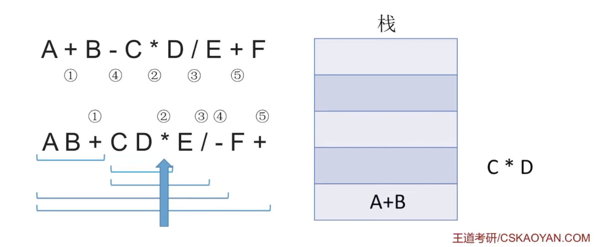
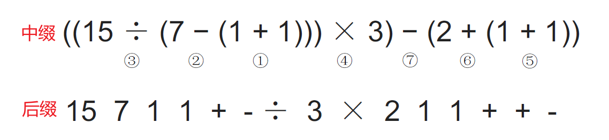
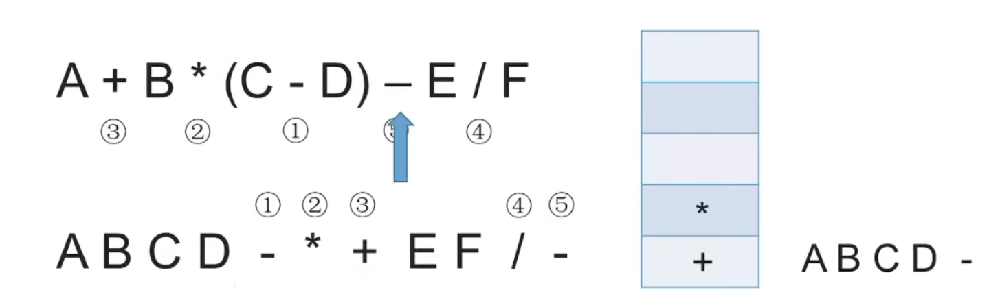
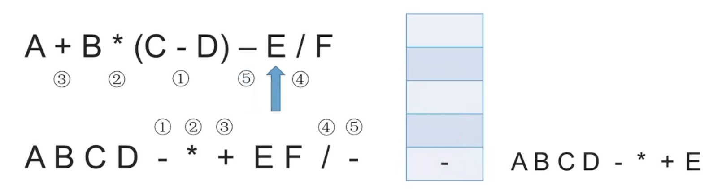
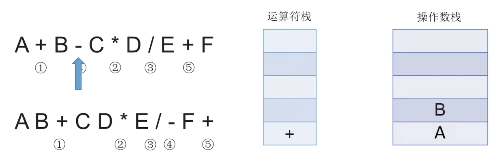

# 1、括号匹配


>遇到左括号就入栈，遇到右括号就出栈

例如：**扫描下方括号，碰到左括号就将其压入栈底，碰到右括号就将其出栈匹配**


如上图，前3个左括号将其压入栈底，第4个发现是右括号，就将3号左括号出栈进行匹配，第5个发现是右括号，将2号左括号出栈进行匹配。


若是括号不匹配，则退出程序，后面的括号就不用扫描了。


## 1.1、代码实现

```c
// 考试中可直接使用基本操作,建议简要说明接口
// 初始化栈
void InitStack(SqStack &S)
// 判断栈是否为空
bool StackEmpty(SqStack &S)
// 新元素入栈
bool Push(SqStack &S,char x)
// 栈顶元素出栈,用x返回
bool Pop(SqStack &S,char &x)

    
#define MaxSize 10							// 定义栈中元素的最大个数
typedef struct{							    
    char data[MaxSize];						// 静态数组存放栈中元素
    int top;								// 栈顶指针
}SqStack;

// 字符数组(存储括号字符)和字符数组长度
bool bracketCheck(char str[],int length){
    SqStack S;
    InitStack(S);							// 初始化一个栈
    for(int i =0; i < length;i++){
        if(str[i] == '(' || str[i] == '[' || str[i] == '{'){
            Push(S.str[i]);					// 扫描到左括号,入栈
        }else{
            if(StackEmpty(S)){				// 扫描到右括号,切当前栈空
                return false;				// 匹配失败
            }
            char topElem;
            Pop(S,topElem);					// 栈顶元素出栈
            if(str[i]==')' && topElem!= '('){
                return false;
            }
            if(str[i]==']' && topElem!= '['){
                return false;
            }
            if(str[i]=='}' && topElem!= '{'){
                return false;
            }
        }
    }
    return StackEmpty(S);					// 检索完全部括号后,栈空说明匹配成功
}
```


# 2、表达式求值


前缀表达式：前缀表达式(也叫波兰表达式)，==运算符在两个操作数前面==

后缀表达式：后缀表达式(也叫逆波兰表达式)，==运算符在两个操作数后面==(考的多)

中缀表达式：==运算符在两个操作数中间==


> 这里做一下解释：例如中缀表达式为：==a + b - c==

后缀表达式计算：

- 我们可以先计算 a + b，转换为后缀表达式为 ab+，再将 ab+ 作为一个整体与 c 进行减法操作，==(ab+)-c==

  转换为后缀表达式为 ==ab+c-==

- 我们也可以先计算 b - c，转换为后缀表达式为 bc-，再将 bc- 作为一个整体与 a 进行加法操作，==a+(bc-)==

  转换为后缀表达式为 ==abc-+==

前缀表达式计算：

- 我们可以先计算 a + b，转换为前缀表达式为 +ab，再将 +ab 作为一个整体与 c 进行减法操作，==(+ab)-c==

  转换为前缀表达式为 ==-+abc==

- 我们也可以先计算 b - c,转换为前缀表达式为 -bc，再将 -bc 作为一个整体与 a 进行加法操作，==a+(-bc)==

  转换为前缀表达式为 ==+a-bc==

> 这里做一下解释：例如中缀表达式为：==a + b - c * d==

后缀表达式计算：

- 我们可以先计算 a + b，转换为后缀表达式为 ab+，再接着计算 c * d，转换为后缀表达式为 cd*，接着让 ab+ 和  cd * 分别作为两个整体进行减法操作，(ab+)-(cd*) 转换为后缀表达式为 ==ab+cd *-==

前缀表达式计算：

- 我们可以先计算 a + b，转换为前缀表达式为 +ab，再接着计算 c * d，转换为前缀表达式为 *cd，接着让 +ab 和 cd * 分别作为两个整体进行减法操作，(+ab)-(*cd) 转换为前缀表达式为 ==-+ab *cd==

## 2.1、中缀表达式转后缀表达式

方法：

1. 确定中缀表达式中==各个运算符的运算顺序==(如下图运算符下方数字就是其运算顺序)
2. 选择下一个运算符，按照 [左操作数 右操作数 运算符] 的方式组合成一个新的操作数


- 左优先原则：==只要左边的运算符能先计算，就优先算左边的==。我们都知道先乘除后加减，有括号的先算括号里面。

- 我们知道运算符的运算顺序不唯一，对应的后缀表达式也不唯一。但是如果我们遵从左优先原则，那么就可以保证对应的后缀表达式唯一，而且机算也是按照左优先原则，这样我们就可以保证手算和机算的结果相同。
- 例如如下案例：


### 2.1.1、后缀表达式的手算

我们将中缀表达式转换为后缀表达式，我们怎么算这个后缀表达式呢？

> 计算方法：从左往右扫描，每遇到一个运算符，就让==运算符前面最近的两个操作数执行对应运算==，==合体为一个操作数==。

我们来看一个例子


如上图后缀表达式

- 我们从左向右扫描，先扫描到 + 号，我们让 + 号前面最近的两个操作数执行 + 运算，合体为 2，于是变为
  - 15 7 2  ➖  ➗ 3 ✖ 2 1 1 ➕ ➕ ➖
- 我们继续将上述后缀表达式从左向右扫描，先扫描到 ➖ ，我们让 ➖ 前面最近的两个操作数执行 ➖ 运算，合体为 5
  - 15 5 ➗ 3 ✖ 2 1 1 ➕ ➕ ➖
- 我们继续将上述后缀表达式从左向右扫描，先扫描到 ➗，我们让 ➗ 前面最近的两个操作数执行 ➗ 运算，合体为 3
  - 3 3 ✖ 2 1 1 ➕ ➕ ➖
- 我们继续将上述后缀表达式从左向右扫描，先扫描到 ✖，我们让 ✖ 前面最近的两个操作数执行 ✖ 运算，合体为 9
  - 9 2 1 1 ➕ ➕ ➖
- 我们继续将上述后缀表达式从左向右扫描，先扫描到 ➕，我们让 ➕ 前面最近的两个操作数执行 ➕ 运算，合体为 2
  - 9 2 2 ➕ ➖
- 我们继续将上述后缀表达式从左向右扫描，先扫描到 ➕，我们让 ➕ 前面最近的两个操作数执行 ➕ 运算，合体为 4
  - 9 4 ➖
- 最后从左向右扫描，扫描到 ➖，我们让 ➖ 前面最近的两个操作数执行 ➖ 运算，合体为 5 
  - 5
- 所以最终结果为 5 

> 注意：两个操作数的左右顺序

### 2.1.2、后缀表达式的机算

我们让运算符前面最近的两个操作数执行对应运算，==也就是最后出现的操作数最先被运算==，这符合栈后进先出的特点，所以我们机算后缀表达式是用栈实现的。步骤如下

1. 从左往右扫描下一个元素
2. 若扫描到操作数则压入栈
3. 若扫描到运算符，则弹出两个栈顶元素，执行运算符运算，运算结果压回栈顶。

例如：

1. 我们扫描如图的后缀表达式，扫描到 A，压入栈，扫描到 B，压入栈


2. 扫描到运算符 ➕，弹出两个栈顶元素 B、A，执行 ➕ 运算，A + B，再将运算结果压入栈顶
   - 注意,先出栈的是 ==右操作数==，这里 B 先出栈，所以 B 为右操作数


3. 接着继续从左向右扫描，扫描到 C，压入栈，扫描到 D，压入栈。

   扫描到运算符 *，弹出两个栈顶元素 D、C，执行 * 运算，C * D，再将运算结果压入栈顶



4. 接着继续从左向右扫描，扫描到 E，压入栈中。

   扫描到运算符 / ，弹出栈顶元素 E 、C*D，执行 / 运算，==(C * D)/E==，再将结果压入栈顶


5. 接着扫描到运算符 ➖，弹出两个栈顶元素 (C * D)/E 、A+B，执行 ➖ 操作，==(A+B)-((C*D)/E)==

   将运算结果压入栈顶


6. 接着从左向右扫描，扫描到 F ，压入栈

   扫描到运算符 ➕，弹出两个栈顶元素 F、(A+B)-((C*D)/E)，执行 ➕ 操作，==(A+B)-((C * D)/E) + F==

   将结果压入栈顶


7. 若表达式合法，则最后栈中只会留下一个元素，就是后缀表达式的最终结果

> 所以其实人喜欢看中缀表达式，计算机更喜欢看后缀表达式。


## 2.2、后缀表达式转中缀表达式

我们知道了中缀表达式转换后缀表达式，那么后缀表达式如何转换为中缀表达式呢？

> 从左往右扫描，每遇到一个运算符，就让==运算符插入前面最近的两个操作数之间，然后操作数两边带上括号==

我们来看一个例子



如上图后缀表达式：

1. 从左向右扫描，先扫描到运算符 ➕ ，变为
   - 15 7  (1+1) ➖ ➗ 3 ✖ 2 1 1 ➕  ➕ ➖ 
2. 接着继续从左到右扫描，先扫描到运算符 ➖
   - 15  (7-(1+1)) ➗ 3 ✖ 2 1 1 ➕  ➕ ➖ 
3. 接着继续从左到右扫描，先扫描到运算符 ➗ 
   - ( 15 /  (7-(1+1)) )  3 ✖ 2 1 1 ➕  ➕ ➖ 
4. 接着继续从左到右扫描，先扫描到运算符 ✖
   - (( 15 /  (7-(1+1)) ) * 3)  2 1 1 ➕  ➕ ➖ 
5. 接着继续从左到右扫描，先扫描到运算符 ➕
   - (( 15 /  (7-(1+1)) ) * 3)  2 (1+1) ➕ ➖ 
6. 接着继续从左到右扫描，先扫描到运算符 ➕
   - (( 15 /  (7-(1+1)) ) * 3)  (2+(1+1))  ➖ 
7. 接着继续从左到右扫描，先扫描到运算符 ➖
   - (( 15 /  (7-(1+1)) ) * 3) - (2+(1+1))  


## 2.3、中缀表达式转前缀表达式

1. 确定中缀表达式中==各个运算符的运算顺序==
2. 选择下一个运算符，按照 [左操作数 右操作数 运算符] 的方式组合成一个新的操作数

注意：

- 中缀表达式转后缀表达式是 ==左优先== 原则
- 中缀表达式转前缀表达式是 ==右优先== 原则


右优先原则：只要右边的运算符能先机算，就优先算右边的

### 2.3.1、前缀表达式的机算

1. 从右往左扫描元素
2. 若扫描到操作数则压入栈
3. 若扫描到运算符，则弹出两个栈顶元素，执行相应运算，运算结果压入栈顶

> 注意：在后缀表达式的机算中，先出栈的是**右操作数**；在前缀表达式的机算中，先出栈的是**左操作数**。


# 3、表达式求值

## 3.1、中缀表达式转后缀表达式机算

初始化一个栈，用于==保存暂时还不能确定运算顺序的运算符==。

从左到右处理各个元素，直到末尾。可能遇到三种情况：

1. 遇到**操作数**。直接加入后缀表达式
2. 遇到**界限符**。遇到左括号 `(` 直接入栈；遇到右括号 `)` 则依次弹出栈内运算符并加入后缀表达式，直到弹出左括号`(` 为止。注意：左括号`(` 不加入后缀表达式。

3. 遇到**运算符**。依次弹出栈中**优先级(乘除优先级高于加减)**高于或等于当前运算符的所有运算符，并加入后缀表达式，若碰到 `(` 或栈空则停止。之后再把当前运算符入栈。

按上述方法处理完所有字符后，将栈中剩余运算符依次弹出，并加入后缀表达式。

---

我们来看一下例子：

1. 如下图的中缀表达式转后缀表达式，从左到右扫描
   - 先扫描到操作数 A，直接加入后缀表达式
   - 再扫描到运算符 ➕，由于栈是空栈，所以将运算符 ➕ 入栈
   - 再扫描到操作数 B，直接加入后缀表达式


2. 继续从左到右扫描
   - 扫描到运算符 ➖，此时栈中有运算符 ➕，加号和减号的运算符优先级相同，则弹出 ➕，并加入后缀表达式，此时后缀表达式为 ==AB+==，此时栈空，将运算符 ➖ 入栈


3. 继续从左到右扫描
   - 扫描到操作数 C，直接加入后缀表达式，此时后缀表达式为 ==AB+C==
   - 扫描到运算符 `*`  ，栈中此时只有 ➖ 减法运算符，没有比乘法运算符优先级高的，所以将 `*` 压入栈中。


4. 继续从左到右扫描
   - 扫描到操作数 D，直接加入后缀表达式，此时后缀表达式为 ==AB+CD==
   - 扫描到运算符`/`，此时栈中有 `*` `-` 两个运算符，乘法运算符和除法运算符优先级相同，所以将 `*` 乘法运算符弹出，并加入后缀表达式，此时后缀表达式为 ==AB+CD*== 
   - 此时栈中只剩下 `-` 减法运算符，没有比 `/` 除法运算符优先级更高或相同的了，所以将 `/` 除法运算符压入栈中


5. 继续从左到右扫描
   - 扫描到操作数 E，直接加入后缀表达式，此时后缀表达式为 ==AB+CD*E==
   - 扫描到运算符 ➕，此时栈中有 `/` `-` 两个运算符，依次弹出栈中优先级高于或等于 ➕ 加号运算符的所有运算符，所以将 `/` `-` 依次弹出并加入后缀表达式，此时后缀表达式为 ==AB+CD*E/-==


6. 继续从左到右扫描
   - 扫描到操作数 F，直接加入后缀表达式，此时后缀表达式为 ==AB+CD*E/-F==
   - 扫描完成，将栈中剩余运算符弹出栈并加入后缀表达式，所以弹出 ➕ 运算符并加入后缀表达式，最终后缀表达式为==AB+CD*E/-F+==

---

我们接着来看一个带有界限符的例子：

1. 如下图的中缀表达式转后缀表达式，从左到右扫描
   - 扫描到操作数 A， 直接加入后缀表达式==A==
   - 扫描到运算符 ➕，此时栈为空，所以入栈
   - 扫描到操作数 B，直接加入后缀表达式==AB==
   - 扫描到运算符 `*` ，此时栈中只有加法运算符 ➕，没有比 `*` 乘法运算符优先级更高或相同的，所以将 `*` 入栈
   - 扫描到左括号 `(` ，直接入栈


2. 继续从左到右扫描
   - 扫描到操作数 C，直接加入后缀表达式==ABC==
   - 扫面描到运算符 ➖，此时本该依次弹出运算符高于或等于 ➖ 运算符的所有运算符，但是由于碰到了左括号`(` ，所以停止进行弹出。将 ➖ 减法运算符压入栈中。
   - 扫描到操作数 D，直接加入后缀表达式==ABCD==


3. 继续从左到右扫描
   - 扫描到右括号 `)` ，则依次弹出栈内运算符并加入后缀表达式，直到遇到左括号 `(` 为止。
     - 所以先弹出 ➖ 运算符，加入后缀表达式==ABCD-==
     - 再弹出左括号`(` ，但是**左括号不加入后缀表达式**。
     - 所以此时后缀表达式为 ==ABCD-==
     - 此时栈中运算符有 `*` `+`



4. 继续从左到右扫描
   - 扫描到 ➖ 运算符，依次弹出优先级高于或者等于 ➖ 运算符并加入后缀表达式中
     - 所以将 `*` `+` 运算符弹出并加入后缀表达式，此时后缀表达式为 ==ABCD-*+==
     - 然后将扫描到的 ➖ 运算符加入栈中



5. 继续从左到右扫描
   - 扫描到操作数 E，直接加入后缀表达式
   - 扫描到运算符 `/` ，栈中没有优先级高于或者等于 `/` 除法运算符的，所以将 `/` 压入栈
   - 扫描到 F，直接加入后缀表达式，此时后缀表达式为 ==ABCD-*+EF==


6. 最后将栈中剩余运算符依次弹出，并加入后缀表达式
   - 所以最终的后缀表达式为：==ABCD-*+EF/-==


## 3.2、中缀表达式的计算

用栈实现中缀表达式的计算

初始化两个栈，==操作数栈==和==运算符栈==。

- 若扫描到操作数，则压入操作数栈
- 若扫描到运算符或界限符，则按照 "中缀转后缀" 相同的逻辑压入运算符栈(==期间也会弹出运算符，每当弹出一个运算符时，就需要再弹出两个操作数栈的栈顶元素并执行相应运算，运算结果再压回操作数栈==)

---

我们来看一个例子：

1. 我们从左向右扫描中缀表达式
   - 扫描到操作数 A，压入操作数栈
   - 扫描到运算符 ➕，此时栈为空，则压入栈
   - 扫描到操作数 B，压入操作数栈




2. 继续从左向右扫描
   - 扫描到运算符 ➖，弹出栈中优先级高于或等于 ➖ 运算符的所有运算符
     - 所以弹出 ➕ 运算符，并将扫描到的运算符 ➖ 压入运算符栈
   - 每当弹出一个运算符时，就需要再弹出两个操作数栈的栈顶元素并执行相应运算，运算结果再压回操作数栈
     - 所以弹出 B、A，运算结果为 ==A + B==，然后将运算结果压回操作数栈。


3. 继续从左向右扫描

   - 扫面描到操作数 C，压入操作数栈中
   - 扫描到运算符 `*` ，运算符栈中没有优先级高于或者等于 `*` 乘法运算符的，所以将 `*` 压入运算符栈

   - 扫描到操作数 D，压入操作数栈中


4. 继续从左向右扫描
   - 扫描到运算符 `/`，弹出运算符优先级高于或者等于 `/` 除号运算符的所有运算符，并将扫描到的 `/` 压入运算符栈
     - 运算符栈中此时有 `*` `-` 两个运算符，所以弹出 `*` 乘法运算符
     - 每当弹出一个运算符时，就需要再弹出两个操作数栈的栈顶元素并执行相应运算，运算结果再压回操作数栈
     - 所以弹出 D、C 两个操作数，并执行 * 运算，运算结果为 ==C * D==，将运算结果压入操作数栈中


5. 继续从左向右扫描

   - 扫描到操作数 E，直接压入操作数栈

   - 扫描到运算符 ➕，弹出运算符优先级高于或者 ➕ 加法运算符的所有运算符，并将扫描到的运算符 ➕ 压入运算符栈

     - 所以将 `/` 除法运算符弹出，一个运算符弹出则需要两个操作数栈的栈顶元素弹出，运算结果为 ==(C*D)/E==，然后将运算结果压入操作数栈

     - 之后将 `-` 减法运算符弹出，一个一个运算符弹出则需要两个操作数栈的栈顶元素弹出，运算结果为 ==(A+B)-((C*D)/E)== ,然后将运算结果压入操作数栈


6. 继续从左向右扫描
   - 扫描到操作数 F，直接压入操作数栈
   - 扫描中缀表达式完成，运算符栈中还有 ➕ 运算符，弹出 ➕ 运算符，对应弹出两个操作数栈的栈顶元素进行计算，则最终结果为 ==(A+B)-((C*D)/E)+F==


# 4、递归

函数调用的特点：最后被调用的函数最先执行结束(LIFO)


例如，对于上述函数调用

1. 开始运行main函数，将main函数里面的返回地址、实参、局部变量先压入栈中
2. 执行func1函数，将其返回地址、实参、局部变量再压入栈中
3. 执行func2函数，将其返回地址、实参、局部变量再压入栈中

---

1. 计算正整数的阶乘n！


```c
// 计算正整数的阶乘n！
int factorial(int n){
    if(n==0 || n==1){
        return 1;
    }else{
        return n*factorial(n-1);
    }
}

void main(){
    int x = factorial(10);
    printf(x);
    
    return 0;
}
```

- 递归算法可以把原始问题转换为属性相同，但规模较小的问题

- 每进入一层递归，就将递归调用所需信息压入栈顶
- 每退出一层递归，就从栈顶弹出相应信息
- 缺点：太多层递归可能会导致栈溢出


# 5、队列的应用

这里简单记录下队列的应用

1. 树的层次遍历
2. 图的广度优先遍历
3. 队列在操作系统中的应用


