# 1、数组的存储结构

## 1.1、一维数组的存储结构

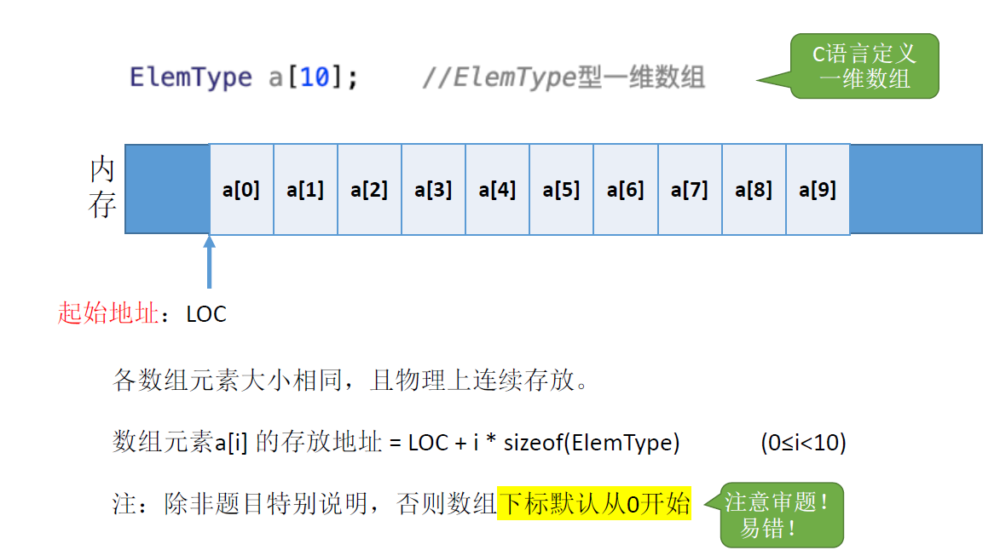

## 1.2、二维数组的存储结构

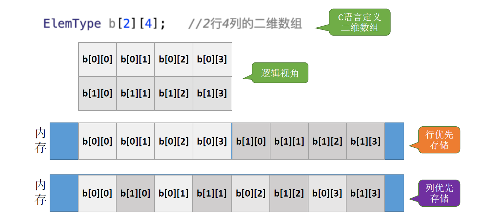

- 行优先：先存行，一行存完存第二行

- 列优先：先存列，一列存完存第二列

> 我们采用行优先或者列优先的存储方式存放二维数组，这样我们就可以==通过二维数组的行号和列号来计算出这个元素所对应的存储地址==。

### 1.2.1、行优先

我们来看行优先的一个例子

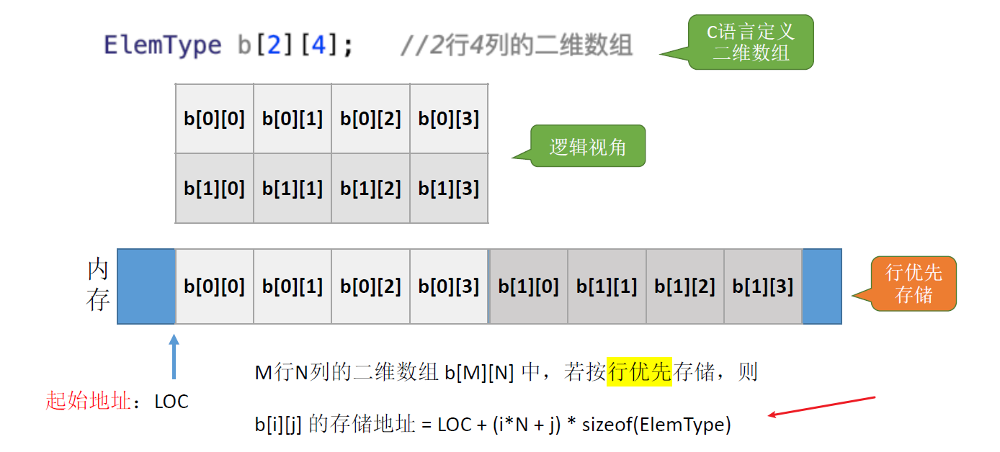

> M 行 N 列的二维数组 b [M] [N] 中，若按行优先存储，则 b [i] [j] 的存储地址 = 起始地址LOC + (i*N+j) * sizeof(ElemType) 

- (i * N + j)  指的是 b[i] [j] 之前有多少个元素，每个元素再乘存储空间，就是 b[i] [j] 元素前面的存储空间
- 再加上起始地址 LOC，就得到 b[i] [j] 的存储地址

### 1.2.2、列优先

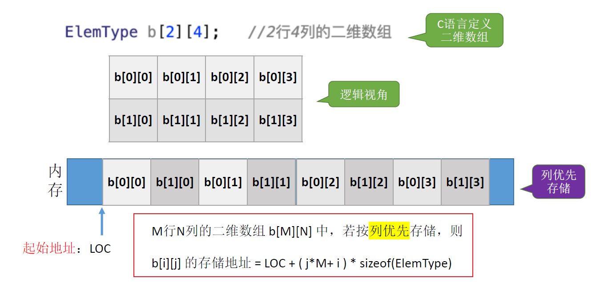

> M 行 N 列的二维数组 b [M] [N] 中，若按列优先存储，则 b [i] [j] 的存储地址 = 起始地址LOC + (j*M+i) * sizeof(ElemType) 

- (j*M+i)指的是 b[i] [j] 之前有多少个元素, 每个元素再乘存储空间，就是 b[i] [j] 元素前面的存储空间
- 再加上起始地址 LOC，就得到 b[i] [j] 的存储地址

# 2、矩阵的存储

## 2.1、普通矩阵的存储

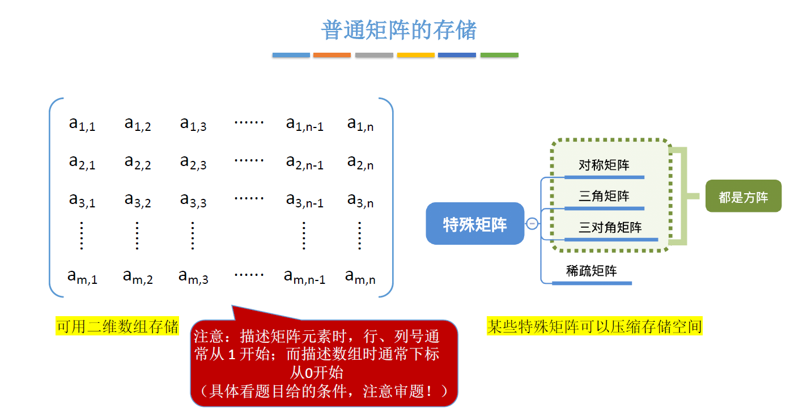

## 2.1、对称矩阵的压缩存储

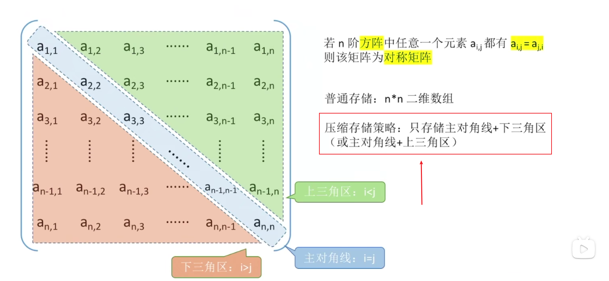

- 策略：只存储主对角线 + 下三角区
  - 按行优先原则将各元素存入一维数组中，共存 (1+n)*n/2 个元素，由于一维数组下标从 0 开始，所以最后一个元素下标是 ==(1+n) * n/2 - 1==

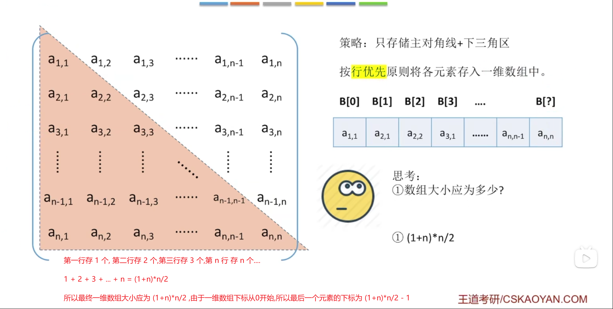

我们最终的目的是将矩阵压缩存储后怎样才能方便使用，这样我们就可以建立一个映射函数，==矩阵下标 -> 一维数组下标==，这样我们想要访问矩阵中某一行某一列的元素时，只需要通过映射函数一转，就可以知道它存放在一维数组的哪个位置。如何做呢？

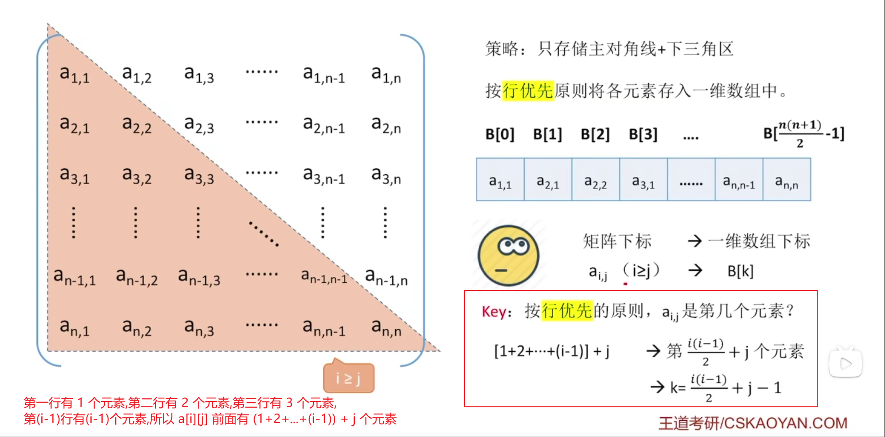

- 按行优先的原则，a[i] [j] 是第 ==(1+2+...+(i-1)) + j== 个元素，但是由于一维数组下标是从 0 开始的，所以对应的一维数组下标为==(1+2+...+(i-1)) + j -1==

- 但是如果我们想访问上三角区的元素呢？虽然上三角区并没有进行存储，但是由于对称矩阵的特性，a[i] [j] = a[j] [i]，我们可以进行转换，相当于我们访问的仍然是下三角区的元素

- 按列优先的原则，第一列存储n个元素，第二列存储n-1个元素，第三列存储n-2个元素，第(j-1)列总共有[n+(n-1)+(n-2)+...+(n-j+2)]个元素，所以a[i] [j] 是第 ==[[n+(n-1)+(n-2)+...+(n-j+2)]+(i-j)+1]== 个元素

## 2.3、三角矩阵的压缩存储

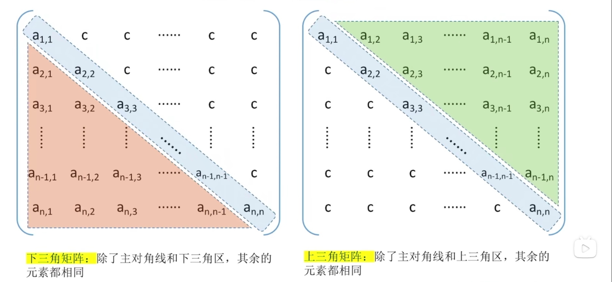

- 策略：如图

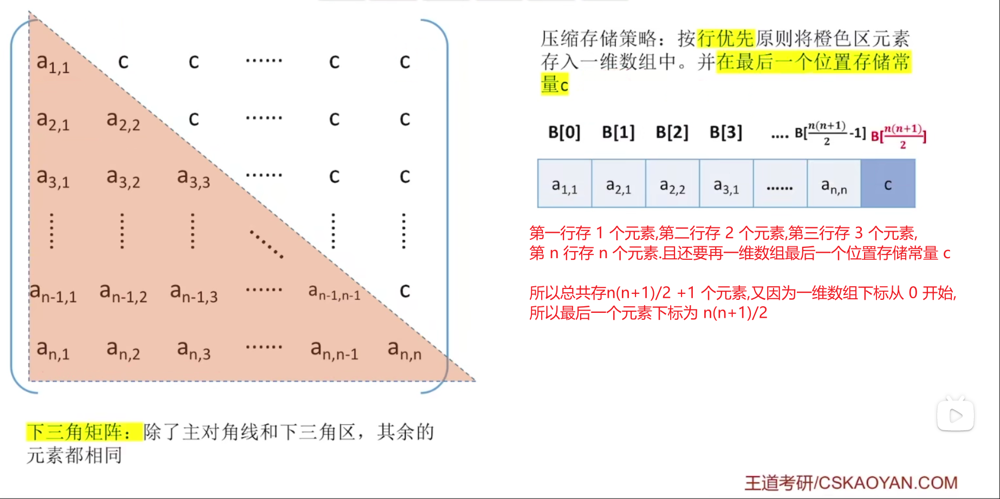

那我们如何用呢？还是建立一个映射函数，这里的映射函数与对称矩阵的映射函数一样，不同的是如果我们访问上三角区常量，我们需要将其映射为一维数组的最后一个元素，因为一维数组最后一个元素存储常量。   

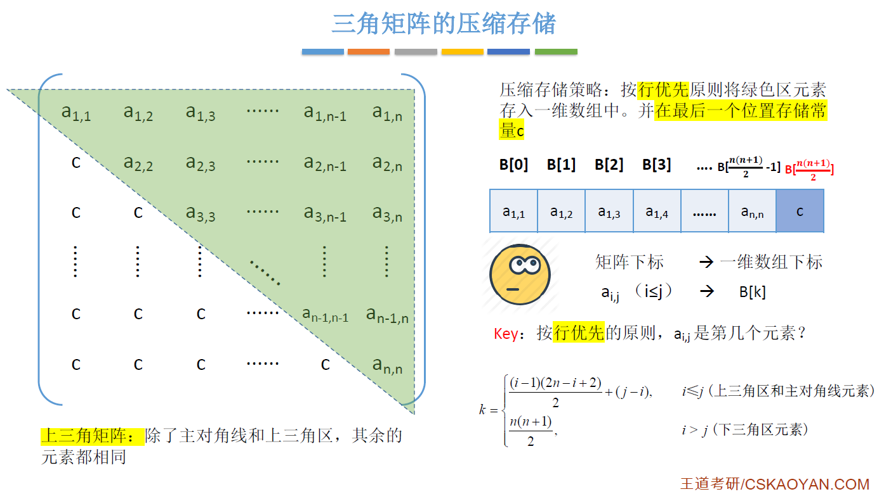

- 按行优先的原则，a[i] [j]前面有 i-1 行，第一行存储n个元素，第二行存储n-1个元素，第三行存储n-3个元素，第(i-1)行存储(n-i+2)个元素，所以a[i] [j]前面共有[[n+(n-1)+(n-2)+...+(n-i+2)+(j-i)]]个元素

## 2.4、三对角矩阵的压缩存储

三对角矩阵，主对角线上的元素可以不为0，主对角线上元素的上下左右相邻元素也可以不为0，但是其余元素必须为0

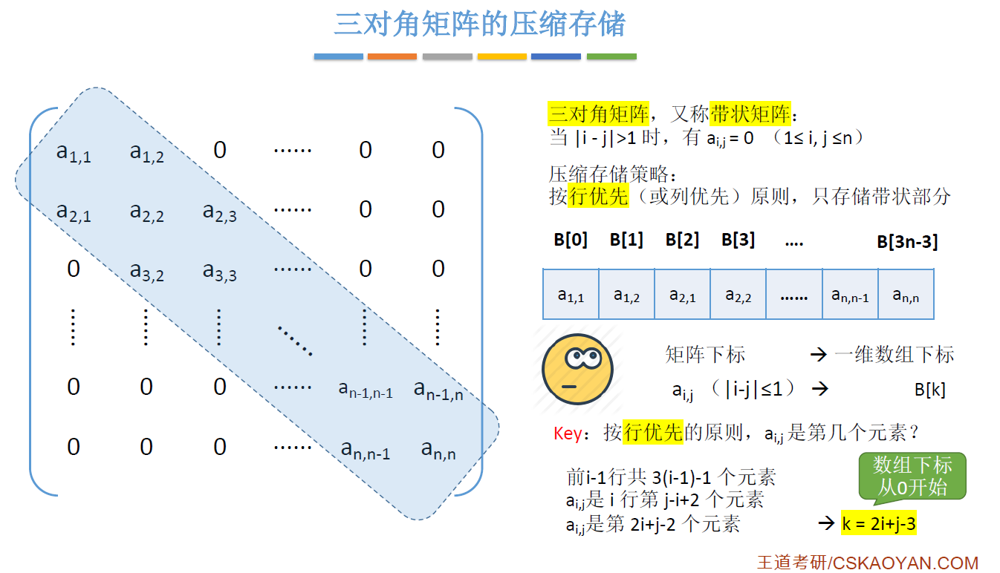

- 按行优先的原则，只存储带状部分，除了第一行和最后一行为 2 个元素，其余行均为 3 个元素，所以总共需要存储 (3n-2) 个元素,由于数组下标默认从0开始，所以最后一个数组下标为 (3n-3)

- 前 i-1 行共 [3(i-1)-1] 个元素
- a[i] [j] 是 i 行的第 j-i+2 个元素
- a[i] [j] 是第 2i+j-2 个元素，转化为 K = 2i+j-3

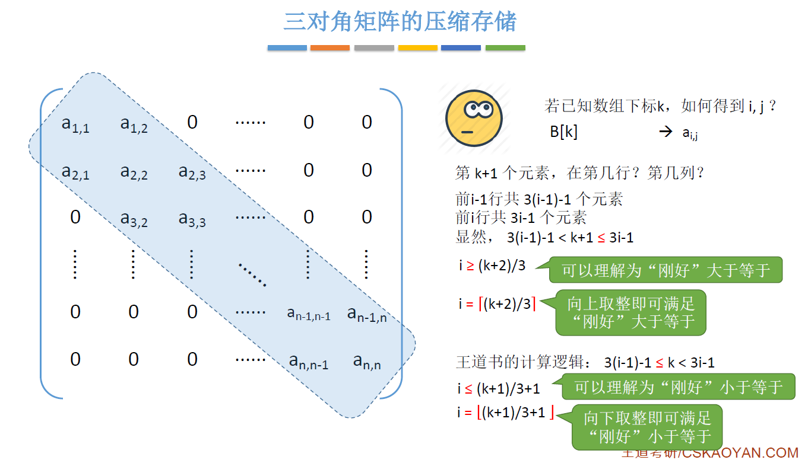

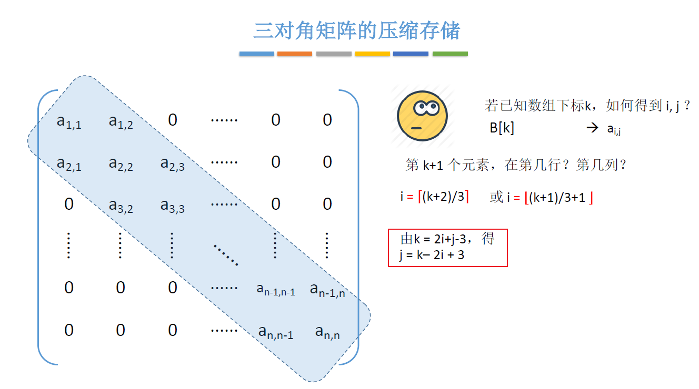

## 2.5、稀疏矩阵的压缩存储

可以使用三元组存储

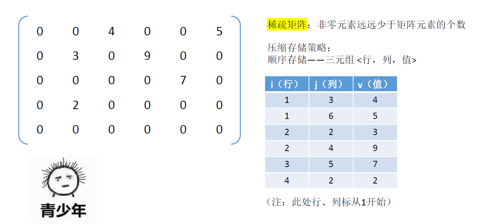

十字链表法

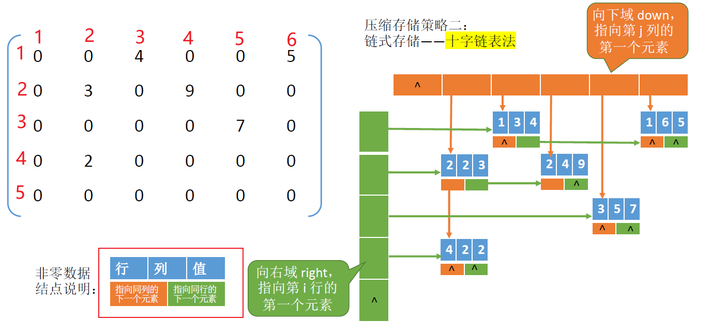

了解即可。

