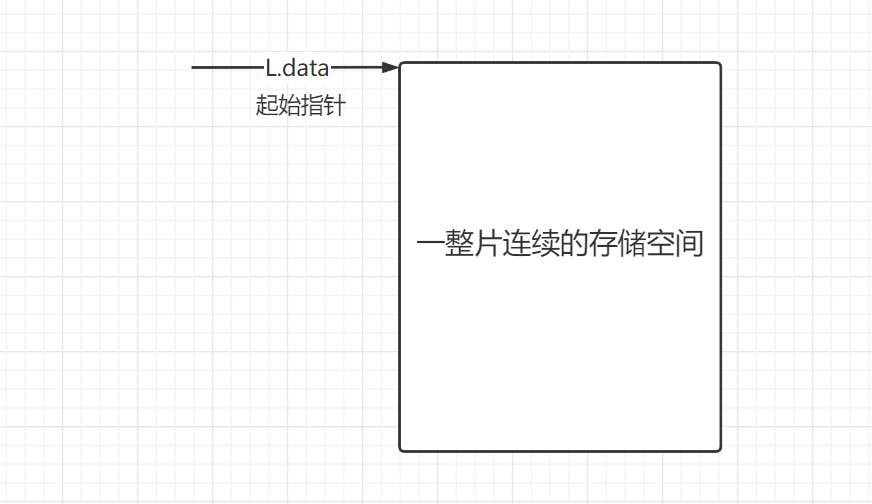
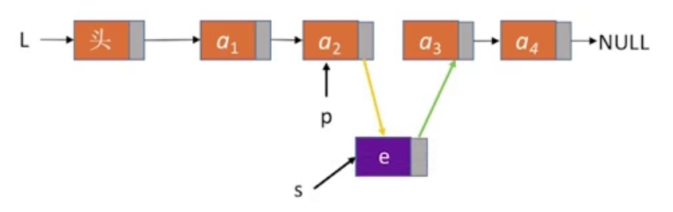

# 1、线性表

**定义**：线性表是具有**相同**数据类型的n(n≥0)个==数据元素==的有限序列，其中n为**表长**，当n = 0 时线性表是一个==空表==。若用L命名线性表，则其一般表示为：

```c
L = (a1,a2,....,ai,ai+1,.....,an)
```


- **相同数据类型**：例如 a1 是 int 型，则其他的数据类型也需要都是 int 型。当然我们也可以自己定义 struct 类型，将其作为数据类型
- **相同数据类型**也意味着每个元素所占的空间是一样大的
- **序列**：说明线性表中的数据元素是==有次序==的
- **有限**：线性表中的数据元素是有限的。反例：所有的整数按递增次序排列，虽然满足数据元素相同、有次序，但是不满足有限，所以不是线性表。
- **位序为1**：我们描述线性表的第一个元素是从1开始，表示第一个数据元素。==数组下标+1=位序==

**线性表的特点**：

- 线性表中的元素的==个数是有限的==
- 线性表中的元素有==先后次序==
- 线性表中的数据类型都相同，这意味着==每个元素占有相同大小的存储空间==
- a~i~ 是线性表中的 "第i个" 元素线性表中的==位序==（位序是从1开始，数组下标从0开始）
- a~1~是==表头元素==，a~n~是==表尾元素==
- 除第一个元素外，每个元素有且仅有一个==直接前驱==；除最后一个元素外 ，每个元素有且仅有一个==直接后继==

## 1.1、线性表的基本操作

- InitList(&L) ：**初始化表**。构造一个空的线性表L，分配内存空间。
- DestroyList(&L) : **销毁操作**。销毁线性表，并释放线性表L所占用的内存空间
- ListInsert(&L,i,e) : **插入操作**。在表L中的第i个位置处插入指定元素e
- ListDelete(&L,i,&e) : **删除操作**。删除表L中第i个位置的元素，并用e返回删除元素的值
- LocateElem(L,e) ：**按值查找操作**。在表L中查找具有给定关键字值的元素。
- GetElem(L,i) ： **按位查找操作**。获取表L中的第i个位置的元素的值。

> 思考：什么时候要传入引用类型&
>
> 答案：对参数的修改结果要"带回来"。我们来看下面的代码

```cpp
#include<studio.h>

void test(int x){
    x = 1024;			// 局部变量x 只在 test 函数内生效
    printf("test函数内部x=%d\n",x);
}

int main(){
    int x = 1; // 局部变量x 只在 main 函数内生效
    printf("调用test函数前x=%d\n",x);
    test(x);	// 对参数的修改结果没有带回来
    printf("调用test函数后x=%d\n",x);
    
    return 0;
}
```

结果为：

```c
调用test函数前x=1
test函数内部x=1024
调用test函数后x=1    
```

调用test函数前x=1，调用test函数将x值改为1024，但是test函数执行结束返回main函数的时候x值又变成了1。所以虽然test函数对x的值进行了修改，但是修改的结果没有带回来。(==其实是因为局部变量只能在函数内部生效==)


---

我们将参数类型改为引用类型

```cpp
#include<studio.h>

void test(int &x){
    x = 1024;			
    printf("test函数内部x=%d\n",x);
}

int main(){
    int x = 1; 
    printf("调用test函数前x=%d\n",x);
    test(x);	// 对参数的修改结果带回来
    printf("调用test函数后x=%d\n",x);
    
    return 0;
}
```

结果是

```c
调用test函数前x=1
test函数内部x=1024
调用test函数后x=1024    
```

传入引用类型，那么main函数和test函数对x值的修改是同一片地址。


所以现在我们来看线性表的基本操作中为什么有的加了引用类型，有的没加引用类型呢。


**例如插入操作，我们希望修改线性表的内容，并且希望将修改后的结果带回去，所以加了引用&符号。**

# 2、顺序表

**定义**：把用==顺序存储==的方式实现的线性表叫做顺序表

**顺序存储**：把==逻辑上相邻==的元素存储在==物理位置上也相邻==的存储单元中，元素之间的关系由存储单元的邻接关系来体现。


线性表第一个元素的存放位置是 LOC(L) ，则第二个元素的存放位置是  LOC(L)+数据元素大小。数据元素大小在C语言中使用 `sizeof(ElemType)` 来查看

```c
// 例如一个int型的数据在内存中占4B
sizeof(int) = 4B
    

typedef struct {
    int num; // 号数
    int people; // 人数
}Customer;
// 例如一个Customer型的数据在内存中占8B
sizeof(Customer) = 8B
```

**顺序表有两种实现方式**：静态分配实现和动态分配实现

## 2.1、静态分配实现

```c
#define MaxSize 10;				//定义最大长度
typedef struct{
    ElemType data[MaxSize];		//用静态的"数组"存放数据元素
    int length;					//顺序表的当前长度
}SqList;						//顺序表的类型定义(静态分配方式) Sq:sequence=顺序,序列
```

- MaxSize的值决定了顺序表最多可以存放几个元素
- lenght的值表示当前顺序表中已经存放了几个元素

从内存的视角来看，当我们声明一个 `data[MaxSize]` data数组的时候，在内存中开辟了一整片的连续空间，如下图：


### 2.2.1、初始化顺序表

```c
#include<stdio.h>
#define MaxSize 10;				//定义最大长度
typedef struct{
    int data[MaxSize];		//用静态的"数组"存放数据元素,这里的元素数据类型ElemType是int
    int length;					//顺序表的当前长度
}SqList;						//顺序表的类型定义

// 基本操作-初始化一个顺序表
void InitList(SqList &L){
    for(int i=0;i<MaxSize;i++)
    {
        L.data[i] = 0;			//将所有数据元素设置为默认初始值
    }
    L.length = 0;				//顺序表初始长度为0 
}


int main(){
    SqList L; 					//声明一个顺序表
    InitList(L);				//初始化顺序表
    
    return 0;
}
```

具体在内存中的表现如下图：


## 2.2、动态分配实现

```c
#define MaxSize 10;				//定义最大长度
typedef struct{
    ElemType *data;				//指针指向第一个数据元素
    int MaxSize;				//顺序表的最大容量
    int length;					//顺序表的当前长度
}SeqList;						//顺序表的类型定义(动态分配方式)
```

动态分配实现：动态申请和释放内存空间

- C语言中使用 `malloc` 函数动态申请空间，使用 `free` 函数释放内存空间



- `malloc()` 函数会向堆中申请一片连续的可用内存空间,申请成功会返回这片内存空间的起始指针，因为我们是向这片空间中存放我们的数据元素的，所以需要强制转型为我们定义的数据元素类型指针。返回的起始指针我们赋给顺序表中的 `data` 指针变量，==也就是说data指针指向了空间的起始地址==。

```c
SeqList L;
L.data = (ElemType *)malloc(sizeof(ElemType) * InitSize);
// (ElemType *) 强制转型为我们定义的数据元素类型指针
// malloc 函数的参数指明要分配多大的连续内存空间
```


---

- C++中使用的是 `new` 和 `delete` 来动态申请空间和释放空间，当然malloc和free依然可以使用

```cpp
int *p = new int; // 分配一个int型的内存空间
delete p ; // 释放内存

int *p = new int[10]; // 分配10个int型的内存空间
delete[] p ; // 释放内存
```

- 注意：如果使用`new[]`分配的内存，则需使用 `delete[]`来释放

### 2.2.1、初始化顺序表

```c
#define MaxSize 10;				//定义最大长度
#include<stdio.h>
#include<stdlib.h>				//malloc和free函数的头文件
typedef struct{
    int *data;				//指针指向第一个数据元素
    int MaxSize;				//顺序表的最大容量
    int length;					//顺序表的当前长度
}SeqList;						//顺序表的类型定义

//	基本操作-初始化一个顺序表
void InitList(SeqList &L){
    //用malloc函数申请一片连续的存储空间
    //malloc函数返回一个指针,需要强制转型为你定义的数据元素类型指针
    L.data=(int *)malloc(sizeof(ElemType)*InitSize);
    L.length = 0;			//顺序表初始长度为0
    L.MaxSize = InitSize;	//顺序表的最大长度
}

// 增加动态数组的长度
void IncreaseSize(SeqList &L,int len){
    int *p = L.data;		//让指针p指向顺序表中的第一个数据元素
    L.data=(ElemType *)malloc(sizeof(ElemType)*(L.MaxSize+len));
    for(int i=0; i<L.length; i++){
        L.data[i] = p[i];	//将数据复制到新区域
    }
    L.MaxSize = L.MaxSize + len;	//顺序表最大长度增加 len
    free(p);						//释放原来的内存空间
}


int main(){
    SeqList L;	//声明一个顺序表
    InitList(L);//初始化顺序表
    // 往顺序表中随便插入几个元素
    IncreaseSize(L,5);//给顺序表L增加5个数据元素大小
    return 0;
}
```


1. 声明顺序表L`SeqList L` ，计算机会在内存中申请一片空间，用于存放MaxSize、lenght、*data变量。
2. 初始化顺序表`InitList(L)` ，计算机会在内存中申请一片空间，并且 data 指针指向空间的起始地址
3. 增加动态数组的长度时候，我们把 data 指针的指向赋给 p 指针，也就是说 p 指针和 data 指针指向同一地址，即起始地址。然后我们申请了15个内存空间，让 data 指针又指向新申请15个内存空间的起始地址。使用 for 循环将数据复制
4. free(p) 会将 p 指向的一整片连续存储空间给释放掉，然后 p 被系统自动回收
5. 这么一套下来时间开销大

## 2.3、顺序表的特点

1. **随机访问**：即可以在O(1)【常数级的时间复杂度】时间内中找到第i个元素
   - 原因就是因为数据元素在顺序表中是连续存放的，只需要知道第一个元素的存放地址，后面的就很容易算出来
2. **存储密度高**，每个节点只存储数据元素
   - 如果采用链式存储，除了存储数据元素还要存储指针，这样存储密度就低了
3. 扩展容量不方便
   - 静态分配根本不可以扩展容量
   - 动态分配虽然可以，但是时间开销大
4. **插入、删除操作不方便，需要移动大量元素**


## 2.4、顺序表的插入

`ListInsert(&L,i,e)` ：插入操作，在表L中的第 i 个位置上插入指定元素e。若 i 的输入不合法，则返回false，表示插入失败，否则，将第i个元素及其后的所有元素依次往后移动一个位置，腾出一个空位置插入新元素e，顺序表长度增加1，插入成功，返回true。

```c
#define MaxSize 10;				//定义最大长度

typedef struct{
    int data[MaxSize];		//用静态的"数组"存放数据元素
    int length;					//顺序表的当前长度
}SqList;						//顺序表的类型定义(静态分配方式)

// 插入操作:在L的位序 i 处插入元素e
bool ListInsert(SqList &L,int i,int e){
    if(i<1 || i>L.length+1)		//判断i的范围是否有效
        return false;
    if(L.length >= MaxSize)		//当前存储空间已满,不能插入
        return false;
    //将第i个元素及之后的元素后移
    for(int j=L.length;j>=i;j--)
    {
        L.data[j] = L.data[j-1];
    }                             
    L.data[i-1]=e;				//在位置i处放入e,注意位序、数组下标的关系. (位序 - 1 = 数组下标)
    L.length++;					//长度加1
    return true;
}


int main(){
    SqList L;	//声明一个顺序表	
    InitList(L);//初始化顺序表
    //...此处省略一些代码,插入几个元素
    ListInsert(L,3,3);//在L的位序 3 处插入元素3
    return 0;
}
```


例如在第3个位序处插入元素f，将第三个及之后的元素后移。

### 2.4.1、插入操作时间复杂度

只需关注最深层循环语句的执行次数与问题规模n=L.length(表长)的关系

```c
//将第i个元素及之后的元素后移
for(int j=L.length;j>=i;j--)
{
    L.data[j] = L.data[j-1]; //例如 L.data[5] = L.data[4],将下标为4的元素赋值给下标为5的元素
}
```

- 最好情况：新元素插入到表尾，不需要移动元素，时间复杂度O(1)

  - i=n+1，循环0次

- 最坏情况：新元素插入到表头，需要将原有的n个元素全都向后移动，循环n次，时间复杂度O(n)

  - i=1，循环n次

- 平均情况：假设新元素插入到任何一个位置的概率相同，时间复杂度O(n)

  - 假设新元素插入到任何一个位置的概率相同，即i=1，2，3、、、lenght+1的概率都是 p = 1/(n+1) 。 因为n个元素总共有n+1个位置

  - i=1，循环n次；i=2，循环n-1次、、、、i=n+1时，循环0次

  - 平均循环次数：np+(n-1)p+(n-2)p+.......+1p 
    $$
    np+(n-1)p+(n-2)p+.......+1p  = \frac{n(n+1)}{2} \frac{1}{n+1} = \frac{n}{2}
    $$
    


## 2.5、顺序表的删除

`ListDelete(&L,i,&e)`：删除操作。删除表L中第i个位置的元素，并用e返回删除元素的值。若i的输入不合法，则返回false，否则，将被删元素赋给引用变量e，并将第i+1个元素及其后的所有元素依次往前移动一个位置，返回true。

```c
//删除表L中位序为i的元素，并用e返回删除元素的值
bool ListDelete(SqList &L,int i,int &e){
    if(i<1 || i>L.length+1)		//判断i的范围是否有效
        return false;
    e = L.data[i-1];			//将被删除的元素赋值给e
    //将第i个位置后的元素前移
    for(int j=i;j<length;j++)
    {
        L.data[j-1] = L.data[j]; //将后面的前移
    }
    
    L.length--;					//线性表长度减1
    return true;
}


int main(){
    SqList L;	//声明一个顺序表	
    InitList(L);//初始化顺序表
    //...此处省略一些代码,插入几个元素
    int e = -1;	//用变量e把删除的元素"带回来"
   	if(ListDelete(L,3,e)){
        print("已删除第3个元素,删除元素值为=%d\n",e);
    }else{
        print("位序i不合法,删除失败\n");
    }
    return 0;
}
```


- 这里函数定义中的参数e加了引用符号，目的是使得在此时声明的变量e和main函数中声明的变量e是同一片内存空间


### 2.5.1、删除操作时间复杂度

只需关注最深层循环语句的执行次数与问题规模n的关系

```c
//将第i个位置后的元素前移
for(int j=i;j<length;j++)
{
    L.data[j-1] = L.data[j];//例如 L.data[4] = L.data[5],将下标为5的元素赋值给下标为4的元素
}
```

- 最好情况：删除表尾元素，不需要移动其他元素，最好时间复杂度O(1)

  - i=n，循环0次

- 最坏情况：删除表头元素，需要将后续的 n-1 个元素全都向前移动。循环n-1 次，最坏时间复杂度O(n)

  - i=1，循环n-1次

- 平均情况：平均时间复杂度O(n)

  - 假设删除任何一个元素的概率相同，即i=1，2，3、、、lenght+1的概率都是 p = 1/n。 因为共有n个元素

  - i=1，循环n-1次；i=2，循环n-2次、、、、i=n时，循环0次

  - $$
    (n-1)p+(n-2)p+.......+1p  = \frac{n(n-1)}{2} \frac{1}{n} = \frac{n-1}{2}
    $$

    


### 2.5.2、总结


## 2.6、顺序表的查找

### 2.6.1、静态分配按位查找

`GetElem(L,i)`：按位查找操作。获取表L中第i个位置的元素的值

```c
typedef struct{
    ElemType data[MaxSize];		//用静态的"数组"存放数据元素
    int length;					//顺序表的当前长度
}SqList;						//顺序表的类型定义(静态分配方式)


// 按位查找操作。获取表L中位序为i的元素的值
ElemType GetElem(SqList L,int i){
    return L.data[i-1]; //位序为i的元素对应的数组下标是i-1
}
```


### 2.6.2、动态分配按位查找

```c
#define InitSize 10;			//顺序表的初始长度
typedef struct{
    ElemType *data;				//指针指向第一个数据元素
    int MaxSize;				//顺序表的最大容量
    int length;					//顺序表的当前长度
}SeqList;						//顺序表的类型定义(动态分配方式)

// 按位查找操作。获取表L中位序为i的元素的值
// 虽然data是指针,但是仍然可以用访问数组下标的方式访问元素
ElemType GetElem(SqList L,int i){
    return L.data[i-1];			//和访问普通数组的方法一样
}
```

用某一个类型的指针加上数组下标的方式来访问数据，系统在背后取数据的时候每次取几个空间和指针的类型有关。


### 2.6.3、按位查找时间复杂度

由于顺序表的各个数据元素在内存中连续存放，因此可以根据起始地址和数据元素大小立即找到第i个元素➡`"随机存取"特性`，按位查找的时间复杂度为O(1)


### 2.6.4、按值查找

`LocateElem(L,e)`：按值查找操作。在表L中查找值为e的元素

```c
#define InitSize 10;			//顺序表的初始长度
typedef struct{
    ElemType *data;				//指针指向第一个数据元素
    int MaxSize;				//顺序表的最大容量
    int length;					//顺序表的当前长度
}SeqList;						//顺序表的类型定义(动态分配方式)

//在顺序表L中查找第一个元素值等于e的元素，并返回其位序
int LocateElem(SeqList L,ElemType e){
    // 从数组下标为0的位置开始遍历 
	for(int i=0;i<L.length;i++)
    {
        if(L.data[i]==e)
        {
            return i+1;		//数组下标为i的元素值等于e,返回其位序i+1,这里i指的是数组下标
        }
        return 0;			//退出循环,说明查找失败
    }
}
```


### 2.6.5、按值查找时间复杂度

关注最深层循环语句的执行次数与问题规模n的关系，问题规模`n=L.length（表长）`

```c
int LocateElem(SeqList L,ElemType e){
	for(int i=0;i<L.length;i++)
    {
        if(L.data[i]==e)
        {
            return i+1;		//数组下标为i的元素值等于e,返回其位序i+1
        }
        return 0;			//退出循环,说明查找失败
    }
}
```

- 最好情况：目标元素在表头，只需要循环1次，最好的时间复杂度为O(1)
- 最坏情况：目标元素在表尾，需要循环n次，最坏时间复杂度为O(n)
- 平均情况：O(n)


### 2.6.6、总结


# 3、单链表

顺序表：用顺序存储结构实现的线性表叫做顺序表

- 顺序表优点：可随机存取，存储密度高
- 顺序表缺点：要求大片连续空间，改变容量不方便

链表：用链式存储结构实现的线性表叫做链表，链表分为：

- 单链表
- 双链表
- 循环链表
- 静态链表

单链表优点：不要求大片连续空间，改变容量方便

单链表缺点：不可随机存取，要耗费一定空间存放指针

单链表：线性表的链式存储又称单链表，它是指通过一组任意的存储单元来存储线性表中的数据元素，为了建立数据元素之间的线性关系，对每个链表结点，除存放元素自身的信息外，还需要存放一个指向其后继的指针。


## 3.1、单链表的定义

单链表是由一个一个的结点组成的，结点包含存放数据元素的数据域和指向下一个数据元素的指针。

```c
typedef struct LNode{				//定义单链表结点类型
    ElemType data;					//每个结点存放一个数据元素(数据域)
    struct LNode * next;			//指针指向下一个结点(指针域)
}LNode,*LinkList;					//LinkList为指向结构体LNode的指针类型
//增加一个新的结点:在内存中申请一个结点所需空间,并用指针p指向这个结点
LNode *p =(LNode *)malloc(sizeof(LNode));
```

上述代码等价于：

```c
// 上述定义代码等价于下面代码
struct LNode{
    ElemType data;					//每个结点存放一个数据元素(数据域)
    struct LNode *next;				//指针指向下一个结点(指针域)
};
typedef struct LNode LNode;			//struct LNode = LNode
typedef struct LNode * LinkList;	//struct LNode *= LinkList 

//增加一个新的结点:在内存中申请一个结点所需空间,并用指针p指向这个结点
struct LNode *p =(struct LNode *)malloc(sizeof(struct LNode))
    
//之所以用上面的代码,是因为下面代码写起来繁琐
```

要表示一个单链表时，只需声明一个头指针L，指向单链表的第一个结点，这样所有的结点都可以找到

```c
LNode *L;		//声明一个指向单链表的第一个结点的指针
LinkList L;		//声明一个指向单链表的第一个结点的指针
```

上述两种声明方式有什么区别呢？

- `LNode *` ： 强调这是一个结点
- `LinkList `：强调这是一个单链表


## 3.2、初始化不带头结点的单链表

```c
typedef struct LNode{				//定义单链表结点类型
    ElemType data;					//每个结点存放一个数据元素(数据域)
    struct LNode * next;			//指针指向下一个结点(指针域)
}LNode,*LinkList;					//LinkList为指向结构体LNode的指针类型

// 初始化一个空的单链表
bool InitList(LinkList &L){
    L = NULL;						//空表,暂时还没有任何结点(这一步防止脏数据)
    return true;					
}

void test(){
    LinkList L;						//声明一个指向单链表的指针
    //初始化一个空表
    InitList(L);
}
```


## 3.3、不带头结点的单链表是否为空

```c
//判断单链表是否为空
bool Empty(LinkList L){
    return (L==NULL);
}
```


## 3.4、初始化带头结点的单链表

```c
typedef struct LNode{				//定义单链表结点类型
    ElemType data;					//每个结点存放一个数据元素(数据域)
    struct LNode * next;			//指针指向下一个结点(指针域)
}LNode,*LinkList;					//LinkList为指向结构体LNode的指针类型


//初始化一个单链表(带头结点)
bool InitList(LinkList &L){
    //用malloc申请一片空间存一个结点
    //并且把malloc返回的地址赋给头指针L,也就是说头指针L是指向了这个结点
    L =(LNode *)malloc(sizeof(LNode));	
    if(L==NULL)							//分配不足,分配失败
    {
       return false; 
    }
    L->next = NULL;						//头节点之后暂时还没有结点
    return true;
}

void test(){
    LinkList L;							//声明一个指向单链表的指针
    //初始化一个空表
    InitList(L);
}
```


## 3.5、带头结点的单链表是否为空

```c
//判断单链表是否为空(带头结点)
bool Empty(LinkList L){
    if(L->next == NULL){
        return true;
    }else{
        return false;
    }
}
```

> 不带头节点，写代码更麻烦。对第一个数据结点和后续数据结点的处理需要用不同的代码逻辑，对空表和非空表的处理需要用不同的代码逻辑
>
> 带头结点，写代码会更方便

## 3.6、单链表的插入

### 3.6.1、带头结点按位序插入

`ListInsert(&L,i,e)`：插入操作。**在表L中的第i个位置上插入指定元素e**

(找到第i-1个结点，将新结点插入其后)


带头结点的单链表在插入任何位置时的处理逻辑都是一样的，例如我们想在a1前面插入元素，和在 a2 前面插入元素的处理逻辑一样。

```c
// 在第i个位置插入元素e(带头结点)
bool ListInsert(LinkList &L,int i,ElemType e){
    if(i<1){						// i表示位序,位序是从1开始
        return false;
    }
    LNode *p;		//指针p指向当前扫描到的结点
    int j=0;		//当前p指向的是第几个结点
    p = L;			//L指向头结点,头结点是第0个结点(不存数据),指针P指向和L相同的位置
    
    while(P!=NULL && j<i-1){	//循环找到第 i-1 个结点
        p=p->next;			//让p结点指向下一个结点
        j++;
    }
    if(p==NULL)		//i值不合法
    {
        return false;
    }
    LNode *s = (LNode *)malloc(sizeof(LNode)); //申请新的结点空间
    s->data=e;	// 把参数e存到新结点里面
    s->next = p->next;	//将结点s的next指针指向p结点的next指针(下图中绿色线条)
    p->next = s;	//将p结点的next指针指向新结点s(下图中黄色线条)
    return true;	//插入成功
}
```

分析：

1. 如果 i=1(也就是在表头插入元素)：时间复杂度O(1)

   表头插入元素，p=0，j=0，i-1=0。则跳过上述代码两个循环，直接申请新结点s，将参数e存到新结点s中，将新结点s的next指针指向p结点的next指针，然后将p结点的next指针指向新结点s。


2. 如果 i = 3(也就是在表中插入元素)

   表中插入元素，p=0，j=0，i-1=2，j<i-1,进入循环，让p结点指向下一个结点，j=1，j<i-1,再次进入循环，让p结点指向下一个结点，j=2，跳出循环，申请新结点s，将参数e存到新结点s中，将新结点s的next指针指向p结点的next指针，然后将p结点的next指针指向新结点s。

   



3. 如果 i = 5(也就是在表尾插入元素)：时间复杂度O(n)

   表尾插入元素，p=0，j=0，i-1=4，j<i-1,进入循环，让p结点指向下一个结点；j=1，j<i-1,再次进入循环，让p结点指向下一个结点；j=2，j<i-1,再次进入循环，让p结点指向下一个结点；j=3，j<i-1,再次进入循环，让p结点指向下一个结点；j=4，跳出循环，申请新结点s，将参数e存到新结点s中，将新结点s的next指针指向p结点的next指针NULL，然后将p结点的next指针指向新结点s。


4. 如果i=6(总共才5个位序)，p指针会指向NULL，跳出循环


---

注意：这里的两行代码不能颠倒

```c
s->next = p->next;	//将结点s的next指针指向p结点的next指针(上图中绿色线条)
p->next = s;	//将p结点的next指针指向新结点s(上图中黄色线条)
```

==宏观把握代码==：无非就是找到第i-1个结点，然后在第i-1个结点之后插入新的结点


###  3.6.2、不带头结点按位序插入

`ListInsert(&L,i,e)`：插入操作。**在表L中的第i个位置上插入指定元素e**

(找到第i-1个结点，将新结点插入其后)


```c
bool ListInsert(LinkList &L,int i,ElemType e){
    if(i<1)
    {
        return false;
    }
    if(i==1)		//插入第1个结点的操作与其他结点操作不同
    {
        LNode *s =(LNode *)malloc(sizeof(LNode)); // 申请一个新结点s
        s->data = e; //把参数e赋值给结点s的数据域
        s->next = L;//将新结点的s指针指向L所指向的结点
        L = s;		//头指针L指向新结点
        return true;
    }
    
    
    LNode *p;		//指针p指向当前扫描到的结点
    int j=1;		//当前p指向的是第几个结点
    p = L;			//p指向第1个结点(注意:不是头结点)
    
    while(P!=NULL && j<i-1){	//循环找到第 i-1 个结点
        p=p->next;
        j++;
    }
    if(p==NULL)		//i值不合法
    {
        return false;
    }
    LNode *s = (LNode *)malloc(sizeof(LNode));
    s->data=e;
    //将s指向结点的next指针指向p指向结点的next指针
    s->next = p->next;	
    p->next = s;	//将p指向结点的next指针指向s
    return true;	//插入成功
}
    
}
```

分析：

- i=1(插在表头)，在我们插入或者删除第一个结点的时候，我们需要更改头指针的指向。


- i>1时，和带头结点的判断方式一致。

---


- 结论：不带头结点写代码不方便，推荐用带头结点
- 注意：考试中带头、不带头都有可能考察，注意审题


## 3.7、指定结点的后插操作

后插操作：在结点之后插入元素


```c
//后插操作:在p结点之后插入元素e
bool InsertNextNode(LNode *p,ElemType e){
    if(p==NULL)
    {
        return false;
    }
    LNode *s =(LNode *)malloc(sizeof(LNode));
    if(s==NULL)		//某些情况下有可能分配失败,比如内存不足
    {
        return false;	
    }
    s->data = e;			// 用结点s保存数据元素e
    s->next = p->next;
    p->next = s;			// 将结点s连到p之后
    return true;
}
```


## 3.8、指定结点的前插操作

前插操作：在结点之前插入元素。单链表只能找后面的结点，这前插操作要怎么实现呢？例如要在p结点前插入结点，首先申请新结点，然后将新结点连为p结点的后继结点，并且将p结点的数据复制进新结点，然后将参数e放到p结点里面。虽然我们没办法找到p结点的前驱结点，但是这种逻辑也可以实现相同的效果。这种效果的时间复杂度是O(1)


```c
//前插操作:在p结点之前插入元素e
bool InsertPriorNode(LNode *p,ElemType e){
    if(p==NULL)
    {
        return false;
    }
    LNode *s =(LNode *)malloc(sizeof(LNode));
    if(s==NULL)			//内存分配失败
    {
        return false;
    }
    s->next = p->next;	//新结点s连接到p的后继结点
    p->next = s;		//新结点 s 连接到 p 之后
    s->data = p->data;	//将p中元素复制到s中
    p->data = e;		//p中元素覆盖为e
    return true;
}
```

王道书中的版本：


```c
//前插操作:在p结点之前插入结点s
bool InsertPriorNode(LNode *p,LNode *s){
    if(p==NULL || s==NULL)
    {
        return false;
    }
    s->next = p->next;
    p->next = s;				//s连到p之后
    ElemType temp = p->data;	//交换数据域部分
    p->data = s->data;
    s->data = temp;
    return true;
}
```


## 3.9、单链表的删除

### 3.9.1、带头结点按位序删除

`ListDelete(&L,i,&e)`：删除操作。删除表L中第i个位置的元素，并用e返回删除元素的值(找到第i-1个结点，将其指针指向第i+1个结点，并释放第i个结点)


```c
bool ListDelete(LinkList &L,int i,ElemType &e){
    if(i<1)
    {
        return false;
    }
    LNode *p;	//指针p指向当前扫描到的结点
    int j = 0;	//当前p指向的是第几个结点
    p = L;		//L指向头结点,头结点是第0个结点(不存数据)
    while(p!=NULL && j<i-1)	//循环找到第 i-1 个结点
    {
        p = p->next;
        j++
    }
    if(p==NULL)  			// i值不合法
    {
        return false;
    }
    if(p->next == NULL)		//第 i-1 个结点之后已无其他结点
    {
        return false;
    }
    LNode *q = p->next;		//令q指向被删除结点
    e = q->data;			//用e返回元素的值
    p->next = q->next;		//将*q结点从链中断开
    free(q);				//释放结点的存储空间
    return true;			//删除成功
}
```

分析：如果i=4，我们删除第四个结点，那么我们要循环找到第3个结点，然后用q指向被删除的结点，并用e结点返回要删除元素的值，之后断开第四个结点，释放第四个结点。

最坏、平均时间复杂度：O(n)

最好时间复杂度：O(1)


### 3.9.2、指定结点的删除

`bool DeleteNode(LNode *p) `：删除结点p，我们需要修改其前驱结点的next指针，但是我们没办法找到其前驱结点，所以我们若要删除结点p，首先声明q结点指向p的后继结点，然后把p的后继结点的数据元素复制进p结点的数据域里面，然后再让p结点的next指针指向q结点之后的位置。最后释放掉q结点。


```c
//删除指定结点p
bool DeleteNode(LNode *p){
    if(p==NULL)
    {
        return false;
    }
    LNode *q = p->next;		//令q指向*p的后继结点
    p->data = p->next->data;//和后继结点交换数据域
    p->next = q->next;		//将*q结点从链中"断开"
    free(q);				//释放后继结点的存储空间
    return true;
}
```


## 3.10、单链表的查找


### 3.10.1、按位查找

`GetElem(L,i)`：按位查找操作。获取表L中第i个位置的元素的值。平均时间复杂度O(n)

```c
//按位查找,返回第i个元素(带头结点)
LNode *GetElem(LinkList L,int i){
    if(i<0)
    {
        return NULL;
    }
    LNode *p;	//指针p指向当前扫描到的结点
    int j = 0;	//当前p指向的是第几个结点,第0个结点
    p = L;		//L指向头结点,头结点是第0个结点(不存数据)
    while(p!=NULL && j<i)	//循环找到第i个结点
    {
        p = p->next;		//让p指针依次向后移
        j++;
    }
    return p;
}
```

1. 如果i=0

   j=0，不满足 j<i，则直接return p


2. 如果 i = 8(i大于链表长度)

   j=0<i=8，p指针依次向后移动，直到p指针指向NULL，return NULL


3. 如果i=3

   j=0<i=3，p指针依次向后移动，直到P指针指向a3，此时j=3，不满足j<i，跳出循环 return p


王道书版本：


```c
LNode *GetElem(LinkList L,int i){
    int j=1;		// p结点开始指向的是第1个结点
    LNode *p = L->next;
    if(i==0)
    {
        return L;	// 返回头结点
    }
    if(i<1)
    {
        return NULL;
    }
    while(p!=NULL && j<i)
    {
    	p = p->next;
        j++;
    }
    return p;
}
```


### 3.10.2、按值查找

`LocateElem(L,e)`：按值查找操作。在表L中查找具有给定关键字值的元素。平均时间复杂度O(n)


```c
//按值查找,找到数据域 ==e的结点
LNode *LocateElem(LinkList L,ElemType e){
    LNode *p = L->next;	//首先让p结点指向头节点的下一个结点
    //从第1个结点开始查找数据域为e的结点
    while(p != NULL && p->data != e)
    {
        p = p->next;		// 让p指针依次向后移
    }
    return p;				//找到后返回该结点指针,否则返回NULL
}
```


### 3.10.3、求单链表长度


```c
//求表的长度
int Length(LinkList L)
{
    int len = 0;			//统计表长
    LNode *p = L;			//p指针指向头结点
    while(p->next !=NULL)
    {
        p = p->next;
        len++;
    }
    return len;
}
```


### 3.10.4、总结


## 3.11、单链表的建立

如果给你很多个数据元素，要把它们存到一个单链表里边，咋弄呢？

1. 初始化一个单链表
2. 每次取一个数据元素，插入到表尾/表头

### 3.11.1、尾插法建立单链表


```c
LinkList List_TailInsert(LinkList &L)		//正向建立单链表
{
    int x;									//设ElemType为整型
    L = (LinkList)malloc(sizeof(LNode));	//建立头结点(初始化空表)
    LNode *s,*r=L;							//r为表尾指针
    scanf("%d",&x);							//输入结点的值
    while(x!=9999)
    {
        s=(LNode *)malloc(sizeof(LNode));	//申请新结点s
        s->data = x;						//将用户输入的值放入新结点s的数据域	
        r->next = s;						//将新结点s连接在r之后
        r = s;								//r指向新的表尾结点(永远保持r指向最后一个结点)
        scanf("%d",&x);						//用户输入下一个数据
    }
    r->next = NULL;							//尾结点指针置空
    return L;
}
```

尾插法的时间复杂度：O(n)

### 3.11.2、头插法

头插法:对头结点进行后插操作


```c
LinkList List_HeadInsert(LinkList &L){
    LNode *s;
    int x;
   	L = (LinkList)malloc(sizeof(LNode));	//创建头结点
    L->next = NULL;							//初始化为空链表(初始化单链表,都先把头指针指向NULL)
    scanf("%d",&x);							//输入结点的值
    while(x!=9999)							//输入9999表示结束
    {
        s = (LNode *)malloc(sizeof(LNode));	//创建新结点
        s->data = x;						//把用户输入的数据放入新结点的数据域
        s->next = L->next;					//s结点的next指向L结点的next
        L->next = s;						//将新结点插入表中,L为头指针
        scanf("%d",&x);
    }
    return L;
}
```

> 养成好习惯，只要是初始化单链表，都先把头指针指向NULL


### 3.11.3、总结


# 4、双链表

单链表：无法逆向检索，有时候不太方便

双链表：在单链表的基础上再增加一个指针域，指向结点的前驱结点，可进可退。


## 4.1、双链表的定义

```c
typedef struct DNode{				//定义双链表结点类型 Double Node
    ElemType data;					//数据域
    struct DNode *prior,*next;		//前驱和后继指针
}DNode,*DLinklist;
```


## 4.2、双链表的初始化(带头结点)


```c
//初始化双链表(带头结点)
bool InitDLinkList(DLinklist &L){
    L = (DNode *)malloc(sizeof(DNode));			//分配一个头结点
    if(L==NULL)									//内存不足,分配失败
    {
        return false;
    }
    // 将头节点的前驱和后继指针都设为NULL,头节点之前肯定不会有结点
    L->prior = NULL;							//头结点的prior指针域永远指向NULL
    L->next = NULL;								//头结点之后暂时还没有结点
    return true;
}


viod testDLinkList(){
    //初始化双链表
    DLinklist L;
    InitDLinkList(L);
}
```

- `DLinklist` 等价于`DNode *`
- `DLinklist` 强调这是一个链表
- `DNode *` 强调这是一个结点


## 4.3、判断双链表是否为空

判断双链表是否为空：判断头结点的next指针是否等于NULL，如果等于NULL，说明双链表为空

```c
//判断双链表是否为空(带头结点)
bool Empty(DLinklist L){
    if(L->next == NULL)
    {
        return true;
    }else{
        return false;
    }

}
```


## 4.4、双链表的插入

### 4.4.1、后插操作

在p结点之后插入s结点：

1. 把s结点的next指针指向p结点的下一个结点
2. 把p结点的后继结点的前驱指针指向s结点
3. 把s结点的前驱指针指向p结点
4. 把p结点的后继指针指向s结点


如果p结点是最后一个结点(特殊情况)：`p->next->prior = s` 会出现问题，因为`p->next`是NULL


```c
//在p结点之后插入s结点
bool InsertNextDNode(DNode *p,DNode *s){
    if(p=NULL || s=NULL)							//非法参数
    {
        return false;
    }
    s->next = p->next;					// 把s结点的next指针指向p结点的下一个结点
    if(p->next != NULL)
    {												//如果p结点有后继结点
        p->next->prior = s;				// 把p结点的后继结点的前驱指针指向s结点
    }
    s->prior = p;			// 把s结点的前驱指针指向p结点
    p->next = s;			// 把p结点的后继指针指向s结点
    return true;
}
```


如果p是中间一个结点：


### 4.4.2、按位序插入

按位序插入：只需从头结点开始，找到某一个位序的前驱结点，然后对这个前驱结点执行后插操作


### 4.4.3、前插操作

前插操作：只需找到此结点的前驱结点，然后对其前驱结点进行后插操作，即为前插操作

## 4.5、双链表的删除


当q结点不是最后一个结点时：


```c
//删除p结点的后继结点
bool DeleteNextDNode(DNode *p){
    if(p==NULL)
    {
        return false;
    }
    DNode *q = p->next;				//找到p的后继结点q
    if(q = NULL)
    {
        return false;				//p没有后继结点
    }
    p->next = q->next;
    if(q->next != NULL)				//q结点不是最后一个结点
    {
        q->next->prior = p;
    }
    free(q);						//释放结点空间
    return true;
}
```

当q结点是最后一个结点时：


## 4.6、双链表的销毁

若我们想销毁双链表，我们可以使用while循环，每一次都删除头结点的后继结点，依次把这些结点占用的空间释放掉，直到头节点之后再无其他结点，也就是表为空。最后将头节点也释放掉，然后让头指针指向NULL。

```c
void DestoryList(DLinklist &L){
    //循环释放各个数据结点
    while(L->next !=NULL)
    {
        DeleteNextDNode(L);
    }
    free(L);		//释放头结点
    L=NULL;			//头指针指向NULL
}
```


## 4.7、双链表的遍历

后向遍历：

```c
while(p != NULL){
    //对结点p做相应处理
    p = p->next;  // 每一次循环让p指向下一个结点
}
```

前向遍历：

```c
while(p != NULL){
    //对结点p做相应处理
    p = p->prior;	// 每一次循环让p指向前一个结点(p指针前移)
}
```

前向遍历(跳过头结点)：

如果我们只想处理数据结点，不想处理头结点，只需要改while循环的条件。如果`p->prior==NULL`，那么说明此时p结点指向的就已经是头结点了。

```c
while(p->prior!=NULL){
    //对结点p做相应处理
    p = p->prior;
}
```

---

双链表不可随机存取，按位查找、按值查找操作都只能用遍历的方式实现。时间复杂度O(n)

## 4.8、总结


# 5、循环链表

- 单链表：表尾结点的next指针指向NULL


- 循环单链表：表尾结点的next指针指向头结点


## 5.1、循环单链表

头结点next指针指向头结点：


### 5.1.1、初始化循环单链表

初始化循环单链表时需要将头节点的next指针指向头结点自己

```c
typedef struct LNode{		//定义单链表结点类型
    ElemType data;			//每个结点存放一个数据元素
    struct LNode *next;		//指针指向下一个结点
}LNode,*LinkList;

//初始化一个循环单链表
bool InitList(LinkList &L){
    L = (LNode *)malloc(sizeof(LNode));		//分配一个头结点
    if(L == NULL)
    {
        return false;
    }
    L->next = L;							//头结点next指向头结点
    return true;
}
```


### 5.1.2、判断循环单链表是否为空

判断循环单链表是否为空：判断头结点的next指针是否指向它自己

```c
bool Empty(LinkList L){
    if(L->next == L)
    {
        return true;
    }else{
        return false;
    }
}
```


### 5.1.3、判断循环单链表表尾结点

判断某一个结点是否是循环单链表表尾结点，只需要看这个结点的下一个结点是否是头结点。


```c
//判断结点p是否是循环单链表的表尾结点
bool isTail(LinkList L,LNode *p){
    if(p->next == L)
    {
        return true;
    }else{
        return false;
    }
}
```


### 5.1.4、单链表与循环单链表


- 对于普通的单链表，给一个结点p，我们只能知道结点p后续的结点，对于结点p前面的结点情况是不可知的
- 对于循环单链表来说，给一个结点p，可以找到其他任何一个结点

---

我们通常对链表的操作都是在头部或者尾部，如果链表是普通的单链表，也就是最后一个结点指向NULL，此时我们只知道单链表的头结点，要从头结点开始找到最后一个表尾结点，我们只能写一个循环，依次向后扫描，直到找到最后一个结点，所以从头结点找到尾部的时间复杂度为O(n)


对于循环单链表来说，我们让单链表的指针L不指向头结点，而是指向尾部结点，那么从尾部结点出发找到头结点，只需要O(1)的时间复杂度。而由于L指针是指向尾部的，所以当我们需要对链表的尾部进行操作的时候，也可以在O(1)的时间复杂度内直接找到我们要操作的位置，而不需要像单链表那样从头向后依次向后遍历。

所以如果我们需要经常对表头或者表尾进行操作的话，我们在使用循环单链表的时候可以让指针L指向表尾结点，当然如果我们这么做的话，在表尾插入、删除结点时需要修改指针L的指向。


## 5.2、循环双链表

- 双链表：表头结点的prior指向NULL，表尾结点的next指向NULL


- 循环双链表：表头结点的prior指向表尾结点，表尾结点的next指向头结点
  - 也就是所有的prior指针形成了一个闭环，而所有的next指针形成了方向相反的闭环。


### 5.2.1、初始化循环双链表

初始化循环双链表：让头结点的prior和next指针都指向头结点


```c
bool InitDLinkList(DLinklist &L){
    L = (DNode *)malloc(sizeof(DNode));				//分配一个头结点
    if(L == NULL)									//内存不足,分配失败
    {
        return false;
    }
    L->prior = L;									//头结点的prior指向头结点
    L->next = L;									//头结点的next指向头结点
    return true;
}

void testDLinkList(){
    //初始化循环双链表
    DLinklist L;
    InitDLinkList(L);
}
```


### 5.2.2、判断循环双链表是否为空

判断循环双链表是否为空：头结点的next指针是否指向了它自身

```c
//判断循环双链表是否为空
bool Empty(DLinkList L){
    if(L->next == L)
    {
        return true;
    }else{
        return false;
    }
}
```


### 5.2.3、判断循环双链表表尾结点

判断某个结点是否是循环双链表的表尾结点：只需要看这个结点的next指针是否指向了头结点

```c
//判断结点p是否是循环双链表的表尾结点
bool isTail(DLinkList L,DNode *p){
    if(p->next == L)
    {
        return true;
    }else{
        return false;
    }
}
```


## 5.3、循环双链表的插入


```c
//在p结点之后插入s结点
bool InsertNextDNode(DNode *p,DNode *s){
    s->next = p->next;							//将结点*s插入到结点*p之后
    p->next->prior = s;		
    s->prior = p;
    p->next = s;
}
```

上述代码在普通双链表中插入的话会出现问题，因为如果p结点是最后一个结点，p结点的next指针指向的是NULL，那么第二句代码就会出问题。但是上述代码在循环双链表中执行就没有问题，因为即使p是最后一个结点，那么p结点的next指针也指向的是头结点而不是NULL。

## 5.4、循环双链表的删除


```c
//删除p的后继结点q
p->next = q->next;
q->next->prior = p;
free(q);
```

上述代码在双链表的删除中也是会出现问题，因为如果q结点是最后一个结点，那么q结点的next指针指向的是NULL，q结点没有后继结点，也就没有 prior 前向指针。但是上述代码在循环双链表中可以顺利执行，首先将p结点的next指针指向q结点的next指针指向的结点，也就是头结点，之后将p结点的next指针指向的结点(即头结点)的prior指针指向p，最后释放q结点。


## 5.5、总结


# 6、静态链表

**单链表**：各个结点在内存中离散的分布，每个结点会存放一个数据元素和指向下一个结点的指针。

**静态链表**：分配一整片连续的内存空间，各个结点集中安置。**静态链表中的每个结点包含数据元素和下一个结点的数组下标。**


我们看上图：

- 静态链表中数组下标为 0 的结点充当头结点的角色，而头结点的下一个结点是存储在数组下标为 2 的位置，数组下标为 2 的位置结点数据元素为 e~1~，下一个结点为数组下标为 1 的结点，也就是数据元素为 e~2~ 的结点。 
- 单链表中表尾指针是指向NULL，静态链表中游标为 -1 表示已经到达表尾。
- 假如每个数据元素 4B，每个游标 4B(即每个结点共8B)，设起始地址为 addr，则 e~1~ 的存放地址为 addr + 8 * 2


## 6.1、代码定义静态链表

```c
#define MaxSize 10					// 静态链表的最大长度
typedef struct{						// 静态链表结构类型的定义
    ElemType data;					// 存储数据元素
    int next;						// 下一个元素的数组下标
}SLinkList[MaxSize];
```

上述代码其实等价于下面代码：

```c
#define MaxSize 10					// 静态链表的最大长度
struct Node{						// 静态链表结构类型的定义
    ElemType data;					// 存储数据元素
    int next;						// 下一个元素的数组下标
};

typedef struct Node SLinkList[MaxSize];	// 给 struct Node 起别名为 SLinkList[MaxSize]
```

```c
// 可以用 SLinkList 定义 "一个长度为MaxSize的Node型数组"
SlinkList a;
// 这个数组元素有 MaxSize 这么多,每个数组元素类型都是 struct Node
// 等价于 struct Node a[MaxSize]
```


## 6.2、初始化静态链表

初始化静态链表：只需要把a[0]的next设为 -1，并且把其他结点的next设为一个特殊的值来表示结点空闲，如 -2(下方有具体解释)


## 6.3、静态链表查找

在静态链表中查找：只能从头结点出发挨个向后遍历结点，直到找到我们想要某一个位序的结点。时间复杂度为0(n)


## 6.4、静态链表插入

在静态链表中插入位序为i的结点：

1. 从上到下扫描，找到一个空的结点，存入数据元素
2. 从头结点出发找到位序为 i-1 的结点(前驱结点)
3. 将位序为 i-1 的结点的 next 指针修改
4. 将新结点的next指针修改


例如下图，此时静态链表有4个数据元素，我们要插入位序为5的结点，即我们要在表尾插入元素

1. 首先找到空闲的空间，图中数组下标4、5、7都是空闲的，假设我们将表尾结点放入数组下标为4的位置
2. 那么我们要找到位序为4的结点，将其next指针修改为4
3. 接下来将新结点的next指针设为-1


---

上述我们在找空位置的时候，我们是用肉眼的方式来看到4、5、7是没有存数据的，但是对于计算机而言，内存当中的任何一处都会有可能遗留脏数据，所以为了让计算机识别出某些位置没有存放数据，我们应该在初始化的时候将空闲的结点的next设置为某个特殊值。

例如我们初始化时将空闲结点的next设置为-2，这样我们只需要判断结点的next指针是不是-2来判断这个结点是否是空闲的。


## 6.5、静态链表删除

同理，删除某个结点

1. 从头结点出发找到要删除结点的前驱结点
2. 修改前驱结点的游标
3. 将被删除结点的next设为-2，表示这个结点是空闲的


## 6.6、总结

1. 静态链表考察代码较少
2. 静态链表实际是用数组的方式实现的链表
   - 优点：增、删操作不需要大量移动元素，只需要修改游标即可
   - 缺点：不能随机存取，只能从头结点开始依次向后查。并且==静态链表的容量固定不可变==
3. 静态链表适用于数据元素数列固定不变的场景(如OS中的文件分配表FAT)

# 7、顺序表和链表

1. 顺序表和链表都是线性结构，都属于线性表

| 线性表           | 优点                               | 缺点                                   |
| ---------------- | ---------------------------------- | -------------------------------------- |
| 顺序表(顺序存储) | 支持随机存取、存储密度高           | 大片连续空间分配不方便，改变容量不方便 |
| 链表(链式存储)   | 离散的小空间分配方便，改变容量方便 | 不可随机存取，存储密度低               |

2. 创建


初始化顺序表需要预分配大片连续空间，初始化链表只需要分配一个头结点。如果顺序表是采用静态分配的方式实现，那么顺序表的容量不可改变，即便顺序表是采用动态分配的方式实现，虽然容量可改变，但是时间代价很高。


3. 销毁


销毁链表就需要依次删除各个结点，我们可以写个循环依次扫描各个结点，然后进行free。

销毁顺序表首先需要将其Length=0，但这只是在逻辑上标记为空表，顺序表占用的存储空间要怎么回收呢？分两种情况

1. 如果顺序表是用静态分配的方式实现，那么系统会自动回收空间
2. 如果顺序表是用动态分配的方式实现，也就是说动态数组是由malloc申请的空间，那么就需要手动free掉这片空间。因为由malloc申请的空间是属于堆区的，堆区空间系统不会自动回收。所以malloc和free在写代码时会成对出现。

> 结论：malloc申请的空间需要手动free，如果是静态分配声明数组的方式申请的空间系统会自动回收空间。


4. 增删


顺序表中在插入时都要将后续元素后移、删除元素都要将后续元素前移。所以最坏时间复杂度和平均时间复杂度都是O(n),时间开销主要来自移动元素。

链表在插入和删除时只需要修改指针即可，时间复杂度也是O(n)，时间开销主要来自查找目标元素。


5. 查找


对于顺序表来说，想要找到某个位序的元素，只需要O(1)的时间复杂度，因为顺序表具有随机存取的特性。如果顺序表中的元素是无序的，那么按值查找就需要O(n)时间复杂度，如果顺序表中的元素是有序的，那么可以使用一些查找算法(折半查找)可以在 O(log~2~n)时间复杂度内找到。

对于链表来说，想要找到某个位序的元素，需要O(n)的时间复杂度，因为链表只能从第一个元素开始依次向后查找。链表内元素无论有序无序，按值查找都只能从第一个元素开始依次向后遍历，所以时间复杂度为O(n)。

- ==表长难以预估、经常要增加/删除元素——链表==
- ==表长可预估、查询（搜索）操作较多——顺序表==


上述开放式答题一些自命题喜欢出，我们要思路清晰的写出。


