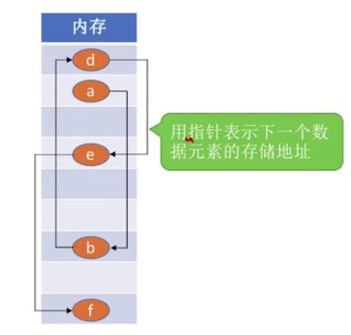

# 1、绪论

- **数据**：数据是==信息的载体==，是描述客观事物属性的数、字符及所有==能输入到计算机最终并被计算机程序识别==和处理的符号的集合。数据是计算机程序加工的原料。
  - 计算机看数据其实就是二进制的0和1

- **数据元素**：数据元素是数据的基本单位，通常作为一个整体进行考虑和处理。一个数据元素可由若干==数据项==组成，数据项是构成数据元素的不可分割的最小单位。


- **数据结构**：数据结构是相互之间存在一种或多种特定==关系==的数据元素的集合
- **数据对象**：数据对象是具有==相同性质==的数据元素的集合，是数据的一个子集
- **数据类型**：数据类型是一个值的集合和定义在此集合上的一组操作的总称
  1. 原子类型：其值不可再分的数据类型。bool类型、int类型、float类型等等
  2. 结构类型：其值可以再分解为若干成分的数据类型。如我们C语言中的结构体类型

# 2、逻辑结构

- **数据结构的三要素**：**逻辑结构、物理结构（存储结构）、数据的运算**
- **逻辑结构**：指数据元素之间的逻辑关系，逻辑结构分4类基本结构
  1. 集合结构
  2. 线性结构(一对一关系)    => 线性结构：线性表、栈、队列
  3. 树形结构(一对多关系)    => 非线性结构：树、图、集合
  4. 图状结构或网状结构(多对多关系)
- **存储结构**：存储结构又称为物理结构，主要有顺序存储、链式存储、索引存储、散列存储
- **数据的运算**：增删改查等

---

1. **线性结构**：线性表、栈、队列

2. **非线性结构**：树、图、集合

## 2.1、集合

集合：各个元素同属一个集合，别无其他关系

## 2.2、线性结构

线性结构：

- 数据元素之间是==一对一==的关系
- 除了第一个元素，所有元素都有唯一前驱
- 除了最后一个元素，所有元素都有唯一后继


## 2.3、树形结构

树形结构：数据元素之间是==一对多==的关系


## 2.4、图结构

图结构：数据元素之间是==多对多==的关系


# 3、存储结构

**存储结构**：顺序存储、链式存储、索引存储、散列存储

## 3.1、顺序存储

顺序存储：**把逻辑上相邻的元素存储在物理位置上也相邻的存储单元**中，元素之间的关系由存储单元的邻接关系来体现。例如下图中物理内存相邻来表示逻辑上相邻的元素。


## 3.2、链式存储

链式存储：**逻辑上相邻的元素在物理位置上可以不相邻**。借助指示元素存储地址的指针来表示元素之间的逻辑关系。




## 3.3、索引存储

索引存储：在存储元素信息的同时，还建立附加的索引表，索引表中的每项称为索引项，索引项的一般形式是（关键字，地址）


## 3.4、散列存储

散列存储：根据元素的关键字直接计算出该元素的存储地址，又称==哈希存储==

## 3.5、总结


1. 若采用==顺序存储==，则各个数据元素在物理上必须是==连续的==；若采用==非顺序存储==，则各个数据元素在物理上可以是==离散的==。
2. 数据的存储结构会影响存储空间分配的方便程度。

# 4、算法

程序 = 数据结构 + 算法

## 4.1、五大特性

算法必须具备的特性：

- **输入**：一个算法==有零个或多个输入==，这些输入取自于某个特定的对象的集合。
- **输出**：一个算法==有一个或多个输出==，这些输出是与输入有着某种特定关系的量。
- **确定性**：算法中每条指令必须有确切的含义，对于==相同的输入==只能得出==相同的输出==。
- **可行性**：算法中描述的操作都可以通过已经实现的==基本运算执行有限次==来实现

- **有穷性**：一个算法必须总在执行有穷步之后结束，且每一步都可在又穷时间内完成。
  - ==注意==：==算法必须是有穷的，而程序可以是无穷的==

> 记忆口诀：出入确可穷。(出去进来确实很穷啊~)

## 4.2、好算法特质

- **正确性**：算法应能够正确地解决求解问题。
- **可读性**：算法应具有良好的可读性，以帮助人们理解。
- **健壮性**：输入非法数据时，算法能适当地做出反应或进行处理，而不会产生莫名其妙的输出结果。
- **高效率（执行速度快，时间复杂度低）与低存储量需求**（不费内存。空间复杂度低）


## 4.3、时间复杂度

算法的时间复杂度：算法==时间开销T(n)==与==问题规模n==的关系（T代表"time"）。时间复杂度就是指算法在计算机内执行时所需运行时间的度量。

- T = O(f(n))
- 只考虑阶数高的部分

- **加法规则：多项相加，只保留最高阶的项，且系数变为1**   `O(m)+O(n)=O(max{m,n})`

- **乘法规则：多项相乘，都保留**                                               `O(m)×O(n)=O(mn)`
- 只需挑==循环==中的一个基本操作分析它的执行次数与n的关系即可
- 如果有多层嵌套循环，只需关注最深层的循环循环了几次


| 表达式                        | 时间复杂度          |
| ----------------------------- | ------------------- |
| T~1~(n) = 3n+3                | T~1~(n)  = O(n)     |
| T~2~(n) = n² + 3n + 1000      | T~2~(n) = O(n²)     |
| T~3~(n) = n^3^ + n^2^ + 99999 | T~3~(n) = O(n^3^)   |
| T~4~(n) =  n^3^ + n^2^log~2~n | T~4~(n) = O( n^3^ ) |
|                               |                     |

T~4~(n)  =  n^3^ + n^2^log~2~n

​		   =O( n^3^ ) + O(n^2^log~2~n)

​		   =O( n^3^ ) 

---

时间复杂度由小到大：

$$
O(1)<O(log_2n)<O(n)<O(nlog_2n)<O(n^2)<O(n^3)<O(2^n)<O(n!)<O(n^n)
$$


- 记忆口诀：**常对幂指阶**🔥
- 常数级 < 对数级 < 幂数级 < 指数级 <  阶乘级的

- 基本上O(2^n^)之后就很少涉及到了


## 4.4、时间复杂度练习题

1. 计算下述算法的时间复杂度T(n)

```c
void loveYou(int n){
    int i=1;
    while(i<=n){
        i=i*2;
        printf("Maybe I Like U %d\n",i);
    }  
}
```

| 开始 | 第一次循环 | 第二次循环 | 第三次循环 | ...  | 第x次循环 |
| ---- | ---------- | ---------- | ---------- | ---- | --------- |
| i=1  | i = 2      | i = 4      | i = 8      | ...  | i = 2^x^  |

设最深层总共循环的次数为x，则循环了x次之后，i = 2^x^，循环结束的条件为 i > n，即 2^x^ > n ，x = log~2~n + 1

T(n) = O(x) = O(log~2~n) + O(1) = O(log~2~n)

---

2. 计算下述算法时间复杂度

```c
void LikeYourself(int flag[],int n){  // n为问题规模
    for(int i =0; i < n; i++){
        if(flag[i] == n){		// 从第一个元素开始查找
            printf("I Like you,maybe love!");
            break;
        }
    }
}

// flag数组乱序存放1~n这些数
int flag[n] = {1....n};
LikeYourself(flag,n);
```

分析：时间复杂度与 flag 数组里面存放的数量有关。

- 最好情况：如果 n 元素在 flag 数组的第一位，那么只用循环一次算法就结束。最好时间复杂度T(n)=O(1)
- 最坏情况：如果 n 元素在 flag 数组的最后一位,那么需要循环n次算法才结束。最坏时间复杂度T(n)=O(n)
- 平均情况：假设元素 n 在任意一个位置的概率相同为 1/n
  - n在第一个位置，循环1次：1×(1/n)
  - n在第二个位置，循环2次：2×(1/n)
  - .......
  - n在第n个位置，循环n次：n×(1/n)
  - 循环次数 = (1+2+3+......+n) × (1/n) = (n(1+n)/2) × (1/n) = (1+n)/2
  - 平均时间复杂度T(n) = O((1+n)/2) = O(n)


## 4.5、空间复杂度

空间复杂度：空间开销与问题规模n之间的关系

- S(n) = O(g(n))
- 算法==原地工作==是指算法所需的辅助空间为常量，即`O(1)`

---


```c
void Fighting(int n){ //n为问题规模
    int i = 1;
    while(i<=n){
        i++;
        printf("况且你独一无二,而且依然美丽!");
    }
}
```

上述代码在执行之前，我们会将其放入内存中，专门开辟一片内存用来运行程序代码，这一片内存大小固定，与问题规模是无关的，我们假设它占100B。接下来CPU开始执行这段代码，在执行代码的时候发现函数传入了一个形参 int n，还定义了一个 int i，则再在内存中开辟空间将其放入内存中，假设二者和为8B，所以在这段代码中无论问题规模 n 怎么变，算法运行所需的内存空间都是固定的常数值，算法的空间复杂度为 S(n) = O(1)


1. 计算下列算法的空间复杂度

```c
void test(int n){
    int flag[n];  //声明一个长度为n的数组
    int i;
    // ...
}
```

假设一个 int 型变量占 4B，则所需内存空间 = 4 + 4n + 4 = 4n + 8

则S(n) = O(4n+8) = O(n)

**所以考虑空间复杂度只需考虑flag数组所占内存大小**

---


```c
void test(int n){
    int flag[n][n];
    int i;
}
```

S(n) = O(4n^2^) = O(n^2^)

---


```c
void test(int n){
    int flag[n][n];	//声明n*n的二维数组
    int other[n];	//声明一个长度为n的数组
    int i;
}
```

S(n) = O(n^2^) +O(n) +O(1) = O(n^2^) 


## 4.6、函数递归调用带来的内存开销


```c
void study(int n){ // n为问题规模
    int a,b,c; // 声明一系列局部变量
    if (n>1){
        study(n-1);
    }
    printf("不会?抄题带过程上作业本!抄%d\n遍",n);
}

int main(){
    study(5);
}
```


开始将程序代码放入内存，大小固定。每一次递归调用，都要把局部变量和参数存入内存中，共占16B。

S(n) = O(KnB) = O(n)

> 空间复杂度 = 递归调用的深度(记住)  

---

当然也会有一些算法每层递归调用所开辟的内存大小是不一样的，如下：

```c
void study(int n){ // n为问题规模
    int flag[n]; //声明一系列局部变量
    if (n>1){
        study(n-1);
    }
    printf("不会?抄题带过程上作业本!抄%d\n遍",n);
}

int main(){
    study(5);
}
```


第一级的调用flag[1]，第二级的调用flag[2]..... ,第 n 级的调用 flag[n]
$$
1+2+3+....+n = [\frac{n(n+1)}{2}] = \frac{n^2+n}{2}
$$
所以S(n) = O(n^2^)


 
