# 1、队列Queue

线性表是具有相同数据类型的 n(n≥0) 个数据元素的有限序列，其中 n 为表长，当 n = 0时线性表是一个空表。

- 栈：栈是==只允许在一端进行插入(进栈)或删除操作(出栈)==的线性表

- 队列：队列是==只允许在一端进行插入(入队)，在另一端删除(出队)==的线性表

## 1.1、队列的重要术语

空队列：队列中没有存储数据元素

队尾：允许插入元素的一端

队头：允许删除元素的一端

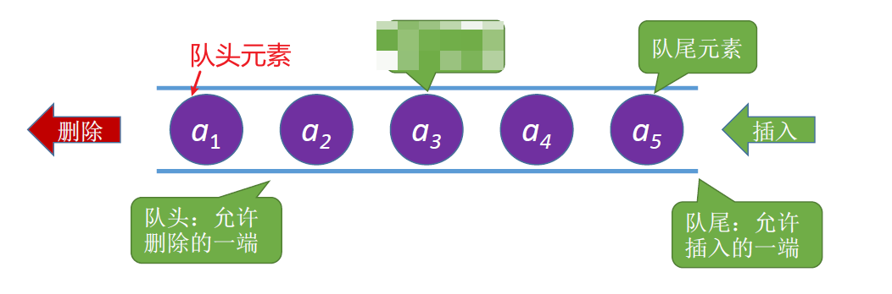

- 记忆：**队列就是食堂排队**

- 队列特点：==先进先出== ，First In First Out (==FIFO==)


## 1.2、顺序存储队列的定义

```c
#define MaxSize 10					// 定义队列中元素的最大个数
typedef struct {
    ELemType data[MaxSize];			// 用静态数组存放队列元素
    int front,rear;					// 队头指针和队尾指针
}SqQueue;							
```


## 1.3、链式存储队列的定义

```c
typedef struct LinkNode {					// 链式队列结点
    ElemType data;
    struct LinkNode *next;
}LinkNode;

typedef struct {							// 链式队列
    LinkNode *front,*rear;					// 队列的队头和队尾指针
}LinkQueue;
```


# 2、顺序存储队列实现

顺序存储队列有两种实现方式：

- 队尾指针指向队尾元素
- 队尾指针指向队尾元素的下一个

## 2.1、队尾指针指向队尾元素的下一个

### 2.1.1、初始化

- `InitQueue(&Q)` : 初始化队列，构造一个空队列 Q

```c
#define MaxSize 10					// 定义队列中元素的最大个数
typedef struct {
    ELemType data[MaxSize];			// 用静态数组存放队列元素
    int front,rear;					// 队头指针和队尾指针
}SqQueue;

// 初始化队列
void InitQueue(SqQueue &Q){
    // 初始时,队头、队尾指针指向0
    Q.rear = Q.front = 0;
}
```

- 队头指针 front 指向队头元素
- 队尾指针 rear 指向队尾元素的后一个位置(下一个应该插入的位置)

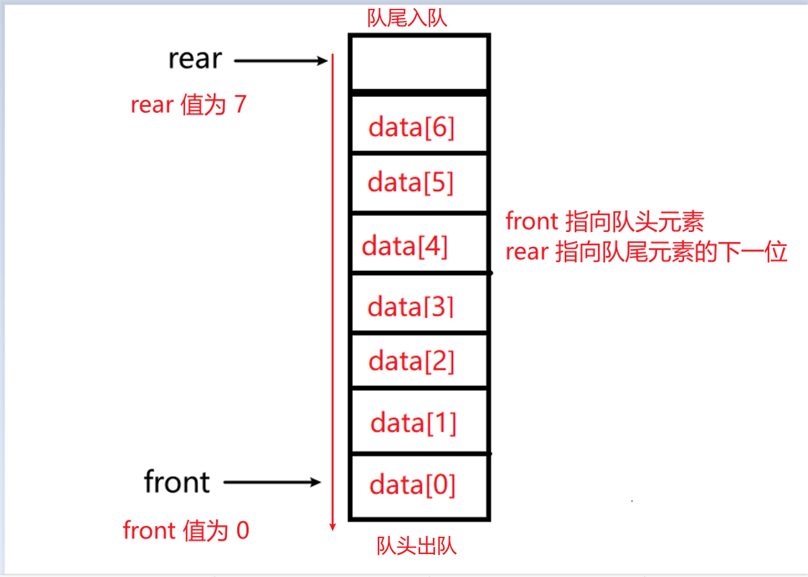

### 2.2.2、判断队列是否为空

- `QueueEmpty(Q)` : 判断队列是否为空，若队列Q为空则返回 true，否则返回 false

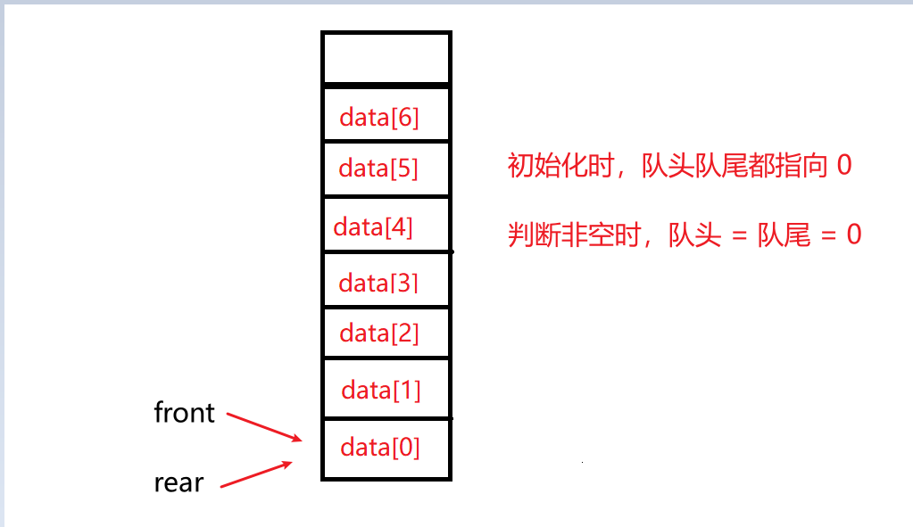

```c
// 判断队列是否为空
bool QueueEmpty(SqQueue Q){
    if(Q.rear == Q.front){			// 队空条件
        return true;
    }else{
        return false;
    }
}
```


### 2.2.3、入队

- `EnQueue(&Q,x)` : 入队，若队列 Q 未满，将 x 加入，使之称为新的队尾

- 只能从队尾入队

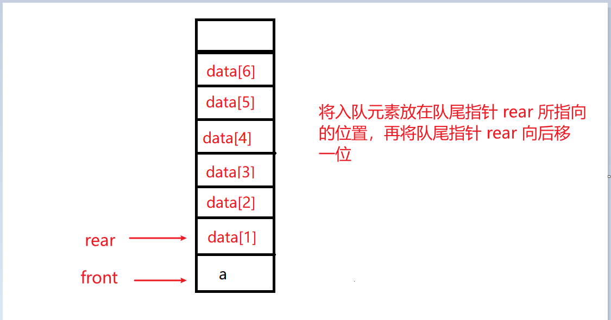


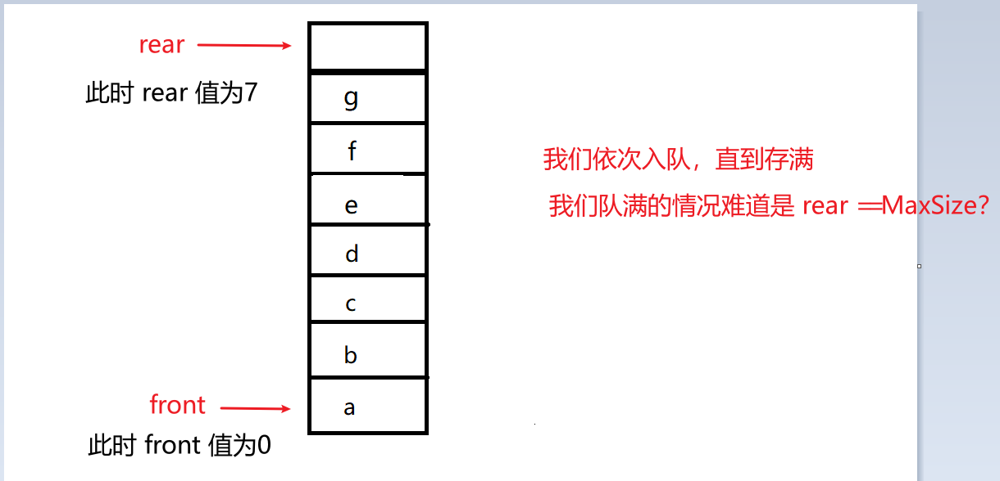


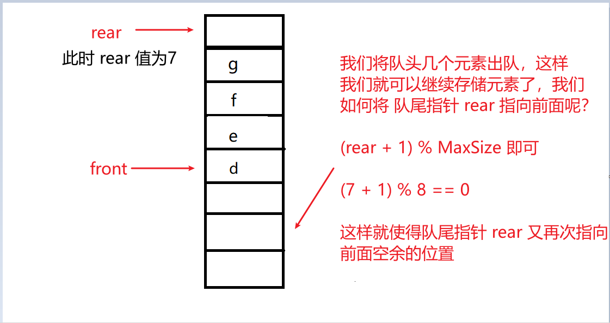

所以队尾指针 rear 其实是从队头指向队尾，再从队尾指向队头，这样循环移动。

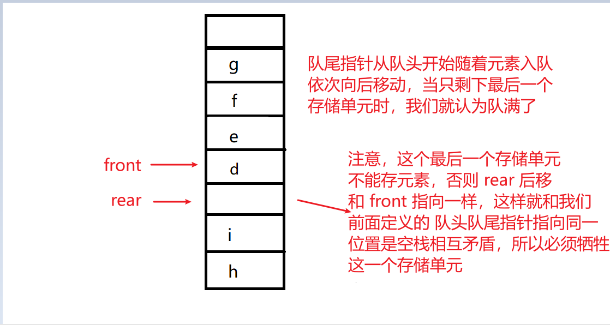

这样使用模运算将存储空间在逻辑上变成了 "环状"，我们也称之为循环队列

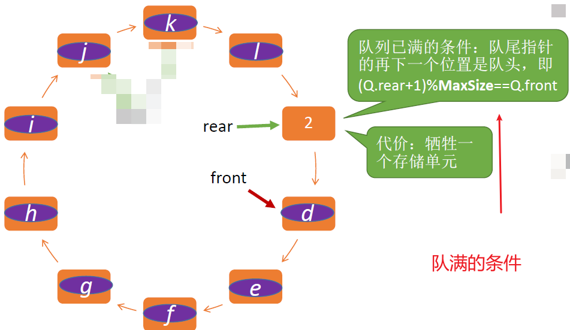


```c
#define MaxSize 10					// 定义队列中元素的最大个数
typedef struct {
    ELemType data[MaxSize];			// 用静态数组存放队列元素
    int front,rear;					// 队头指针和队尾指针
}SqQueue;

// 入队
bool EnQueue(SqQueue &Q,ElemeType x){
    if((Q.rear + 1)%MaxSize == Q.front){	// 判断队满
        return false;						// 队满则报错
    }
    Q.data[Q.rear] = x;						// 将 x 插入队尾
    Q.rear = (Q.rear + 1)%MaxSize;			// 队尾指针加1取模,用模运算将存储空间在逻辑上变成了"环状"
    return true;
}
```


### 2.2.4、出队

- `DeQueue(&Q,&x)` : 出队，若队列 Q 非空，删除队头元素，并用 x 返回
- 只能从队头出队

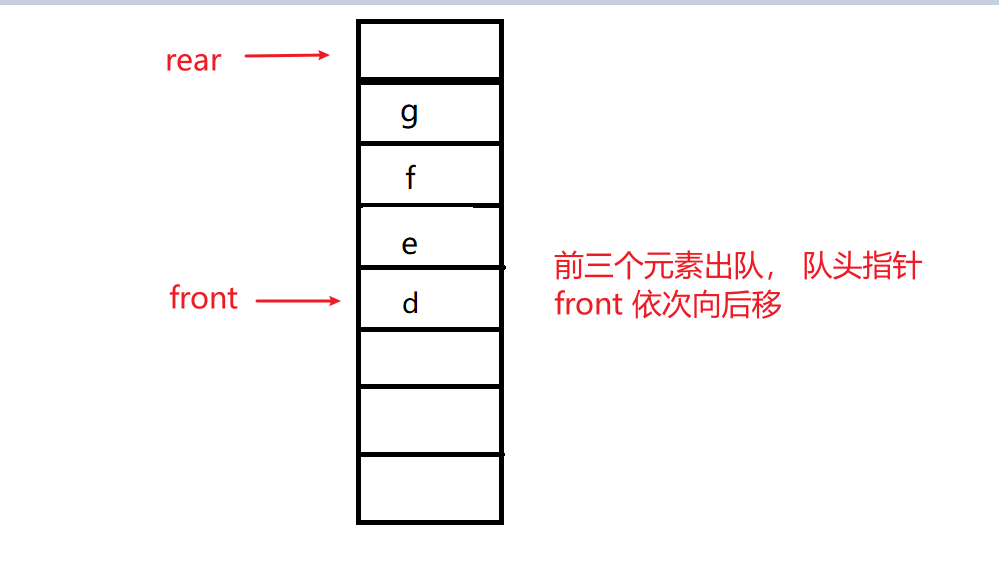

```c
#define MaxSize 10					// 定义队列中元素的最大个数
typedef struct {
    ELemType data[MaxSize];			// 用静态数组存放队列元素
    int front,rear;					// 队头指针和队尾指针
}SqQueue;

// 出队(删除一个队头元素,并用 x 返回)
bool DeQueue(SqQueue &Q,ElemType &x){
    if(Q.rear ==Q.front){					// 判断队空
        return false;						// 队空则报错
    }
    X = Q.data[Q.front];
    Q.front = (Q.front +1)%MaxSize;			// 队头指针后移
    return true;				
}
```


### 2.2.5、获得队头元素值

- `GetHead(Q,&x)` ：读取队头元素，若队列Q非空，则将队头元素

```c
#define MaxSize 10					// 定义队列中元素的最大个数
typedef struct {
    ELemType data[MaxSize];			// 用静态数组存放队列元素
    int front,rear;					// 队头指针和队尾指针
}SqQueue;

// 获得队头元素的值,用 x 返回
bool GetHead(SqQueue Q,ElemType &x){
    if(Q.rear == Q.front){			// 判断队空
        return false;   			// 队空则报错
    }
    X = Q.data[Q.front];			// 获得队头元素值
    return true;
}
```


## 2.2、判断队列已满/已空

我们前面说判断队列满的时候，不得不牺牲一个存储单元，否则就与我们的队空相互矛盾，但是有时候出题老师可不想让我们浪费这一个存储单元，所以判断队列已满/已空有两种方案

- 方案一：浪费一个存储单元
- 方案二：不浪费一个存储单元，用一个 size 
- 方案三：不浪费存储单元，用一个 tag 标记

### 2.2.1、方案一

- 队列已满的条件：队尾指针的再下一个位置是队头，即 `(Q.rear+1)%MaxSize == Q.front`

- 队空的条件是：队尾指针和队头指针指向相同，`Q.rear == Q.front`

- 队列元素个数：`(rear + MaxSize - front)%MaxSize`


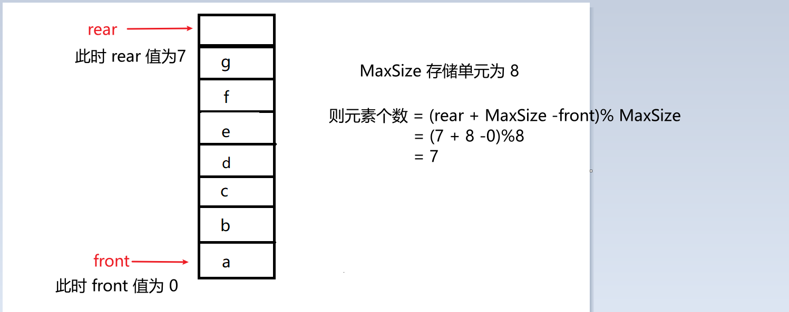


### 2.2.2、方案二

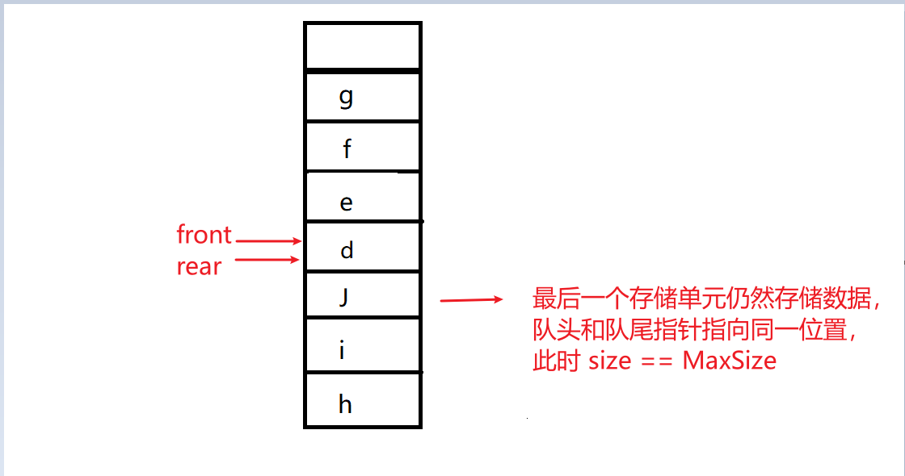


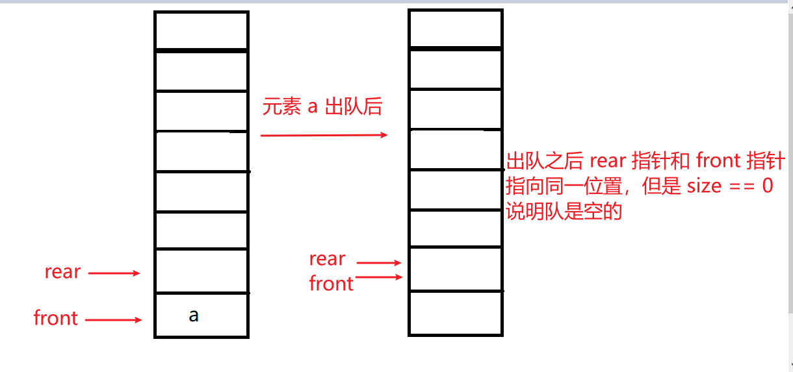


虽然队头和队尾指针都指向了同一位置，但是由于 size 的存在，所以仍然可以判断队列是满的还是空的。


```c
#define MaxSize 10					// 定义队列中元素的最大个数
typedef struct {
    ELemType data[MaxSize];			// 用静态数组存放队列元素
    int front,rear;					// 队头指针和队尾指针
    int size;						// 队列当前长度
}SqQueue;

// 初始化队列
void InitQueue(SqQueue &Q){
    // 初始时,队头、队尾指针指向0
    Q.rear = Q.front = 0;
    // 队列长度也为0
    size = 0;
}

// 入队
bool EnQueue(SqQueue &Q,ElemeType x){
    if(Q.size == MaxSize){					// 判断队满
        return false;						// 队满则报错
    }
    Q.data[Q.rear] = x;						// 将 x 插入队尾
    Q.rear = (Q.rear + 1)%MaxSize;			// 队尾指针加1取模,用模运算将存储空间在逻辑上变成了"环状"
    size++;									// 每一次入队成功我们让队列长度 + 1
    return true;
}


// 出队(删除一个队头元素,并用 x 返回)
bool DeQueue(SqQueue &Q,ElemType &x){
    if(Q.size == 0){						// 判断队空
        return false;						// 队空则报错
    }
    X = Q.data[Q.front];
    Q.front = (Q.front +1)%MaxSize;			// 队头指针后移
    size--;									// 每一次出队成功我们让队列长度 - 1
    return true;				
}
```


### 2.2.3、方案三

```c
#define MaxSize 10					// 定义队列中元素的最大个数
typedef struct {
    ELemType data[MaxSize];			// 用静态数组存放队列元素
    int front,rear;					// 队头指针和队尾指针
    int tag;						// 最近进行的是删除(0)/插入(1)
}SqQueue;


// 初始化队列
void InitQueue(SqQueue &Q){
    // 初始时,队头、队尾指针指向0
    Q.rear = Q.front = 0;
    // 标志为0
    tag = 0;
}

// 入队
bool EnQueue(SqQueue &Q,ElemeType x){
    if(Q.front == Q.rear && tag == 1){		// 判断队满,只有插入操作,才可能导致队满
        return false;						// 队满则报错
    }
    Q.data[Q.rear] = x;						// 将 x 插入队尾
    Q.rear = (Q.rear + 1)%MaxSize;			// 队尾指针加1取模,用模运算将存储空间在逻辑上变成了"环状"
    tag == 1;								// 每次插入操作成功时,都令 tag = 1
    return true;
}


// 出队(删除一个队头元素,并用 x 返回)
bool DeQueue(SqQueue &Q,ElemType &x){
    if(Q.front == Q.rear && tag == 0){		// 判断队空,只有删除操作,才可能导致队空
        return false;						// 队空则报错
    }
    X = Q.data[Q.front];
    Q.front = (Q.front +1)%MaxSize;			// 队头指针后移
    tag == 0;								// 每次删除操作成功时,都令 tag = 0
    return true;				
}
```


## 2.3、队尾指针指向队尾元素🔥

还有一种出题方法，就是队尾指针 rear 指向的不是队尾元素的下一个，而是队尾元素的位置

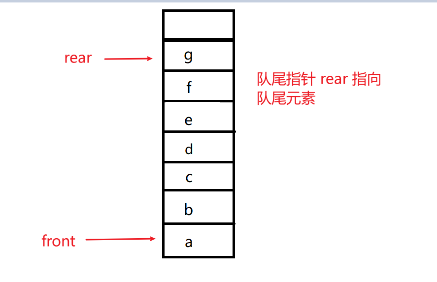


### 2.3.1、初始化

```c
#define MaxSize 10					// 定义队列中元素的最大个数
typedef struct {
    ELemType data[MaxSize];			// 用静态数组存放队列元素
    int front,rear;					// 队头指针和队尾指针
}SqQueue;

// 初始化队列
void InitQueue(SqQueue &Q){
    // 初始时,队头指针指向0,队尾指针指向 n - 1
    Q.front = 0;
    Q.rear = n - 1
}
```

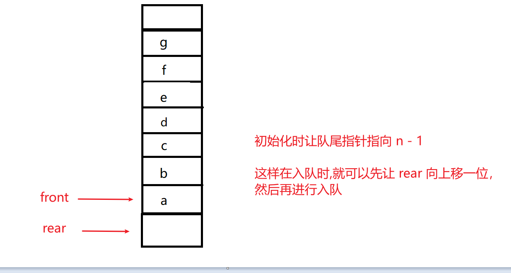

- 入队操作

```c
#define MaxSize 10					// 定义队列中元素的最大个数
typedef struct {
    ELemType data[MaxSize];			// 用静态数组存放队列元素
    int front,rear;					// 队头指针和队尾指针
}SqQueue;

// 入队
bool EnQueue(SqQueue &Q,ElemeType x){
    if((Q.rear + 1)%MaxSize == Q.front){	// 判断队满
        return false;						// 队满则报错
    }
    Q.rear = (Q.rear + 1)%MaxSize;			// 先将队尾指针向上移一位
    Q.data[Q.rear] = x;						// 再将 x 插入队尾
    
    return true;
}
```


# 3、链式存储队列实现

## 3.1、带头结点

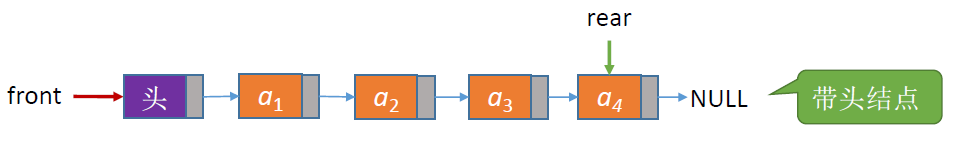


### 3.1.1、初始化


初始化时

- 先申请一个结点，然后让队头指针 front、队尾指针 rear 都指向这个结点
- 之后让此结点的指针域指向NULL

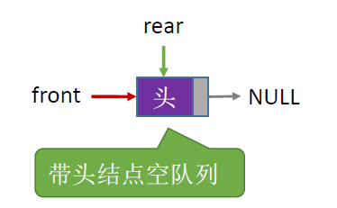

```c
typedef struct LinkNode {					// 链式队列结点
    ElemType data;
    struct LinkNode *next;
}LinkNode;

typedef struct {							// 链式队列
    LinkNode *front,*rear;					// 队列的队头和队尾指针
}LinkQueue;

// 初始化队列(带头结点)
void InitQueue(LinkQueue &Q){
    // 初始时, front、rear 都指向头结点
    Q.front = Q.rear = (LinkNode*)malloc(size(LinkNode));
    Q.front->next = NULL;
}
```

### 3.1.2、判断队列是否为空

判断队列是否为空，只需要看队头指针和队尾指针是否指向相同，指向相同队列为空，指向不相同队列不为空

```c
// 判断队列是否为空(带头结点)
bool IsEmpty(LinkQueue Q){
    if(Q.front == Q.rear){
        return true;
    }else{
        return false;
    }
}
```


### 3.1.3、入队


入队只能在队尾入队

- 先申请一个结点s
- 将新入队元素 x 放入这个结点中
- 将 s 结点的指针域指向 NULL
- 之后将 s 结点插入到 rear 之后
- 修改表尾指针为 s 结点

---

1. 先申请一个结点s，将新入队元素 x 放入这个结点中

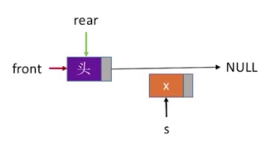

2. 将 s 结点的指针域指向 NULL，之后将 s 结点插入到 rear 之后

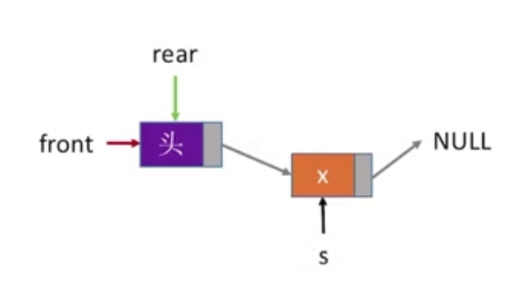

3. 修改表尾指针为 s 结点

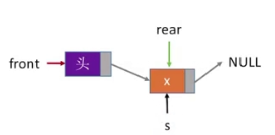

```c
typedef struct LinkNode {					// 链式队列结点
    ElemType data;
    struct LinkNode *next;
}LinkNode;

typedef struct {							// 链式队列
    LinkNode *front,*rear;					// 队列的队头和队尾指针
}LinkQueue;

// 新元素入队(带头结点)
void EnQue(LinkQueue &Q,ElemType x){
    LinkNode *s =(LinkNode *)malloc(sizeof(LinkNode));				// 用 malloc 申请一个新结点
    s->data = x;													// 将 x 放入这个结点中
    s->next = NULL;				// 插入操作在表尾进行,新插入的结点x肯定是在表尾,所以将x结点指针域设为NULL
    Q.rear->next = s;						// 新结点插入到 rear 之后
    Q.rear = s;								// 修改表尾指针
}
```


### 3.1.4、出队

带头结点出队只能从队头出队

- 申请一个新结点 p 指向头结点后面的一个结点(也就是队头结点)，用变量 x 返回队头结点元素
- 修改头结点的 next 指针，使其指向 p 结点的下一个结点
- 如果出队的结点是最后一个结点，我们要修改队尾指针，让其指向头结点
- 释放 p 结点

---

1. 申请一个新结点 p 指向头结点后面的一个结点(也就是队头结点)，用变量 x 返回队头结点元素

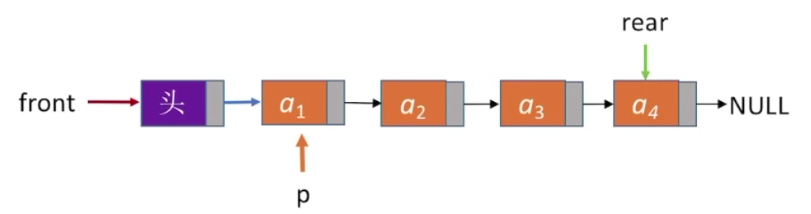

2. 修改头结点的 next 指针

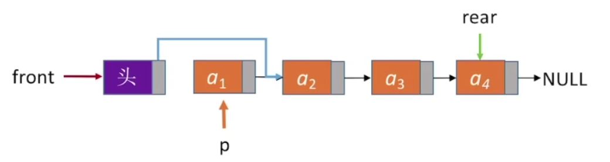

3. 如果出队的结点是最后一个结点，我们要修改队尾指针rear，让其指向头结点

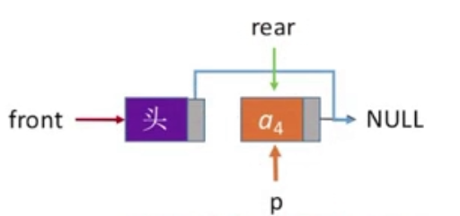

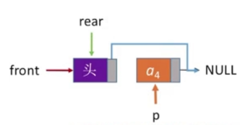

3. 释放 p 结点

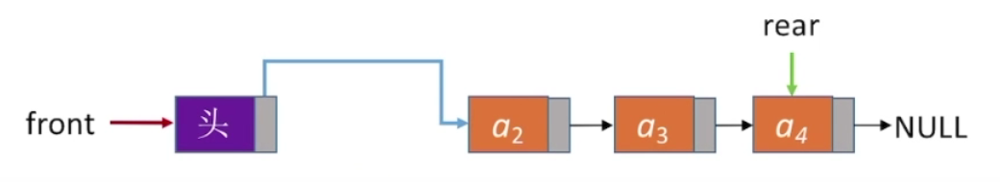


```c
typedef struct LinkNode {					// 链式队列结点
    ElemType data;
    struct LinkNode *next;
}LinkNode;

typedef struct {							// 链式队列
    LinkNode *front,*rear;					// 队列的队头和队尾指针
}LinkQueue;


// 队头元素出队(不带头结点)
bool DeQueue(LinkQueue &Q,ElemType &x){
    if(Q.front == Q.rear){
        return false;						// 空队
    }
    LinkNode *p = Q.front->next;			// 申请新结点p 指向头结点的后面一个结点
    x = p->data;							// 用变量 x 返回队头元素
    Q.front->next = p->next;				// 修改头结点的 next 指针
    if(Q.rear == p){						// 如果此次是最后一个结点出队
        Q.rear = Q.front;					// 修改 rear 指针
    }		
    free(p);								// 释放结点空间
    return true;
}
```


### 3.1.5、队列满的条件

顺序存储-> 预分配的空间耗尽时队满

链式存储-> 一般不会队满，可以扩容，除非内存不足

## 3.2、不带头结点

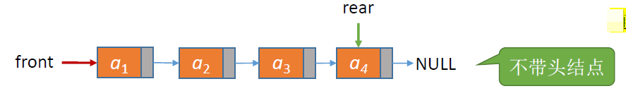

### 3.2.1、初始化

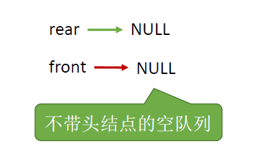

```c
typedef struct LinkNode {					// 链式队列结点
    ElemType data;
    struct LinkNode *next;
}LinkNode;

typedef struct {							// 链式队列
    LinkNode *front,*rear;					// 队列的队头和队尾指针
}LinkQueue;

// 初始化队列(不带头结点)
void InitQueue(LinkQueue &Q){
    // 初始时, front、rear 都指向NULL
    Q.front = NULL;
    Q.rear = NULL;
    
}
```


### 3.2.2、判断队列是否为空

```c
// 判断队列是否为空(不带头结点)
bool IsEmpty(LinkQueue Q){
    if(Q.front == NULL){
        return true;
    }else{
        return false;
    }
}
```


### 3.2.3、入队


不带头结点的队列，第一个元素入队时需要特别处理

- 先申请一个新结点 s，将新入队元素 x 放入这个结点中，将此结点的 next 指针域 指向 NULL
- 需要判断如果这个队列为空，那么就意味着新结点 s 是这个队列的第一个结点，需要将 front、rear 都指向这个新结点 s
- 如果队列不为空，就是执行后插操作了

---

1. 先申请一个新结点 s，将新入队元素 x 放入这个结点中，将此结点的 next 指针域 指向 NULL

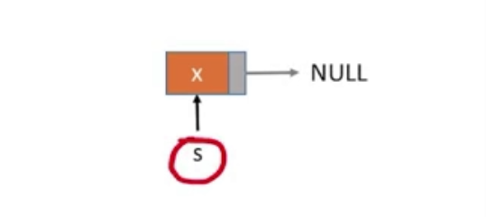

2. 需要判断如果这个队列为空，那么就意味着新结点 s 是这个队列的第一个结点，需要将 front、rear 都指向这个新结点 s

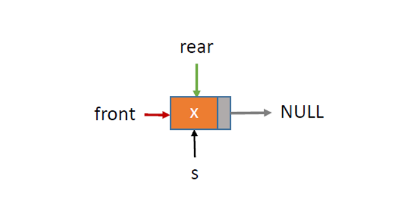

3. 如果队列不为空，就是执行后插操作了


```c
typedef struct LinkNode {					// 链式队列结点
    ElemType data;
    struct LinkNode *next;
}LinkNode;

typedef struct {							// 链式队列
    LinkNode *front,*rear;					// 队列的队头和队尾指针
}LinkQueue;

// 新元素入队(不带头结点)
void EnQue(LinkQueue &Q,ElemType x){
    LinkNode *s =(LinkNode *)malloc(sizeof(LinkNode));		// 申请新结点
    s->data = x;											// 向此结点写入数据元素 x
    s->next = NULL;				// 插入操作在表尾进行,新插入的结点x肯定是在表尾,所以将x结点指针域设为NULL
    if(Q.front == NULL){					// 如果队列为空	
        Q.front = s;						// 不带头结点的队列，第一个元素入队时需要特别处理	
        Q.rear = s;							// 在空队列中插入第一个元素,修改队头队尾指针
    }else{
        Q.rear->next = s;						// 新结点插入到 rear 之后
    	Q.rear = s;								// 修改表尾指针
    }
}
```


### 3.2.4、出队

不带头结点出队只能从队头出队

- 首先申请新结点 p 指向此次出队的结点(队头结点)，用变量 x 返回队头元素
- 修改队头指针 front 指向
- 如果是最后一个结点出队，需要将 front 、rear 指针指向 NULL(将其恢复为空队的状态)
- 释放结点 p

---

1. 首先申请新结点 p 指向此次出队的结点(队头结点)，用变量 x 返回队头元素

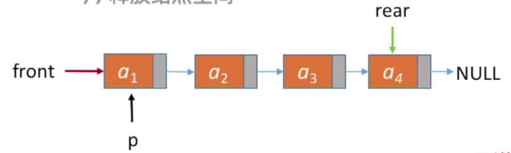

2. 修改队头指针 front 指向

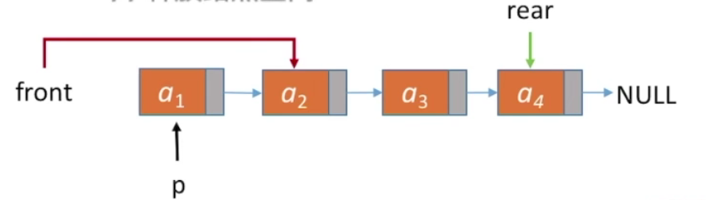

3. 释放结点 p


```c
// 队头元素出队(不带头结点)
bool DeQueue(LinkQueue &Q,ElemType &x){
    if(Q.front == NULL){
        return false;								// 空队
    }
    LinkNode *p = Q.front;							// 申请新结点 p 指向此次出队的结点
    x = p->data;									// 用变量 x 返回队头元素
    Q.front = p->next;								// 修改 front 指针
    if(Q.rear == p){
        Q.front = NULL;								// front 指向 NULL
        Q.rear = NULL;								// rear 指向 NULL
    }
    free(P);										// 释放结点空间
    return true; 
}
```


## 3.3、小结

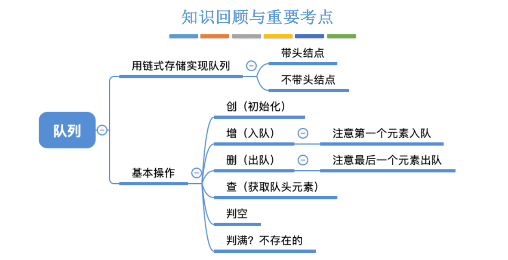


# 4、双端队列

栈：只允许==从一端插入、一端删除==的线性表

队列：只允许从==一端插入、另一端删除==的线性表

双端队列：只允许从==两端插入、两端删除==的线性表

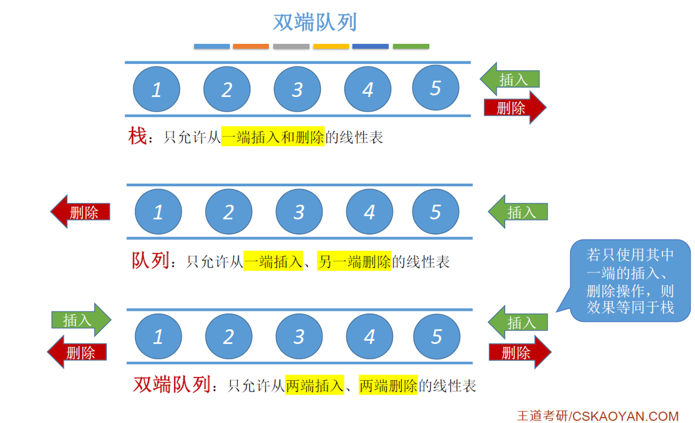


## 4.1、受限的双端队列

**输入受限的双端队列**：只允许从==一端插入、两端删除==的线性表

**输出受限的双端队列**：只允许从==两端插入、一端删除==的线性表

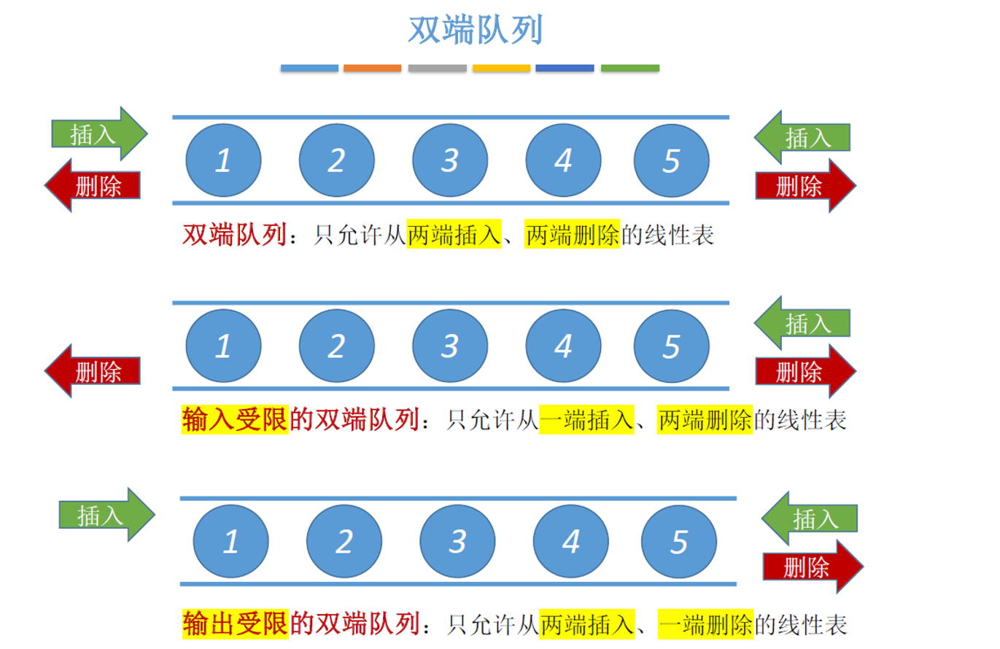


## 


