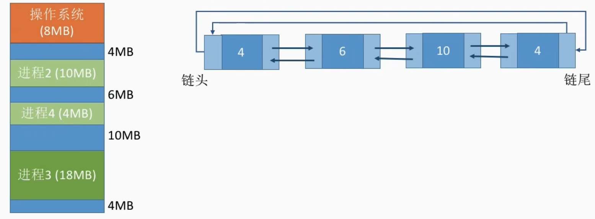
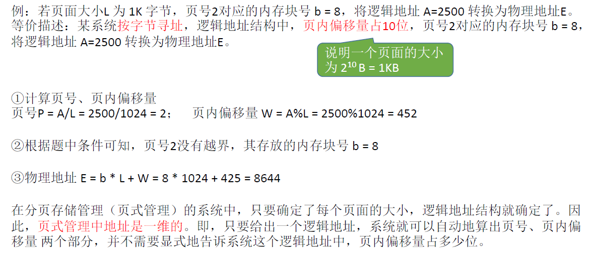

# 1、内存的基础知识

## 1.1、什么是内存

内存可存放数据。程序执行前**需要先放到内存中才能被CPU处理**——缓和CPU与硬盘之间的速度矛盾(因为CPU太快，硬盘太慢)

思考：在多道程序环境下，系统中会有多个程序并发执行，也就是说会有多个程序的数据需要同时放到内存中。那么，如何区分各个程序的数据是放在什么地方的呢？

方案：**给内存的存储单元编地址**。内存中也有一个一个的"小房间"，每个小房间就是一个存储单元，内存地址从0开始，**每个地址对应一个存储单元**

1. 如果计算机 **按字节编址**，则 **每个存储单元大小为1字节**，即1B，也就是8个二进制位。
2. 如果计算机 **按字编址**，则 **每个存储单元大小为一个字**，**字的长度取决于计算机字长是多少位**，若题目条件说字长是16位，则一个字就是16个二进制位。也有的计算机字长是32位、64位等等。

## 1.2、补充几个数量单位

- 1K = 2^10^  (千)
- 1M = 2^20^  (兆，百万)
- 1G = 2^30^  (十亿，千兆)

1. 一台手机/电脑有4GB内存，是什么意思？

   答：G 指的是数量，也就是 2^30^ ，B是单位指的是字节，也就是说这台设备的内存中可以存放  4×2^30^ 个字节。如果是按字节编址的话，也就是有 4×2^30^ = 2^32^ 个小房间。这么多小房间，需要 2^32^ 个地址才能一一标识，所以地址需要 32 个 二进制位来表示。(0 ~ 2^32^-1)

## 1.3、物理地址和逻辑地址

- 逻辑地址(相对地址)：程序经过编译、链接后生成的指令中指明的是逻辑地址(相对地址)，即：**相对于进程的起始地址而言的地址。**
- 物理地址(绝对地址)：从内存地址为0开始存放

我们的代码经过编译之后会形成一系列等价的机器指令，这些指令会告诉CPU应该去内存的哪个地址读/写数据，这个数据应该做什么样的处理。也就是每一条指令会让CPU去干一件事。当这个程序运行的时候，系统会为它建立相应的进程，一个进程在内存当中会有一片区域，其中的程序段包含进程相关的指令，数据段包含一些变量。**指令的工作是基于"地址"，每个地址对应一个数据的存储单元。**

C语言经过编译、链接处理后，会生成可执行文件(`.exe`)，我们也称为==装入模块==。我们启动可执行文件，会将程序放入内存中执行这个程序，需要注意的是**程序经过编译、链接后生成的指令中指明的是逻辑地址(相对地址)**。举个例子：程序有一条指令是在内存地址为79处写入10

1. 当我们的装入模块装入内存的时候是从内存地址为0的地方开始存放时，10就被写入内存地址为79处
2. 当我们的装入模块装入内存的时候不是从内存地址为0的地方开始存放，而是从100开始，这就意味着操作系统给进程分配的内存地址编号可能是100 ~ 279，但是进程仍旧会给内存地址为79处写入10，正确的写入是10会被写入179处。

这就是我们需要解决一个很重要的问题：如何将指令中的逻辑地址转换为正确的物理地址？我们有三种策略来解决地址转换：

1. 绝对装入
2. 可重定位装入(静态重定位装入)
3. 动态运行时装入(动态重定位)

### 1.3.1、绝对装入

**绝对装入**：如果我们在将程序放入内存之前就知道这个程序从内存哪个位置开始存放，在这种情况下我们就可以让编译程序把各个变量存放的那些地址直接把他修改成正确的绝对地址。

例如上面案例中如果我们已经知道要从内存地址为100的地方开始存放数据，那么我们就将装入模块中的变量逻辑地址全部修改为正确的物理地址，也就是让79+100=179，这样就可以让变量放在正确的地址上了。

**缺点**：

1. 绝对装入**只适合单道程序环境**。
   - 假设可执行文件要在另一台电脑上运行，而另一台电脑又没法让它从内存地址为100的地方开始存放，那么意味着这个程序换一台电脑就不一定能执行了，**灵活性很差**。

### 1.3.2、可重定位装入

**静态重定位**：又称**可重定位装入**。编译、链接后的装入模块的地址都是从0开始的逻辑地址装入时对地址进行**重定位**，将逻辑地址变换为物理地址（地址变换是在装入模块装入内存时执行）

这种方式的特点是：

1. 我们给这个进程分配的地址空间必须是连续的，并且这个作业必须一次全部装入内存，也就是说在作业在装入内存时，就必须分配其要求的全部的内存空间。
2. 作业一旦进入内存后，**在运行期间就不能再移动**，也不能申请内存空间。(毕竟地址都已经被确定了，再移动地址又乱了)

### 1.3.3、动态运行时装入

**动态重定位**：又称**动态运行时装入**。编译、链接后的装入模块的地址都是从0开始的。装入程序把装入模块装入内存后，并不会立即把逻辑地址转换为物理地址，而是把**地址转换推迟到程序真正要执行时才进行**。因此装入内存后所有的地址依然是逻辑地址。这种方式需要一个**重定位寄存器**的支持。

- **重定位寄存器**：存放装入模块存放的**起始位置**。当程序执行时，CPU会将**重定位寄存器里面的地址+逻辑地址=物理地址**。

- 特点：
  - 采用动态重定位时**允许程序在内存中发生移动**。
  - 可将程序分配到**内存地址不连续**的存储区中，在程序运行前只需装入它的部分代码即可投入运行，然后在程序运行期间，根据需要动态申请分配内存，便于程序段的共享，可以向用户提供一个比存储空间大的多的地址空间。

## 1.4、链接的三种方式

如上图，程序员通过 Visual Studio 写了三份代码文件，文件一定义了 main() 函数，文件二定义了 a() 函数，文件三定义了 b() 函数，经过编译之后，这些源代码会形成与之一 一对应的目标模块，每一个目标模块其实就已经包含了机器指令，且逻辑地址都是从0开始，所以**经过编译之后我们就把高级语言翻译成了机器语言。**之后通过**链接**将目标模块组装起来形成装入模块，这样装入模块就有一个完整的逻辑地址。之后运行装入模块就是将其放入内存当中，并且对逻辑地址进行转换为真正的物理地址。

之前我们记录了装入的三种方式，其中的链接步骤也有三种方式。

1. 静态链接
2. 装入时动态链接
2. 运行时动态链接

### 1.4.1、静态链接

**静态链接**：在程序运行之前，先将各目标模块及它们所需的库函数连接成一个完整的可执行文件（装入模块），之后不再拆开。(也就是上图介绍的)

### 1.4.2、装入时动态链接

**装入时动态链接**：将各目标模块装入内存，边装入边链接的链接方式。

目标模块不会先把它们链接起来，而是将这些目标模块放入内存时才会将他们进行链接。这种情况下进程的完整逻辑地址是一边装入一边形成的。

### 1.4.3、运行时动态链接

**运行时动态链接**：在程序执行中需要该目标模块时，才对它进行链接。其优点是便于修改和更新，便于实现对目标模块的共享。

只有用到某个目标模块时，才会将其装入内存。用不到的模块不需要装入内存。

## 1.5、小结

# 2、内存管理的概念

## 2.1、内存空间的分配与回收

操作系统负责**内存空间的分配与回收**。

## 2.2、内存空间的扩展

操作系统需要提供某种技术从逻辑上 **对内存空间进行扩充**。

## 2.3、地址转换

操作系统需要提供地址转换功能，负责程序的**逻辑地址**与**物理地址**的转换。

为了使编程更方便，程序员写程序时应该只需要关注指令、数据的逻辑地址。而逻辑地址到物理地址的转换（这个过程称为**地址重定位**）应该由操作系统负责，这样就保证了程序员写程序时不需要关注物理内存的实际情况。

## 2.4、内存保护

操作系统需要提供**内存保护**功能。保证各进程在各自存储空间内运行，互不干扰

内存保护可采取两种方法：

- 方法一：在CPU中**设置一对上、下限寄存器**，存放进程的上、下限地址。进程的指令要访问某个地址
  时，CPU检查是否越界。
- 方法二：采用**重定位寄存器**（又称**基址寄存器**）和**界地址寄存器**（又称**限长寄存器**）进行越界检查。重定位寄存器中存放的是进程的**起始物理地址**。界地址寄存器中存放的是进程的**最大逻辑地址**。

如上图，进程1的起始物理地址是100，则**重定位寄存器**存放100，进程1的最大逻辑地址是179，则**界地址寄存器**是179。当进程1想要访问内存地址为80的内存单元，首先这个**逻辑地址**80会和**界地址寄存器**里面的值进行对比，若不超过最大逻辑地址，则认为访问这个逻辑地址是合法的，将重定位寄存器值和逻辑地址相加则为访问的物理地址。

## 2.5、小结

# 3、覆盖与交换

## 3.1、覆盖技术

早期的计算机内存很小，比如IBM推出的第一台PC机最大只支持1MB大小的内存。因此经常会出现内存大小不够的情况。后来人们引入了**覆盖技术**，用来解决==程序大小超过物理内存总和==的问题

- **覆盖技术的思想**：将**程序分为多个段**（多个模块）。常用的段常驻内存，不常用的段在需要时调入内存。
  - 内存中分为**一个固定区**和**若干个覆盖区**
  - 需要常驻内存的段放在固定区中，调入后就不再调出（除非运行结束）
  - 不常用的段放在覆盖区，**需要用到时调入内存，用不到时调出内存**

A会依次调用B模块和C模块，**注意不会同时调用**，我们将A模块放到固定区，由于同一时刻B、C模块只能有一个在运行，所以将B、C共享一个覆盖区0，覆盖区的大小以B、C模块更大的为准，D、E、F同理。

采用了覆盖技术，从逻辑上看，这个物理内存的大小是被扩展了的。不过这种技术也有缺点，因为这种调用结构操作系统是不知道的，都是由**程序员声明覆盖结构**，操作系统按照声明完成自动覆盖。**对用户不透明**，增加了用户编程负担。

## 3.2、交换技术

**交换（对换）技术的设计思想**：内存空间紧张时，系统将内存中某些进程暂时**换出**外存，把外存中
某些已具备运行条件的进程**换入**内存（也就是进程在内存与磁盘间动态调度）

如上图，在内存中各个3个进程并发的运行，当内存空间紧张时，系统将进程1、进程2暂时换出外存，但将它们的PCB保留，**并插入到挂起队列**。当内存空间充足时，又将进程换入内存。

**中级调度（内存调度）**：其实就是在交换技术当中，选择一个处于外存的进程重新调入内存。就是要决定将哪个处于**挂起状态**的进程重新调入内存。

思考：

1. 应该在外存（磁盘）的什么位置保存被换出的进程？

   - 答：具有对换功能的操作系统中，通常把磁盘空间分为**文件区**和**对换区**两部分。

   - **文件区**主要用于存放文件，**主要追求存储空间的利用率**，因此对文件区空间的管理**采用离散分配方式**
   - 由于**对换区**空间只占磁盘空间的小部分，**被换出的进程数据就存放在对换区**。由于对换的速度直接影响到系统的整体速度，因此对换区空间的管理**主要追求换入换出速度**，因此通常对换区**采用连续分配方式**。总之，==对换区的I/O速度比文件区的更快==。

2. 什么时候应该交换？
   - 交换通常在许多进程运行且内存吃紧时进行，而系统负荷降低就暂停。例如：在发现许多进程运行时经常发生缺页，就说明内存紧张，此时可以换出一些进程；如果缺页率明显下降，就可以暂停换出。

3. 应该换出哪些进程？
   - 可优先换出**阻塞进程**
   - 可换出**优先级低**的进程，为了防止优先级低的进程在被调入内存后很快又被换出，这样会导致优先级低的进程产生饥饿，有的系统还会考虑进程在内存的驻留时间

> 注意：PCB会常驻内存，不会被换出外存。

## 3.3、小结

# 4、内存的分配与回收

## 4.1、连续分配管理方式

连续分配：系统指为用户进程分配的**必须是一个连续的内存空间**。

非连续分配：系统指为用户进程分配的**不一定是一个连续的内存空间**，可以是离散的。

### 4.1.1、单一连续分配

在单一连续分配方式中，内存被分为**系统区**和**用户区**。系统区通常位于内存的低地址部分，用于存放操作系统相关数据，用户区用于存放用户进程相关数据。内存中**只能有一道用户程序**，不支持多道程序并发运行。用户程序独占整个用户区空间，即使用户进程A占有空间很小，用户区也不会让其他用户进程B、C进入。

**优点**：

- 实现简单，**无外部碎片**，可以采用覆盖技术扩充内存，不一定需要采取内存保护（早期的DOS系统就没有内存保护，因为内存只允许一个内存程序，即使程序出问题了也只会影响程序本身）。

**缺点**：

- 只能用于单用户、单任务的操作系统中，**有内部碎片**，存储器利用率极低。(分配给某进程的内存区域中，如果有些部分没有用上，就是内部碎片)

### 4.1.2、固定分区分配

20世纪60年代出现了支持多道程序的系统，为了能在内存中装入多道程序，且这些程序之间又不会相互干扰，于是将整个**用户空间**划分为**若干个固定大小的分区**，**在每个分区中只装入一道作业**，这样就形成了最早的、最简单的一种可运行多道程序的内存管理方式。

固定分区分配有两种分配方式：

1. 分区大小相等：**缺乏灵活性**，但是很**适合用于用一台计算机控制多个相同对象的场合**（比如：钢铁厂有n个相同的炼钢炉，就可把内存分为n个大小相等的区域存放n个炼钢炉控制程序）
2. 分区大小不等：**增加了灵活性**，可以满足不同大小的进程需求。根据常在系统中运行的作业大小情况进行划分（比如：划分多个小分区、适量中等分区、少量大分区）

操作系统如何记录各个分区的情况呢？操作系统需要建立一个数据结构——**分区说明表**，来实现各个分区的分配与回收。每个表项对应一个分区，通常按分区大小排列。每个表项包括对应分区的**大小、起始地址、状态**（是否已分配）。

当某用户程序要装入内存时，由操作系统内核程序根据用户程序大小检索该表，从中找到一个能满足大小的、未分配的分区，将之分配给该程序，然后修改状态为已分配。用数据结构的数组（或链表）即可表示这个表。

**优点**：实现简单，**无外部碎片**。

**缺点**：

1. 当用户程序太大时，可能所有的分区都不能满足需求，此时不得不采用覆盖技术来解决，但这又会降低性能
2. **会产生内部碎片**，内存利用率低。(例如一个10MB的程序，只能被放在分区6，这样会空闲2MB的空间)

### 4.1.3、动态分区分配

**动态分区分配**又称为**可变分区分配**。这种分配方式**不会预先划分内存分区**，而是在进程装入内存时，
**根据进程的大小动态地建立分区**，并使分区的大小正好适合进程的需要。因此系统分区的大小和数
目是可变的。例如计算机内存大小是64MB，系统区占8MB，用户区占56MB

思考：

1. ==系统中分区的大小是可变的，有些分区是被分出去的，有些分区没有被分出去，系统要用什么样的数据结构记录内存的使用情况？==

有两种常用的数据结构：

1. **空闲分区表**：每个空闲分区对应一个表项，如上图中有三个空闲分区，对应三个表项。表项中包含分区号、分区大小、分区起始地址、状态。
2. **空闲分区链**：每个分区的起始部分和末尾部分分别设置前向指针和后向指针。每个空闲分区的大小、起始地址、结尾地址等信息都可以统一放在起始部分处。

2. ==当很多个空闲分区都能满足需求时，应该选择哪个分区进行分配？==

   答：把一个新作业装入内存时，须按照一定的**动态分区分配算法**，从空闲分区表（或空闲分区链）中选出一个分区分配给该作业。

3. ==如何进行分区的分配与回收操作？==

假设采用的数据结构是**空闲分区表**进行分配：

假设系统中有如上图的三块空闲分区，此时有进程5需要申请4MB的内存空间，我们决定将进程5放入空闲的20MB的空闲分区中，如下图，对空闲分区表进行一定的处理：

- 由于我们分配的空闲分区空间比申请的空间要大，空闲分区的数量没有发生改变，所以我们只需要修改空闲分区大小和起始地址即可。
- 当分配的空闲分区空间和申请的空闲相同，空闲分区的数量-1

---

假设采用的数据结构是**空闲分区表**进行回收：

1. **情况一：回收区的后面有一个相邻的空闲分区**

如上图，有两个空闲分区，大小分别为10MB和4MB，当进程4运行完成之后，我们要回收进程4的4MB空间，当回收区的后面有一个相邻的空闲分区时，我们回收后空闲分区的数量不变，我们只需要修改分区大小和起始地址即可。

2. **情况二：回收区的前面有一个相邻的空闲分区**

同样进行合二为一的操作

3. **情况三：回收区的前、后面各有一个相邻的空闲分区**

当进程4的空闲被回收之后，需要将一整块的空间进行合并，空闲分区数量变为两个。

4. **情况四：回收区的前、后面都没有相邻的空闲分区**

当进程2的空间被回收之后，空闲分区增加

**空闲分区表的顺序一般是按照起始地址的先后顺序进行排列，但是也有可能不是这样，具体的排列顺序需要依据动态分区分配算法来确定。**

> 回收后两个空闲分区相邻，要合二为一。

#### 1、内部碎片和外部碎片

动态分区分配**没有内部碎片**，但是**有外部碎片**。

- **内部碎片**，分配给某进程的内存区域中，如果有些部分没有用上，这些部分就称为内部碎片。
- **外部碎片**，是指内存中的某些空闲分区由于太小而难以利用。因为各个进程需要的都是一整片连续的内存区域，所以空闲分区太小的话，那么任何一个空闲分区都不能满足进程的需求。

如果内存中空闲空间的总和本来可以满足某进程的要求，但由于进程需要的是一整块连续的内存空间，因此这些**碎片**不能满足进程的需求。可以通过**紧凑**（拼凑，Compaction）技术来解决外部碎片。也就是将空闲分区移动将其相聚在一起。**紧凑之后我们需要将各个进程的起始地址修改**。

### 4.1.4、小结

## 4.2、动态分区分配算法

### 4.2.1、首次适应算法

**算法思想**：每次都从**低地址**开始查找，找到第一个能满足大小的空闲分区。

**如何实现**：**空闲分区以地址递增的次序排列**。每次分配内存时顺序查找空闲分区链（或空闲分区表），找到大小能满足要求的第一个空闲分区。

如下图，空闲分区以**地址递增**的次序排列，则空闲分区表和空闲分区链所示：

以空闲分区链为例，如下图，当一个进程要求15MB的内存空间，我们从空闲分区链的链头依次查找，找到第一个满足要求的分区，20MB就满足，所以我们将进程放入其中并修改空闲分区链的大小和起始地址。

### 4.2.2、最佳适应算法

**算法思想**：由于动态分区分配是一种连续分配方式，为各进程分配的空间必须是连续的一整片区域。因此为了保证当大进程到来时能有连续的大片空间，可以尽可能多地留下大片的空闲区，即**优先使用更小的空闲区**。
**如何实现**：空闲分区**按容量递增次序链接**。每次分配内存时顺序查找**空闲分区链**（或空闲分区表），找到大小能满足要求的第一个空闲分区。

如下图，按容量递增次序链接，空闲分区表和空闲分区链如下所示：

我们以空闲分区链为例，当某个进程需要申请9MB的内存空间时，我们从链头到链尾顺序查找大小满足的第一个空闲分区，10MB的空闲分区满足，我们将9MB的进程放进，并修改空闲分区链的大小和起始地址，又由于最佳适应算法需要将空闲分区**按容量递增次序链接**，所以修改后如下：

**缺点**：每次都选最小的分区进行分配，会留下越来越多的、很小的、难以利用的内存块。因此这种方法会产生很多的**外部碎片**。

### 4.2.3、最坏适应算法

**最坏适应算法**又称**最大适应算法**：为了解决最佳适应算法的问题——即留下太多难以利用的小碎片，可以在每次分配时**优先使用最大的连续空闲区**，这样分配后剩余的空闲区就不会太小，更方便使用。

**如何实现**：空闲分区**按容量递减次序链接**。每次分配内存时顺序查找空闲分区链（或空闲分区表），找到大小能满足要求的第一个空闲分区。若第一个空闲分区都满足不了要求，则后续的更满足不了要求了。

如下图，按容量递减次序链接，空闲分区表和空闲分区链如下所示：

我们以空闲分区链为例，当某个进程需要申请3MB的内存空间时，我们从链头到链尾顺序查找大小满足的第一个空闲分区，20MB的空闲分区满足，我们将3MB的进程放进，并修改空闲分区链的大小和起始地址，之后又来一个进程需要申请9MB的内存空间，又由于最坏适应算法需要将空闲分区**按容量递减次序链接**，所以修改后如下：

**缺点**：虽然最坏适应算法确实解决了最佳适应算法外部碎片太多的问题，但是每次都选最大的分区进行分配，虽然可以让分配后留下的空闲区更大，更可用，但是这种方式会导致较大的连续空闲区被迅速用完。如果之后有大进程到达，就没有内存分区可用了

### 4.2.4、邻近适应算法

**算法思想**：首次适应算法每次都从链头开始查找的。这可能会导致低地址部分出现很多小的空闲分区，而每次分配查找时，都要经过这些分区，因此也增加了查找的开销。如果每次都从上次查找结束的位置开始检索，就能解决上述问题。邻近适应算法就是解决首次适应算法的。
**如何实现**：**空闲分区以地址递增的顺序排列**（可排成一个循环链表便于我们检索）。每次分配内存时**从上次查找结束的位置开始**查找**空闲分区链**（或空闲分区表），找到大小能满足要求的第一个空闲分区。

如下图，按空闲分区地址递增的顺序链接成一个循环链表：

如下图：若进程5到达需要5MB的内存空间，我们从链头的位置进行查找空闲分区，6MB的空闲分区是满足的，所以我们将进程5放入6MB的空闲分区，我们修改空闲分区链的大小和起始地址即可，由于 **空闲分区以地址递增的顺序排列**，所以我们并不需要修改空闲分区的指向，这也是邻近适应算法和首次适应算法比最佳适应算法和最坏适应算法好的地方：

当进程6到达需要5MB的内存空间时，我们**只需要从第二个空闲分区继续向后查找即可，并不需要重新从链头开始查找**，这是邻近适应算法比首次适应算法更优秀的地方。首次适应算法会导致低地址的部分留下碎片，这就导致首次适应算法比邻近适应算法查找时间长。

- **首次适应算法**每次都要从头查找，每次都需要检索低地址的小分区。但是这种规则也决定了当低地址部分有更小的分区可以满足需求时，会更有可能用到低地址部分的小分区，也会更有可能把高地址部分的大分区保留下来（最佳适应算法的优点）
- **邻近适应算法**的规则可能会导致无论低地址、高地址部分的空闲分区都有相同的概率被使用，也就导致了高地址部分的大分区更可能被使用，划分为小分区，最后导致无大分区可用（最大适应算法的缺点）
- 综合来看，四种算法中，**首次适应算法的效果反而更好**

### 4.2.5、小结

## 4.2、基本分页存储管理🔥

### 4.2.1、什么是分页存储

**分页存储**：将内存空间分为一个个**大小相等的分区**（比如：每个分区4KB），每个分区就是一个**页框**（==页框=页帧=内存块=物理块=物理页面==）。每个页框有一个编号，即**页框号**（==页框号=页帧号=内存块号=物理块号=物理页号==），页框号**从0开始**。

内存里面存放的就是各个进程的数据，为了把进程的数据放入页框当中，将**进程的逻辑地址空间**也分为与**页框大小相等**的一个个部分，每个部分称为一个**页**或**页面**。每个页面也有一个编号，即**页号**，页号也是**从0开始**。

如下图，进程A的逻辑地址空间是 0~16k-1，也就是16k，所以进程A的大小是16KB，将它分为与页框大小相等的页面，因此每个页面就是4KB这么多，并且进程也会给页面编号，进程的各个页面会被放到内存的各个页框当中。

- ==页框=页帧=内存块=物理块=物理页面==，指的是**内存空间**被分为一个个大小相等的分区。这个分区叫==页框=页帧=内存块=物理块=物理页面==
- ==页框号=页帧号=内存块号=物理块号=物理页号==，指的是内存被分为一个个大小相等的分区的编号。
- 页=页面，指的是进程的**逻辑地址空间**被分为与页框大小相等的一个个部分。这个部分叫==页=页面==
- 页号=页面号，指的是进程的逻辑地址空间被分为与页框大小相等的部分的编号。

操作系统**以页框为单位为各个进程分配**内存空间。**进程的每个页面分别放入一个页框中**。也就是说，进程的**页面**与内存的**页框**有一一对应的关系。**各个页面不必连续存放，可以放到不相邻的各个页框中**。

注意：进程的最后一个页面可能没有一个页框那么大。也就是说，**分页存储有可能产生内部碎片**，因此**页框不能太大，否则可能产生过大的内部碎片造成浪费**

### 4.2.2、页表

为了能知道**进程的每个页面在内存中存放的位置**，操作系统要为每个进程建立一张**页表**。页表通常存在**PCB**（进程控制块）中。

1. 一个进程对应一张页表
2. 进程的每个页面对应一个页表项(**页表项可以理解为页表当中的一行**)
3. 每个**页表项**(也就是页表中的每行)由 **页号** 和 **块号** 组成
4. 页表记录进程**页面**和实际存放的**内存块(页框)**之间的**映射关系**
5. 每个页表项的长度是相同的

思考：

1. **每个页表项多大？占几个字节？**

假设某系统物理内存大小为4GB，页面大小为4KB，则每个页表项至少应该为多少字节？

- 内存块大小(**页框大小**)=页面大小=4KB= 2^12^ B
- 4GB的内存总共会被分为2^32^ / 2^12^ = 2^20^个内存块(页框大小)
- 内存块号的范围应该是0 ~ 2^20^ -1 ，编号是从0开始的 
- 内存块号至少要用20 bit来表示，也就是20个二进制位才能表示 0 ~ 2^20^-1
- 计算机分配空间是以字节为单位分配的，2个字节才16bit，所以至少要用**3B**来表示**块号**（也就是3*8=24bit）
- ==页表中的页号并不需要占存储空间==，因为页表项是连续存放，因此页号可以是**隐含**的，不占存储空间。如同数组的下标并不需要占存储空间的道理类似。也就是说至少要用3B来存储一个页表项。
- 如果进程有n+1个页面，n+1个页面对应n+1个页表项，则存储这个进程的页表至少需要 3×(n+1)B

---

问：假设页表中的各页表项从内存地址为X的地方开始连续存放，如何找到页号为i的页表项？

答案：i号页表项的存放地址= X + 3*i

---

总结：

- ==页表项在逻辑上包含了页号和块号，但是在物理上只需要存放块号，只有块号需要占据存储空间==。
- 注意：通过页表可以知道数据存放在哪个内存块中，但是页表记录的只是内存块号，而不是内存块的起始地址。j号内存块的起始地址 = j × 内存块大小(页框大小)

> 重要重要重要考点：计算机中内存块的数量  推算出   页表项中块号至少占多少字节

2. **如何通过页表实现逻辑地址到物理地址的转换？**

**特点**：虽然进程的各个页面是离散存放的，但是页面内部是连续存放的

如果要访问逻辑地址A，则：

1. 确定逻辑地址A对应的页号P。我们可以确定这个逻辑地址A对应进程的哪个页面，也就是确定逻辑地址A对应的页号
2. 找到P号页面在内存中的起始地址（需要查页表）。操作系统可以查询页表找到页号，进而找到页面存放在内存中的起始地址。
3. 确定逻辑地址A的页内偏移量W。我们可以找到逻辑地址A相对于P号页面的起始位置的偏移量
4. 逻辑地址A对应的物理地址= P号页面在内存中的起始地址+页内偏移量W

我们之前记录了如何利用页表来找到页面在内存中的起始地址，接下来我们来看如何确定逻辑地址的页号和页内偏移量。

如上图，进程被分为4个页面，编号分别为0-3，起始地址分别是0、50、100、150。逻辑地址110应该在2号页面，并且相对于2号页面的起始地址而言页内偏移量是10。

- 页号 = 逻辑长度 / 页面长度(**取除法的整数部分**)
  - 页号 = 110 / 50 = 2 ，所以逻辑地址110对应的页号是2
- 页内偏移量 = 逻辑地址 % 页面长度(**取除法的余数部分**)
  - 页内偏移量 = 110 % 50 = 10

基于上述计算，我们可以将**逻辑地址**拆分为**页号**和**页内偏移量**，只要知道逻辑地址对应的页号，就可以通过页号来查询页表，进而知道页面在内存中的起始地址。接下来用==页面在内存中的起始地址+页内偏移量=实际的物理地址==。

---

在计算机内部，地址是用二进制表示的，如果页面大小刚好是2的整数幂，则计算机硬件可以很快速的把逻辑地址拆分成（页号，页内偏移量），**如果每个页面大小为2^k^B，用二进制数表示逻辑地址，则末尾K位即为页内偏移量，其余部分就是页号。**

上图中黑色部分是全0，红色部分转换为十进制刚好是0、1、2。用二进制表示逻辑地址，末尾的12位就是页内偏移量，其余部分就是页号。**这和我们上面的算法的出来的结果一模一样**。

在页面大小刚好是2的整数幂的前提下，计算机的逻辑地址用32位表示，若计算机的物理地址也用32位逻辑地址表示。我们可以发现，**二进制红色部分对应十进制块号**，之前说过页表中只记录内存块号，而不是内存块的起始地址，需要计算内存块的起始地址需要进行上图中的乘法运算。但是如果页面大小刚好是2的整数幂，计算起来就不需要那么麻烦。

假设1号页面存放的内存块号是9(对应的二进制是1001)，如果页面大小刚好是2的整数幂，只需要把**物理块号拼接页内偏移量就能得到对应的物理地址。**

### 4.2.3、总结

页面大小刚好是2的整数幂有什么好处？

1. 逻辑地址的拆分更加迅速——如果每个页面大小为2^K^B，用二进制数表示逻辑地址，则末尾K位即为**页内偏移量**，其余部分就是**页号**。因此，如果让**每个页面的大小为2的整数幂**，计算机硬件就可以很方便地得出一个逻辑地址对应的页号和页内偏移量，而无需进行除法运算，从而提升了运行速度。
2. 物理地址的计算更加迅速——根据逻辑地址得到页号，根据页号查询页表从而找到页面存放的内存块号，**将二进制表示的内存块号和页内偏移量拼接起来，就可以得到最终的物理地址**

若页面大小是2的整数次幂，我们可以把逻辑地址分为如下两部分：

- 如果有K位表示页内偏移量，则说明该系统中一个页面的大小是2^K^个内存单元
- 如果有M位表示页号，则说明在该系统中，一个进程最多允许有2^M^个页面

- 只要知道页内偏移量的位数，就可以推出页面大小，从而确定逻辑地址的结构

$$
重要考点:页面大小 <->页内偏移量位数 ->逻辑地址结构
$$

有些奇葩题目中页面大小有可能不是2的整数次幂，这种情况还是得用最原始的方法计算
$$
页号=\frac{逻辑地址}{页面长度}(取除法的整数部分) \\[15pt]
页内偏移量 = 逻辑地址 \% 页面长度(取除法的余数部分)
$$

### 4.2.4、基本地址变换机构

基本地址变换机构可以借助进程的页表将逻辑地址转换为物理地址。通常会在系统中设置一个**页表寄存器**(PTR)，存放**页表在内存中的起始地址F**和**页表长度M**。进程未执行时，页表的始址和页表长度**放在进程控制块(PCB)**中，当进程被调度时，操作系统内核会把它们放到页表寄存器中。

如上图，当进程上处理机运行，进程切换相关的内核程序会恢复进程的运行环境，这些信息本来是保存在PCB当中的，内核程序会把这些信息放到相应的寄存器中，页表寄存器存放着**进程页表的起始地址F和页表的长度M**，程序计数器PC也是需要恢复的，程序计数器是指向这个进程下一条需要执行的指令的逻辑地址A，我们来看一下如何将逻辑地址转换为物理地址：

1. 根据逻辑地址计算出页号P、页内偏移量W
2. 检查页号合法性，页面长度为M，也就是有M个页表项，也就是有M个页号，比较页号P和最大页号M
3. 页号合法，页号P、页表起始地址F以及页表项的长度就可以算出页面存放的内存块号(页块号)
4. 根据页块号和页内偏移量计算出最终的物理地址

---

页面大小是2的整数幂，设页面大小为L，逻辑地址A到物理地址E的变换过程如下：

1. 计算页号P和页内偏移量W
   - 手算十进制：页号P = 逻辑地址A / 页面大小L
   - 手算十进制：页内偏移量W = 逻辑地址A % 页面大小L
   - 计算机硬件可以快速切出 页号 和 页内偏移量
2. 比较页号P和页表长度M，若 P≥ M，则产生越界中断，否则继续执行。(注意：页号是从0开始的，而页表长度至少是1，==因此P=M时也会越界==)
3. 页表中页号P对应的==页表项地址 = 页表起始地址F + 页号 P × 页表项长度==，取出该页表项内容b，即为内存块号
   - **页表长度**指的是这个页表中总共有几个页表项，即总共有几个页
   - **页表项长度**指的是每个页表项占多大的存储空间(**即页表的一行**)
   - **页面大小**指的是一个页面占多大的存储空间

4. 计算 ==物理地址 E = 内存块号b × 页面大小L + 页内偏移量W==
   - 如果内存块号、页面偏移量是用二进制表示的，那么把二者拼接起来就是最终的物理地址了

等价问法：按字节寻址 == 每个地址对应一个字节，页内偏移量占10位 == 页面的大小是2^10^B = 1KB。

在分页存储管理中，要把逻辑地址转换为物理地址，只需要给出逻辑地址即可，不需要给出其他信息，因此 **页式管理中地址是一维的**。

当页表项占3字节时，可能会出现页内碎片用不上的情况。因此我们一般为了方便页表的查询，常常会让一个页表项占更多的字节，使得每个页面恰好可以装得下整数个页表项。

## 4.3、具有快表的地址变换机构

### 4.3.1、什么是快表

**快表**，又称**联想寄存器**（TLB，translation lookaside buffer ），是一种**访问速度比内存快很多**的高速缓存(**TLB不是内存**)，用来存放**最近访问的页表项的副本**，可以加速地址变换的速度。与此对应，内存中的页表常称为**慢表。**

假设某进程执行过程中要依次访问(0,0)，(0,4)，(0,8)这几个逻辑地址，第一个数代表**页号**，第二个数代表**页内偏移量**，这个页表存放在内存中如上图，当进程上处理机运行时，系统会清空快表的内容，当进程切换的时候，快表的内容也会被清除，假设访问快表只需要1us，访问内存需要100us。

首先进程访问页号为0，页内偏移量也为0的逻辑地址，首先页号也页表长度比对，检查是否越界，没有越界则查询快表，快表此时为空，找不到页号为0的页表项，因此快表**没有命中**，接下来不得不去访问内存当中存放的慢表，所以通过页表始址和页号计算出对应的页表项存放的位置，于是查询完慢表之后就可以知道0号页面存放的内存块号是600，**同时将信息复制一份放到快表当中**，通过内存块号和页内偏移量就可以得到最终的物理地址。

接下来进程访问页号为0，页内偏移量也为4的逻辑地址，首先页号也页表长度比对，检查是否越界，没有越界则查询快表，由于上一次访问有记录页号为0的内存块号，因此快表命中，接下来就不需要去访问内存当中存放的慢表，**直接通过内存块号和页内偏移量就可以得到最终的物理地址**。

引入快表，1us直接命中，没有快表，100us才能命中。快表虽然速度更快，但是造价高，所以容量就会小，快表中存放的是页表的**一部分副本**。

### 4.3.2、引入快表地址的变换过程

1. CPU给出逻辑地址，由某个硬件算得页号、页内偏移量，将页号与快表中的所有页号进行比较。
2. 如果找到匹配的页号，说明要访问的页表项在快表中有副本，则直接从中取出该页对应的内存块号，再将内存块号与页内偏移量拼接形成物理地址，最后，**访问**该物理地址对应的**内存单元**。因此若**快表命中**，则访问某个逻辑地址仅需**一次访存**即可。
3. 如果没有找到匹配的页号，则需要访问**内存中的页表**，找到对应页表项，得到页面存放的内存块号，再将内存块号与页内偏移量拼接形成物理地址，最后，**访问**该物理地址对应的**内存单元**。因此，若快表未命中，则访问某个逻辑地址需要**两次访存**（注意：**在找到页表项后，应同时将其存入快表**，以便后面可能的再次访问。但若快表已满，则必须按照一定的算法对旧的页表项进行替换）

由于查询快表的速度比查询页表的速度快很多，因此只要快表命中，就可以节省很多时间。因为局部性原理，一般来说快表的命中率可以达到90%以上。

例题：某系统使用基本分页存储管理，并采用了具有快表的地址变换机构。访问一次快表耗时1us，访问一次内存耗时100us。若快表的命中率为90%，那么访问一个逻辑地址的平均耗时是多少？

答：系统在访问逻辑地址时会先访问快表，消耗1us的时间，如果快表命中，就可以得到最终想要访问的物理地址，并且访问这个物理地址对应的内存单元，访问内存单元需要100us。如果快表未命中，则需要先访问内存中的慢表得到想要访问的物理地址，用时100us，再访问内存单元，用时100us

1. 若快表命中需要时间：(1+100)×90%
2. 若快表未命中：(1+100+100)×10%
3. 二者相加：(1+100)×90% + (1+100+100)×10% =111us

注意：有的系统**支持快表和慢表同时查找**，如果是这样，平均耗时就应该是 (1+100)×90% + (100+100)×10% =110.9us

- 若未采用快表机制，则访问一个逻辑地址需要100+100 = 200us
- 显然，引入快表机制后，访问一个逻辑地址的速度快多了。

### 4.3.3、局部性原理

假设上述程序的指令存放在10号页面，程序当中的数组存放在23号页面。

### 4.3.4、小结

快表和普通高速缓存Cache的区别：

- 快表TLB中只有页表项的副本
- 普通Cache中可能会有其他各种数据的副本

## 4.4、两级页表

### 4.4.1、单极页表存在的问题

页面大小是4KB，也就是 2^12^B，所以需要12位表示页内地址，剩余20位表示页面号。如果有M位表示页号，则说明在该系统中，一个进程最多允许有2^M^个页面，则这个进程最多有 2^20^ 个页面，对应 2^20^ 个页表项，一个页表项长度是4B，所以一个页表最大需要 2^20^ × 4B = 2^22^B，页面大小 = 内框大小，共需要 2^22^ / 2^12^ = 2^10^ 个页框存储该页表，所以需要专门给进程分配 2^10^=1024个连续的页框来存放它的页表。

同时，根据局部性原理可知，很多时候，进程在一段时间内**只需要访问某几个页面**就可以正常运行了。**因此没有必要让整个页表都常驻内存。**

### 4.4.2、如何解决单级页表的问题

问题一：**页表必须连续存放，因此当页表很大时，需要占用很多个连续的页框**。

问题二：没有必要让整个页表常驻内存，因为进程在一段时间内可能只需要访问某几个特定的页面。

解决办法：

- 把页表再分页并离散存储，然后再建立一张页表记录页表各个部分的存放位置，称为**页目录表**，或称**外层页表**，或称**顶层页表**
  - 将长长页表进行分组，使每个内存块刚好可以放入一个分组(比如上个例子中，页面大小4KB，每个页表项4B，每个页面可存放1K个页表项，因此每1K个连续的页表项为一组，每组刚好占一个内存块，再将各组离散地放到各个内存块中)
  - 为了知道离散放入内存块的先后顺序，还需要再建立一张页表记录页表各个部分的存放位置，称为**页目录表**，或称**外层页表**，或称**顶层页表**

### 4.4.3、两级页表的原理、地址结构

如上图，页面大小是4KB，也就是 2^12^B，所以需要12位表示页内地址，剩余20位表示页面号。单级页表结构的逻辑地址结构如上。20位表示页面号，则进程最多有 2^20^ 个页面，也就是2^20^个页表项，用20位二进制刚好可以表示 0~ 2^20^-1 个页号，由于页表长度过大，我们可以把页表再次分页成小页表，为了让小页表刚好可以装入内存块，每个小页表可存放 4K/4 = 1K =2^10^=1024个页表项，我们还可以对小页表进行编号，分为1024个小页表。

每个小页表大小为4KB，每个小页表都可以放入内存块当中，为了记录小页表的相对顺序还有他们在内存当中存放的块号位置，我们需要为这些小页表建立**页目录表**，这样小页表就称为**二级页表**。页目录表建立了二级页表的页号、二级页表在内存中的块号之间的映射关系。

所以此时我们想要找到0号页表的话，我们就可以通过**页目录表**知道0号页表是存放在3号内存块里的，所以只需要在3号内存块中找0号页表即可。

采用两级页表之后，逻辑地址结构也要发生变化，我们可以把以前20位的页号拆分为两个部分：

1. 一级页号：10位
2. 二级页号：10位

### 4.4.4、如何实现地址变换

1. 按照地址结构将逻辑地址拆分成三部分(一级页号、二级页号、页内偏移量)

2. 从PCB中读出**页目录表始址**，再根据**一级页号**查**页目录表**，找到**下一级页表**在内存中的存放位置
3. 根据**二级页号**查**二级页表**，找到最终想访问的内存块号
   - 一级页号是0，所以查到的内存块号是3，也就是说0号的二级页表存放在内存块号为3的地方，我们可以读出二级页表
   - 二级页号是1，所以查询到的内存块号是4，则最终想要访问的地址在4号内存块
4. 根据最终访问的内存块号和页内偏移量得到物理地址

我们最终访问的内存块号为4，每个内存块的大小是4KB，所以该内存块的起始地址为 4×4096=16384，页内偏移量转换为十进制是1023，则最终的物理地址就可以加和得到。这样通过页表分页解决了问题一。

标志位表示该页面是否已经调入内存，若想访问的页面不在内+存中，则产生**缺页中断（内中断/异常）**，因为是在执行指令时的中断，然后将目标页面从外存调入内存。

### 4.4.5、注意细节

1. 若采用多级页表机制，则**各级页表的大小不能超过一个页面**

2. 两级页表访问内存要进行3次
   - 单极页表访问内存要2次
   - 三级页表访问内存要进行4次
   - 四级页表访问内存要进行5次
   - 结论：**没有快表结构，n级页表访问内存次数是n+1次**

### 4.4.6、小结

## 4.5、基本分段存储管理🔥

### 4.5.1、分段

进程的地址空间：按照程序**自身的逻辑**关系**划分为若干个段**，每个段都有一个段名(在低级语言中，程序员使用段名来编程)，**每段从0开始编址**

内存分配规则：以段为单位进行分配，**每个段在内存中占据连续空间**，但**各段之间可以不相邻**。

例如进程A的大小是16KB，按照它自身的逻辑关系进行分段，每段代表一个逻辑模块，比如0号段段名是MAIN，存放main函数的一些东西，段名是程序员使用来编程，每个段的地址都是从0开始。所以进程A被分为0~7K-1，0 ~ 3K-1，0 ~ 6K-1，总共16KB。

**每个段在内存中占据连续空间**，但**各段之间可以不相邻**。上图中0号段占据从80K地址开始连续的7KB的内存空间，1号段占据从120K地址开始的连续的3KB的内存空间。

分段存储当中，是按照逻辑功能划分各个段，所以用户编程会更方便，程序的可读性更高。段名是由程序员自己定义的，但是编译程序在编译时会将**段名转换为段号**。CPU在执行各个指令的时候，是根据段号来区分各个段的。

### 4.5.2、分段逻辑地址结构

分段系统的逻辑地址结构由**段号**(段名)和**段内地址**(段内偏移量)所组成。如：

- **段号的位数决定了每个进程最多可以分几个段**
  - 段号有n位，则进程最多分为 2^n^ 个段
- **段内地址位数决定了每个段的最大长度是多少**
  - 段内地址有n位，则每个段的最大长度为 2^n^B 

### 4.5.3、段表

问题：程序分多个段，各段离散地装入内存，为了保证程序能正常运行，就必须能从物理内存中找到各个逻辑段的存放位置。为此，需为每个进程建立一张段映射表，简称**段表**

用段表记录各个逻辑段在内存中的存放位置

- **页表建立了各个逻辑页面到实际物理页框之间的关系**
- **段表建立个各个逻辑段到实际物理内存存放位置之间的关系**

1. 每个段对应一个**段表项**(也就是段表中的一行)，其中记录了**段号**、**段长**、该段在内存中的**起始位置**(又称**基址**)
   - 相比于页表，段表多了段长，因为每个分段的长度可能是不一样的，而在分页存储管理当中，每个页面的大小都是一样的，所以页面长度就不需要显示记录。

2. **各个段表项的长度是相同的**(也就是说段表中的每行在内存当中占据相同的空间)
   - 例如：某系统按字节寻址，采用分段存储管理，逻辑地址结构为(段号16位,段内地址16位)，则每个段的最大长度为 2^16^B，所以在段表中用16位就可以表示最大段长， 
   - 物理内存大小为4GB(也就是2^32^个字节，范围是0 ~ 2^32^-1，可用32位二进制表示整个物理内存地址空间)，所以，基址我们只需要用32位就可以表示，因此，可以让每个段表项占16+32 = 48位，即6B。
     - **因为段号不占存储空间，和页号类似**。
   - 若段表存放的起始地址为M，则K号段对应的段表项存放的地址为**M + K*6**

### 4.5.4、地址变换

当进程上处理机运行之前，进程切换相关的内核程序会负责恢复进程的运行环境，包括恢复段表寄存器里面的**段表始址F和段表长度M**，这样就知道了段表在内存当中的什么地方，程序在运行时要访问逻辑地址A

1. 系统会根据逻辑地址A得到**段号S**和**段内地址W**
2. 将段号和段表长度进行对比，判断段号是否越界
   - 若段号**≥**段表长度，则产生越界中断
   - 因为段号是从0开始的，段表长度至少是1，所以当段号 = 段表长度时，其实也是发生了中断。
3. 若无越界，根据段号和段表始址F找到段号对应的段表项
   - 段表项长度相同，所以==段表始址F+段号S×段表项长度 = 目标段对应的段表项==
4. 通过段表项读出**段长**，检查段内地址是否超过段长
   - 若段内地址W≥段长C，则产生越界中断
   - 在页式管理中，每个页长都是一样的，所以不需要检查页内偏移量是否大于等于页长
   - 在分段存储管理当中，各个段长度不一样，所以需要对各个段的地址进行越界检查
5. 通过段表项读出**基质b**，这样就知道目标段存放在内存中的什么地方，通过**段基址b+段内地址W**得到物理地址

---

例如上图：我们此时要访问的逻辑地址**段号是2**，**段内地址是1024**

1. 将段号和段表长度进行对比
   - 这个段有3个段表项，所以段表长度为3，**段号小于段表长度**，未发生越界
2. 根据段号和段表始址F找到段号对应的段表项
   - 找到2号段找到段表项，段长为6K，基质为40K
3. 检查段内地址是否超过段长
   - 2号段段长为6K，段内地址是1024=1K，**段内地址小于段长**，未发生越界
4. 段的基址40K+段内地址1024 = 物理地址

## 4.6、分段、分页管理的对比

- **页**是**信息的物理单位**。分页的主要目的是为了实现离散分配，提高内存利用率。分页仅仅是系统管理上的需要，完全是系统行为，**对用户是不可见的**。

- **段**是**信息的逻辑单位**。分段的主要目的是更好地满足用户需求。一个段通常包含着一组属于一个逻辑模块的信息。**分段对用户是可见的**，用户编程时需要显式地给出段名。

- 页的大小固定且由系统决定。段的长度却不固定，决定于用户编写的程序。
- 分页的用户进程**地址空间是一维的**，程序员只需给出一个**记忆符**即可表示一个地址。
- **分段**的用户进程**地址空间是二维的**，程序员在标识一个地址时，既要给出**段名**，也要给出**段内地址**。

> - 分页管理当中，用户自己看来自己进程的地址空间是连续的。
>
> - 分段管理当中，用户也知道自己进程的地址空间是被分为一个一个段，并且每个段占据一连串的地址空间。

- **分段**比分页**更容易实现信息的共享和保护**。

  

  - 要想实现信息共享，**只需要让各个进程的段表项指向同一个段即可实现共享**

  - 不能被修改的代码称为**纯代码**或**可重入代码**(不属于临界资源)，这样的代码是可以共享的(比如我们只是简单输出Hello World)。可修改的代码是不能共享的(比如，有一个代码段中有很多变量，各进程并发地同时访问可能造成数据不一致)

访问一个逻辑地址需要几次访存？

- **分页（单级页表）**：第一次访存——查内存中的页表，第二次访存——访问目标内存单元。总共**两次访存**
- **分段**：第一次访存——查内存中的段表，第二次访存——访问目标内存单元。总共**两次访存**

与分页系统类似，分段系统中也可以**引入快表机构**，将近期访问过的段表项放到快表中，这样可以**少一次访问**，加快地址变换速度。

## 4.7、小结

## 4.8、段页式管理方式

### 4.8.1、分页、分段管理方式中最大的优缺点

|          | 优点                                                         | 缺点                                                         |
| -------- | ------------------------------------------------------------ | ------------------------------------------------------------ |
| 分页管理 | 内存空间利用率高，**不会产生外部碎片**， 只会有少量的**页内碎片** | 不方便按照逻辑模块实现信息的共享和保护                       |
| 分段管理 | 很方便按照逻辑模块实现信息的共享和保护                       | 如果段长过大，为其分配很大的连续空间会很不方便。另外，段式管理会产生**外部碎片** |

分段管理中产生的外部碎片也可以用**紧凑**来解决，只是需要付出较大的时间代价

### 4.8.2、分段+分页=段页式管理

将进程按逻辑模块进行分段，再将各段进行分页，若每个页面大小4KB，则0号段会被分为4KB和3KB两个页面，内存空间也会被分为大小相同4KB的页框/页帧/内存块/物理块，进程将各个页面分别装入页框中。

- 分段管理的逻辑地址结构是由**段号**和**段内地址**组成的
- 段页式管理分段之后，各个段还会被分页，所以段页式管理的逻辑地址结构由**段号、页号、页内地址**(页内偏移量)组成
  - **段号的位数决定了每个进程最多可以分为几个段**
  - **页号的位数决定了每个段最大有多少页**
  - **页内偏移量决定了页面大小、内存块大小是多少**

在上述例子中，若系统是按字节寻址的，则

- 段号占16位，因此在该系统中，每个进程最多有2^16^ = 64K个段
- 页号占4位，因此每个段最多有2^4^ = 16页
- 页内偏移量占12位，因此每个页面大小为2^12^ = 4096 = 4KB

> 分段对用户是可见的，程序员编程时需要显式地给出段号、段内地址。而将各段分页对用户是不可见的，系统会根据段内地址自动划分页号和页内偏移量。==因此段页式管理的地址结构是二维的==。

### 4.8.3、段表、页表

进程分为各个段，各个段会分别对应各个段表项，**每个段表项由段号、页表长度、页表存放块号组成**，由于每个内存块大小是固定的，所以**只要知道页表存放块号就可以知道页表存放的实际的物理地址**，例如0号段对应的段表是段号为0的段表项，从段表中可知0号段存放在内存块号为1的位置，就可以从这个位置读出0号段对应的页表，0号段被分成两个页面，页表就会有两个页表项，每个页表项包含页号和内存块号。

- 段式管理当中段表记录了**段号、段的长度、段的起始地址**
- 页段式管理当中段表记录了**段号、页表长度、页表存放块号**
- 页表管理和页段式管理中**页表记录的都是页号、内存块号**
- 各个段表项的长度相等，所以段号可以隐含；各个页表项的长度相等，所以页号可以隐含

> 一个进程只会对应一个段表，但是每个段会对应一个页表，所以一个进程有可能会对应多个页表

### 4.8.4、地址转换

来看段页式管理中如何将逻辑地址转换为物理地址：

当进程上处理机运行之前，进程切换相关的内核程序会负责恢复进程的运行环境，包括恢复段表寄存器里面的段表始址F和段表长度M，这样就知道了段表在内存当中的什么地方，程序在运行时要访问逻辑地址A

1. 系统会根据逻辑地址A得到段号S、页号P、页内偏移量W
2. 将段号和段表长度进行对比，判断段号是否越界
   - 若段号≥段表长度，则产生越界中断
   - 因为段号是从0开始的，段表长度至少是1，所以当段号 = 段表长度时，其实也是发生了中断。
3. 若无越界，根据段号和段表始址F找到段号对应的段表项
   - 段表项长度相同，所以段表始址F+段号S×段表项长度 = 目标段对应的段表项
4. 由于各个页大小不同，所以要检查页号是否越界
   - 页号≥页表长度，则发生越界中断
5. 根据页表存放块号、页号查询页表找到对应页表项
6. 根据页表项的内存块号、页内偏移量得到最终的物理地址

7. 根据物理地址进行访问目标内存单元

**段页式管理当中，进行地址转换共需三次访存**：

1. 第一次访存是访问内存中的段表
2. 第二次访存是访问内存中的页表
3. 第三次访存是访问目标内存单元

也可引入快表机构，用段号和页号作为查询快表的关键字。若快表命中则**仅需一次访存**，只需要访问目标内存单元，不需要访问段表和页表了。

### 4.8.5、小结

# 5、虚拟内存

## 5.1、虚拟内存的概念

### 5.1.1、传统存储管理方式的特征、缺点

传统存储方式两个很明显的特征:

1. **一次性**：作业必须一次性全部装入内存后才能开始运行。这会造成两个问题：
   1. 作业很大时，不能全部装入内存，导致大作业无法运行。例如GTA5将近100G，如何运行在只有16GB的内存电脑上(拯救者Y7000P玩GTA5妥妥的😁)
   2. 当大量作业要求运行时，由于内存无法容纳所有作业，因此只有少量作业能运行，导致**多道程序并发度下降**。
2. **驻留性**：一旦作业被装入内存，就**会一直驻留在内存中**，直至作业运行结束。事实上，在一个时间段内，只需要访问作业的一小部分数据即可正常运行，这就导致了内存中会驻留大量的、暂时用不到的数据，浪费了宝贵的内存资源。例如GTA中在A场景，就不需要将B场景的资源放入内存中。

### 5.1.2、局部性原理

**时间局部性**：如果执行了程序中的某条指令，那么不久后这条指令很有可能再次执行；如果某个数据被访问过，不久之后该数据很可能再次被访问。（因为程序中存在大量的循环）

**空间局部性**：一旦程序访问了某个存储单元，在不久之后，其附近的存储单元也很有可能被访问。（因为很多数据在内存中都是连续存放的，并且程序的指令也是顺序地在内存中存放的）

虚拟内存就是应用了局部性原理！

### 5.1.3、虚拟内存的定义和特征

基于局部性原理，在程序装入时，可以将程序中**很快会用到的部分装入内存，暂时用不到的部分留在外存**，就可以让程序开始执行。

在程序执行过程中，当所访问的**信息不在内存**时，由**操作系统负责将所需信息从外存调入内存**，然后继续执行程序。

若内存空间不够，由**操作系统负责**将内存中**暂时用不到的信息换出到外存**。

在操作系统的管理下，在用户看来似乎有一个比实际内存大得多的内存，这就是**虚拟内存**。虚拟内存是操作系统虚拟性的一个体现，实际的物理内存大小没有变，只是在逻辑上进行了扩充。

**虚拟内存有一下三个主要特征**：

- **多次性**：无需在作业运行时一次性全部装入内存，而是允许被分成多次调入内存。
- **对换性**：在作业运行时无需一直常驻内存，而是允许在作业运行过程中，将作业换入、换出。
- **虚拟性**：从逻辑上扩充了内存的容量，使用户看到的内存容量，远大于实际的容量。

### 5.1.4、如何实现虚拟内存

虚拟内存技术，允许一个作业分多次调入内存。如果采用连续分配方式，会不方便实现。因此，虚拟内存的实现需要建立在**离散分配**的内存管理方式基础上。

在传统的非连续分配存储管理+的技术之上在应用虚拟内存技术就会形成对应的

- 请求分页存储管理
- 请求分段存储管理
- 请求段页存储管理

传统的非连续分配存储管理的技术与虚拟内存的主要区别：

- 在程序执行过程中，当所访问的信息**不在内存时**，**由操作系统负责将所需信息从外存调入内存**，然后继续执行程序。若内存空间不够，由操作系统负责**将内存中暂时用不到的信息换出到外存**。
- 为了满足上述需求，操作系统需要增加两个主要功能：
  1. 请求调页(请求调段)功能：将缺失页面从外存调入内存
  2. 页面置换(段置换)功能：将暂时用不到的页面换出外存
- 上述两个功能对应的是请求分页存储管理方式

### 5.1.5、小结

# 6、请求分页管理方式

## 6.1、页表机制

与基本分页管理相比，请求分页管理中，为了实现请求调页，操作系统需要知道每个页面是否已经调入内存；如果还没调入，那么也需要知道该页面在外存中存放的位置。当内存空间不够时，要实现页面置换，操作系统需要通过某些指标来决定到底换出哪个页面；有的页面没有被修改过，就不用再浪费时间写回外存。有的页面修改过，就需要将外存中的旧数据覆盖，因此，操作系统也需要记录各个页面是否被修改的信息。

相比于基本分页的页表，**请求分页存储的页表增加了四个字段**：

- **状态位**表示页面是否已经调入内存。0号页面的状态位是0，表示0号页面暂时还未调入内存。
- **访问字段**供置换算法选择调哪个页面出内存。访问字段记录这个页面最近被访问过几次，将访问次数更少的优先换出内存。
- **修改位**表示页面在调入内存后是否被修改过。没有被修改过的页面就不用写回外存。
- **外存地址**表示页面在外存中的存放位置

## 6.2、缺页中断机构

假设在一个请求分页的系统当中访问一个逻辑地址，页号为0，页内偏移量为1024，为了访问这个逻辑地址，需要查询页表，**缺页中断机构**会根据对应的页表项来判断此时这个页面是否已经在内存当中，如果没有在内存当中，也就是状态位为0的话，那么会产生一个 **缺页中断信号**，之后操作系统的缺页中断处理程序会负责处理这个中断，中断处理的过程需要I/O操作，把页面从外存调入内存，所以在等待I/O操作完成的这个过程当中，之前发生缺页的这个进程被**阻塞**，放入阻塞队列，**调页完成后再将其唤醒**，重新放回就绪队列。

- 通过这个页表项就可以知道这个页面在外存当中的什么地方，如果说此时内存当中**有空闲块**，比如说a号块空闲，那就可以把这个**空闲块分配给此时缺页的进程**，再把目标页面从外存放入内存中。同时修改页表项当中的字段数据。
- 如果内存中**没有空闲块**，则**由页面置换算法选择一个页面淘汰**，若该页面在内存期间**被修改过**，则要将其**写回外存**。**未修改过的页面不用写回外存**。相应的把换出内存的页面对应的页表项进行修改

---

**缺页中断**是因为当前执行的指令想要访问的目标页面未调入内存而产生的，因此属于**内中断**。**一条指令**在执行期间，**可能产生多次缺页中断**。(如：copy A to B，即将逻辑地址A中的数据复制到逻辑地址B，而A、B属于不同的页面，则有可能产生两次中断)

## 6.3、地址变换机构

请求分页存储管理与基本分页存储管理在地址变换的区别：

请求分页管理新增了几个步骤：

1. 在查找到页面对应的页表项时，进行判断这个页面**是否在内存**
2. 在地址变换过程中，若此时想要访问的页面暂时没有放入内存，且此时内存当中没有空闲块时，需要进行页面置换，换出某些页面腾出内存空间
3. 当页面调入或者调出时，需要对请求页表的页表项进行修改

---

如上图，当进程上处理机运行，进程切换相关的内核程序会恢复进程的运行环境，这些信息本来是保存在PCB当中的，内核程序会把这些信息放到相应的寄存器中，页表寄存器存放着进程**页表的起始地址M和页表的长度N**，当我们访问逻辑地址A时，我们来看一下如何将逻辑地址转换为物理地址：

1. 根据逻辑地址计算出页号、页内偏移量
2. 检查页号合法性
3. 页号合法，就会在快表当中查找是否有页号对应的页表项
   - 若快表命中，就可以直接得到目标物理地址
   - 若快表未命中，就需要查询内存中的慢表，找到对应页表项后，若对应页面未调入内存，则产生缺页中断，之后由操作系统的缺页中断处理程序进行处理
4. 根据页块和页内偏移量计算出最终的物理地址

> 注意：快表中有的页面一定是在内存中的。若某个页面被换出外存，则快表中的相应表项也要删除，否则可能访问错误的页面。

红框部分就是请求分页管理方式与基本分页管理方式相比增加的步骤

1. 图中①处貌似只要访问页表，这个页表就需要修改访问位和修改位？其实只有 **写指令**才需要修改 **修改位**。如果只是读指令，是不用修改页面的修改位的。一般来说，在访问了某一个页面之后，只需要修改快表中的数据，只有要将快表项删除时才需要将快表项复制回慢表当中，这样可以减少访问慢表的次数。
2. 图中②处在产生缺页中断之后，缺页中断处理程序也会保留CPU处理现场，这个和普通的中断处理一样，中断处理也需要保留CPU处理现场，让这个进程进入阻塞态，只有当这个进程重新运行时，才会恢复它的CPU处理现场。
3. 图中③处需要页面置换算法来决定哪一个换出页面。
4. 如果要把页面写回外存，或者要把页面调入内存，那么需要启动I/O硬件，那么换入换出页面都需要很大的开销
5. 当我们把一个页面从外存调入内存之后，**需要修改内存当中的页表，但是同时我们也需要将这个页表项复制到快表当中**。所以新调入的页面在快表当中是有对应的快表项的，因此在具有快表机构的请求分页系统中，访问一个逻辑地址时，若发生缺页，则地址变换步骤是：查快表(未命中)——查慢表(发现未调入内存)——调页(调入的页面对应的表项会直接加入快表)——**查快表**(命中)——访问目标内存单元

## 6.4、小结

# 7、页面置换算法

## 7.1、最佳置换算法

最佳置换算法（OPT，Optimal）：每次选择**淘汰的页面**将是**以后永不使用的页面**，或者**在最长时间内不再被访问的页面**，这样可以保证最低的缺页率。

进程在执行的过程中会依次访问如下页面，刚开始访问7号页面，刚开始为进程分配的三个内存块都是空的，所以我们可以选择把7号页面放入内存块1当中，第二个访问0号页面，由于此时依然还有空闲的内存块，所以我们可以把0号页放入内存块2当中，第三个访问1号页面，由于此时仍然还有空闲的内存块，所以我们可以把1号页面放入内存块3当中。

第四个访问2号页面，但是此时没有空闲内存块，所以使用页面置换算法选择淘汰其中的某一个页面。按**最佳置换**的规则，从页号为0、1、7中淘汰一页，我们从页面2号向右数，**最后一个出现的页号就是要淘汰的页面**(因为最后一个出现的就是最长时间不再被访问的页面)。只看0、1、7，(0号页面先出现，1号页面再出现，7号页面最后出现)7号页面时最后出现的页面，因此我们选择淘汰7号页面，然后让2号页面放入原先7号页面占有的内存块1当中。接下来第五个要访问的0号页面已经在内存当中了，所以不会发生缺页。

第六个要访问的页面是3号页面，页面置换算法从3向后寻找，找2、0、1出现的先后顺序，发现1号页面时最后出现的，所以淘汰1号页面，然后让3号页面放入原先1号页面占有的内存块3当中

打勾的地方发生了缺页中断，整个过程缺页中断发生了9次，页面置换发生了6次。==缺页时未必发生页面置换，若还有可用的空闲内存块，就不用进行页面置换。==

- 缺页率 = 缺页次数/总共访问页面的次数

- 最佳置换算法可以保证最低的缺页率，但实际上，只有在进程执行的过程中才能知道接下来会访问到的是哪个页面。操作系统无法提前预判页面访问序列。因此，**最佳置换算法是无法实现的**。

## 7.2、先进先出置换算法(FIFO)

先进先出置换算法（FIFO）：每次选择**淘汰的页面是最早进入内存的页面**

实现方法：把调入内存的页面根据调入的先后顺序排成一个队列，需要换出页面时选择队头页面即可。**队列的最大长度取决于系统为进程分配了多少个内存块**。

进程在执行的过程中会依次访问如下页面，刚开始访问3号页面，刚开始为进程分配的三个内存块都是空的，所以我们可以选择把3号页面放入内存块1当中，并且把3号页面放到队列的队头，第二个访问2号页面，由于此时依然还有空闲的内存块，所以我们可以把2号页放入内存块2当中，并且把2号页面放到队列的队尾，第三个访问1号页面，由于此时仍然还有空闲的内存块，所以我们可以把1号页面放入内存块3当中，并且把1号页面放到队列的队尾。

第四个访问0号页面，但是此时没有空闲内存块，所以使用页面置换算法选择淘汰其中的某一个页面。按**先进先出置换**的规则，因为3号页面在队头，也就是3号页面进入内存的时间是最早的，所以会淘汰3号页面。把3号页面占有的内存块1分配给0号页面，并且把0号页面放入队列队尾。

第五个要访问的3号页面，淘汰处于队列队头的2号页面，并且把2号页面占有的内存块2分配给3号页面，并且把3号页面放入队列队尾。

- 分配三个内存块时，缺页次数：9次
- 分配四个内存块时，缺页次数：10次
- 当为进程分配的物理块数增大时，缺页次数不减反增的异常现象。-> Belady异常(贝拉迪异常)

**只有FIFO算法会产生Belady异常**。另外，FIFO算法虽然实现简单，但是该算法与进程实际运行时的规律不适应，因为先进入的页面也有可能最经常被访问。因此，**算法性能差**

## 7.3、最近最久未使用置换算法(LRU)

最近最久未使用置换算法（LRU，least recently used）：每次淘汰的页面是**最近最久未使用的页面**
实现方法：赋予每个页面对应的页表项中，用**访问字段记录该页面自上次被访问以来所经历的时间t**。当需要淘汰一个页面时，选择现有页面中t值最大的，即最近最久未使用的页面。

上述访问只有当访问到3号页面时才会发生内存不够，在手动做题时，若需要淘汰页面，可以**逆向检查此时在内存中的1、8、7、2页面号**。==在逆向扫描过程中最后一个出现的页号就是要淘汰的页面==，7号页面就是最近最久没有使用的页面。因此会选择把7号页面淘汰，将3号页面分配给7号页面所占据的内存块3中。

同样的，当访问7号页面时也会发生内存不够，**逆向检查**此时在内存中的1、8、3、2页面号，8号页面就是最近最久没有使用的页面，因此会选择把8号页面淘汰，将7号页面分配给8号页面所占据的内存块2中。

缺点：**该算法的实现需要专门的硬件支持，虽然算法性能好，但是实现困难，开销大**

## 7.4、时钟置换算法(CLOCK)

最佳置换算法性能最好，但无法实现；先进先出置换算法实现简单，但算法性能差；最近最久未使用置换算法性能好，是最接近OPT算法性能的，但是实现起来需要专门的硬件支持，算法开销大。**时钟置换算法**是一种性能和开销较均衡的算法，又称**CLOCK算法**，或**最近未用算法**（NRU，NotRecently Used）

### 7.4.1、简单CLOCK算法

**简单的CLOCK算法实现方法**：为每个页面设置一个**访问位**，再将内存中的页面都通过链接指针**链接成一个循环队列**。当某页被访问时，其访问位置为1。当需要淘汰一个页面时，只需扫描循环队列检查页的访问位。

- 如果是0，就选择该页换出；如果是1，则将它置为0，暂不换出
- 继续检查下一个页面，若第一轮扫描中所有页面都是1，则将这些页面的访问位依次置为0后，再进行第二轮扫描(第二轮扫描中一定会有访问位为0的页面，因此**简单的CLOCK算法**选择一个淘汰页面**最多会经过两轮扫描**)

刚开始有5个空闲的内存块，所以前五个页号1、3、4、2、5都可以顺利的放入内存当中，当访问6号页面时考虑淘汰页面，页面1、3、4、2、5会链接成一个循环队列，从循环队列的队首开始扫描，尝试找到一个访问位为0的页面，并且被扫描过的页面需要把访问位1该为0，所以在第一轮扫描之后，所有页面的访问位都由1变为0。

在进行第二轮扫描时，1号位的访问位为0，所以淘汰1号页面，将6号页面放入，并将访问位改为1，然后扫描的指针指向下一个页面。接下来访问3号页面和4号页面，在访问了3号页面之后，3号页面的访问位由0变为1，在访问了4号页面之后，4号页面的访问位由0变为1。之后要访问7号页，7号页不在循环队列中，所以会发生页面置换，从指针处开始依次向后扫描，被扫描到的3、4号页面的访问位要由1变为0，2号页面的访问位为0，因此会选择淘汰2号页面，将7号页面放入，同时将访问位置为1，然后扫描的指针指向下一个页面。

### 7.4.2、改进型时钟置换算法

**简单的时钟置换算法**仅考虑到一个页面最近是否被访问过。事实上，如果被淘汰的页面没有被修改过，就不需要执行I/O操作写回外存。**只有被淘汰的页面被修改过时，才需要写回外存。**

因此，除了考虑一个页面最近有没有被访问过之外，操作系统还应考虑页面有没有被修改过。**在其他条件都相同时，应优先淘汰没有修改过的页面**，避免I/O操作。这就是改进型的时钟置换算法的思想。

修改位=0，表示页面没有被修改过；修改位=1，表示页面被修改过。为方便讨论，用(访问位，修改位)的形式表示各页面状态。如(1，1)表示一个页面近期被访问过，且被修改过。

**算法规则**：将所有可能被置换的页面排成一个循环队列

- 第一轮：从当前位置开始扫描到第一个(0, 0)的帧用于替换。本轮扫描不修改任何标志位
  - 第一轮扫描期待找到一个既没有被访问过也没有被修改过的页面，对它进行淘汰
- 第二轮：若第一轮扫描失败，则重新扫描，查找第一个(0, 1)的帧用于替换。**本轮将所有扫描过的帧访问位设为0**
  - 第二轮扫描期待找到一个没有被访问过，但是被修改过的页面，对它进行淘汰
- 第三轮：若第二轮扫描失败，则重新扫描，查找第一个(0, 0)的帧用于替换。本轮扫描不修改任何标志位
  - 第三轮扫描期待找到一个既没有被访问过也没有被修改过的页面，对它进行淘汰
- 第四轮：若第三轮扫描失败，则重新扫描，查找第一个(0, 1)的帧用于替换
  - 第四轮扫描期待找到一个没有被访问过，但是被修改过的页面，对它进行淘汰
- 由于第二轮已将所有帧的访问位设为0，因此经过第三轮、第四轮扫描一定会有一个帧被选中，因此**改进型CLOCK置换算法**选择一个淘汰页面**最多会进行四轮扫描**

如上图，当我们需要进行页面淘汰时，我们从循环队列队头开始依次扫描，第一轮扫描到第一个(0, 0)的帧用于替换，上图可以找到(0,0)的帧，所以只需一轮扫描。

如上图，我们从循环队列队头开始依次扫描，第一轮扫描到第一个(0, 0)的帧用于替换，但是第一轮扫描没有满足的，所以进行第二轮扫描，查找第一个(0, 1)的帧用于替换，且将所有扫描过的帧的**访问位**设为0。

如上图，我们从循环队列队头开始依次扫描，第一轮扫描到第一个(0, 0)的帧用于替换，但是第一轮扫描没有满足的，所以进行第二轮扫描，查找第一个(0, 1)的帧用于替换，且将所有扫描过的帧的**访问位**设为0，第三轮的扫描查找第一个(0,0)。

### 7.4.3、小结

# 8、页面分配策略

## 8.1、页面分配、置换策略

**驻留集**：指的是**请求分页存储管理**中给进程分配的物理块的集合。在采用了虚拟存储技术的系统中，驻留集大小一般小于进程的总大小。

考虑一个极端情况：若某进程共有100个页面，则该进程的驻留集大小为100时进程可以全部放入内存，运行期间不可能再发生缺页。若驻留集大小为1，则进程运行期间必定会极频繁地缺页。

- 若驻留集太小，会导致缺页频繁，系统要花大量时间来处理缺页，实际用于进程推进的时间很少。
- 若驻留集太大，又会导致多道程序并发度下降，资源利用率极低。所以应该选择一个合适的驻留集大小。

驻留集大小的分配有两种方式：

1. **固定分配**：操作系统为每个进程分配一组固定数目的物理块，在进程运行期间不再改变，即：**驻留集大小不变**。

2. **可变分配**：先为每个进程分配一定数目的物理块，在进程运行期间，可根据情况做适当的增加或减少，即：**驻留集大小可变**

置换页面范围又分为两种：

1. **局部置换**：发生缺页时只能选进程自己的物理块进行置换
   - 当某个进程发送缺页，并且需要置换出某个页面，置换出的页面只能是自己的
2. **全局置换**：可以将操作系统保留的空闲物理块分配给缺页进程，也可以将别的进程持有的物理块置换到外存，再分配给缺页进程。
   - 当某个进程发送缺页，并且需要置换出某个页面，置换出的页面可以是自己的，也可以是别人的

将两种页面分配和两种置换策略两两结合，会形成**三种页面分配策略**：

固定分配局部置换，可变分配局部置换，可变分配全局置换。

### 8.1.1、固定分配局部置换

**固定分配局部置换**：系统为每个进程分配一定数量的物理块，在整个运行期间都不改变。若进程在运行中发生缺页，则只能从该进程在内存中的页面中选出一页换出，然后再调入需要的页面。这种策略的缺点是：

- 很难在刚开始就确定，因为每个进程分配多少个物理块才算合理(采用这种策略的系统，可以根据进程大小、优先级、或是根据程序员给出的参数来确定为每一个进程分配的内存块数)

### 8.1.2、可变分配全局置换

**可变分配全局置换**：刚开始会为每个进程分配一定数量的物理块。操作系统会保持一个空闲物理块队列。当某进程发生缺页时，从空闲物理块中取出一块分配给该进程，若已无空闲物理快，则可选择一个**未锁定**(系统会锁定一些页面，这些页面中的内容不能置换出外存【作为扩展】)的页面换出外存，再将该物理块分配给缺页的进程。

- 采用这种策略是**只要某进程发生缺页都将获得新的物理块**，仅当空闲物理快用完时，系统才选择一个未锁定的页面调出。被选择调出的页可能是系统中任何一个进程的页，因此这个**被选中的进程拥有的物理块会减少，缺页率会增加**

### 8.1.3、可变分配局部置换

**可变分配局部置换**：刚开始会为每个进程分配一定数量的物理块，当某进程发生缺页时，只允许从该进程自己的物理块中选出一个进行换出外存，如果进程在运行中频繁的缺页，系统会为该进程多分配几个物理块，直至该进程缺页率趋势适当程度，反之如果进程在运行中缺页率特别低，则可适当减少分配给该进程的物理块

- 可变分配**全局置换**：只要缺页就可以分配新物理块
- 可变分配**局部置换**：要根据**发生缺页的频率**来动态地增加或减少进程的物理块

## 8.2、何时调入页面

1. **预调页策略**：根据局部性原理，一次调入若干个相邻的页面，可能比一次调入一个页面更高效，但如果提前调入的页面中大多数都没被访问过，则又是低效的。因此可以预测不久之后可能访问到的页面，将它们预先调入内存，但目前预测成功率只有50%左右，所以这种策略主要用于进程的**首次调入**(运行前调入)，由程序员指出应该先调入哪些部分
   - 这里的局部性原理主要指空间局部性，即如果当前访问了某个内存单元在之后，很有可能会接着访问与其相邻的那些内存单元
2. **请求调页策略**：**进程在运行期间发现缺页时才将所缺页面调入内存**(运行时调入)。所以这种策略调入的页面一定会被访问到，但由于每次只能调入一页，而每次调页又需要磁盘I/O操作，因此I/O开销较大

## 8.3、从何处调入页面

1. 系统拥有足够的对换区空间：空间页面的调入调出都是在内存与对换区之间进行，因为对换区读写速度更快，采用连续分配方式。在进程运行前，需要将进程相关的数据从文件区复制到对换区。

2. 系统缺少足够的对换区空间：凡是不会被修改的数据都直接从对换区调入，由于这些页面不会被修改，因此换出时，不必写回磁盘，下次需要时再从文件区调入即可，对于可能被修改的部分，换出时需写回磁盘对换区，下次需要时再从对换区调入。

3. UNIX方式：运行之前进程有关的全部数据全部放在文件区，所以未使用过的页面都可以换出则写回兑换区，下次需要时从对换区写入

## 8.4、抖动(颠簸)现象

抖动：刚刚换出的页面马上又要换入内存，刚刚换入的页面马上又要换出外存，这种频繁的页面调度称为抖动。产生抖动的**主要原因**是**进程频繁访问的页面数目高于可用的物理块数**(分配给进程的物理块不够)

- 为进程分配的物理块太少，会使进程发生抖动现象，为进程分配的物理块太多，又会降低系统整体的并发度，降低某些资源的利用率
- 为了研究为每个进程应该分配多少个物理块，提出了"工作集"的概念

## 8.5、工作集

驻留集：指请求分页存储管理中给进程分配的存储块的集合

工作集：只在某段时间间隔里进程实际访问页面的集合

如上图访问到23，由于窗口尺寸为4，那么就会从当前位置开始，向前寻找4个页面号，由此来确定工作集的内容。

**工作集大小可能小于窗口尺寸**，实际应用中操作系统可以统计进程的工作集大小，根据工作集大小给进程分配若干内存块。

如：窗口尺寸为5，经过一段时间的监测，发现某进程的工作集最大为3，那么说明该进程有很好的局部性，可以给这个进程分配3个以上的内存块即可满足进程的运行需要。一般来说**驻留集大小不能小于工作集大小**，否则进程运行过程中将频繁缺页。

## 8.4、小结

