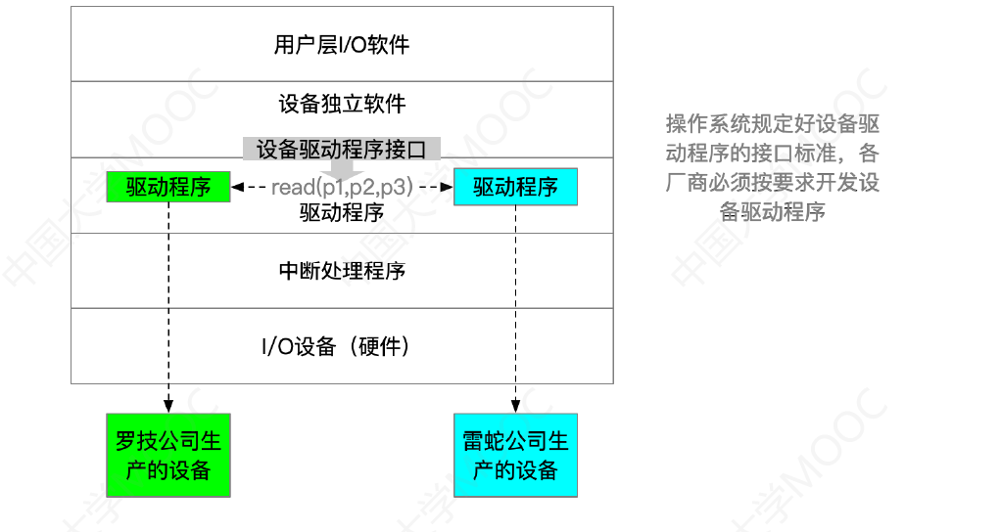

# 1、I/O设备

## 1.1、什么是I/O设备

"I/O"就是输入/输出(Input/Output)。I/O设备就是可以将数据输入到计算机，或者可以接收计算机输出数据的外部设备，属于计算机中的硬件部件。

- 鼠标、键盘就是典型的输入型设备
- 显示器就是输出型设备
- 移动硬盘属于即可输入、又可输出的设备

UNIX系统将外部设备抽象为一种特殊的文件，用户可以使用与文件操作相同的方式对外部设备进行操作。例如使用`Write`操作：向外部设备写出数据，`Read`操作：向外部设备读入数据。

> 输入其实就是把设备准备好的数据读入计算机当中，输出就是把计算机准备好的数据写出到输出设备。

## 1.2、I/O设备的分类

### 1.2.1、按使用特性分类

I/O设备按使用特性分类：

- 人机交互类外部设备【**数据传输速度慢**】
  - 鼠标、键盘、打印机等用于人机交互
- 存储设备【**数据传输速度快**】
  - 移动硬盘、光盘等——用于数据存储
- 网络通信设备【**数据传输速度介于上述二者之间**】
  - 调制解调器【路由器、mao】等——用于网络通信

### 1.2.2、按传输速率分类

I/O设备按传输速率分类：

- 低速设备
  - 鼠标、键盘等——传输速率为每秒几个到几百字节
- 中速设备
  - 如激光打印机等——传输速率为每秒数千至上万个字节
- 高速设备
  - 如磁盘等——传输速率为每秒数千字节至千兆字节的设备

### 1.2.3、按信息交换的单位分类🔥

I/O设备按信息交换的单位分类：

- 块设备【**传输速率较高，可寻址，即对它可随机地读/写任一块**】
  - 如磁盘等——数据传输的基本单位是**块**

- 字符设备【**传输速率较慢，不可寻址，在输入/输出时常采用中断驱动方式**】
  - 鼠标、键盘等——数据传输的基本单位是字符。

## 1.3、小结

# 2、I/O控制器

电子部件就是I/O控制器，也叫设备控制器。

## 2.1、I/O设备的机械部件

I/O设备的**机械部件**主要用来执行具体I/O操作。如我们看得见摸得着的鼠标/键盘的按钮；显示器的LED屏；移动硬盘的磁臂、磁盘盘面。

I/O设备的**电子部件**通常是一块插入主板扩充槽的印刷电路板。

当我们的机械部件插入电脑后，电脑是没法直接控制机械部件的，而是通过电子部件来间接控制机械部件。

## 2.2、I/O设备的电子部件(I/O控制器)

CPU无法直接控制I/O设备的机械部件，因此I/O设备还要有一个电子部件作为CPU和I/O设备机械部件之间的"中介"，用于实现CPU对设备的控制。这个电子部件就是**I/O控制器**，又称**设备控制器**。CPU可控制I/O控制器，又由I/O控制器来控制设备的机械部件。

### 2.2.1、I/O控制器的功能

1. 接受和识别CPU发出的命令
   - 如CPU发来的read/write命令，I/O控制器中会有相应的**控制寄存器**来存放CPU发出的命令和参数

2. 向CPU报告设备的状态
   - I/O控制器中会有相应的**状态寄存器**，用于记录I/O设备的当前状态。如：1表示空闲，0表示忙碌
3. 数据交换
   - I/O控制器中会设置相应的**数据寄存器**。数据从主机输出到设备时，数据寄存器用于暂存CPU发来的数据，之后再由I/O控制器将数据传送给设备。输入时，数据寄存器用于暂存设备发来的数据，之后CPU从数据寄存器中取走数据。
4. 地址识别
   - 类似于内存的地址，为了区分设备控制器中的各个寄存器，也需要给各个寄存器设置一个特定的"地址"。I/O控制器通过CPU提供的"地址"来判断CPU要读/写的是哪个寄存器

### 2.2.2、I/O控制器的组成

I/O控制器其实是作为CPU和设备的机械部件中间的中介，一个I/O控制器可能有多个控制器和设备之间的接口，为了区分CPU此时要操作的是哪个设备，需要给各个设备接口进行编号，CPU在发送命令时也需要指明自己发送的是哪一个设备。

I/O控制器可分为：

1. CPU与控制器的接口
   - 用于实现CPU与控制器之间的通信。CPU通过控制线发出命令；通过地址线指明要操作的设备；通过数据线来取出(输入)数据，或放入(输出)数据
2. I/O逻辑
   - 负责接收和识别CPU的各种命令(如地址译码)，并负责对设备发出命令
3. 控制器与设备之间的接口
   - 用于实现控制器与设备之间的通信

CPU会通过控制线向I/O控制器发送一个具体的指令，同时CPU还会在地址线上说明自己要操作的是哪个设备，如果操作的是输出设备，CPU会通过数据总线把自己要输出的数据放到I/O控制器的数据寄存器当中，之后I/O逻辑就可以从数据寄存器当中取得CPU想要输出的数据，相应的CPU发送的数据可能会有一些参数，参数放到控制寄存器当中，I/O逻辑就可以从数据寄存器当中取得相应的参数。另外CPU还会从状态寄存器中读出各个设备的状态，I/O逻辑会向状态寄存器里面写入相应的状态数据。之后I/O逻辑通过控制器与设备的接口将数据输出。

若设备要向CPU输入数据，只需要通过I/O逻辑将输入数据放入数据寄存器，CPU从数据寄存器读出数据。同时设备要及时的向CPU反馈状态，通过I/O逻辑将状态写入状态寄存器，同时接口中还有一个控制电路，I/O逻辑会根据CPU发出的命令还有相应的参数对对应的设备发出控制命令。

**值得注意的细节**：

1. 一个I/O控制器可能会对应多个设备
2. 数据寄存器、控制寄存器、状态寄存器可能有多个
   - 如：每个控制/状态寄存器对应一个具体的设备，且这些寄存器都要有相应的地址，才能方便CPU操作。有的计算机会让这些寄存器占用内存地址的一部分，称为**内存映像I/O**；另一些计算机则采用I/O专用地址，即**寄存器独立编址**

### 2.2.3、内存映像I/O和寄存器独立编址🔥

如果采用内存映像I/O这种方式，假如我们有n个内存地址，它们的编号分别是0~N-1，若系统中有设备控制器0，它包含三个寄存器，寄存器会顺着内存的地址继续向下编址，也就是说**控制器中的寄存器与内存地址统一编址**。

- 简化了指令。可以采用对内存进行操作的指令来对控制器进行操作

如果采用寄存器独立编址这种方式，假如我们有n个内存地址，它们的编号分别是0~N-1，若系统中有设备控制器0，它包含三个寄存器，寄存器从0开始继续编号，别的设备控制器中的寄存器也是从0开始编号。

- 缺点：需要设置专门的指令来实现对控制器的操作，不仅要指明寄存器的地址，还要指明控制器的编号

## 2.3、小结

# 3、I/O控制方式🔥

## 3.1、程序直接控制方式

1. 完成一次读/写操作的流程(以**读操作**为例)

1. CPU通过控制线向I/O控制器发送读指令，I/O控制器会根据CPU的要求启动相应的设备，并且把这个设备对应的状态设置为未就绪(忙碌)状态
2. 因为设备的速度比CPU慢很多，因此在设备还没有完成I/O操作之前，CPU会不断的轮询检查控制器的状态，也就是检查状态寄存器当中的数据，如果数字一直为1，表示这个设备忙碌，还未准备好要输入的数据。
3. 输入设备准备好数据后将数据传给控制器，并报告自身状态变成已就绪状态，接下来I/O逻辑会把设备传送过来的数据放到数据寄存器当中，并把状态改为0，表示设备已就绪

4. 当CPU发现设备已就绪，便会从数据寄存器当中读取出输入的数据，CPU会首先将数据寄存器的数据读入到自己的寄存器当中，再把CPU寄存器中的内容放入内存中

数据输入的过程本来应该是从设备直接输入到内存的，但是程序直接控制方式必须先经过CPU的寄存器，然后由CPU的寄存器转存到内存当中。

---

2. CPU干预的频率
   - 很频繁，I/O操作开始之前、完成之后需要CPU介入，并**且在等待I/O完成的过程中CPU需要不断地轮询检查。**
3. 数据传送的单位
   - 每次读/写**一个字**
4. 数据的流向
   - 读操作（数据输入）：I/O设备 -> CPU的寄存器 -> 内存
   - 写操作（数据输出）：内存 ->   CPU的寄存器 ->  I/O设备
   - 每个字的读/写都需要CPU的帮助

5. 主要缺点和主要优点
   - 优点：实现简单。在读/写指令之后，加上实现循环检查的一系列指令即可（因此才称为"程序直接控制方式"）
   - 缺点：CPU和I/O设备只能串行工作，CPU需要一直轮询检查，长期处于"忙等"状态，CPU利用率低。

## 3.2、中断驱动方式

引入**中断机制**。由于I/O设备速度很慢，因此在CPU发出读/写命令后，可**将等待I/O的进程阻塞**，先切换到别的进程执行。当I/O完成后，控制器会向CPU发出一个中断信号，**CPU检测到中断信号后**，会保存当前进程的运行环境信息，转去执行中断处理程序处理该中断。处理中断的过程中，CPU从I/O控制器读一个字的数据传送到CPU寄存器，再写入主存。接着，**CPU恢复等待I/O的进程（或其他进程）的运行环境，然后继续执行**。

注意：

1. CPU会在每个指令周期的末尾检查中断(也就是每个指令执行结束CPU就检查一次中断)
2. 中断处理过程中需要保存、恢复进程的运行环境。这个过程是需要一定时间开销的。可见，如果中断发生
   的频率太高，也会降低系统性能。

---

2. CPU干预的频率
   - 每次I/O操作开始之前、完成之后需要CPU介入，因为 **等待I/O完成的过程中CPU可以切换到别的进程执行。**
3. 数据传送的单位
   - 每次读/写**一个字**
4. 数据的流向
   - 读操作（数据输入）：I/O设备 -> CPU的寄存器 -> 内存
   - 写操作（数据输出）：内存 ->   CPU的寄存器 ->  I/O设备
   - 每个字的读/写都需要CPU的帮助

5. 主要缺点和主要优点
   - 优点：与"程序直接控制方式"相比，在"中断驱动方式"中，I/O控制器会通过中断信号主动报告I/O已完成，CPU不再需要不停地轮询。**CPU和I/O设备可并行工作**，CPU利用率得到明显提升。
   - **缺点**：每个字在I/O设备与内存之间的传输，都需要经过CPU。而**频繁的中断处理会消耗较多的CPU时间。**

## 3.3、DMA方式

与"中断驱动方式"相比，DMA方式（Direct Memory Access，直接存储器存取。主要用于块设备的I/O控制）有这样几个改进：

1. 数据的传送单位是**块**。不再是一个字、一个字的传送
2. 数据的流向是从设备直接放入内存，或者从内存直接到设备。不再需要CPU作为"快递小哥"。
3. 仅在传送一个或多个数据块的开始和结束时，才需要CPU干预。

CPU给I/O模块发出读/写命令，之后CPU就可以去做其他事情，DMA控制器会根据CPU发出的命令完成这一系列的读写工作，完成后DMA控制器会向CPU发出中断信号，CPU再介入处理中断。

CPU指明此次要进行的操作（如：读操作），并说明要读入多少数据、数据要存放在内存的什么位置、数据在外部设备上的地址（如：在磁盘上的地址。控制器会根据CPU提出的要求完成数据的读/写工作，整块数据的传输完成后，才向CPU发出中断信号

DMA控制器由主机-控制器接口、I/O控制逻辑、块设备-控制器接口组成，为了实现控制器和CPU的联系，会设置一系列的寄存器，CPU可以通过系统总线来读/写入数据给寄存器，DMA控制器从磁盘中读取数据直接放入内存中，其中也是一个个字读了之后先放到寄存器当中，然后再组合成块写入内存。

2. CPU干预的频率
   - 仅在传送一个或多个数据块的开始和结束时，才需要CPU干预。
3. 数据传送的单位
   - 每次读/写一个或多个块（注意：**每次读写的只能是连续的多个块，且这些块读入内存后在内存中也必须是连续的**）
4. 数据的流向【==不再需要经过CPU==】
   - 读操作（数据输入）：I/O设备 ->  内存
   - 写操作（数据输出）：内存 ->   I/O设备
   - 每个字的读/写都需要CPU的帮助

5. 主要缺点和主要优点
   - 优点：数据传输以**块**为单位，CPU介入频率进一步降低。数据的传输不再需要先经过CPU再写入内
     存，数据传输效率进一步增加。CPU和I/O设备的并行性得到提升。
   - **缺点**：CPU每发出一条I/O指令，只能读/写一个或多个连续的数据块。如果要读/写多个离散存储的数据块，或者要将数据分别写到不同的内存区域时，CPU要分别发出多条I/O指令，进行多次中断处理才能完成。

## 3.4、通道控制方式

通道：一种**硬件**，可以理解为是"弱鸡版的CPU"(与CPU相比，通道可以执行的指令很单一，并且通道程序是放在主机内存中的，也就是说通道与CPU共享内存)。通道可以识别并执行一系列通道指令

CPU、内存、通道通过系统总线连接到一起，首先CPU向通道 发出I/O指令。指明通道程序在内存中的位置，并指
明要操作的是哪个I/O设备。之后CPU就切换到其他进程执行了。之后通道会根据CPU的指示找到此次要执行的通道程序存放在内存当中的什么位置，通道程序可以理解成一种任务清单，其实这个任务清单就是一系列通道指令的集合，通道程序中指明了此次要读入/写出多少数据，读/写的数据在内存中的什么位置等信息。采用这种方式就相当于CPU告诉通道你去执行这样的任务，任务的清单我已经放到内存了，任务具体做什么并不是由CPU直接告诉通道的，而是由通道去读取内存当中的通道程序然后执行。通道执行完后会向CPU发送中断信号。

2. CPU干预的频率
   - 极低，通道会根据CPU的指示执行相应的通道程序，只有完成一组数据块的读/写后才需要发出中断信号，请求CPU干预。
3. 数据传送的单位
   - 每次读/写**一组数据块**
4. 数据的流向【==在通道的控制下进行==】
   - 读操作（数据输入）：I/O设备 ->  内存
   - 写操作（数据输出）：内存 ->   I/O设备
   - 每个字的读/写都需要CPU的帮助

5. 主要缺点和主要优点
   - 优点：**CPU、通道、I/O设备可并行工作，资源利用率很高。**
   - **缺点**：实现复杂，需要专门的通道硬件支持

## 3.5、小结

# 4、I/O软件层次结构

## 4.1、用户层软件

用户层软件**实现了与用户交互的接口**，用户可直接使用该层提供的与I/O操作相关的库函数对设备进行操作。但是设备是由操作系统控制的，所以用户层软件会使用设备独立性软件向上提供的系统调用服务，来请求操作系统内核的服务。

> 设备独立性软件向上层提供了系统调用的接口，所以设备独立性软件又是用来处理系统调用的一个层次，因此有的题目也会将这一层称为 **系统调用处理层**

## 4.2、设备独立性软件

**设备独立性软件**，又称**设备无关性软件**。与设备的硬件特性无关的功能几乎都在这一层实现。

主要实现的功能：

1. 向上层提供统一的系统调用接口（如read/write系统调用）
2. 设备的保护
   - 原理类似与文件保护。设备被看做是一种特殊的文件，不同用户对各个文件的访问权限是不一样的，同理，对设备的访问权限也不一样。
3. 差错处理
   - 设备独立性软件需要对一些设备的错误进行处理
4. 设备的分配与回收
5. 数据缓冲区管理
   - 可以通过缓冲技术屏蔽设备之间数据交换单位大小和传输速度的差异

6. 建立逻辑设备名到物理设备名的映射关系，根据设备类型选择调用相应的驱动程序
   - 用户或用户层软件发出I/O操作相关系统调用的系统调用时，需要指明此次要操作的I/O设备的逻辑设备名（eg：去学校打印店打印时，需要选择打印机1/打印机2/打印机3，其实这些都是**逻辑设备名**）
   - **设备独立性软件**需要通过"**逻辑设备表**(LUT，Logical UnitTable)"来确定逻辑设备对应的**物理设备**，并找到该设备对应的**设备驱动程序**

很多操作系统将I/O设备当作是一种特殊的文件，所以才会有上图设备存储的路径。操作系统系统可以采用两种方式管理逻辑设备表（LUT）：

1. **整个系统只设置一张LUT**，这就意味着所有用户不能使用相同的逻辑设备名，因此这种方式只适用于单用户操作系统
2. **为每个用户设置一张LUT**，各个用户使用的逻辑设备名可以重复，适用于多用户操作系统。系统会在用户登录时为其建立一个用户管理进程，而LUT就存放在用户管理进程的PCB中

## 4.3、设备驱动程序

我们在将机械键盘(例如花了我298块大洋的IKBC键盘⌨)插入电脑时，电脑右下角会提示驱动安装成功，这其实就是设备驱动程序的安装，设备驱动程序是由厂家提供的。

不同类型的I/O设备需要有不同的驱动程序，这是因为各式各样的设备，外形不同，其内部的电子部件(I/O控制器)也有可能不同。不同设备的内部硬件特性也不同，这些特性只有厂家才知道，因此厂家须提供与设备相对应的驱动程序，CPU执行驱动程序的指令序列，来完成设置设备寄存器，检查设备状态等工作。

## 4.4、中断处理程序

当I/O任务完成时，I/O控制器会发送一个**中断信号**，系统会根据**中断信号类型**找到相应的**中断处理程序**并执行

中断处理程序会从I/O控制器当中读出设备的状态来判断这次的I/O是不是正常的结束，如果此时正常的结束，接下来中断处理程序会从I/O控制器的数据寄存器当中读出一个字的数据，并且经由CPU放到内存缓冲区当中，这就完成了一个字的读入。若这次的I/O是非正常的结束，那么系统会根据异常原因做相应的处理。这就是中断处理程序所需要做的事情。

当中断处理程序做完后，接下来又会交由设备驱动程序处理，再交给设备独立性软件处理，最终反映给用户。所以对于数据的处理是从下向上依次层层处理的。

> 除了设备驱动程序需要和硬件打交道外，中断处理程序也需要直接和硬件打交道。但是再向上的设备独立性软件、用户层软件就不会和硬件打交道了

## 4.5、小结

理解并记住I/O软件**各个层次之间的顺序**，要能够推理判断某个处理应该是在哪个层次完成的（最常考的
是设备独立性软件、设备驱动程序这两层。只需理解一个特点即可：**直接涉及到硬件具体细节、且与中**
**断无关的操作肯定是在设备驱动程序层完成的；没有涉及硬件的、对各种设备都需要进行的管理工作都**
**是在设备独立性软件层完成的**）

---

# 新考点：输入输出应用程序接口

I/O软件分为多个层次，上层的用户层I/O软件需要通过系统调用的方式来请求使用底层的某一种I/O设备，但是由于底层的I/O设备接口非常多样化，用户层的应用程序无法用一个统一的系统调用接口来完成所有类型设备的I/O。所以设备独立软件这一层需要向上层提供统一的设备接口。

如上图：

- 用户程序若要使用字符设备，需要调用字符设备接口：get/put系统调用：向字符设备读/写一个字符

- 用户程序若要使用块设备，需要调用块设备调用接口：read/write系统调用：向块设备的**读写指针位置读/写多个字符**，seek系统调用：**修改读写指针位置**
- 用户程序若要使用网络设备，需要调用网络设备接口，又称"网络套接字(socket)接口"。socket系统调用：创建一个网络套接字，需指明网络协议(TCP?UDP?)
  - bind：将套接字绑定到某个本地端口
  - connect：将套接字连接到远程地址
  - read/write：从套接字读/写数据

## 阻塞/非阻塞I/O

**阻塞I/O**：应用程序发出I/O系统调用，**进程需转为阻塞态等待**。

- 例如字符设备接口：从键盘读一个字符get

**非阻塞I/O**：应用程序发出I/O系统调用，系统调用可迅速返回，**进程无需阻塞等待**

- 例如块设备接口：往磁盘写数据write

## 统一标准的设备驱动程序接口

---

# 5、I/O核心子系统

## 5.1、功能实现层次

注：实际应用中假脱机技术（SPOOLing技术）需要请求"磁盘设备"的设备独立性软件的服务，因此一般来说假脱机技术是在用户层软件实现的。但是408大纲又将假脱机技术归为"I/O核心子系统"的功能，因此考试时还是以大纲为准。

## 5.2、I/O调度

I/O调度：**用某种算法确定一个好的顺序来处理各个I/O请求**。如：磁盘调度(先来先服务算法、最短寻道优先算法、SCAN算法、C-SCAN算法、LOOK算法、C-LOOK算法)。当多个磁盘I/O请求到来时，用某种调度算法确定满足I/O请求的顺序。

同理，打印机等设备也可以用先来先服务算法、优先级算法、短作业优先等算法来确定I/O调度顺序。

## 5.3、设备保护

操作系统需要实现**文件保护**功能，不同的用户对各个文件有不同的访问权限(如：只读、读和写等)。在UNIX系统中，**设备被看做是一种特殊的文件**，每个设备也会有对应的FCB。当用户请求访问某个设备时，系统根据FCB中记录的信息来判断该用户是否有相应的访问权限，以此实现"设备保护"的功能。

## 5.4、假脱机技术

### 5.4.1、脱机技术

手工操作阶段：主机直接从I/O设备获得数据，由于设备速度慢，主机速度很快。人机速度矛盾明显，主机要浪费很多时间来等待设备

批处理阶段引入了**脱机输入**/输出技术（用磁带完成）：引入脱机技术后，缓解了CPU与慢速I/O设备的速度矛盾。另一方面，即使CPU在忙碌，也可以提前将数据输入到磁带；即使慢速的输出设备正在忙碌，也可以提前将数据输出到磁带。

脱机 ：脱离主机的控制进行的输入/输出操作，并不需要CPU(主机)的控制，这样CPU就有更多时间处理别的任务

### 5.4.2、假脱机技术

假脱机技术，又称 `SPOOLing技术`，是用软件的方式模拟脱机技术。`SPOOLing`系统的组成如下：

系统会在磁盘上开辟两个存储区域：

1. **输入井**：模拟脱机输入时的磁带，用于收容I/O设备输入的数据
2. **输出井**：模拟脱机输出时的磁带，用于收容用户输出的数据

要实现SPOOLing技术，必须要有多道程序技术的支持。系统会建立 **输入进程** 和 **输出进程**，用来模拟外围控制机。

当有数据需要从设备输入到计算机时，**输入进程**是用软件的方式模拟外围控制机，输入进程会把数据放到输入井当中， **输出进程**在模拟脱机输出的时候，从磁盘的 **输出井**当中取出数据输出到设备上。

在内存当中也会开辟输入缓冲区和输出缓冲区。它们的作用就是在模拟脱机输入和输出时作为一个数据的中转站。所以输入进程是先接收输入设备的数据，然后把这些数据先放到输入缓冲区里，之后再把输入缓冲区的数据放到磁盘的输入井当中。输出进程是先从输出井当中取出数据放到输出缓冲区，再将输出缓冲区的数据放到输出设备。

### 5.4.3、共享打印机原理分析

当多个用户进程提出输出打印的请求时，系统会答应它们的请求，但是并不是真正把打印机分配给他们，而是由假脱机管理进程为每个进程做两件事：

1. 在磁盘输出井中为进程申请一个空闲缓冲区（也就是说，这个缓冲区是在磁盘上的），并将用户进程想要打印的数据送入空闲缓冲区
2. 为用户进程申请一张空白的打印请求表，并将用户的打印请求填入表中（其实就是用来说明用户的打印数据存放位置等信息的），再将该表挂到假脱机文件队列(其实就是一系列打印任务的队列)上。当打印机空闲时，输出进程会从假脱机文件队列的队头取出一张打印请求表，并根据表中的要求将要打印的数据从输出井传送到输出缓冲区，再输出到打印机进行打印。用这种方式可依次处理完全部的打印任务。

采用`SPOOLing技术`后，虽然系统中只有一个台打印机，但每个进程提出打印请求时，系统都会为在输出井中为其分配一个存储区（相当于分配了一个逻辑设备），使每个用户进程都觉得自己在独占一台打印机，从而实现对打印机的共享。

> SPOOLing技术可以把一台物理设备虚拟成逻辑上的多台设备，可将独占式设备改造成共享设备。

### 5.4.4、小结

# 6、设备的分配和回收

## 6.1、设备分配时应考虑的因素

### 6.1.1、设备的固有属性

设备的固有属性可分为三种：独占设备、共享设备、虚拟设备

- **独占设备** —— 一个时段只能分配给一个进程（如打印机）
- **共享设备** —— 可同时分配给多个进程使用（如磁盘），各进程往往是宏观上同时共享使用设备，而微观上交替使用。
- **虚拟设备** —— 采用SPOOLing技术将独占设备改造成虚拟的共享设备，可同时分配给多个进程使用（如采用SPOOLing技术实现的共享打印机）

### 6.1.2、设备的分配算法

先来先服务、优先级高者优先、短任务优先等等算法

### 6.1.3、设备分配中的安全性

从进程运行的安全性上考虑，设备分配有两种方式：

- **安全分配方式**：为进程分配一个设备后就将进程阻塞，直到进程释放I/O设备后才将进程唤醒。(例如考虑进程请求打印机打印输出的例子)，一个进程被分配打印机之后，这个进程就必须先阻塞等待，虽然说进程只需要把数据丢给打印机然后就不用管打印机的打印输出过程，继续向下执行后面代码。但是采用安全分配方式就必须阻塞，直到打印结束之后进程才会被再次唤醒。
  - **一个时段内每个进程只能使用一个设备**
    - 优点：破坏了"请求和保持"条件，不会死锁
    - 缺点：对于一个进程来说，CPU和I/O设备只能串行工作
- **不安全分配方式**：进程发出I/O请求后，系统为其分配I/O设备，进程可继续执行，之后还可以发出新的I/O请求。只有某个I/O请求得不到满足时才将进程阻塞。(一个进程被分配打印机之后，这个进程把数据丢给打印机，然后自己继续向下执行，甚至再向下执行的过程中还可以继续申请其他I/O设备)
  - **一个进程可以同时使用多个设备**
    - **优点**：进程的计算任务和I/O任务可以并行处理，使进程迅速推进
    - **缺点**：有可能发生死锁（死锁避免、死锁的检测和解除）

#### 1、静态分配和动态分配

静态分配：进程运行前为其分配全部所需资源，运行结束后归还资源。(破坏了"请求和保持"条件，不会死锁)

动态分配：进程运行过程中动态申请设备资源

#### 2、设备分配管理中的数据结构

一个通道可以控制多个控制器，一个控制器可以控制多个设备。要控制一个设备，肯定需要先找到它的控制器，要找到它的控制器，需要先找到它的通道。所以设备分配管理中的数据结构要表示这种从属关系。

- 系统会为每个设备设置一个**设备控制表**(DCT)：系统为每个设备配置一张DCT，用于记录设备情况，大概包括如下常用字段

设备队列的队首指针：指向此时正在等待使用这个设备的进程队列，之前说过，系统会根据阻塞原因不同，将进程PCB挂到不同的阻塞队列中，假如此时进程正在等待I/O设备的分配，而这个I/O设备又暂时没法分配给它，那么这个进程就会挂到这个设备的设备控制表所指向的等待队列的队尾。所以设备队列的队首指针指向的就是相应的苏泽队列。

- 第二个数据结构是**控制器控制表**(COCT)：每个设备控制器都会对应一张COCT。操作系统根据COCT的信息对控制器进行操作和管理。

- 第三个数据结构是**通道控制表**(CHCT)：每个通道都会对应一张CHCT。操作系统根据CHCT的信息对通道进行操作和管理。

- 第四个数据结构是**系统设备表**(SDT)：记录了系统中全部设备的情况，每个设备对应一个表目。

#### 3、设备分配的步骤

1. 根据进程请求的**物理设备名**查找系统设备表SDT(注：物理设备名是进程请求分配设备时提供的参数)
2. 根据系统设备表SDT找到通道控制表DCT，若**设备**忙碌则将进程PCB挂到**设备等待队列**中，不忙碌则将**设备**分配给进程
3. 根据通道控制表DCT找到控制器控制表COCT，若**控制器**忙碌则将进程PCB挂到**控制器等待队列**中，不忙碌则将**控制器**分配给进程

4. 根据控制器控制表COCT找到设备控制表CHCT，若通道忙碌则将进程PCB挂到通道等待队列中，不忙碌则将通道分配给进程。

> 只有设备、控制器、通道三者都分配成功时，这次设备分配才算成功，之后便可启动I/O设备进行数据传送

缺点：

- 用户编程时必须使用**物理设备名**，底层细节对用户不透明，不方便编程
- 若换了一个物理设备，则程序无法运行
- 若进程请求的物理设备正在忙碌，则即使系统中还有同类型的设备，进程也必须阻塞等待(例如一台电脑连接三台打印机，进程请求的是第一台打印机，那么虽然可能第二台、第三台打印机目前空闲，但是这个进程依然需要阻塞)

改进方法：**建立逻辑设备名与物理设备名的映射机制，用户编程时只需提供逻辑设备名**。由操作系统实现逻辑设备名到物理设备名的转换。

#### 4、设备分配步骤改进

1. 根据进程请求的**逻辑设备名**查找系统设备表SDT(注：用户编程时提供的逻辑设备名其实就是**设备类型**)
2. 查找系统设备表SDT，找到用户进程**指定类型的、并且空闲**的设备，将其分配给该进程。操作系统在**逻辑设备表(LUT)中新增一个表项**。
3. 根据通道控制表DCT找到控制器控制表COCT，若**控制器**忙碌则将进程PCB挂到**控制器等待队列**中，不忙碌则将**控制器**分配给进程

4. 根据控制器控制表COCT找到设备控制表CHCT，若通道忙碌则将进程PCB挂到通道等待队列中，不忙碌则将通道分配给进程。

**逻辑设备表(LUT)建立了逻辑设备名与物理设备名之间的映射关系**。

某用户进程第一次使用设备时使用逻辑设备名向操作系统发出请求，操作系统根据用户进程指定的设备类型(逻辑设备名)查找系统设备表，找到一个空闲设备分配给进程，并在逻辑设备表LUT中增加相应表项。**如果之后用户进程再次通过相同的逻辑设备名请求使用设备，则操作系统通过LUT表即可知道用户进程实际要使用的是哪个物理设备了，并且也能知道该设备的驱动程序入口地址**。

有以下两种方式设置逻辑设备表：

1. 整个系统只有一张LUT：各用户所用的**逻辑设备名不允许重复**，适用于单用户操作系统
2. 每个用户一张LUT：**不同用户的逻辑设备名可重复**，适用于多用户操作系统

## 6.2、小结

# 7、缓冲区管理

## 7.1、什么是缓冲区

缓冲区是一个存储区域，可以由专门的硬件寄存器组成，也可利用内存作为缓冲区

- 使用硬件作为缓冲区的成本较高，容量也较小，一般仅用在对速度要求非常高的场合（如存储器管理中所用的联想寄存器，由于对页表的访问频率极高，因此使用速度很快的联想寄存器来存放页表项的副本）
- 一般情况下，更多的是利用**内存作为缓冲区**，"设备独立性软件"的缓冲区管理就是要组织管理好这些缓冲区

## 7.2、缓冲区的作用

采用缓冲区策略：在内存中开辟一片空间作为缓冲区，CPU可以把要输出的数据块快速的放入缓冲区就可以处理其他事，慢速的I/O设备可以慢慢的从缓冲区取走数据。

未采用缓冲区策略：I/O设备每输出一定单位的数据就需要给CPU发送中断信号，CPU就得处理这个中断信号，时间开销大

**解决数据粒度不匹配的问题**：比如输出进程每次可以生成一块数据，但I/O设备每次只能输出一个字符。若未采用缓冲区，则输出进程只能一个字符一个字符给I/O设备传送数据，采用了缓冲区技术，输出进程直接将一整块数据放入缓冲区，I/O设备从缓冲区一个字符一个字符的取。

## 7.3、单缓冲

假设某用户进程请求某种块设备读入若干块的数据。若采用**单缓冲**的策略，操作系统会**在主存中为其分配一个缓冲区**（若题目中没有特别说明，一个缓冲区的大小就是一个块）。

**注意**：==当缓冲区数据非空时，不能往缓冲区冲入数据，只能从缓冲区把数据传出；当缓冲区为空时，可以往缓冲区冲入数据，但必须把缓冲区充满以后，才能从缓冲区把数据传出==。

如上图，系统在内存中为设备分配一块大小的缓冲区，这个块设备会产生一块大小的数据，将其输入到缓冲区，假设这个过程耗费时间为T，之后将缓冲区的块数据送到用户进程的工作区，之后用户进程就可以对这块数据进行处理。

如上图，假设单缓冲的初始状态为**工作区满，缓冲区空**，所以我们需要计算下一次达到 **工作区满，缓冲区空** 的状态需要多长时间，这个时间就是处理一个数据块平均需要消耗的时间。分2种情况

1. **假设输入时间T > 处理时间C**
   1. 刚开始**工作区满**，所以刚开始CPU就可以处理工作区的数据，用时C。刚开始**缓冲区空**，所以在CPU处理工作区数据的同时块设备就可以给缓冲区冲入数据，耗时T
   2. 因为输入数据的时间 T  > 处理数据的时间C，所以CPU处理完数据后暂时不能将下一块数据传送到工作区，因为此时缓冲区的数据还未冲满，必须等待缓冲区中充满数据并把数据传送到工作区之后，CPU才能处理这块数据。所以在T时间点之后经过M时间，数据才会被输送到工作区
   3. 此时**工作区满，缓冲区空**，回到了初始状态，共用时 T+M，则处理一块数据的平均用时就是 `T+M`

2. **假设输入时间T < 处理时间C**
   1. 刚开始**工作区满**，所以刚开始CPU就可以处理工作区的数据，用时C。刚开始**缓冲区空**，所以在CPU处理工作区数据的同时块设备就可以给缓冲区冲入数据，耗时T
   2. 因为输入数据的时间 T  < 处理数据的时间C，所以缓冲区用时T冲满数据后暂时不能继续冲入下一块数据，必须等待CPU处理数据结束后再将缓冲区的书传送到工作区。所以在C时间点之后经过M时间，数据才会被输送到工作区
   3. 此时**工作区满，缓冲区空**，回到了初始状态，共用时 T+M，则处理一块数据的平均用时就是 `C+M`

> 结论：采用单缓冲策略，处理一块数据平均耗时Max(C, T)+M

## 7.4、双缓冲

假设某用户进程请求某种块设备读入若干块的数据。若采用**双缓冲**的策略，操作系统会在**主存中为其分配两个缓冲区**（若题目中没有特别说明，一个缓冲区的大小就是一个块）

双缓冲题目中，假设初始状态为：**工作区空，其中一个缓冲区满，另一个缓冲区空**

1. **假设输入时间 T > 处理时间C  + 传送时间M**
   1. 缓冲区1满，缓冲区2空，工作区也是空的。所以开始可以耗时M将缓冲区1的数据传送到工作区当中。接下来CPU耗时C处理工作区的数据。另一方面，刚开始缓冲区2空，所以耗时T将缓冲区2冲满。
   2. 由于输入时间 T > 处理时间C  + 传送时间M，所以在CPU处理完数据、工作区已经空了，也就是M+C时刻缓冲区2并没有冲满，所以暂时不能将缓冲区2的数据传送到工作区
   3. 在T时刻，缓冲区2被冲满。满足初始状态：**工作区空，其中一个缓冲区满，另一个缓冲区空**。回到了初始状态，共用时 T，则处理一块数据的平均用时就是 `T`

2. **假设输入时间 T > 处理时间C  + 传送时间M**
   1. 缓冲区1满，缓冲区2空，工作区也是空的。所以开始可以耗时M将缓冲区1的数据传送到工作区当中。接下来CPU耗时C处理工作区的数据。另一方面，刚开始缓冲区2空，所以耗时T将缓冲区2冲满。
   2. 假设输入时间 T > 处理时间C  + 传送时间M，在T时刻缓冲区2就已经冲满，而C+M(1)时刻CPU处理完数据，紧接着花费M(2)时间将缓冲区2的数据传送到工作区，CPU就可以耗时C继续处理缓冲区2的数据
   3. 在T时刻，缓冲区2被冲满，设备开始空闲，并且缓冲区1在M(1)时刻就已经被取空了，因此缓冲区2的数据被冲满了之后，设备就可以紧接着向缓冲区1冲入数据，耗时T。在2T时刻，缓冲区2的数据还没有完全被取走，因此虽然设备空闲，也不能向缓冲区2冲入数据。只有缓冲区2完全被取走，设备才可以继续向缓冲区2冲入数据。

简单分析就已经不好找下一个初始状态了，但是我们可以发现经历C+M时间处理一个数据块。再经历C+M时间再处理一个数据块。

> 结论：采用双缓冲策略，处理一个数据块的平均耗时为Max (T, C+M)

## 7.5、使用单/双缓冲在通信时的区别

单/双缓冲不仅仅应用在主机和设备之间进行数据传送，两台主机之间通信时，也可以配置缓冲区用于数据的发送和接收。

若给两台主机配置单缓冲区，A主机要发送数据，首先将数据放入A缓冲区中，等缓冲区冲满之后就可以向B主机的缓冲区当中一个一个的发送数据，B主机将缓冲区的数据全部取走后，才能向A机发送数据。

> 显然，若两台主机只设置单缓冲区，在任意时刻只能实现数据的单向传输。

为了实现双向传输，我们可以给两台机器配置双缓冲区，其中一个缓冲区用来暂存即将发送的数据，另一个缓冲区用于接收输入的数据。

> 采用双缓冲区，两台机器可以同时向发送缓冲区冲入想要发送的数据，然后同时向对方的接收缓冲区中发送数据。

## 7.6、循环缓冲区

循环缓冲区：将多个**大小相等**的缓冲区链接成一个**循环队列**

在上图中，橙色表示已经冲满数据的缓冲区，绿色表示空缓冲区。系统会保持两个指针用于缓冲区的管理，`in`指针可以指向下一个可以冲入数据的空缓冲区。`out`指针可以指向下一个可以取出数据的满缓冲区。例如当3号缓冲区被取空之后，`out`指针就可以指向4号满缓冲区了。1号缓冲区被冲满之后，`in`指针就需要指向2号空缓冲区。

## 7.7、缓冲池

缓冲池其实就是放满了各种各样缓冲区的一个池子，当我们需要使用或者归还一个缓冲区时，就可以对池子当中的各种缓冲区进行操作。

**缓冲池**由系统中共用的缓冲区组成。这些缓冲区按使用状况可以分为：空缓冲队列、装满输入数据的缓冲队列（输入队列）、装满输出数据的缓冲队列（输出队列）。另外，根据一个缓冲区在实际运算中扮演的功能不同，又设置了四种工作缓冲区：用于收容输入数据的工作缓冲区（hin）、用于提取输入数据的工作缓冲区（sin）、用于收容输出数据的工作缓冲区（hout）、用于提取输出数据的工作缓冲区（sout）

若一个输入进程请求输入一块数据，系统会从空缓冲队列的队头当中取下这一块空的缓冲区，将其作为用于收容输入数据的缓冲区，当这块缓冲区被冲满之后，就会将其挂在输入队列的队尾上。

若计算进程想要取得输入的数据，操作系统会从输入队列的队头取下一个缓冲区，将其作为提取输入数据的缓冲区，这块缓冲区中的数据会被传送到计算进程的工作区当中，所以这块缓冲区中的数据就被取空了，所以将这块缓冲区挂到空缓冲队列的队尾。

若计算进程想要将准备好的数据冲入缓冲区，系统会从空缓冲队列的队头取下一个空缓冲区，将其作为收容输出数据的工作缓冲区，当这块缓冲区被冲满之后，就会将其挂在输出队列的队尾上。

若输出进程请求输出数据，系统会从输出队列的队头取一个缓冲区，将其用作提取输出数据的缓冲区，这块缓冲区的数据会被慢慢取走，当被取空之后将缓冲区挂在空缓冲队列的队尾。

## 7.8、小结

# 8、磁盘的结构

## 8.1、磁盘、磁道、扇区

磁盘的表面由一些磁性物质构成，可以用这些磁性物质来记录二进制数据。

磁道：磁盘的盘面被划分为一个个磁道，这样的一个圈，就是一个磁道。每个磁道又被划分成一个个扇区，每个扇区就是一个磁盘块，各个扇区存放的数据量相同。我们可以给各个扇区进行编号，最内侧磁道上的扇区面积最小，因此数据密度最大。

## 8.2、如何在磁盘当中读/写数据

需要把"磁头"移动到想要读/写的扇区所在的磁道，磁盘会转起来，让目标扇区从磁头下面滑过，这样才能完成对扇区的读写操作

## 8.3、盘面、柱面

一个磁盘可能包含多个盘面，每个盘面对应一个磁头，一个盘片可能会有两个盘面(正着和反着)。所有的磁头都是连在同一个磁臂上，所以所有的磁头只能"共进退"。所有盘面中相对位置相同的磁道组成柱面(例如上图中所有黄色部分磁道组成了柱面)。

可用（**柱面号，盘面号，扇区号**）来定位任意一个“磁盘块”，可根据该地址读取一个“块”：

1. 根据“柱面号”移动磁臂，让磁头指向指定柱面
2. 激活指定盘面对应的磁头
3. 磁盘旋转的过程中，指定的扇区会从磁头下面划过，这样就完成了对指定扇区的读/写

## 8.4、磁盘的分类

按照磁头是否可以移动分为：

- 磁头可以移动的称为**活动头磁盘**。磁臂可以来回伸缩来带动磁头定位磁道
- 磁头不可移动的称为**固定头磁盘**。这种磁盘中每个磁道有一个磁头

按照盘片是否可更换分为：

- 盘片可以更换的称为**可换盘磁盘**
- 盘片不可更换的称为**固定盘磁盘**

## 8.5、小结

# 9、磁盘调度算法

## 9.1、一次磁盘读/写操作需要的时间

**寻找时间（寻道时间）**T~S~：在读/写数据前，将磁头移动到指定磁道所花的时间。

1. **启动磁头臂**是需要时间的。假设耗时为s
2. **移动磁头**也是需要时间的。假设磁头均匀移动，每跨越一个磁道耗时为m，总共需要跨越n条磁道

则==寻道时间：T~s~ = s + m×n==

**延迟时间T~R~**：通过旋转磁盘，使磁头定位到目标扇区所需要的时间。设磁盘转速为r（单位：转/秒，或转/分），则平均所需的==延迟时间T~R~=(1/2)×(1/r)=1/2r==

- 1/r就是转一圈需要的时间。找到目标扇区平均需要转半圈，因此再乘以1/2

**传输时间T~t~**：从磁盘读出或向磁盘写入数据所经历的时间，假设磁盘转速为r，此次读/写的字节数为b，每个磁道上的字节数为N。则：==传输时间T~t~=(1/r)×(b/N)=b(rN)==

- 每个磁道要可存N字节的数据，因此b字节的数据需要b/N个磁道才能存储。而读/写一个磁道所需的时间刚好又是转一圈所需要的时间1/r

则总的平均存取时间T~a~ = T~s~ + 1/2r +b/(rN)

---

- 延迟时间和传输时间都与磁盘转速相关，且为线性相关。而转速是硬件的固有属性，因此操作系统也无法优化延迟时间和传输时间。
- 但是操作系统的磁盘调度算法会直接影响寻道时间

## 9.2、磁盘调度算法

### 9.2.1、先来先服务算法(FCFS)

先来先服务算法(FCFS)：根据进程请求访问磁盘的先后顺序进行调度。

磁头本来在100号磁道，首先响应55号磁道，所以会从100号磁道移动到55号磁道，接下来又移动到58号磁道，再接下来移动到39号磁道.....

100号磁道移动到55号磁道，共移动了45，55号磁道移动到58号磁道，共移动了3....

- 优点：公平；如果请求访问的磁道比较集中的话，算法性能还算过的去
- 缺点：如果有大量进程竞争使用磁盘，请求访问的磁道很分散，则FCFS在性能上很差，寻道时间长。

### 9.2.2、最短寻找时间优先(SSTF)

SSTF算法会优先处理的磁道是与当前磁头最近的磁道。可以保证每次的寻道时间最短，但是并不能保证总的寻道时间最短。（其实就是贪心算法的思想，只是选择眼前最优，但是总体未必最优）

磁头本来在100号磁道，首先响应离100最近的90号磁道，接下来离90号磁道最近的是58号磁道，所以响应58号磁道。

- 优点：性能较好，平均寻道时间短

- 缺点：可能产生“饥饿”现象

### 9.2.3、扫描算法(SCAN)

SSTF算法会产生饥饿的原因在于：磁头有可能在一个小区域内来回来去地移动。为了防止这个问题，可以规定，**只有磁头移动到最外侧磁道的时候才能往内移动，移动到最内侧磁道的时候才能往外移动**。这就是**扫描算法（SCAN）**的思想。由于磁头移动的方式很像电梯，因此也叫**电梯算法**。

优点：

- 性能较好，平均寻道时间较短，**不会产生饥饿现象**

缺点：

- 只有到达最边上的磁道时才能改变磁头移动方向，事实上，处理了184号磁道的访问请求之后就不需要再往右移动磁头了。
- SCAN算法对于各个位置磁道的响应频率不平均（如：假设此时磁头正在往右移动，且刚处理过90号磁道，那么下次处理90号磁道的请求就需要等磁头移动很长一段距离；而响应了184号磁道的请求之后，很快又可以再次响应184号磁道的请求了）

### 9.2.4、LOOK调度算法

扫描算法（SCAN）中，只有到达最边上的磁道时才能改变磁头移动方向，事实上，处理了184号磁道的访问请求之后就不需要再往右移动磁头了。LOOK调度算法就是为了解决这个问题，**如果在磁头移动方向上已经没有别的请求，就可以立即改变磁头移动方向**。（边移动边观察，因此叫LOOK）

- 优点：比起SCAN算法来，不需要每次都移动到最外侧或最内侧才改变磁头方向，使寻道时间进
  一步缩短

### 9.2.5、循环扫描算法(C-SCAN)

SCAN算法对于各个位置磁道的响应频率不平均，而**C-SCAN算法**就是为了解决这个问题。规定只有磁头朝某个特定方向移动时才处理磁道访问请求，而**返回时直接快速移动至起始端而不处理任何请求**。

优点：比起SCAN来，对于各个位置磁道的响应频率很平均。

缺点：只有到达最边上的磁道时才能改变磁头移动方向，事实上，处理了184号磁道的访问请求之后就不需要再往右移动磁头了；并且，磁头返回时其实只需要返回到18号磁道即可，不需要返回到最边缘的磁道。另外，比起SCAN算法来，平均寻道时间更长。

### 9.2.6、C-LOOK算法

C-SCAN算法的主要缺点是只有到达最边上的磁道时才能改变磁头移动方向，并且磁头返回时不一定
需要返回到最边缘的磁道上。C-LOOK算法就是为了解决这个问题。如果磁头移动的方向上已经没有
磁道访问请求了，就可以立即让磁头返回，并且磁头只需要返回到有磁道访问请求的位置即可。

### 9.2.7、小结

## 9.3、减少延迟时间的方法

延迟时间：将目标扇区转到磁头下面所花的时间

磁头读入一个扇区数据后需要一小段时间处理，如果逻辑上相邻的扇区在物理上也相邻，则读入几个连
续的逻辑扇区，可能需要很长的“延迟时间”。

### 9.3.1、交替编号

若采用交替编号的策略，即让逻辑上相邻的扇区在物理上有一定的间隔，可以使读取连续的逻辑扇区所需要的延迟时间更小。

### 9.3.2、错位命名

磁盘的物理地址是（柱面号，盘面号，扇区号），读取地址连续的磁盘块时，采用（柱面号，盘面号，扇区号）的地址结构可以减少磁头移动消耗的时间。

如上图，如果将盘面相对位置相同的扇区都设置为相同的编号，那么可能会增加延迟时间，所以我们采用错位命名的方式。

0号盘面是在1号盘面的正上方，也就是0号盘面的0号扇区对应1号盘面的7号扇区，也就是这些扇区的编号是错开的，这样就可以减少延迟时间。

### 9.3.3、小结

# 10、磁盘的管理

## 10.1、磁盘初始化

磁盘初始化：

1. 进行**低级格式化（物理格式化）**，将磁盘的各个磁道**划分为扇区**。一个扇区通常可分为头、数据区域(如512B大小)、尾三个部分组成。管理扇区所需要的各种数据结构一般存放在头、尾两个部分，包括扇区校验码（如奇偶校验、CRC循环冗余校验码等，校验码用于校验扇区中的数据是否发生错误）
2. 将磁盘分区，每个分区由若干柱面组成（即分为我们熟悉的C盘、D盘、E盘）
3. 进行**逻辑格式化**，创建文件系统。包括创建文件系统的根目录、初始化存储空间管理所用的数据结构（如位示图、空闲分区表）

## 10.2、引导块

计算机开机时需要进行一系列初始化的工作，这些初始化工作是通过执行**初始化程序（自举程序）**完成的。初始化程序可以放在ROM（只读存储器）当中，ROM的数据在出厂时就写入了，**并且以后不能再修改**

万一需要更新自举程序，将会很不方便，因为ROM中的数据无法更改。如何解决呢？

- ROM中只存放很小的“自举装入程序”，完整的自举程序放在磁盘的启动块（即引导块/启动分区）上，启动块位于磁盘的固定位置。拥有启动分区的磁盘称为启动磁盘或系统磁盘
- 开机时计算机先运行“自举装入程序”，通过执行该程序就可找到引导块，并将完整的“自举程序”读入内存，完成初始化

### 10.3、坏块的管理

坏了、无法正常使用的扇区就是“坏块”。这属于硬件故障，操作系统是无法修复的。应该将坏块标记出来，以免错误地使用到它

对于简单的磁盘，可以在逻辑格式化时（建立文件系统时）对整个磁盘进行坏块检查，标明哪些扇区是坏扇区，比如：在FAT表上标明。（在这种方式中，**坏块对操作系统不透明**）

对于复杂的磁盘，磁盘控制器（磁盘设备内部的一个硬件部件）会维护一个坏块链表。在磁盘出厂前进行低级格式化（物理格式化）时就将坏块链进行初始化。会保留一些“备用扇区”，用于替换坏块。这种方案称为**扇区备用**。且这种处理方式中，**坏块对操作系统透明**。

### 10.4、小结

# 11、固态硬盘SSD

