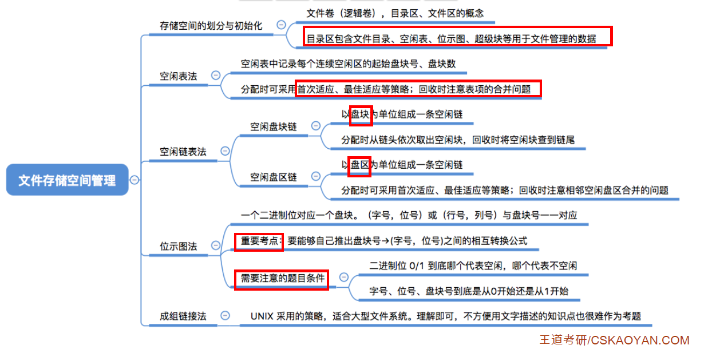

# 1、文件管理

## 1.1、文件的属性

一个文件有哪些属性？

- **文件名**：由创建文件的用户决定文件名，主要是为了方便用户找到文件，**同一目录下不允许有重名文件**。标识符：一个系统内的各文件标识符唯一，对用户来说毫无可读性，因此标识符只是操作系统用于区分各个文件的一种内部名称。(因为文件名显然没法区分文件，所以操作系统给每个文件都设置一个标识符，就像身份证一样)
- **类型**：指明文件的类型
- **位置**：文件存放的路径（让用户使用）、在外存中的地址（操作系统使用，对用户不可见）
- **大小**：指明文件大小
- 创建时间、上次修改时间、文件所有者信息
- 保护信息：对文件进行保护的访问控制信息

## 1.2、文件内部数据应该怎样组织

- 无结构文件（如文本文件）——由一些二进制或字符流组成，又称**流式文件**
- 有结构文件（如数据库表）——由一组相似的记录组成，又称**记录式文件**
  - 例如数据库表的一行就是一条记录，记录是一组相关数据项的集合
    - 比如说学号是一个数据项、姓名是一个数据项
  - 所以说**数据项是文件系统中最基本的单位**

文件分为无结构文件和有结构文件，无结构文件由一系列二进制或字符流组成，有结构文件是由一条条记录组成，每个记录又是由一个个数据项组成。这些记录如何组织是探讨的问题。

## 1.3、文件之间应该怎样组织

## 1.4、操作系统向上层提供什么功能

## 1.5、文件如何放在外存

文件是放在外存(硬盘)当中的：

- 与内存一样，外存也是由一个个存储单元组成，每个存储单元可以存储一定量的数据(如1B)。每个存储单元对应一个物理地址

- 类似于内存分为一个个内存块，外存会分为一个个**块/磁盘块/物理块**。每个磁盘块的大小是相等的，每块一般包含2的整数幂个地址(如本例中，一块包含2^10^个地址，即1KB）。同样类似的是，文件的逻辑地址也可以分为(逻辑块号，块内地址)，操作系统同样需要将逻辑地址转换为外存的物理地址(物理块号，块内地址)的形式。块内地址的位数取决于磁盘块的大小，例如图中每块有2^10^个地址，需要10位二进制表示，所以块内地址的位数是10位
- 操作系统以块为单位为文件分配存储空间，因此即使一个文件大小只有10B，但它依然需要占用1KB的磁盘块。外存中的数据读入内存时同样以块为单位

## 1.6、小结

# 2、文件的逻辑结构

## 2.1、有结构文件

**无结构文件**：文件内部的数据就是一系列二进制流或字符流组成。又称**流式文件**。如：Windows操作系统中的.txt文件。
**有结构文件**：由一组相似的记录组成，又称**记录式文件**。每条记录又若干个数据项组成。如：数据库表文件。一般来说，每条记录有一个数据项可作为关键字(作为识别不同记录的ID)，一般学号就可以作为各个记录的关键字，有点像数据库表的主键。根据各条记录的长度(占用的存储空间)是否相等，又可分为**定长记录**和**可变长记录**两种。

根据有结构文件中的各条记录在逻辑上如何组织，可以分为三类：

1. 顺序文件
2. 索引文件
3. 索引顺序文件

### 2.1.1、顺序文件

**顺序文件**：文件中的记录一个接一个地顺序排列(逻辑上)，记录可以是**定长**的或**可变长**的。各个记录在物理上可以**顺序存储**或**链式存储**。

- 各个记录在物理上是**顺序存储**，也就是逻辑上相邻的记录在物理上也相邻
- 各个记录在物理上是**链式存储**，也就是逻辑上相邻的记录在物理上不一定相邻

根据各个记录是否按照关键字排列，可以把顺序文件分为**串结构**和**顺序结构**

- 串结构：记录之间的顺序与关键字无关，通常是按照记录存入的时间决定记录的顺序
- 顺序结构：记录之间的顺序按照**关键字**顺序排列

假设我们已经知道了文件的起始地址(也就是第一个记录存放的位置)

1. 我们是否能快速找到第 i 个记录对应的地址？(即能否实现随机存取)
2. 我们能否快速找到某个关键字对应的记录存放的位置？

- 若顺序文件采用链式存储，无论是定长还是可变长记录，都无法实现随机存取，每次只能从第一个记录开始依次向后查找。**因为并不能直接计算出某一个记录的物理地址**。

- 若顺序文件采用**顺序存储**
  - 对于可变长记录，无法实现随机存取
  - 对于定长记录，可以实现随机存取，记录长度为L，则第 i 个记录存放的相对位置是 i × L
    - 若采用串结构，也就是记录之间的顺序和关键字无关，则无法快速找到某关键字对应的记录
    - 若采用顺序结构，也就是记录之间的顺序按照关键字顺序排列，则可以快速找到某关键字对应的记录

如上图，对于可变长记录，由于每个记录内容不一样，我们需要显式的给出记录长度，假设用1B表示记录长度。第零条记录的逻辑地址是0，第一条记录的逻辑地址是记录的长度L0+记录长度字段1 = L0+1。L0、L1、L2长度不一样，并不会呈现出规律性，因此若我们想找到某一条记录，只能从第一条记录开始依次向后寻找。

如上图，对于定长记录，记录的长度为L，i号记录的逻辑地址 = i × L，可以实现随机存取。结论：**对于定长记录的顺序文件，若物理上采用顺序存储，则可实现随机存取。**

注：一般来说，考试题目中所说的**顺序文件**指的是**物理上顺序存储的顺序文件**。之后的讲解中提到的顺序文件也默认如此。顺序表增加/删除结点比较困难，可见，顺序文件的**缺点**是**增加/删除一个记录比较困难**(如果是串结构则相对简单，因为不需要保证各个关键字按照记录顺序排列，所以串结构的顺序文件增加/删除记录较简单)

### 2.1.2、索引文件

对于可变长记录文件，要找到第i个记录，必须先顺序第查找前i-1个记录，能不能解决这种查找速度慢的问题呢？如何让可变长记录文件也实现随机访问的功能呢？

每个文件会建立一张索引表，每个索引表的一条表项会对应文件的一条记录。**文件的各个记录可以在物理上离散地存放，但是索引表的各个表项需要在物理上连续地存放**。每个索引表的表项大小都是相等的，因此我们可以说**索引表**本身是**定长记录的顺序文件(支持随机访问)**，因此可以快速找到第i个记录对应的索引项。

我们可将关键字作为索引号内容，若按关键字顺序排列，则还可以支持按照关键字折半查找。每当要增加/删除一个记录时，需要对索引表进行修改。由于索引文件有很快的检索速度，因此**主要用于对信息处理的及时性要求比较高的场合。**

另外，可以用不同的数据项建立多个索引表。如：学生信息表中，可用关键字学号建立一张索引表。也可用姓名建立一张索引表。这样就可以根据姓名快速地检索文件了。(其实就是Mysql的索引)

### 2.1.3、索引顺序文件

思考：**索引文件的缺点**：每个记录对应一个索引表项，因此索引表可能会很大。比如：文件的每个记录平均只占8B，而每个索引表项占32B，那么索引表都要比文件内容本身大4倍，这样对存储空间的利用率就太低了。

索引顺序文件是索引文件和顺序文件思想的结合。索引顺序文件中，同样会为文件建立一张索引表，但不同的是：并不是每个记录对应一个索引表项，而是**一组记录对应一个索引表项**。

如上图，给所有记录进行分组，每一组对应一个索引表项，对学生姓氏进行分组，每个分组对应一个索引顺序文件的索引项，每个索引项记录了分组的名字和分组的位置，**索引顺序文件的索引项也不需要按关键字顺序排列，这样可以极大地方便新表项的插入**

索引顺序文件的索引表其实是一个**定长记录的串结构的顺序文件**，一个分组就是一个顺序文件，采用这种策略，索引表的表项就少了很多。

### 2.1.4、多级索引顺序文件

## 2.2、小结

# 3、文件目录

## 3.1、文件控制块FCB

如上图，打开根目录D盘，里面的每一个文件夹和文件其实对应目录表中的一条目录项(记录)，**目录本身就是一种有结构文件**，由一条条记录组成，每条记录对应在该目录下的文件。

当我们点击照片文件夹，操作系统会在目录表中找到关键字为照片对应的记录，然后从外存中将照片目录的信息读入内存，于是照片的内容就可以显示出来了。

同样，打开照片文件夹，里面的一个文件夹又会对应目录表的一个目录项(记录)，目录表中的一个目录项(记录)就是一个**文件控制块(FCB)**。

- FCB的有序集合称为**文件目录**，一个FCB就是一个文件**目录项**。
- FCB中包含了文件的基本信息（文件名、物理地址、逻辑结构、物理结构等），存取控制信息（是否可读/可写、禁止访问的用户名单等），使用信息（如文件的建立时间、修改时间等）。
- **最重要，最基本的**还是**文件名、文件存放的物理地址**。因为FCB要建立起文件名和文件实际存放的物理地址之间的映射关系。

> FCB实现了文件名和文件之间的映射。使用户（用户程序）可以实现按名存取

那么我们需要对目录进行哪些操作？

- 搜索：当用户要使用一个文件时，系统要根据文件名搜索目录，找到该文件对应的目录项

- 创建文件：创建一个新文件时，需要在其所属的目录中增加一个目录项

- 删除文件：当删除一个文件时，需要在目录中删除相应的目录项

- 显示目录：用户可以请求显示目录的内容，如显示该目录中的所有文件及相应属性

- 修改目录：某些文件属性保存在目录中，因此这些属性变化时需要修改相应的目录项（如：文件重命名，我们就需要将文件目录项的文件名字段信息进行修改）

## 3.2、目录结构(22大纲已删)

### 3.2.1、单级目录结构

早期操作系统并不支持多级目录，**整个系统中只建立一张目录表**，每个文件占一个目录项。(可以理解为只有一个文件夹)

- 单级目录实现了按名存取，但是**不允许文件重名**。
- 在创建一个文件时，需要先检查目录表中有没有重名文件，确定不重名后才能允许建立文件，并将新文件对应的目录项插入目录表中。
- 显然，单级目录结构不适用于多用户操作系统

### 3.2.2、两级目录结构

早期的多用户操作系统，采用两级目录结构。分为主文件目录(MFD，Master File Directory)和用户文件目录(UFD，User Flie Directory)

- 主文件目录记录用户名及用户文件目录存放位置
- 用户文件目录由该用户的文件FCB组成
- **允许不用户的文件重名**。文件名虽然相同，但是对应的文件不同。
- 两级目录结构允许不同用户的文件重名，也可以在目录上实现实现访问限制(检查此时登录的用户名是否匹配，若User1想访问User2的文件目录则拒绝)。但是两级目录结构依然缺乏灵活性，用户不能对自己的文件进行分类

### 3.2.3、多级目录结构(树形目录结构)【22大纲没删】

多级目录结构：每个目录下面可以有更低一级的目录，同时在各个目录下面也可以有更低一级的目录和文件。**不同目录下的文件可以重名**。

- 绝对路径：**从根目录出发的路径称为绝对路径**
  - 例如一个绝对路径为： `D:/照片/2015-08/自拍.jpg`
  - 系统根据绝对路径一层一层地找到下一级目录。刚开始从**外存读入根目录的目录表**，再从根目录表中找到`照片`目录的存放位置，**再从外存读入对应目录表**，再找到 `2015-08` 目录的存放位置，**再从外存读入对应目录表**，最后找到 `自拍.jpg`的存放位置。==整个过程需要3次读磁盘I/O操作。==
  - 很多时候，用户会连续访问同一目录内的多个文件，每次都从根目录开始查找，是很低效的。因此可以设置一个"当前目录"。
- 相对路径：**从当前目录出发的路径**
  - 引入相对路径后，磁盘I/O的次数减少了，这就提升了访问文件的效率

树形目录结构可以很方便地对文件进行分类，层次结构清晰，也能够更有效地进行文件的管理和保护。但是，树形结构==不便于实现文件的共享==。为此，提出了**无环图目录结构**。

### 3.2.4、无环图目录结构

无环图目录结构：在树形目录结构的基础上，增加一些指向同一节点的有向边，使整个目录成为一个有向无环图。可以更方便地实现多个用户间的文件共享。

- **可以用不同的文件名指向同一个文件**，甚至可以指向同一个目录（共享同一目录下的所有内容）。
  - User1用户可以用demo这个文件名找到这个文件，User2用户可以用Mydemo这个文件名找到这个文件。所以这个文件是被这两个用户所共享的

- 并且需要**为每个共享结点设置一个共享计数器**，用于记录此时有多少个地方在共享该结点。用户提出删除结点的请求时，只是删除该用户的FCB、并使**共享计数器减1**，并不会直接删除共享结点，**只有共享计数器减为0时，才删除结点**。(说明没有用户使用这个文件)
- **注意**：共享文件不同于复制文件。在共享文件中，**由于各用户指向的是同一个文件，因此只要其中一个用户修改了文件数据，那么所有用户都可以看到文件数据的变化。**

### 3.2.5、索引结点(FCB的改进)

由一系列文件控制块FCB组成一个文件目录表，我们在查找各级目录的过程中，只需要用到**文件名**这个信息，只有文件名匹配时，才需要读出文件的其他信息(类型、物理位置等等信息)。因此可以考虑让目录表"瘦身""来提升效率。我们可以将除了文件名之外的文件描述信息都放到 **索引结点**当中

- 当找到文件名对应的目录项时，才需要将索引结点调入内存，索引结点中记录了文件的各种信息，包括文件在外存中的存放位置，根据"存放位置即可找到文件。
- 存放在外存中的索引结点称为**磁盘索引结点**，当索引结点放入内存后称为**内存索引结点**。
- 相比之下**内存索引结点中需要增加一些信息**，比如：文件是否被修改、此时有几个进程正在访问该文件等

- **索引结点的作用**：大大提升文件检索速度

### 3.2.6、小结

# 4、文件保护

## 4.1、口令保护

为文件设置一个**口令**(如：qxl666nb)，用户请求访问该文件时必须提供**口令**。口令一般存放在文件对应的FCB或索引结点中。用户访问文件前需要先输入口令，操作系统会将用户提供的口令与FCB中存储的口令进行对比，如果正确，则允许该用户访问文件

- 优点：保存口令的空间开销不多，验证口令的时间开销也很小。
- 缺点：正确的口令存放在系统内部，不够安全。(如果有大佬进入系统内部就知道你的口令就可以访问你的文件咯)

## 4.2、加密保护

使用某个密码对文件进行加密，在访问文件时需要提供正确的“密码”才能对文件进行正确的解密。

- 优点：保密性强，不需要在系统中存储密码
- 缺点：编码/译码，或者说加密/解密要花费一定时间

## 4.3、访问控制

在每个文件的FCB（或索引结点）中增加一个访问控制列表（Access-Control List, ACL），该表中记录了各个用户可以对该文件执行哪些操作。

**精简的访问列表**：以"组"为单位，标记各"组"用户可以对文件执行哪些操作。

如：分为系统管理员、文件主、文件主的伙伴、其他用户几个分组。当某用户想要访问文件时，系统会检查该用户所属的分组是否有相应的访问权限

## 4.4、小结

# 5、文件共享

注意：多个用户共享同一个文件，意味着系统中只有**一份**文件数据。并且只要某个用户修改了该文件的数据，其他用户也可以看到文件数据的变化。如果是多个用户都**复制**了同一个文件，那么系统中会有**好几份**文件数据。其中一个用户修改了自己的那份文件数据，对其他用户的文件数据并没有影响。

## 5.1、基于索引结点的共享方式(硬链接)

索引结点，是一种文件目录瘦身策略。由于检索文件时只需用到文件名，因此可以将除了文件名之外的其他信息放到索引结点中。这样目录项就只需要包含文件名、索引结点指针。

例如User1用户创建一个新文件`aaa`，这个文件会对应一个索引结点，索引结点当中包含文件的物理地址、类型等信息。同时索引结点中还会设置一个链接计数变量`count`，用于表示链接到本索引结点上的用户目录项数。假设User2用户想共享的使用文件，这个用户的目录表当中也会有一个目录项是指向索引结点的。由于此时有两个索引项指向索引结点，所以 `count=2` 。

若count = 2，说明此时有两个用户目录项链接到该索引结点上，或者说是有两个用户在共享此文件。

- 若某个用户决定删除该文件，则只是要把用户目录中与该文件对应的目录项删除，且索引结点的count值减1。
- 若count>0，说明还有别的用户要使用该文件，暂时不能把文件数据删除，否则会导致指针悬空。
- 当count = 0时系统负责删除文件。

## 5.2、基于符号链的共享方式(软链接)

User1和User2在使用硬链接的方式共享的使用文件1，User3用户想要使用软链接的方式来共享文件1，那么User3会建立一个新的文件，这个文件是Link类型的文件，记录了文件1的存放路径`C:/User/aaa`(类似于Windows系统中的快捷方式)。当User3访问ccc时，操作系统判断文件ccc属于Link类型文件，于是会根据其中记录的路径层层查找目录，最终找到User1的目录表中的aaa表项，于是就找到了文件1的索引结点。

当User1用户和User2用户都删除了文件1时，User3用户的软链接就失效了。

## 5.3、小结

# 6、文件实现🔥

## 6.1、文件的物理结构(文件分配方式)

### 6.1.1、连续分配

#### 1、预备知识

类似于内存分页，磁盘中的存储单元也会被分为一个个"块/磁盘块/物理块"。**很多操作系统中，磁盘块的大小与内存块、页面的大小相同**，因为内存与磁盘之间的数据交换(即读/写操作、磁盘I/O)都是以**块**为单位进行的。即每次读入一块，或每次写出一块。

如上图，磁盘块的大小是1KB，则1MB的文件可以被分为1K个块，所以逻辑块号是从0-1023，每一块的大小就是1KB。因此用户在操作文件的时候就可以用 **(逻辑块号，块内地址)** 这样的方式来定位文件位置。

操作系统为文件分配存储空间都是以块为单位的，例如逻辑块号为0的块被放在物理位置为4的位置，用户在操作文件的时候是使用 **(逻辑块号，块内地址)** 这样的形式，操作系统要负责实现将到 **(逻辑块号，块内地址)** 转换为**(物理块号，块内地址)** 

如何把逻辑块号映射为物理块号，这是我们的重点！

#### 2、连续分配

**连续分配方式**要求每**个文件在磁盘上占有一组连续的块**。例如如下文件`aaa`，在逻辑上分为3个块，采用连续分配方式**这三个逻辑块也要分配到物理上相邻的块**。

- 采用连续分配方式：
  -  **(逻辑块号，块内地址)** -> **(物理块号，块内地址)** ，==只需要转换块号即可，块内地址保持不变==。
  - 为了实现这样的转变，在文件目录表中，必须记录文件的两个属性(也就是这个文件总共占用多少个块)
    1. 文件的起始块号
    2. 文件的长度
  - 例如上述文件`aaa`起始块号是4，并且连续占用3个块，因此文件长度是3，而文件`bbb`起始块号是10，文件长度是4

用户给出要访问的逻辑块号，操作系统找到该文件对应的目录项(FCB)，在FCB当中可以读出**起始块号**，用起始块号加上用户提供的逻辑块号就是实际的物理块号，==物理块号=起始块号+逻辑块号==，例如用户想要访问文件`aaa`逻辑块号为2的这个块，逻辑块号2+起始块号4=物理块号6。当然，还需要检查用户提供的逻辑块号是否合法（逻辑块号≥ 长度就不合法）。

#### 3、连续分配优点

如下图，我们访问三个黄色的磁盘块，需要先将磁头指向第一个磁盘块，之后移动到第二个块，之后移动到第三个块，因为这三个块相距是最短的，所以移动磁头所需的时间也是最短的。

> 采用连续分配方式，只要用户给出了想要访问的逻辑地址，操作系统可以直接算出逻辑块号对应的物理块号，因此==连续分配支持顺序访问和直接访问（即随机访问）==
>
> - 顺序访问：如果要访问逻辑块号2，必须先访问逻辑块号0、1，之后才能访问逻辑块号2
> - 直接访问：如果要访问逻辑块号2，不需要访问其他块，可以直接找到逻辑块号2存放的实际物理位置。
>
> ==连续分配的文件在顺序读/写时速度最快==。

#### 4、连续分配缺点

若此时文件A要拓展，需要再增加一个磁盘块(总共需要连续的4个磁盘块)。由于采用连续结构，因此文件A占用的磁盘块必须是连续的。因此只能将文件A全部迁移到绿色区域。**结论：物理上采用连续分配的文件不方便拓展。**

**结论**：物理上采用**连续分配**，**存储空间利用率低**，**会产生难以利用的磁盘碎片**。可以用紧凑来处理碎片，但是需要耗费很大的时间代价。

#### 5、总结

- 优点：**支持顺序访问和直接访问（即随机访问）；连续分配的文件在顺序访问时速度最快**
- 缺点：**不方便文件拓展；存储空间利用率低，会产生磁盘碎片**

### 6.1.2、链接分配

链接分配采取离散分配的方式，可以为文件分配离散的磁盘块。分为隐式链接和显式链接两种。就是用指针链接的方式将离散的磁盘块链接起来。

#### 1、隐式链接

隐式链接——除文件的最后一个盘块之外，每个盘块中都存有指向下一个盘块的指针。文件目录包括文件第一块的指针和最后一块的指针。

在文件的目录项需要记录文件的起始块号、结束块号，各个磁盘块中都会存储指向下一个磁盘块的指针，当然最后一个磁盘块是没有指向下一块的指针的。

用户给出要访问的逻辑块号 i ，操作系统根据文件名找到该文件对应的目录项(FCB)，从目录项中找到起始块号(即0号块)，将0号逻辑块读入内存，由此根据0号逻辑块指向下一块的指针知道1号逻辑块存放的物理块号，于是读入1号逻辑块，再找到2号逻辑块的存放位置……以此类推。

- 因此，**读入i号逻辑块，总共需要i+1次磁盘I/O。**

缺点：

- 采用**链式分配（隐式链接）**方式的文件，只支持**顺序访问**，**不支持随机访问**(也就是要访问i号块，必须要先访问i-1号块才可以)，查找效率低。另外，指向下一个盘块的指针也需要耗费少量的存储空间。

优点：

- 采用**隐式链接的链接分配方式，很方便文件拓展**。要想扩展只需要找一个空闲块，将其挂在磁盘块链尾，然后修改文件的FCB中的结束块号
- 另外，所有的空闲磁盘块都可以被利用，**不会有碎片问题，外存利用率高**。

#### 2、显式链接

把用于链接文件各物理块的**指针**显式地存放在一张表中。即**文件分配表**（FAT，File Allocation Table）

磁盘当中各个块的先后顺序都是统一记录在文件分配表FAT当中，所以磁盘中有多少块，FAT中就有多少表项。

假设某个新创建的文件`aaa`依次存放在磁盘块2、5 、0 、1这四个物理块，在aaa文件的目录项当中只需记录文件的起始块号，起始块号是2号块。同时在FAT表中会显式的记录这四个物理块的链接关系，2号块的下一块是5号块，所以FAT中物理块号为2的下一块记录为5。而最后一个物理块1号块没有下一块，所以用-1表示。

假设某个新创建的文件`bbb`依次存放在磁盘块4、23、3这三个物理块，同理。

**注意**：一个磁盘仅设置一张FAT。开机时，将FAT读入内存，并常驻内存。FAT的各个表项在物理上连续存储，且每一个表项长度相同，因此**物理块号字段**可以是隐含的。

---

用户给出要访问的逻辑块号i，操作系统找到该文件对应的目录项(FCB)，从目录项中找到起始块号，若i>0，则查询内存中的文件分配表FAT，往后找到i号逻辑块对应的物理块号。**逻辑块号转换成物理块号的过程不需要读磁盘操作。**

- 若用户想要访问文件`aaa`的2号逻辑块，那么操作系统首先找到`aaa`的起始物理块号是2，从FAT表中可以发现2号物理块的下一个物理块是5号物理块，再查5号物理块的表项发现下一个物理块是0号物理块，则0号物理块就是文件`aaa`的2号逻辑块。

结论：**采用链式分配（显式链接）**方式的文件，支持顺序访问，也支持**随机访问**（想访问i号逻辑块时，并不需要依次访问之前的0 ~ i-1号逻辑块），由于块号转换的过程不需要访问磁盘，因此相比于隐式链接来说，访问速度快很多。显然，显式链接**也不会产生外部碎片，也可以很方便地对文件进行拓展**。

 

### 6.1.3、小结

隐式链接——除文件的最后一个盘块之外，每个盘块中都存有指向下一个盘块的指针。文件目录包括文件第一块的指针和最后一块的指针。

- 优点：很方便文件拓展，不会有碎片问题，外存利用率高。
- 缺点：只支持顺序访问，不支持随机访问，查找效率低，指向下一个盘块的指针也需要耗费少量
  的存储空间。

显式链接——把用于链接文件各物理块的指针显式地存放在一张表中，即文件分配表（FAT，FileAllocation Table）。一个磁盘只会建立一张文件分配表。开机时文件分配表放入内存，并常驻内存。

- 优点：很方便文件拓展，不会有碎片问题，外存利用率高，并且**支持随机访问**。相比于隐式链接来说，**地址转换时不需要访问磁盘，因此文件的访问效率更高。**
- 缺点：文件分配表的需要占用一定的存储空间。

> 考试题目中遇到未指明隐式/显式的链接分配，**默认**指的是**隐式链接**的链接分配

### 6.1.4、索引分配

**索引分配**允许文件离散地分配在各个磁盘块中，系统会**为每个文件建立一张索引表**，索引表中**记录了文件的各个逻辑块对应的物理块**。索引表存放的磁盘块称为**索引块**。文件数据存放的磁盘块称为**数据块**。

假设新创建文件`aaa`，依次存放在磁盘块2、5、13、9中，系统会为`aaa`文件建立一张索引表，索引表记录了逻辑块和物理块之间的映射关系，若`aaa`文件的索引表是存放在7号磁盘块中，那么7号磁盘块称为 **索引块**，磁盘块2、5、13、9称为`aaa`文件的数据块。

采用索引分配方式的文件需要在自己的目录下记录自己的索引块，索引块当中存放的是索引表，因此系统可以根据索引块的块号找到索引表，接下来就可以找到这些逻辑块对应的物理块号了。如上图，`aaa`文件的索引块存在7号磁盘块，`aaa`文件的数据是存放在 2、5、13、9号磁盘中。

- 采用索引分配，每一个文件都会有自己的一张索引表，在之前的显式链接的的链式分配当中，文件分配表FAT是一个磁盘对应一张FAT表。
- 我们可以用固定的长度表示物理块号（如：假设磁盘总容量为1TB=240B，磁盘块大小为1KB，那么这么大的磁盘就可以分为2^30^个磁盘块，要表示2^30^个磁盘块号，需要用30个二进制位即可表示，则可用4B表示磁盘块号），因此，索引表中的**逻辑块号**可以是**隐含**的。也就是索引表的表项每一行占4B，我们只要知道这个索引表的起始位置，那么我们就可以直接根据逻辑块号直接计算出某一个逻辑块号对应的表项。

采用索引分配如何实现逻辑块号到物理块号的转换呢？

- 用户给出要访问的逻辑块号i，操作系统找到该文件对应的目录项(FCB)，从目录项中可知索引块的块号，再从索引块当中读出文件的索引表，并查找索引表即可知道i号逻辑块对应的物理块号。
- 可见，==索引分配方式可以支持随机访问==(我们要访问i号块，不需要访问前面的i-1号块，可以直接倒找i号块存放的物理位置)。
- ==文件拓展也很容易实现==(只需要给文件分配一个空闲块，并增加一个索引表项即可)，但是索引表需要占用一定的存储空间

#### 1、链接方案

若每个磁盘块1KB，一个索引表项4B，则一个磁盘块只能存放256个索引项。如果一个文件的大小超过了256块，那么一个磁盘块是装不下文件的整张索引表的，如何解决这个问题？

1. 链接方案
2. 多层索引
3. 混合索引

**链接方案**：如果索引表太大，一个索引块装不下，可以将索引表拆分，为这个文件分配多个索引块。

假设磁盘块大小为1KB，一个索引表项占4B，则一个磁盘块只能存放256个索引项。若一个文件大小为256 * 256KB =65,536 KB = 64MB。该文件共有256 * 256个块，也就对应256*256个索引项，也就需要256个
索引块来存储，这些索引块用链接方案连起来。

- 若想要访问文件的最后一个逻辑块，就必须找到最后一个索引块（第256个索引块），而各个索引块之间是用
  指针链接起来的，因此必须先顺序地读入前255个索引块。

#### 2、多层索引

**多层索引**：建立多层索引（原理类似于多级页表）。使第一层索引块指向第二层的索引块。第二层的索引块再指向文件块。

假设磁盘块大小为1KB，一个索引表项占4B，则一个磁盘块只能存放256个索引项。若某文件采用**两层索引**，则该文件的最大长度可以到256 * 256 * 1KB = 65,536 KB = 64MB。第一层的索引块共有256个索引项，第二层的索引块每一块也有256个索引项，每一个索引项指向某一个数据块。在文件的目录表只需要记录顶级索引表存放的索引块号。

- 若采用多层索引，则==各层索引表大小不能超过一个磁盘块==
  - 可根据逻辑块号算出应该查找索引表中的哪个表项。假设用户要访问1026号逻辑块，1026/256=4，也就是说1026号逻辑块对应的索引项应该是在4号二级索引表当中存放，而4号二级索引表的位置只需要从一级索引表中找到4号索引项对应的物理块号。
  - 在读入了4号索引表之后，1026%256=2，说明应该查询4号二级索引表当中的二号表项，找到二号表项就可以找到1026号逻辑块对应的物理块。
  - 因此可以先将一级索引表调入内存，查询4号表项，将其对应的二级索引表调入内存，再查询二级索引表
    的2号表项即可知道1026号逻辑块存放的磁盘块号了。**访问目标数据块，需要3次磁盘I/O**。第一次读入一级索引表，第二次读入二级索引表，第三次读入数据块。==采用K层索引结构，且顶级索引表未调入内存，则访问一个数据块只需要K+1次读磁盘操作==
  - 若采用 **三层索引**，则**文件的最大长度**为 256×256×256×1KB=16GB，类似的，访问目标数据块，需要4次磁盘I/O。

缺点：假如一个文件很小，只有1KB，仍采用两层索引结构，读入文件1KB的内容，依然需要三次读磁盘操作。

> 1. 需要会计算文件的最大长度
> 2. 需要会分析访问目标数据块需要多少次读磁盘操作

#### 3、混合索引🔥

**混合索引**：多种索引分配方式的结合。例如，一个文件的顶级索引表中，既包含直接地址索引(直接
指向数据块)，又包含一级间接索引(指向单层索引表)、还包含两级间接索引(指向两层索引表)。

- 8个直接地址索引，这些索引项直接指向8个数据块，
- 一级间接索引，指向单层索引表，单层索引表的各个索引项又分别指向一个数据块，每个数据块是1KB
  - 一个一级间接索引指向一个单层的索引表，而每个索引表最多只会有256个表项，因此这个表项最多只会对应256个数据块
- 二级间接索引，指向两层索引表，一层索引表的各个表项又会指向二层索引表，二层索引表的各个表项又分别指向一个个数据块
  - 一个二级间接索引最多会对应256×256=65536个数据块

因此，如果一个文件的混合索引的顶级索引如上所示，那么这个文件的最大长度为 8+256+65536 这么多块，也就是65800KB

---

若**顶级索引表还未读入内存**：

1. 访问0~7号逻辑块，需要两次读磁盘
   1. 读入顶级索引表
   2. 根据顶级索引表当中的直接地址找到目标数据块存放位置，然后把目标数据块读入内存

2. 访问8~263号逻辑块，需要三次读磁盘
   1. 读入顶级索引表
   2. 根据一级间接索引找到一级索引表，将一级索引表读入内存
   3. 根据一级索引表当中的直接地址找到目标数据块存放位置，然后把目标数据块读入内存
3. 访问264~65799号逻辑块，需要四次读磁盘

**优点**：对于小文件，只需要较少读磁盘次数就可以访问目标数据块。

### 6.1.5、小结

1. **链接方案**：如果索引表太大，一个索引块装不下，那么可以将多个索引块链接起来存放。
   - **缺点**：若文件很大，索引表很长，就需要将很多个索引块链接起来。想要找到i号索引块，必须先依次读入0~i-1号索引块，这就导致磁盘I/O次数过多，查找效率低下。
2. **多层索引**：建立多层索引（原理类似于多级页表）。使第一层索引块指向第二层的索引块。还可根据
   文件大小的要求再建立第三层、第四层索引块。采用K层索引结构，且**顶级索引表未调入内存**，则访问
   一个数据块只需要K + 1次读磁盘操作。
   - **缺点**：即使是小文件，访问一个数据块依然需要K+1次读磁盘。
3. **混合索引**：多种索引分配方式的结合。例如，一个文件的顶级索引表中，既包含直接地址索引（直接指向数据块），又包含一级间接索引（指向单层索引表）、还包含两级间接索引（指向两层索引表）。
   - **优点**：对于小文件来说，访问一个数据块所需的读磁盘次数更少。

**超级超级超级重要考点**：

1. 要会根据多层索引、混合索引的结构计算出文件的最大长度（Key：各级索引表最大不能超过一个块）；
2. 要能自己分析访问某个数据块所需要的读磁盘次数（Key：FCB中会存有指向顶级索引块的指针，因此可以根据FCB读入顶级索引块。每次读入下一级的索引块都需要一次读磁盘操作。另外，要**注意题目条件——顶级索引块是否已调入内存**）

# 7、逻辑结构和物理结构

# 8、文件存储空间管理

操作系统需要对非空闲磁盘块(存放了文件数据的磁盘块)进行管理，也需要对空闲磁盘块进行管理，上面我们记录了对非空闲磁盘块的管理，主要使用连续分配、链接分配，索引分配。而接下来我们记录对空闲磁盘块的管理。

## 8.1、存储空间的划分与初始化

安装windows操作系统的时候，一个必要的步骤是为磁盘进行分区。也就是存储空间的划分，将物理磁盘划分为一个一个的**文件卷(逻辑卷、逻辑盘)**，就是我们的C盘D盘和E盘。如下图：

存储空间的初始化：将各个文件卷划分为目录区和文件区，文件区用于存放文件数据，目录区主要存放文件的目录信息（FCB）、用于磁盘存储空间管理的信息。

有的系统支持超大型文件，可支持由多个物理磁盘组成一个文件卷

## 8.2、存储空间管理

### 8.2.1、空闲表法

空闲表法：适用于"连续分配方式"

如上图绿色为空闲块，橙色为非空闲块。则这个系统对应的空闲表如右图。采用这种方式如何分配磁盘块：与内存管理中的动态分区分配很类似，为一个文件**分配连续的存储空间**，同样可采用**首次适应，最佳适应，最坏适应等算法**来决定要为文件分配哪个区间。

例如新创建了一个文件需要请求3个块，我们采用首次适应算法，系统会依次查找空闲表的各个表项，找到第1个能够满足3个空闲快的表项，空闲盘块号为10的显然能够满足。 我们将文件放入，然后**修改空闲表**如下图

我们如何回收磁盘块呢？与内存管理中的动态分区分配很类似，当回收某个存储区时需要有4种情况：

1. 回收区的前后都没有相邻空闲块
2. 回收区的前后都是空闲区
3. 回收区前面是空闲区
4. 回收区后面是空闲区

总之，**回收时需要注意表项的合并问题**。假设此时删除了某个文件，系统回收了它占用的15、16、17号块，在回收的时候发现这个文件的前后都有空闲块，因此我们需要将这一整片的空闲块合并。

### 8.2.2、空闲链表法

空闲链表法又可以分为

- **空闲盘块链**：以盘块为单位组成一条空闲链
  - 每一个空闲盘块中存储着下一个空闲盘块的指针
- **空闲盘区链**：以盘区为单位组成一条空闲链
  - 盘区就是连续的空闲盘块，空前盘区中的第一个盘块，会记录盘区的长度、下一个盘区的指针。如上图12、13、14这几个空闲盘块是连续的，所以他们组成一个空闲盘区，盘块号为12记录了盘区长度和下一个盘区的指针

---

空闲盘块链：

若采用空闲盘块链，操作系统会保存**链头、链尾指针**，如上图链头为20，链尾为0。若某个文件需要申请K个空闲块，则从链头开始依次摘下K个盘块分配，并修改空闲链的链头指针。

若需要回收磁盘块，则将回收的盘块依次挂到链尾，并修改空闲链的链的链尾指针。**空闲链表法适用于离散分配的物理结构，为文件分配多个盘块时，可能要重复多次操作**

---

若采用空闲链表法，操作系统也要保存链头、链尾指针，如上图链头为0，链尾为7。若某个文件申请K个空闲盘块，则可以采用首次适应、最佳适应等算法，从链头开始检索，按照算法规则，找到一个大小符合要求的空闲盘区分配给文件。如果没有合适的连续空闲块，也可以将不同盘区的盘块同时分配给一个文件，注意分配后，可能要修改相应的链指针，盘区大小等数据。

若我们要回收磁盘块，若回收区和某个空闲盘区相邻，则需要将回收区合并到空前盘区中，若回收区没有和任何空闲区相邻，将回收区作为单独的一个空闲盘区挂到链尾。**空闲盘区链对于离散分配，连续分配都适用，并且空闲盘区链为一个文件分配多个盘块时效率更高**

### 8.2.3、位示图法

位示图法：每个二进制位对应一个盘块，在本例中，"0"代表盘块空闲，"1"代表盘块已分配。位示图一般用连续的"字"来表示，如本例中一个字的字长是16位（一行为16位），字中的每一位对应一个盘块。因此可以用(**字号,位号**)对应一个**盘块号**，当然有的题目中也描述为(**行号,列号**)

重要考点🔥：如何从(**字号,位号**)推出**盘块号**，如何从**盘块号**推出(**字号,位号**)

> 在做上述题的时候，我们要注意题目的条件，盘块号、字号、位号到底是从0开始还是从1开始
>
> - 如本例中的盘块号、字号、位号都是从0开始，若n表示字长，则
>   - ==(字号i，位号j)=(i，j)的二进制位对应的盘块号 b = ni + j==
>   - ==盘块号b对应的字号i=b/n，位号j=b%n==
> - 例如字号为0，位号为1所对应的盘块号是1号块：(0，1) -> b = 16×0+1 = 1
> - 例如字号为1，位号为10所对应的盘块号是26号块：(1，10) -> b = 16×1+10 = 26
> - 例如盘块号为13，则对应的字号i=13/16=0，对应的位号j=13%16=13

采用位示图法如何进行分配呢？若某个文件需要K个空闲块：

1. 顺序扫描位示图找到K个相邻或不相邻的"0"
2. 根据字号、位号算出对应的盘块号，将相应的盘块分配给文件
3. 将相应二进制位设置为"1"

如何回收磁盘块呢？

1. 根据回收的盘块号计算出对应的字号、位号
2. 将相应二进制位设为"0"

**位示图法对于连续分配，离散分配都适用**

### 8.2.4、成组链接法

空闲表法、空闲链表法不适用于大型文件系统，因为空闲表或空闲链表可能过大。UNIX系统中采用了**成组链接法**对磁盘空闲块进行管理。

文件卷的目录区中专门用一个磁盘块作为“超级块”，当系统启动时需要将超级块读入内存。并且要保证内存与外存中的“超级块”数据一致。

在超级块中存放了下一组空闲盘块的数量，比如说下一组空闲盘块为100块，还需要记录这100个空闲盘块的盘块号。通过这些盘块号就可以找到下一个分组的盘块号。如上图，第一组空闲盘块的块号为201-300。接着在块号为300的磁盘块中又存放下一组空闲盘块的数量和块号。

如何分配磁盘块呢？

假设某个文件需要1个空闲块：

1. 首先检查第1个分组的块数是否足够。1<100，因此是足够的
2. 分配第1个分组中的一个空闲块，并修改相应数据。
   - 也就是将201号盘块分配，并将下一组空闲盘快数100-1=99

假设某个文件需要100个空间块：

1. 检查第1个分组的块数是否足够，100=100是足够的。

2. 分配第1个分组中的100个空闲块。但是由于300号块内存放了再下一组的信息，因此300号块的数据需要复制到超级块中，这样就可以保证虽然这个分组已经全部分配给文件了，但是下一个分组的链接信息依然保存在超级块中

   

如何回收磁盘块呢？

假设每个分组最多为100个空闲块，此时第一个分组已有99个块，还要再回收一块

- 因为此时分组还没有满，所以我们可以再插入一个空闲块，然后将这个空闲块的链接信息放入超级块当中

假设每个分组最多为100个空闲块，此时第一个分组已有100个块，还要再回收一块。

- 此时分组已满，**需要将超级块中的数据复制到新回收的块中，并修改超级块的内容，让新回收的块成为第一个分组。**

### 8.2.5、小结

# 9、文件的基本操作

## 9.1、创建文件

我们右键"新建文件"，图形化交互进程在背后调用了"create系统调用"，进行Create系统调用时，需要提供的几个主要参数：

1. 所需的外存空间大小（如：一个盘块，即1KB）
2. 文件存放路径（“D:/Demo”）
3. 文件名（这个地方默认为“新建文本文档.txt”）

操作系统在处理Create系统调用时，主要做了两件事：

1. 在外存中找到文件所需的空间(结合上小节学习的空闲链表法、位示图、成组链接法等管理
   策略，找到空闲空间）
2. 根据文件存放路径的信息找到该目录对应的目录文件（此处就是D:/Demo目录），在目录中**创建该文件对应的目录项**。目录项中包含了文件名、文件在外存中的存放位置等信息。

## 9.2、删除文件

我们右键"删除文件"，图形化交互进程在背后调用了"delete系统调用"，将文件数据从外存中删除。进行Delete系统调用时，需要提供的几个主要参数：

1. 文件存放路径（“D:/Demo”）
2. 文件名（“test.txt”）

操作系统在处理Delete系统调用时，主要做了几件事：

1. 根据文件存放路径找到相应的目录文件，从目录**中找到文件名对应的目录项**。
2. 根据该目录项记录的文件在外存的存放位置、文件大小等信息，**回收文件占用的磁盘块**。(回收磁盘块时，根据空闲表法、空闲链表法、位图法等管理策略的不同，需要做不同的处理)
3. 从目录表中**删除文件对应的目录项**。

## 9.3、打开文件

在很多操作系统中，在对文件进行操作之前，要求用户先使用open系统调用“打开文件”，需要提供的几个主要参数：

1. 文件存放路径（“D:/Demo”）
2. 文件名（“test.txt”）
3. 要对文件的操作类型（如：r只读；rw读写等）

操作系统在处理open系统调用时，主要做了几件事(如下图)：

1. 根据文件存放路径找到相应的目录文件，从目录中**找到文件名对应的的目录项**，并检查该用户是否有指定的操作权限。
2. **将目录项复制到内存中的“打开文件表”中**。并将对应表目的编号返回给用户。之后**用户使用打开文件表的编号来指明要操作的文件**。
   - 将目录项复制到内存中，之后用户进成A再操作文件，就**不需要每次都重新查目录**，这样可以加快文件的访问速度

注意有两种打开文件表：一种是系统的打开文件表(整个系统只有一张)，这个文件表会记录所有的正在被使用的文件的信息，每个进程会有自己的打开文件表，这张表记录了进程此时打开的文件等信息。在进程的打开文件表中有系统表索引号，如下图进程A和进程B的都打开了text.txt文件，所以进程的打开文件表的系统表索引号都对应了系统的打开文件表的编号K。

> - 系统的打开文件表，有一个字段是打开计数器记录此时有多少个进程打开了此文件
> - 进程的打开文件表有读写指针字段和访问权限字段
>   - 读写指针：读写指针记录了该进程，对文件读写操作进行到的位置
>   - 访问权限：如果打开文件时，上面的是只读则该进程不能对文件进行写操作

## 9.4、关闭文件

进程使用完文件后要关闭文件：操作系统在处理Close的系统调用时，主要做了几件事：

1. 将进程的打开文件表相应的表项删除
2. 回收分配给该文件的内存空间等资源
3. 系统打开表的打开计数器count减1，若count=0，则删除对应的表项

## 9.5、读文件

双击后，“记事本”应用程序通过操作系统提供的“读文件”功能，即**read系统调用**，将文件数据从外存读入内存，并显示在屏幕上）

进程使用read系统调用完成写操作。

- 需要指明是哪个文件（在支持“打开文件”操作的系统中，只需要提供文件在打开文件表中的索引号即可）
- 还需要指明要读入多少数据（如：读入1KB）
- 指明读入的数据要放在内存中的什么位置

操作系统在处理read系统调用时，会从读指针指向的外存中，将用户指定大小的数据读入用户指定的内存区域中。

## 9.6、写文件

应用程序通过操作系统提供的“写文件”功能，即write系统调用，将文件数据从内存写回外存

进程使用write系统调用完成写操作：

- 需要指明是哪个文件（在支持“打开文件”操作的系统中，只需要提供文件在打开文件表中的索引号即可）
- 还需要指明要写出多少数据（如：写出1KB）
- 写回外存的数据放在内存中的什么位置

操作系统在处理write系统调用时，会从用户指定的内存区域中，将指定大小的数据写回写指针指向的
外存。

## 9.7、小结

# 10、文件系统的全局结构(布局)

## 10.1、物理格式化

物理格式化，即低级格式化：划分扇区，检测坏扇区，并用备用扇区替换区替换坏扇区。坏扇区对于操作系统来说是透明的，因为磁盘驱动器会及时的用备用扇区替换坏扇区。

## 10.2、逻辑格式化 

逻辑格式化，即高级格式化：会把磁盘分区，又叫分卷。每个分区起始地址和末地址是多少、分区大小是多是，这需要分区表来记录。在每个分区当中可以建立各自独立的分区系统。

如上图，我们在C分区里面可以建立一个UNIX文件系统。逻辑格式化后灰色部分就有实际的数据，白色部分还没有数据。

## 10.3、文件系统在内存中的结构

内存分为用户区和内核区，内核区里面有**目录的缓存**：最近访问过的目录的数据会不会暂时缓存在内存中，这样就不用每次从磁盘读入，可以加快目录检索速度。

## 10.4、open系统调用打开文件的背后过程

如上图，我们用open系统调用打开一个文件A，我们找到了文件A所存放的目录M，接下来会把目录M的数据读入主存缓存起来，读入主存之后就可以检查目录项，找到A文件的FCB，复制到**系统打开文件表**表示这个文件被打开，同时设置打开计数字段为1。与此同时发起open系统调用的进程有**进程打开文件表**，需要在它的打开文件表当中新建条目，这个条目当中记录打开方式等信息，同时返回文件的描述符(文件句柄)。

可以理解为我们新建一个文件，系统就会给我们返回一个文件描述符fd，我们通过这个fd就可以找到文件并操作文件。

# 11、虚拟文件系统

## 11.1、普通的文件系统

如上图，我们内核中可能有很多个文件系统，每个文件系统打开文件所需的参数各不相同，这对于我们很麻烦。

## 11.2、虚拟文件系统

用户进程打开文件的时候，只需要按照虚拟文件系统制定的标准来打开文件。虚拟文件系统的特点：

1. 向上行用户进程提供统一标准系统调用接口，屏蔽底层具体文件系统的实现差异
2. VfS要求下次弄文件系统必须实现某些规定的函数功能，如：open/read/write。一个新的文件系统想要在某操作系统上被使用，就必须满足该操作系统VFS的要求
3. 每打开一个文件VFS就在储存中新建一个vnode，用统一的数据结构表示文件，无论该文件存储在哪个文件系统

虚拟文件系统的存在的问题：虚拟文件系统的底层是有很多个文件系统，不同的文件系统表示文件的数据结构各不相同，打开文件后其在内存中的表示就不同。所以我们才要创建vnode.

>  UFS文件系统创建文件时会新建inode，VFS文件系统创建文件时会新建vnode
>
> - vnode只存在于主存中，而inode既会调入主存也会在外存

打开文件后创建vnode，并将文件信息复制到vnode中，vnode的功能指针指向具体文件系统的函数功能

## 11.3、文件系统挂载

文件系统挂载：即文件系统安装/装载 —— 如何将一个文件系统挂载到操作系统中。(例如我们把U盘插入电脑，就需要将U盘文件系统挂载到电脑)

文件系统挂载要做的事：

1. 在VFS中注册新挂载的文件系统，**内存中的挂载表**包含每个文件系统的相关信息，包括文件系统类型，容量大小等
   - 例如上图中挂载了三个文件系统，那么挂载表中就需要有三个文件系统表项
2. 新挂载的文件系统要向VFS提供一个**函数地址列表**
   - 我的open系统调用存放在哪个位置...
3. 将新文件系统加到**挂载点**，也就是将新文件系统挂载到某个父目录下
   - windows电脑插入U盘之后就会有一个新的盘符可移动磁盘

