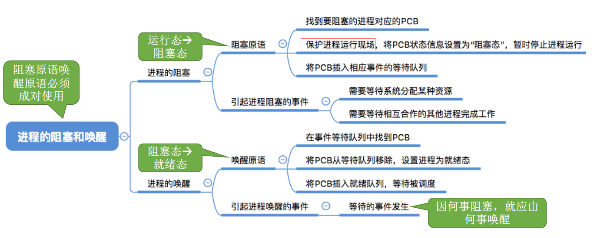
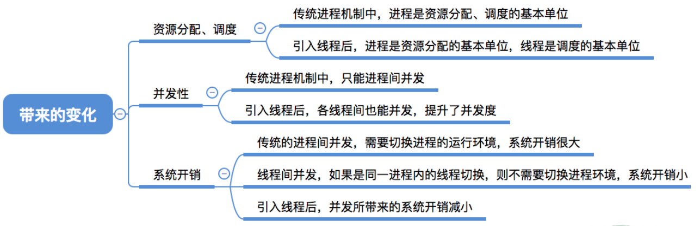
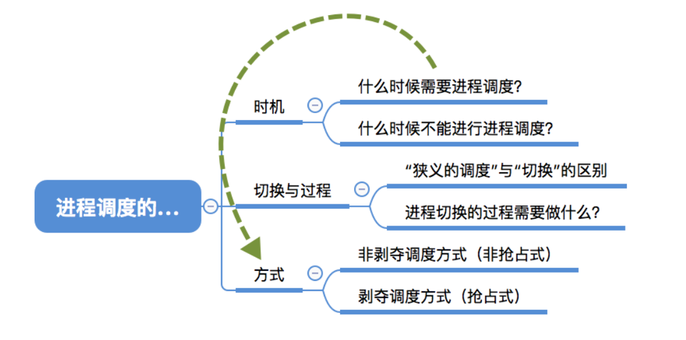



# 1、进程


程序：是**静态**的，就是个存放在磁盘里的可执行文件(`QQ.exe`)，就是一系列的指令集合。

进程：是**动态**的，是程序的一次执行过程。

**同一个程序多次执行会对应多个进程，例如下图中我们同一个程序QQ多次执行，每次都会对应不同的进程。**


思考：操作系统是怎么区分这三个进程呢？


## 1.1、进程的组成

### 1.1.1、PCB

当进程被创建时，操作系统会为该进程分配一个 **唯一的、不重复**的身份证号：`PID(Process ID)`，进程ID 


- 操作系统要记录PID、进程所属用户ID(UID)[**基本的进程描述信息，可以让操作系统区分各个进程**]
- 还要记录给进程分配了哪些资源(如：分配了多少内存、正在使用哪些I/O设备、正在使用哪些文件)**[可用于实现操作系统对资源的管理]**
- 还要记录进程的运行情况(如：CPU使用时间、磁盘使用情况、网络流量使用情况等)[**可用于实现操作系统对进程的控制、调度**]

这些信息都被保存在一个数据结构**PCB**(Oricess Control Block)中,即**进程控制块**，操作系统需要对各个并发运行的进程进行管理，**但凡管理时所需要的信息，都会被放在PCB中。**


### 1.1.2、程序段、数据段

**进程的组成有三部分**：PCB、程序段、数据段


- PCB是给**操作系统**用的
- **程序段、数据段**是给**进程**自己用的


如上图，我们通常写的代码最终会被编译为可执行文件(`.exe`)，当我们运行此程序前会将程序放入内存中，这时操作系统会为这个程序创建对应的PCB，除此之外程序的指令序列也会被存入内存中，这一系列的指令我们称为**程序段**，CPU会从内存中取出这些指令来执行，在CPU执行的过程中，代码中定义的数据也会被存放在内存中，我们称为**数据段**。

一个**进程实体(进程映像)**由**PCB、程序段、数据段**组成。**进程**是**动态**的，**进程实体(进程映像)是静态的。**我们可以把进程实体理解为进程在动态执行过程当中某一时刻的快照，也就是进程实体能够反映进程在某一时刻的状态。


## 1.2、进程的特征

程序是静态的，进程是动态的，相比于程序，进程拥有以下特征：

- **动态性**：进程是程序的一次执行过程，是动态地产生、变化和消亡的。
- **并发性**：内存中有多个进程实体，各进程可并发执行。
- **独立性**：进程是能独立运行、独立获得资源、独立接收调度的基本单位
- **异步性**：各进程是按各自独立的、不可预知的速度向前推进，操作系统要提供"进程同步机制"来解决异步问题。
- **结构性**：每个进程都会配置一个PCB。从结构上看，进程由程序段、数据段、PCB组成

> 1. 动态性是进程最基本的特征
> 2. 异步性会导致并发程序执行结果的不确定性


## 1.3、小结


# 2、进程的状态


## 2.1、创建态、就绪态

如下图，当我们在运行`.exe`文件时，进程正在被创建，状态是 **创建态**。当进程创建完成后，就进入了 **就绪态**。但是由于CPU可能很忙，所以就绪态的进程不能立即运行。所以处于就绪态的进程可能有很多个。


## 2.2、运行态


- 当CPU空闲时，操作系统就会选择一个就绪进程，让它上处理机运行。如果一个进程此时在CPU上运行，那么这个进程处于"**运行态**"
- 当进程1在CPU运行时，CPU会执行该进程对应的指令序列，如果某一时刻进程的指令序列发出系统调用，请求使用打印机资源，但是这个时候打印机正在为别的进程服务，那么这个进程1此时无法继续向下执行，操作系统便会让这个进程1下CPU，并让它进入 **阻塞态**


## 2.3、阻塞态

- 在进程1运行过程中，可能会请求等待某个事件的的发生(如等待某种系统资源的分配，或者等待其他进程的响应)
- 在这个事件发生之前，进程1无法继续往下执行，此时操作系统会让这个进程1下CPU，并让它进入"**阻塞态**"

- 当CPU空闲时，又会选择另一个"就绪态"进程2上CPU运行

- 如果某一时刻打印机空闲了，这说明进程1等待的资源有了，这个时候操作系统会将进程1从**阻塞态**变为**就绪态**

## 2.4、终止态

- 进程2可以执行 exit 系统调用，请求操作系统终止进程2。此时进程2会进入"**终止态**"，操作系统会让进程2下CPU，并回收内存空间等资源，最后还要回收进程2的PCB，当终止进程的工作完成之后，这个进程2就彻底消失了。


## 2.5、进程状态的转换(进程五状态模型)


1. 进程运行之前需要被创建，在创建的过程中系统会完成一系列相应的工作，包括新建PCB、给进程分配一系列资源等，如果一个进程正在被创建的话，那么这个进程当前处于 **创建态**
2. 当进程被创建完成就有了上CPU的条件，这个时候进程就处于 **就绪态**，也就是说处于就绪态的进程只差处理机这种资源，其他资源全部具备
3. 处于**就绪态**的进程被操作系统调度这个进程就可以上处理机运行，当它在处理机上运行的时候它就处于 **运行态**，也就是说正在处理机上运行的进程既有其他全部资源也有了处理机这种资源
4. 有时正在运行的进程可能会等待某种事件的发生，在这个事件发生之前这个进程是没有办法继续向下执行，所以这个进程此时会**被剥夺处理机资源以及其他全部资源**，这个时候进程就处于 **阻塞态**
5. 若进程等待的事件发生了，那么这个进程就可以从 **阻塞态** 回到 **就绪态**
6. 处于 **运行态**的进程可以主动请求运行结束，或者运行过程中遇到不可修复的错误时，会从 **运行态**转变为 **终止态**

- 运行态->阻塞态 是一种进程自身做出的==主动行为==
- 阻塞态->就绪态 不是进程自身能控制的，是一种==被动行为==。

**注意**：有的时候进程可以直接从**运行态**转换为 **就绪态**，比如说操作系统给进程分配的时间片用完了、或者处理机被更重要的进程抢占了的时候。

> 注意：不能由阻塞态直接转换为运行态，也不能由就绪态直接转换为阻塞态(因为进入阻塞态是进程主动请求的，必然需要进程在运行时才能发出这种请求)


- 单CPU情况下，同一时刻只能会有一个进程处于运行态，多核CPU情况下，可能有多个进程处于运行态。
- **阻塞态又称等待态、创建态又称新建态，终止态又称结束态**

- **进程PCB中，会有一个变量state来表示进程的当前状态**。如：1表示创建态、2表示就绪态、3表示运行态等等，为了对同一个状态下的各个进程进行统一的管理，操作系统会将各个进程的PCB组织起来，如何组织呢？


## 2.6、进程的组织

进程的组织方式分为链接方式和索引方式：

### 2.6.1、链接方式

链接方式是指操作系统会管理一系列的队列，每个队列都会指向相应状态的PCB，例如下图中阻塞队列指针指向当前处于阻塞态的进程，就绪队列指针指向当前处于就绪态的进程，并且通常会把优先级更高的进程放在队头。很多操作系统还会根据阻塞原因不同再分为多个阻塞队列，例如等待打印机的阻塞队列、等待磁盘的打印队列等等。


### 2.6.2、索引方式

索引方式：操作系统会给各种状态的进程建立索引表，每个索引表的表项又会指向相应状态的PCB。


### 2.6.2、小结


## 2.7、小结


# 3、进程控制

进程控制的主要功能是对系统中的所有进程实施有效的管理，它具有**创建新进程、撤销已有进程、实现进程状态转换**等功能。简单理解：**反正进程控制就是要实现进程状态转换**


## 3.1、如何实现进程控制

实现进程控制是用**原语**实现的，原语是一种特殊的程序，它的执行具有原子性，也就是说，这段程序的运行必须是一气呵成，不能中断。

**思考**：为什么进程控制(状态转换)的过程要"一气呵成"？

如果不能一气呵成，就有可能导致操作系统中的某些关键数据结构信息不统一的情况，这会影响操作系统进行别的管理工作。例如阻塞队列里面有进程1在等待事件的发生，当进程1等待的事件发生后，操作系统要做这样两件事：

1. 将进程1的state状态设置为1(就绪态状态对应的数字)
2. 将进程1的PCB从阻塞队列放到就绪队列

如果操作系统完成第一步后收到中断信号，那么state=1的进程却被放在了阻塞队列里，这就导致了状态和队列信息对不上，造成信息不统一，系统就出错了。


如上图，此时CPU处于内核态，在执行一条一条的指令，每执行完一次指令都会检查是否有中断信号需要处理，例如执行指令2结束后发现有 **关中断**指令，那么CPU会暂停当前的程序，转而执行中断处理程序。

- CPU执行了 **关中断**指令之后，就不再例行检查中断信号，直到执行 **开中断指令**之后才会恢复检查
- 这样，关中断、开中断之间的指令序列就是不可被中断的，这样就实现了原子性

> **关中断指令**和**开中断指令**这两个是**特权指令**，如果是非特权指令，那么用户就想用就用，直接霸占CPU🤡


## 3.2、进程控制相关的原语

### 3.2.1、进程创建的原语


### 3.2.2、进程终止的原语


### 3.2.3、进程的阻塞和唤醒原语




### 3.2.4、进程的切换原语


进程的运行环境其实就是进程在执行过程中产生的中间结果，例如数据段，也就是进程在执行过程中产生的中间结果，**在进程切换时在PCB中保存这些东西**。这样当它再次投入运行时，可以**通过PCB恢复它的运行环境**。


## 3.4、小结


学习技巧：进程控制会导致进程状态的转换。无论哪个进程控制原语，要做的无非三类事情：

1. 更新PCB中的信息

   a. 所有的进程控制原语一定都会修改进程状态标志

   b. 剥夺当前运行进程的CPU使用权必然需要保存其运行环境

   c. 某进程开始运行前必然要恢复其运行环境

2. 将PCB插入合适的队列
3. 分配/回收资源


# 4、进程通信IPC

**进程通信**(Inter-Process Communication)就是指**进程之间的信息交换**。


进程是分配系统资源的单位(包括内存地址空间)，因此**各进程**拥有的**内存地址空间相互独立**。为了保证安全，**一个进程不能直接访问另一个进程的地址空间**(有些进程请求你手机地址、照片什么的，那不就没隐私了)。但是进程之间的信息交换又是必须实现的，为了保证进程间的安全通信，操作系统提供了一些方法。包括**共享存储、管道通信、消息传递**


## 4.1、共享存储

**共享存储**：虽然进程之间不能直接访问另一个进程的地址空间，但是可以在内存中创建一片**共享存储区**，这样所有进程都可以对这个共享存储区的内容进行读写操作。

- 两个进程对共享空间的访问必须是互斥的(互斥访问通过操作系统提供的P、V工具实现)，当进程1在向共享空间写数据时，进程2是不允许访问共享空间的。
- **操作系统只负责共享空间和同步互斥工具，至于如何互斥、互斥方式是由通信进程自己负责的。**

**共享存储**分为**基于数据结构的共享**和**基于存储区的共享**。

- **基于数据结构的共享**：比如共享空间里只能放一个长度为10的数组。这种共享方式速度慢，限制多，是一种**低级通信**方式
- **基于存储区的共享**：在内存中画出一块共享存储区，数据的形式、存放位置都由进程控制，而不是操作系统。相比之下，这种共享方式速度更快，是一种**高级通信**方式。


## 4.2、管道通信


**管道通信**：写数据从一边写，读数据从另一边读。数据的传输只能是单向的，要么从左向右，要么从右到左。

1. 管道只能采用`半双工通信`,某一时间段内只能实现单向的传输。如果要实现`双向同时通信`,则`需要设置两个管道`。
2. 各进程要`互斥`地访问管道(由操作系统实现)
3. 当`管道写满`时，`写进程`将`阻塞`，直到读进程将管道中的数据取走，即可唤醒写进程
4. 当`管道读空`时，`读进程`将`阻塞`，直到写进程往管道中写入数据，即可唤醒读进程
5. 数据一旦被读出，就彻底消失，因此当多个进程读同一个管道时，可能会错乱。对此，通常有两种解决方案
   1. **一个管道允许多个写进程，一个读进程**(标准答案，考研以这种方式为准!)
   2. **一个管道允许多个写进程，多个读进程，但是系统会让各个读进程轮流从管道中读数据(**Linux方案)


> - 管道通信和共享存储是有区别的，共享存储随便存随便取，但是管道通信是先进先出的，先写进的数据先被读出。只有把前面的数据读了，才能读后面的数据
> - 写进程往管道写数据，即使管道没被写满，只要管道没空，读进程就可以从管道读数据
> - 读进程从管道读数据，即使管道没被读空，只要管道没满，写进程就可以往管道写数据


## 4.3、消息传递

进程间的数据交换以`格式化的消息`(Message)为单位。进程通过操作系统提供的"发送消息/接收消息"两个`原语`进行数据交换。

格式化的消息由两个部分组成：

1. 消息头：消息头包括发送进程ID、接收进程ID、消息长度等格式化的信息
2. 消息体

**消息传递**分为**直接通信方式**和**间接通信方式**：

- **直接通信方式**：消息发送进程要指明接收进程的ID
- **间接通信方式**：通过信箱间接的通信，因此也称"信箱通信方式"。

### 4.3.1、直接通信方式


进程P给进程Q发送消息，进程P使用**发送原语**指明发送消息msg给Q，msg会被直接挂在进程Q的消息队列中，当进程Q运行时，会使用**接收原语**指明接收进程P发送的消息msg，操作系统会检查进程Q的消息队列，找到msg，就会从内核区将msg复制到进程Q的地址空间。

> 直接通信方式就是点名道姓的进行消息传递

### 4.3.2、间接通信方式


如上图，进程P向操作系统申请了两个信箱空间，进程P使用发送原语向信箱A发送信息，进程Q使用接收原语从A信箱收到消息，这样操作系统就会将信息复制到进程Q的地址空间。

多个进程可以向同一个信箱里面发送消息，也可以多个进程从同一个信箱中接收消息。

> 间接通信方式：以信箱作为中间实体进行消息传递

## 4.4、小结


# 5、多线程模型


## 5.1、什么是线程

有的进程可能需要同时做很多事，而传统的进程只能串行地执行一系列程序。为此，引入了**线程**来增加并发度。**传统的进程是程序执行流的最小单位，引入线程后，线程成为了程序执行流的最小单位。**简单理解：QQ是一个进程，QQ发送文件、视频聊天这就是两个线程


- 可以把线程理解为轻量级进程，**线程**是一个**基本的CPU执行单元**，也是**程序执行流的最小单位**。

- 引入线程之后，不仅是进程之间可以并发，进程内的各线程之间也可以并发，从而进一步提升了系统的并发度，使得一个进程内也可以并发处理各种任务(如QQ视频、文字聊天、传文件)，引入线程后，**进程**只作为**除CPU之外的系统资源的分配单元**(如打印机、内存地址空间等都是分配给进程的，而不是分配给线程)，**线程**则作为**处理机的分配单元**。


## 5.2、引入线程的变化



- **进程**是**资源分配**的基本单位，**线程**是**调度**的基本单位


## 5.3、线程的属性


- **线程**是处理机调度的基本单位，而资源分配是分配给**进程**的，所以说线程几乎不拥有系统资源。同一个进程的不同线程之间是可以共享进程的资源，即同一个进程的线程共享内存地址空间，所以同一个进程间的通信不需要系统的干预
- **同一个进程中的线程切换，不会引起进程切换。不同进程中的线程切换，会引起进程切换，切换同进程内的线程，系统的开销很小，而切换进程，系统开销较大**


# 6、线程的实现方式


## 6.1、用户级线程

早期的操作系统(如:早期Unix)只支持进程，不支持线程。当时的"线程"是由线程库实现的。也就是说在操作系统的视角下看到的依然只有**进程**，而程序员可以创建线程库来使得多个逻辑上的线程并发的运行。


1. 用户级线程由应用程序通过线程库实现，所有的`线程管理工作`都由`应用程序负责`(包括线程切换)，并不需要操作系统管理干预。

2. 用户级线程中，`线程切换`可以在`用户态`下即可完成，无需操作系统干预，CPU并不需要变态。

3. 在用户看来,是有多个线程，但是在操作系统内核看来,并意识不到线程的存在。"用户级线程"就是"从用户视角能看到的线程"。

4. **优缺点**：

   - **优点**：用户级线程的切换在用户空间即可完成，不需要切换到核心态，线程管理的系统开销小，效率高

   - **缺点**：
     1. 当一个用户级线程被阻塞后，整个进程都会被阻塞，并发度不高。
     2. 多个进程不可在多核处理机上并行运行。因为在这种情况下，只是引入了逻辑上的线程，**进程依然是系统调度的基本单位**，因此即便我们的电脑是多核处理机，我们的进程还是只能被分配一个核心，所以多个进程不能在多核处理机上并行运行。


## 6.2、内核级线程

内核级线程：又称内核支持的线程，由**操作系统支持的线程**。


1. `内核级线程的管理工作`由`操作系统内核`完成。

2. 线程调度、切换等工作都由内核负责，因此`内核级线程的切换`必然需要在`核心态`下才能完成。

3. 操作系统会为每个内核级线程建立相应的TCB(Thread Control Block,线程控制块),通过TCB对线程进行管理。"`内核级线程`"就是"`从操作系统内核视角能看到的线程`"

4. **优缺点**

   优点：当一个线程被阻塞后，别的线程还可以继续执行，并发能力强。多线程可在多核处理机上并行执行。

   缺点：：一个用户进程可能会占用多个内核级线程，线程切换由操作系统内核完成，需要切换到核心态，因此线程管理的成本高，开销大。


## 6.3、多线程模型

在支持内核级线程的系统中，根据用户级线程和内核级线程的映射关系，可以划分为几种多线程模型。

### 6.3.1、一对一模型


- 一对一模型：**一个用户级线程**映射到**一个内核级线程**。每个用户进程有与用户级线程同数量的内核级线程。
- **优点**：当一个线程被阻塞后，别的线程还可以继续执行，并发能力强。多线程可在多核处理机上并行执行。
- **缺点**：一个用户进程会占用多个内核级线程，线程切换由操作系统内核完成，需要切换到核心态，因此线程管理的成本高，开销大。


### 6.3.2、多对一模型


- 多对一模型：**多个用户级线程映射到一个内核级线程**。且一个进程只被分配一个内核级线程。
- **优点**：用户级线程的切换在用户空间即可完成，不需要切换到核心态，线程管理的系统开销小，效率高
- **缺点**：当一个用户级线程被阻塞后，整个进程都会被阻塞，并发度不高。多个线程不可在多核处理机上并行运行

> 重点：操作系统只"看得见"内核级线程，因此只有`内核级线程才是处理机分配的单位`，所以多个线程不可以在多核处理机上并行运行


### 6.3.3、多对多模型


​                                


- 多对多模型：n个用户级线程映射到m个内核级线程(n>=m)。每个用户级进程对应m个内核级进程
- **优点**：克服了多对一模型并发度不高的缺点(一个阻塞全体阻塞)，又克服了一对一模型中一个用户进程占用太多内核级线程，开销太大的缺点。

- 我们可以将用户级线程看成是代码逻辑的载体，例如上图中3个用户级线程分别对应视频聊天、文字聊天、文件传输的代码运行，将内核级线程看成是运行机会的载体，**只有获得了运行机会代码逻辑才能被执行**，因为操作系统在分配CPU资源的时候，是以**内核级线程**为单位进行分配的，所以虽然有3个用户级线程，但是最多只会被分配两个CPU核心。
- 内核级线程中可以运行任意个用户级线程，例如某一时刻视频聊天所需资源较多，那么可以让一个内核级线程专门运行视频聊天，而另一个内核级线程运行文字聊天、文件传输。**只有当两个内核级线程中正在运行的代码逻辑都阻塞时，这个进程才会被阻塞。**


## 6.4、小结

 


# 7、进程调度


## 7.1、调度的基本概念

当有一堆任务要处理，但由于资源有限，这些事情没法同时处理。这就需要确定某种规则来决定处理这些任务的顺序，这就是"调度"研究的问题。


## 7.2、调度的三个层次

### 7.2.1、高级调度

**高级调度(作业调度)**：启动程序时会将程序从外存放入内存，但是内存空间是有限的，有时无法将用户提交的作业全部放入内存，这个时候操作系统就可以进行**高级调度**：按一定的原则从外存的作业后备队列中挑选一个作业调入内存，并创建进程。**每个作业只调入一次，调出一次**。作业调入时会创建PCB，调出时才撤销PCB。

**简化理解**：好几个程序需要启动，到底先启动哪个。作业可以理解为一个具体的任务，用户向系统提交一个作业相当于用户让操作系统启动一个程序(来处理一个具体的任务)


### 7.2.2、低级调度

**低级调度(进程调度/处理机调度)**：按照某种策略从就绪队列中选取一个进程，将处理机分配给它。进程调度是操作系统中最基本的一种调度，在一般的操作系统中都必须配置进程调度。进程调度的频率高，一般几十毫秒一次。只有这种高频率的保证才能使得各个进程轮流上CPU很快速的运行，这样才可以让用户在宏观上看好像各个进程是同时执行的一样。


### 7.2.3、中级调度

内存不够时，可将某些进程的数据从内存调出外存。等内存空闲或者进程需要运行时再重新调入内存。暂时调到外存等待的进程状态为`挂起状态`。被挂起的进程PCB会被组织成`挂起队列`

**中级调度(内存调度)**：按照某种策略决定将哪个处于`挂起状态`的进程重新调入内存。一个进程可能会被多次调出、调入内存，因此**中级调度**发生的**频率**要比高级调度**更高**。我们生活中手机进行app之间的切换时，如果出现卡顿现象，其实就是在发生中级调度。


## 7.3、七状态模型


暂时调到外存等待的进程状态为"挂起状态(挂起态)"，挂起态又可以进一步细分为**就绪挂起、阻塞挂起**两种状态。五状态一般408考，七状态一般自主命题考。

1. 处于**就绪态**的进程在内存不够时也会可能会被暂时调到外存当中，这个进程就进入了一个**就绪挂起**的状态，一直到内存空间空闲或者这个进程必须执行时，这个进程就会被激活重新回到就绪态。处于 **阻塞态**的进程也可以被挂起，称为 **阻塞挂起**。处于**阻塞挂起**的进程，当它等待的事件发生的时候，这个 进程会直接进入到**就绪挂起**的状态，当再次被激活是直接回到**就绪态**，而不是**阻塞态**
2. 有时候进程运行结束的时候，可能也会直接进入**就绪挂起**的状态
3. 有时候创建态的进程由于内存不够而不能进入就绪态，也会直接进入**就绪挂起**的状态

**挂起和阻塞的区别**：

- 两种状态都是暂时不能获得CPU的服务，但**挂起态**是将进程映像调到**外存**去了，而**阻塞态**下进程映像还在**内存**中。
- 有的操作系统会把就绪挂起、阻塞挂起分为两个挂起队列，甚至会根据阻塞原因再把阻塞挂起进程进一步细分为多个队列。


## 7.4、三层调度的联系

|                        | 要做什么                                                     | 调度发生在                | 发生频率 | 对进程状态的影响                 |
| ---------------------- | ------------------------------------------------------------ | ------------------------- | -------- | -------------------------------- |
| 高级调度<br>(作业调度) | 按照某种规则，从**后备队列**中选择合适的作业将其调入内存，并为其创建进程 | 外存->内存<br>(面向作业)  | 最低     | 无->创建态->就绪态               |
| 中级调度<br>(内存调度) | 按照某种规则，从**挂起队列**中选择合适的进程将其数据调回内存 | 外存->内存<br/>(面向进程) | 中等     | 挂起态->就绪态(阻塞挂起->阻塞态) |
| 低级调度<br>(进程调度) | 按照某种规则，从**就绪队列**中选择一个进程为其分配处理机     | 内存->CPU                 | 最高     | 就绪态->运行态                   |


## 7.5、小结


## 7.6、进程调度的时机




**进程调度(低级调度)**：就是按照某种算法从就绪队列中选择一个进程为其分配处理机。

**需要进行进程调度与切换的情况如下图**：


 

1. 当前运行的进程**主动放弃**处理机，例如进程中止、进程运行过程中发生异常而终止、进程主动请求阻塞(当等待某些资源时)
2. 当前运行的进程**被动放弃**处理机，例如分给进程的时间片用完了、有更紧急的进程需要上处理机、有优先级更高的进程进入就绪队列

**不能进行进程调度与切换的情况如下图**：


1. 在**处理机中断的过程中**不能进行进程调度与切换。

2. 进程在 **操作系统内核程序临界区**中不能进行进程调度与切换。
3. 在**原子操作过程中**不能进行进程调度与切换。

---

1. 进程在`操作系统内核程序临界区`中`不能`进行调度与切换。 (√)

2. 进程处于`临界区`时`不能`进行处理机调度。(×)

- **临界资源**：一个时间段内只允许一个进程使用的资源，各进程需要`互斥地`访问临界资源。

- **临界区**：访问临界资源的那段代码。因此各个进程也只能 `互斥地`进入临界区，互斥地执行访问临界资源的代码

- `内核程序临界区`一般是用来访问`某种内核数据结构`的，比如进程的就绪队列（由各就绪进程的PCB组成）
  - 当一个进程处于**内核程序临界区**，并且这个临界区是要访问就绪队列的话，在访问之前它会将就绪队列上锁，如果这个进程还没有退出 **内核程序临界区** 的话，也就是就绪队列还没有被解锁就进行进程调度，进程调度的相关程序也需要访问就绪队列，但此时就绪队列被锁住了，因此又无法顺利进行进程调度
    - 所以对于**内核程序临界区访问的临界资源**如果不尽快释放的话(也就是被锁住)，极有可能影响到操作系统内核的其他管理工作。**因此在访问内核程序临界区间不能进行调度与切换。**
  - 假如这个进程访问的是**普通的临界资源**，比如说是打印机资源，在访问之前会将打印机上锁，在打印机打印完成之前，临界资源不会解锁，但打印机又是慢速设备，此时如果一直不允许进程调度的话就会导致CPU一直空闲。(进程一直等待打印机，同时又霸占了CPU，但是进程又没法向下执行)
    - 所以对于普通临界区访问的临界资源不会直接影响操作系统内核的管理工作。**因此在访问普通临界区时可以进行调度与切换。**


有的系统中，只允许进程主动放弃处理机，有的系统中，进程可以主动放弃处理机，当有更紧急的任务需要处理时，也会强行剥夺处理机(被动放弃)，这样就引出了两种进程调度的方式：

1. 非剥夺调度方式
2. 剥夺调度方式

## 7.7、进程调度的方式

- `非剥夺调度方式`,又称`非抢占方式`。即，**只允许进程主动放弃处理机**。在运行过程中即便有更紧迫的任务到达，当前进程依然会继续使用处理机，直到该进程终止或主动要求进入阻塞态。
  - 实现简单，系统开销小但是无法及时处理紧急任务，适合于早期的批处理系统
- `剥夺调度方式`,又称`抢占方式`。当一个进程正在处理机上执行时，如果有一个更重要或更紧迫的进程需要使用处理机，则立即暂停正在执行的进程，将处理机分配给更重要紧迫的那个进程。
  - 可以优先处理更紧急的进程，也可实现让各进程按时间片轮流执行的功能（通过时钟中断）。适合于**分时操作系统、实时操作系统**。


## 7.8、进程的切换与过程

“狭义的进程调度”与“进程切换”的区别：

- `狭义的进程调度`指的是从就绪队列中**选中一个要运行的进程**。(这个进程可以是刚刚被暂停执行的进程,也可能是`另一个进程`，后一种情况就需要**进程切换**)
- `进程切换`是指一个进程让出处理机，由另一个进程占用处理机的过程。

有些题目中出现的进程调度，指的是`广义的进程调度`包含了**选择一个进程**和**进程切换**两个步骤。(也就是上面的两个步骤)

进程切换的过程主要完成了：

1. 对原来运行进程各种数据的保存
2. 对新的进程各种数据的恢复(如：程序计数器、程序状态字、各种数据寄存器等处理机现场信息，这些信息一般保存在进程控制块)

**注意**：`进程切换是有代价的`，因此如果`过于频繁`的进行进程`调度、切换`，必然会使整个系统的`效率降低`，使系统大部分时间都花在了进程切换上，而真正用于执行进程的时间减少。

> 所以不能说进程切换越频繁，系统的并发度越高

## 7.9、小结


# 8、调度算法的评价指标


## 8.1、CPU利用率

由于早期的CPU造价极其昂贵，因此人们会希望让CPU尽可能多地工作

`CPU利用率`: 指CPU “忙碌”的时间占总时间的比例。 利用率 = (忙碌的时间)/(总时间)
$$
利用率 = \frac{忙碌的时间}{总时间}
$$

有的题目还会让算某种设备的利用率：


## 8.2、系统吞吐量

对于计算机来说，希望能用尽可能少的时间处理完尽可能多的作业

`系统吞吐量`:**单位时间内完成作业的数量**。系统吞吐量 = (总共完成了多少道作业)/总共花了多少时间
$$
系统吞吐量 = \frac{总共完成了多少道作业}{总共花了多少时间}
$$


## 8.3、周转时间

对于计算机的用户来说，他很关心自己的作业从提交到完成花了多少时间。一般周转时间肯定是越少越好。

`周转时间`:指从**作业被提交给系统开始**，**到作业完成为止**的这段时间间隔。它包括四个部分

- 作业在外存后备队列上等待作业调度（高级调度）的时间
- 进程在就绪队列上等待进程调度（低级调度）的时间
- 进程在CPU上执行的时间(**进程处于运行态的时间**)
- 进程等待I/O操作完成的时间(**进程处于阻塞态的时间**)

后三项在一个作业的整个处理过程中，可能发生多次。**因为整个作业中只会有一次作业调度(高级调度)。**

---

`周转时间` = 作业完成时间 - 作业提交时间。[对于用户来说，更关心自己的单个作业的周转时间]

`平均周转时间` = (各作业周转时间之和)/作业数。[对于操作系统来说，更关心系统的整体表现，因此更关心所有作业周转时间的平均值]

有的作业运行时间短，有的作业运行时间长，因此在周转时间相同的情况下，运行时间不同的作业，给用户的感觉肯定是不一样的，所以提出了**带权周转时间**


$$
周转时间 = 作业完成时间-作业提交时间\\

\\
平均周转时间 = \frac{各作业周转时间之和}{作业数}
$$

$$
带权周转时间 = \frac{作业周转时间}{作业实际运行时间} = \frac{作业完成时间-作业提交时间}{作业实际运行的时间} \\
\\
平均带权周转时间 = \frac{各作业带权周转时间之和}{作业数}
$$


 带权周转时间必然≥1，因为周转时间包含作业实际运行的时间，肯定比作业实际运行的时间长，且带权周转时间与周转时间都是越小越好。


## 8.4、等待时间

计算机的用户希望自己的作业尽可能少的等待处理机

`等待时间`：指进程/作业`处于等待处理机状态时间之和`，等待时间越长，用户满意度越低。


如上图，作业在后备队列**等待被服务(调度**)，当作业被调度后，作业会被从外存放入内存，建立**相应的进程**，当这个进程建立起之后会被CPU服务、也会被I/O设备服务，当然也会有等待被服务的时间，一直到最后整个进程运行结束，然后把作业移出内存。

- 对于`进程`来说，等待时间就是指进程建立后`等待被服务的时间之和`，在等待I/O完成的期间其实进程也是在被服务的，所以不计入等待时间。

- 对于`作业`来说，不仅要考虑`建立进程后的等待时间`，`还要加上作业在外存后备队列中等待被调度的时间`。

> 所以作业的等待时间和进程的等待时间是不相同的

一个作业总共需要被CPU服务多久，被I/O设备服务多久一般是确定不变的，因此调度算法其实只会影响作业/进程的等待时间。当然，与前面指标类似，也有“`平均等待时间`”来评价整体性能。也就是把所有进程的等待时间或者作业的等待时间做一个加和，然后除以作业的数量。

​                                                                                                                                                                                                                                                                                                                                                                                                                                                                                                                                                                                                                                                                                                                                                                                                                                                                                                                                                                                                                                                                                                                                                                                                                                                                                                                                                                                                                                                                                                                                               


## 8.5、响应时间

对于计算机用户来说，会希望自己的提交的请求（比如通过键盘输入了一个调试命令）尽早地开始被系统服务、回应。

`响应时间`:指从`用户提交请求`到`首次产生响应`所用的时间。


## 8.6、小结


# 9、调度算法

## 9.1、早期批处理系统


### 9.1.1、先来先服务FCFS

先来先服务(FCFS,First Come First Serve)

| 算法思想                                  | 主要从"公平"的角度考虑(类似于我们生活中排队买东西的例子)     |
| ----------------------------------------- | ------------------------------------------------------------ |
| 算法规则                                  | 按照作业/进程到达的先后顺序进行服务                          |
| 用于作业/进程调度                         | 用于**作业调度**时，考虑的是**哪个作业先到达后备队列(外存)**<br>用于**进程调度**时，考虑的是**哪个进程先到达就绪队列(内存)** |
| 是否可抢占                                | 非抢占式的算法                                               |
| 优缺点                                    | 优点：公平、算法实现简单<br>缺点：排在长作业（进程）后面的短作业需要等待很长时间，带权周转时间很大，对短作业来说用户体验不好。**即FCFS算法对长作业有利，对短作业不利**(eg:排队买奶茶，先到先服务，你买一杯，你前面的人买20杯🙂) |
| 是否会导致饥饿(某进程/作业长期得不到服务) | 不会(只要你等着，你前面的20杯总会做完，然后轮到你)           |


**先来先服务调度算法**：按照到达的**先后顺序调度**，事实上就是**等待时间越久的越优先得到服务**。P1要等5s，P2要等3s，P3要等1s，P4要等0s，所以等待时间越长的P1越优先得到服务，**也可以说是先到达的先得到服务。**

P1从0时刻到达，然后运行7个时间片，P2运行4个时间片，P3运行1个时间片，P4运行4个时间片。

- **周转时间 = 完成时间 - 到达时间**
  - P1 = 7-0 = 7    => P1是在7时刻完成，0时刻到达
  - P2 = 11-2 = 9  => P2是在11时刻完成，2时刻到达
  - P3 = 12-4 = 8  => P3是在12时刻完成，4时刻到达
  - P4 = 16-5 = 11  => P4是在16时刻完成，5时刻到达
- **带权周转时间 = 周转时间/运行时间**
  - P1 = 7/7 = 1    => P1周转时间为7，运行时间为7
  - P2 = 9/4 = 2.25
  - P3 = 8/1 = 8
    - 这里可以发现带权周转时间太大了，对用户体验是极差的
  - P4 = 11/4 = 2.75
- **等待时间 = 周转时间 - 运行时间**(注意：本例中的进程都是纯计算型的进程,也就是只有CPU为它们服务，一个进程到达后要么等待，要么在运行。如果是又有计算，又有I/O操作的进程,其**等待时间就是周转时间-运行时间-I/O操作的时间**)
  - P1 = 7-7 = 0
  - P2 = 9-4 = 5
  - P3 = 8-1 = 7
  - P4 = 11-4 = 7

- 平均周转时间 = (7+9+8+11)/4 = 8.75
- 平均带权周转时间 = (1+2.25+8+2.75)/4 = 3.5
- 平均等待时间 = (0+5+7+7)/4 = 4.75


### 9.1.2、短作业优先

短作业优先(SJF,Shortest Job First)

| 算法思想                                  | 追求最少的平均等待时间，最少的平均周转时间、最少的平均平均带权周转时间 |
| ----------------------------------------- | ------------------------------------------------------------ |
| 算法规则                                  | 最短的作业/进程优先得到服务（所谓“最短”，是指要求服务时间最短） |
| 用于作业/进程调度                         | **既可用于作业调度，也可用于进程调度**。<br>用于进程调度时，称为“短进程优先（SPF, Shortest Process First）算法” |
| 是否可抢占                                | SJF和SPF是非抢占式的算法。但是也有抢占式的版本——**最短剩余时间优先算法**（SRTN, Shortest Remaining Time Next） |
| 优缺点                                    | 优点："最短的"平均等待时间、平均周转时间<br>缺点：不公平。**对短作业有利，对长作业不利**。可能产生`饥饿`现象。另外，作业/进程的运行时间是由用户提供的，并不一定真实，不一定能做到真正的短作业优先 |
| 是否会导致饥饿(某进程/作业长期得不到服务) | 会。如果源源不断地有短作业/进程到来，可能使长作业/进程长时间得不到服务，产生“饥饿”现象。如果一直得不到服务，则称为“饿死” |

#### 1、非抢占式的短作业/进程优先算法


上题中是进程调度的场景，所以严格来说，应该是使用**非抢占式的短进程优先调度算法(SPF)计算**。不过很多题目中也不会在意这个细节，我们只需要知道这两个的规则是一样的。

**短作业/进程优先调度算法**：每次调度时选择**当前已到达**且**运行时间最短**的作业/进程。

在0时刻,只有P1这个进程是已经到达的，所以这个时候只能为P1服务，当P1运行完了之后，也就是到了时刻7，其他进程全部都已经到达了，但是P3的运行时间最短，所以调度P3，当P3运行完了之后，剩下P2和P4的运行时间相同，但是由于P2是先到达就绪队列的，所以调度P2，最后调度P4 

- 周转时间 = 完成时间 - 到达时间
  - P1 = 7-0 = 7
  - P3 = 8-4 = 4
  - P2 = 12-2 = 10
  - P4 = 16-5 = 11 
- 带权周转时间 = 周转时间/运行时间
  - P1 = 7/7 = 1
  - P3 = 4/1 = 4
  - P2 = 10/4 = 2.5
  - P4 = 11/4 = 2.75
- 等待时间 = 周转时间 - 运行时间(注意：本例中的进程都是纯计算型的进程,一个进程到达后要么等待，要么在运行。如果是又有计算，又有I/O操作的进程,其等待时间就是周转时间-运行时间-I/O操作的时间)
  - P1 = 7-7 = 0
  - P3 = 4-1 = 3
  - P2 = 10-4 = 6
  - P4 = 11-4 = 7

- 平均周转时间 = (7+4+10+11)/4 = 8              
- 平均带权周转时间 = (1+4+2.5+2.75)/4 = 2.56
- 平均等待时间 = (0+3+6+7)/4 = 4

**对比FCFS先来先服务算法的结果,显然SPF算法的平均等待/周转/带权周转时间都要更低**。


#### 2、抢占式的短作业/进程优先算法


> 抢占式的短作业优先算法又称为最短剩余时间优先算法

**抢占式的短作业优先算法/最短剩余时间优先算法**：每当有新进程加入就绪队列就会导致就绪队列改变那么就需要调度，如果**新到达的进程剩余运行时间比当前运行的进程剩余的运行时间更短，则由新进程抢占处理机**，当前运行进程重新新回到就绪队列。另外，当一个进程**运行完成时也需要调度**。

需要注意的是：当有新进程到达时就绪队列就会改变，就要按照上述规则进行检查。以下P~n~(m)表示当前P~n~进程剩余时间为m。各个时刻的情况如下：

0时刻(P1到达)：==p~1~(7)==

2时刻(P2到达)：p~1~(5)、==p~2~(4)==       => 5大于4，P2抢占处理机，P1下处理机回到就绪队列

4时刻(P3到达)：p~1~(5)、P~2~(2)、==P~3~(1)==

5时刻(P3完成且P4刚好到达):p~1~(5)、==p~2~(2)==、p~4~(4)

7时刻(P2完成):p~1~(5)、==p~4~(4)==

11时刻(P4完成)：==p~1~(5)==

- 周转时间 = 完成时间 - 到达时间
  - P1 = 16-0 = 16
  - P2 = 7-2 = 5
  - P3 = 5-4 = 1
  - P4 = 11-5 = 6 
- 带权周转时间 = 周转时间/运行时间
  - P1 = 16/7 = 2.28
  - P2 = 5/4 = 1.25
  - P3 = 1/1 = 1
  - P4 = 6/4 = 1.5
- 等待时间 = 周转时间 - 运行时间(注意：本例中的进程都是纯计算型的进程,一个进程到达后要么等待，要么在运行。如果是又有计算，又有I/O操作的进程,其等待时间就是周转时间-运行时间-I/O操作的时间)
  - P1 = 16-7 = 9
  - P3 = 5-4 = 1
  - P2 = 1-1 = 0
  - P4 = 6-4 = 2

- 平均周转时间 = (7+4+10+11)/4 = 8              
- 平均带权周转时间 = (1+4+2.5+2.75)/4 = 2.56
- 平均等待时间 = (0+3+6+7)/4 = 4

**抢占式的短作业优先算法作业的执行都是断断续续的，对比非抢占式的短作业优先算法，显然抢占式的这几个指标又要更低。**

---

**注意几个小细节**：

1. 如果题目中未特别说明，所提到的“短作业/进程优先算法”默认是**非抢占式的**

2. 很多书上都会说“SJF(**短作业优先**)调度算法的平均等待时间、平均周转时间最少”，严格来说，这个表述是错误的，不严谨的。之前的例子表明，**抢占式的短作业优先算法/最短剩余时间优先算法**得到的平均等待时间、平均周转时间还要更少

3. 应该加上一个条件"**在所有进程同时可运行时**，采用SJF调度算法的平均等待时间、平均周转时间最
   少",或者说"**在所有进程都几乎同时到达时**，采用SJF调度算法的平均等待时间、平均周转时间最少"。

   如果不加上述前提条件，则应该说"**抢占式的短作业/进程优先调度算法（最短剩余时间优先, SRNT算法)**的平均等待时间、平均周转时间最少。

4. 虽然严格来说，SJF的平均等待时间、平均周转时间并不一定最少，但相比于其他算法（如FCFS），SJF依然可以获得较少的平均等待时间、平均周转时间

5. 如果选择题中遇到“SJF 算法的平均等待时间、平均周转时间最少”的选项，那最好判断其他选项是不是有很明显的错误，如果没有更合适的选项，那也应该选择该选项


### 9.1.3、高响应比优先


FCFS算法是在每次调度的时候选择一个等待时间最长的作业(进程)为其服务，但是没有考虑到作业的运行时间，因此导致了对短作业不友好的问题。SJF算法是选择一个执行时间最短的作业为其服务。但是又完全不考虑各个作业的等待时间，因此导致了长作业不友好的问题，甚至还会造成饥饿的问题。所以我们提出了**高响应比优先算法**，既考虑各个作业的等待时间，也能兼顾运行时间。


高响应比优先(HRRN,Highest Response Ratio Next)

| 算法思想                                  | 要综合考虑作业/进程的等待时间和要求服务的时间                |
| ----------------------------------------- | ------------------------------------------------------------ |
| 算法规则                                  | 在每次调度时先计算各个作业/进程的**响应比**，选择响应比最高的作业/进程为其服务。**响应比** = (等待时间+要求服务时间)/要求服务时间<br>**响应比必然是大于等于1的数** |
| 用于作业/进程调度                         | **既可用于作业调度，也可用于进程调度**。                     |
| 是否可抢占                                | **非抢占式的算法**。因此只有当前运行的作业/进程主动放弃处理机时，才需要调度，才需要计算响应比 |
| 优缺点                                    | **优点**：综合考虑了等待时间和运行时间（要求服务时间）。<br>等待时间相同时，要求服务时间短的优先。（SJF 的优点）<br>要求服务时间相同时，等待时间长的优先（FCFS 的优点）。<br>对于长作业来说，随着等待时间越来越久，其响应比也会越来越大，从而避免了长作业饥饿的问题 |
| 是否会导致饥饿(某进程/作业长期得不到服务) | 不会                                                         |

$$
响应比 = \frac{等待时间+要求服务时间}{要求服务时间}
$$


**高响应比优先算法**：非抢占式的调度算法，只有当前运行的进程**主动放弃CPU时**(正常/异常完成，或主动阻塞)，才需要进行调度，调度时**计算所有就绪进程的响应比，选择响应比最高的进程上处理机**。

由于上题是纯计算型的进程，所以并不会有I/O操作，也就是并不会主动阻塞，所以主动阻塞这种情况不需考虑。

1. 0时刻：只有P1到达就绪队列，`P1`上处理机

2. 7时刻(**P1运行完成主动放弃CPU**)：就绪队列中只有P2(响应比=(5+4)/4=2.25)、`P3`((3+1)/1=4)、P4((2+4)/4=1.5)

   - $$
     P_2 = \frac{5+4}{4}=2.25 \\
     P_3 = \frac{3+1}{1}=4 \\
     P_4 = \frac{2+4}{4} = 1.5
     $$

   - 响应比最高的P3上处理机

3. 8时刻(**P3运行完成主动放弃CPU**):`P2`(2.5)、P4(1.75)

   - $$
     P_2 = \frac{6+4}{4}=2.5\\
     P_4 = \frac{3+4}{4}=1.75
     $$

   - 选择响应比更高的P2上处理机

4. 12时刻(P2完成):就绪队列中只剩下`P4`


### 9.1.4、小结

| 算法    | 思想 | 可否抢占                                                     | 优点                                                 | 缺点                                                 | 考虑到等待时间&运行时间 | 饥饿 |
| ------- | ---- | ------------------------------------------------------------ | ---------------------------------------------------- | ---------------------------------------------------- | ----------------------- | ---- |
| FCFS    |      | 非抢占式                                                     | 公平，实现简单                                       | 对短作业不利                                         | 等待时间√<br>运行时间×  | 不会 |
| SJF/SPF |      | 默认为非抢占式，也有SJF的抢占式，版本最短剩余时间优先算法(SRTN) | "最短的",平均等待时间/周转时间                       | 对长作业不利，可能导致饥饿，难以做到真正的短作业优先 | 等待时间×<br/>运行时间√ | 会   |
| HRRN    |      | 非抢占式                                                     | 上述两种算法的权衡折中，综合考虑的等待时间和运行时间 |                                                      | 等待时间√<br/>运行时间√ | 不会 |


注意：：这几种算法主要关心对用户的公平性、平均周转时间、平均等待时间等评价系统整体性能的指标，但是不关心“响应时间”，也并不区分任务的紧急程度，因此对于用户来说，交互性很糟糕。

因此这三种算法一般适合用于**早期的批处理系统**，当然，FCFS算法也常结合其他的算法使用，在现在也扮演着很重要的角色。而适合用于**交互式系统**的调度算法将在下个小节介绍

提示：一定要动手做课后习题！这些算法特性容易考小题，算法的使用常结合调度算法的评价指标在大题中考察。


## 9.2、交互式系统


### 9.2.1、时间片轮转调度算法(RR)

时间片轮转(RR,Round-Robin)调度算法：**轮流让就绪队列中的进程依次执行一个时间片(每次选择的都是排在就绪队列队头的进程)**

| 算法思想                                  | 公平地、轮流地为各个进程服务，让每个进程在一定时间间隔内都可以得到响应 |
| ----------------------------------------- | ------------------------------------------------------------ |
| 算法规则                                  | 按照各进程到达就绪队列的顺序，轮流让各个进程执行一个**时间片**（如100ms）。若进程未在一个时间片内执行完，则剥夺处理机，将进程重新放到就绪队列队尾重新排队。 |
| 用于作业/进程调度                         | **用于进程调度**(只有作业放入内存建立了相应的进程后，才能被分配处理机时间片)，只有作为进程才有可能被分配时间片 |
| 是否可抢占                                | 若进程未能在时间片内运行完，将被强行剥夺处理机使用权，因此时间片轮转调度算法属于**抢占式**的算法。由时钟装置发出**时钟中断**来通知CPU时间片已到 |
| 优缺点                                    | **优点**：公平、响应快，适用于分时操作系统<br>**缺点**：由于高频率的进程切换，因此有一定开销；不区分任务的紧急程度 |
| 是否会导致饥饿(某进程/作业长期得不到服务) | 不会                                                         |
| 补充                                      | **选择题常考察时间片大了、小了有什么影响？**                 |


**时间片大小为2**,运行情况如下：

0时刻：(`p1(5)`),0时刻只有p1到达就绪队列，让p1上处理机运行一个时间片(此时P1处于就绪队列队头)

2时刻：(`p2(4)`->p1(3)),2时刻p2到达就绪队列，p1运行完一个时间片，被剥夺处理机，重新放到队尾，此时P2排在队头，因此让P2上处理机。(注意：2时刻，P1下处理机，同一时刻新进程P2到达，如果在题目中遇到这种情况，默认**新到达**的进程先进入就绪队列)

4时刻：(`p1(3)`->p3(1)->p2(2)):4时刻，P3到达，先插到就绪队尾，紧接着，P2下处理机也插到队尾，p1处于就绪队列队头上处理机运行

5时刻：(p3(1)->p2(2)->p4(6)):5时刻，p4到达插到就绪队尾(注意：由于p1的时间片还没用完，因此暂时不调度。另外，此时p1处于运行态，并不在就绪队列中)

6时刻：(`p3(1)`->p2(2)->p4(6)->p1(1)):6时刻，p1时间片用完，下处理机，重新放回就绪队尾，发生调度，队头元素p3上处理机

7时刻：(`p2(2)`->p4(6)->p1(1)):虽然p3的时间片没用完,但是由于p3只需运行1个单位的时间，运行完了会主动放弃处理机，因此也会发生调度。队头进程P2上处理机。

9时刻：(`p4(6)`->p1(1)):进程p2时间片用完，并刚好运行完，发生调度，p4上处理机

11时刻：(`p1(1)`->p4(4)):p4时间片用完，重新回到就绪队列。p1上处理机。

12时刻：(`p4(4)`):p1运行完，主动放弃处理机，此时就绪队列中只剩p4，p4上处理机

14时刻：():就绪队列为空，因此让p4接着运行一个时间片

16时刻：所有进程运行结束

---


**当时间片大小为5**时，运行情况如下所示：

0时刻(`p1(5)`):只有p1到达，p1上处理机。

2时刻(p2(4)):p2到达，但p1时间片尚未结束，因此暂不调度

4时刻(p2(4)->p3(1))：p3到达，但p1时间片尚未结束，因此暂不调度

5时刻(`p2(4)`->p3(1)->p4(6))：p4到达，同时，p1运行结束。发生调度，p2上处理机

9时刻(`p3(1)`->p4(6)):p2运行结束，虽然时间片没用完，但是会主动放弃处理机。发生调度。

10时刻(`p4(6)`)：p3运行结束，虽然时间片没用完,但是会主动放弃处理机。发生调度

15时刻():p4时间片用完，但就绪队列为空，因此会让p4继续执行一个时间片

16时刻():p4运行完，主动放弃处理机。所有进程运行完。


- 如果**时间片太大**，使得每个进程都可以在一个时间片内就完成，则时间片轮转调度算法**退化为先来先服务调度算法**，并且会**增大进程响应时间**。因此**时间片不能太大**。(比如系统中有10个进程在并发执行，如果时间片为1s，则一个进程被响应可能需要等9s，也就是说，如果用户在自己的进程的时间片外通过键盘发出调试命令，可能需要等待9s才能被系统响应)

- 另一方面，进程调度、切换是有时间代价的(保存、恢复运行环境)，因此如果时间片太小，会导致进程切换过于频繁，系统会花大量的时间来处理进程切换，从而导致实际用于进程执行的时间比例减少。**可见时间片也不能太小**。


### 9.2.2、优先级调度算法

| 算法思想                                  | 随着计算机的发展，特别是实时操作系统的出现，越来越多的应用场景需要根据任务的紧急程度来决定处理顺序 |
| ----------------------------------------- | ------------------------------------------------------------ |
| 算法规则                                  | 每个作业/进程有各自的优先级，调度时选择优先级最高的作业/进程 |
| 用于作业/进程调度                         | **既可用于作业调度，也可用于进程调度**。甚至，还会用于在之后会学习的I/O调度中 |
| 是否可抢占                                | **抢占式、非抢占式都有**。做题时的区别在于：非抢占式只需在进程主动放弃处理机时进行调度即可，而抢占式还需在就绪队列变化时，检查是否会发生抢占。 |
| 优缺点                                    | **优点**：用优先级区分紧急程度、重要程度，适用于实时操作系统。可灵活地调整对各种作业/进程的偏好程度。<br>**缺点**：若源源不断地有高优先级进程到来，则可能导致饥饿 |
| 是否会导致饥饿(某进程/作业长期得不到服务) | 会                                                           |

#### 1、非抢占式的优先级调度算法


**注意**：此题优先数越大，优先级越高，有些题目可能是优先数越大，优先级越低。

**非抢占式的优先级调度算法**：每次调度时选择当前**已到达且优先级最高**的进程。以及当前进程**主动放弃处理机时**发生调度。

0时刻(`p1`)：只有p1到达，p1上处理机

7时刻(p2、`p3`、p4): p1 运行完成主动放弃处理机，其余进程都已到达，p3优先级最高，p3上处理机

8时刻(`p2`、p4):p3完成，p2、p4优先级相同，由于p2先到达，因此p2优先上处理机

12时刻(`p4`)：p2完成，就绪队列只剩p4，p4上处理机

16时刻()：p4完成,所有进程都结束


#### 2、抢占式的优先级调度算法

**抢占式的优先级调度算法**：每次调度时选择**当前已到达且优先级最高**的进程。当前进程**主动放弃处理机**时会发生调度。另外，当**就绪队列发生改变时**也需要检查是否会发生抢占。


0时刻(`p1`):只有p1到达，p1上处理机

2时刻(`p2`):p2到达就绪队列，优先级比p1更高，发生抢占。p1回到就绪队列，p2上处理机。

4时刻(p1、`p3`)：P3到达，优先级比P2更高，P2回到就绪队列，P3抢占处理机。

5时刻(p1、`p2`、`p4`)：P3完成，主动释放处理机，同时，P4也到达，由于P2比P4更先进入就绪队列，因此选择P2上处理机

7时刻(p1、`p4`):P2完成，就绪队列只剩P1、P4，P4上处理机。

11时刻(`p1`)：P4完成，P1上处理机

16时刻()：P1完成，所有进程均完成


#### 3、补充知识

就绪队列未必只有一个：可以按照不同优先级来组织。另外，也可以把优先级高的进程排在更靠近队头的位置。根据优先级是否可以动态改变，可将优先级分为`静态优先级`和`动态优先级`两种。

**静态优先级**：创建进程时确定，之后一直不变。

**动态优先级**：创建进程时有一个初始值，之后会根据情况动态地调整优先级。

1. **如何合理地设置各类进程的优先级**？
   - 通常：系统进程优先级高于用户进程、前台进程优先级高于后台进程、操作系统更`偏好I/O型进程(或称I/O繁忙型进程)`
     - I/O设备和CPU可以并行工作，如果优先让I/O繁忙型进程优先运行的话，就越有可能让I/O设备尽早地投入工作，则资源利用率、系统吞吐量都会得到提升
   - 注：与I/O型进程相对的是`计算型进程(或称CPU繁忙型进程)`
2. **如果采用的是动态优先级，什么时候应该调整进程的优先级呢**？
   - 可以从追求公平、提升资源利用率等角度考虑
   - 如果某进程在就绪队列中等待了很长时间，则可以适当提升其优先级，如果某进程占用处理机运行了很长时间，则可适当降低其优先级，如果发现一个进程频繁地进行I/O操作，则可适当提升其优先级


### 9.2.3、多级反馈队列调度算法

FCFS先来先服务算法的优点是公平，SJF短作业优先算法的优点是能尽快处理完短作业，平均等待/周转时间等参数较低，时间片轮转调度算法可以让各个进程得到及时的响应，优先级调度算法可以灵活地调整各种进程被服务的机会，能否对这些算法做个折中权衡，得到一个综合表现优秀平衡的算法呢？ => **多级反馈队列调度算法**

| 算法思想                                  | 对其他调度算法的折中权衡                                     |
| ----------------------------------------- | ------------------------------------------------------------ |
| 算法规则                                  | 1. 设置多级就绪队列，各级队列优先级从高到低，时间片从小到大<br>2. 新进程到达时先进入第1级队列，按FCFS原则排队等待被分配时间片，若用完时间片进程还未结束，则进程进入下一级队列队尾。如果此时已经是在最下级的队列，则重新放回该队列队尾。<br>3. 只有第k 级队列为空时，才会为k+1 级队头的进程分配时间片 |
| 用于作业/进程调度                         | **用于进程调度**                                             |
| 是否可抢占                                | **抢占式的算法**。在k级队列的进程运行过程中，若更上级的队列（1~k-1级）中进入了一个新进程，则由于新进程处于优先级更高的队列中，因此新进程会抢占处理机，原来运行的进程放回k 级队列队尾。 |
| 优缺点                                    | **优点**：1. 对各类型进程相对公平(FCFS的优点)。<br>2.每个新到达的进程都可以很快得到响应(RR的优点)<br>3.短进程只用较少的时间就可完成(SPF的优点)，不必实现估计进程的运行时间(避免用户作假)，短进程优先算法一般需要进程提供自己的大体运行时间，有些长进程就把自己的运行时间说的很短<br>4.可灵活地调整对各类进程的偏好程度，比如CPU密集型进程、I/O密集型进程(扩展：可以将因I/O而阻塞的进程重新放回到原队列，而不让其进入下一级队列，这样I/O型进程就可以保持较高优先级)<br>**缺点**：若源源不断地有高优先级进程到来，则可能导致短进程饥饿 |
| 是否会导致饥饿(某进程/作业长期得不到服务) | 会                                                           |


1. 如上图，设置多级就绪队列，各级队列优先级从高到低，时间片从小到大
2. 0时刻P1到达就绪队列，按照FCFS原则排队等待分配时间片，则P1从第一级队列上CPU运行1个时间片到1时刻，由于P1剩余运行时间为7，则P1下CPU上第二级队列的队尾   
   - P1(1)
3. 1时刻P1在第二级队列的队尾，P2到达第一级队列开始上CPU运行1个时间片到2时刻，由于P2剩余时间为3，则P2下CPU上第二级队列的队尾
   - P1(1) -> P2(1)
4. 2时刻第一级队列已经全部为空了，所以才会为第二级队头的进程分配时间片，此时第二级队列P1为队头，P2为队尾，P1上CPU运行2个时间片到4时刻，由于P1剩余5个时间片，所以P1下CPU上第三级队列的队尾，P2上CPU运行1个时间片到5时刻就发现P3已经到达了第一级队列，所以P2停止运行下CPU并上第二级队列的队尾
   - P1(1) -> P2(1) -> P1(2) -> P2(1)
5. 5时刻P3从第一级队列上CPU运行1个时间片到6时刻，时间片用完P3也刚好运行结束，所以P3被调出内存
   - P1(1) -> P2(1) -> P1(2) -> P2(1) -> P3(1)
6. 6时刻第二级队列P2上CPU运行2个时间片到8时刻，时间片用完P2也刚好运行结束，所以P2被调出内存
   - P1(1) -> P2(1) -> P1(2) -> P2(1) -> P3(1) -> P1(4)
7. 8时刻第三级队列P1上CPU运行4个时间片到12时刻，但是P1仍然剩余运行时间1，又P1处于最下级队列，所以仍然让P1上第三级队列队尾再次上CPU，运行1个时间片到13时刻运行结束，P1被调出内存。
   - P1(1) -> P2(1) -> P1(2) -> P2(1) -> P3(1) -> P1(4) -> P1(1)


### 9.2.4、小结


# 10、进程同步/互斥

## 10.1、进程同步

进程具有**异步性**的特征。异步性是指，各并发执行的进程以各自独立的、不可预知的速度向前推进。


同步亦称**直接制约关系**，它是指为完成某种任务而建立的两个或多个进程，这些进程因为需要在某些位置上**协调**它们的**工作次序**而产生的制约关系。进程间的直接制约关系就是源于它们之间的相互合作。


## 10.2、进程互斥

进程的并发需要共享的支持，各个并发执行的进程不可避免的需要共享一些系统资源(比如内存、打印机、摄像头这样的I/O设备)

**两种资源共享方式**：

- **互斥共享方式**:系统中的某些资源，虽然可以提供给多个进程使用，但**一个时间段内只允许一个进程访问该资源**。

- **同时共享方式**：系统中的某些资源，**允许一个时间段内由多个进程"同时"对它们进行访问**

我们把**一个时间段内只允许一个进程使用**的资源称为**临界资源**。许多物理设备（比如摄像头、打印机）都属于临界资源。此外还有许多变量、数据、内存缓冲区等都属于临界资源。对临界资源的访问，必须`互斥`地进行。互斥，亦称`间接制约关系`。`进程互斥`指当一个进程访问某临界资源，另一个想要访问该临界资源的进程必须等待。当前访问临界资源的进程访问结束，释放该资源之后，另一个进程才能去访问临界资源。

对临界资源的互斥访问，可以在逻辑上分为如下四个部分：

```c
do{
    entry section; // 进入区(负责检查是否可进入临界区,若可进入,则应设置正在访问临界资源的标志(可理解为"上锁"),以防止其他进程同时进入临界区)
    critical section; // 临界区(访问临界资源的那段代码)
    exit section;		// 退出区(负责解除正在访问临界资源的标志(可理解为"解锁"))
    remainder section; //剩余区(做其他处理)
}while(true)
```

**注意**：

- **临界区**是进程中**访问临界资源**的代码段。例如对打印机执行打印操作
- **进入区**和**退出区**是**负责实现互斥**的代码段。
- 临界区也可称为“临界段”。

---

如果一个进程暂时不能进入临界区，那么该进程是否应该应该一直占着处理机？该进程有没有可能一直进不了临界区？为了实现对临界资源的互斥访问，同时保证系统整体性能，需要遵循以下原则：

1. **空闲让进**。临界区空闲时，可以允许一个请求进入临界区的进程立即进入临界区
2. **忙则等待**。当已有进程进入临界区时，其他试图进入临界区的进程必须等待
3. **有限等待**。对请求访问的进程，应保证能在有限时间内进入临界区（保证不会饥饿）
4. **让权等待**。当进程不能进入临界区时，应立即释放处理机，防止进程忙等待


## 10.3、小结


# 11、进程互斥的实现方法

## 11.1、软件实现方法


### 11.1.1、单标志法

算法思想：两个进程在**访问完临界区后**会把使用临界区的权限转交给另一个进程。也就是说**每个进程进入临界区的权限只能被另一个进程赋予。**


如果turn等于0说明此时允许0号进程进临界区，turn等于1说明此时允许1号进程进临界区。每个进程在进入区会先判断此时是否允许自己进入，

1. 如上图，turn 的初值为0，即刚开始只允许0号进程进入临界区。若操作系统先让p1先上处理机运行，则会一直卡在 `⑤`，因为while循环的条件一直是满足的，直到p1的时间片用完，发生调度，切换p0上处理机运行。

2. p0上处理机，在`①`处进行判断，while循环的条件得不到满足，因此p0进程会跳过while循环，代码`①`不会卡住p0，p0可以正常访问临界区，如果在p0访问临界区期间即时切换回p1，p1依然会卡在`⑤`。

3. 只有p0在退出区将turn改为1后，p1才能进入临界区。

因此，该算法可以实现`"同一时刻最多只允许一个进程访问临界区"`，只能按照p0->p1->p0->p1->....这样轮流访问。这种必须"轮流访问"带来的问题是，如果此时允许进入临界区的进程是p0，而p0一直不访问临界区，那么虽然此时临界区空闲，但是并不允许p1访问。因此：**单标志法存在的主要问题是：违背"空闲让进"原则**。


### 11.1.2、双标志先检查法

算法思想：设置一个布尔型数组flag[]，数组中各个元素用来**标记各进程想进入临界区的意愿**，比如 `flag[0]=true`意味着0号进程p0现在想要进入临界区。每个进程在进入临界区之前先检查当前有没有别的进程想进入临界区，如果没有，则把自身对应的标志`flag[i]`设为true，之后开始访问临界区。


每个进程在进入临界区之前都会先检查对方是否想要进入临界区，比如此时p1进程想要进入临界区，那么p1会检查p0此时是否想进入临界区，若p0想进入临界区，那么p1就循环等待，若p0不想进入临界区，则p1才会进入临界区。

如果这两个进程并发运行，假设P1进程先上处理机运行，那么P1进程会对P0的while循环条件进行判断，发现不符合while循环条件，那么就跳过while循环执行`②`，但是如果还未执行`②`的时候就发生了切换，切换p1进程上处理机，在执行`⑤`的时候不符合while循环条件，于是跳过while循环进入`⑥`执行，如果此时又发生了进程切换，切换为代码`②`，那么两个flag数组都被设置为了true。这样的话p0和p1将会同时访问临界区。

因此双标志先检查法的主要问题是：**违反"忙则等待"原则**。原因在于，进入区的"检查"和"上锁"**两个处理不是一气呵成的**。“检查”后，“上锁”前可能发生进程切换。 


### 11.1.3、双标志后检查法

**算法思想**：双标志先检查法的改版。前一个算法的问题是先“检查”后“上锁”，但是这两个操作又无法一气呵成，因此导致了两个进程同时进入临界区的问题。因此，人们又想到先“上锁”后“检查”的方法，来避免上述问题。


若按照`①⑤②⑥...`的顺序执行，p0和p1都将无法进入临界区。因此，双标志后检查法虽然解决了"**忙则等待**"的问题，但是又违背了"**空闲让进**"和"**有限等待**"原则，会因各进程都长期无法访问临界资源而**产生“饥饿”**现象。两个进程都争着想进入临界区，但是谁也不让谁，最后谁都无法进入临界区。


### 11.1.4、Peterson算法

算法思想：结合双标志法、单标志法的思想。如果双方都争着想进入临界区，那可以让进程尝试“孔融让梨”（谦让）。做一个有礼貌的进程。


```c
bool flag[2]；		// 表示进入临界区意愿的数组,初始值都是false
int turn = 0; 		 // turn 表示优先让哪个进程进入临界区

//p0进程
flag[0] = true;		// p0表示自己想进入临界区
turn = 1;			// 但是p0可以优先让对方进入临界区
while(flag[1] && turn==1);//对方想进入临界区,且最后一次是自己"让梨",那自己就循环等待
critical section;
flag[0]=false;		//访问完临界区，表示自己已经不想访问临界区了
remainder section;

//p1进程
flag[1] = true;		// p1表示自己想进入临界区
turn = 0;			// 但是p1可以优先让对方进入临界区
while(flag[0] && turn==0);//对方想进入临界区,且最后一次是自己"让梨",那自己就循环等待
critical section;
flag[0]=false;			//访问完临界区，表示自己已经不想访问临界区了
remainder section;
```

请著名的小渣和老渣解释：

小渣：

1. 我小渣要使用(表达意愿)
2. 但是我愿意优先让老渣用(谦让)
3. 老渣想用，且最后是小渣自己表达了谦让，那么小渣就等待
4. 当老渣表示愿意让小渣优先使用或者老渣使用完了，那么小渣就不再等待，就进入临界区
5. 小渣使用完后就表示我小渣不想用了

---

所以Peterson算法在进入区进程是执行了三件事：

1. 主动争取
2. 主动谦让
3. 检查对方是否也想使用，且最后一次是不是自己说了"客气话"

> 谁最后说了"客气话",谁就失去了行动的优先权。

Peterson 算法用软件方法解决了进程互斥问题，遵循了空闲让进、忙则等待、有限等待三个原则，但是依然**未遵循让权等待**的原则。

Peterson 算法相较于前三种软件解决方案来说，是最好的，但依然不够好。

### 11.1.5、小结


## 11.2、硬件实现方法


### 11.2.1、中断屏蔽方法

**中断屏蔽方法**：利用"开/关中断指令"实现(与原语的实现思想相同，即在某进程开始访问临界区到结束访问为止都不允许被中断，也就不能发生进程切换，因此也不可能发生两个同时访问临界区的情况)

- **优点**：简单、高效

- **缺点**：不适用于多处理机；**只适用于操作系统内核进程，不适用于用户进程**(因为开/关中断指令只能运行在内核态，这组指令如果能让用户随意使用会很危险)


### 11.2.2、TestAndSet指令

简称TS指令，也有地方称为TestAndSetLock指令，或TSL指令。TSL指令使用硬件实现的，执行的过程中不允许被中断，只能一气呵成。以下是用C语言描述的逻辑

```c
//布尔型共享变量 lock 表示当前临界区是否被加锁，true表示已加锁,false表示未加锁
bool TestAndSet(bool *lock){
    bool old;
    old = *lock; // old用来存放lock原来的值
    *lock = true; // 无论之前是否已加锁,都将lock设为true
    return old; // 返回lock原来的值
}

// 以下是使用TSL指令实现互斥的算法逻辑
while(TestAndSet(&lock)); // 上锁并检查
临界区代码段...
lock = false; //解锁
剩余区代码段...
```

若刚开始lock是false,则TSL返回的old值为false，while循环条件不满足，直接跳过循环，进入临界区。若刚开始lock是true，则执行TLS后od返回的值为true，while循环条件满足，会一直循环，直到当前访问临界区的进程在退出区进行"解锁"。

相比软件实现方法，TSL指令把"上锁"和"检查"操作用硬件的方式变成了一气呵成的原子操作。

- **优点**：实现简单，无需像软件实现方法那样严格检查是否会有逻辑漏洞，适用于多处理机环境
- **缺点**：不满足"让权等待"原则，暂时无法进入临界区的进程会占用CPU并循环执行TSL指令，从而导致"忙等"


### 11.2.3、Swap指令

有的地方也叫Exchange指令，或简称XCHG指令。Swap指令是用`硬件实现的`，执行的过程不允许被打断，只能一气呵成。

```c
//Swap指令的作用是交换两个变量的值
Swap(bool *a,bool *b){
    bool temp;
    temp = *a;
    *a = *b;
    *b = temp;
}
//以下使用Swap指令实现互斥的算法逻辑
//lock表示当前临界区是否被加锁
bool old = true;
while(old == true){
    Swap(&lock,&old);
}
临界区代码段...
lock = false;
剩余区代码段...
```

逻辑上看Swap和TSL并无太大区别，都是先记录下此时临界区是否已经被上锁(记录在old变量上),再将上锁标记lock设置为true，最后检查old，如果old为false则说明之前没有别的进程对临界区上锁，则可跳出循环，进入临界区。

- **优点**：实现简单，无需像软件实现方法那样严格检查是否会有逻辑漏洞；适用于多处理机环境
- **缺点**：不满足"让权等待"原则,暂时无法进入临界区的进程会占用CPU并循环执行TSL指令，从而导致"忙等"

### 11.2.4、小结


