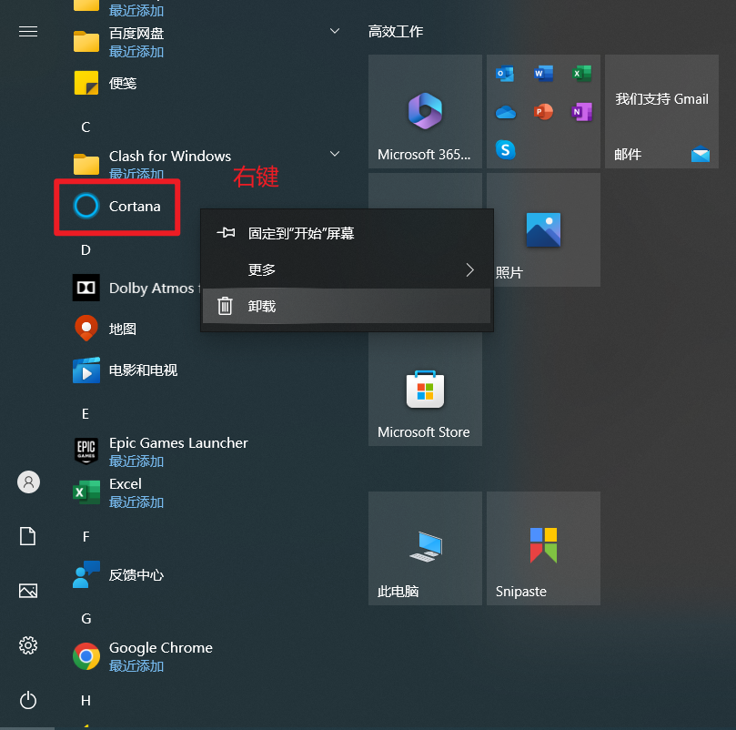
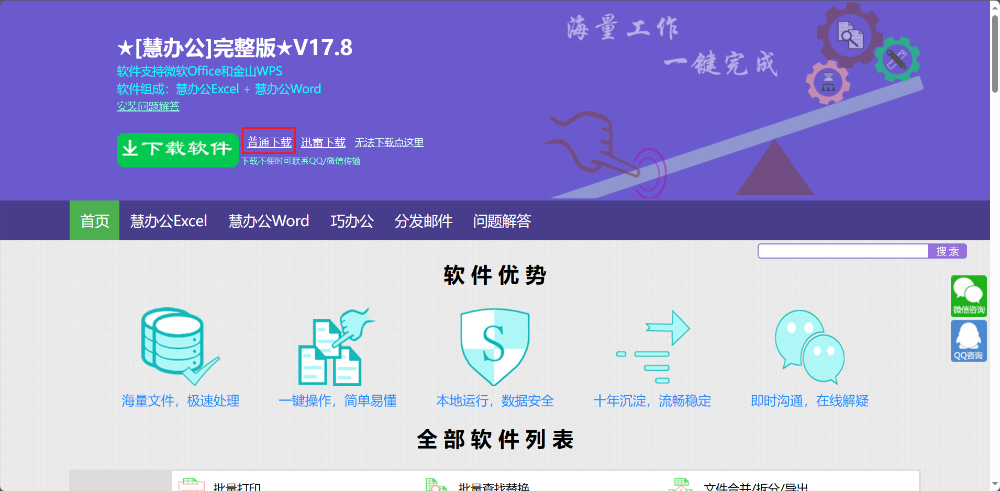

# 1、重装官方纯净系统

## 1.1、启动盘的制作

1. 准备一个大于16GB的空U盘
2. 浏览器输入：==微软官方下载win10==(**记住一定要进入官方网站，找后面带官方两个字的，或者带微软logo的**)

> 网址：
>
> - windows10：https://www.microsoft.com/zh-cn/software-download/windows10
> - windows11：https://www.microsoft.com/zh-cn/software-download/windows11

3. 点击 ==立即下载工具==


4. 下载完毕==右键管理员身份==打开刚才下载的工具，稍微等待一会，点击接受


5. 点击==为另一台电脑创建安装介质==


6. 系统版本我们使用默认即可，点击下一步


7. 选择==U盘==选型


8. 选中自己的U盘，点击下一步【注意：若没有显示U盘，则检查U盘是否有问题，或者插入USB接口是否有问题】


9. 等待下载，进度等待到100%，弹出如下字样，点击完成即可


这样我们的启动盘就制作好啦！


## 1.2、电脑设置开机U盘启动

1. 将制作好的U盘插在需要装系统的电脑中
2. 电脑开机后一般默认是硬盘启动，我们需要将电脑设置为U盘启动，**第一种方法很简单**：在电脑开机的时候疯狂按U盘快捷启动键，比如我是联想拯救者，那么联想电脑的U盘快捷启动键是F12，那么我开机的时候一直按F12

> 如果未成功可以重启再次按键，注意：部分笔记本的F1 ~ F12 是需要搭配 Fn 键使用的，也就是在启动的时候需要按的快捷键是 `Fn + F12 ` ，这个自己可以试试自己的电脑

3. 选择 USB 启动即可（例如：下图是微星主板的开启启动方式，选择 uefi 开头的U盘，回车即可）


---

**第二种方式**：==在主板bios设置U盘为第一启动项==

1. 在电脑开机时不停的按 `Delete` 键，进入主板 bios 界面
2. 在主界面中找到 `Boot Priority` 界面，是启动优先级设置的意思


3. 选择我们的U盘，点击后不要松开，拖动到第一位置上，然后回车！

   

## 1.3、系统安装

1. 基本一直点击下一步即可，在激活Windows这里，选择 ==我没有产品密钥==


2. 安装类型这里我们选择 ==自定义==


3. 可以分别点击所有分区，然后点击删除，使其恢复成为一个新硬盘的样子，可以点击新建，自己设置分配大小，然后点击应用


4. 这里的主分区就是我们的C盘，如下图分区1和分区2是系统保留分区，我们不用管它。我们这里只分一个C盘，其余分盘操作我们装好系统后再进行分盘。==我们选择主分区，然后点击下一页==


5. 等待安装完毕即可
6. **电脑安装完成之后会自动重启，然后就OK啦**

## 1.4、磁盘分区

1. 进入系统后我们在桌面点击鼠标右键，选择==个性化==，然后点击==主题==，点击==桌面图标设置==，选择自己需要在桌面保留的图标


2. 在==此电脑==鼠标右键，选择==管理==，选择磁盘管理（当然我这里是已经分配好的）


3. 右键==未分配空间==，选择==新建简单卷==


4. 点击下一页，输入想要分配的磁盘大小，点击下一页，选择分配的驱动器号，我们这里设置为D盘


5. 格式化这里，**文件系统选择 NTFS，分配单元大小选择 4096**


6. 然后点击下一步，完成！


## 1.5、驱动安装

1. 微软官方的系统其实默认已经集中了各种主板的驱动，我们电脑连接上网络后，其实系统已经在帮我们更新下载驱动了，点击==开始==菜单，选择==设置==，选择==更新和安全==


2. 选择 ==Windows更新==，右侧就会看到所有安装的驱动的进度。

> 但是其实系统自己下载的驱动不一定是最新版本的，但是可以满足需求了。如果有特殊要求的，可以到各硬件的官网下载专业的驱动，或者使用第三方软件一键安装

3. 我因为是联想电脑，所以下载一个==联想电脑管家==，选择==驱动更新==


# 2、重装后的设置优化

## 2.1、桌面图标设置

1. 桌面右键 -> 个性化 -> 主题 ->桌面图标设置


## 2.2、取消软件运行弹出弹窗

1. 控制面板 -> 系统与安全 -> 更改用户账户控制设置


2. 拉到最下面- >确定


## 2.3、任务栏对齐方式(Windows11)

1. 个性化 -> 任务栏 -> 任务栏行为 -> 任务栏对齐方式 -> 选择左
2. 任务栏项 -> 可以将不用的小组件关掉


## 2.4、隐私与安全(Windows11)

1. 设置 -> 隐私与安全性 -> 常规 -> 关闭


## 2.5、卸载原装软件

1. 开始菜单 -> 选择自己不需要的原装软件右键 -> 卸载




# 3、常用软件的安装

1. 办公软件：
   - Office -> 神龙kms
   - WPS 
   - PDF -> Adobe Acrobat Pro DC
   - 看图软件 -> ImageGlass
   - Clash for Windows
2. 截图软件：Snipaste
3. 效率软件：uTools
4. 影视软件：PotPlayer
5. 笔记软件：Typora/Obsidian
   - Obsidian插件站：ob插件汇总、obsidian中文论坛
6. 卸载工具：Geek
7. 任务栏透明：TranslucentTB (Microsoft Store 搜索下载)
8. 手机电脑互传软件：
   - Iphone：爱思助手
   - 安卓：
9. 屏幕录制软件：班迪录屏机 Bandicam
10. 远程控制：向日葵
11. 鼠标右键菜单管理工具：ContextMenuManager
11. 工作专用：IDEA，插件如下
    - Chinese(Simplified)... 中文语言包
    - Translation	翻译
    - Key Promoter X  快捷键提示插件
    - Rainbow bracket 彩虹括号插件
    - Code Glance 代码小地图
    - WakaTime 代码统计插件(安装插件后去官网申请API的Key)
    - Tabnine AI Code Completion 代码智能补全
    - Alibaba Java Coding Guidelines 阿里巴巴编码规范检查工具


## 3.1、软件缓存设置

所有的软件都有缓存目录，我们在安装一个软件后一定要更换缓存目录，因为默认基本都是C盘，这样会使得C盘越来越大，拖慢电脑速度，**以Edge浏览器为例**：

1. 设置 -> 下载-> 更改位置


> 其余软件更换缓存地址类似！


## 3.1、Typora设置

1. 文件 -> 偏好设置 -> 通用 -> 勾选==自动保存==，取消勾选 ==自动检查更新==
2. 编辑器 -> 勾选 ==匹配括号和引号，匹配Markdown字符==，==不适用拼写检查=
3. 图像 -> ==复制图片到/${filename}.assets文件夹==，勾选前四个勾
4. Markdown -> 扩展语法==全部勾选==


## 3.2、VSCode优化设置

1. 左下角齿轮 -> 设置 -> 右上角打开 json 文件

 

2. 在 settings.json 中粘贴如下代码，将鼠标防止对应代码处，VsCode会显示中文含义

```json
{
  "files.autoSave": "afterDelay",
  "files.autoGuessEncoding": true,
  "workbench.list.smoothScrolling": true,
  "editor.cursorSmoothCaretAnimation": true,
  "editor.smoothScrolling": true,
  "editor.cursorBlinking": "smooth",
  "editor.mouseWheelZoom": true,
  "editor.formatOnPaste": true,
  "editor.formatOnType": true,
  "editor.formatOnSave": true,
  "editor.wordWrap": "on",
  "editor.guides.bracketPairs": true,
  //"editor.bracketPairColorization.enabled": true, (此设置vscode在较新版本已默认开启)
  "editor.suggest.snippetsPreventQuickSuggestions": false,
  "editor.acceptSuggestionOnEnter": "smart",
  "editor.suggestSelection": "recentlyUsed",
  "window.dialogStyle": "custom",
  "debug.showBreakpointsInOverviewRuler": true,
}
```


3. 插件推荐：[vscode优化使用体验篇（设置 | 插件）_cursor vscode_Star-tears的博客-CSDN博客](https://blog.csdn.net/qq_51173321/article/details/126287293)

我自己所在用的插件如下：

| 插件名                          | 备注                                                         |
| ------------------------------- | ------------------------------------------------------------ |
| Chinese                         | 中文                                                         |
| CodeSnap                        | 好看的代码截图插件                                           |
| One Dark Pro / Dracula Official | 暗黑色调主题 / 一款很有特点的吸血鬼主题                      |
| Material Icon Theme             | 图标主题                                                     |
| Material Icon Theme             | 错误提示插件                                                 |
| Path Intellisense               | 路径补全                                                     |
| Image preview                   | 图像预览                                                     |
| Image preview                   | 代码格式化插件                                               |
| Doxygen Documentation Generator | 文档生成器插件                                               |
| Live Server                     | 代码预览插件                                                 |
| 中文标点符号转英文              | 中文标点符号转英文                                           |
| Tabnine                         | AI代码补全                                                   |
| paste image                     | 适合写md时粘贴图片到md中                                     |
| bracket pair color DLW          | 彩虹括号                                                     |
| indent-rainbow                  | 缩进彩色显示                                                 |
| color highlight                 | 写代码颜色预览(在设置里面搜索 `marker type` ，将其改为 dot-before) |
| Eslint                          | 检查是否按照ES6的语法编程                                    |

​	

```bash
mklink /d "C:\Users\Augenestern\AppData\Roaming\Apple Computer\MobileSync";     "D:\cache\iTunes\MobileSync"
```


## 3.3、Obsidian插件

我所使用的插件如下：

| 插件名                    | 备注                 |
| ------------------------- | -------------------- |
| Commander                 | 添加按钮             |
| Easy Typing               | 提升Markdown书写体验 |
| Editing Toolbar           | 富文本               |
| File Explorer Note Count  | 文件夹下数量显示     |
| Kanban                    | 看板                 |
| Markdown Table Editor     | 创建表格工具         |
| Quiet Outline             | 大纲更好看           |
| Status Bar Pomodoro Timer | 番茄时钟             |
| Calendar                  | 日历插件             |

> 入门食用：
>
> - [obsidian小白指南 | obsidian文档咖啡豆版 (coffeetea.top)](https://coffeetea.top/zh/documentation/obsidian-guide.html)


## 3.4、WebStrom插件

> 记得设置以管理员方式运行WebStrom，否则终端会不能支持某些命令。
>
> 1. 以管理员身份运行webstorm;
> 2. 执行：`get-ExecutionPolicy`，显示`Restricted`，表示状态是禁止的;
> 3. 执行：`set-ExecutionPolicy RemoteSigned`;
> 4. 这时再执行`get-ExecutionPolicy`，就显示RemoteSigned;


| 插件                | 描述       |
| ------------------- | ---------- |
| Chinese             | 中文汉化   |
| Atom Material Icons | 侧边栏图标 |
| Rainbow Brackets    | 彩虹括号   |
| Dracula Theme       | 德古拉主题 |
| Gitee               | 码云插件   |
| Tabnine             |            |


## 3.5、WPS设置

1. 设置 - 在线文档浏览设置 - 更改文件下载默认保存位置


### 3.5.1、WPS插件

1. 文档：达观助手：[达观助手-智能写作专家 (datagrand.com)](http://www.datagrand.com/products/datagrand-copilot/)


2. 文档类：不坑盒子


3. Excel类：惠办公：[慧办公-官网 (hbg666.com)](https://www.hbg666.com/)




4. PPT类：[iSlide- 让PPT设计简单起来 | PPT模板下载平台](https://www.islide.cc/)


# 4、浏览器插件

1. `AdGuard 广告拦截器`  -> 拦截浏览器广告


2. `Simple Allow Copy `-> 解除网页复制限制，使用时点击插件启用即可
3. `用于搜索引擎的Chatgpt助手`  -> 在网页搜索问题右侧栏显示 Chatgpt 的回答
4. `WeTab新标签页` -> 美化新标签页
5. `Tampermonkey` -> 油猴
   - [Bilibili] 关注管理器
6. `购物党自动比价工具`
4. `Global Speed` -> 视频速度控制


