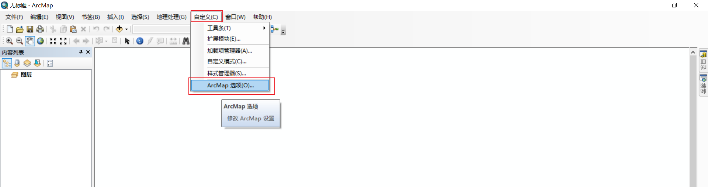

ArcGis是一款地理信息系统的软件，用来处理空间数据比较厉害的一款软件。这里简单记录`V10.8`版本的==下载安装破解汉化以及一些缓存设置==。这里介绍一下10.8版本，最新的不是最稳定的版本，但是个人认为对于学习而言，还是学习新版本比较好，等需要做一些项目时，再去切换到稳定版本。

> 因为本学期课程设计的需要，所以需要做一些有关ArcGIS的空间数据分析。之前一直用的10.2版本，感觉不顺手，所以换到10.8版本。我的电脑环境如下
>
> - Windows 10
> - ArcGIS 10.8

# 1、下载

下载链接很多，很多都是度盘分享的，这里我存了一份微云下载，下载速度能稍微快一些

- 微云：链接：https://share.weiyun.com/NKZDHHAc 密码：92kpz4
- 度盘：链接：https://pan.baidu.com/s/1qkUqtvDGtthb5MDPpoLMZA 密码：7711

# 2、安装

1. 解压下载好的压缩包

2. 右键->以管理员身份运行 `ArcGIS_Desktop_10.8.exe`

3. 选择解压位置，不要装在C盘，==注意路径里面不要包含中文，建议和我一样全英文==然后 Next

4. 默认勾选启动安装程序，我们点击 Close

5. 稍作等待会自动弹出安装框，按照下图进行选择即可

> ArcGIS Desktop 还需要 Python 解释器的支持，可能是软件内部分算法是用 Python 语言写的，我们最好也更改位置，别放在C盘即可

OK，到这里就静静等待安装即可，因电脑而异所以等待时间不同，安装好了就可以进行下面破解了

# 3、破解

1. 安装完成点击finish，点击 Cancel

2. 在开始菜单选择 ArcMap10.8，右键->打开文件所在位置

3. OK，现在找到我们==解压包==下的破解文件，将包含的 dll 文件替换。也就是复制破解文件中的dll文件，在ArcGIS 安装目录进行粘贴

OK，现在其实已经大功告成了，只是可能英文界面对于初学者不太友好，下面是对软件进行汉化。

# 4、汉化

1. 打开解压包下面的 `zh_CN`目录，右键安装 `DesktopChinese_CN.msi`

2. 等待其安装成功就大功告成了

# 5、启动

ArcGIS安装完成后桌面是不会自动生成快捷方式的，启动时只需在开始菜单找到ArcMap启动即可，当然你也可以将其直接拖到桌面，会自动生成桌面快捷方式。

第一次启动都会比较慢，静静等就好了

# 6、更改缓存路径

ArcGIS的所有默认缓存都在C盘，这样使用下去C盘只会越来越小，最终成为"C盘战士"，所以最好在使用任何软件前将其缓存路径换成其他盘。

1. 自定义->ArcMap选项

2. 显示缓存 -> 更改位置，共享 -> 更改位置

3. 目录 -> 目录选项 -> 主目录文件夹

4. OK，然后重启ArcMap，关闭软件时会弹出==是否保存到无标题==，直接不保存。再次打开软件会发现工作空间已经换成了D盘，这样就可以随意使用了，以后所有的缓存什么的都会在D盘了。

# 7、ArcGIS10.8帮助文档

1. 在打开软件界面，点击==这是什么？==

2. 稍作等待，会弹出ArcGIS帮助文档

