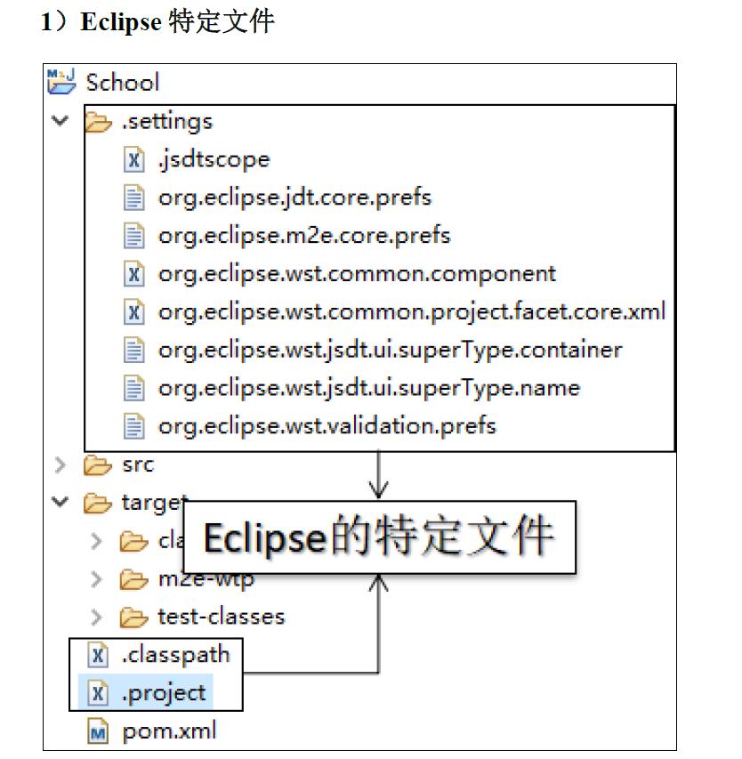
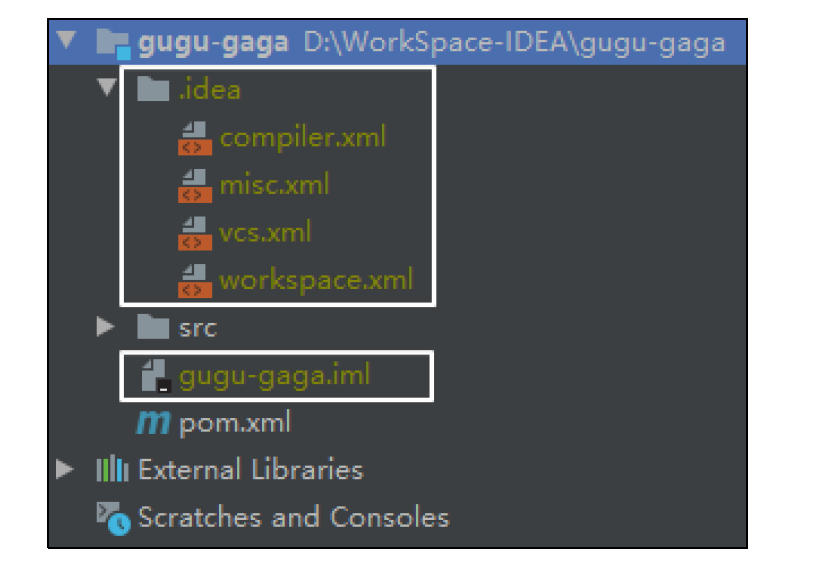
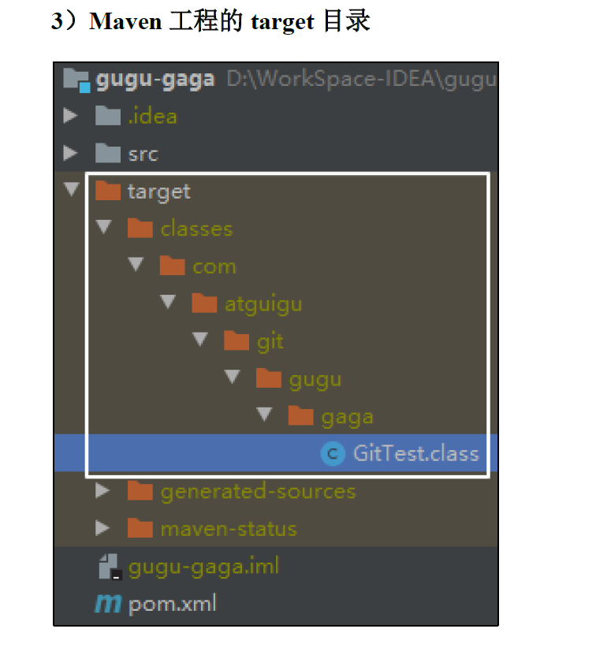

# 1、IDEA集成Git

## 1.1、配置Git忽略文件

我们的Eclipse 、IDEA都会生成一些无关文件，如图









我们之所以要忽略他们，是因为他们与项目的实际功能无关，不参与服务器上部署运行。如何忽略他们？

1. 在用户家(C/User/用户名) 下创建 `git.ignore`

```
# Compiled class file
*.class

# Log file
*.log

# BlueJ files
*.ctxt

# Mobile Tools for Java (
.mtj.

# Package Files
*.jar
*.war
*.nar
*.ear
*.zip
*.tar.gz
*.rar

# virtual machine crash logs, see
http://www.java.com/en/download/help/error_hotspot.xml
hs_err_pid*

.classpath
.project
.settings
target
.idea
*.iml
```

.assets/4.png)

2. 在 .gitconfig 文件中引用忽略配置文件(.gitconfig 在家目录中)

```
[user]
	name = Augenestern
	email = .....@qq.com
[core]
	excludesfile = C:/Users/Augenestern/git.ignore
```

.assets/5.png)


3. 在 IDEA 里面定位

.assets/6.png)


## 1.2、IDEA初始化本地库

.assets/7.png)

默认创建的 git 仓库就是我们打开的项目所在的目录，我们添加了 git 仓库之后

.assets/8.png)


.assets/9.png)

添加到暂存区就变为了绿色，我们可以写些代码，然后将 project 添加到暂存区

.assets/10.png)

我们添加到暂存区，再接着进行提交到本地库

.assets/11.png)


.assets/12.png)


## 1.3、切换版本

我们修改 GitTest 中的代码，再次提交到本地库

.assets/13.png)


在IDEA的左下角，点击 Git，然后点击 Log查看版本，右键选择要切换的版本，然后在菜单里点击  Checkout Revision

.assets/14.png)


## 1.4、创建分支

右键项目 -> Git -> Branches

.assets/15.png)

在弹出的Git Branches框里 点击 New Branch按钮。

.assets/16.png)

填写分支名称

.assets/17.png)

然后再 IDEA的右下角看到 hot-fix，说明分支创建成功，并且当前已经切换成 hot-fix分
支

.assets/18.png)


## 1.5、切换分支

在IDEA窗口的右下角，切换到 master分支 。

.assets/19.png)


## 1.6、合并分支

在IDEA窗口的右下角，将 hot-fix分支合并到当前 master分支。

.assets/20.png)


如果代码没有冲突，分支直接合并成功，分支合并成功以后，代码自动提交，无需手动提交本地库


## 1.7、合并分支冲突

如图所示，如果master分支和 hot-fix分支都修改了代码，在合并分支的时候就会发生冲突。


.assets/21.png)


.assets/22.png)

我们现在站在master分支上合并 hot-fix分支，就会发生代码冲突。

点击 Conflicts框里的 Merge按钮，进行手动合并代码。

.assets/23.png)

手动合并完代码以后，点击右下角的 Apply按钮。代码冲突解决，自动提交本地库。


# 2、IDEA集成Github

.assets/24.png)


Token在哪呢？我们在 Github 点击 Settings -> Develop Settings

.assets/25.png)


.assets/26.png)


点击 Generate token

.assets/27.png)


.assets/28.png)


## 2.1、分享项目到Github

.assets/29.png)

这其实就是创建远程库，名字，是否私有，描述等

.assets/30.png)


## 2.2、push推送本地库到远程库

右键点击项目，可以将当前分支的内容 push 到 GitHub的远程仓库中 。

.assets/31.png)


.assets/32.png)


.assets/33.png)


## 2.3、pull拉取远程库到本地库

注意：push是将本地库代码推送到远程库，如果本地库代码跟远程库代码版本不一致，push的操作是会被拒绝的。也就是说， 要想 push成功，一定要保证本地 库的版本要比远程库的版本高！ 因此一个成熟的程序员在动手改本地代码之前，一定会先检查下远程库跟本地代码的区别！如果本地的代码版本已经落后，切记要先 pull拉取一下远程库的代码，将本地代码更新到最新以后，然后再修改，提交，推送！

- 右键点击项目，可以将远程仓库的内容pull到本地仓库 。

.assets/34.png)


注意：pull是拉取远端仓库代码到本地，如果远程库代码和本地库代码不一致，会自动合并，如果自动合并失败，还会涉及到手动解决冲突的问题。


## 2.4、clone克隆远程库到本地库

.assets/35.png)


.assets/36.png)


# 3、IDEA集成Gitee

## 3.1、IDEA安装码云插件

Idea 默认不带码云插件，我们第一步要安装 Gitee插件。

.assets/37.png)

安装完成重启 IDEA 即可

Idea连接码云和连接 GitHub几乎一样，首先在 Idea里面创建一个工程，初始化 git工程，然后将代码添加到暂存区，提交到本地库。

.assets/38.png)


## 3.2、分享项目到Gitee

.assets/39.png)


## 3.2、push推送到码云远程库

当然我们也可以自己在码云Gitee上创建远程库，然后获取到远程库的 HTTPS/SSH 链接，将我们的代码 push 即可

自定义远程库链接： Define remote，给远程库链接定义个 name，然后再 URL里面填入码云远程库的 HTTPS链接即可，码云服务器在国内，用 HTTPS 链接即可，没必要用 SSH 免密链接

.assets/40.png)


## 3.3、pull拉取远程库到本地库

我们在远程库修改代码，然后使用本地库 pull 拉取远程库的代码

.assets/41.png)


.assets/42.png)


.assets/43.png)


## 3.4、clone克隆远程库到本地库

.assets/35.png)


.assets/44.png)


# 4、码云复制Github项目

码云提供了直接复制 GitHub 项目的功能，方便我们做项目的迁移和下载 。

.assets/45.png)

将 GitHub的远程库 HTTPS链接复制过来，点击创建按钮即可。

.assets/46.png)

如果GitHub项目更新了以后，在码云项目端可以手动重新同步，进行更新！

.assets/47.png)


