# 1、Docker


- **官方文档地址**:https://www.docker.com/get-started 
- **中文参考手册**：http://www.dockerinfo.net/document

- docker将程序以及程序所有的依赖都打包到docker container，这样你的程序可以在任何环境都会有一致的表现
- `build once, run everywhere`,无论运行在什么环境下程序的行为都是一致的

## 1.1、Docker解决依赖兼容问题

我们来回顾一下应用部署的环境问题：

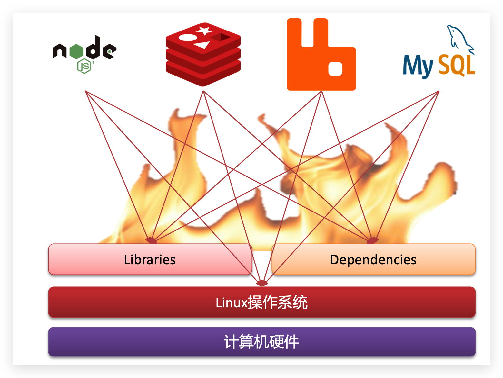

例如一个项目中，部署时需要依赖于node.js、Redis、RabbitMQ、MySQL等，这些服务部署时所需要的函数库、依赖项各不相同，甚至会有冲突。给部署带来了极大的困难。而Docker确巧妙的解决了这些问题，Docker为了解决依赖的兼容问题的，采用了两个手段：

- 将应用的Libs（函数库）、Deps（依赖）、配置与应用一起打包
- 将每个应用放到一个隔离**容器**去运行，避免互相干扰


这样打包好的应用包中，既包含应用本身，也保护应用所需要的Libs、Deps，无需再操作系统上安装这些，自然就不存在不同应用之间的兼容问题了。虽然解决了不同应用的兼容问题，但是开发、测试等环境会存在差异，操作系统版本也会有差异，怎么解决这些问题呢？


## 1.2、Docker解决操作系统环境差异

要解决不同操作系统环境差异问题，必须先了解操作系统结构。以一个Ubuntu操作系统为例，结构如下：


Ubuntu和CentO都是基于Linux内核，无非是系统应用不同，提供的函数库有差异：

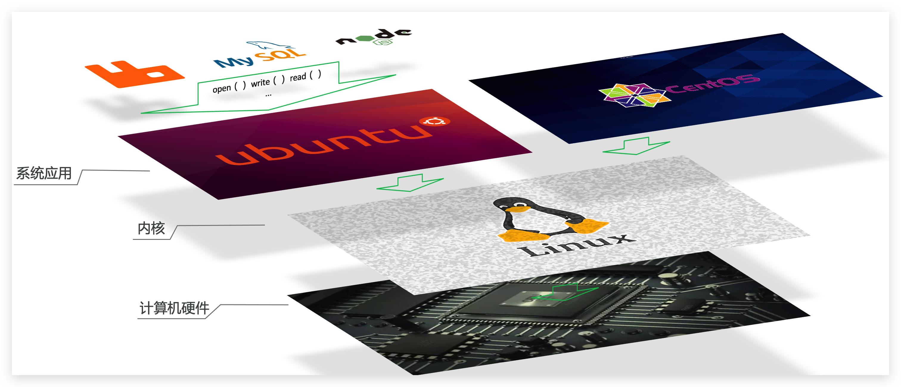


此时，如果将一个Ubuntu版本的MySQL应用安装到CentOS系统，MySQL在调用Ubuntu函数库时，会发现找不到或者不匹配，就会报错了，Docker如何解决不同系统环境的问题？

- Docker将用户程序与所需要调用的系统(比如Ubuntu)函数库一起打包
- Docker运行到不同操作系统时，直接基于打包的函数库，借助于操作系统的Linux内核来运行


## 1.3、Docker的优势

- **环境一致、高效迁移**: 如：我们一个java Web应用程序涉及很多东西，比如jdk、tomcat、mysql等软件环境。当这些其中某一项版本不一致的时候，可能就会导致应用程序跑不起来这种情况。Docker则将程序以及使用软件环境直接绑定在一起，无论在那个机器上保证了环境一致。
- **进程级隔离、容器独立**:如：服务器自己的程序挂了，结果发现是别人程序出了问题把内存吃完了，自己程序因为内存不够就挂了这种也是一种比较常见的情况，如果你的程序重要性不是特别高的话，公司基本上不可能让你的程序独享一台服务器的，这时候你的服务器就会跟公司其他人的程序共享一台服务器，所以不可避免地就会受到其他程序的干扰，导致自己的程序出现问题。Dock就很好解决了环境隔离的问题，别人程序不会影响到自己的程序。
- **镜像机制、便于部署**：公司要弄一个活动，可能会有大量的流量进来，公司需要再多部署几十台服务器。在没有Docker的情况下，要在几天内部署几十台服务器，这对运维来说是一件非常折磨人的事，而且每台服务器的环境还不一定一样，就会出现各种问题，最后部署的头皮发麻。用Dock的话，我只需要将程序打包到镜像，你要多少台服务，我就给跑多少容器，极大地提高了部署效率。


## 1.4、Docker和虚拟机区别

- **虚拟机**（virtual machine）是在操作系统中**模拟**硬件设备，然后运行另一个操作系统，比如在 Windows 系统里面运行 Ubuntu 系统，这样就可以运行任意的Ubuntu应用了。。
- **Docker**仅仅是封装函数库，并没有模拟完整的操作系统，如图：


|             | 传统虚拟机                           | Docker容器                            |
| ----------- | ------------------------------------ | ------------------------------------- |
| 磁盘占用    | 几个GB - 几十个GB                    | 几十MB - 几百MB                       |
| CPU内存占用 | 虚拟操作系统非常占用CPU和内存        | Docker引擎占用极低                    |
| 启动速度    | 从开机到启动项目几分钟               | 从开启容器到运行项目几秒              |
| 安装管理    | 需要专门的运维技术                   | 安装、管理方便                        |
| 应用部署    | 每次部署都费时费力                   | 从第二次部署开始轻松简捷              |
| 耦合性      | 多个应用服务安装到一起，容易互相影响 | 每个应用一个容器，达成隔离            |
| 系统依赖    | 无                                   | 需求相同或相似的内核，目前推荐是Linux |


## 1.5、总结

Docker如何解决大型项目依赖关系复杂，不同组件依赖的兼容性问题？

- Docker允许开发中将应用、依赖、函数库、配置一起**打包**，形成可移植镜像
- Docker应用运行在容器中，使用沙箱机制，相互**隔离**

Docker如何解决开发、测试、生产环境有差异的问题？

- Docker镜像中包含完整运行环境，包括系统函数库，仅依赖系统的Linux内核，因此可以在任意Linux操作系统上运行


## 1.6、DockerHub

开源应用程序非常多，打包这些应用往往是重复的劳动。为了避免这些重复劳动，人们就会将自己打包的应用镜像，例如Redis、MySQL镜像放到网络上，共享使用，就像GitHub的代码共享一样。

- DockerHub：DockerHub是一个官方的Docker镜像的托管平台。这样的平台称为Docker Registry。
- 国内也有类似于DockerHub 的公开服务，比如 [网易云镜像服务](https://c.163yun.com/hub)、[阿里云镜像库](https://cr.console.aliyun.com/)等。

我们一方面可以将自己的镜像共享到DockerHub，另一方面也可以从DockerHub拉取镜像：


## 1.7、Docker架构

Docker是一个CS架构的程序，由两部分组成：

- **服务端(server)：**Docker守护进程，负责处理Docker指令，管理镜像、容器等
- **客户端(client)：**通过命令或RestAPI向Docker服务端发送指令。可以在本地或远程向服务端发送指令。

如图：

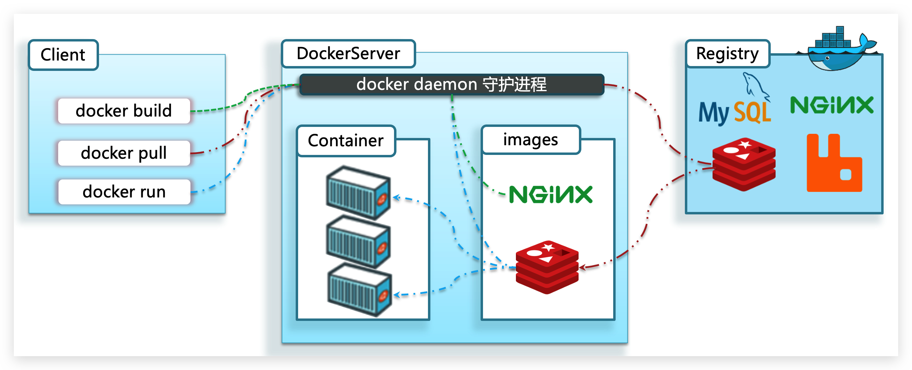


# 2、Docker的安装 - Centos


1. 如果系统中已经存在旧的Docker，则先卸载：

```bash
yum remove docker \
    docker-client \
    docker-client-latest \
    docker-common \
    docker-latest \
    docker-latest-logrotate \
    docker-logrotate \
    docker-engine
```

2. 配置Docker的yum库

```bash
# 安装yum
yum install -y yum-utils
# 配置Docker的yum源
yum-config-manager --add-repo https://download.docker.com/linux/centos/docker-ce.repo
```

3. 安装Docker

```bash
yum install -y docker-ce docker-ce-cli containerd.io docker-buildx-plugin docker-compose-plugin
```

4. 启动和校验

```bash
# 启动Docker
systemctl start docker

# 停止Docker
systemctl stop docker

# 重启
systemctl restart docker

# 设置开机自启
systemctl enable docker

# 执行docker ps命令，如果不报错，说明安装启动成功
docker ps
```

> docker -v 查看版本
>
> docker images 若出现:`Cannot connect to the Docker daemon at unix:///var/run/docker.sock. Is the docker daemon running?`
>
> 说明 docker 没有启动,我们启动docker并设置开机自启:
>
> ```bash
> # 启动Docker
> systemctl start docker
> 
> # 设置开机自启
> systemctl enable docker
> ```
>

## 2.1、镜像加速

由于默认的镜像仓库在国外，所以我们的访问速度非常慢，但是我们可以配镜像加速让我们能更好的拉取镜像。访问阿里云 - 搜索容器镜像服务 - 管理控制台 -  镜像工具 - 镜像加速器 = 按照操作文档的要求配置。

- https://cr.console.aliyun.com/cn-hangzhou/instances/mirrors

```bash
# 创建目录
sudo mkdir -p /etc/docker
# 复制内容，注意把其中的镜像加速地址改成你自己的
sudo tee /etc/docker/daemon.json <<-'EOF'
{
  "registry-mirrors": ["https://h1n33f8q.mirror.aliyuncs.com"]
}
EOF

# 重新加载配置
sudo systemctl daemon-reload

# 重启Docker
sudo systemctl restart docker
```


> Docker 的默认安装位置在 `var/lib/docker` 下,可以使用 `docker -v` 查看版本

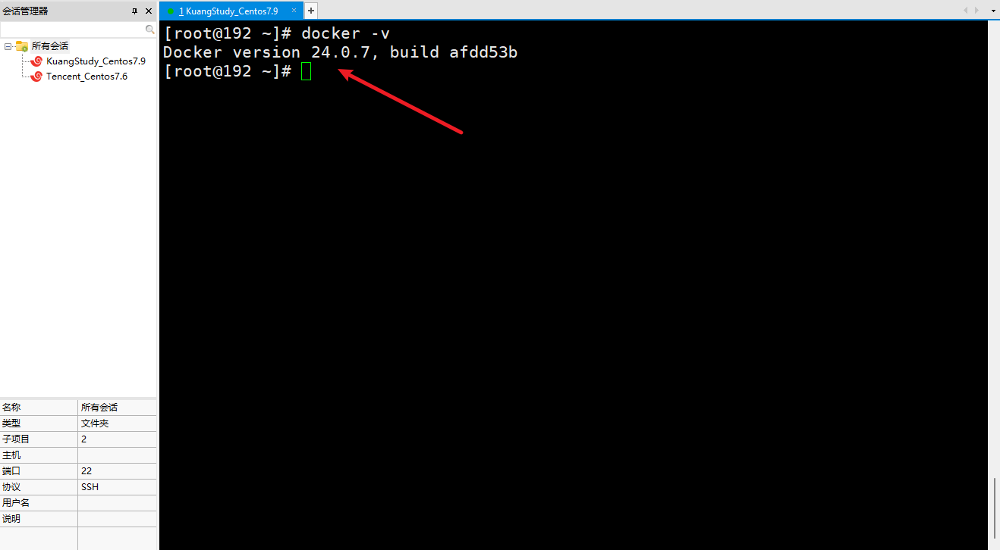


## 2.2、Docker中的核心概念

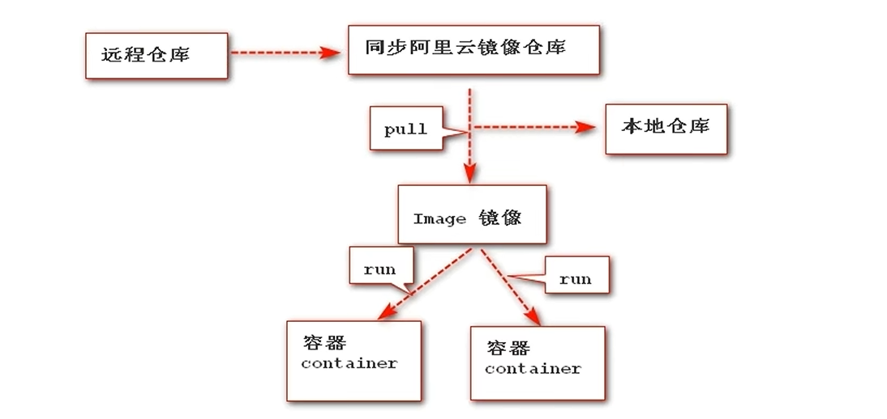


> Docker 容器引擎从远程仓库 Docker Hub 拉取镜像到本地仓库, 使用`run`命令将镜像运行，从而产生对应的容器。`run`两次就会生成两个容器。

1. **镜像Image**: 一个镜像就代表一个软件，例如 MySQL 镜像、redis 镜像 、 mq 镜像。Docker将应用程序及其所需的依赖、函数库、环境、配置等文件打包在一起，称为镜像。

2. **容器 Container**： 一个镜像运行一次就会生成一个容器，容器就是一个运行的软件服务。我们运行两次 Tomcat 镜像，就会生成两个 Tomcat 容器。镜像中的应用程序运行后形成的进程就是**容器**，只是Docker会给容器进程做隔离，对外不可见。
3. **远程仓库 Respostory** : 仓库是用来存储所有软件的镜像位置。例如仓库的web界面 `Docker Hub`，理解为 `Maven Respostory`
4. **本地仓库**: 用来存储在使用 Docker 过程中的相关镜像。可以理解为本地的 `Maven Repo`,一般在 `/var/lib/docker`

5. `dockerFile` : docker 生成镜像配置文件，用来书写自定义镜像的一些配置
6. `tar` ： 一个对镜像打包的文件，日后可以还原成镜像

一切应用最终都是代码组成，都是硬盘中的一个个的字节形成的**文件**。只有运行时，才会加载到内存，形成进程。

- 而**镜像**，就是把一个应用在硬盘上的文件、及其运行环境、部分系统函数库文件一起打包形成的文件包。这个文件包是只读的。
- **容器**呢，就是将这些文件中编写的程序、函数加载到内存中运行，形成进程，只不过要隔离起来。因此一个镜像可以启动多次，形成多个容器进程。

例如你下载了一个QQ，如果我们将QQ在磁盘上的运行**文件**及其运行的操作系统依赖打包，形成QQ镜像。然后你可以启动多次，双开、甚至三开QQ，跟多个妹子聊天。


## 2.3、Hello World

Docker 第一个应用程序是 Hello World

```bash
sudo docker run hello-world                                       
```

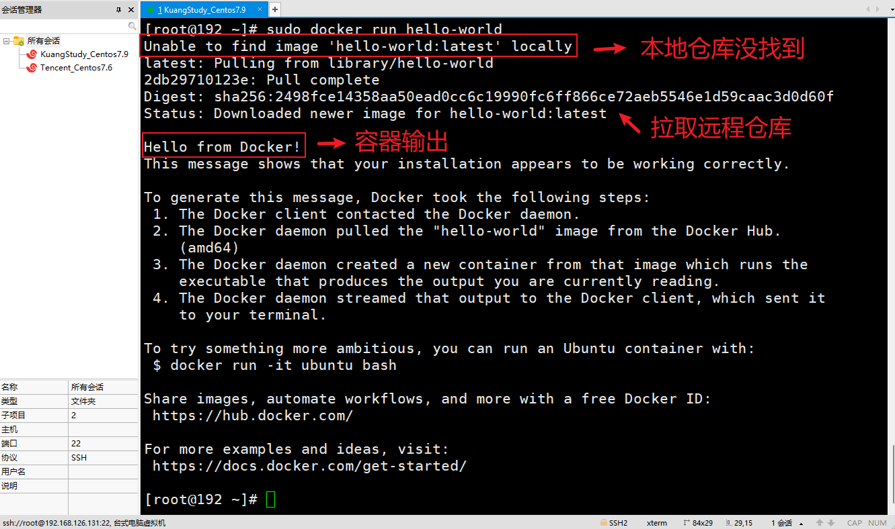

Docker 容器引擎先去找本地仓库是否有 hello-world 镜像的容器，没找到则去远程仓库拉取 hello-world 的镜像，然后执行`run`命令运行，容器输出`Hello from Docker`


# 3、Docker命令

比较常见的命令有：

| **命令**       | **说明**                       | **文档地址**                                                 |
| :------------- | :----------------------------- | :----------------------------------------------------------- |
| docker pull    | 拉取镜像                       | [docker pull](https://docs.docker.com/engine/reference/commandline/pull/) |
| docker push    | 推送镜像到DockerRegistry       | [docker push](https://docs.docker.com/engine/reference/commandline/push/) |
| docker images  | 查看本地镜像                   | [docker images](https://docs.docker.com/engine/reference/commandline/images/) |
| docker rmi     | 删除本地镜像                   | [docker rmi](https://docs.docker.com/engine/reference/commandline/rmi/) |
| docker run     | 创建并运行容器（不能重复创建） | [docker run](https://docs.docker.com/engine/reference/commandline/run/) |
| docker stop    | 停止指定容器                   | [docker stop](https://docs.docker.com/engine/reference/commandline/stop/) |
| docker start   | 启动指定容器                   | [docker start](https://docs.docker.com/engine/reference/commandline/start/) |
| docker restart | 重新启动容器                   | [docker restart](https://docs.docker.com/engine/reference/commandline/restart/) |
| docker rm      | 删除指定容器                   | [docs.docker.com](https://docs.docker.com/engine/reference/commandline/rm/) |
| docker ps      | 查看容器                       | [docker ps](https://docs.docker.com/engine/reference/commandline/ps/) |
| docker logs    | 查看容器运行日志               | [docker logs](https://docs.docker.com/engine/reference/commandline/logs/) |
| docker exec    | 进入容器                       | [docker exec](https://docs.docker.com/engine/reference/commandline/exec/) |
| docker save    | 保存镜像到本地压缩文件         | [docker save](https://docs.docker.com/engine/reference/commandline/save/) |
| docker load    | 加载本地压缩文件到镜像         | [docker load](https://docs.docker.com/engine/reference/commandline/load/) |
| docker inspect | 查看容器详细信息               | [docker inspect](https://docs.docker.com/engine/reference/commandline/inspect/) |

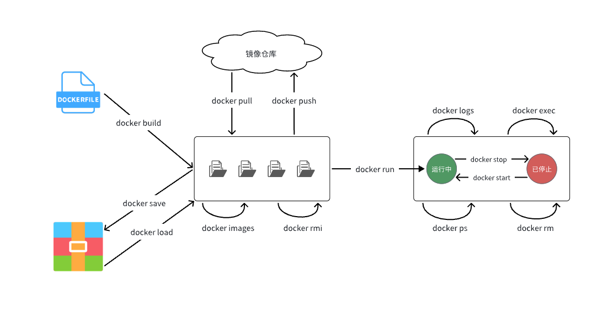

使用`docker pull` 将镜像从远程镜像仓库拉取到本地镜像仓库，使用`docker images` 查看本地镜像仓库的镜像,使用 `docker rmi` 删除本地镜像仓库的镜像，我们自己也可以自己构建镜像，使用 `docker build` 自定义镜像，我们可以使用 `docker save` 将自定义镜像保存成压缩文件，然后别人可以通过`docker load`将自定义镜像加载到他的本地镜像仓库中，或者将自定义镜像`docker push` 推送到远程镜像仓库。

`docker run` 创建并运行容器，`docker stop` 可以停止容器内的进程(例如 mysql 进程),`docker start` 又可以重新启动容器内的进程(例如 mysql 进程),`docker ps` 查看当前容器运行状态,`docker rm` 删除当前容器, `docker logs` 查看容器的日志,`docker exec` 可以进入容器从而对容器作一定的处理。


## 3.0、镜像操作

常见的镜像操作命令如图：


1. 下载镜像: `docker pull [镜像仓库地址/]镜像名[:标签]`

   - 镜像仓库地址和标签是可选的可加可不加。 如果没有指定镜像仓库地址Docker会自动从默认的镜像仓库中下载镜像。 **如果没有指定标签，默认是下载的latest标签的镜像**。


```bash
# 下载mysql镜像latest标签的镜像
docker pull mysql:latest

# 下载nginx镜像,不加标签则默认下载 latest 标签的镜像
docker pull nginx

# 下载mysql镜像5.7标签的镜像
docker pull mysql:5.7
```


2. 列出镜像信息：`docker images [选项]`
   - REPOSITORY 镜像名
   - TAG 镜像标签 
   - IMAGE ID 镜像ID(镜像的唯一标识) 
   - CREATED 镜像创建时间
   - SIZE 镜像大小

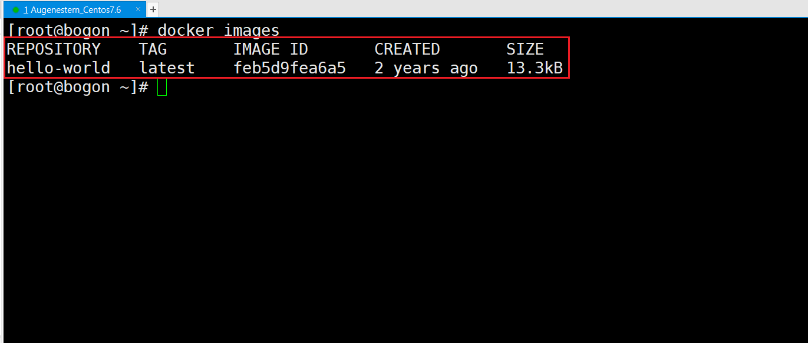

```bash
# 列出镜像的镜像id
docker images -q

# 列出所有镜像的的镜像id
docker images -aq

# 列出所有镜像名为mysql的镜像id
docker images -aq --filter=reference=mysql
```

## 3.1、容器操作

容器操作的命令如图：


容器保护三个状态：

- 运行：进程正常运行
- 暂停：进程暂停，CPU不再运行，并不释放内存
- 停止：进程终止，回收进程占用的内存、CPU等资源

其中：

- docker run：创建并运行一个容器，处于运行状态
- docker pause：让一个运行的容器暂停
- docker unpause：让一个容器从暂停状态恢复运行
- docker stop：停止一个运行的容器
- docker start：让一个停止的容器再次运行
- docker rm：删除一个容器

练习：

3. 列出容器信息：`docker ps [选项]` ，默认显示正在运行的容器信息

```bash
# 列出当前正在运行的容器
docker ps

# 列出所有容器，无论是否在运行
docker ps -a

# 列出所有退出状态的容器
docker ps -f status=exited
```

4. 创建并运行容器：`docker run [options] image [command] [arg...]`
   - options：选项，需重点关注 -d、-p、-v、-e、--restart 这几个选项
   - image：镜像信息，推荐使用 `镜像名：TAG` 的写法,如果只写镜像名，则相当于 TAG 是 latest
   - command：创建容器后要执行的命令
   - arg...：commadn命令的参数

例如：

```bash
# 创建nginx容器并显示所有文件及目录
docker run -d nginx:latest ls -a

docker run --name containerName -p 80:80 -d nginx
```

命令解读：

- `docker run` ：创建并运行一个容器
- `--name` : 给容器起一个名字，比如叫做containerName
- `-p` ：将宿主机端口与容器端口映射，**冒号左侧是宿主机端口，右侧是容器端口**
  - 发布多个端口：`docker run -p 宿主机端口1:容器端口1 -p 宿主机端口2:容器端口2 镜像名`
- `-d`：后台运行容器
  - `-it`：交互式运行
- `nginx`：镜像名称，例如nginx

这里的`-p`参数，是将**容器端口映射到宿主机端口**。**默认情况下，容器是隔离环境，我们直接访问宿主机的80端口，肯定访问不到容器中的nginx**。现在，将容器的80与宿主机的80关联起来，当我们访问宿主机的80端口时，就会被映射到容器的80，这样就能访问到nginx了：


> 小贴士：
>
> - `lsof -i:端口号` ： 可以查看端口占用情况
> - `kill -9 进程ID号` ： 可以杀死进程

5. 删除容器：`docker rm [选项] [容器ID]`

例如：

```bash
docker rm 容器1
docker rm 容器1 容器2

# 删除hello-world的容器
docker rm 容器ID
# 尝试删除所有容器
docker rm -f $(docker ps -aq)

# 尝试删除所有非运行状态的容器
docker ps -f status=exited -q #查询退出状态的容器
docker rm $(docker ps -f status=exited -q) #删除退出状态的容器
```


6. 进入容器执行命令: `docker exec [选项] 容器ID或容器名 命令 [参数...]`

例如：

```bash
docker exec 容器id ls
```

- 进入Nginx容器，修改HTML文件内容，添加"生命是有光的！"

```bash
# 1.进入容器
docker exec -it 容器id bash

# 2.进入nginx的HTML所在目录 /usr/share/nginx/html
cd /usr/share/nginx/html

# 3.查看目录下文件
ls -l

# 4.修改index.html的内容,容器内没有vi命令，无法直接修改，我们用下面的命令来修改
sed -i -e 's#Welcome to nginx#生命是有光的！#g' -e 's#<head>#<head><meta charset="utf-8">#g' index.html

# 5.访问http://虚拟机地址:81
```

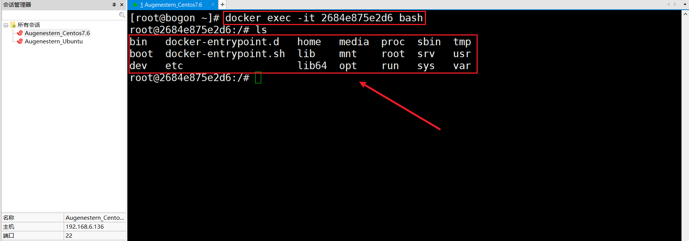

如上图，容器内部会模拟一个独立的Linux文件系统，看起来如同一个linux服务器一样，nginx的环境、配置、运行文件全部都在这个文件系统中，包括我们要修改的html文件。

- 查看 DockerHub 网站中的 nginx 页面，可以知道 nginx 的 html 目录位置在`/usr/share/nginx/html`，我们进入该目录进行修改

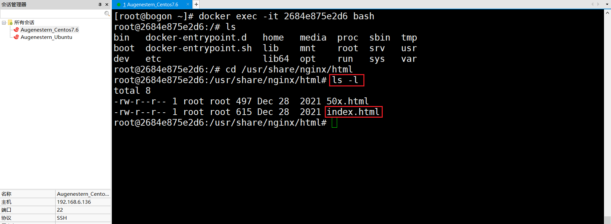


7. 查看容器日志:`docker logs [选项] 容器ID或容器名`

```bash
# 查看nginx容器的日志，要求需要持续显示新的日志
docker logs -f 容器id

# 查看nginx容器的最近20条日志
docker logs -n 20 容器id
```

8. 容器文件拷贝:我们可以使用 docker cp 命令来实现容器和宿主机之间文件和目录的相互拷贝

   - 把容器中的文件拷贝到宿主机中:

   `docker cp [OPTIONS] 容器名:源路径 目的路径`

   - 把宿主机的文件拷贝到容器中

   `docker cp [OPTIONS] 源路径 容器:目的路径`

- 拷贝任意一个文件到nginx容器中

```bash
docker cp /home/cp_test nginx:/home/cp_test
```

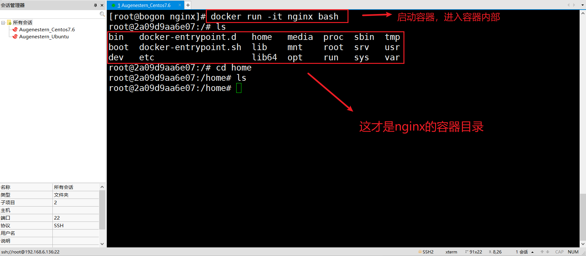

- 把nginx容器中的任意一个文件拷贝到宿主机中

```bash
docker cp nginx:/usr/share/nginx/html/index.html /home/index.html
```


9. 停止容器：`docker stop [选项] [容器ID或容器名...]`

```bash
# 停止一个后台运行的nginx容器
docker stop 容器id
```

10. 运行容器：`docker start [选项] 容器ID或容器名`

```bash
# 运行一个被停止的nginx容器
docker start 容器id
```

11. 设置环境变量
    - 为什么要用：容器中某些变量不能直接写死，需要让使用者在创建容器的时候指定，这种情况镜像中一般是定义环境变量来使用。例如 mysql 容器的 root 密码。遇到这种镜像创建的容器就可以使用 -e 来设置环境变量的值
    - 用法：`docker run -e 变量名=变量值 镜像名`

练习：后台运行一个mysql5.7的容器，要求容器中的mysql可以被外部连接，mysql容器的数据需要持久化存储，不能因为容器被删除而丢失。mysql的root用户的密码设置为 sangeng

```bash
# -d 以后台方式运行
# -p 端口映射
# -v 宿主机:容器目录
# -e 设置环境变量
docker run -d -p 3306:3306 -v /home/datadir:/var/lib/mysql -e MYSQL_ROOT_PASSWORD=sangeng mysql:5.7
```


## 3.2、Docker命令起别名

给常用Docker命令起别名，方便我们访问：

1. 修改/root/.bashrc文件

```bash
# 修改/root/.bashrc文件
vi /root/.bashrc
```

2. 修改为如下代码:

```bash
.bashrc

# User specific aliases and functions

alias rm='rm -i'
alias cp='cp -i'
alias mv='mv -i'
alias dps='docker ps --format "table {{.ID}}\t{{.Image}}\t{{.Ports}}\t{{.Status}}\t{{.Names}}"'
alias dis='docker images'

# Source global definitions
if [ -f /etc/bashrc ]; then
        . /etc/bashrc
fi
```

3. 保存后执行命令使别名生效

```bash
source /root/.bashrc
```


4. 使用别名

```bash
# 查看运行中容器
dps

# 查看本地镜像
dis
```


## 3.3、示例:部署MySQL

1. 在XShell命令行输入:

```bash
docker run -d \
  --name mysql \
  -p 3306:3306 \
  -e TZ=Asia/Shanghai \
  -e MYSQL_ROOT_PASSWORD=123 \
  mysql
```

- `docker run -d` ：创建并运行一个容器，`-d`则是让容器以后台进程运行
- `--name mysql ` : 给容器起个名字叫`mysql`，你可以叫别的
- `-p 3306:3306` : 设置端口映射。
  - **容器是隔离环境**，外界不可访问。但是可以将**宿主机端口映射容器内到端口**，当访问宿主机指定端口时，就是在访问容器内的端口了。
  - 容器内端口往往是由容器内的进程决定，例如MySQL进程默认端口是3306，因此容器内端口一定是3306；而宿主机端口则可以任意指定，一般与容器内保持一致。
  - 格式： `-p 宿主机端口:容器内端口`，示例中就是将宿主机的3306映射到容器内的3306端口
- `-e TZ=Asia/Shanghai` : 配置容器内进程运行时的一些参数
  - 格式：`-e KEY=VALUE`，KEY和VALUE都由容器内进程决定
  - 案例中，`TZ=Asia/Shanghai`是设置时区；`MYSQL_ROOT_PASSWORD=123`是设置MySQL默认密码
- `mysql` : 设置**镜像**名称，Docker会根据这个名字搜索并下载镜像
  - 格式：`REPOSITORY:TAG`，例如`mysql:8.0`，其中`REPOSITORY`可以理解为镜像名，`TAG`是版本号
  - 在未指定`TAG`的情况下，默认是最新版本，也就是`mysql:latest`

# 4、数据卷

容器是隔离环境，容器内程序的文件、配置、运行时产生的容器都在容器内部，我们要读写容器内的文件非常不方便。大家思考几个问题：

- 如果要升级MySQL版本，需要销毁旧容器，那么数据岂不是跟着被销毁了？
- MySQL、Nginx容器运行后，如果我要修改其中的某些配置该怎么办？
- 我想要让Nginx代理我的静态资源怎么办？

因此，容器提供程序的运行环境，但是**程序运行产生的数据、程序运行依赖的配置都应该与容器解耦**。


## 4.0、什么是数据卷

**数据卷（volume）**是一个虚拟目录，是**容器内目录**与**宿主机目录**之间映射的桥梁。

1. 为什么要用：在之前的nginx案例中，修改nginx的html页面时，需要进入nginx内部。并且因为没有编辑器，修改文件也很麻烦。这就是因为容器与数据（容器内文件）耦合带来的后果。要解决这个问题，必须将数据与容器解耦，这就要用到数据卷了。
2. 概念理解：**将宿主机目录或文件挂载到容器中，实现宿主机和容器之间的数据共享和持久化**

**数据卷（volume）**是一个虚拟目录，指向宿主机文件系统中的某个目录。**一旦完成数据卷挂载，对容器的一切操作都会作用在数据卷对应的宿主机目录了。**

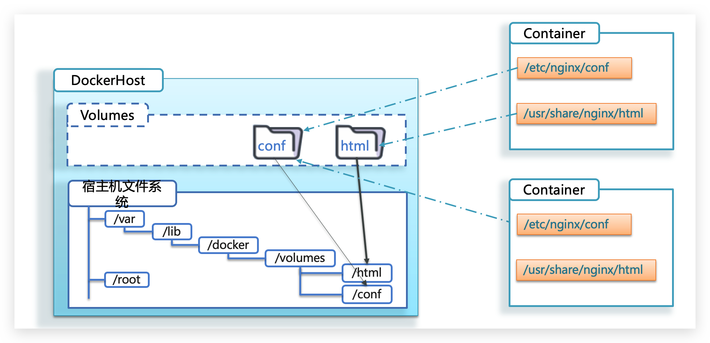

这样，我们操作宿主机的`/var/lib/docker/volumes/html`目录，就等于操作容器内的`/usr/share/nginx/html`目录了


## 4.1、数据卷命令

数据卷的相关命令有：

| **命令**              | **说明**             | **文档地址**                                                 |
| :-------------------- | :------------------- | :----------------------------------------------------------- |
| docker volume create  | 创建数据卷           | [docker volume create](https://docs.docker.com/engine/reference/commandline/volume_create/) |
| docker volume ls      | 查看所有数据卷       | [docs.docker.com](https://docs.docker.com/engine/reference/commandline/volume_ls/) |
| docker volume rm      | 删除指定数据卷       | [docs.docker.com](https://docs.docker.com/engine/reference/commandline/volume_prune/) |
| docker volume inspect | 查看某个数据卷的详情 | [docs.docker.com](https://docs.docker.com/engine/reference/commandline/volume_inspect/) |
| docker volume prune   | 清除数据卷           | [docker volume prune](https://docs.docker.com/engine/reference/commandline/volume_prune/) |


> **注意**：容器与数据卷的挂载要在创建容器时配置，对于创建好的容器，是不能设置数据卷的。而且**创建容器的过程中，数据卷会自动创建**。
>
> 思考：如果需要删除一个正在被使用的数据卷应该怎么办呢？ 删除容器后再去删除数据卷

### 4.1.1、设置数据卷

我们之前是采用宿主机目录的绝对路径，事实上我们可以直接使用数据卷的别名来作为宿主机的目录来使用。如果这个别名的数据卷还不存在的话，Docker会自动帮我们创建对应的数据卷。

- 绝对路径用法：`docker run -v 宿主机目录:容器目录[:读写权限] 镜像名 别名`
  - 读写权限：在使用 `-v` 选项时，可以添加 `:ro` 或者 `:rw` 来指定容器对宿主机(挂载的目录)是只读 read-only 还是可读写 read-write。默认是 rw

- 别名用法：`docker run -v 数据卷别名:容器目录[:读写权限] 镜像名`

例如：

```bash
docker run -d -p 80:80 -v nginx_html:/usr/share/nginx/html nginx
```


## 4.2、给Nginx挂载数据卷

1. 在执行`docker run` 命令时,使用 `-v 数据卷:容器内目录` 可以完成数据卷挂载。当创建容器时，如果挂载了数据卷且数据卷不存在，会自动创建数据卷。

```bash
# 1.首先创建容器并指定数据卷，注意通过 -v 参数来指定数据卷,将数据卷html挂载到 /usr/share/nginx/html
docker run -d -p 81:80 -v html:/user/share/nginx/html nginx
```

2. 查看数据卷

```bash
docker volume ls

# 查看html数据卷的位置
docker volume inspect html
```

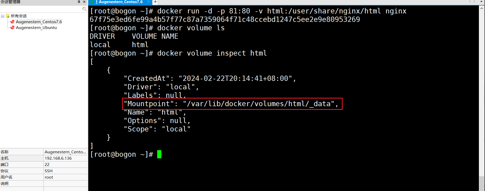

- 可以看到，我们创建的html这个数据卷关联的宿主机目录为`/var/lib/docker/volumes/html/_data`目录。

3. 进入该目录，并随意修改index.html内容

```bash
# 进入该目录
cd /var/lib/docker/volumes/html/_data
# x
vi index.html
```

5. 打开页面，查看效果: http://虚拟机地址


## 4.3、挂载本地目录或文件

可以发现，数据卷的目录结构较深，如果我们去操作数据卷目录会不太方便。在很多情况下，我们会直接将**容器目录与宿主机指定目录挂载**。关联关系区别如下：

- 带数据卷模式：宿主机目录 --> 数据卷 ---> 容器内目录
- **直接挂载模式**：宿主机目录 ---> 容器内目录

挂载语法与数据卷类似：

```bash
# 挂载本地目录
-v 本地目录:容器内目录
# 挂载本地文件
-v 本地文件:容器内文件
```

> **注意**：本地目录或文件必须以 `/` 或 `./`开头，如果直接以名字开头，会被识别为数据卷名而非本地目录名。

```bash
-v mysql:/var/lib/mysql # 会被识别为一个数据卷叫mysql，运行时会自动创建这个数据卷

-v ./mysql:/var/lib/mysql # 会被识别为当前目录下的mysql目录，运行时如果不存在会创建目录
```


示例:删除并重新创建mysql容器，并完成本地目录挂载,要求如下

- 挂载宿主机的`/root/mysql/data`到容器内的`/var/lib/mysql`目录
- 挂载宿主机的`/root/mysql/init`到容器内的`/docker-entrypoint-initdb.d`目录（初始化的SQL脚本目录）
- 挂载宿主机的`/root/mysql/conf`到容器内的`/etc/mysql/conf.d`目录（这个是MySQL配置文件目录）

接下来，我们演示本地目录挂载：

1. 删除原来的MySQL容器

```bash
docker rm -f mysql
```

2. 进入root目录

```bash
cd ~
```

3. 创建并运行新mysql容器，挂载本地目录

```bash
docker run -d \
  --name mysql \
  -p 3306:3306 \
  -e TZ=Asia/Shanghai \
  -e MYSQL_ROOT_PASSWORD=123 \
  -v ./mysql/data:/var/lib/mysql \
  -v ./mysql/conf:/etc/mysql/conf.d \
  -v ./mysql/init:/docker-entrypoint-initdb.d \
  mysql
```

5. 查看root目录，可以发现`~/mysql/data` 、 `~/mysql/conf` 、 `~/mysql/init`目录已经自动创建好了

```bash
ls -l mysql
```


我们可以在宿主机本地目录下进行代码配置,就相当于直接在容器中进行代码配置了。


