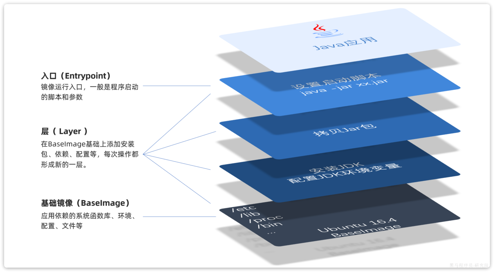
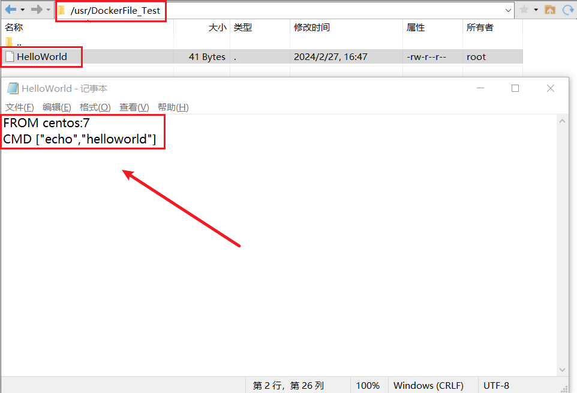
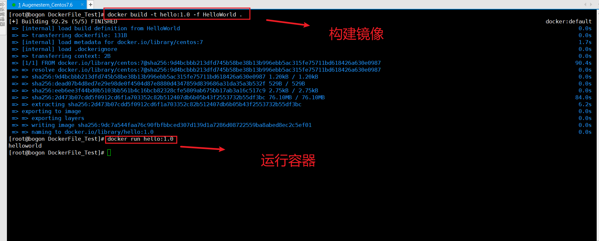

# 1、网桥

虽然默认情况下容器和容器可以进行网络通信。但是每次创建容器都是Docker给容器分配的IP地址，这让我们使用起来不太方便。 

这些情况我们都可以创建自定义网络来解决这些问题。把需要互相连通的容器加入到同一个网络，这样**容器和容器之间就可以通过容器名来代替ip地址进行互相访问**。


## 1.1、网络相关操作

Java项目往往需要访问其它各种中间件，例如MySQL、Redis等,MySQL容器和Redis之间可以相互访问,但是，容器的网络IP其实是一个虚拟的IP，其值并不固定与某一个容器绑定，如果我们在开发时写死某个IP，而在部署时很可能MySQL容器的IP会发生变化，连接会失败。所以，我们必须借助于docker的网络功能来解决这个问题，常见命令有：


| **命令**                  | **说明**                 | **文档地址**                                                 |
| :------------------------ | :----------------------- | :----------------------------------------------------------- |
| docker network create     | 创建一个网络             | [docker network create](https://docs.docker.com/engine/reference/commandline/network_create/) |
| docker network ls         | 查看所有网络             | [docs.docker.com](https://docs.docker.com/engine/reference/commandline/network_ls/) |
| docker network rm         | 删除指定网络             | [docs.docker.com](https://docs.docker.com/engine/reference/commandline/network_rm/) |
| docker network prune      | 清除未使用的网络         | [docs.docker.com](https://docs.docker.com/engine/reference/commandline/network_prune/) |
| docker network connect    | 使指定容器连接加入某网络 | [docs.docker.com](https://docs.docker.com/engine/reference/commandline/network_connect/) |
| docker network disconnect | 使指定容器连接离开某网络 | [docker network disconnect](https://docs.docker.com/engine/reference/commandline/network_disconnect/) |
| docker network inspect    | 查看网络详细信息         | [docker network inspect](https://docs.docker.com/engine/reference/commandline/network_inspect/) |

### 1.1.1、创建网络

- 用法：`docker network create 网络名`

```bash
docker network create blog_net
```

### 1.1.2、列出网络

- 用法：`docker network ls`

### 1.1.3、加入网络

我们可以在容器创建时使用 `--network` 选项让容器创建时就加入对应的网络。

- 容器创建时加入网络用法：`docker run --network 网络名 镜像名`
- 容器创建后加入网络用法：`docker network connect  网络名 容器名或容器id`

示例：

```bash
docker network connect blog_net sg_blog
```


### 1.1.4、查看网络详情

- 用法：`docker network inspect 网络名或者网络id`

示例：

```bash
docker network inspect blog_net
```


### 1.1.5、删除网络

- 用法：`docker network rm 网络名或网络id`


# 2、Dockerfile自定义镜像

前面我们一直在使用别人准备好的镜像，那如果我要部署一个Java项目，把它打包为一个镜像该怎么做呢？


## 2.1、镜像结构

要想自己构建镜像，必须先了解镜像的结构。之前我们说过，镜像之所以能让我们快速跨操作系统部署应用而忽略其运行环境、配置，就是因为镜像中包含了程序运行需要的系统函数库、环境、配置、依赖。因此，自定义镜像本质就是依次准备好程序运行的基础环境、依赖、应用本身、运行配置等文件，并且打包而成。

举个例子，我们要从0部署一个Java应用，大概流程是这样：

- 准备一个linux服务（CentOS或者Ubuntu均可）
- 安装并配置JDK
- 上传Jar包
- 运行jar包

那因此，我们打包镜像也是分成这么几步：

- 准备Linux运行环境（java项目并不需要完整的操作系统，仅仅是基础运行环境即可）
- 安装并配置JDK
- 拷贝jar包
- 配置启动脚本

上述步骤中的每一次操作其实都是在生产一些文件（系统运行环境、函数库、配置最终都是磁盘文件），所以**镜像就是一堆文件的集合**。但需要注意的是，镜像文件不是随意堆放的，而是按照操作的步骤分层叠加而成，每一层形成的文件都会单独打包并标记一个唯一id，称为**Layer**（**层**）。这样，如果我们构建时用到的某些层其他人已经制作过，就可以直接拷贝使用这些层，而不用重复制作。

例如，第一步中需要的Linux运行环境，通用性就很强，所以Docker官方就制作了这样的只包含Linux运行环境的镜像。我们在制作java镜像时，就无需重复制作，直接使用Docker官方提供的CentOS或Ubuntu镜像作为基础镜像。然后再搭建其它层即可，这样逐层搭建，最终整个Java项目的镜像结构如图所示：




## 2.2、Dockerfile语法

### 2.2.1、概述

**Dockerfile**就是一个文本文件，其中包含一个个的**指令(Instruction)**，用指令来说明要执行什么操作来构建镜像。每一个指令都会形成一层Layer。

由于制作镜像的过程中，需要逐层处理和打包，比较复杂，所以Docker就提供了自动打包镜像的功能。我们只需要将打包的过程，每一层要做的事情用固定的语法写下来，交给Docker去执行即可。而这种记录镜像结构的文件就称为**Dockerfile**，其常用语法:

| **指令**       | **说明**                                     | **示例**                     |
| :------------- | :------------------------------------------- | :--------------------------- |
| **FROM**       | 指定基础镜像                                 | `FROM centos:6`              |
| **ENV**        | 设置环境变量，可在后面指令使用               | `ENV key value`              |
| **COPY**       | 拷贝本地文件到镜像的指定目录                 | `COPY ./xx.jar /tmp/app.jar` |
| **RUN**        | 执行Linux的shell命令，一般是安装过程的命令   | `RUN yum install gcc`        |
| **EXPOSE**     | 指定容器运行时监听的端口，是给镜像使用者看的 | EXPOSE 8080                  |
| **ENTRYPOINT** | 镜像中应用的启动命令，容器运行时调用         | ENTRYPOINT java -jar xx.jar  |

例如，要基于Ubuntu镜像来构建一个Java应用，其Dockerfile内容如下：

```bash
# 指定基础镜像
FROM ubuntu:16.04

# 配置环境变量，JDK的安装目录、容器内时区
ENV JAVA_DIR=/usr/local
ENV TZ=Asia/Shanghai

# 拷贝jdk和java项目的包
COPY ./jdk8.tar.gz $JAVA_DIR/
COPY ./docker-demo.jar /tmp/app.jar

# 设定时区
RUN ln -snf /usr/share/zoneinfo/$TZ /etc/localtime && echo $TZ > /etc/timezone

# 安装JDK
RUN cd $JAVA_DIR \
 && tar -xf ./jdk8.tar.gz \
 && mv ./jdk1.8.0_144 ./java8

# 配置环境变量
ENV JAVA_HOME=$JAVA_DIR/java8
ENV PATH=$PATH:$JAVA_HOME/bin

# 指定项目监听的端口
EXPOSE 8080

# 入口,java项目的启动命令
ENTRYPOINT ["java", "-jar", "/app.jar"]
```

我们思考一下：以后我们会有很多很多java项目需要打包为镜像，他们都需要Linux系统环境、JDK环境这两层，只有上面的3层不同（因为jar包不同）。如果每次制作java镜像都重复制作前两层镜像，是不是很麻烦。所以，就有人提供了基础的系统加JDK环境，我们在此基础上制作java镜像，就可以省去JDK的配置了：

```bash
# 基础镜像
FROM openjdk:11.0-jre-buster

# 设定时区
ENV TZ=Asia/Shanghai
RUN ln -snf /usr/share/zoneinfo/$TZ /etc/localtime && echo $TZ > /etc/timezone

# 拷贝jar包
COPY xxx.jar /app.jar

# 入口
ENTRYPOINT ["java", "-jar", "/app.jar"]
```

是不是简单多了。

### 2.2.2、快速入门

首先明确三点：

- Dockerfile 不区分大小写，但是习惯大写
- 基本以FROM指令开头
- 开头代表注释

需求：构建一个最简单的HelloWorld镜像

- 创建文件 HelloWorld
- 编写指令 

```bash
FROM centos:7 
CMD ["echo","helloworld"]
```

- 编译镜像

```bash
# -t 指定镜像名和标签
# -f 指定基于哪个DockerFile文件去构建镜像
# .表示在当前目录下查找对应的DockerFile来构建镜像
docker build -t hello:1.0 -f HelloWorld .
```




- 运行我们的镜像

```bash
docker run hello:1.0
```




### 2.2.1、FROM

- 作用：用来定义基础镜像
- 用法：`FROM 镜像名:标签名`
- 作用时机：构建镜像的时候
- 例如

```bash
FROM centos:7
```

### 2.2.2、CMD

- 作用：**用来定义容器运行时的默认命令**。可以在使用docker run的时候覆盖掉CMD中定义的命令
- 作用时机：运行容器的时候
- 用法：`CMD ["命令1","参数1","参数2"]` 

  - 命令和参数作为 json 数组的元素去书写，这种形式不会直接去解析环境变量**（也就是有方括号包裹的话，不会解析环境变量）**
  - `CMD echo $HOME` 这种形式可以解析环境变量


> 一个DockerFile文件中如果有多个CMD命令，只有最后一条CMD命令会执行。

### 2.2.3、ENV

- 作用：用来定义环境变量
- 用法：`ENV 变量名 = "变量值"` ，例如：`ENV DIR = "/root"`
- 作用时机：构建镜像的时候


### 2.2.4、WORKDIR

- 作用：用于设置当前工作的目录，如果该目录不存在会自动创建
- 用法：`WORKDIR 目录` ，例如 `WORKDIR /root/app` (在执行到这里时，会判断这个目录是否存在，不存在会创建目录，并且 cd 到这个目录中去)
- 作用时机：构建镜像的时候

1. 探索：有如下指令，最终使用pwd输出的目录是什么

```bash
FROM centos:7

WORKDIR /a
WORKDIR b
WORKDIR c
# /a/b/c
CMD pwd
```

2. 如果WORKDIR指定的父目录不存在，则会把父目录自动创建

```bash
WORKDIR /a/b/c
```

3. WORKDIR指定的目录可以引用环境变量

```bash
FROM centos:7
ENV DIR="/app/cdd"
WORKDIR &DIR
CMD pwd
```


### 2.2.5、run

- 作用：它是用来定义**构建过程中**要执行的命令的
- 用法：`RUN 命令`，例如`RUN echo sg` 
- 作用时机：构建镜像的时候

> CMD 是执行容器运行中的命令，RUN 是构建过程中的命令


需求：

定义一个CONTENT变量，默认值为hellodocker，在镜像的 /app 目录下创建一个 sg 目录，在其中创建一个 content.txt 文件，文件的内容为 CONTENT 变量的值。容器启动时打印 content.txt 的内容。

```bash
FROM centos:7
ENV CONTENT = "hellodocker"
WORKDIR /app/sg
RUN echo &CONTENT > content.txt
CMD ["cat","content.txt"]
```


### 2.2.6、ADD

- 作用：把**构建上下文(构建目录)**中的文件或者网络文件添加到镜像中，如果文件是一个压缩包会自动解压，如果是网络中的文件并不会自动解压 
- 用法：`ADD 原路径 目标路径`，例如：`ADD sg-blog-vue.tar.gz` ，**把构建上下文中的 sg-blog0vue.tar.gz 添加到镜像当前的工作目录中**
- 作用时机：构建镜像的时候


### 2.2.7、EXPOSE

- 作用：暴露需要发布的端口，让镜像使用者知道应该发布哪些端口
- 用法：`EXPOSE 端口1 端口2`，例如：`EXPOSE 80 8080`
- 作用时机：构建镜像的时候

需求：

- 在构建目录下存放一个 sg-blog-vue.tar.gz 包，构建镜像的时候把这个包添加到镜像的 `/app` 目录下解压，然后把其中的 dist 目录的内容存放到 nginx 的html 目录下，声明开放80端口，nginx用 1.21.5 版本。
  - ==构建目录==：**DockerFile所在的目录就是构建目录**

```bash
# 基础镜像nginx:1.21.5
# WORKDIR /app 在构建目录下新建/app目录并进入
# ADD sg-blog-vue.tar.gz .   将这个包添加到镜像的当前目录并解压
# 把解压后的dist下的文件都复制到 nginx 的 html 目录下
# CMD 前台启动nginx
FROM nginx:1.21.5
WORKDIR /app
ADD sg-blog-vue.tar.gz .
RUN cp -r sg-blog-vue/dist/* /usr/share/nginx/html
EXPOSE 80
CMD ["nginx","-g","daemon off;"]
```


## 2.3、构建镜像

当Dockerfile文件写好以后，就可以利用命令来构建镜像了。例如我们将`xxx.jar` 包和`Dockerfile`拷贝到虚拟机的`/root/demo` 目录:

```bash
# 进入镜像目录
cd /root/demo
# 开始构建
docker build -t xxx:1.0 .
```

- `docker build `: 就是构建一个docker镜像
- `-t xxx:1.0` ：`-t`参数是指定镜像的名称（`repository`和`tag`）
- `.` : 最后的点是指构建时Dockerfile所在路径，由于我们进入了demo目录，所以指定的是`.`代表当前目录，也可以直接指定Dockerfile目录：

```bash
# 直接指定Dockerfile目录
docker build -t xxx:1.0 /root/demo
```

查看镜像列表:

```bash
# 查看镜像列表:
docker images
```

然后尝试运行该镜像：

```bash
# 1.创建并运行容器
docker run -d --name dd -p 8090:8090 xxx:1.0
# 2.查看容器
dps

# 3.访问
curl localhost:8080
```


# 3、DockerCompose


我们在部署运行一个项目的时候可能需要运行多个容器，还要去处理这些容器的网络、数据卷等。如果用 docker 命令一个个去处理还是不方便，DockerCompose 就是去解决这个问题的。

## 3.1、DockerCompose概述

DockerCompose 是用来定义和运行一个或多个(通常都是多个)运行和应用的工具。

- 可以使用 YAML 文件来配置应用程序的服务，然后使用单个命令，就可以根据配置文件创建并启动所有服务

## 3.2、安装DockerCompose

- 当前版本的Docker已经集成了DockerCompose
- 使用`docker compose version` 可以查看其版本


## 3.3、初始DockerCompose

1. 编写 docker-compose.yaml 模板文件

   Compose文件是一个文本文件，通过指令定义集群中的每个容器如何运行。格式如下：

```yaml
version: "3.8"
 services:
  mysql:
    image: mysql:5.7.25
    environment:
     MYSQL_ROOT_PASSWORD: 123 
    volumes:
     - "/tmp/mysql/data:/var/lib/mysql"
     - "/tmp/mysql/conf/hmy.cnf:/etc/mysql/conf.d/hmy.cnf"
  web:
    build: .
    ports:
     - "8090:8090"

```

2. 运行：docker compose up
3. 停止：docker compose down


上面的Compose文件就描述一个项目，其中包含两个容器：

- mysql：一个基于`mysql:5.7.25`镜像构建的容器，并且挂载了两个目录
- web：一个基于`docker build`临时构建的镜像容器，映射端口时8090

> DockerCompose的详细语法参考官网：https://docs.docker.com/compose/compose-file/
>
> - 其实DockerCompose文件可以看做是将多个docker run命令写到一个文件，只是语法稍有差异。

## 3.4、DockerCompose元素

元素：

- command：覆盖容器启动后的默认指令
- environment：指定环境变量，相当于run的 -e 选项
- image：用来指定镜像
- networks：指定网络，相当于 run 的 --network
- ports：用来指定要发布的端口，相当于 run 的 -p
- volumes：用来指定数据卷，相当于 -v
- restart：用来指定重启策略，相当于 --restart


