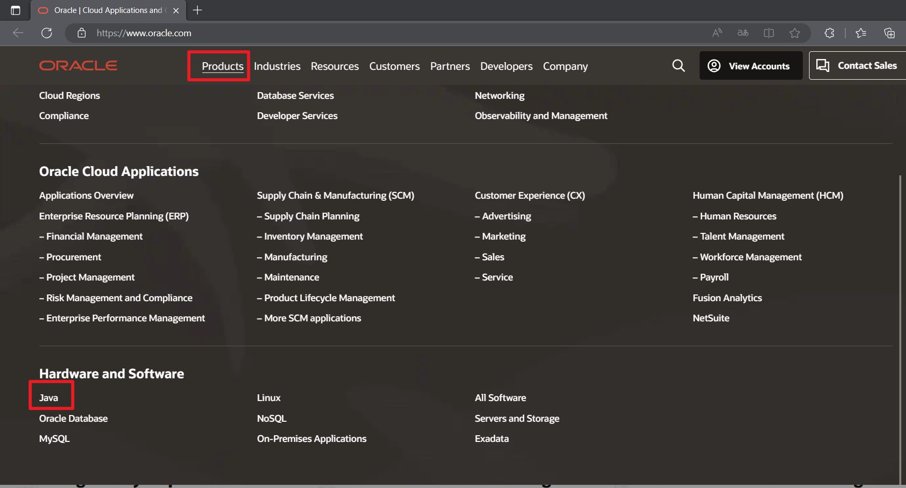
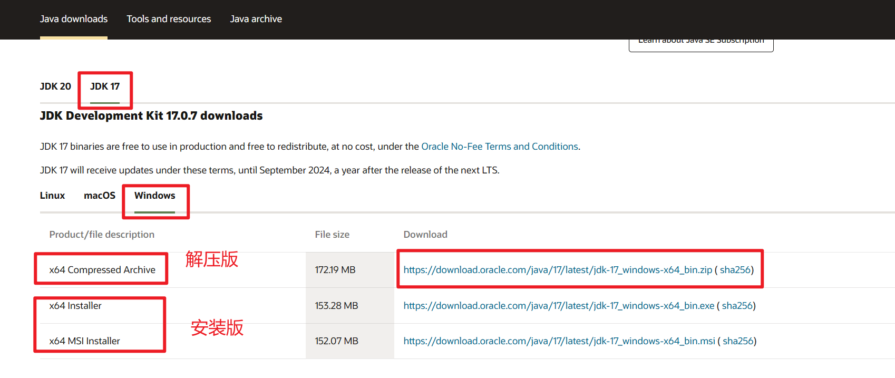
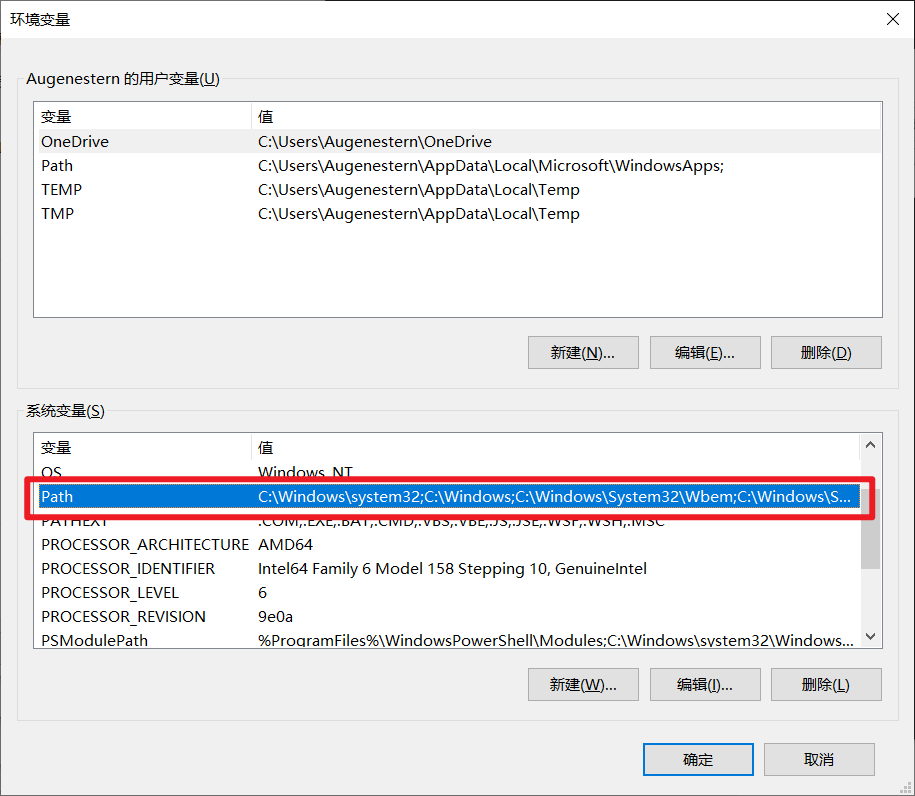
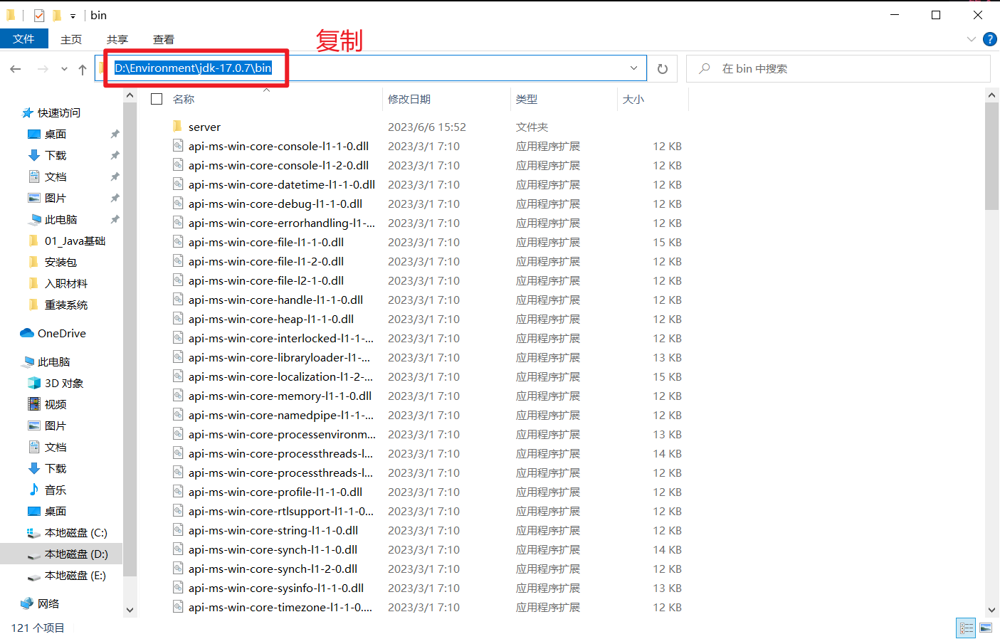
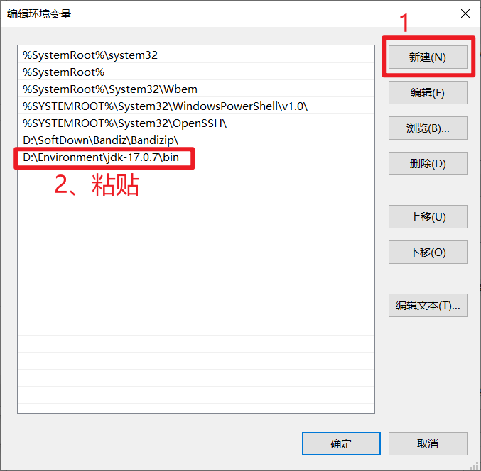
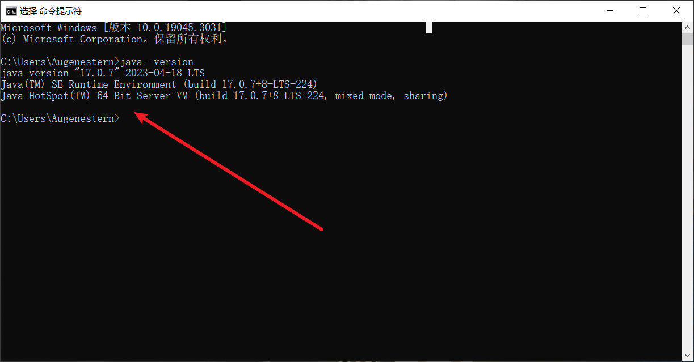

# 1、JDK17的下载与安装

1. 首先访问Oracle官网：www.oracle.com, 选择`Products` ，点击 `Java`

2. 下滑找到`Download Java now`，选择`JDK17`， 选择平台，我这里安装选择解压版本

3. 右击`此电脑`，选择`属性` ，选择`高级系统设置`，选择 `环境变量` ,找到系统变量下的 `Path` ，双击

4. 解压第二步下载的压缩包，进入`bin` 目录，将其之前的目录一块复制

5. 返回刚才的环境变量，点击新建，将复制的目录粘贴，依次点击确定

6. `win+r` 输入`cmd`，输入`java -version` ，出现如下版本号则环境搭建成功

# 2、JDK8的下载与安装

> Tips：Oracle 官网是没有 JDK8 版本的解压版的，所以使用解压版的可以使用如下方法

- [JDK64位解压版版本共享（包含1.6、1.7、1.8、10、11.0.1等）_jdk1.7解压版_Irvin-bin的博客-CSDN博客](https://blog.csdn.net/bin470398393/article/details/87931302)

> jdk  配置了环境变量，jre就不需要配置了

