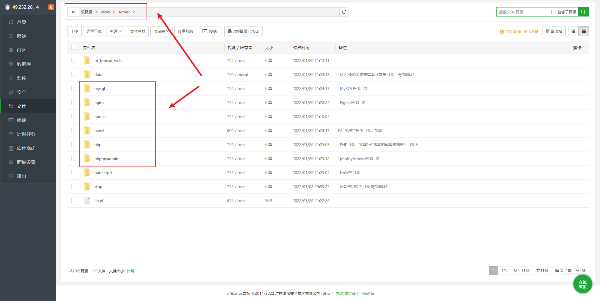
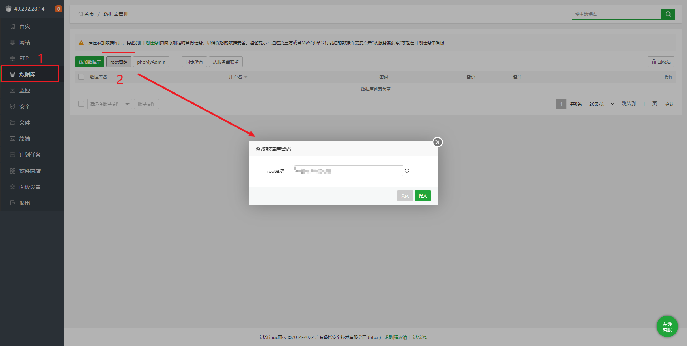

# 1、服务器快照

快照功能在我之前手动搭建JavaEE环境时也提到过，在Linux专栏第一篇文章在虚拟机环境下也有详细介绍，这里就不多做记录，"快照"功能的强大名副其实，生命中没有"后悔药"，但是服务器有。妥善运用快照功能，可以让你如《开端》一般，在每一次失败的时候有机会再胜利。

> 强大：个人琢磨、研究服务器玩法时使用✔

# 2、使用宝塔面板安装的软件默认位置在哪里？

之前搭建JavaEE环境时我们是采用命令行式安装环境，但是可能某些时候为了便捷直接使用了宝塔面板来安装软件，例如安装mysql、tomcat等等，安装完成我们想在 tomcat 的 webapps 下传输 war 包，发现找不到 tomcat 的安装目录了！

> 答案：如果你使用了宝塔面板来安装软件，那么默认的安装位置在 `根目录/www/server` 下

# 3、宝塔安装的Mysql默认密码？

如果你使用了宝塔面板来安装Mysql，那么我们在使用 `mysql -u root -p` 时发现密码我们是不知道的！

> 答案：如果你使用了宝塔面板来安装Mysql，那么密码在宝塔页面的 ==数据库== -> `root密码`  

**注意**：现在已经是线上环境了，不要再使用弱密码来当作数据库密码了

# 4、宝塔安装Tomcat自动配置JDK？

最近发现了这么个情况，使用宝塔安装Tomcat会自动配置jdk，我是直接在``软件商店` 下载的 Tomcat9 版本，发现在XShell使用 `java -version` 会发现 jdk 自动安装配置完成！

> 猜测：这个有前辈在网上解答说是tomcat7.0版本对应得 jdk 是1.7版本，tomcat8.0版本对应得 jdk 是1.8版本。可是我下载的是Tomcat9版本，也是自动安装配置的jdk8，就**当作使用宝塔安装Tomcat9会自动配置JDK8吧**

