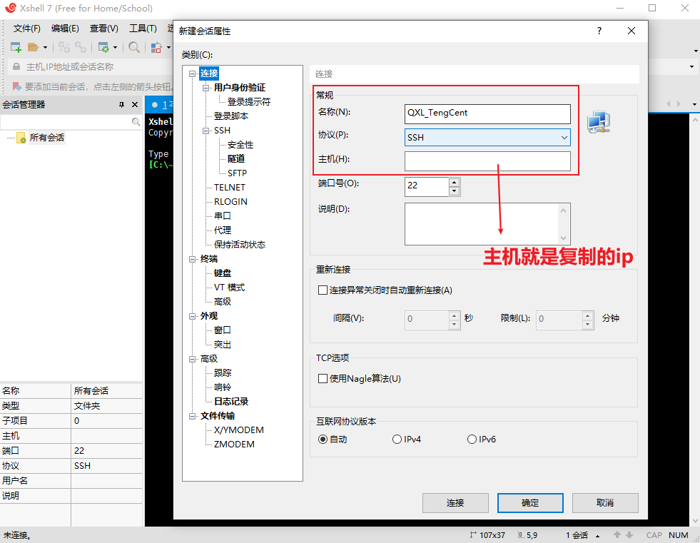
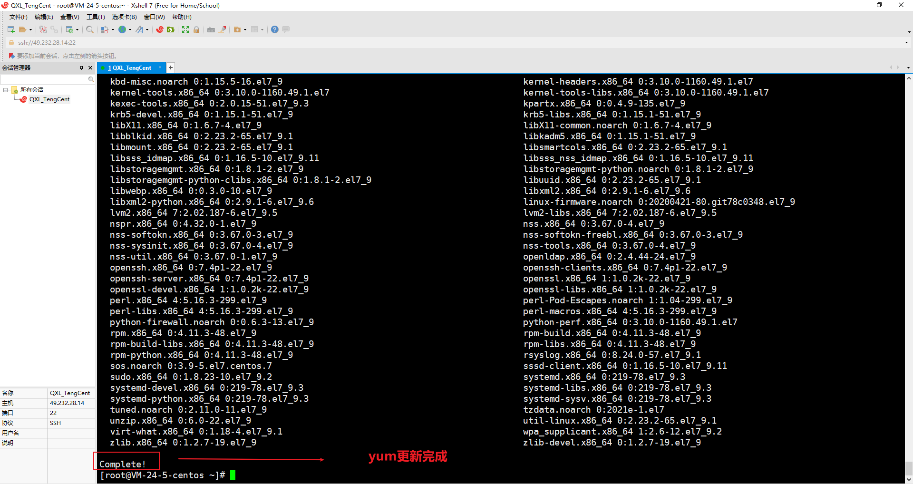

# 1、服务器购买

1. 打开腾讯云：https://cloud.tencent.com/
2. 使用微信或其他方式登录
3. 云产品->选择轻量应用服务器


4. 更多->管理


5. 先关机，之后再重置密码，设置自己的密码


6. 复制IP地址


7. 打开Xshell，进行连接，输入用户名和密码




8. 连接成功就OK了

# 2、更新YUM包

因为服务器默认的yum版本比较旧，所以我们再装其他东西之前，最好将yum更新一下


1. 在XShell面板输入如下命令

```bash
yum update -y
```


2. 安装过程比较慢，我们可以稍微等一会。所以不妨在站长之家ping一下我们的服务器，看一下速度

​	进入站长之家：http://ping.chinaz.com/


3. 等待之后我们来看我们的yum更新




# 3、安装宝塔面板(非必须)

宝塔对于新手来说较为友好，所以推荐新手安装。

1. 进入宝塔官网：https://www.bt.cn/ 点击立即安装


2. 因为我是Centos7的系统，所以我选择复制对应的安装命令


3. 之后在 XShell 面板 右键->粘贴 ，然后回车


4. 安装也需要一段时间，安装完成如下图所示


上述地址如果不小心 clear 掉了，只需要再次执行 `bt default` 即可再次显示。


5. 复制外网面板地址然后在浏览器输入，若无法进入，宝塔已经给了解决方案：'若无法访问面板，请检查防火墙/安全组是否有放行面板[8888]端口'。我们进入腾讯云的控制台，点击防火墙。


我们点击添加规则，将端口 8888 添加进去


6. OK，之后我们继续复制外网面板地址然后在浏览器输入，输入用户名和密码登录


进入之后要绑定宝塔账号，这个界面在之前的版本可以通过脚本来屏蔽，但是我这里就进行注册登录绑定吧。


7. 登录绑定成功后，我们就可以使用宝塔傻瓜式安装自己需要的软件了。


8. 点击面板设置，修改登录面板用户和面板密码。这个用户名和密码要记住，以后就是登录宝塔的


当然如果我们不小心关闭了宝塔页面，同时还忘记了端口号，只需要执行`/etc/init.d/bt default`,就可以查看自己的外网面板地址、用户名和密码了。

> 此命令和之前的 `bt default` 有异曲同工之妙，不同点在于`bt default`是我们没有修改宝塔用户名、密码之前可以使用，一旦我们手动修改了用户名和密码，那么`bt default`就不能使用了，必须使用`/etc/init.d/bt default`


当然对于程序员我们更希望掌握命令式安装。不过对于刚接触Linux的用户而言，宝塔傻瓜式更舒服，那我们可能想我现在先使用傻瓜式安装，后期我再接触命令式安装，但是我们又只有一台服务器，现在傻瓜式装了软件之后岂不是还要卸载，然后再操作命令式。这个时候我们就需要给服务器"存个档"了。


# 4、给服务器"存个档"

我们在拿到服务器时，可能也会害怕误操作导致一系列的问题从而想回到自己未操作之前的那个状态，服务器的快照功能可以很好解决这个问题。

1. 在腾讯云管理面板点击快照


