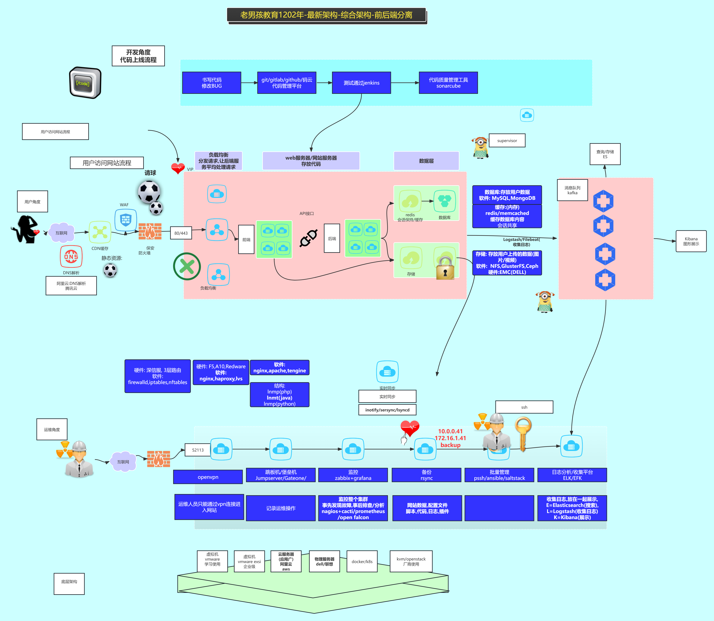

# 1、阿里云架构

用户访问互联网的时候,首先进行阿里云DNS解析，然后进行CDN缓存，CDN一般缓存的就是网站的一些静态资源，再进入WAF应用防火墙，再通过安全组进入负载均衡SLB产品，接着请求走到前端服务器，ECS部署后端服务，点击前端来请求后端服务，后端服务器还包含redis数据库做缓存，主备数据库mysql，以及存储服务器nas/oss。

> WAF应用防火墙和传统防火墙的区别：
>
> - **传统防火墙**基于网络层技术，不需要安装客户端，只需配置端口。主要工作在OSI模型的第三、四层网络层和传输层，控制端口和TCP协议，无法防御应用层攻击
> - **WAF**采用客户机/服务器模式，客户机必须安装在服务器上，由服务器提供服务。用于防止对Web应用的攻击，能够过滤、监视和阻止HTTP流量。主要用于防止外部攻击者对Web应用的攻击，如SQL注入、XSS跨站脚本攻击、CSRF等。WAF能够理解并分析HTTP会话，提供应用层保护
>
> 负载均衡SLB：
>
> - 在旧版本的阿里云上是SLB
> - 在新版本的阿里云上是CLB和ALB
> - 我们自己一般是用Nginx实现负载均衡，keepalived 来实现 HA 高可用。

