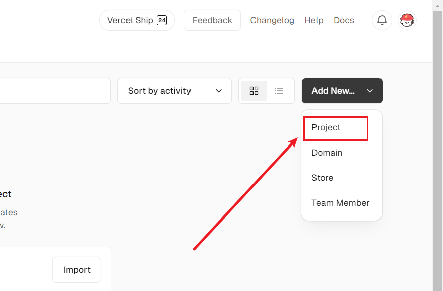
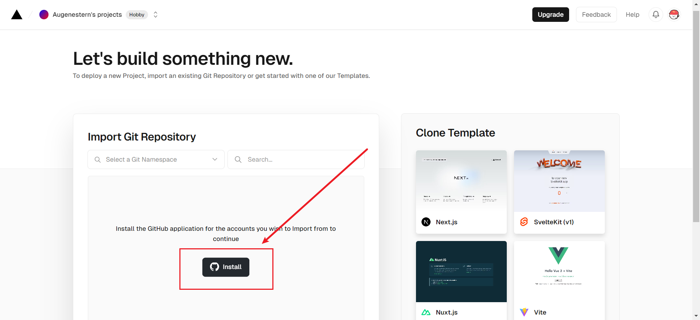
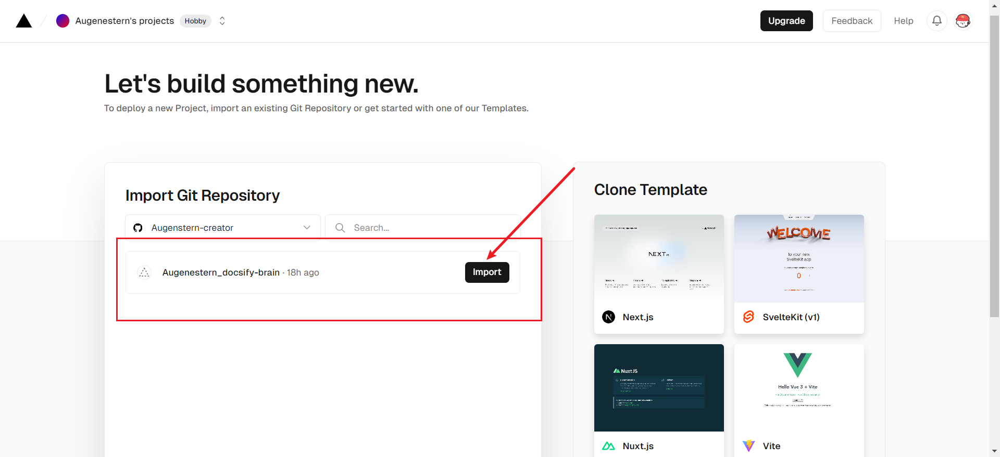
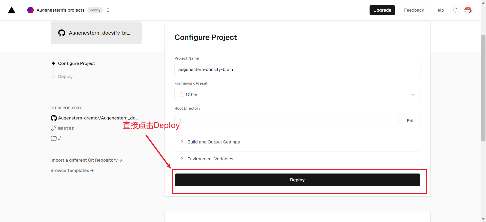
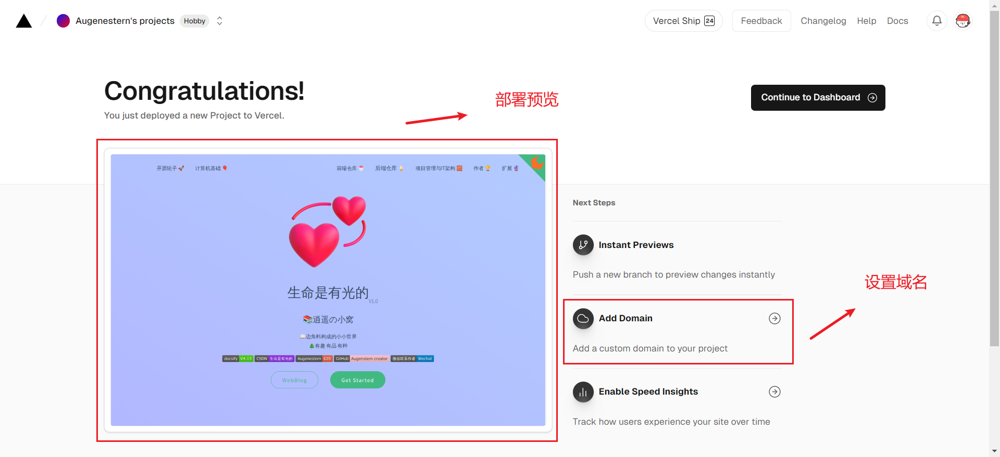
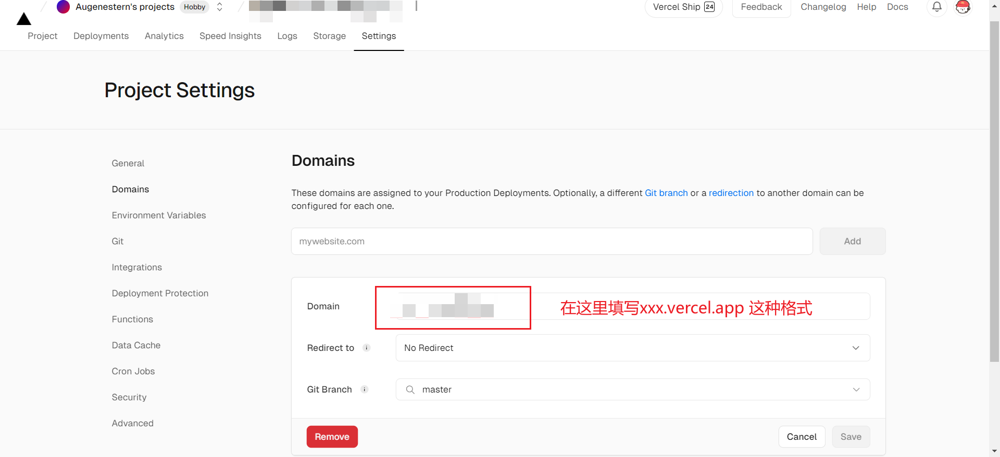
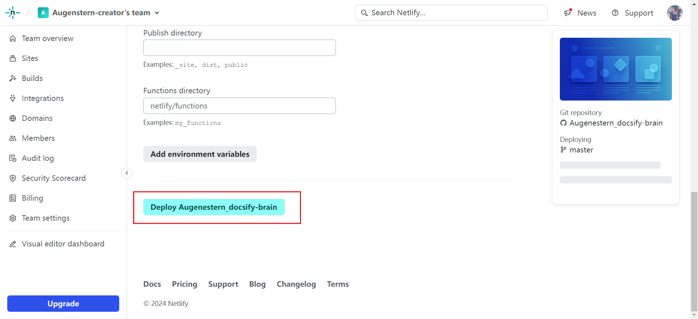
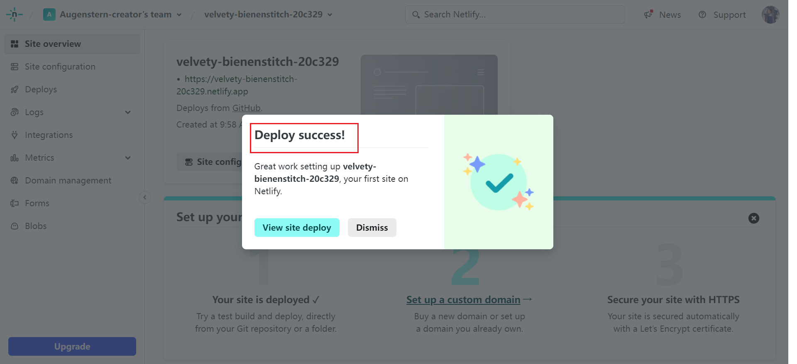
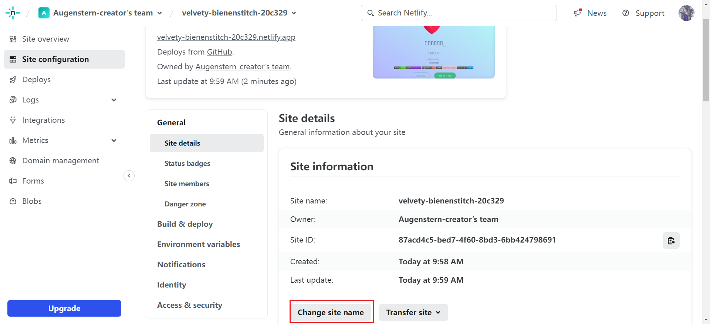
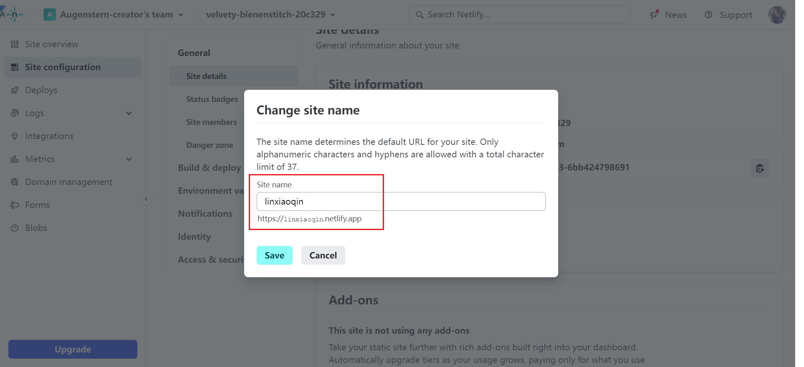

# 1、Vercel

## 1.1、简介

1. Vercel 旨在为开发者提供简单直观的使用体验。通过简单的几步设置，用户可以快速将他们的项目部署到云端。
2. Vercel 支持从 GitHub、GitLab 或 Bitbucket 等代码仓库直接部署，当你推送代码到仓库时，Vercel 会自动进行构建和部署。
3. 官网：https://vercel.com/

## 1.2、开始使用

1. Add New - Project

2. 链接 GitHub

3. 导入项目

4. 部署成功预览

## 1.3、更换域名

1. 更改域名如下

2. 如果要更改自己购买的域名

> 待更新

## 1.4、CI/CD

Vercel 支持从 GitHub、GitLab 或 Bitbucket 等代码仓库直接部署，当你推送代码到仓库时，Vercel 会自动进行构建和部署。

# 2、Netlify

## 2.1、注册

1. 官网：https://linxiaoqin.netlify.app/#/

2. 注册或者使用GitHub登录即可

> 可能会遇到一些问题，都可以去社区提问，回复基本24h之内就有
>
> - https://answers.netlify.com/

## 2.2、使用

1.  import from Git

2. 选择GitHub，之后会弹出一个让你授权的窗口，给 Netlify 授权后，就会自动读取你 GitHub 的仓库，选择仓库后进行部署

3. 更改站点名称

