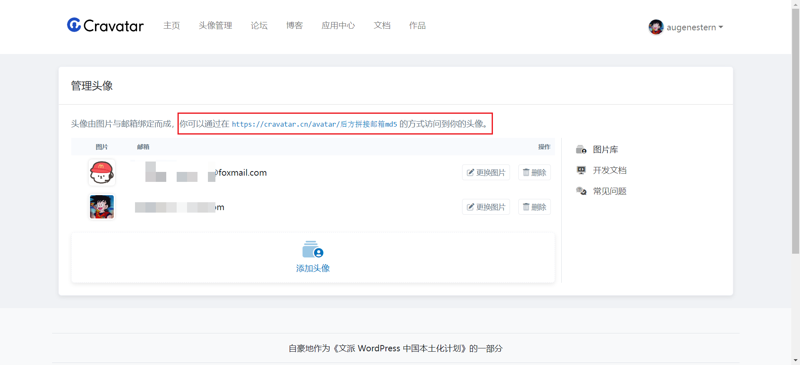

# 1、Shields

> [!NOTE]
> 参考：[Shields.io Badge 徽章使用方式记录](https://www.xalaok.top/post/shieldsio-badge/)

# 2、Cravatar
- 免费的互联网公共头像服务: https://cravatar.cn/

1. 注册登录之后 - 头像管理

2. 后缀邮箱md5可以进行生成：[MD5在线加密/解密](https://www.sojson.com/md5/)

3. 访问：`https://cravatar.cn/avatar/后方拼接邮箱的md5加密 `

