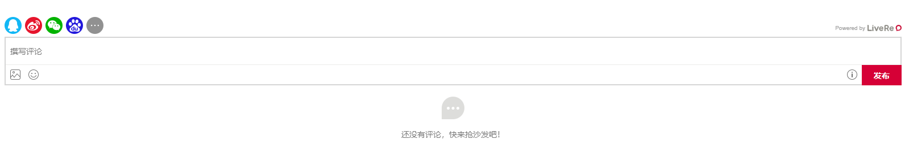
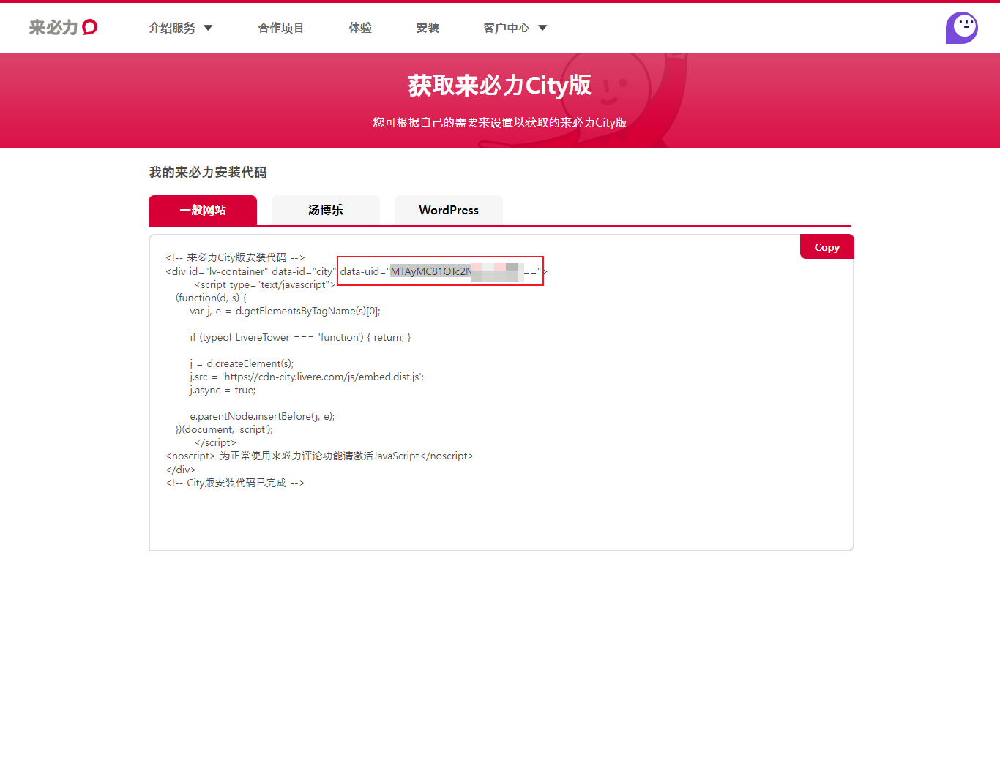

# 1、评论系统

> [!NOTE]
> 优点:支持国内常见的登录方式：QQ、微信、github、百度、微博等等<br>
> 缺点:UI太丑了，下图可见




## 1.1、配置

1. 首先进入来必力**✈**:https://livere.com/

2. 注册一个账号
3. 点击安装，填写所需信息
4. 生成代码




5. 复制代码中的`data-uid`
6. 配置`index.html`

```javascript
  window.$docsify = {
      plugins: [
        function (hook, vm) {
          // load livere
          hook.beforeEach(function(content) {
              var comment = "<div id='lv-container' data-id='city' data-uid='please_change_it'></div>\n\n----\n"
              return content + comment;
          });

          hook.doneEach(function() {
             (function(d, s) {
                 var j, e = d.getElementsByTagName(s)[0];
                 if (typeof LivereTower === 'function') { return; }
                 j = d.createElement(s);
                 j.src = 'https://cdn-city.livere.com/js/embed.dist.js';
                 j.async = true;
                 e.parentNode.insertBefore(j, e);
             })(document, 'script');
          });
        },
      ]
  }
```

并且请替换`please_change_it`为您的`data-uid`.


## 1.2、示例

> 请不要使用我的 `data-uid` 呦

```javascript
hook.beforeEach(function(content) {
  // 每次开始解析 Markdown 内容时调用
  var comment = "<div id='lv-container' data-id='city' data-uid='MTAyMC81OTc2Ny8zNjIyOQ'></div>\n\n----\n"
  return content + comment;
});

hook.doneEach(function() {
             (function(d, s) {
                 var j, e = d.getElementsByTagName(s)[0];
                 if (typeof LivereTower === 'function') { return; }
                 j = d.createElement(s);
                 j.src = 'https://cdn-city.livere.com/js/embed.dist.js';
                 j.async = true;
                 e.parentNode.insertBefore(j, e);
             })(document, 'script');
```


> [!TIP]
>
> - [DocsifyLivere](https://github.com/TaQini/docsify-livere/tree/master)


