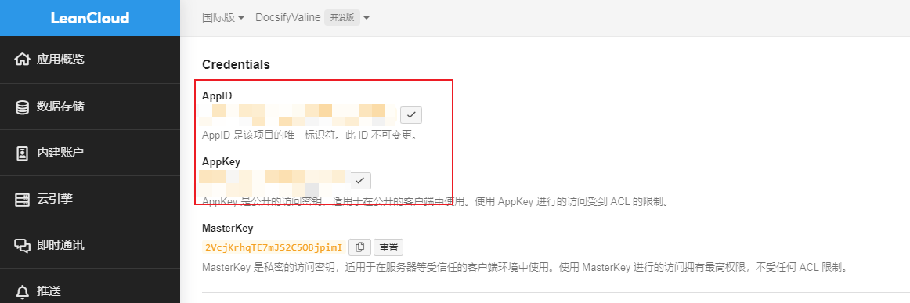

# 1、评论系统🔥

## 1.1、配置

1. 获取APP_ID和APP_KEY:https://console.leancloud.app
2. 创建新应用程序,您将获得`APP ID`/ `APP Key`



3. 配置`index.html`

```javascript
<body>
    ...
    <script>
        window.$docsify = {
          // docsify-valine (defaults)
          Valine: {
              appId: '<APP_ID>',
              appKey: '<APP_Key>',
               // 支持QQ
               enableQQ: true,
               // 记录IP
               recordIP: true
          }
        }
    </script>
    ...
    <script src='//unpkg.com/valine/dist/Valine.min.js'></script>
    <script src="//unpkg.com/docsify-valine/dist/docsify-valine.min.js"></script>
</body>
```


> [!TIP]
>
> - [官网](https://valine.js.org/)
>
> - [文档](https://daidi.github.io/docsify-valine/demo/#/README)
> - [DocsifyValine](https://github.com/daidi/docsify-valine/)


