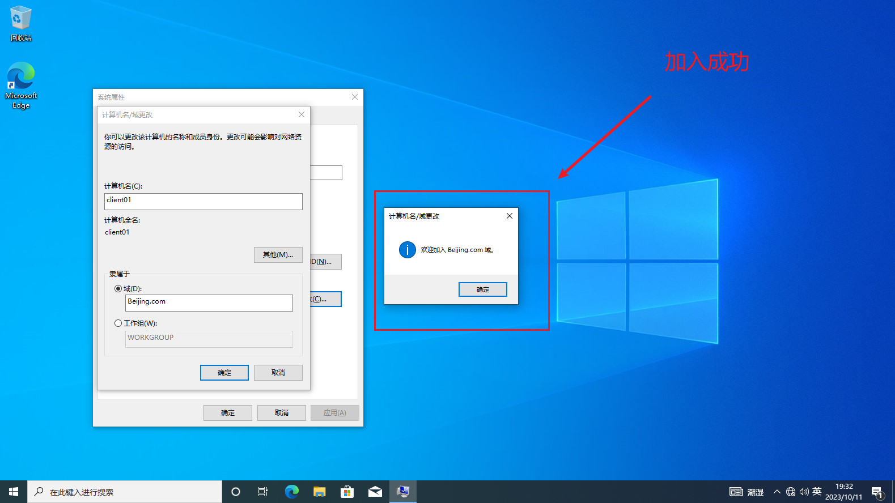
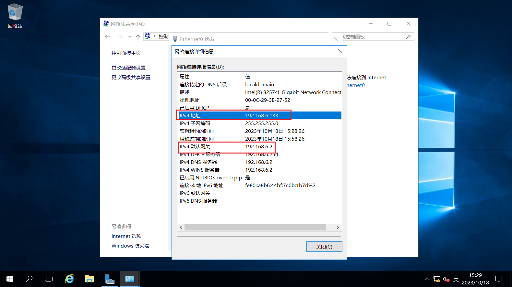
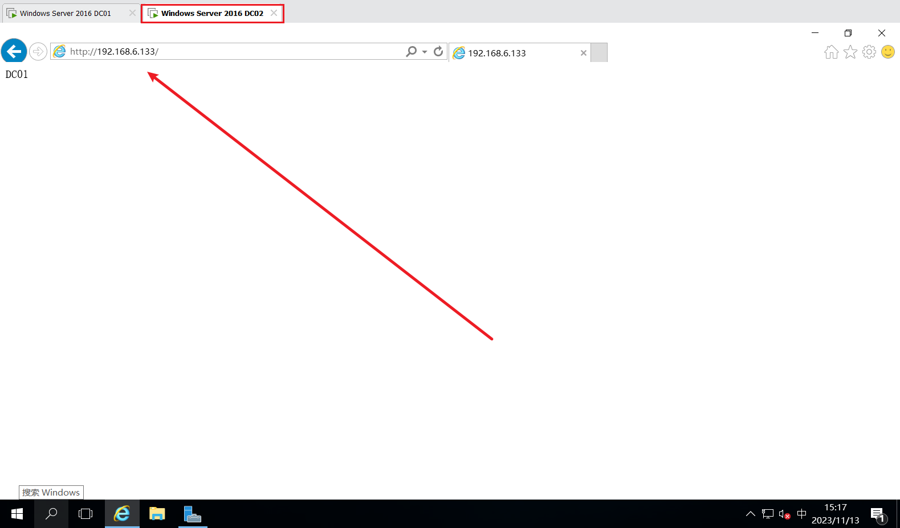

# 1、准备环境

1. VMware 
2. Windows Server 2019 镜像：[Windows Server 2019 ISO镜像下载 - 我的MSDN (imsdn.cn)](https://www.imsdn.cn/windows-server/windows-server-2019/)
2. Windows Server 2019 镜像：[Windows Server 2016 ISO镜像下载 - 我的MSDN (imsdn.cn)](https://www.imsdn.cn/windows-server/windows-server-2016/)
2. Windows 10 商业版 21H2 镜像：[Windows 10 21H2版本原版镜像 - 我的MSDN (imsdn.cn)](https://www.imsdn.cn/windows-10/win10-21h2/)


## 1.0、介绍

### 什么是域控服务器

- 域控制器（Domain Controller）是在Windows Server操作系统上运行的一个服务角色，它用于管理和控制一个或多个计算机的安全策略、用户身份验证和授权等任务。域控制器通常是用于企业网络中的主要身份验证和授权服务器，它可以集中管理组织内所有计算机、用户和其他网络资源。 
- 在一个Windows域环境中，域控制器是一个专门的服务器，它通过使用Active Directory（AD）服务来存储和管理组织内所有计算机、用户和其他网络资源的信息。域控制器负责维护Active Directory数据库中的所有对象，例如用户帐户、计算机帐户、组、策略等等，同时还提供安全验证和授权服务，以确保只有经过授权的用户和计算机可以访问网络资源。
- 通过将所有的计算机和用户添加到域中，管理员可以集中管理和控制整个组织内的网络资源和安全策略，同时也可以方便地实现单点登录和资源访问控制等功能。域控制器是一个非常重要的网络组件，它需要专业的管理和维护，以确保组织内的网络安全和稳定性。
- 在一个Windows域环境中，通常会有一个或多个域控制器来管理和控制整个网络环境。域控制器之间可以相互通信和同步信息，以确保整个网络环境的一致性和稳定性。当一个域控制器发生故障或需要进行维护时，其他域控制器可以接管其任务，以确保整个网络环境的可用性。

微软管理计算机可以使用域和工作组两个模型，默认情况下计算机安装完操作系统后是隶属于工作组的

- **工作组**：只能将数量不多的电脑连成一个可互相共享资源的网络，在这种工作方式下，信息的安全保护只能靠给共享信息设置密码或将使用权限设置给特殊用户来实现。
- **域**：采用域控制器来进行信息管理，每个用户都有自己的账号和密码，并且可根据不同的情况赋予不同的使用权限，这种方式不但使网络信息安全得到了非常好的保障，同时也满足了大中型网络的要求。


### 为什么需要域

如果资源分布在N台服务器上，那么用户需要资源时就要分别登陆这N台服务器，也就需要N个账号。一个用户如此，那M个呢，管理员也就需要给他们创建`N*M`个账户，这样不仅负责而且难管理。

有了域，管理员只需要给每个用户创建一个域用户，用户只需在域中登陆一次就可以访问域中的资源，实现了单一登陆。

> **域就是共享用户账号，计算机账号和安全策略的计算机集合**。


### 域控制器的作用

1. **用户管理**：域控制器可以存储和管理所有用户的信息，包括用户名、密码、电子邮件地址、电话号码等等，管理员可以通过域控制器来创建、修改和删除用户帐户，设置密码策略和访问权限等。
2. **计算机管理**：域控制器可以管理组织内所有计算机的信息，包括计算机名、IP地址、操作系统版本、安装软件等等，管理员可以通过域控制器来添加、删除和管理计算机帐户，设置计算机策略和访问权限等。
3. **安全管理**：域控制器可以提供安全验证和授权服务，确保只有经过授权的用户和计算机可以访问网络资源，同时还可以监控和记录用户和计算机的活动，以便管理员进行安全审计和漏洞修补。
4. **网络资源共享**：域控制器可以管理和控制组织内所有网络资源的访问权限，包括文件夹、打印机、数据库、应用程序等等，管理员可以通过域控制器来设置共享权限和访问限制，以便用户可以安全地访问共享资源。
5. **策略管理**：域控制器可以集中化地管理和控制组织内所有计算机和用户的策略，包括安全策略、网络策略、软件策略等等，以确保整个组织内的网络环境和资源的一致性和安全性。
6. **集中化身份管理**：域控制器可以实现单点登录和集中化身份管理，使用户可以使用同一个帐户和密码登录到组织内的所有计算机和应用程序，同时也可以方便地进行身份验证和访问控制。

> 总之，域控制器是一个非常重要的网络组件，它可以在组织内提供安全、可管理、可控制的网络环境，使管理员可以更加方便地管理和控制组织内的网络资源和安全策略。


### 部署域服务器需要考虑几个方面

1. **网络拓扑**：管理员需要确定组织内的网络拓扑，包括所有计算机和网络设备的位置和连接方式，以便决定要部署多少个域控制器和它们的位置。
2. **带宽和延迟**：管理员需要考虑组织内不同地区之间的带宽和延迟情况，以便确定域控制器之间的同步方式和间隔时间。
3. **安全性**：管理员需要采取一系列措施来保护域控制器和Active Directory数据库的安全性，例如设置复杂的密码策略、启用网络安全协议、限制远程访问等等。
4. **可用性**：管理员需要确保域控制器和Active Directory数据库的高可用性，以便在某个域控制器发生故障时，其他域控制器可以接管其任务，以确保整个网络环境的可用性。

> 总之，部署域控制器是组织内部署Windows域环境的重要步骤之一，需要管理员根据实际情况进行合理的规划和部署，以便实现组织内的计算机和网络资源的高效管理和控制。


### 什么是活动目录

活动目录（`Active Directory`）是Windows 2003Server平台提供的目录服务。在**中央数据库**中存放信息，使用户在网络上只拥有一个用户账号。

目录是存储各种对象的一个物理上的容器，目录服务是使目录中所有信息和资源发挥作用的服务。

信息的安全性大大增强，引入基于策略的管理，使系统的管理更加明朗，具有很强的可扩展性、可伸缩性、智能的信息复制能力，与DNS集成紧密、与其他目录服务具有互操作性、具有灵活的查询。

- 活动目录逻辑结构：**域、组织单元、树、林**。
- 域控制器（`DC,Domain Controller`）上存放着域中所有用户、组、计算机等信息，**域控制器把这些信息存放在活动目录中**。


### 活动目录与DNS的关系

在TCP/IP网络中，DNS（`Domain Name System`） 是用来解决计算机名字和IP地址的映射关系的。

活动目录使用DNS服务器来登记域控制器的IP、各种资源的定位等，在一个域林中至少要有一个DNS服务器存在，所以安装活动目录时需要同时安装DNS。


## 1.1、安装Windows Serve 2019

1. 新建虚拟机 -> 典型 -> 下一步


2. 安装程序光盘映像文件 -> 下一步
3. 设置名称和密码 `admin:admin`


4. `Windows Serve 2019` 要作为域控服务器，所以进行标记，我们设置虚拟机名称为`Windows Server 2019 DC`


5. 指定磁盘容量，勾选后进行下一步


6. 自定义硬件，内存给2GB，处理器给2个


7. 完成后开机
8. 会自动安装`VMware Tools`，等待安装完成


## 1.2、安装Windows10

- 和上方步骤类似，版本这里选择专业版`Pro`


- 进行命名为`Windows 10 x64 Client01`


- 内存给1GB，处理器给2个


## 1.3、安装域服务


因为`Windows Serve 2019` 是作为域控服务器，所以需要固定IP地址。

1. `ctrl+r` 输入`control`
2. 进入**网络和Internet** - **网络和共享中心**


3. 详细信息 -> 查看网关，这边的 IPv4默认网关是 `192.168.6.2`，IPv4地址是 `192.168.6.129`


4. 关闭 - 属性 - 双击 Internet 协议版本4，IP地址填写`192.168.6.129`，首选DNS服务器处也填写`192.168.6.129`


5. 打开`ctrl+r` 输入 `sysdm.cpl` ，回车 - 更改计算机名为`DC01`（表示第一台域控服务器） - 重启


6. 使用 `Administrator` 用户进入


7. 点击下方左上角按钮向虚拟机发送 `ctrl+alt+delete` ， 设置密码：`First456.`


8. 左下角**开始** - **服务器管理器** - **添加角色和功能** - **基于角色或基于功能的安装** - **从服务器池中选择服务器** - 勾选 `Active Directory 域服务` - 添加功能 -下一步 - 下一步 - 勾选 ==如果需要，自动重新启动目标服务器== - 安装

9. 右上角**黄色感叹号** - **将此服务器提升为域控制器** - **添加新林**，这里根域名我设置为`Beijing.com`


10. 下一步 - 输入密码`First456.` - 下一步 - **DNS选项**下一步 - 等待 NetBIOS 自己生成 - **路径**下一步 - **查看选项**下一步 - **先决条件检查**安装 - 自动重启
    - 路径这里的数据库文件夹、日志文件夹和SYSVOL文件夹我们保持默认即可
    - 数据库文件夹：用于存储活动目录数据库
    - 日志文件文件夹：用于存储活动目录数据库的变更记录，此记录文件可用来修复活动目录数据库
    - SYSVOL文件夹：用于存储共享文件(例如组策略相关的文件)
11. 重启时间比较长 - 使用域的账户去登录（） - 进入**服务器管理**器  - 左侧出现 `AD DS` 则域服务安装成功 


## 1.4、W10加入域环境

1. 在2019域控服务器关闭防火墙：`ctrl+r` 输入 `control` ，进入**系统和安全** - **Windows Defender 防火墙** - **启用或关闭 Windows Defender防火墙** - 三个全部关闭 
2. 进入 W10 客户端：`ctrl+r` 输入 `control` , 进入 **网络和Internet** - **网络和共享中心** - `Ethernet0` - 属性 - `Internet协议版本4` - 勾选**使用下面的DNS服务器地址** ，将==首选DNS服务器填写为我们之前填的IP地址==：


3. `ctrl+r` 输入 `sysdm.cpl` - 更改计算机名为 `client01` ， 域名是 `Beijing.com`，然后输入域的管理员账号密码 `administrator:First456.` ，成功后重启




4. `ctrl+r` 输入 `sysdm.cpl` ，查看域


5. 在2019域控服务器打开服务器管理器，右上角工具 - DNS -  DC01 - **正向查找区域** - `Beijing.com` - 可以看到 `client01` 已经在域服务器中


## 1.5、OU和域用户的创建

1. 在2019域控服务器 - **服务器管理器** - 工具 - `Active Directory 用户和计算机` - 在 `Beijing.com` **新建组织单位** - **名称起名**为行业云
2. 在行业云右键**新建用户** - 姓名张三 - 登录名 zhangsan - 下一步 - 密码 `First123.` ，不勾选下面4个。


3. 在W10客户端开始 - 注销 - 登录其他用户

-  登录到Beijing：`zhangsan:First123.`
- 若要登录到本地域，用户名前加 `.\`


## 1.6、域用户安全策略

1. 在2019域控服务 - 工具 - 组策略管理 - `Beijing.com` - 域 - Beijing.com -  `Default Domain Policy` - 设置 - 计算机配置 - 安全设置可以查看默认策略
2. 右键`Default Domain Policy` - 编辑 - 计算机配置策略 - Windows设置 -  安全设置 - 账户策略 - 密码策略 - 禁用`密码必须符合复杂性要求`，**密码长度最小值**设置为0，**密码最短使用期限**为0
3. 在2019域控服务器和W10客户端`ctrl+r` 输入`cmd` ，输入 `gpupdate /force` 更新策略
4. 右键`Default Domain Policy` - 编辑 - 策略 - Windows设置 -  安全设置 - 账户策略 - 账户锁定 - 账户锁定阈值 - 输入5次后锁定账户

> 若是锁定，解决办法：
>
> - 在 2019域控服务器 - 工具 - `Active Directory 用户和计算机`  - 行业云 - 右键张三 - 账户 - 解锁账户 


## 1.7、设置客户端桌面壁纸

1. 在2019域控服务 - 工具 - 组策略管理 - 右键`Default Domain Policy` - 编辑 - 用户配置 - 首选项 - Windows设置 - 文件夹 - 右键新建文件夹 - 操作为创建 - 路径`C:\BGP` 

2. 如何把域控服务器的文件共享给客户端？

3. 文件 - 右键新建文件 - 操作为创建 - 源文件是域服务器的图片，目标文件是`C:\bgp\xxx.jpg`

4. 在2019域控服务 - 工具 - 组策略管理 - `Default Domain Policy` - 用户配置 - 策略 - 管理模板 - 桌面 - 桌面墙纸 - 强制名称设置为`C:\bgp\xxx.jpg` - 填充 - 应用

5. 在W10客户端 更新策略`gpupdate /force` ，或者注销后再登录

   


## 1.8、上网


1. 上面的安装完成以后，需要重启电脑系统
2. 服务器管理器 - 工具 - 服务 - WLAN Autoconfig - 将该服务的启动类型来为【自动】，并点击【启动】开启运行该服务


# 2、重定向用户配置文件路径

目标：**将用户客户端桌面上放的文件重定向到D盘，这样就不会让用户成为爆红C盘战士**

1. 在2019域控服务 - 工具 - 组策略管理 - `Default Domain Policy` - 用户配置 - 策略 - Windows设置 - 文件夹重定向 - 右键桌面 - 属性 - 设置为基本 - 根路径为`D:\` - 应用


# 3、通过域策略共享网络驱动盘

目标：**将共享文件区域变成一个共享网络驱动盘**。


1. 在**2019域控服务器**D盘新建==共享资料/行业云== ，在**共享资料文件夹**右键 - 属性 - 共享 - 高级共享 - 勾选**共享此文件** - 应用 - 确定

> 若只有C盘：设置如下
>
> 

2. `ctrl+r` 输入 `\\dc01`进入共享区域，进入共享资料文件夹，**复制绝对路径**


3. 在2019域控服务 - 工具 - 组策略管理 - `Default Domain Policy` - 用户配置 - 首选项 - 驱动器映射 - 新建映射驱动器 - 操作为创建 - 位置粘贴上方复制的绝对路径 - 使用勾选一个X盘 - 应用 - 确定

4. 在服务器和客户端进行更新策略`gpupdate /force`
5. 在2019域控服务`ctrl+r` 输入 `\\dc01`进入共享区域，右键==共享资料文件夹== - 共享 - 共享 - 添加`Everyone`，权限级别为 **读取和写入**
6. 这样在W10客户端的X盘就可以进行读取写入了


# 4、通过域策略推送软件

> 不推荐通过域策略推送软件
>
> - 只能推送 msi 格式，无法推送 exe
> - 存在人为输入，会安装失败(例如需要输入服务地址)
>
> 推送软件方式
>
> 1. 通过推送安装包到客户端，然后开机运行脚本
> 2. 通过微软的`SCCM`程序


# 5、通过域策略限制软件的使用

1. 在2019域控服务 - 工具 - 组策略管理 - `Default Domain Policy` - 用户配置 - 策略 - 安全设置 - 软件限制策略 - 其他规则

> 若是没有上述选项，则在 **软件限制策略** 右键 - 创建软件策略就出来了

2. 安全级别有三种级别可以查看
3. 其他规则 - 新建路径规则 - 路径处写**客户端的某个软件路径** - 安全级别设置为不允许 - 应用 - 确定

方法二：

1. 在2019域控服务 - 工具 - 组策略管理 - `Default Domain Policy` - 用户配置 - 策略 - 管理模板 - 系统 - 有 ==不运行指定的应用程序== 和 ==只运行指定的应用程序==

2. 双击 ==不运行指定的应用程序== ，勾选 **已启用** - 显示 - 将软件的**进程名**填写（进程名在W10客户端的任务管理器处查看），示例：`WeChat.exe`


# 6、通过域策略将文件添加白名单

1. 在2019域控服务 - 工具 - 组策略管理 - `Default Domain Policy` - 用户配置 - 策略 - 管理模板 - Windows组件 - Windows Defender 防病毒程序 - 排除项 

   - 可以将客户端的某个软件的**目录路径**填写进去，添加到白名单就不会被查杀了

     


# 7、通过域策略添加本地可信任站点


1. 在2019域控服务 - 工具 - 组策略管理 - `Default Domain Policy` - 用户配置 - 策略 - 管理模板 - Windows组件 - Internet Explorer - 双击安全区域：禁止用户添加或删除站点 - 勾选已启用
2. 在W10客户端 `ctrl+r` 输入 `inetcpl.cpl`  - 安全 - 受信任的站点 - 站点 ，可以看到用户就不可以自己添加网站了

---

开始演示：

1. 在2019域控服务 - 工具 - 组策略管理 - `Default Domain Policy` - 用户配置 - 策略 - 管理模板 - Windows组件 - Internet Explorer - Internet控制面板 - 安全页 - 站点到区域分配列表 - 勾选已启用 - 显示 
2. 值的名称和值在 **站点到区域分配列表**有说明，2是受信任的站点区域。示例：


| 值名称         | 值   |
| -------------- | ---- |
| 127.0.0.1      | 2    |
| oa.beijing.com | 2    |


# 8、通过域策略禁止用户修改IP地址

1. 在2019域控服务 - 工具 - 组策略管理 - `Default Domain Policy` - 用户配置 - 策略 - 管理模板 - 网络 - 网络连接
2. 禁用TCP/IP高级配置 - 勾选已启用

3. 禁止访问LAN连接的属性 - 勾选已启用


# 9、通过域策略禁止USB移动存储设备

1. 在2019域控服务 - 工具 - 组策略管理 - `Default Domain Policy` - 用户配置 - 策略 - 管理模板 - 系统 - 可移动存储访问 - 所有可移动存储类：拒绝所有权限 - 勾选已启用
2. 在W10客户端更新策略
3. 在W10选项卡`Tab`页右键 - 可移动设备 - 会显示插入的U盘名称 - 可以进行插拔


# 10、域环境下通过权限组共享文件夹


> 使用group、而非user

当用户比较多、资料比较多的时候，将所有用户都放在共享区，每次用户访问文件，都会遍历所有的共享区，消耗CPU和IO资源。

- 解决办法：将用户添加到组中

1. 在`Active Dierctory用户和计算机` - Beijing.com - 右键新建组 


# 11、域环境下共享文件夹容量配额管理


目标：**给每个用户共享文件夹容量作限制**


1. 我们共享区域在D盘，所以右键D盘 - 属性 - 配额 - 勾选启用配额管理 - 勾选 拒绝将磁盘空间给超过配额限制的用户 - 将磁盘空间限制为10GB - 警告等级设为 8GB
2. 勾选 ==用户超出配额限制时记录事件==
3. 勾选 ==用户超过警告等级时记录事件==

4. 配额项 - 左上角选择用户 - 输入对象名称为张三- 确定 - 给张三将磁盘空间限制为 8GB


# 12、域环境共享文件夹限制上传文件格式

前提：在2019域控服务器下载文件服务器资源管理器FSRM

1. 打开服务器管理器 - 添加角色和功能 - 开始之前下一步 - 安装类型下一步 - 服务器选择下一步 - 选择文件和存储服务 - 勾选文件服务器资源管理器 - 一直下一步安装即可
2. 工具 - 文件服务器资源管理器 - 文件屏蔽管理 - 右键创建文件屏蔽模板 - 可以制作模板
3. 文件屏蔽 - 右键创建文件屏蔽 - 文件屏蔽路径为共享盘 - 选择屏蔽的模板 - 创建

4. 电子邮件 - 勾选了的话若用户上传了违规文件会发邮件至管理员或者用户
5. 右键 - 创建文件屏蔽例外：限制只允许上传的类型，其他都不允许


# 13、主备域


域控制器DC（Domain Control），创建域环境首先要创建DC，DC创建完成后，把所有需要加入域的客户端加入到DC，这样就形成了域环境。

- 网络中创建的第一台域控制器，默认为林根域控制器，也就是全局编录服务器。
- 一个域环境中可以有多台域控制器，他们各自存储着一份相同的活动目录数据库。当你在任何一台域控制器内添加一个用户账号或其他信息后，此信息默认会同步到其他域控制器的活动目录数据库中。
- 多个域控制器的好处在于当有域控制器出现了故障时，仍然能够由其他域控制器来提供服务。

域控制器是由工作组计算机升级而成，只有 Windows Server 系统才可以提升为域控制器。


## 13.1、设置第一台主机名

1. 新创建一台虚拟机，镜像依然是`Windows Serve 2019` 
2. 打开`ctrl+r` 输入 `sysdm.cpl` ，回车 - 更改计算机名为`DC01`（表示第一台域控服务器） - 重启


## 13.2、配置静态id地址和DNS服务器设置为自身

1. `ctrl+r` 输入`control`
2. 进入**网络和Internet** - **网络和共享中心**
3. 详细信息 -> 查看网关，这边的 IPv4地址是`192.168.6.132`， IPv4默认网关是 `192.168.6.2`


3. 属性 - 双击 Internet 协议版本4，IP地址我们就按照`IPv4地址填写`设置静态IP`192.168.6.132`，默认网关`192.168.6.2`，首选DNS服务器也选择`192.168.6.132`


> Tips：
>
> - 以下创建域环境我们选择的是创建 `Active Directory` 集成区域DNS服务，也就是域控同时担任DNS服务器，此时域控的DNS服务器需要为自身
> - Windows Serve 2019 安装域控分为两步，先安装ADDS活动目录域服务和DNS服务，然后再将其提升为域控制器

4. 使用 `Administrator` 用户进入
5. 点击下方左上角按钮向虚拟机发送 `ctrl+alt+delete` ， 设置密码：`First456.`


6. 左下角**开始** - **服务器管理器** - **添加角色和功能** - **基于角色或基于功能的安装** - **从服务器池中选择服务器** - 勾选 `Active Directory 域服务` - 添加功能 -下一步 - 下一步 - 勾选 ==如果需要，自动重新启动目标服务器== - 安装
7. 右上角**黄色感叹号** - **将此服务器提升为域控制器** - **添加新林**，这里根域名我设置为`Beijing.com`


## 13.3、设置第二台主机名

打开`ctrl+r` 输入 `sysdm.cpl` ，回车 - 更改计算机名为`DC02`（表示第二台域控服务器） - 重启


## 13.4、配置静态id地址和DNS服务器设置为第一台域控服务器


这边的 IPv4 地址为 `192.168.6.133` ，IPv4 默认网关为 `192.168.6.2`，注意：**备用DNS服务器要填写第一台域控服务器的IP地址**





使用 `Administrator` 用户进入，点击下方左上角按钮向虚拟机发送 `ctrl+alt+delete` ， 设置密码：`First456.`

左下角**开始** - **服务器管理器** - **添加角色和功能** - **基于角色或基于功能的安装** - **从服务器池中选择服务器** - 勾选 `Active Directory 域服务` - 添加功能 -下一步 - 下一步 - 勾选 ==如果需要，自动重新启动目标服务器== - 安装

> 注意：选择`将域控制器添加到现由域`


> 这一步复制自：我们选择第一台域控服务器


## 13.5、客户端加入域


测试能否和DCping通


## 13.6、客户端退出域

1. `win+r` - `sysdm.cpl` - 更改 - 隶属于工作组 `WORKGROUP` - 填写管理员域账户和密码 - 重启


# 14、网络负载均衡配置

```bash
# 主机名:DC01
# IPv4: 192.168.6.134
# 网关：192.168.6.2

# 主机名:DC02
# IPv4: 192.168.6.133
# 网关：192.168.6.2
```


## 14.1、安装NLB服务

在DC01和DC02均安装 NLB负载均衡服务

- 服务器管理器 - 添加角色和功能 - 开始之前下一步 - 基于角色或基于功能的安装下一步 - 从服务器池中选择服务器下一步 -  服务器角色下一步 - 功能勾选**网络负载均衡** - 确认


## 14.2、创建NLB集群

- 在DC01打开服务器管理器 - 工具 - 网络负载平衡管理器


- 在左侧找到【网络负载平衡群集】，点击鼠标右键，选择【新建群集】


- 在主机栏中输入 DC01 的 IP 地址，然后点击【连接】，连接成功后，下方窗口会显示 DC01 的 IP 地址及网卡名称，点击【下一步】


- 在【优先级】中选择最高级【1】，即DC01在该群集中优先对外提供服务，点击【下一步】


- 设置负载平衡群集的共享群集IP地址，点击【添加】，设置群集IP地址为10.0.0.1，点击【确定】，返回后点击【下一步】


> 这里的10.0.0.1是负载平衡群集的虚拟IP地址，即两台域控服务器均提供相同的服务，但是从逻辑上聚合为一台服务器，10.0.0.1是这台服务器的IP地址。

设置群集相关参数，群集的操作模式有单播、多播和IGMP多播。

- 单播模式下，各个节点的网络适配器将重新制定一个新的虚拟MAC地址；
- 多播模式下，各个节点的网络适配器保留原有的MAC地址。

选择【多播】，点击【下一步】


- 返回【网络负载平衡管理器】主页后，看到IP地址为10.0.0.1的群集已经被创建成功，已有成员DC01


## 14.3、将服务器添加到集群

- 对10.0.0.1群集点击鼠标右键，选择【添加主机到群集】。


- 输入DC02的IP地址：192.168.6.，点击【连接】，需要等到一段时间，弹出连接凭据提示框，输入NLB2的管理员用户账户和密码，点击【确定】


> 这里我没提示弹出账号密码框

设置DC02的优先级，DC01设置为优先级最高的“1”，那么DC02的优先级设置为“2”。DC01出现故障时，DC02继续对外提供服务。最后点击【下一步】


- 返回网络负载平衡管理器主页后，等到一段时间，NLB2的状态从`挂起`变为`已聚合`说明DC02成功加入到10.0.0.1群集中


## 14.4、验证负载均衡服务器

### 14.4.1、安装Web服务器IIS

**此步骤DC01、DC02均需**：

- 在DC01安装IIS服务器，打开【服务器管理器】，单击【添加角色和功能】 - 【基于角色或基于功能的安装】 - 服务器角色选择 **Web服务器IIS** - 功能下一步 - 角色服务下一步 - 确认安装


### 14.4.2、开始验证

- 安装好后，在DC01 工具 - IIS管理器，展开左侧菜单栏，右键点击默认Web站点【Default Web Site】，选择【浏览】 - 会弹出wwwroot`文件夹


- 在桌面上创建名为【index】的文本文件，其内容为：DC01，保存后，更改文件扩展名为`.html`。将index.html复制到刚才打开的【wwwroot】文件夹中

> 在【wwwroot】文件夹中无法直接创建文本文件


- 返回IIS管理器，双击进入【默认文档】，将【index.html】移动到最顶部，即优先识别【index.html】为Web站点的首页


- 在DC01的浏览器中测试Web站点，打开浏览器输入：`http://192.168.6.134`，显示内容为：DC01，说明Web站点修改成功。


- 对DC02执行相同的操作步骤，Web显示内容也为DC01




# 15、踩坑记录


1. 搭建第二台域控服务器出错

> 如果第二台域控服务器和第一台是一个镜像的话SID会一样，搭建额外域会出错
>
> - 修改SID的方法：打开`C:\Windows\System32\sysprep`的这个位置。双击`sysprep.exe` 打开`系统准备工具`勾选`通用`，点击`确定`。


