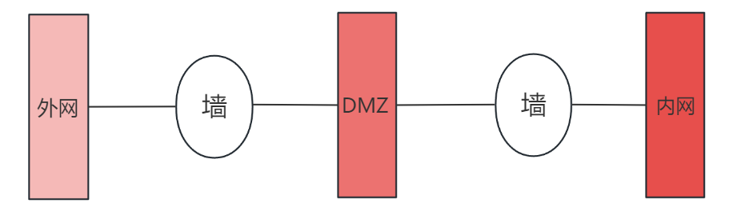
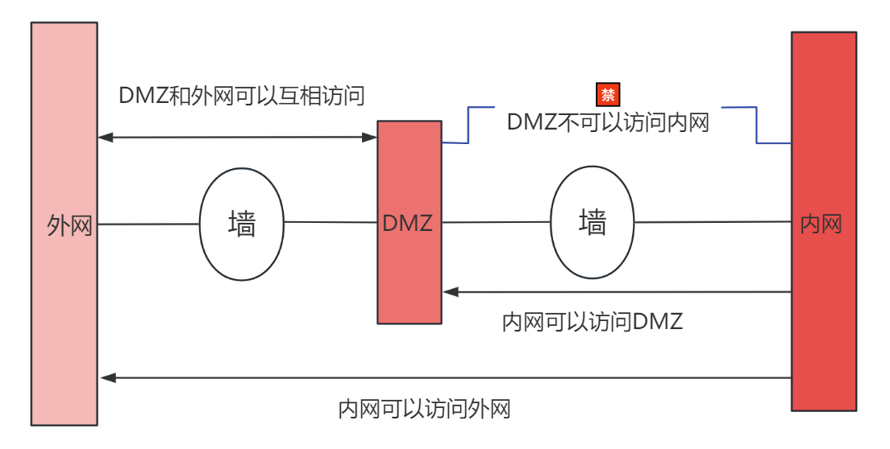

# 1、什么是DMZ区域

## 1.1、概念

DMZ 区域是为了解决**安装防火墙后外部网络的访问用户不能访问内部网络服务器的问题**，而设立的一个非安全系统与安全系统之间的缓冲区。

- 该缓冲区位于**企业内部网络**和**外部网络之间**的小网络区域内。
- 在这个小网络区域内可以放置一些必须公开的服务器，如Web服务器、FTP服务器
- 另一方面，通过这样一个DMZ区域，更加有效地保护了内部网络。因为这种网络部署，比起一般的防火墙方案，对来自外网的攻击者来说又多了一道关卡。

> 两个防火墙之间的空间被称为 DMZ 区域。

## 1.2、内网、DMZ、外网

- 安全级别最高的LAN Area （内网） 
- 安全级别中等的DMZ区域
- 安全级别最低的Internet区域（外网）

三个区域因担负不同的任务而拥有不同的访问策略。

## 1.3、DMZ的访问控制策略

我们在配置一个拥有DMZ区的网络的时候，通常定义以下的访问控制策略以实现DMZ区的屏蔽功能：

1. **内网可以访问外网**：内网的用户显然需要自由地访问外网。在这一策略中，**防火墙需要进行源地址转换**
2. **内网可以访问DMZ**：此策略是为了方便内网用户使用和管理DMZ中的服务器
3. **外网不能访问内网**：很显然，内网中存放的是公司内部数据，这些数据不允许外网的用户进行访问
4. **外网可以访问DMZ**：DMZ中的服务器本身就是要给外界提供服务的，所以外网必须可以访问DMZ。同时，外网访问DMZ需要由防火墙完成对外地址到服务器实际地址的转换。
5. **DMZ不能访问内网**：很明显，如果违背此策略，则当入侵者攻陷DMZ时，就可以进一步进攻到内网的重要数据。
6. **DMZ不能访问外网**：此条策略也有例外，比如DMZ中放置邮件服务器时，就需要访问外网，否则将不能正常工作。

