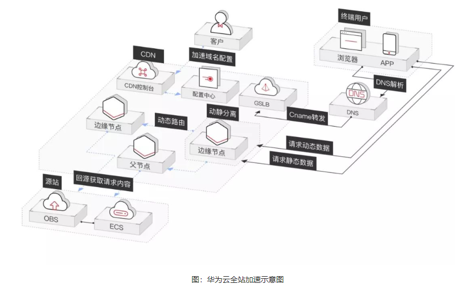

# 1、什么是CNAME


## 1.1、A记录

在说CNAME之前，要提到一个东西叫 A记录，即Address记录，它并不是一个IP或者一个域名，我们可以把它理解为一种指向关系：

```bash
# 域名
www.blog.com -> 1.1.1.1
```


## 1.2、CNAME

CNAME，也叫别名，相当于给A记录中的域名起个小名，比如`www.blog.com`的小名就叫`www.abc.com`，然后CNAME记录和A记录一样，是一种指向关系

```bash
#CNAME别名  ->   域名        -> IP地址
www.abc.com -> www.blog.com -> 1.1.1.1
```

这样以来，我们直接可以通过别名`www.abc.com`来访问`1.1.1.1`了

> 思考：这不他娘的多此一步了吗，不嫌麻烦吗？

假如这个时候我要给`www.blog.com`取多个别名，如下：

```bash
#CNAME别名  ->   域名        -> IP地址
www.abc.com -> www.blog.com -> 1.1.1.1
www.def.com -> www.blog.com -> 1.1.1.1
www.ghi.com -> www.blog.com -> 1.1.1.1
```

突然服务器的IP地址要从`1.1.1.1`更换成`2.2.2.2`，这个时候只需要把域名的指向修改即可：

```bash
#CNAME别名  ->   域名        -> IP地址
www.abc.com -> www.blog.com -> 2.2.2.2
www.def.com -> www.blog.com -> 2.2.2.2
www.ghi.com -> www.blog.com -> 2.2.2.2
```

这时候你又发现了，原来他的别名儿不需要做更改，直接就能访问服务器，因为他们都指向`www.blog.com`，**服务器的IP改变不影响CNAME**


## 1.3、CNAME的应用

常用在CDN加速上。


# 2、什么是CDN加速

CDN的全称是Content Delivery Network，即**内容分发网络**。

我们在浏览网络的时候，访问一个页面会向服务器请求很多网络资源，包括各种图片、声音、影片、文字等信息。**网站可以预先把内容分发至全国各地的加速节点**，这样用户就可以**就近获取所需内容**，避免网络拥堵、地域、运营商等因素带来的访问延迟问题。

所以：CDN加速可以解决因分布、带宽、服务器性能带来的访问延迟问题，适用于站点加速、点播、直播等场景。使用户可就近取得所需内容，解决 Internet网络拥挤的状况，提高用户访问网站的响应速度和成功率。


传统网站的请求响应过程一般经历以下步骤：

- 用户在自己的浏览器中输入要访问的网站域名。
- 浏览器向本地DNS服务器请求对该域名的解析。
- 本地DNS服务器中如果缓存有这个域名的解析结果，则直接响应用户的解析请求。
- 本地DNS服务器中如果没有关于这个域名的解析结果的缓存，则以迭代方式向整个DNS系统请求解析，获得应答后将结果反馈给浏览器。
- 浏览器得到域名解析结果，就是该域名相应的服务设备的IP地址 。
- 浏览器获取IP地址之后，经过标准的TCP握手流程，建立TCP连接。
- 浏览器向服务器发起HTTP请求。
- 服务器将用户请求内容传送给浏览器。
- 经过标准的TCP挥手流程，断开TCP连接。

引入CDN之后，用户访问网站一般经历以下步骤：

- 当用户点击网站页面上的内容URL，先经过本地DNS系统解析，如果本地DNS服务器没有相应域名的缓存，则本地DNS系统会将域名的解析权交给CNAME指向的CDN专用DNS服务器。
- CDN的DNS服务器将CDN的全局负载均衡设备IP地址返回给用户。
- 用户向CDN的全局负载均衡设备发起URL访问请求。
- CDN全局负载均衡设备根据用户IP地址，以及用户请求的URL，选择一台用户所属区域的区域负载均衡设备，并将请求转发到此设备上。
- 基于以下这些条件的综合分析之后，区域负载均衡设备会选择一个最优的缓存服务器节点，并从缓存服务器节点处得到缓存服务器的IP地址，最终将得到的IP地址返回给全局负载均衡设备：
- 根据用户IP地址，判断哪一个边缘节点距用户最近；
- 根据用户所请求的URL中携带的内容名称，判断哪一个边缘节点上有用户所需内容；
- 查询各个边缘节点当前的负载情况，判断哪一个边缘节点尚有服务能力。
- 全局负载均衡设备把服务器的IP地址返回给用户。
- 用户向缓存服务器发起请求，缓存服务器响应用户请求，将用户所需内容传送到用户终端。如果这台缓存服务器上并没有用户想要的内容，而区域均衡设备依然将它分配给了用户，那么这台服务器就要向它的上一级缓存服务器请求内容，直至追溯到网站的源服务器将内容拉到本地。




对于用户来说，唯一的感受就是使用网络更快了，CDN全局负载均衡设备与CDN区域负载均衡设备根据用户IP地址，将域名解析成相应节点中缓存服务器的IP地址，实现用户就近访问，从而提高服务端响应内容的速度。


