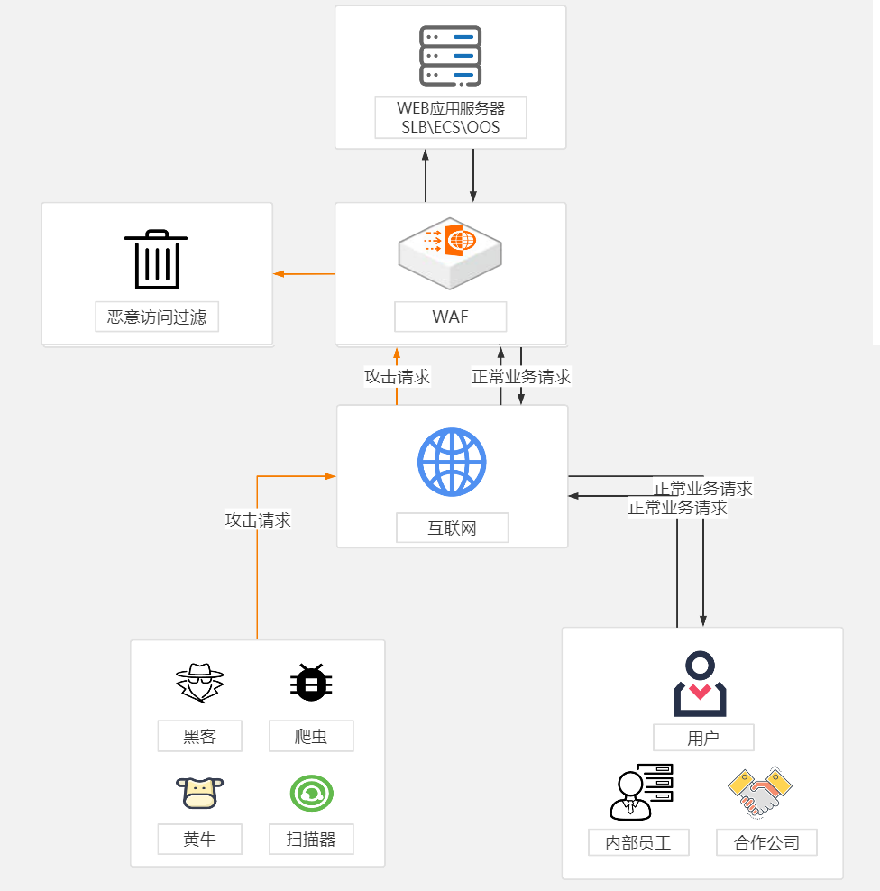

# 1、什么是DMZ区域

## 1.1、概念

DMZ 区域是为了解决**安装防火墙后外部网络的访问用户不能访问内部网络服务器的问题**，而设立的一个非安全系统与安全系统之间的缓冲区。

- 该缓冲区位于**企业内部网络**和**外部网络之间**的小网络区域内。
- 在这个小网络区域内可以放置一些必须公开的服务器，如Web服务器、FTP服务器
- 另一方面，通过这样一个DMZ区域，更加有效地保护了内部网络。因为这种网络部署，比起一般的防火墙方案，对来自外网的攻击者来说又多了一道关卡。

> 两个防火墙之间的空间被称为 DMZ 区域。

## 1.2、内网、DMZ、外网

- 安全级别最高的LAN Area （内网） 
- 安全级别中等的DMZ区域
- 安全级别最低的Internet区域（外网）

三个区域因担负不同的任务而拥有不同的访问策略。

## 1.3、DMZ的访问控制策略

我们在配置一个拥有DMZ区的网络的时候，通常定义以下的访问控制策略以实现DMZ区的屏蔽功能：

1. **内网可以访问外网**：内网的用户显然需要自由地访问外网。在这一策略中，**防火墙需要进行源地址转换**
2. **内网可以访问DMZ**：此策略是为了方便内网用户使用和管理DMZ中的服务器
3. **外网不能访问内网**：很显然，内网中存放的是公司内部数据，这些数据不允许外网的用户进行访问
4. **外网可以访问DMZ**：DMZ中的服务器本身就是要给外界提供服务的，所以外网必须可以访问DMZ。同时，外网访问DMZ需要由防火墙完成对外地址到服务器实际地址的转换。
5. **DMZ不能访问内网**：很明显，如果违背此策略，则当入侵者攻陷DMZ时，就可以进一步进攻到内网的重要数据。
6. **DMZ不能访问外网**：此条策略也有例外，比如DMZ中放置邮件服务器时，就需要访问外网，否则将不能正常工作。

## 1.4、案例

如上图，假如是一个行业云平台，那么其网络具象如上：

1. 网络区域分为外网区、DMZ区、内网区，其中 云 = DMZ区+ 内网区
2. 每个分隔出来的区域就代表一个VPC，如数字人资DMZ区VPC、数字人资内网区VPC....
3. VPC和VPC之间要连通必须满足三个条件：
   1. **建立高速通道**
   2. **建立路由**
   3. **开放安全组**
4. VPC内部的服务器连通性是由安全组限制的，例如数字人资内网区VPC里面有5台服务器，他们同属于一个安全组下。如果要让数字人资的其中3台服务器到微隔离内网区VPC的微隔离服务器连通，则：
   1. 首先打通数字人资内网区VPC到微隔离内网区VPC
   2. 数字人资3台服务器到微隔离server端开放安全组
5. 运维区和内网区是连通的，运维区VPC里面放蓝鲸提单平台、云上堡垒机等，从而保证通过堡垒机可以登录到任何服务器。

例如：

- 外网访问请求 -> 前置机 -> 外网墙 -> WAF - > 负载均衡SLB/Nginx -> 内网墙 -> ECSApp -> DB
- 若有前置机，请在外网墙设置策略，仅允许前置机的ip访问Nginx
- 若无前置机，请在Nginx上设置访问IP的白名单

# 2、Web应用防火墙WAF

## 2.1、什么是WAF

- Web应用防火墙（Web Application Firewall，简称WAF）
- 对网站或者App的业务流量进行恶意特征识别及防护，在对流量清洗和过滤后，将正常、安全的流量发送给服务器，避免网站服务器被恶意入侵导致性能异常等问题，从而保障网站的业务安全和数据安全。

阿里云WAF图：

## 1.2、CC攻击原理与防护

CC攻击是DDOS攻击的一种，是一种常见的网站攻击方法，攻击者通过代理服务器向受害主机不停访问，造成服务器资源耗尽，一直到宕机崩溃。

CC攻击利用代理服务器向网站发送大量需要较长计算时间的URL请求，如数据库查询等，导致服务器进行大量计算而很快达到自身的处理能力而形成DDOS。而攻击者一旦发送请求给代理后就主动断开连接，因为代理并不因为客户端这边连接的断开就不去连接目标服务器，因此攻击机的资源消耗相对很小，而从目标服务器看来，来自代理的请求都是合法的。

- DDoS是针对IP的攻击，而CC攻击的是网页
- DDos可以用硬件防火墙来过滤攻击，CC攻击本身的请求就是正常的请求，硬件防火墙对他起不到很好的防御效果。

CC攻击的常用防护方式：

1. 云WAF
   - 思路很简单，就是用户访问你的域名时，会经过WAF的代理扫描，发现问题直接拦下，没问题的话就把用户请求转到你的网站。
   - 优点：安装配置快速，大公司产品保障好
   - 缺点：WAF有绕过的风险，WAF对网站的保护主要是通过反向代理来实现，如果不经过这个代理，自然就无法防护网站，所以，攻击者如果找到方法可以获取网站的IP，那么就可以绕过WAF而直接攻击。并且如果您的网站访问数据属于保密信息，就不能使用WAF了。

2. web服务器端区分攻击者与正常访客：通过分析网站日志，基本可以分辨出哪个IP是CC攻击的
   - 例如普通浏览者访问一个网页，必定会连续抓取网页的HTML、CSS、JS和图片等一系列的相关文件，而CC攻击是通过程序来抓取网页，仅仅只会抓取一个URL地址的文件，不会抓取其他类型的文件。所以通过辨别攻击者的IP，进行屏蔽，就可以起到很好的防范效果。
3. 🔥限制IP连接数：**一般正常的浏览者肯定不会在一秒内连续多次极快的访问同一个页面，可以配置web服务器，限定ip访问频率**

> 对于攻击者而言，可以使用代理工具不断变换自己的ip来进行攻击。
>
> - [快代理](https://www.kuaidaili.com/)

# 3、堡垒机

- 堡垒机不是服务器。
- 堡垒机是一种安全审计系统，**也就是连接各种服务器和主机中心，管控数台服务器的访问权限和各种动作指令**，发挥监督员和审核员的功效。
- 服务器可以理解为一种比普通计算机运行和操作更多更快的一种服务工具。

# 4、VPN

- VPN - 虚拟专用网络
- **VPN是一条穿过混乱的公用网络的安全、稳定隧道，使用这条隧道可以对数据进行几倍加密达到安全使用互联网的目的**。
- 虚拟专用网是对企业内部网的扩展。虚拟专用网可以帮助远程用户、公司分支机构、商业伙伴及供应商同公司的内部网建立可信的安全连接，用于经济有效地连接到商业伙伴和用户的安全外联网虚拟专用网。

## 4.1、使用方式

1. 浏览器输入：进入即可下载`Easy Connect`
   - 电信：`https://108.026.001.56:1443/`
   - 移动：`https://072.128.25.71:1443/`
2. 华为云桌面下载：[华为云桌面](https://www.huaweicloud.com/product/workspace.html)
3. 打开`Easy Connect`，连接电信或者移动，首次登录需要绑定终端，输入OA账号与申请的密码，并且输入手机的FreeOTP软件动态码
4. 打开华为桌面云，输入：`10.86.7.017`
5. 输入账号和密码登录

# 5、构建机

想象银行的软件系统是一道复杂的菜（比如佛跳墙），需要很多步骤：切菜、炖汤、调味、摆盘……如果每次改菜谱（更新代码）都让厨师（程序员）手动操作，那太慢了！

这时候，银行搞了一个**“自动厨房”（构建机）**，它的作用是：

### **自动做菜（编译打包）**

- **程序员提交代码**（比如改了个转账按钮的颜色）。
- **构建机**立刻开工：
  - **买菜**：从代码仓库下载最新代码；
  - **切菜**：把代码编译成电脑能读的“机器语言”；
  - **炒菜**：打包成APP、网页或后台程序；
  - **试吃**：自动测试有没有bug（比如转账按钮点不开）；
  - **上菜**：把“成品菜”推送到手机银行/ATM等地方。

**结果**：原来手动要1小时的工作，构建机5分钟搞定！

### **保证每道菜都一样（环境一致）**

- 程序员A用Windows，程序员B用Mac，各自电脑环境不同，容易做出"味道不一样的菜"（运行结果不一致）。
- **构建机**：所有人提交的代码都在**同一个标准化厨房**里处理，确保佛跳墙永远是那个味！

### **记录每道菜的配方（版本追溯）**

- 如果某天手机银行崩溃了，构建机会告诉你：
  - **谁**改了代码？
  - **什么时候**改的？
  - **改了哪里**？（比如"厨师小王昨晚删了一行酱油代码"）
- 就像餐厅的监控录像，随时回放问题！

### **🌰 银行里的实际例子**

- **网银更新**：你看到APP提示"版本更新"，其实是构建机自动打包的新版本。
- **紧急修复**：黑客攻击时，构建机连夜编译安全补丁，2小时就推送给所有用户。

### **🚀 为什么需要构建机？**

- **避免"在我电脑上能跑"**：程序员常说的谎言，构建机让代码在统一环境测试。
- **24小时无休**：程序员下班了，构建机还在默默打包、测试、部署。
- **安全合规**：银行要求每次改动必须留痕，构建机自动记录所有操作。

> 构建机是银行的**“软件流水线”**——程序员提交代码后，它自动**编译、测试、打包、部署**，像机器人厨师一样又快又稳！（如果没它，每次更新都得让程序员手动"颠勺"，累死还容易出错😂）

# 6、前置机

我用一个生活中常见的比喻来解释**前置机**，让你轻松理解它的作用。

### 🍔 前置机 = 银行的"点餐柜台"

想象你去一家**超级火爆的汉堡店**（比如银行的核心系统），店里只有一个厨师（核心系统），但外面排了超多顾客（ATM、手机银行、POS机等）。如果所有人都直接冲进厨房点餐，厨师肯定会崩溃！这时候，店家在厨房门口设置了一个**点餐柜台（前置机）**，它的作用是这样的：

1. 分流顾客，避免厨房爆炸
   - **顾客（ATM/手机银行）**：把需求告诉点餐柜台（比如"要一个芝士汉堡"）。
   - **点餐柜台（前置机）**：先快速检查顾客的需求是否合理（比如"有钱付款吗？密码对吗？"），再把订单整理好，按顺序递给厨房（核心系统）。
   - **结果**：厨师（核心系统）不用同时处理100个订单，只需专注做汉堡，效率大大提高！

2. 翻译不同语言
   - **有的顾客说中文（比如手机银行用HTTP协议）**，**有的说英文（比如ATM用ISO8583协议）**，厨房（核心系统）只懂方言。
   - **点餐柜台（前置机）**：把所有人的话统一翻译成厨房能听懂的语言，避免沟通错误。

3. 挡住捣乱分子
   - 如果有人想混进厨房搞破坏（比如黑客攻击），点餐柜台会：
     - 检查他的会员卡（身份验证）；
     - 发现他没付钱就喊"要汉堡"（异常交易），直接拒之门外；
     - 只有合法的订单才会传给厨房。

4. 临时存单，避免丢生意
   - 如果厨房突然停电（核心系统崩溃），点餐柜台会：
     - 先把订单记在小本本上（缓存交易）；
     - 等厨房修好后，再按顺序补单；
     - 顾客（ATM）完全不知道后厨出过问题！

### 🌰 现实中的例子

- **ATM取钱**：你插卡输密码时，其实是前置机在检查；确认没问题后，它才去问核心系统："这人能取500块吗？"
- **手机转账**：你输入金额点击发送，前置机先快速验证（比如"对方账号存在吗？"），再提交给核心系统处理，避免你干等。

---

- 前置机的概念一般在**银行、券商、电信运营商**用的比较多，这类企业有很多后台核心处理系统，对外提供各种接口服务。
- 如果外部企业有某种业务接口需要跟这些企业的后台系统打交道，要外部网络访问这些企业是绝对不允许的。
- 这个时候，银行会要求外部企业开发一个软件，运行在银行的内网中，然后通过专线或硬件隔离技术将运行这个软件的**计算机连接到外部企业的外网系统上**，那么**运行这个软件的计算机，从功能上称呼为前置机**。

目前在银行普遍采用前置机的有ATM、POS、IC卡、银联金卡、电话银行、券银通、银税通、即缴费、公积金管理系统、电子汇兑和同城清算等系统

---

# 7、网关和路由器

> 现在，路由器集成了网关的功能，所以路由器也具有网关的功能。

1. 假设只有两个网络，网络A和网络B：
   - 要使网络A和网络B能够通信，只使用**网关**将这两个网络连接即可，因为只有两个网络，不需要决定网络间最短路径。
   - 从网关和路由器的定义来看，如果只是简单地连接两个网络，那么只需要网关就足够了。

> 如果需要连接多个网络，为了保证网络的可靠性，网络结构需要设计为全网状或部分网状，这样，为了网络间的通信，需要网关和路由器两种设备，**因为当前路由器集成了网关的功能，所以只使用路由器一种设备就可以了。**

2. 假定有4个网络：网络A、网络B、网络C、网络D
   - 要使这4个网络之间能够通信，另外为了保证网络的可靠性，将这4个网络进行全网状连接
   - **每个网络配置一个路由器**

## 7.1、默认网关

有时在Windows中设置网络时，我们经常会看到"默认网关"的设置。

- **默认网关指计算机所在网络边界的网关或路由器**，因为只有网关和路由器才知道如何到达其他网络。
- 对于网络内部的计算机来说，只有知道了默认网关的位置才能和网络外部通信。
- 所以默认网关是一个很重要的设置。但大多数情况下不需要我们手动设置，因为网络中的DHCP服务器可以自动提供默认网关的位置。

> [!note]
> 网关是一个概念。路由器是实现网关的一种设备。

# 8、域名分层

在互联网的世界里，域名是至关重要的标识符。它们不仅为网站提供了唯一且特定的地址，还反映了网站的组织结构、地理位置或业务类型。通常，我们可以根据域名中的不同层次来区分一级域名、二级域名和三级域名。这篇文章将详细解释这三个概念，并简单说明如何区分它们。

- **顶级域名就是一级域名**，比如： `.com`，`.net`，`.edu` 等，一级域名是由互联网域名管理机构（如 ICANN）进行注册和管理的，它们是互联网中的根域名。
- **二级域名**：二级域名位于一级域名之下，通常是在一级域名之前添加一个子域名。例如：`example.com` 中，`example` 就是二级域名。二级域名可以由组织或个人注册，用于标识特定的网站或服务。
- **三级域名**：三级域名位于二级域名之下，通常是在二级域名之前再添加一个子域名。例如，在 `blog.example.com` 中，`blog` 就是三级域名。三级域名通常用于区分同一网站内的不同部分或子网站。
- **四级域名**：四级域名是指在三级域名之下再添加一个子域名，形式类似于 `subdomain.blog.example.com`。然而，在实际使用中，通常不会出现四级域名，因为它们会使域名结构复杂化，而且较少被使用。

总结来说，一级域名、二级域名和三级域名是互联网地址的不同层次，它们分别代表了不同的级别和信息。

1. 一级域名通常表示一个国家、地区或特定的行业；
2. 二级域名通常是自定义的，表示公司、产品或服务的名称；
3. 三级域名则通常用于定义特定的网页或子网站。

## 8.1、示例

1. `www.example.com `是几级域名

答：

`www.example.com` 是三级域名。在这个域名中：

- `com` 是一级域名（顶级域名）。
- `example` 是二级域名。
- `www` 是三级域名。

每一级域名用点号（.）分隔，域名的级别是根据这些点号的数量来确定的。所以，`www.example.com` 中有两个点号，意味着有三个域名级别。

# 9、域名缓存

举个例子：

1. 你搭建了一个权威DNS服务器，这个服务器需要处理用户终端发起的域名查询请求
2. 假如用户量很大，访问域名频繁，或者说有些接口需要频繁调用网站域名的情况，那用户每次调用都去请求解析不太合理，DNS权威服务器也有负担
3. 所以一般DNS服务器在下发解析的时候是带有缓存时间的（10min或者是1h，主要由DNS服务器决定），而且这个缓存是下发到**用户终端、用户终端、用户终端**上的，**所以用户在访问域名的第一步不是直接去查解析，而是查本地host文件，然后是看缓存是否有这个解析记录，都没有的话才去请求解析**。

所以在公司比较常见到这种情况，**内网和公网域名切换的时效问题。**

## 9.1、内网环境

- 因为是在内部局域网搭建的DNS，这个缓存时间我们是可控的
- 比如我们域名为1h缓存时间，如果有的应用域名指向关系需要修改，又想要做到快速切换，那么我们就先将这个域名的缓存时间改成30s，然后等1h后再做域名指向关系的更改，这样下一次的缓存就会是30s

## 9.2、外网环境

用户在请求公司域名前，是会经过运营商的DNS，实际用户的缓存时间可能是由运营商下发的，那么就会存在问题：我改了缓存时间为30s，但运营商那边做了操作，下发给用户是1h

> 所以外网缓存要想做到秒级切换是不大可能

## 9.3、其他情况

图中内网也存在隔离环境的DMZ区域，所以外网访问先经过权威DNS服务器，之后再经过区域DNS服务器作解析。

# 11、真实IP与虚拟IP(VIP)

真实ip是网络运营商提供的，不能随意变更。而虚拟ip，是用户自己设置的可以变更。

网站云服务器开通后，云服务商会配置ip，云服务器ip有**内网ip和外网（公网）ip**，下面介绍一下这两种ip的区别。

## 11.1、网络结构

如图，假设我们的计算机现在就是设备一，我们想要访问百度。

1. 如果我们正使用着校园网，那么首先我们需要先通过校园网的路由器把我们的内网ip转为校园网的外网ip。（NAT转换）
2. 然后通过这个外网ip先连接上湖南电信的网关，最后在连接上百度的网关。
3. 百度把你请求的信息回传到你的校园网网关，校园网网关再把信息传给你（整个网络呈网状结构，它会自动找到一条通往百度的路径——基于深度优先搜索或者广度优先搜索）

## 11.2、外网(公网)ip和内网ip

- 公网ip具有世界范围的唯一性，而内网ip只在局域网内部具有唯一性。
- **一个局域网里所有电脑的内网IP是互不相同的,但共用一个外网IP。**

# 12、Vda和Vdb盘

在Linux系统（尤其是虚拟化环境）中，**`vda`和`vdb`是虚拟磁盘的命名标识**，通常用于表示不同用途的磁盘：

1. **`vda`：系统盘**
   - 这是**主磁盘**，一般用于安装操作系统和核心文件（如根目录`/`的挂载点）
2. **`vdb`：数据盘**
   - 这是**附加的磁盘**，主要用于存储用户数据、应用文件等非核心内容

# 13、南北向流量和东西向流量

- **南北向流量**指的是**从内部网络到外部网络（或从外部到内部）的数据流量**，也就是**穿越网络边界（如防火墙、路由器等）的流量**。是**进入或离开企业或数据中心的网络流量**。
  - 南北向流量通常由传统防火墙、WAF等设备防护
  - `例如奇安信天眼镜像防火墙的流量来捕捉南北向流量，镜像交换机的流量来捕捉东西向流量`。
- **东西向流量**指的是**在同一个网络内部（如数据中心内部、云环境内部）不同节点或系统之间的通信流量**，也就是**横向流动的流量**。例如同一VPC（虚拟私有云）内的虚拟机之间通信。
  - 东西向流量需要更细粒度的安全控制，如微隔离、安全组等

