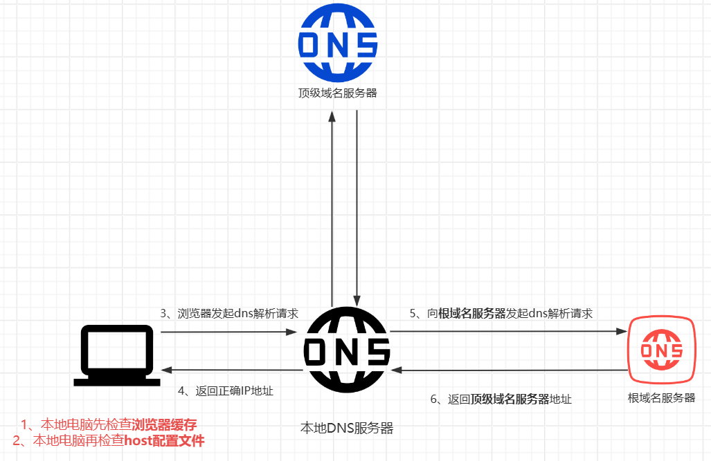
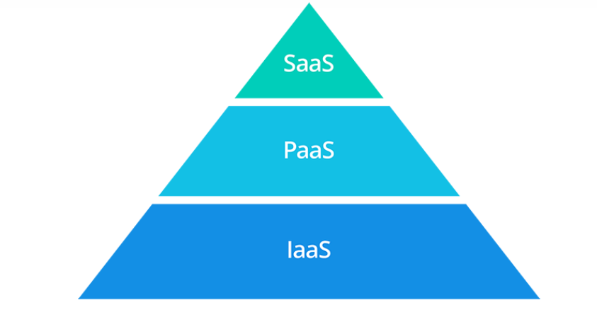
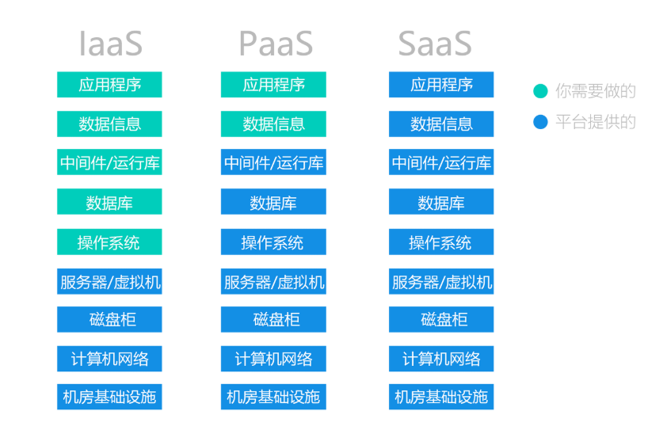
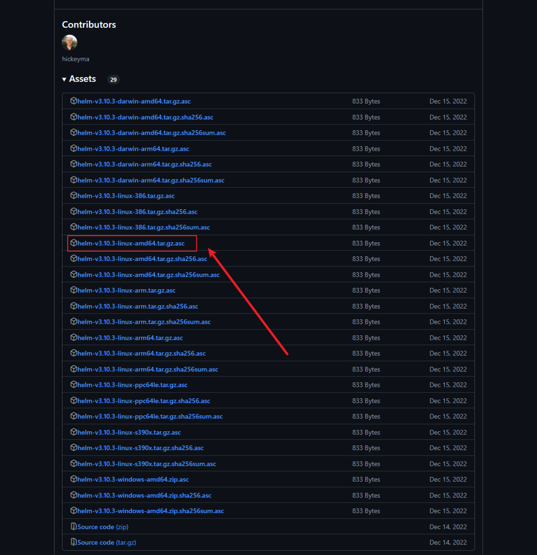
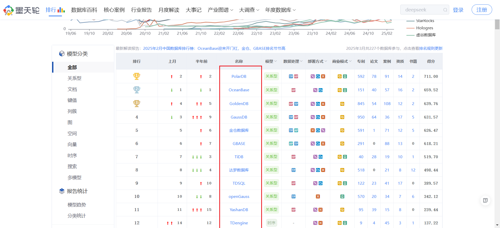
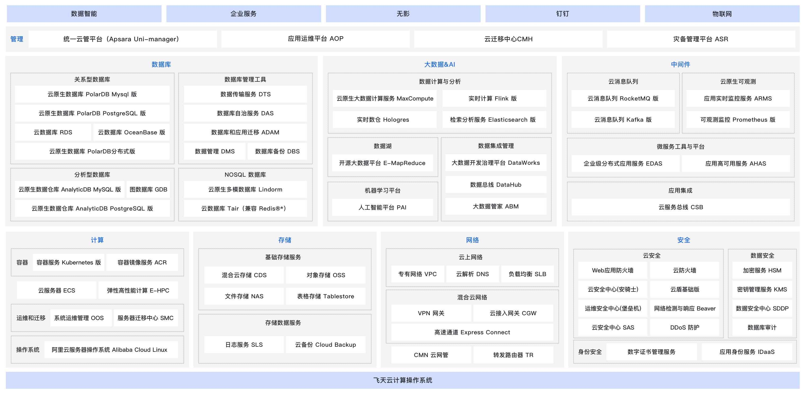
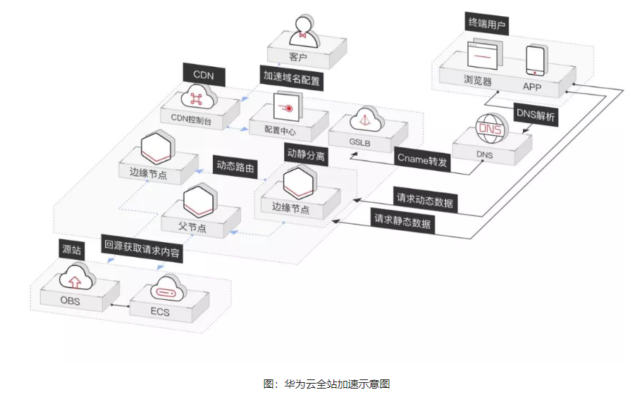
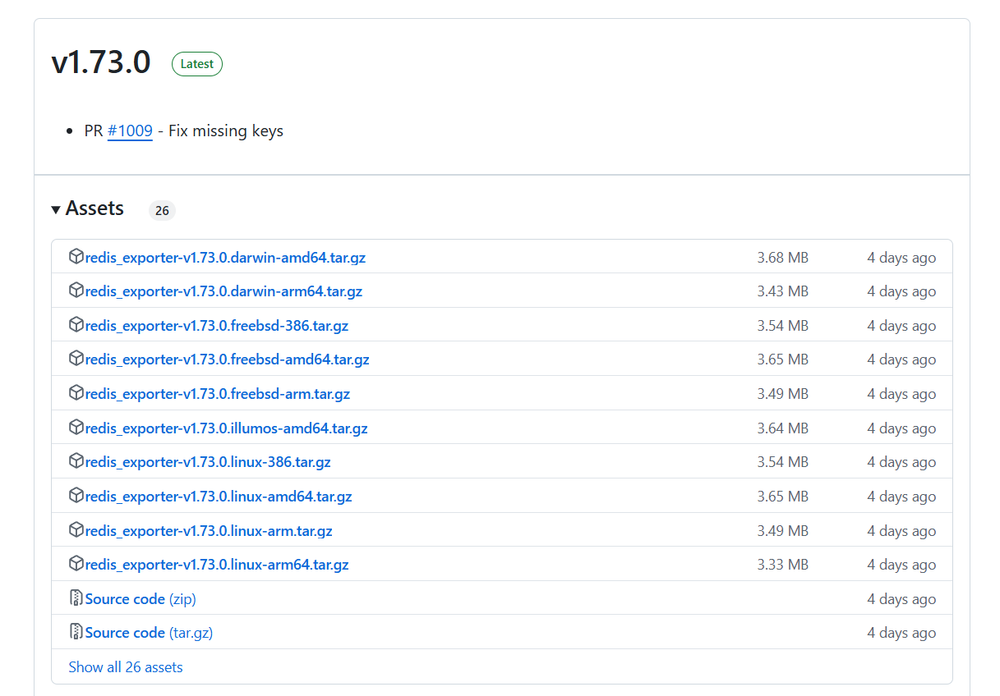
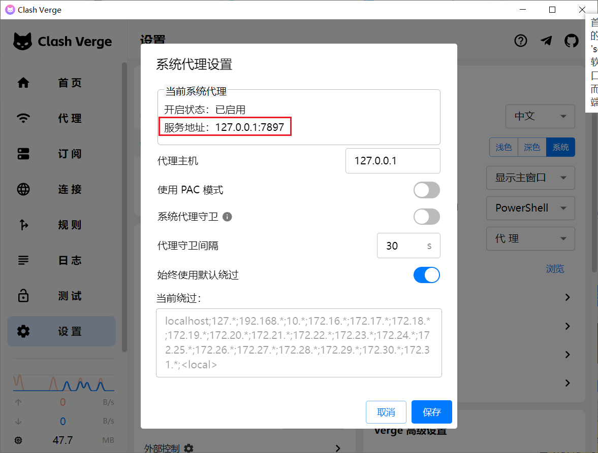

# 1、杀死知识

- [x] 持续集成工作中碰到的专有领域
- [x] 持续集成未知世界的探索与体验
- [x] 持续集成信息爆炸趋势杀死知识

## 1.1、单点登录——SSO

单点登录的英文名：Single Sign On（SSO），单点登录就是**在多个系统中，用户只需一次登录，各个系统即可感知该用户已经登录。**

> [什么是SSO？](https://zhuanlan.zhihu.com/p/66037342)


## 1.2、Syslog日志

- Syslog是面向管理员、面向整个系统的。一般syslog监控的是整个系统的状态。Syslog日志消息既可以打印在控制台、记录在本地文件中，也可以通过网络发送到接收Syslog的服务器。

> 比如采购的硬件，硬件的温度、CPU等日志可以通过Syslog日志传输至日志易，硬件的管理系统的日志也可以通过Syslog日志传输至日志易。


## 1.3、QPS

QPS（Query Per Second，**每秒处理请求数**）是用来衡量服务性能的一个重要指标，解决每秒数万次的高并发场景，这个指标非常关键。


## 1.4、DNS的解析过程

DNS就是域名系统，根据域名可以查找对应的IP地址，使用户更方便的访问互联网，而不用去记住能够被机器直接读取的IP地址。**我们上网访问的某个网站，输入的是网址，实际上机器访问的都是ip地址。**

例如我们访问：`www.baidu.com`



1. 首先本地电脑会检查**浏览器缓存**中有没有这个域名对应的IP地址，如果缓存中有，这个解析过程就结束。

2. 如果浏览器缓存中没有数据，浏览器会查找**操作系统缓存**中是否有这个域名对应的DNS解析结果(也就是Hosts文件)。Windows中是`C:\Windows\System32\drivers\etc\hosts` 文件，Linux是`/etc/hosts`。

   - 正是因为有这种本地DNS解析的规程，所以有黑客就可能通过修改Hosts来把特定的域名解析到他指定的IP地址上，导致这些域名被劫持。

3. 如果缓存都没有，那么操作系统会把域名发送给**本地DNS服务器**(即电信、联通、移动互联网线路供应商的服务器)，本地DNS服务器先查找自己的缓存记录，如果有记录，那么返回对于IP地址(其实大概80%的域名解析到本地DNS服务器就结束了，后续的DNS迭代和递归也是由本地DNS服务器负责。)

   - Windows在 控制面板 - 网络和共享中心 - 更改适配器设置 - 选中目标适配器右键选择属性 - Internet协议版本(TCP/IPv4) - 配置DNS地址

     

   - Linux在`/etc/resolv.conf` 里面设置

4. 如果本地DNS服务器仍然没有命中，就直接到**根域名服务器**请求解析。根域名服务器收到请求后，查看是`.com`顶级域名，于是返回`.com`**顶级域名服务器**的IP地址给到本地DNS服务器。
   - 顶级域名服务器是`.com、.cn`等，全球只有13台左右。
5. 本地DNS服务器收到回复后，向.com**顶级域名服务器**发起请求，顶级域名服务器收到请求后查看是`.baidu.com`二级域名，于是返回`.baidu.com`二级域名服务器的IP地址给到本地DNS服务器。
6. 本地DNS服务器收到回复后，向`.baidu.com`次级域名服务器发起请求并得到IP地址，于是电脑访问网站，并把记录写入DNS缓存中。

> - 权威DNS服务器是负责管理特定域名的DNS服务器，它存储着该域名的所有DNS记录，包括IP地址、别名（CNAME）、邮件交换服务器（MX）记录等。当用户或客户端尝试访问一个域名时，本地域名服务器会首先查询其缓存，如果缓存中没有相应的记录，它会向权威域名服务器发送查询请求。权威域名服务器随后返回该域名对应的IP地址或其他相关信息，使用户能够建立连接并访问所需的网站或服务。
> - 本地DNS服务器也就是LocalDNS


## 1.5、x86和arm架构

x86和arm架构是两种主流的CPU处理器架构，x86架构(AMD架构)是由Intel开发，arm架构是由ARM公司设计。

- X86的强项：力量与兼容性，**X86架构就像是一辆重型卡车，虽然油耗高，但能拉很多货**。它在桌面和服务器领域占据了主导地位，主要是因为它的强大计算能力和广泛的软件兼容性。你可以在X86电脑上运行几乎所有的软件和游戏，而不用担心兼容性问题。这就像是你有一把万能钥匙，可以打开任何一扇门。虽然它可能不是最省电的选择，但在需要大量计算的场景下，X86无疑是最佳选择。
- arm的优势：轻巧与高效，**ARM架构就像是一辆轻便的自行车，适合在城市里穿梭**。它的设计理念是低功耗和高效率，这使得它在移动设备和嵌入式系统中非常受欢迎。想象一下，你拿着一部手机，整天都在刷社交媒体、玩游戏、看视频，但电池依然坚挺。这就是ARM的魅力所在。它不像X86那样需要大量的电力来运行，而是像一只小猫一样，轻轻地在你手中打盹儿。

对于国产操作系统麒麟，麒麟芯片使用了arm指令集，并在此基础上进行自主研发的微架构设计。


## 1.6、dig命令域名查询工具

`dig`命令用于可以探测域名系统工作是否正常。

1. 目前官网已不支持Windows，Linux中安装如下：

```bash
yum install bind-utils -y
```

dig命令的作用很多：

- 查询域名的A记录（IPv4地址）
- 查询域名的AAAA记录（IPv6地址）
- 查询域名的MX记录（邮件服务器）
- 查询域名的NS记录（域名服务器）
- 查询域名的TXT记录（文本信息）
- 查询域名的CNAME记录（别名）
- 查询域名的SOA记录（授权起始记录）
- 查询域名的PTR记录（反向DNS查询）
- 查询域名的DNS解析路径

1. 查询域名的A记录（IPv4地址）

```bash
# 查询域名的A记录
dig aliyun.com
```

结果如下：

```bash
# dig的版本号和查询的域名
; <<>> DiG 9.11.4-P2-RedHat-9.11.4-26.P2.el7_9.16 <<>> aliyun.com
# 显示全局选项（如 +cmd 表示显示命令行信息）
;; global options: +cmd


;; Got answer:   # 表示收到了 DNS 服务器的响应
;; ->>HEADER<<- opcode: QUERY, status: NOERROR, id: 53961
;; flags: qr rd ra; QUERY: 1, ANSWER: 6, AUTHORITY: 0, ADDITIONAL: 0


;; QUESTION SECTION:
# 查询的域名、查询的类别(通常是IN)、查询的记录类型，这里是A记录（IPv4地址）
;aliyun.com.                    IN      A

# 重点看回答部分
;; ANSWER SECTION:
# 查询的域名、TTL(记录缓存时间)、记录类别、A记录、查询到的IPv4地址
aliyun.com.             5       IN      A       106.11.172.9
aliyun.com.             5       IN      A       140.205.135.3
aliyun.com.             5       IN      A       106.11.249.99
aliyun.com.             5       IN      A       106.11.253.83
aliyun.com.             5       IN      A       140.205.60.46
aliyun.com.             5       IN      A       106.11.248.146

# 查询耗时
;; Query time: 39 msec
# 使用的DNS服务器地址和端口
;; SERVER: 192.168.6.2#53(192.168.6.2)
;; WHEN: 三 2月 12 16:49:32 CST 2025
;; MSG SIZE  rcvd: 124
```


2. 查询域名的的NS记录
   - NS(Name Server记录)，就是指定哪个DNS服务器来解析该域名的记录。NS记录通常由域名注册商设置，用于将**域名和DNS服务器关联起来。**

```bash
dig chinagfb.com ns
```

结果如下：

```bash
; <<>> DiG 9.11.4-P2-RedHat-9.11.4-26.P2.el7_9.16 <<>> chinagfb.com ns
;; global options: +cmd
;; Got answer:
;; ->>HEADER<<- opcode: QUERY, status: NOERROR, id: 19600
;; flags: qr rd ra; QUERY: 1, ANSWER: 2, AUTHORITY: 0, ADDITIONAL: 22

;; QUESTION SECTION:
;chinagfb.com.                  IN      NS

# 重点看回答部分
;; ANSWER SECTION:
# 查询的域名、TTL(记录缓存时间)、记录类别、NS记录、dns服务器的地址
chinagfb.com.           5       IN      NS      vip3.alidns.com.
chinagfb.com.           5       IN      NS      vip4.alidns.com.

;; ADDITIONAL SECTION:
vip3.alidns.com.        5       IN      A       170.33.80.10
vip3.alidns.com.        5       IN      A       8.129.152.245
vip3.alidns.com.        5       IN      A       8.212.93.3
vip3.alidns.com.        5       IN      A       39.103.26.212
vip3.alidns.com.        5       IN      A       47.116.84.178
vip3.alidns.com.        5       IN      A       121.40.6.163
vip3.alidns.com.        5       IN      A       140.205.1.5
vip3.alidns.com.        5       IN      A       170.33.32.210
vip3.alidns.com.        5       IN      A       170.33.40.136
vip3.alidns.com.        5       IN      A       170.33.73.26
vip4.alidns.com.        5       IN      A       170.33.80.11
vip4.alidns.com.        5       IN      A       8.129.152.246
vip4.alidns.com.        5       IN      A       8.212.93.4
vip4.alidns.com.        5       IN      A       39.103.26.213
vip4.alidns.com.        5       IN      A       47.116.84.179
vip4.alidns.com.        5       IN      A       121.40.6.164
vip4.alidns.com.        5       IN      A       140.205.1.6
vip4.alidns.com.        5       IN      A       170.33.32.211
vip4.alidns.com.        5       IN      A       170.33.40.137
vip4.alidns.com.        5       IN      A       170.33.73.27
vip3.alidns.com.        5       IN      AAAA    2408:4009:500::3
vip4.alidns.com.        5       IN      AAAA    2408:4009:500::4

;; Query time: 30 msec
;; SERVER: 192.168.6.2#53(192.168.6.2)
;; WHEN: 三 2月 12 17:29:55 CST 2025
;; MSG SIZE  rcvd: 451
```


## 1.7、高可用HA

高可用HA（High Availability）是分布式系统架构设计中必须考虑的因素之一，它通常是指，通过设计减少系统不能提供服务的时间。

> [高可用演进方案（同城灾备、两地三中心、异地双活）](https://blog.csdn.net/sundehui01/article/details/123480266)：好文静心读！


## 1.8、A记录 ，CNAME，NS、泛域名和泛解析

- A记录：A（Address）记录是用来指定**域名对应的IP地址记录**。
- NS记录： NS（Name Server）记录是**域名服务器记录**，用来**指定该域名由哪个DNS服务器来进行解析**。**每个注册的域名都是由一个DNS域名服务器来进行解析的**，DNS服务器NS记录地址一般以以下的形式出现： ns1.domain.com、ns2.domain.com等。 简单的说，**NS记录是指定由哪个DNS服务器解析你的域名**。 

- CNAME记录：CNAME（Canonical Name ）别名记录，允许您将多个名字映射到同一台计算机。通常用于同时提供WWW和MAIL服务的计算机。例如，有一台计算机名为 `host.mydomain.com`（A记录），它同时提供WWW和MAIL服务，为了便于用户访问服务。可以为该计算机设置两个别名（CNAME）：WWW和MAIL， 这两个别名的全称就是`www.mydomain.com`和`mail.mydomain.com`，实际上他们都指向 `host.mydomain.com`。
- 泛域名是指在一个域名根下，以 `*.Domain.com`的形式表示这个域名根所有未建立的子域名。 泛解析是把`*.Domain.com`的A记录解析到某个IP地址上，通过访问任意的`前缀.domain.com`都能访问到你解析的站点上。 


## 1.9、防火墙、ids、ips、hids

- 防火墙和ips属于访问控制类产品，而ids属于审计类产品。
  - 将网络空间比喻成一个大厦，那么防火墙相当于门锁，有效隔离内外网或不同安全域
  - ids相当于监视系统，当有问题发生时及时产生警报
  - ips则是巡视和保证大厦安全的安保人员，能够根据经验，主动发现问题并采取措施。

| 特性     | 入侵检测系统ids                  | 入侵防御系统ips            | 防火墙                         |
| -------- | -------------------------------- | -------------------------- | ------------------------------ |
| 主要功能 | 监测网络流量，检测异常行为和攻击 | 监测并阻止网络攻击         | 控制网络流量，实施访问控制     |
| 工作原理 | 监测和分析网络流量，发现异常模式 | 监测并主动阻止攻击         | 依据设定的规则允许或阻止流量   |
| 响应机制 | 发出报警                         | 主动阻止攻击，可能断开连接 | 阻止或允许流量，通常不主动通知 |
| 部署位置 | 内部网络或网络边界               | 网络边界                   | 网络边界或内部网络             |
| 实时性   | 实时监测并报告                   | 实时监测并立即响应         | 实时处理流量并执行规则         |

- ids是检测，ips是防御。ids属于被动检测，对系统内部可能存在的威胁进行监控和预警。ips可以在网络攻击前做好防御，针对特定的攻击进行防护。
- ids通常位于网络的边缘，用于监控进出网络的流量，常作为旁站(并联)记录。而ips则位于网络的内部(串联)，介于防火墙和内部网络之间(DMZ)，以实现对网络流量的实时监控和阻断。

ids按照数据源可以分为：基于主机的入侵检测（Hids）和基于网络的入侵检测（Nids）

- Hids的检测目标主要是主机系统和本地用户。其检测原理是在每个需要保护的端系统（主机）上运行代理程序（agent），以主机的审计数据、系统日志、应用程序日志等为数据源，主要对主机的网络实时连接以及主机文件进行分析和判断。例如**阿里云安骑士**
- Nids是用于监控网络流量的专用设备或服务器，它可以监控我们想要保护的网络或 VLAN 的所有网络流量。例如**亚信安全的流量分析器**


## 1.10、IaaS、PaaS、SaaS

SaaS，PaaS和IaaS只是描述如何在企业中使用云的三种方式。

- IaaS：基础架构即服务
- PaaS：平台即服务
- SaaS：软件即服务



- **IaaS**：基于云的服务，按需付费，用于存储，网络和虚拟化等服务。
- **PaaS**： Internet上可用的硬件和软件工具。
- **SaaS**： 可通过互联网通过第三方获得的软件。
- **本地**：与您的企业安装在同一建筑物中的软件。



- **SaaS示例**：钉钉，企业微信，飞书
- **PaaS示例**：Netlify、Vercel
- **IaaS示例**： AWS，阿里云，腾讯云，华为云


## 1.11、ip变动


## 1.12、Linux安装软件的方式

在 Linux 系统中，常见的安装软件的方式有以下几种：

1. 使用包管理器

   - 基于 Debian 和 Ubuntu 的系统：`apt`

     ```bash
     sudo apt install wget  # 安装wget
     ```

   - 基于 Red Hat 和 CentOS的系统：`yum` 、`rpm`

     ```bash
     rpm -ivh package.rpm  # 安装指定的.rpm包
     ```

     > 对于内网缺失的，可以在外网下载 rpm 包，然后采用上述命令进行安装

2. 从源码编译安装：通常可以从软件的官方网站下载源码压缩包。

   ```bash
   tar -zxvf xxx.tar.gz  # 解压.tar.gz格式的压缩包
   
   # 进入解压后的目录，运行 ./configure 脚本，该脚本会检查系统环境和依赖项，并生成 Makefile 文件。
   cd xxx
   ./configure
   
   # 运行 make 命令进行编译
   make
   # 运行 make install 命令将编译好的软件安装到系统中
   sudo make install
   ```

3. Docker:拉取并运行容器


## 1.13、网速、宽带、带宽三者之间的关系是什么

**带宽**好比**车道的宽度，网速**则对应**车流的速度**。


## 1.14、NFS和Nas的关系

NFS是一种协议，允许一个系统在网络上与其他系统共享目录和文件。通过使用NFS，用户和程序可以像访问本地文件一样访问远程系统上的文件。NFS的主要特点包括：

- NFS服务器将共享的目录导出，NFS客户端可以将这些共享目录挂载到本地文件系统的某个挂载点。挂载后，客户端可以像访问本地目录一样访问远程目录。

NAS是一种存储设备，旨在将分布、独立的数据整合为大型、集中化管理的数据中心。NAS的主要特点包括：

- **专用存储服务器**：NAS是一种专用的数据存储服务器，包括存储设备和内嵌系统软件，提供跨平台文件共享功能
- **独立节点**：NAS通常在一个局域网（LAN）上占有自己的节点，无需应用服务器的干预，允许用户在网络上存取数据


## 1.16、CPU架构

之前在下载Helm的包时，发现Github的仓库里面有这么多密密麻麻的包，这对于初学者来说是下载哪个呢？



1. 首先先区分下arm和amd64，尽管一般我们无脑选x86_64/x64/AMD64就行了，但是这并不适合所有人，如何看自己的架构是什么呢？
   - 对于Linux系统而言,在控制台输入`lscpu`，该命令将显示有关你的 CPU 的详细信息,包括架构、型号。
     - 一般会出现x86_64架构或者arm，**x86_64表示是AMD架构，arm表示是ARM架构**。
     - 🔥==所以其实可以解释为CPU架构分为AMD架构和ARM架构，AMD架构里面包含x86==

2. 了解清楚后，发现后缀为`tar.gz.asc`，这他妈的又是什么后缀`.asc`？
   - `tar.gz`：是一种gz算法的压缩包
   - `tar.gz.asc`：是`tar.gz`文件的数字签名文件，数字签名是基于公钥加密技术的一种认证方式，用于验证文件的来源和完整性。用户可以使用相应的公钥来验证`.tar.gz.asc`签名文件，以确保`.tar.gz`文件在传输过程中没有被篡改，并且确实来自于声称的发布者，从而保证文件的安全性和可信度。
   - `tar.gz.sha256`: sha256是一种哈希算法，它会对`.tar.gz`文件的内容进行计算，生成一个固定长度（512 位）的哈希值，这个哈希值就像是文件的 "指纹"，只要文件内容发生任何微小的变化，哈希值都会完全不同。其目的主要用于验证`.tar.xz`文件的完整性。用


## 1.17、信创和非信创

面对百年未有之大变局的时代大环境下，信创产业的国产化开始了风雨中的艰难前行。这里的国产化，是全面开展的，从**服务器、操作系统、数据库**到应用软件的国产化改造。

### 1.17.1、CPU的国产化

目前CPU的国产选择主要有：海光、兆芯、鲲鹏、飞腾、龙芯、中威等。

- 其中**海光和兆芯**是通用IP内核授权模式，基于**X86(AMD)**授权来开发自己的芯片，特点是速度够快，成本够低，但自主可控性就稍微略差了。
- **飞腾**和华为的**鲲鹏**是通过指令集架构授权模式，基于**ARM**授权开发自己的芯片，特点是自主化程度更高，对移动端产品的支持更优秀。目前基于Arm V8的永久授权没有啥问题，可以在此基础上不断改改改。但Arm在升级至V9后将不再向这些国产CPU厂商提供Armv9的永久授权，后续风险不小。
- 最后**龙芯**和**申威**走的是授权+自主研制的模式，早期使用国外的指令集授权，后来自己开发，完全自主可控。


### 1.17.2、服务器国产化

再说说服务器的整机国产化，目前整机国产化厂商比较多，包括**浪潮、新华三、华为、联想、同方、长城、曙光**等。

- 浪潮的创新服务器，目前全国占比第一，主要为机架服务器、多节点服务器、整机柜服务器，主要布局普通级高端服务器市场。


### 1.17.3、操作系统国产化

- 国产操作系统主流是：**银河麒麟、中标麒麟、统信UOS、深度deepin**


### 1.17.4、数据库的国产化

数据库的选择就非常多了，根据墨天轮中国数据库流行度排行榜看，排名靠前的包括：




### 1.17.5、应用软件国产化

应用软件是建立在基础软件之上，直接面向用户层的软件部分，包括日常办公软件、业务软件、政务软件、社交软件等。常见的包括协同办公软件如**WPS**，流式版式软件如PDF，上网用浏览器如**360安全浏览器**。


## 1.18、麒麟SP1、SP2、SP3

银河麒麟高级服务器操作系统V10有多个版本，其中SP1和SP2是两个重要的版本。它们在性能、功能和用途等方面有一些区别。

```bash
# 要查看系统是SP1还是SP2
cat /etc/.productinfo
cat /etc/.kyinfo
```


## 1.19、常见的国密算法

国密算法是指由国家密码管理局制定和推广的一系列密码算法，这些算法广泛应用于国家安全、金融、通信等领域，以确保数据的机密性、完整性和可用性。

1. SM2：基于椭圆曲线公钥密码体制（ECC）的非对称加密算法。包括 SM2-1 椭圆曲线数字签名算法、SM2-2 椭圆曲线密钥交换协议、SM2-3 椭圆曲线公钥加密算法，分别用于实现数字签名、密钥协商和数据加密等功能。广泛应用于身份认证、数字签名以及密钥交换等领域，在金融行业、电子政务系统中有大量应用。
2. SM3：一种哈希函数算法，输出长度为 256 比特。通过哈希函数将任意长度的消息压缩成固定长度的摘要，摘要具有唯一性，常用于数据完整性校验、数字签名、数据完整性检测及消息验证等场合。
3. SM4:分组对称加密算法，分组大小和密钥长度均为 128 比特。加解密速度较快，消耗资源少，主要用于大数据量的加密和解密，如**文件加密**、网络传输加密、物联网设备之间的通信和数据加密等场景。

常见的不安全算法：

1. DES：密钥长度过短，容易被暴力破解。
2. 3DES：效率低
3. RC4：存在密钥生成漏洞
4. MD5：容易受到碰撞攻击
5. SHA1：容易受到碰撞攻击
6. RSA(<2048位)：密钥长度过短，

建议使用：AES、国密


## 1.20、机柜几U

在托管、购买服务器或者租用、使用机柜的时候，有时会听到1U、2U、4U或者42U等类似这样子的名词。而这些名词又代表什么意思呢？

- U是一种表示服务器外部尺寸的单位，是unit的缩略语，规定了服务器的尺寸，可以使服务器以一定的尺寸放在机架上。
  - 1U 服务器：服务器高度为 4.445 厘米
  - 2U 服务器：服务器高度为 4.445*2=8.89 厘米

由于服务商是根据服务器占用空间来计算费用的，所以采用 1U 服务器是最节省空间的和价格最低的。1U 的服务器扩展性不如 2U 服务器的好，硬盘数最多为 4 个，PCI 的插槽数最多为 2 个。而 2U 服务器的扩展性相较 1U 服务器的要好一些，硬盘数最多为 8 个，PCI 的插槽数可以到 6 个。


## 1.21、阿里云飞天

阿里云的**飞天企业版**是阿里云为企业客户提供的**私有化部署云平台**，将公有云的核心技术（如计算、存储、网络、安全等）打包成软硬一体化的解决方案，部署在企业本地数据中心或专有云环境中。它并非单一产品，而是一个**完整的云计算体系**，包含多个核心组件和服务。




这里主要谈一下相关的安全体系：


## 1.22、什么是CNAME

### 1.22.1、A记录

在说CNAME之前，要提到一个东西叫 A记录，即Address记录，它并不是一个IP或者一个域名，我们可以把它理解为一种指向关系：

```bash
# 域名
www.blog.com -> 1.1.1.1
```


### 1.22.2、CNAME

CNAME，也叫别名，相当于给A记录中的域名起个小名，比如`www.blog.com`的小名就叫`www.abc.com`，然后CNAME记录和A记录一样，是一种指向关系

```bash
#CNAME别名  ->   域名        -> IP地址
www.abc.com -> www.blog.com -> 1.1.1.1
```

这样以来，我们直接可以通过别名`www.abc.com`来访问`1.1.1.1`了

> 思考：这不他娘的多此一步了吗，不嫌麻烦吗？

假如这个时候我要给`www.blog.com`取多个别名，如下：

```bash
#CNAME别名  ->   域名        -> IP地址
www.abc.com -> www.blog.com -> 1.1.1.1
www.def.com -> www.blog.com -> 1.1.1.1
www.ghi.com -> www.blog.com -> 1.1.1.1
```

突然服务器的IP地址要从`1.1.1.1`更换成`2.2.2.2`，这个时候只需要把域名的指向修改即可：

```bash
#CNAME别名  ->   域名        -> IP地址
www.abc.com -> www.blog.com -> 2.2.2.2
www.def.com -> www.blog.com -> 2.2.2.2
www.ghi.com -> www.blog.com -> 2.2.2.2
```

这时候你又发现了，原来他的别名儿不需要做更改，直接就能访问服务器，因为他们都指向`www.blog.com`，**服务器的IP改变不影响CNAME**


### 1.22.3、CNAME的应用

常用在CDN加速上。


## 1.23、什么是CDN加速

CDN的全称是Content Delivery Network，即**内容分发网络**。

我们在浏览网络的时候，访问一个页面会向服务器请求很多网络资源，包括各种图片、声音、影片、文字等信息。**网站可以预先把内容分发至全国各地的加速节点**，这样用户就可以**就近获取所需内容**，避免网络拥堵、地域、运营商等因素带来的访问延迟问题。

所以：CDN加速可以解决因分布、带宽、服务器性能带来的访问延迟问题，适用于站点加速、点播、直播等场景。使用户可就近取得所需内容，解决 Internet网络拥挤的状况，提高用户访问网站的响应速度和成功率。


传统网站的请求响应过程一般经历以下步骤：

- 用户在自己的浏览器中输入要访问的网站域名。
- 浏览器向本地DNS服务器请求对该域名的解析。
- 本地DNS服务器中如果缓存有这个域名的解析结果，则直接响应用户的解析请求。
- 本地DNS服务器中如果没有关于这个域名的解析结果的缓存，则以迭代方式向整个DNS系统请求解析，获得应答后将结果反馈给浏览器。
- 浏览器得到域名解析结果，就是该域名相应的服务设备的IP地址 。
- 浏览器获取IP地址之后，经过标准的TCP握手流程，建立TCP连接。
- 浏览器向服务器发起HTTP请求。
- 服务器将用户请求内容传送给浏览器。
- 经过标准的TCP挥手流程，断开TCP连接。

引入CDN之后，用户访问网站一般经历以下步骤：

- 当用户点击网站页面上的内容URL，先经过本地DNS系统解析，如果本地DNS服务器没有相应域名的缓存，则本地DNS系统会将域名的解析权交给CNAME指向的CDN专用DNS服务器。
- CDN的DNS服务器将CDN的全局负载均衡设备IP地址返回给用户。
- 用户向CDN的全局负载均衡设备发起URL访问请求。
- CDN全局负载均衡设备根据用户IP地址，以及用户请求的URL，选择一台用户所属区域的区域负载均衡设备，并将请求转发到此设备上。
- 基于以下这些条件的综合分析之后，区域负载均衡设备会选择一个最优的缓存服务器节点，并从缓存服务器节点处得到缓存服务器的IP地址，最终将得到的IP地址返回给全局负载均衡设备：
- 根据用户IP地址，判断哪一个边缘节点距用户最近；
- 根据用户所请求的URL中携带的内容名称，判断哪一个边缘节点上有用户所需内容；
- 查询各个边缘节点当前的负载情况，判断哪一个边缘节点尚有服务能力。
- 全局负载均衡设备把服务器的IP地址返回给用户。
- 用户向缓存服务器发起请求，缓存服务器响应用户请求，将用户所需内容传送到用户终端。如果这台缓存服务器上并没有用户想要的内容，而区域均衡设备依然将它分配给了用户，那么这台服务器就要向它的上一级缓存服务器请求内容，直至追溯到网站的源服务器将内容拉到本地。



对于用户来说，唯一的感受就是使用网络更快了，CDN全局负载均衡设备与CDN区域负载均衡设备根据用户IP地址，将域名解析成相应节点中缓存服务器的IP地址，实现用户就近访问，从而提高服务端响应内容的速度。


## 1.24、什么是U盾

我用一个生活中常见的比喻来解释**U盾**，让你轻松理解它的作用：


想象你有一个**超级保险箱**（你的银行账户），里面放着你的钱。这个保险箱的锁很特别：

- **普通钥匙（密码）**：别人偷看到密码，就能打开保险箱。
- **U盾（电子钥匙）**：必须把**这把实物钥匙**插到电脑/手机上，才能开锁，而且每次开锁的密码都不一样！

### 🔧 U盾的工作原理

1. **你转账时**：
   - 输入金额、对方账号 → 银行系统说："请用U盾确认！"
   - **插上U盾**（或手机连接蓝牙U盾） → U盾自动生成一个**一次性密码**（动态口令）。
   - 输入这个密码 → 转账完成！
2. **黑客想搞事？**：
   - 就算他们偷了你的**银行卡密码**，但**没有U盾**，就像偷了钥匙却不知道保险箱在哪！
   - 就算他们拦截了**上一次的密码**，但下次U盾会生成**全新的密码**，旧密码直接作废！

### 🌰 现实中的例子

- **大额转账**：比如你要转10万元，银行会强制要求U盾验证，避免手滑或被诈骗。
- **企业发工资**：公司财务用U盾登录网银，批量转账给员工，没有U盾谁都无法操作账户

### 🚫 为什么U盾比短信验证码安全？

- **短信验证码**：可能被木马拦截或SIM卡复制。
- U盾：
  - 是**实物设备**，黑客碰不到；
  - 密码在U盾内部生成，**不经过网络**；
  - 每次密码只能用一次，过期失效。

> U盾就是你的**私人电子保镖**——转账时必须把它"召唤"出来，生成一个**限时一次性密码**，确保只有你本人能操作账户！ 

---

U盾（USB Key），又称U-key或数字证书密钥，是一种用于网络身份认证和安全加密的硬件设备，外形类似U盘。它通过存储用户的数字证书和私钥，结合密码技术，提供高强度的安全保护，广泛应用于网银、电子政务等领域。

主要作用：

1. **身份认证**
   U盾内置用户的​**​数字证书​**​，相当于网络身份证。登录网银或系统时，U盾验证身份真实性，防止他人冒用。
2. **数据加密与签名**
   - **加密传输**：使用非对称加密（如RSA算法）保护交易数据，防止传输中被窃取。
   - **数字签名**：用户操作（如转账）需通过U盾生成唯一签名，确保操作不可抵赖和篡改。
3. **双因素认证**
   结合“物理设备（U盾）+密码”双重验证，即使密码泄露，无U盾仍无法操作，大幅提升安全性。
4. **防御网络攻击**
   - **防钓鱼网站**：U盾仅与真实服务器通信，避免用户误入假冒网站。
   - **防病毒窃取**：私钥存储在U盾芯片内，无法被电脑病毒直接读取。
5. **法律效力**
   数字签名具备法律效力，在电子合同、电子政务等场景中可作为有效凭证


典型应用场景：

- **网上银行**：大额转账、账户管理需插入U盾验证。
- **电子政务**：企业报税、社保办理等需U盾签名确保合法性。
- **企业VPN/系统**：内部系统登录或访问敏感数据时加强认证。
- **电子商务**：B2B交易中用于签署电子合同。


## 1.25、Github的releases版本号




- redis_exporter-v1.73.0.darwin-amd64.tar.gz：
  - **`darwin`**：表示该二进制文件是为 **macOS（Darwin 内核）** 系统编译的，适用于苹果电脑（如 MacBook、iMac 等）
  - **`amd64`**：对应 **64 位 x86 架构**（Intel/AMD 的现代 CPU），适用于大多数个人电脑和服务器。
- redis_exporter-v1.73.0.freebsd-386.tar.gz：
  - **`freebsd`**：表示该二进制文件是为 **FreeBSD** 系统编译的，适用于 FreeBSD 操作系统（一种类 Unix 系统，常用于服务器或嵌入式设备）。
  - **`386`**：对应 **32 位 x86 架构**（旧款 CPU，如 Intel 80386 兼容处理器），适用于较老的设备或特定嵌入式场景。
- redis_exporter-v1.73.0.illumos-amd64.tar.gz：
  - **`illumos`**：表示该版本是为 **illumos 操作系统** 编译的。常见 illumos 发行版：**SmartOS**、OmniOS、OpenIndiana 等
- redis_exporter-v1.73.0.linux-amd64.tar.gz：
  - 表示该版本是为 **Linux 操作系统** 编译的。Linux 是广泛使用的开源操作系统，适用于个人电脑、服务器、嵌入式设备等几乎所有场景。

# 2、Project Hunter

- [x] 持续集成应用安全设计实践


## 2.1、公钥、私钥、数字签名、数字证书

> [好文推荐](https://blog.csdn.net/TheSkyLee/article/details/108699243)

- 对称加密：对称加密是指加密和解密时使用同一个密钥
- 非对称加密：非对称加密是指加密和解密使用不同的密钥，这两个密钥分别叫做**「公钥」、「私钥」**
  - 公钥是可以公开给所有人的，而私钥需要自己保密的
  - **公钥加密的数据只能用私钥解密**，同理，私钥加密的数据只能用公钥解密


其实准确的说法应该是 **私钥签名，公钥验签**。

- 《私钥按手印签名 + 内容》 传输给B 《公钥验证签名 + 内容》，**其中这个签名其实就是为了防止数据来源被篡改，也就是确认发送者的身份。** 

- 但是上面的方法还不够保险，我们就引入了**数字证书**，需要找可信的第三方帮我们签名，即证书颁布机构CA。

---

1. 非对称加密中公私钥都可以加密，那么什么时候用公钥加密，什么时候用私钥加密?
   - 加密场景，那么肯定希望只有我才能解密，别人只能加密。即**公钥加密，私钥解密。**
   - 签名场景，既然是签名，就希望只能我才能签名，别人只能验证。即**私钥签名，公钥验签**

2. 什么是数字签名，数字签名的作用是什么？
   - 数字签名就是使用私钥对数据摘要进行签名，并附带和数据一起发送。
   - 可以起到防篡改、防伪装、防否认的作用。

3. 什么是数字证书，数字证书存在解决了什么问题？
   - 数字证书就是由 CA 机构使用自己私钥，对证书申请者的公钥进行签名认证。
   - 数字证书解决了如何安全分发公钥的问题，也奠定了信任链的基础。


## 2.2、CA证书

CA证书（Certificate Authority）是由**数字证书认证机构（CA，Certificate Authority）**颁发的一种电子文件，用于验证网站、服务器或个人的身份，并确保数据传输的加密安全。它是互联网信任体系的核心，广泛应用于HTTPS、电子邮件加密、代码签名等场景。

1. CA机构会严格审核申请者的真实身份（如企业营业执照、域名所有权等），确保证书持有者的身份可信。例如，当访问`https://www.example.com`时，浏览器会检查该网站的CA证书，确认它确实属于`example.com`而非钓鱼网站。
2. **数据加密**CA证书包含**公钥**，与**服务器端的私钥**配对，用于建立SSL/TLS加密连接（如HTTPS）。确保用户与网站之间的通信（如密码、银行卡号）不被窃听或篡改。

3. CA证书通常在浏览器中内置的。

示例：

当访问`https://github.com`时：

1. 服务器返回GitHub的SSL证书。
2. 浏览器检查证书是否由DigiCert等受信CA签发。
3. 验证通过后，地址栏显示🔒标志，连接进入加密状态。


## 2.3、常见证书文件类型说明

证书文件通常分为`.crt` 、`.pem`、 `.key`

- `.crt` 通常包含服务器的公钥证书(由CA签发)
- `.key` 通常是服务器的私钥证书
- `.pem` 通常是证书、私钥、证书链的组合。

> 通常WAF上挂载的证书文件就是`.crt` 、`.pem`、 `.key` 证书，挂载证书的主要目的就是解密流量。


## 2.4、冗余部署

有时候听到某某设备进行**冗余部署**，第一想法有点奇怪，**冗余**不是个贬义词吗？有点堵塞的感觉。其实主要是为了提高系统的HA高可用、业务连续性和安全性。

- 核心目的：避免单点故障
- 冗余部署的作用：两台设备组成**主备**或者**双活**模式，当一台故障时，另一台自动接管流量，确保服务不中断。


## 2.5、git配置走代理



1. 配置Git使用代理

```bash
# 科学上网的代理软件的端口是什么后面的端口就改为什么
git config --global http.proxy 'http://127.0.0.1:7897'
```

2. 配置完成后，您可以通过查看Git配置来验证代理设置是否成功

```bash
git config --global --get http.proxy
```

3. 如果您想取消Git的代理配置，可以使用以下命令

```bash
git config --global --unset http.proxy
```


