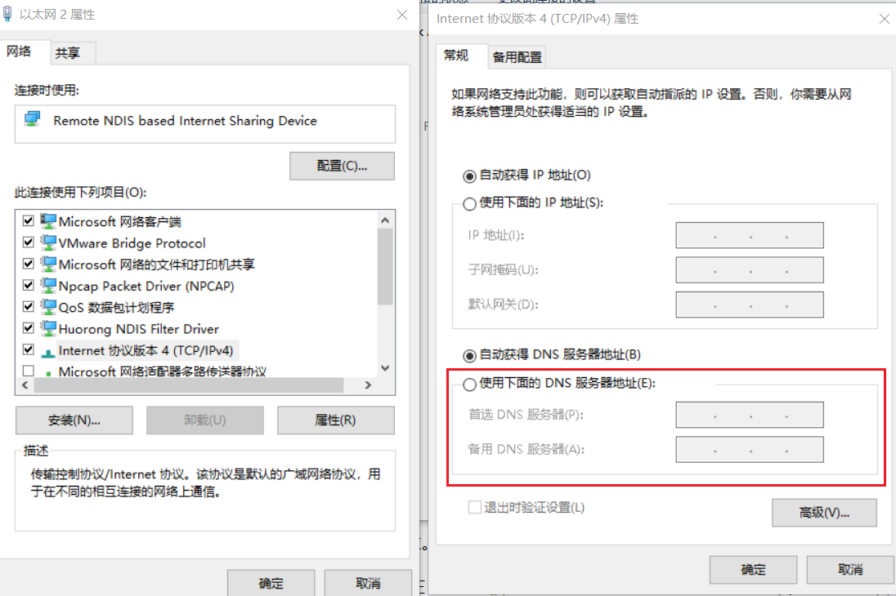

# 1、杀死知识

- [x] 持续集成工作中碰到的专有领域
- [x] 持续集成未知世界的探索与体验
- [x] 持续集成信息爆炸趋势杀死知识

## 1.1、单点登录——SSO

单点登录的英文名：Single Sign On（SSO），单点登录就是**在多个系统中，用户只需一次登录，各个系统即可感知该用户已经登录。**

> [什么是SSO？](https://zhuanlan.zhihu.com/p/66037342)


## 1.2、Syslog日志

- Syslog是面向管理员、面向整个系统的。一般syslog监控的是整个系统的状态。Syslog日志消息既可以打印在控制台、记录在本地文件中，也可以通过网络发送到接收Syslog的服务器。

> 比如采购的硬件，硬件的温度、CPU等日志可以通过Syslog日志传输至日志易，硬件的管理系统的日志也可以通过Syslog日志传输至日志易。


## 1.3、QPS

QPS（Query Per Second，**每秒处理请求数**）是用来衡量服务性能的一个重要指标，解决每秒数万次的高并发场景，这个指标非常关键。


## 1.4、DNS的解析过程

DNS就是域名系统，根据域名可以查找对应的IP地址，使用户更方便的访问互联网，而不用去记住能够被机器直接读取的IP地址。**我们上网访问的某个网站，输入的是网址，实际上机器访问的都是ip地址。**

例如我们访问：`www.baidu.com`


1. 首先本地电脑会检查**浏览器缓存**中有没有这个域名对应的IP地址，如果缓存中有，这个解析过程就结束。

2. 如果浏览器缓存中没有数据，浏览器会查找**操作系统缓存**中是否有这个域名对应的DNS解析结果(也就是Hosts文件)。Windows中是`C:\Windows\System32\drivers\etc\hosts` 文件，Linux是`/etc/hosts`。

   - 正是因为有这种本地DNS解析的规程，所以有黑客就可能通过修改Hosts来把特定的域名解析到他指定的IP地址上，导致这些域名被劫持。

3. 如果缓存都没有，那么操作系统会把域名发送给**本地DNS服务器**(即电信、联通、移动互联网线路供应商的服务器)，本地DNS服务器先查找自己的缓存记录，如果有记录，那么返回对于IP地址(其实大概80%的域名解析到本地DNS服务器就结束了，后续的DNS迭代和递归也是由本地DNS服务器负责。)

   - Windows在 控制面板 - 网络和共享中心 - 更改适配器设置 - 选中目标适配器右键选择属性 - Internet协议版本(TCP/IPv4) - 配置DNS地址

     

   - Linux在`/etc/resolv.conf` 里面设置

4. 如果本地DNS服务器仍然没有命中，就直接到**根域名服务器**请求解析。根域名服务器收到请求后，查看是`.com`顶级域名，于是返回`.com`**顶级域名服务器**的IP地址给到本地DNS服务器。
   - 顶级域名服务器是`.com、.cn`等，全球只有13台左右。
5. 本地DNS服务器收到回复后，向.com**顶级域名服务器**发起请求，顶级域名服务器收到请求后查看是`.baidu.com`二级域名，于是返回`.baidu.com`二级域名服务器的IP地址给到本地DNS服务器。
6. 本地DNS服务器收到回复后，向`.baidu.com`次级域名服务器发起请求并得到IP地址，于是电脑访问网站，并把记录写入DNS缓存中。

> - 权威DNS服务器是负责管理特定域名的DNS服务器，它存储着该域名的所有DNS记录，包括IP地址、别名（CNAME）、邮件交换服务器（MX）记录等。当用户或客户端尝试访问一个域名时，本地域名服务器会首先查询其缓存，如果缓存中没有相应的记录，它会向权威域名服务器发送查询请求。权威域名服务器随后返回该域名对应的IP地址或其他相关信息，使用户能够建立连接并访问所需的网站或服务。
> - 本地DNS服务器也就是LocalDNS


## 1.5、x86和arm架构

x86和arm架构是两种主流的CPU处理器架构，x86架构是由Intel开发，arm架构是由ARM公司设计。

- X86的强项：力量与兼容性，**X86架构就像是一辆重型卡车，虽然油耗高，但能拉很多货**。它在桌面和服务器领域占据了主导地位，主要是因为它的强大计算能力和广泛的软件兼容性。你可以在X86电脑上运行几乎所有的软件和游戏，而不用担心兼容性问题。这就像是你有一把万能钥匙，可以打开任何一扇门。虽然它可能不是最省电的选择，但在需要大量计算的场景下，X86无疑是最佳选择。
- arm的优势：轻巧与高效，**ARM架构就像是一辆轻便的自行车，适合在城市里穿梭**。它的设计理念是低功耗和高效率，这使得它在移动设备和嵌入式系统中非常受欢迎。想象一下，你拿着一部手机，整天都在刷社交媒体、玩游戏、看视频，但电池依然坚挺。这就是ARM的魅力所在。它不像X86那样需要大量的电力来运行，而是像一只小猫一样，轻轻地在你手中打盹儿。

对于国产操作系统麒麟，麒麟芯片使用了arm指令集，并在此基础上进行自主研发的微架构设计。


## 1.6、dig命令域名查询工具

`dig`命令用于可以探测域名系统工作是否正常。

1. 目前官网已不支持Windows，Linux中安装如下：

```bash
yum install bind-utils -y
```

dig命令的作用很多：

- 查询域名的A记录（IPv4地址）
- 查询域名的AAAA记录（IPv6地址）
- 查询域名的MX记录（邮件服务器）
- 查询域名的NS记录（域名服务器）
- 查询域名的TXT记录（文本信息）
- 查询域名的CNAME记录（别名）
- 查询域名的SOA记录（授权起始记录）
- 查询域名的PTR记录（反向DNS查询）
- 查询域名的DNS解析路径

1. 查询域名的A记录（IPv4地址）

```bash
# 查询域名的A记录
dig aliyun.com
```

结果如下：

```bash
# dig的版本号和查询的域名
; <<>> DiG 9.11.4-P2-RedHat-9.11.4-26.P2.el7_9.16 <<>> aliyun.com
# 显示全局选项（如 +cmd 表示显示命令行信息）
;; global options: +cmd


;; Got answer:   # 表示收到了 DNS 服务器的响应
;; ->>HEADER<<- opcode: QUERY, status: NOERROR, id: 53961
;; flags: qr rd ra; QUERY: 1, ANSWER: 6, AUTHORITY: 0, ADDITIONAL: 0


;; QUESTION SECTION:
# 查询的域名、查询的类别(通常是IN)、查询的记录类型，这里是A记录（IPv4地址）
;aliyun.com.                    IN      A

# 重点看回答部分
;; ANSWER SECTION:
# 查询的域名、TTL(记录缓存时间)、记录类别、A记录、查询到的IPv4地址
aliyun.com.             5       IN      A       106.11.172.9
aliyun.com.             5       IN      A       140.205.135.3
aliyun.com.             5       IN      A       106.11.249.99
aliyun.com.             5       IN      A       106.11.253.83
aliyun.com.             5       IN      A       140.205.60.46
aliyun.com.             5       IN      A       106.11.248.146

# 查询耗时
;; Query time: 39 msec
# 使用的DNS服务器地址和端口
;; SERVER: 192.168.6.2#53(192.168.6.2)
;; WHEN: 三 2月 12 16:49:32 CST 2025
;; MSG SIZE  rcvd: 124
```


2. 查询域名的的NS记录
   - NS(Name Server记录)，就是指定哪个DNS服务器来解析该域名的记录。NS记录通常由域名注册商设置，用于将**域名和DNS服务器关联起来。**

```bash
dig chinagfb.com ns
```

结果如下：

```bash
; <<>> DiG 9.11.4-P2-RedHat-9.11.4-26.P2.el7_9.16 <<>> chinagfb.com ns
;; global options: +cmd
;; Got answer:
;; ->>HEADER<<- opcode: QUERY, status: NOERROR, id: 19600
;; flags: qr rd ra; QUERY: 1, ANSWER: 2, AUTHORITY: 0, ADDITIONAL: 22

;; QUESTION SECTION:
;chinagfb.com.                  IN      NS

# 重点看回答部分
;; ANSWER SECTION:
# 查询的域名、TTL(记录缓存时间)、记录类别、NS记录、dns服务器的地址
chinagfb.com.           5       IN      NS      vip3.alidns.com.
chinagfb.com.           5       IN      NS      vip4.alidns.com.

;; ADDITIONAL SECTION:
vip3.alidns.com.        5       IN      A       170.33.80.10
vip3.alidns.com.        5       IN      A       8.129.152.245
vip3.alidns.com.        5       IN      A       8.212.93.3
vip3.alidns.com.        5       IN      A       39.103.26.212
vip3.alidns.com.        5       IN      A       47.116.84.178
vip3.alidns.com.        5       IN      A       121.40.6.163
vip3.alidns.com.        5       IN      A       140.205.1.5
vip3.alidns.com.        5       IN      A       170.33.32.210
vip3.alidns.com.        5       IN      A       170.33.40.136
vip3.alidns.com.        5       IN      A       170.33.73.26
vip4.alidns.com.        5       IN      A       170.33.80.11
vip4.alidns.com.        5       IN      A       8.129.152.246
vip4.alidns.com.        5       IN      A       8.212.93.4
vip4.alidns.com.        5       IN      A       39.103.26.213
vip4.alidns.com.        5       IN      A       47.116.84.179
vip4.alidns.com.        5       IN      A       121.40.6.164
vip4.alidns.com.        5       IN      A       140.205.1.6
vip4.alidns.com.        5       IN      A       170.33.32.211
vip4.alidns.com.        5       IN      A       170.33.40.137
vip4.alidns.com.        5       IN      A       170.33.73.27
vip3.alidns.com.        5       IN      AAAA    2408:4009:500::3
vip4.alidns.com.        5       IN      AAAA    2408:4009:500::4

;; Query time: 30 msec
;; SERVER: 192.168.6.2#53(192.168.6.2)
;; WHEN: 三 2月 12 17:29:55 CST 2025
;; MSG SIZE  rcvd: 451
```


## 1.7、高可用HA

高可用HA（High Availability）是分布式系统架构设计中必须考虑的因素之一，它通常是指，通过设计减少系统不能提供服务的时间。

> [高可用演进方案（同城灾备、两地三中心、异地双活）](https://blog.csdn.net/sundehui01/article/details/123480266)：好文静心读！


## 1.8、A记录 ，CNAME，NS、泛域名和泛解析

- A记录：A（Address）记录是用来指定**域名对应的IP地址记录**。
- NS记录： NS（Name Server）记录是**域名服务器记录**，用来**指定该域名由哪个DNS服务器来进行解析**。**每个注册的域名都是由一个DNS域名服务器来进行解析的**，DNS服务器NS记录地址一般以以下的形式出现： ns1.domain.com、ns2.domain.com等。 简单的说，**NS记录是指定由哪个DNS服务器解析你的域名**。 
- CNAME记录：CNAME（Canonical Name ）别名记录，允许您将多个名字映射到同一台计算机。通常用于同时提供WWW和MAIL服务的计算机。例如，有一台计算机名为 `host.mydomain.com`（A记录），它同时提供WWW和MAIL服务，为了便于用户访问服务。可以为该计算机设置两个别名（CNAME）：WWW和MAIL， 这两个别名的全称就是`www.mydomain.com`和`mail.mydomain.com`，实际上他们都指向 `host.mydomain.com`。

- 泛域名是指在一个域名根下，以 `*.Domain.com`的形式表示这个域名根所有未建立的子域名。 泛解析是把`*.Domain.com`的A记录解析到某个IP地址上，通过访问任意的`前缀.domain.com`都能访问到你解析的站点上。 


## 1.9、防火墙、ids、ips、hids

- 防火墙和ips属于访问控制类产品，而ids属于审计类产品。
  - 将网络空间比喻成一个大厦，那么防火墙相当于门锁，有效隔离内外网或不同安全域
  - ids相当于监视系统，当有问题发生时及时产生警报
  - ips则是巡视和保证大厦安全的安保人员，能够根据经验，主动发现问题并采取措施。

| 特性     | 入侵检测系统ids                  | 入侵防御系统ips            | 防火墙                         |
| -------- | -------------------------------- | -------------------------- | ------------------------------ |
| 主要功能 | 监测网络流量，检测异常行为和攻击 | 监测并阻止网络攻击         | 控制网络流量，实施访问控制     |
| 工作原理 | 监测和分析网络流量，发现异常模式 | 监测并主动阻止共级         | 依据设定的规则允许或阻止流量   |
| 响应机制 | 发出报警                         | 主动阻止攻击，可能断开连接 | 阻止或允许流量，通常不主动通知 |
| 部署位置 | 内部网络或网络边界               | 网络边界                   | 网络边界或内部网络             |
| 实时性   | 实时监测并报告                   | 实时监测并立即响应         | 实时处理流量并执行规则         |

- ids是检测，ips是防御。ids属于被动检测，对系统内部可能存在的威胁进行监控和预警。ips可以在网络攻击前做好防御，针对特定的攻击进行防护。
- ids通常位于网络的边缘，用于监控进出网络的流量，常作为旁站(并联)记录。而ips则位于网络的内部(串联)，介于防火墙和内部网络之间(DMZ)，以实现对网络流量的实时监控和阻断。

ids按照数据源可以分为：基于主机的入侵检测（Hids）和基于网络的入侵检测（Nids）

- Hids的检测目标主要是主机系统和本地用户。其检测原理是在每个需要保护的端系统（主机）上运行代理程序（agent），以主机的审计数据、系统日志、应用程序日志等为数据源，主要对主机的网络实时连接以及主机文件进行分析和判断。例如**阿里云安骑士**
- Nids是用于监控网络流量的专用设备或服务器，它可以监控我们想要保护的网络或 VLAN 的所有网络流量。例如**亚信安全的流量分析器**


## 1.10、IaaS、PaaS、SaaS

SaaS，PaaS和IaaS只是描述如何在企业中使用云的三种方式。

- IaaS：基础架构即服务
- PaaS：平台即服务
- SaaS：软件即服务


- **IaaS**：基于云的服务，按需付费，用于存储，网络和虚拟化等服务。
- **PaaS**： Internet上可用的硬件和软件工具。
- **SaaS**： 可通过互联网通过第三方获得的软件。
- **本地**：与您的企业安装在同一建筑物中的软件。


- **SaaS示例**：钉钉，企业微信，飞书
- **PaaS示例**：Netlify、Vercel
- **IaaS示例**： AWS，阿里云，腾讯云，华为云


