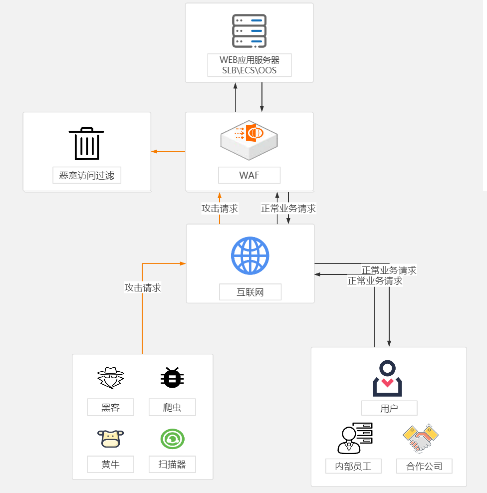
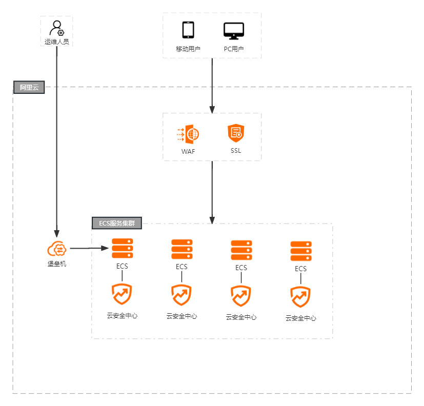

# 1、Web应用防火墙WAF

## 1.1、什么是WAF

- Web应用防火墙（Web Application Firewall，简称WAF）
- 对网站或者App的业务流量进行恶意特征识别及防护，在对流量清洗和过滤后，将正常、安全的流量发送给服务器，避免网站服务器被恶意入侵导致性能异常等问题，从而保障网站的业务安全和数据安全。

阿里云WAF图：

## 1.2、CC攻击原理与防护

CC攻击是DDOS攻击的一种，是一种常见的网站攻击方法，攻击者通过代理服务器向受害主机不停访问，造成服务器资源耗尽，一直到宕机崩溃。

CC攻击利用代理服务器向网站发送大量需要较长计算时间的URL请求，如数据库查询等，导致服务器进行大量计算而很快达到自身的处理能力而形成DDOS。而攻击者一旦发送请求给代理后就主动断开连接，因为代理并不因为客户端这边连接的断开就不去连接目标服务器，因此攻击机的资源消耗相对很小，而从目标服务器看来，来自代理的请求都是合法的。

- DDoS是针对IP的攻击，而CC攻击的是网页
- DDos可以用硬件防火墙来过滤攻击，CC攻击本身的请求就是正常的请求，硬件防火墙对他起不到很好的防御效果。

CC攻击的常用防护方式：

1. 云WAF
   - 思路很简单，就是用户访问你的域名时，会经过WAF的代理扫描，发现问题直接拦下，没问题的话就把用户请求转到你的网站。
   - 优点：安装配置快速，大公司产品保障好
   - 缺点：WAF有绕过的风险，WAF对网站的保护主要是通过反向代理来实现，如果不经过这个代理，自然就无法防护网站，所以，攻击者如果找到方法可以获取网站的IP，那么就可以绕过WAF而直接攻击。并且如果您的网站访问数据属于保密信息，就不能使用WAF了。

2. web服务器端区分攻击者与正常访客：通过分析网站日志，基本可以分辨出哪个IP是CC攻击的
   - 例如普通浏览者访问一个网页，必定会连续抓取网页的HTML、CSS、JS和图片等一系列的相关文件，而CC攻击是通过程序来抓取网页，仅仅只会抓取一个URL地址的文件，不会抓取其他类型的文件。所以通过辨别攻击者的IP，进行屏蔽，就可以起到很好的防范效果。
3. 🔥限制IP连接数：**一般正常的浏览者肯定不会在一秒内连续多次极快的访问同一个页面，可以配置web服务器，限定ip访问频率**

> 对于攻击者而言，可以使用代理工具不断变换自己的ip来进行攻击。
>
> - [快代理](https://www.kuaidaili.com/)

