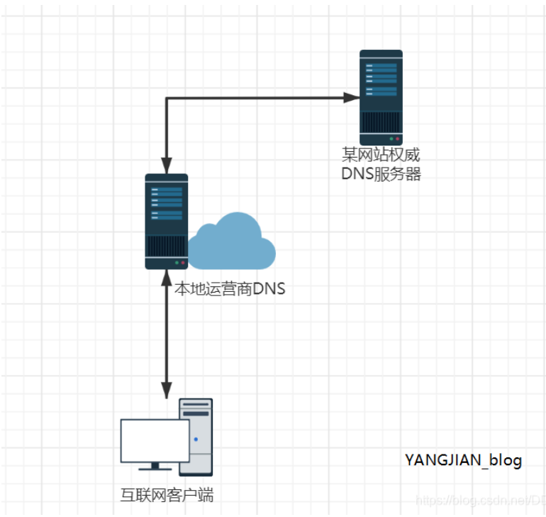
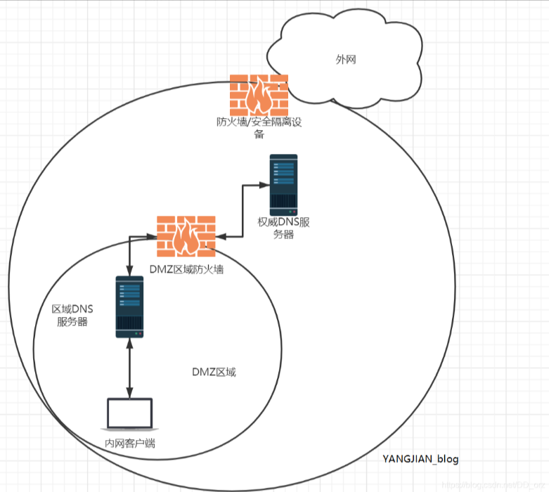

# 1、域名分层

在互联网的世界里，域名是至关重要的标识符。它们不仅为网站提供了唯一且特定的地址，还反映了网站的组织结构、地理位置或业务类型。通常，我们可以根据域名中的不同层次来区分一级域名、二级域名和三级域名。这篇文章将详细解释这三个概念，并简单说明如何区分它们。

- **顶级域名就是一级域名**，比如： `.com`，`.net`，`.edu` 等，一级域名是由互联网域名管理机构（如 ICANN）进行注册和管理的，它们是互联网中的根域名。
- **二级域名**：二级域名位于一级域名之下，通常是在一级域名之前添加一个子域名。例如：`example.com` 中，`example` 就是二级域名。二级域名可以由组织或个人注册，用于标识特定的网站或服务。
- **三级域名**：三级域名位于二级域名之下，通常是在二级域名之前再添加一个子域名。例如，在 `blog.example.com` 中，`blog` 就是三级域名。三级域名通常用于区分同一网站内的不同部分或子网站。
- **四级域名**：四级域名是指在三级域名之下再添加一个子域名，形式类似于 `subdomain.blog.example.com`。然而，在实际使用中，通常不会出现四级域名，因为它们会使域名结构复杂化，而且较少被使用。

总结来说，一级域名、二级域名和三级域名是互联网地址的不同层次，它们分别代表了不同的级别和信息。

1. 一级域名通常表示一个国家、地区或特定的行业；
2. 二级域名通常是自定义的，表示公司、产品或服务的名称；
3. 三级域名则通常用于定义特定的网页或子网站。

## 1.1、示例

1. `www.example.com `是几级域名

答：

`www.example.com` 是三级域名。在这个域名中：

- `com` 是一级域名（顶级域名）。
- `example` 是二级域名。
- `www` 是三级域名。

每一级域名用点号（.）分隔，域名的级别是根据这些点号的数量来确定的。所以，`www.example.com` 中有两个点号，意味着有三个域名级别。

# 2、域名缓存

举个例子：

1. 你搭建了一个权威DNS服务器，这个服务器需要处理用户终端发起的域名查询请求
2. 假如用户量很大，访问域名频繁，或者说有些接口需要频繁调用网站域名的情况，那用户每次调用都去请求解析不太合理，DNS权威服务器也有负担
3. 所以一般DNS服务器在下发解析的时候是带有缓存时间的（10min或者是1h，主要由DNS服务器决定），而且这个缓存是下发到**用户终端、用户终端、用户终端**上的，**所以用户在访问域名的第一步不是直接去查解析，而是查本地host文件，然后是看缓存是否有这个解析记录，都没有的话才去请求解析**。

所以在公司比较常见到这种情况，**内网和公网域名切换的时效问题。**

## 2.1、内网环境

- 因为是在内部局域网搭建的DNS，这个缓存时间我们是可控的
- 比如我们域名为1h缓存时间，如果有的应用域名指向关系需要修改，又想要做到快速切换，那么我们就先将这个域名的缓存时间改成30s，然后等1h后再做域名指向关系的更改，这样下一次的缓存就会是30s

## 2.2、外网环境

用户在请求公司域名前，是会经过运营商的DNS，实际用户的缓存时间可能是由运营商下发的，那么就会存在问题：我改了缓存时间为30s，但运营商那边做了操作，下发给用户是1h

> 所以外网缓存要想做到秒级切换是不大可能

## 2.3、其他情况

图中内网也存在隔离环境的DMZ区域，所以外网访问先经过权威DNS服务器，之后再经过区域DNS服务器作解析。

