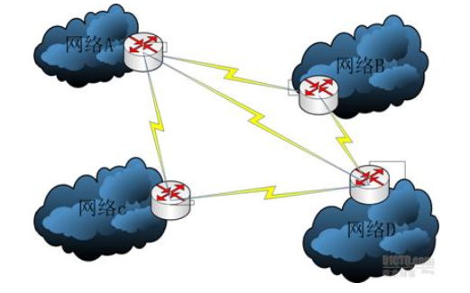

# 1、网关和路由器

> 现在，路由器集成了网关的功能，所以路由器也具有网关的功能。

1. 假设只有两个网络，网络A和网络B：
   - 要使网络A和网络B能够通信，只使用**网关**将这两个网络连接即可，因为只有两个网络，不需要决定网络间最短路径。
   - 从网关和路由器的定义来看，如果只是简单地连接两个网络，那么只需要网关就足够了。

> 如果需要连接多个网络，为了保证网络的可靠性，网络结构需要设计为全网状或部分网状，这样，为了网络间的通信，需要网关和路由器两种设备，**因为当前路由器集成了网关的功能，所以只使用路由器一种设备就可以了。**

2. 假定有4个网络：网络A、网络B、网络C、网络D
   - 要使这4个网络之间能够通信，另外为了保证网络的可靠性，将这4个网络进行全网状连接
   - **每个网络配置一个路由器**

## 1.1、默认网关

有时在Windows中设置网络时，我们经常会看到"默认网关"的设置。

- **默认网关指计算机所在网络边界的网关或路由器**，因为只有网关和路由器才知道如何到达其他网络。
- 对于网络内部的计算机来说，只有知道了默认网关的位置才能和网络外部通信。
- 所以默认网关是一个很重要的设置。但大多数情况下不需要我们手动设置，因为网络中的DHCP服务器可以自动提供默认网关的位置。

> [!INFO]
> 网关是一个概念。路由器是实现网关的一种设备。

